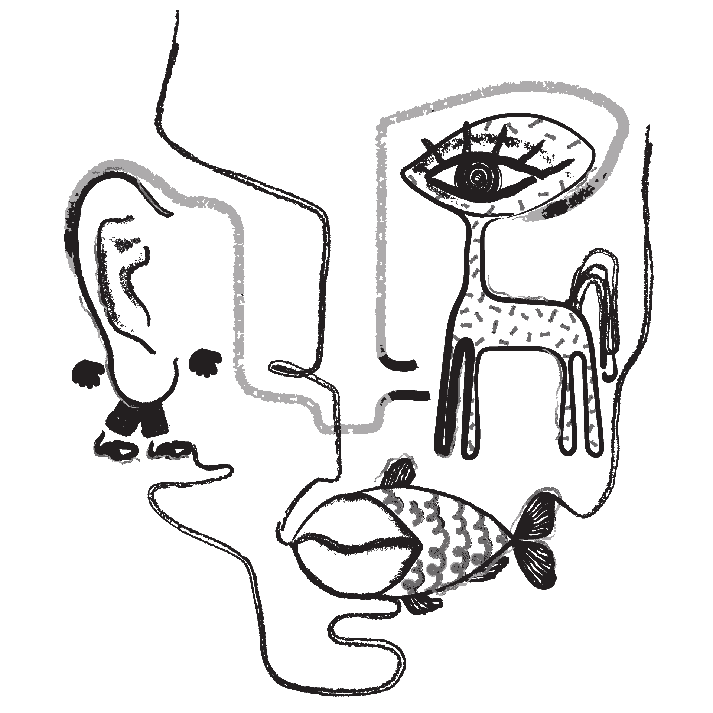

<svg xmlns="http://www.w3.org/2000/svg" viewBox="0 0 1440 320">
<path fill="#273036" fill-opacity="1" d="M0,256L21.8,240C43.6,224,87,192,131,197.3C174.5,203,218,245,262,234.7C305.5,224,349,160,393,117.3C436.4,75,480,53,524,64C567.3,75,611,117,655,133.3C698.2,149,742,139,785,133.3C829.1,128,873,128,916,138.7C960,149,1004,171,1047,149.3C1090.9,128,1135,64,1178,48C1221.8,32,1265,64,1309,106.7C1352.7,149,1396,203,1418,229.3L1440,256L1440,0L1418.2,0C1396.4,0,1353,0,1309,0C1265.5,0,1222,0,1178,0C1134.5,0,1091,0,1047,0C1003.6,0,960,0,916,0C872.7,0,829,0,785,0C741.8,0,698,0,655,0C610.9,0,567,0,524,0C480,0,436,0,393,0C349.1,0,305,0,262,0C218.2,0,175,0,131,0C87.3,0,44,0,22,0L0,0Z"></path>
</svg>
    

<h1 align=center > অবসর ( ABOSAR ) </h1>

**A Collection Of Short Bengali Stories Web Scraped From Various Bengali
eMagazines And eNewspapers**

<h4> stories are added every Sunday on 8 A.M. automatically ( CRON jobs and Github CI) </h4>

## SOURCES

1. https://www.anandabazar.com/supplementary/rabibashoriyo/
2. https://www.prothomalo.com/onnoalo

( more will be added soon )

## INDEX
|     | রবিবাসরীয়                                                                                                                           | অন্য আলো                                                                                                                                          |
|----:|:------------------------------------------------------------------------------------------------------------------------------------|:--------------------------------------------------------------------------------------------------------------------------------------------------|
|   0 | [ তারা ও আমি - সর্বাণী বন্দ্যোপাধ্যায় ](./stories/rabibasariya/তারা-ও-আমি.md)                                                       | [ যুদ্ধদিনে - মিজানুর রহমান নাসিম ](./stories/onnoalo/যুদ্ধদিনে-মিজানুর-রহমান-নাসিম.md)                                                           |
|   1 | [ গুপিনাথ - বাপ্পাদিত্য চট্টোপাধ্যায় ](./stories/rabibasariya/গুপিনাথ.md)                                                           | [ যে কারণে আমি কথা বলি না - আদনান মুকিত ](./stories/onnoalo/যে-কারণে-আমি-কথা-বলি-না-আদনান-মুকিত.md)                                               |
|   2 | [ ঋণমুক্তি - উজ্জ্বল রায় ](./stories/rabibasariya/ঋণমুক্তি.md)                                                                      | [ বঙ্গবন্ধুকে যেভাবে গ্রেপ্তার করা হয়েছিল - আনিসুল হক ](./stories/onnoalo/বঙ্গবন্ধুকে-যেভাবে-গ্রেপ্তার-করা-হয়েছিল-আনিসুল-হক.md)                   |
|   3 | [ নীড় - অ্যাঞ্জেলিকা ভট্টাচার্য ](./stories/rabibasariya/নীড়.md)                                                                    | [ ঢেউ - জহির রায়হান ](./stories/onnoalo/ঢেউ-জহির-রায়হান.md)                                                                                       |
|   4 | [ রসিক বিবি - সুস্মিতা নাথ ](./stories/rabibasariya/রসিক-বিবি.md)                                                                   | [ হন্ত্রক - এনামুল রেজা ](./stories/onnoalo/হন্ত্রক-এনামুল-রেজা.md)                                                                               |
|   5 | [ মানুষের ঘরবাড়ি - ঝর্ণা সান্যাল ](./stories/rabibasariya/মানুষের-ঘরবাড়ি.md)                                                        | [ আমার কোনো নাম নেই - শুভাশিস সিনহা ](./stories/onnoalo/আমার-কোনো-নাম-নেই-শুভাশিস-সিনহা.md)                                                       |
|   6 | [ পায়ে পায়ে - দেবব্রত পাল ](./stories/rabibasariya/পায়ে-পায়ে.md)                                                                    | [ জলপদ্ম - কাজী জাওয়াদ ](./stories/onnoalo/জলপদ্ম-কাজী-জাওয়াদ.md)                                                                                 |
|   7 | [ হাওয়া বদল - দেবদীপ মজুমদার ](./stories/rabibasariya/হাওয়া-বদল.md)                                                                 | [ একদিন মিষ্টিতে বিকেলে - মো. সাইফুল্লাহ ](./stories/onnoalo/একদিন-মিষ্টিতে-বিকেলে-মো.-সাইফুল্লাহ.md)                                             |
|   8 | [ প্রশাসক প্রস্তুত - রাজশ্রী বসু অধিকারী ](./stories/rabibasariya/প্রশাসক-প্রস্তুত.md)                                              | [ কে কথা কয় - আনিসুল হক ](./stories/onnoalo/কে-কথা-কয়-আনিসুল-হক.md)                                                                               |
|   9 | [ চুলোচুলি - রজতশুভ্র মজুমদার ](./stories/rabibasariya/চুলোচুলি.md)                                                                 | [ দুনিয়া - আব্দুল্লাহ আল মুক্তাদির ](./stories/onnoalo/দুনিয়া-আব্দুল্লাহ-আল-মুক্তাদির.md)                                                         |
|  10 | [ পূর্বাশ্রম - দেবকীনন্দন বন্দ্যোপাধ্যায় ](./stories/rabibasariya/পূর্বাশ্রম.md)                                                    | [ জানালার গান - আহমেদ মুনির ](./stories/onnoalo/জানালার-গান-আহমেদ-মুনির.md)                                                                       |
|  11 | [ শব্দটা জরুরি - রিমি মুৎসুদ্দি ](./stories/rabibasariya/শব্দটা-জরুরি.md)                                                           | [ ফুলের ব্যাপারে আমার বিশেষ কোনো আগ্রহ নেই - আলভী আহমেদ ](./stories/onnoalo/ফুলের-ব্যাপারে-আমার-বিশেষ-কোনো-আগ্রহ-নেই-আলভী-আহমেদ.md)               |
|  12 | [ শরীর - সিজার বাগচী ](./stories/rabibasariya/শরীর.md)                                                                              | [ রূপান্তর - নিয়াজ মেহেদী ](./stories/onnoalo/রূপান্তর-নিয়াজ-মেহেদী.md)                                                                           |
|  13 | [ কবিতার ঘর - দিলীপ মাশ্চরক ](./stories/rabibasariya/কবিতার-ঘর.md)                                                                  | [ ঘুরপাক - নাহার মনিকা ](./stories/onnoalo/ঘুরপাক-নাহার-মনিকা.md)                                                                                 |
|  14 | [ ইনক্রিমেন্ট - সৌরভ মুখোপাধ্যায় ](./stories/rabibasariya/ইনক্রিমেন্ট.md)                                                           | [ গিনিপিগ - আনিসুর রহমান	 ](./stories/onnoalo/গিনিপিগ-আনিসুর-রহমান.md)                                                                            |
|  15 | [ ভ্যালেন্টাইননামা - কৃষ্ণেন্দু মুখোপাধ্যায় ](./stories/rabibasariya/ভ্যালেন্টাইননামা.md)                                           | [ জিহ্বা হারিয়ে যায় - শাহ্নাজ মুন্নী ](./stories/onnoalo/জিহ্বা-হারিয়ে-যায়-শাহ্নাজ-মুন্নী.md)                                                     |
|  16 | [ পুতুল - কৌশিক ঘোষ ](./stories/rabibasariya/পুতুল.md)                                                                              | [ সকাল আটটা - আফসানা বেগম ](./stories/onnoalo/সকাল-আটটা-আফসানা-বেগম.md)                                                                           |
|  17 | [ মা - মৃত্যুঞ্জয় দেবনাথ ](./stories/rabibasariya/মা.md)                                                                            | [ দুই হোটেল - নিয়াজ মেহেদী ](./stories/onnoalo/দুই-হোটেল-নিয়াজ-মেহেদী.md)                                                                         |
|  18 | [ রামধনু - জয়িতা সেনগুপ্ত ](./stories/rabibasariya/রামধনু.md)                                                                       | [ ঘুড়ি প্রজাপতি - আশান উজ জামান ](./stories/onnoalo/ঘুড়ি-প্রজাপতি-আশান-উজ-জামান.md)                                                               |
|  19 | [ কাঁথা - স্বপনকুমার মণ্ডল ](./stories/rabibasariya/কাঁথা.md)                                                                       | [ জল ডাকে - ধ্রুব এষ ](./stories/onnoalo/জল-ডাকে-ধ্রুব-এষ.md)                                                                                     |
|  20 | [ শিউলি - গৌতম দে ](./stories/rabibasariya/শিউলি.md)                                                                                | [ অভিশপ্ত - মোহাম্মদ মোহাইমিনুল ইসলাম ](./stories/onnoalo/অভিশপ্ত-মোহাম্মদ-মোহাইমিনুল-ইসলাম.md)                                                   |
|  21 | [ লুকোচুরি - শুভাশিস মল্লিক ](./stories/rabibasariya/লুকোচুরি.md)                                                                   | [ ৪: ১ - আলভী আহমেদ ](./stories/onnoalo/৪-১-আলভী-আহমেদ.md)                                                                                        |
|  22 | [ মায়াটান - বর্ষা পূততুণ্ড ](./stories/rabibasariya/মায়াটান.md)                                                                     | [ কীটকর্তব্যবিমূঢ় - আহমেদ খান ](./stories/onnoalo/কীটকর্তব্যবিমূঢ়-আহমেদ-খান.md)                                                                   |
|  23 | [ বশীকরণ - উপল পাত্র ](./stories/rabibasariya/বশীকরণ.md)                                                                            | [ কাগজের বউ - আলম সিদ্দিকী ](./stories/onnoalo/কাগজের-বউ-আলম-সিদ্দিকী.md)                                                                         |
|  24 | [ সায়াহ্নে - রাখী নাথ কর্মকার ](./stories/rabibasariya/সায়াহ্নে.md)                                                                 | [ লুপ্ত গ্রামের ডাক  - এনামুল রেজা ](./stories/onnoalo/লুপ্ত-গ্রামের-ডাক--এনামুল-রেজা.md)                                                         |
|  25 | [ জ্যোৎস্নাভুক - জয়দীপ চক্রবর্তী ](./stories/rabibasariya/জ্যোৎস্নাভুক.md)                                                          | [ এক ঢিলে তিন পাখি - আহসান হাবীব ](./stories/onnoalo/এক-ঢিলে-তিন-পাখি-আহসান-হাবীব.md)                                                             |
|  26 | [ হাতে আঁকা ছবি - বিতান সিকদার ](./stories/rabibasariya/হাতে-আঁকা-ছবি.md)                                                           | [ নতুন বছর এক বছরের বেশি টেকে না - রাজীব সরকার ](./stories/onnoalo/নতুন-বছর-এক-বছরের-বেশি-টেকে-না-রাজীব-সরকার.md)                                 |
|  27 | [ সবুজ হলুদ দেশে - শাশ্বতী নন্দী ](./stories/rabibasariya/সবুজ-হলুদ-দেশে.md)                                                        | [ তিষ্ঠ ক্ষণকাল - তাপস রায় ](./stories/onnoalo/তিষ্ঠ-ক্ষণকাল-তাপস-রায়.md)                                                                         |
|  28 | [ গুপ্তধন - হিমি মিত্র রায় ](./stories/rabibasariya/গুপ্তধন.md)                                                                     | [ রবিবার - নুসরৎ নওরিন ](./stories/onnoalo/রবিবার-নুসরৎ-নওরিন.md)                                                                                 |
|  29 | [ ভেজা তোয়ালে - সাগরিকা রায় ](./stories/rabibasariya/ভেজা-তোয়ালে.md)                                                                | [ কবরে ছড়ানো বুনো ফুল - সেলিনা হোসেন ](./stories/onnoalo/কবরে-ছড়ানো-বুনো-ফুল-সেলিনা-হোসেন.md)                                                   |
|  30 | [ পাখসাট - নন্দিতা বাগচী ](./stories/rabibasariya/পাখসাট.md)                                                                        | [ বুঙ্গাশিকারি - ওয়াসি আহমেদ ](./stories/onnoalo/বুঙ্গাশিকারি-ওয়াসি-আহমেদ.md)                                                                     |
|  31 | [ অবোধ স্নেহ - রিমা বিশ্বাস ](./stories/rabibasariya/অবোধ-স্নেহ.md)                                                                 | [ যে কারণে আমি কথা বলি না - আদনান মুকিত ](./stories/onnoalo/যে-কারণে-আমি-কথা-বলি-না-আদনান-মুকিত.md)                                               |
|  32 | [ লাল সাইকেল - স্মরণজিৎ চক্রবর্তী ](./stories/rabibasariya/লাল-সাইকেল.md)                                                           | [ লাভ ডিটেক্টর - মোস্তফা তানিম ](./stories/onnoalo/লাভ-ডিটেক্টর-মোস্তফা-তানিম.md)                                                                 |
|  33 | [ চৈত্র - জয়শীলা গুহ বাগচী ](./stories/rabibasariya/চৈত্র.md)                                                                       | [ যুদ্ধদিনে - মিজানুর রহমান নাসিম ](./stories/onnoalo/যুদ্ধদিনে-মিজানুর-রহমান-নাসিম.md)                                                           |
|  34 | [ ফটোশপ - সুতপন চটোপাধ্যায় ](./stories/rabibasariya/ফটোশপ.md)                                                                       | [ বঙ্গবন্ধুকে যেভাবে গ্রেপ্তার করা হয়েছিল - আনিসুল হক ](./stories/onnoalo/বঙ্গবন্ধুকে-যেভাবে-গ্রেপ্তার-করা-হয়েছিল-আনিসুল-হক.md)                   |
|  35 | [ ছোটগল্প - সমীর দাস ](./stories/rabibasariya/ছোটগল্প.md)                                                                           | [ আজগুবি - সুমন্ত আসলাম ](./stories/onnoalo/আজগুবি-সুমন্ত-আসলাম.md)                                                                               |
|  36 | [ না-দেখা স্বপ্ন - অংশু পাণিগ্রাহী ](./stories/rabibasariya/না-দেখা-স্বপ্ন.md)                                                      | [ ঢেউ - জহির রায়হান ](./stories/onnoalo/ঢেউ-জহির-রায়হান.md)                                                                                       |
|  37 | [ দিন চুরি - রূপক মিশ্র ](./stories/rabibasariya/দিন-চুরি.md)                                                                       | [ নতুন বছর! - আহসান হাবীব ](./stories/onnoalo/নতুন-বছর!-আহসান-হাবীব.md)                                                                           |
|  38 | [ সেই রাতে - ইমন চৌধুরী ](./stories/rabibasariya/সেই-রাতে.md)                                                                       | [ ঘোর - হামীম কামরুল হক ](./stories/onnoalo/ঘোর-হামীম-কামরুল-হক.md)                                                                               |
|  39 | [ একটু সময় নেব - সৌরদীপ্ত সেন ](./stories/rabibasariya/একটু-সময়-নেব.md)                                                             | [ হন্ত্রক - এনামুল রেজা ](./stories/onnoalo/হন্ত্রক-এনামুল-রেজা.md)                                                                               |
|  40 | [ মেহের এখন শুটিং ফ্লোরে - মৌসুমী বিলকিস ](./stories/rabibasariya/মেহের-এখন-শুটিং-ফ্লোরে.md)                                        | [ প্রতিশোধ - ইকরাম কবীর ](./stories/onnoalo/প্রতিশোধ-ইকরাম-কবীর.md)                                                                               |
|  41 | [ রাশিফল - শীর্ষ বন্দ্যোপাধ্যায় ](./stories/rabibasariya/রাশিফল.md)                                                                 | [ আমার কোনো নাম নেই - শুভাশিস সিনহা ](./stories/onnoalo/আমার-কোনো-নাম-নেই-শুভাশিস-সিনহা.md)                                                       |
|  42 | [ হস্তরেখায় বিপদ-আপদ - অনিন্দ্যবুকু চট্টোপাধ্যায় ](./stories/rabibasariya/হস্তরেখায়-বিপদ-আপদ.md)                                    | [ জলপদ্ম - কাজী জাওয়াদ ](./stories/onnoalo/জলপদ্ম-কাজী-জাওয়াদ.md)                                                                                 |
|  43 | [ সহযাত্রী - দিলীপ মাশ্চরক ](./stories/rabibasariya/সহযাত্রী.md)                                                                    | [ একদিন মিষ্টিতে বিকেলে - মো. সাইফুল্লাহ ](./stories/onnoalo/একদিন-মিষ্টিতে-বিকেলে-মো.-সাইফুল্লাহ.md)                                             |
|  44 | [ মায়া প্রপঞ্চময় - কানাইলাল ঘোষ ](./stories/rabibasariya/মায়া-প্রপঞ্চময়.md)                                                         | [ প্রেম, ২০১৮ - বিজয় আহমেদ ](./stories/onnoalo/প্রেম,-২০১৮-বিজয়-আহমেদ.md)                                                                         |
|  45 | [ এক ঝলক রোদ্দুর - শান্তা মুখোপাধ্যায় ](./stories/rabibasariya/এক-ঝলক-রোদ্দুর.md)                                                   | [ কে কথা কয় - আনিসুল হক ](./stories/onnoalo/কে-কথা-কয়-আনিসুল-হক.md)                                                                               |
|  46 | [ নির্বাচন - বিপুল রায় ](./stories/rabibasariya/নির্বাচন.md)                                                                        | [ দুনিয়া - আব্দুল্লাহ আল মুক্তাদির ](./stories/onnoalo/দুনিয়া-আব্দুল্লাহ-আল-মুক্তাদির.md)                                                         |
|  47 | [ আমার যা আছে - অম্লানকুসুম চক্রবর্তী ](./stories/rabibasariya/আমার-যা-আছে.md)                                                      | [ জানালার গান - আহমেদ মুনির ](./stories/onnoalo/জানালার-গান-আহমেদ-মুনির.md)                                                                       |
|  48 | [ বন্ধু - সায়ন চক্রবর্তী ](./stories/rabibasariya/বন্ধু.md)                                                                         | [ ফুলের ব্যাপারে আমার বিশেষ কোনো আগ্রহ নেই - আলভী আহমেদ ](./stories/onnoalo/ফুলের-ব্যাপারে-আমার-বিশেষ-কোনো-আগ্রহ-নেই-আলভী-আহমেদ.md)               |
|  49 | [ মায়াজাল - কমলেশ কুমার ](./stories/rabibasariya/মায়াজাল.md)                                                                        | [ রূপান্তর - নিয়াজ মেহেদী ](./stories/onnoalo/রূপান্তর-নিয়াজ-মেহেদী.md)                                                                           |
|  50 | [ নৈর্ঋতে ভয় - মহুয়া চৌধুরী ](./stories/rabibasariya/নৈর্ঋতে-ভয়.md)                                                                 | [ ইন্টারভিউ - unknown ](./stories/onnoalo/ইন্টারভিউ-unknown.md)                                                                                   |
|  51 | [ কাঠিবাজি - পারিজাত দত্ত ](./stories/rabibasariya/কাঠিবাজি.md)                                                                     | [ ব্ল্যাকহোল - আলভী আহমেদ ](./stories/onnoalo/ব্ল্যাকহোল-আলভী-আহমেদ.md)                                                                           |
|  52 | [ বৈকুণ্ঠপুর হল্ট - পার্থ দে ](./stories/rabibasariya/বৈকুণ্ঠপুর-হল্ট.md)                                                           | [ হাসান আজিজুল হকের শেষ গল্প - unknown ](./stories/onnoalo/হাসান-আজিজুল-হকের-শেষ-গল্প-unknown.md)                                                 |
|  53 | [ নিজস্বী - পার্থ সরকার ](./stories/rabibasariya/নিজস্বী.md)                                                                        | [ জিজ্ঞাসাবাদ - উম্মে ফারহানা ](./stories/onnoalo/জিজ্ঞাসাবাদ-উম্মে-ফারহানা.md)                                                                   |
|  54 | [ ফ্রেন্ডশিপ ব্যান্ড - অভিজিৎ তরফদার ](./stories/rabibasariya/ফ্রেন্ডশিপ-ব্যান্ড.md)                                                | [ তাম্বুল রাতুল হৈল - নাবিল মুহতাসিম ](./stories/onnoalo/তাম্বুল-রাতুল-হৈল-নাবিল-মুহতাসিম.md)                                                     |
|  55 | [ সমুদ্রের কান্না - কৃষ্ণা দাস ](./stories/rabibasariya/সমুদ্রের-কান্না.md)                                                         | [ ছুতামিতি খেলা - হুমায়ূন শফিক ](./stories/onnoalo/ছুতামিতি-খেলা-হুমায়ূন-শফিক.md)                                                                 |
|  56 | [ পৌরাণিক - মহুয়া চৌধুরী ](./stories/rabibasariya/পৌরাণিক.md)                                                                       | [ এক দিন - আবদুলরাজাক গুরনাহ, ভূমিকা ও অনুবাদ: লুনা রুশদী ](./stories/onnoalo/এক-দিন-আবদুলরাজাক-গুরনাহ,-ভূমিকা-ও-অনুবাদ-লুনা-রুশদী.md)            |
|  57 | [ স্বপ্নে যা আসে - প্রসেনজিৎ সিংহ ](./stories/rabibasariya/স্বপ্নে-যা-আসে.md)                                                       | [ দুটি গল্প - রায়হান রাইন ](./stories/onnoalo/দুটি-গল্প-রায়হান-রাইন.md)                                                                           |
|  58 | [ পথে হল দেরি - বৈশাখী ঠাকুর ](./stories/rabibasariya/পথে-হল-দেরি.md)                                                               | [ ডাইনি - আহমেদ খান ](./stories/onnoalo/ডাইনি-আহমেদ-খান.md)                                                                                       |
|  59 | [ চিঠি - সুস্মিতা নাথ ](./stories/rabibasariya/চিঠি.md)                                                                             | [ ‘লিখে খাওয়া’ লেখকের দক্ষিণা - সারফুদ্দিন আহমেদ ](./stories/onnoalo/‘লিখে-খাওয়া’-লেখকের-দক্ষিণা-সারফুদ্দিন-আহমেদ.md)                             |
|  60 | [ নলিনাক্ষ মৈত্রের ডায়েরি - জয় সেনগুপ্ত ](./stories/rabibasariya/নলিনাক্ষ-মৈত্রের-ডায়েরি.md)                                        | [ জয় বাংলার ভাত - আনিসুল হক ](./stories/onnoalo/জয়-বাংলার-ভাত-আনিসুল-হক.md)                                                                       |
|  61 | [ রজনীগন্ধার চারা - সোহিনী দাস ](./stories/rabibasariya/রজনীগন্ধার-চারা.md)                                                         | [ দৈত্যর সাইক্লোন - আদনান মুকিত ](./stories/onnoalo/দৈত্যর-সাইক্লোন-আদনান-মুকিত.md)                                                             |
|  62 | [ বাইক বয় - শাশ্বতী নন্দী ](./stories/rabibasariya/বাইক-বয়.md)                                                                      | [ সঞ্চয় - জয়দীপ দে ](./stories/onnoalo/সঞ্চয়-জয়দীপ-দে.md)                                                                                         |
|  63 | [ তারা তিন বোন - ঋতা বসু ](./stories/rabibasariya/তারা-তিন-বোন.md)                                                                  | [ একটি চমৎকার হাসির গল্প - সৈকত দে ](./stories/onnoalo/একটি-চমৎকার-হাসির-গল্প-সৈকত-দে.md)                                                         |
|  64 | [ উপলব্ধি - আনন্দদীপ চৌধুরী ](./stories/rabibasariya/উপলব্ধি.md)                                                                    | [ জলবৎ তরলং - অন্য আলো ডেস্ক ](./stories/onnoalo/জলবৎ-তরলং-অন্য-আলো-ডেস্ক.md)                                                                     |
|  65 | [ স্বীকারোক্তি - সিদ্ধার্থ মুখোপাধ্যায় ](./stories/rabibasariya/স্বীকারোক্তি.md)                                                    | [ প্রথম প্রেম - আশান উজ জামান ](./stories/onnoalo/প্রথম-প্রেম-আশান-উজ-জামান.md)                                                                   |
|  66 | [ সরাসরি সম্প্রচার - প্রসেনজিৎ সিংহ ](./stories/rabibasariya/সরাসরি-সম্প্রচার.md)                                                   | [ হেঁয়ালি - আসিফ নজরুল ](./stories/onnoalo/হেঁয়ালি-আসিফ-নজরুল.md)                                                                                 |
|  67 | [ পোর্ট্রেট - মোনালিসা চন্দ্র ](./stories/rabibasariya/পোর্ট্রেট.md)                                                                | [ যেভাবে আমরা গ্রামে কুমির এনেছিলাম - আনিসুল হক ](./stories/onnoalo/যেভাবে-আমরা-গ্রামে-কুমির-এনেছিলাম-আনিসুল-হক.md)                               |
|  68 | [ এক টুকরো কালিম্পং - অর্চনা গুপ্ত ](./stories/rabibasariya/এক-টুকরো-কালিম্পং.md)                                                   | [ অক্টোপাস - তানজিনা হোসেন ](./stories/onnoalo/অক্টোপাস-তানজিনা-হোসেন.md)                                                                         |
|  69 | [ জলপরি - বিজলী ঘোষ ](./stories/rabibasariya/জলপরি.md)                                                                              | [ সদগতি - মোহাম্মদ নাজিম উদ্দিন ](./stories/onnoalo/সদগতি-মোহাম্মদ-নাজিম-উদ্দিন.md)                                                               |
|  70 | [ নাটক - স্বর্ণাভ চৌধুরী ](./stories/rabibasariya/নাটক.md)                                                                          | [ প্রজাপতির নির্বন্ধ - সিরাজুল ইসলাম ](./stories/onnoalo/প্রজাপতির-নির্বন্ধ-সিরাজুল-ইসলাম.md)                                                     |
|  71 | [ সতেরো তলার ফ্ল্যাট - অচ্যুত দাস ](./stories/rabibasariya/সতেরো-তলার-ফ্ল্যাট.md)                                                   | [ রিয়া এবং তেলাপোকা–বিষয়ক - আহমেদ খান ](./stories/onnoalo/রিয়া-এবং-তেলাপোকা–বিষয়ক-আহমেদ-খান.md)                                                   |
|  72 | [ ভালবাসার স্বাদ নোনতা - পত্রলেখা নাথ ](./stories/rabibasariya/ভালবাসার--স্বাদ-নোনতা.md)                                            | [ এটা একটা প্রেমের গল্প হতে পারত - তানজিনা হোসেন ](./stories/onnoalo/এটা-একটা-প্রেমের-গল্প-হতে-পারত-তানজিনা-হোসেন.md)                             |
|  73 | [ এই মায়াটান - সুমন মহান্তি ](./stories/rabibasariya/এই-মায়াটান.md)                                                                 | [ ইনস্টাগ্রাম - নিয়াজ মেহেদী ](./stories/onnoalo/ইনস্টাগ্রাম-নিয়াজ-মেহেদী.md)                                                                     |
|  74 | [ খট্টাঙ্গপুরাণ - অনির্বাণ মজুমদার ](./stories/rabibasariya/খট্টাঙ্গপুরাণ.md)                                                       | [ মেঘভাঙা রোদ - মাসউদ আহমদ ](./stories/onnoalo/মেঘভাঙা-রোদ-মাসউদ-আহমদ.md)                                                                         |
|  75 | [ শাঁজুর মোড় - হুমায়ুন কবীর ](./stories/rabibasariya/শাঁজুর-মোড়.md)                                                                 | [ কালো পিঁপড়া - এ কে এম জাকারিয়া ](./stories/onnoalo/কালো-পিঁপড়া-এ-কে-এম-জাকারিয়া.md)                                                             |
|  76 | [ মধুবালা - দোলনচাঁপা দাশগুপ্ত ](./stories/rabibasariya/মধুবালা.md)                                                                 | [ ঘুম - নূরুল আলম আতিক ](./stories/onnoalo/ঘুম-নূরুল-আলম-আতিক.md)                                                                                 |
|  77 | [ গানপাখি - শাশ্বতী নন্দী ](./stories/rabibasariya/গানপাখি.md)                                                                      | [ অতিথি - মাসুদ খান ](./stories/onnoalo/অতিথি-মাসুদ-খান.md)                                                                                       |
|  78 | [ প্যান কার্ড - হর্ষ দত্ত ](./stories/rabibasariya/প্যান-কার্ড.md)                                                                  | [ এটাও ভাই-বোনেরই গল্প  - জাকির তালুকদার ](./stories/onnoalo/এটাও-ভাই-বোনেরই-গল্প--জাকির-তালুকদার.md)                                             |
|  79 | [ বৃষ্টির ছবি - অভিনন্দন সরকার ](./stories/rabibasariya/বৃষ্টির-ছবি.md)                                                             | [ বৈশাখী গিফট - আহসান হাবীব ](./stories/onnoalo/বৈশাখী-গিফট-আহসান-হাবীব.md)                                                                       |
|  80 | [ গল্পের ফেরিওয়ালা - দেবদুলাল কুণ্ডু ](./stories/rabibasariya/গল্পের-ফেরিওয়ালা.md)                                                  | [ ঘা - আহমেদ খান ](./stories/onnoalo/ঘা-আহমেদ-খান.md)                                                                                             |
|  81 | [ যবনিকা - নন্দিতা বাগচী ](./stories/rabibasariya/যবনিকা.md)                                                                        | [ তেইশে ফাল্গুন - আনোয়ারা আল্পনা ](./stories/onnoalo/তেইশে-ফাল্গুন-আনোয়ারা-আল্পনা.md)                                                             |
|  82 | [ অনুভব - চঞ্চলকুমার ঘোষ ](./stories/rabibasariya/অনুভব.md)                                                                        | [ পার্শ্ববর্তিনী - রায়হান রাইন ](./stories/onnoalo/পার্শ্ববর্তিনী-রায়হান-রাইন.md)                                                                 |
|  83 | [ নতুন প্রতিবেশী - বৈশাখী ঠাকুর ](./stories/rabibasariya/নতুন-প্রতিবেশী.md)                                                         | [ দুনিয়াতেই নেই - শেখ আবদুল হাকিম ](./stories/onnoalo/দুনিয়াতেই-নেই-শেখ-আবদুল-হাকিম.md)                                                           |
|  84 | [ আজ তিন তারিখ - প্রচেত গুপ্ত ](./stories/rabibasariya/আজ-তিন-তারিখ.md)                                                             | [ ব্লাইন্ড স্পট - আলভী আহমেদ ](./stories/onnoalo/ব্লাইন্ড-স্পট-আলভী-আহমেদ.md)                                                                     |
|  85 | [ বিপিন চৌধুরীর আত্মা - ভবতোষ নায়েক ](./stories/rabibasariya/বিপিন-চৌধুরীর-আত্মা.md)                                                | [ রুবি দাদি জুবি দাদি - সাগুফতা শারমীন তানিয়া  ](./stories/onnoalo/রুবি-দাদি-জুবি-দাদি-সাগুফতা-শারমীন-তানিয়া.md)                                  |
|  86 | [ ঝুমকি - ছন্দসী বন্দ্যোপাধ্যায় ](./stories/rabibasariya/ঝুমকি.md)                                                                  | [ ঘাম ও ঘাসের গন্ধ - শাহ্‌নাজ মুন্নী ](./stories/onnoalo/ঘাম-ও-ঘাসের-গন্ধ-শাহ্‌নাজ-মুন্নী.md)                                                     |
|  87 | [ প্রেমনীলার সংসার - রাজশ্রী বসু ](./stories/rabibasariya/প্রেমনীলার-সংসার.md)                                                      | [ লাল কাউল - উম্মে ফারহানা ](./stories/onnoalo/লাল-কাউল-উম্মে-ফারহানা.md)                                                                         |
|  88 | [ চাঁদের আলোয় - হুমায়ুন কবীর ](./stories/rabibasariya/চাঁদের-আলোয়.md)                                                               | [ বইমেলায় আমি আর কখনো যাব না - আনিসুল হক ](./stories/onnoalo/বইমেলায়-আমি-আর-কখনো-যাব-না-আনিসুল-হক.md)                                             |
|  89 | [ মৃত্যুদিবস - হেমন্ত জানা ](./stories/rabibasariya/মৃত্যুদিবস.md)                                                                  | [ প্রেমিক - নুসরৎ নওরিন ](./stories/onnoalo/প্রেমিক-নুসরৎ-নওরিন.md)                                                                               |
|  90 | [ ব্রজর দুঃখ - তমাল বন্দ্যোপাধ্যায় ](./stories/rabibasariya/ব্রজর-দুঃখ.md)                                                          | [ ছায়া - সাদাত হোসাইন ](./stories/onnoalo/ছায়া-সাদাত-হোসাইন.md)                                                                                   |
|  91 | [ বিপ্রতীপ - সুবর্ণ বসু ](./stories/rabibasariya/বিপ্রতীপ.md)                                                                       | [ কার্তিকের কুয়াশায় - জাহেদ মোতালেব ](./stories/onnoalo/কার্তিকের-কুয়াশায়-জাহেদ-মোতালেব.md)                                                       |
|  92 | [ পেরেন্টিং - নবনীতা দত্ত ](./stories/rabibasariya/পেরেন্টিং.md)                                                                    | [ ক্যাসেলস করিডর - ভাষা রায়হান ](./stories/onnoalo/ক্যাসেলস-করিডর-ভাষা-রায়হান.md)                                                                 |
|  93 | [ সরল সমীকরণ - পার্থ রায় ](./stories/rabibasariya/সরল-সমীকরণ.md)                                                                    | [ নিহা ও তরুণ - শিহাব সরকার ](./stories/onnoalo/নিহা-ও-তরুণ-শিহাব-সরকার.md)                                                                       |
|  94 | [ নীল তিমি - সুস্মিতা নাথ ](./stories/rabibasariya/নীল-তিমি.md)                                                                     | [ পার্টনার - তানজিনা হোসেন ](./stories/onnoalo/পার্টনার-তানজিনা-হোসেন.md)                                                                         |
|  95 | [ নবান্ন - ব্রততী সেন দাস ](./stories/rabibasariya/নবান্ন.md)                                                                       | [ মরিবার হলো তার সাধ - মাসউদ আহমাদ ](./stories/onnoalo/মরিবার-হলো-তার-সাধ-মাসউদ-আহমাদ.md)                                                         |
|  96 | [ আবর্ত - রীতা বড়ুয়া ](./stories/rabibasariya/আবর্ত.md)                                                                             | [ ষোলো, ষাট, তেষট্টি - বিশ্বজিৎ চৌধুরী ](./stories/onnoalo/ষোলো,-ষাট,-তেষট্টি-বিশ্বজিৎ-চৌধুরী.md)                                                 |
|  97 | [ ব্যাটারি পুতুল - দেবাশিস ভট্টাচার্য ](./stories/rabibasariya/ব্যাটারি-পুতুল.md)                                                   | [ জবাব! - আহসান হাবীব ](./stories/onnoalo/জবাব!-আহসান-হাবীব.md)                                                                                   |
|  98 | [ ব্যুমেরাং - উস্রি দে ](./stories/rabibasariya/ব্যুমেরাং.md)                                                                       | [ মিথিলার সঙ্গে চার দিন - আহমেদ খান ](./stories/onnoalo/মিথিলার-সঙ্গে-চার-দিন-আহমেদ-খান.md)                                                       |
|  99 | [ কৃপণ - সপ্তর্ষি বসু ](./stories/rabibasariya/কৃপণ.md)                                                                             | [ ফুলদানি, আপেল ও কিন্ডেল - আলভী আহমেদ ](./stories/onnoalo/ফুলদানি,-আপেল-ও-কিন্ডেল-আলভী-আহমেদ.md)                                                 |
| 100 | [ নেক্সট - শ্রীজিৎ সরকার ](./stories/rabibasariya/নেক্সট.md)                                                                        | [ চোখে চোখে - হুমায়ূন শফিক ](./stories/onnoalo/চোখে-চোখে-হুমায়ূন-শফিক.md)                                                                         |
| 101 | [ ভাড়াটে - শ্রাবণী কর্মকার ](./stories/rabibasariya/ভাড়াটে.md)                                                                    | [ ওহ্​ চিল - শরিফুল ইসলাম ভূঁইয়া ](./stories/onnoalo/ওহ্​-চিল-শরিফুল-ইসলাম-ভূঁইয়া.md)                                                             |
| 102 | [ মাদারি - সুবর্ণ বসু ](./stories/rabibasariya/মাদারি.md)                                                                           | [ দুটি অণুকাহন - রায়হান রাইন ](./stories/onnoalo/দুটি-অণুকাহন-রায়হান-রাইন.md)                                                                     |
| 103 | [ বাসাবদল - শতরূপা সান্যাল ](./stories/rabibasariya/বাসাবদল.md)                                                                     | [ কিং অব দ্য ইউনিভার্স - লুনা রুশদী ](./stories/onnoalo/কিং-অব-দ্য-ইউনিভার্স-লুনা-রুশদী.md)                                                       |
| 104 | [ জীবনের ধ্রুবতারা - রাখী নাথ কর্মকার ](./stories/rabibasariya/জীবনের-ধ্রুবতারা.md)                                                 | [ বাঘ এসেছে, বাঘ এসেছে, পালাও - জাভেদ হুসেন ](./stories/onnoalo/বাঘ-এসেছে,-বাঘ-এসেছে,-পালাও-জাভেদ-হুসেন.md)                                       |
| 105 | [ চন্দনবন - দোলনচাঁপা দাশগুপ্ত ](./stories/rabibasariya/চন্দনবন.md)                                                                 | [ জলপাথরের মন - আশান উজ জামান ](./stories/onnoalo/জলপাথরের-মন-আশান-উজ-জামান.md)                                                                   |
| 106 | [ অনিরুদ্ধর বাবা - শ্যামল মুখোপাধ্যায় ](./stories/rabibasariya/অনিরুদ্ধর-বাবা.md)                                                   | [ বিষাদ - রায়হান রাইন ](./stories/onnoalo/বিষাদ-রায়হান-রাইন.md)                                                                                   |
| 107 | [ সম্পর্ক - সিজার বাগচী ](./stories/rabibasariya/সম্পর্ক.md)                                                                        | [ বোনেদের বাড়ি - উম্মে ফারহানা ](./stories/onnoalo/বোনেদের-বাড়ি-উম্মে-ফারহানা.md)                                                                 |
| 108 | [ হাঁসের পালক - শ্রীকান্ত অধিকারী ](./stories/rabibasariya/হাঁসের-পালক.md)                                                          | [ অকালপীরিতি - সাগুফতা শারমীন তানিয়া ](./stories/onnoalo/অকালপীরিতি-সাগুফতা-শারমীন-তানিয়া.md)                                                     |
| 109 | [ চৈতি মেঘ - অরুণ কর ](./stories/rabibasariya/চৈতি-মেঘ.md)                                                                          | [ ক-তে কুজ্ঝটিকা - ওয়াসি আহমেদ ](./stories/onnoalo/ক-তে-কুজ্ঝটিকা-ওয়াসি-আহমেদ.md)                                                                 |
| 110 | [ ফ্রয়েডের বন্ধু - বিকাশ মুখোপাধ্যায় ](./stories/rabibasariya/ফ্রয়েডের-বন্ধু.md)                                                    | [ একটা রাতের গল্প - আহমেদ খান ](./stories/onnoalo/একটা-রাতের-গল্প-আহমেদ-খান.md)                                                                   |
| 111 | [ রেল কাম ঝমাঝম - জয়ন্ত সেনগুপ্ত ](./stories/rabibasariya/রেল-কাম-ঝমাঝম.md)                                                         | [ রাত দশটার ইংরেজি খবরের পরে - নাবিল মুহতাসিম ](./stories/onnoalo/রাত-দশটার-ইংরেজি-খবরের-পরে-নাবিল-মুহতাসিম.md)                                   |
| 112 | [ মরা নদীর কান্না - মঙ্গলপ্রসাদ মাইতি ](./stories/rabibasariya/মরা-নদীর-কান্না.md)                                                  | [ শ্রাবণের মেঘ - সাদাত হোসাইন ](./stories/onnoalo/শ্রাবণের-মেঘ-সাদাত-হোসাইন.md)                                                                   |
| 113 | [ শেষ নাহি যে - ইন্দ্রনীল সান্যাল ](./stories/rabibasariya/শেষ-নাহি-যে.md)                                                          | [ আবার জোছনায় - আফসানা বেগম ](./stories/onnoalo/আবার-জোছনায়-আফসানা-বেগম.md)                                                                       |
| 114 | [ ডেটিং অ্যাপ - কৌশিক পাল ](./stories/rabibasariya/ডেটিং-অ্যাপ.md)                                                                  | [ পৃথিবীর সব সুখ মিশে আছে গ্লাসে - আদনান মুকিত ](./stories/onnoalo/পৃথিবীর-সব-সুখ-মিশে-আছে-গ্লাসে-আদনান-মুকিত.md)                                 |
| 115 | [ শেষ নাহি যে - ইন্দ্রনীল সান্যাল ](./stories/rabibasariya/শেষ-নাহি-যে.md)                                                          | [ পয়সা - নিয়াজ মেহেদী ](./stories/onnoalo/পয়সা-নিয়াজ-মেহেদী.md)                                                                                   |
| 116 | [ ইন্দ্রনীল সান্যাল - ](./stories/rabibasariya/ইন্দ্রনীল-সান্যাল.md)                                                                | [ অন্তর্লীন অন্ধকার - স্মৃতি ভদ্র ](./stories/onnoalo/অন্তর্লীন-অন্ধকার-স্মৃতি-ভদ্র.md)                                                           |
| 117 | [ জন্মদিন - ঋভু চট্টোপাধ্যায় ](./stories/rabibasariya/জন্মদিন.md)                                                                   | [ লুঙ্গির ভেতর ১০০ দিন - আবুল মনসুর ](./stories/onnoalo/লুঙ্গির-ভেতর-১০০-দিন-আবুল-মনসুর.md)                                                       |
| 118 | [ ন্যারেশন চেঞ্জ - মানস সরকার ](./stories/rabibasariya/ন্যারেশন-চেঞ্জ.md)                                                           | [ ভুবনপুরের প্রজাপতি - সৈয়দ মনজুরুল ইসলাম ](./stories/onnoalo/ভুবনপুরের-প্রজাপতি-সৈয়দ-মনজুরুল-ইসলাম.md)                                           |
| 119 | [ ডাক্তারবাবু সব দেখছেন - অভিজিৎ দত্ত ](./stories/rabibasariya/ডাক্তারবাবু--সব-দেখছেন.md)                                           | [ দোলাচল - ক্ষমা মাহমুদ ](./stories/onnoalo/দোলাচল-ক্ষমা-মাহমুদ.md)                                                                               |
| 120 | [ রাজযোটক - চঞ্চল পাল ](./stories/rabibasariya/রাজযোটক.md)                                                                          | [ লোকটা - শিবব্রত বর্মন ](./stories/onnoalo/লোকটা-শিবব্রত-বর্মন.md)                                                                               |
| 121 | [ বন্ধ দরজা - প্রচেত গুপ্ত ](./stories/rabibasariya/বন্ধ-দরজা.md)                                                                   | [ যা কিছু ঘটবে বলে! - সৈকত শুভ্র আইচ ](./stories/onnoalo/যা-কিছু-ঘটবে-বলে!-সৈকত-শুভ্র-আইচ.md)                                                     |
| 122 | [ স্পেশাল এফেক্ট - রাজশ্রী বসু অধিকারী ](./stories/rabibasariya/স্পেশাল-এফেক্ট.md)                                                  | [ একটি খুনের স্বীকারোক্তি - মোজাফ্ফর হোসেন ](./stories/onnoalo/একটি-খুনের-স্বীকারোক্তি-মোজাফ্ফর-হোসেন.md)                                         |
| 123 | [ ডক্টর জি ভাগো - প্রকাশ চট্টোপাধ্যায় ](./stories/rabibasariya/ডক্টর-জি-ভাগো.md)                                                    | [ করোনা পজিটিভ! - আহসান হাবীব ](./stories/onnoalo/করোনা-পজিটিভ!-আহসান-হাবীব.md)                                                                   |
| 124 | [ চক্রব্যূহের দরজা - অরুণ কর ](./stories/rabibasariya/চক্রব্যূহের-দরজা.md)                                                          | [ ভবিষ্যতের ঈদ - আহসান হাবীব ](./stories/onnoalo/ভবিষ্যতের-ঈদ-আহসান-হাবীব.md)                                                                     |
| 125 | [ ঘড়ি - সুব্রত মজুমদার ](./stories/rabibasariya/ঘড়ি.md)                                                                             | [ ইউটিউবের গ্রামে একদিন - সারফুদ্দিন আহমেদ ](./stories/onnoalo/ইউটিউবের-গ্রামে-একদিন-সারফুদ্দিন-আহমেদ.md)                                         |
| 126 | [ সক্রেটিস - বীরেন শাসমল ](./stories/rabibasariya/সক্রেটিস.md)                                                                      | [ গোপন কথাটি - আনোয়ারা আল্পনা ](./stories/onnoalo/গোপন-কথাটি-আনোয়ারা-আল্পনা.md)                                                                   |
| 127 | [ রুমির বোন - পত্রলেখা নাথ ](./stories/rabibasariya/রুমির-বোন.md)                                                                   | [ আমার যাবার বেলায় - শাহ্‌নাজ মুন্নী ](./stories/onnoalo/আমার-যাবার-বেলায়-শাহ্‌নাজ-মুন্নী.md)                                                     |
| 128 | [ সন্ধিক্ষণ - কৌশিক বাঙ্গাল ](./stories/rabibasariya/সন্ধিক্ষণ.md)                                                                  | [ দ্বিখণ্ডিত - গাজী তানজিয়া ](./stories/onnoalo/দ্বিখণ্ডিত-গাজী-তানজিয়া.md)                                                                       |
| 129 | [ রঙ্গিণী - সর্বাণী বন্দ্যোপাধ্যায় ](./stories/rabibasariya/রঙ্গিণী.md)                                                             | [ হায়! বাড়তি মাশুল - অর্ণব সান্যাল ](./stories/onnoalo/হায়!-বাড়তি-মাশুল-অর্ণব-সান্যাল.md)                                                         |
| 130 | [ বেলার উপহার - ](./stories/rabibasariya/বেলার-উপহার.md)                                                                            | [ তাহাদের পাস-ফেল - সৈকত শুভ্র আইচ ](./stories/onnoalo/তাহাদের-পাস-ফেল-সৈকত-শুভ্র-আইচ.md)                                                         |
| 131 | [ দুরারোগ্য - রাখী নাথ কর্মকার ](./stories/rabibasariya/দুরারোগ্য.md)                                                               | [ মারি নিয়ে ঘর করি - হাসান আজিজুল হক ](./stories/onnoalo/মারি-নিয়ে-ঘর-করি-হাসান-আজিজুল-হক.md)                                                     |
| 132 | [ প্রতিশোধ - সাগরিকা দাস ](./stories/rabibasariya/প্রতিশোধ.md)                                                                      | [ এরা সুখের লাগি চাহে প্রেম - আহমেদ খান ](./stories/onnoalo/এরা-সুখের-লাগি-চাহে-প্রেম-আহমেদ-খান.md)                                               |
| 133 | [ রত্ন-প্রাপ্তি - সৌরভকুমার ভূঞ্যা ](./stories/rabibasariya/রত্ন-প্রাপ্তি.md)                                                       | [ লকডাউনে শোনা একটি ব্যর্থতার গল্প - মোহাম্মদ নাজিম উদ্দিন ](./stories/onnoalo/লকডাউনে-শোনা-একটি-ব্যর্থতার-গল্প-মোহাম্মদ-নাজিম-উদ্দিন.md)         |
| 134 | [ ন্যাচারাল ডেথ - সায়ন্তনী ভট্টাচার্য ](./stories/rabibasariya/ন্যাচারাল-ডেথ.md)                                                    | [ মন কোয়ারেন্টিন: আহাদ আদনানা - নিজস্ব প্রতিবেদক ](./stories/onnoalo/মন-কোয়ারেন্টিন-আহাদ-আদনানা-নিজস্ব-প্রতিবেদক.md)                              |
| 135 | [ গোধূলি - সায়ন চক্রবর্তী ](./stories/rabibasariya/গোধূলি.md)                                                                       | [ যদি এমন হতো: এম হৃদয় - নিজস্ব প্রতিবেদক ](./stories/onnoalo/যদি-এমন-হতো-এম-হৃদয়-নিজস্ব-প্রতিবেদক.md)                                            |
| 136 | [ পৌরুষ - দেবাশিস গঙ্গোপাধ্যায় ](./stories/rabibasariya/পৌরুষ.md)                                                                   | [ ভাঙা রাস্তা: রাকিব শিমূল - নিজস্ব প্রতিবেদক ](./stories/onnoalo/ভাঙা-রাস্তা-রাকিব-শিমূল-নিজস্ব-প্রতিবেদক.md)                                    |
| 137 | [ তর্পণ - শুভজিৎ ভাদুড়ী ](./stories/rabibasariya/তর্পণ.md)                                                                          | [ যন্ত্র: মারুফ মুহাম্মাদ - নিজস্ব প্রতিবেদক ](./stories/onnoalo/যন্ত্র-মারুফ-মুহাম্মাদ-নিজস্ব-প্রতিবেদক.md)                                      |
| 138 | [ অপদার্থ - তমাল বন্দ্যোপাধ্যায় ](./stories/rabibasariya/অপদার্থ.md)                                                                | [ মুক্তি: অনুপম চৌধুরী - নিজস্ব প্রতিবেদক ](./stories/onnoalo/মুক্তি-অনুপম-চৌধুরী-নিজস্ব-প্রতিবেদক.md)                                            |
| 139 | [ আপৎকালীন - ইন্দ্রনীল সান্যাল ](./stories/rabibasariya/আপৎকালীন.md)                                                                | [ পার্সেল - উম্মে ফারহানা ](./stories/onnoalo/পার্সেল-উম্মে-ফারহানা.md)                                                                           |
| 140 | [ ওস্তাদ - সায়ন্তনী পূততুন্ড ](./stories/rabibasariya/ওস্তাদ.md)                                                                    | [ গল্পকথা: মনজুরুল হাসান - নিজস্ব প্রতিবেদক ](./stories/onnoalo/গল্পকথা-মনজুরুল-হাসান-নিজস্ব-প্রতিবেদক.md)                                        |
| 141 | [ মেক ওভার - রাজশ্রী বসু অধিকারী ](./stories/rabibasariya/মেক-ওভার.md)                                                              | [ অপেক্ষা: মাশিকুর সাগর - নিজস্ব প্রতিবেদক ](./stories/onnoalo/অপেক্ষা-মাশিকুর-সাগর-নিজস্ব-প্রতিবেদক.md)                                          |
| 142 | [ টিজো - মনীষা দত্ত ](./stories/rabibasariya/টিজো.md)                                                                               | [ ভালো আছি তো?: ইভানা ফেরদৌসী - নিজস্ব প্রতিবেদক ](./stories/onnoalo/ভালো-আছি-তো?-ইভানা-ফেরদৌসী-নিজস্ব-প্রতিবেদক.md)                              |
| 143 | [ ফাঁকি - সঞ্জয় কর্মকার ](./stories/rabibasariya/ফাঁকি.md)                                                                          | [ বিয়ের কার্ড: সুজন যায়েদ - নিজস্ব প্রতিবেদক ](./stories/onnoalo/বিয়ের-কার্ড-সুজন-যায়েদ-নিজস্ব-প্রতিবেদক.md)                                    |
| 144 | [ অবহারিকা - তুষার সরদার ](./stories/rabibasariya/অবহারিকা.md)                                                                      | [ ঘ্রাণ: উমর ফারুক - নিজস্ব প্রতিবেদক ](./stories/onnoalo/ঘ্রাণ-উমর-ফারুক-নিজস্ব-প্রতিবেদক.md)                                                    |
| 145 | [ শিউলি ফুল - সুকান্ত গঙ্গোপাধ্যায় ](./stories/rabibasariya/শিউলি-ফুল.md)                                                          | [ তরক্ষু - ধ্রুব এষ ](./stories/onnoalo/তরক্ষু-ধ্রুব-এষ.md)                                                                                       |
| 146 | [ খুদে চুটিয়া - তিলোত্তমা মজুমদার ](./stories/rabibasariya/খুদে-চুটিয়া.md)                                                          | [ তরমুজ, ভৃঙ্গরাজ তেলের চুল অথবা ম্যারাথন দৌড় - অদিতি ফাল্গুনী ](./stories/onnoalo/তরমুজ,-ভৃঙ্গরাজ-তেলের-চুল-অথবা-ম্যারাথন-দৌড়-অদিতি-ফাল্গুনী.md) |
| 147 | [ ফটিকের লাউ-চিংড়ি - দীপান্বিতা রায় ](./stories/rabibasariya/ফটিকের-লাউ-চিংড়ি.md)                                                 | [ শিল্পের বড়াই - সাগুফতা শারমীন তানিয়া ](./stories/onnoalo/শিল্পের-বড়াই-সাগুফতা-শারমীন-তানিয়া.md)                                                 |
| 148 | [ প্যারিসকে নাৎসিমুক্ত করলেন ‘পাপা’ - ](./stories/rabibasariya/প্যারিসকে-নাৎসিমুক্ত-করলেন-‘পাপা’.md)                                | [ সোনালি ধানের সময় - আকমল হোসেন নিপু ](./stories/onnoalo/সোনালি-ধানের-সময়-আকমল-হোসেন-নিপু.md)                                                     |
| 149 | [ পণ - কৌস্তুভ বন্দ্যোপাধ্যায় ](./stories/rabibasariya/পণ.md)                                                                       | [ মগ্নতান - আফসানা বেগম ](./stories/onnoalo/মগ্নতান-আফসানা-বেগম.md)                                                                               |
| 150 | [ বুধুলালের রহস্যমৃত্যু - মৃত্যুঞ্জয় দেবনাথ ](./stories/rabibasariya/বুধুলালের-রহস্যমৃত্যু.md)                                      | [ এটাও একটা প্রেমের গল্প হতে পারত - তানজিনা হোসেন ](./stories/onnoalo/এটাও-একটা-প্রেমের-গল্প-হতে-পারত-তানজিনা-হোসেন.md)                           |
| 151 | [ অন্ধ অভিলাষ - ](./stories/rabibasariya/অন্ধ-অভিলাষ.md)                                                                            | [ সন্ধ্যার অরিগ্যামি - সাদাত হোসাইন ](./stories/onnoalo/সন্ধ্যার-অরিগ্যামি-সাদাত-হোসাইন.md)                                                       |
| 152 | [ গানের শিউলিগাছ - জয় গোস্বামী ](./stories/rabibasariya/গানের-শিউলিগাছ.md)                                                          | [ ডেড অন দ্য আওয়ার - পিটার জেমস : অনুবাদ: আনোয়ার হোসেন ](./stories/onnoalo/ডেড-অন-দ্য-আওয়ার-পিটার-জেমস--অনুবাদ-আনোয়ার-হোসেন.md)                   |
| 153 | [ মারীচ-কথা - অরুণ কর ](./stories/rabibasariya/মারীচ-কথা.md)                                                                        | [ করোনাকালের ইদ: আহমেদ আব্বাস - নিজস্ব প্রতিবেদক ](./stories/onnoalo/করোনাকালের-ইদ-আহমেদ-আব্বাস-নিজস্ব-প্রতিবেদক.md)                              |
| 154 | [ টিকিট - সুদীপ সরকার ](./stories/rabibasariya/টিকিট.md)                                                                            | [ বেঁচে থাকা: মারুফ মুহাম্মাদ - নিজস্ব প্রতিবেদক ](./stories/onnoalo/বেঁচে-থাকা-মারুফ-মুহাম্মাদ-নিজস্ব-প্রতিবেদক.md)                              |
| 155 | [ কীট - উস্রি দে ](./stories/rabibasariya/কীট.md)                                                                                   | [ ধস: মাইফ মুহাম্মদ কৃতি - নিজস্ব প্রতিবেদক ](./stories/onnoalo/ধস-মাইফ-মুহাম্মদ-কৃতি-নিজস্ব-প্রতিবেদক.md)                                        |
| 156 | [ কুশলগিন্নির বিশল্যকরণী - উল্লাস মল্লিক ](./stories/rabibasariya/কুশলগিন্নির-বিশল্যকরণী.md)                                        | [ মেজবানি: আহমেদ ফারুক মীর - নিজস্ব প্রতিবেদক ](./stories/onnoalo/মেজবানি-আহমেদ-ফারুক-মীর-নিজস্ব-প্রতিবেদক.md)                                    |
| 157 | [ তালগাছ - উল্লাস মল্লিক ](./stories/rabibasariya/তালগাছ.md)                                                                        | [ কালপুরুষ: মো.শা ফ সাদিব - নিজস্ব প্রতিবেদক ](./stories/onnoalo/কালপুরুষ-মো.শা-ফ-সাদিব-নিজস্ব-প্রতিবেদক.md)                                      |
| 158 | [ যুদ্ধ - রামামৃত সিংহমহাপাত্র ](./stories/rabibasariya/যুদ্ধ.md)                                                                   | [ বশবর্তী - সাগুফতা শারমীন তানিয়া ](./stories/onnoalo/বশবর্তী-সাগুফতা-শারমীন-তানিয়া.md)                                                           |
| 159 | [ গুরুভাইয়ের নিদান - রাজশ্রী বসু অধিকারী ](./stories/rabibasariya/গুরুভাইয়ের--নিদান.md)                                             | [ সায়েন্সের মেয়ে: চয়ন হাসনাত - নিজস্ব প্রতিবেদক ](./stories/onnoalo/সায়েন্সের-মেয়ে-চয়ন-হাসনাত-নিজস্ব-প্রতিবেদক.md)                              |
| 160 | [ অসভ্য - সঙ্গীতা বন্দ্যোপাধ্যায় ](./stories/rabibasariya/অসভ্য.md)                                                                 | [ ইউটিউব: রতন রহমান - নিজস্ব প্রতিবেদক ](./stories/onnoalo/ইউটিউব-রতন-রহমান-নিজস্ব-প্রতিবেদক.md)                                                  |
| 161 | [ ফাঁড়া - রাজশ্রী বসু অধিকারী ](./stories/rabibasariya/ফাঁড়া.md)                                                                    | [ চিৎকার: সাফায়েত আহমেদ - নিজস্ব প্রতিবেদক ](./stories/onnoalo/চিৎকার-সাফায়েত-আহমেদ-নিজস্ব-প্রতিবেদক.md)                                          |
| 162 | [ বাবুই - বীরেন শাসমল ](./stories/rabibasariya/বাবুই.md)                                                                            | [ ট্রেন লাভ: খালিদ ফেরদৌস - নিজস্ব প্রতিবেদক ](./stories/onnoalo/ট্রেন-লাভ-খালিদ-ফেরদৌস-নিজস্ব-প্রতিবেদক.md)                                      |
| 163 | [ মুখোশ - সিজার বাগচী ](./stories/rabibasariya/মুখোশ.md)                                                                            | [ ব্যালান্স: মো. কবির উদ্দিন - নিজস্ব প্রতিবেদক ](./stories/onnoalo/ব্যালান্স-মো.-কবির-উদ্দিন-নিজস্ব-প্রতিবেদক.md)                                |
| 164 | [ জ্যোৎস্নায় গর্ভধারিণী - কমলেশ রায় ](./stories/rabibasariya/জ্যোৎস্নায়-গর্ভধারিণী.md)                                              | [ অনলাইন: শরীফ শহীদুল্লাহ্ - নিজস্ব প্রতিবেদক ](./stories/onnoalo/অনলাইন-শরীফ-শহীদুল্লাহ্-নিজস্ব-প্রতিবেদক.md)                                    |
| 165 | [ ইস্কুলবাড়ি - নবনীতা দত্ত ](./stories/rabibasariya/ইস্কুলবাড়ি.md)                                                                | [ করোনা মানেই মৃত্যু নয়: নাসিম সাব্বির - নিজস্ব প্রতিবেদক ](./stories/onnoalo/করোনা-মানেই-মৃত্যু-নয়-নাসিম-সাব্বির-নিজস্ব-প্রতিবেদক.md)            |
| 166 | [ যুগলাঙ্গুরীয় - হর্ষ দত্ত ](./stories/rabibasariya/যুগলাঙ্গুরীয়.md)                                                                | [ বিষ: মোহসেনা হোসেন - নিজস্ব প্রতিবেদক ](./stories/onnoalo/বিষ-মোহসেনা-হোসেন-নিজস্ব-প্রতিবেদক.md)                                                |
| 167 | [ ধূসর বিকেল আর একমুঠো চিঠি - রমা সিমলাই ](./stories/rabibasariya/ধূসর-বিকেল-আর-একমুঠো-চিঠি.md)                                     | [ খেলনা কলম: খাদিজা তুল কোবরা - নিজস্ব প্রতিবেদক ](./stories/onnoalo/খেলনা-কলম-খাদিজা-তুল-কোবরা-নিজস্ব-প্রতিবেদক.md)                              |
| 168 | [ বুলবুলির বাসা - পল্লব পত্রকার ](./stories/rabibasariya/বুলবুলির-বাসা.md)                                                          | [ খটকা!: গোলাম রাব্বি রাকিব - নিজস্ব প্রতিবেদক ](./stories/onnoalo/খটকা!-গোলাম-রাব্বি-রাকিব-নিজস্ব-প্রতিবেদক.md)                                  |
| 169 | [ বোমা - সায়ন্তনী পূততুন্ড ](./stories/rabibasariya/বোমা.md)                                                                        | [ আঁতুড়ঘর - সাদাত হোসাইন ](./stories/onnoalo/আঁতুড়ঘর-সাদাত-হোসাইন.md)                                                                             |
| 170 | [ রক্তফুলের বরণডালা - সেলিনা হোসেন ](./stories/rabibasariya/রক্তফুলের-বরণডালা.md)                                                   | [ প্রবাসী: কাজী সুলতানুল আরেফিন - নিজস্ব প্রতিবেদক ](./stories/onnoalo/প্রবাসী-কাজী-সুলতানুল-আরেফিন-নিজস্ব-প্রতিবেদক.md)                          |
| 171 | [ ষোলো নম্বর প্ল্যাটফর্ম - নাফিস আনোয়ার ](./stories/rabibasariya/ষোলো-নম্বর-প্ল্যাটফর্ম.md)                                         | [ শেষ দেখা: আর মামুন - নিজস্ব প্রতিবেদক ](./stories/onnoalo/শেষ-দেখা-আর-মামুন-নিজস্ব-প্রতিবেদক.md)                                                |
| 172 | [ পাল ভিলার গুপ্তধন - অভিনন্দন সরকার ](./stories/rabibasariya/পাল-ভিলার-গুপ্তধন.md)                                                 | [ লাল : আল মারুফ - নিজস্ব প্রতিবেদক ](./stories/onnoalo/লাল--আল-মারুফ-নিজস্ব-প্রতিবেদক.md)                                                        |
| 173 | [ অপালা - সুবর্ণ বসু ](./stories/rabibasariya/অপালা.md)                                                                             | [ খুঁজে ফিরি: ওহাব ওহী - নিজস্ব প্রতিবেদক ](./stories/onnoalo/খুঁজে-ফিরি-ওহাব-ওহী-নিজস্ব-প্রতিবেদক.md)                                            |
| 174 | [ কৃষ্ণগহ্বর - ](./stories/rabibasariya/কৃষ্ণগহ্বর.md)                                                                              | [ খিদের ক্ষোভ: দিবাকর সরকার - নিজস্ব প্রতিবেদক ](./stories/onnoalo/খিদের-ক্ষোভ-দিবাকর-সরকার-নিজস্ব-প্রতিবেদক.md)                                  |
| 175 | [ ডিলিট - শংকর লাল সরকার ](./stories/rabibasariya/ডিলিট.md)                                                                         | [ অনিশ্চয়তা: আল মামুন - নিজস্ব প্রতিবেদক ](./stories/onnoalo/অনিশ্চয়তা-আল-মামুন-নিজস্ব-প্রতিবেদক.md)                                              |
| 176 | [ তীর্থযাত্রী - সুমন্ত্র চট্টোপাধ্যায় ](./stories/rabibasariya/তীর্থযাত্রী.md)                                                      | [ করোনাকালের সংসার - সৈকত শুভ্র আইচ ](./stories/onnoalo/করোনাকালের-সংসার-সৈকত-শুভ্র-আইচ.md)                                                     |
| 177 | [ আর এক জন - সুকান্ত গঙ্গোপাধ্যায় ](./stories/rabibasariya/আর-এক-জন.md)                                                             | [ বিশ্বাস: জিয়া হাশান - নিজস্ব প্রতিবেদক ](./stories/onnoalo/বিশ্বাস-জিয়া-হাশান-নিজস্ব-প্রতিবেদক.md)                                              |
| 178 | [ গন্ধ - ওঙ্কারনাথ ভট্টাচার্য ](./stories/rabibasariya/গন্ধ.md)                                                                     | [ আমি একাত্তরের নূরজাহান সুইপার - আনোয়ারা সৈয়দ হক ](./stories/onnoalo/আমি-একাত্তরের-নূরজাহান-সুইপার-আনোয়ারা-সৈয়দ-হক.md)                           |
| 179 | [ পরিষেবা সীমার বাইরে - শঙ্খদীপ ভট্টাচার্য ](./stories/rabibasariya/পরিষেবা-সীমার-বাইরে.md)                                         | [ নিরুত্তর: সৈয়দ আসাদুজ্জামান - নিজস্ব প্রতিবেদক ](./stories/onnoalo/নিরুত্তর-সৈয়দ-আসাদুজ্জামান-নিজস্ব-প্রতিবেদক.md)                              |
| 180 | [ আকাশকুসুম - জনা মজুমদার ](./stories/rabibasariya/আকাশকুসুম.md)                                                                    | [ শিলা: কিবরিয়া জিহাদ - নিজস্ব প্রতিবেদক ](./stories/onnoalo/শিলা-কিবরিয়া-জিহাদ-নিজস্ব-প্রতিবেদক.md)                                              |
| 181 | [ প্রফুল্লময়ী চপ ভাণ্ডার - অনীককুমার সাহা ](./stories/rabibasariya/প্রফুল্লময়ী-চপ-ভাণ্ডার.md)                                       | [ প্রদর্শনীর বাইরে - বিধান সাহা ](./stories/onnoalo/প্রদর্শনীর-বাইরে-বিধান-সাহা.md)                                                               |
| 182 | [ হনন - শ্যামলী আচার্য ](./stories/rabibasariya/হনন.md)                                                                             | [ অসহায়ত্ব: রফিকুল নাজিম - নিজস্ব প্রতিবেদক ](./stories/onnoalo/অসহায়ত্ব-রফিকুল-নাজিম-নিজস্ব-প্রতিবেদক.md)                                        |
| 183 | [ মিস্তিরি - শ্যামল দত্তচৌধুরী ](./stories/rabibasariya/মিস্তিরি.md)                                                                | [ শাস্তি: আকীব খান - নিজস্ব প্রতিবেদক ](./stories/onnoalo/শাস্তি-আকীব-খান-নিজস্ব-প্রতিবেদক.md)                                                    |
| 184 | [ হারা কার্তিক - শিশির রায় ](./stories/rabibasariya/হারা-কার্তিক.md)                                                                | [ ঘরবদল: জেলি - নিজস্ব প্রতিবেদক ](./stories/onnoalo/ঘরবদল-জেলি-নিজস্ব-প্রতিবেদক.md)                                                              |
| 185 | [ শ্যামসমান - ইন্দ্রনীল সান্যাল ](./stories/rabibasariya/শ্যামসমান.md)                                                              | [ লাল শাড়ি: খালিদ ফেরদৌস - নিজস্ব প্রতিবেদক ](./stories/onnoalo/লাল-শাড়ি-খালিদ-ফেরদৌস-নিজস্ব-প্রতিবেদক.md)                                        |
| 186 | [ হিমসুন্দরী - সুব্রত নাগ ](./stories/rabibasariya/হিমসুন্দরী.md)                                                                   | [ ঘরবন্দী: সাহিদ মাহমুদ - নিজস্ব প্রতিবেদক ](./stories/onnoalo/ঘরবন্দী-সাহিদ-মাহমুদ-নিজস্ব-প্রতিবেদক.md)                                          |
| 187 | [ গিরগিটি - রজত ঘোষ ](./stories/rabibasariya/গিরগিটি.md)                                                                            | [ দুঃস্বপ্ন: ওহাব ওহী - নিজস্ব প্রতিবেদক ](./stories/onnoalo/দুঃস্বপ্ন-ওহাব-ওহী-নিজস্ব-প্রতিবেদক.md)                                              |
| 188 | [ তিস্তা একটি মেয়ের নাম - আজিজ আহমেদ ](./stories/rabibasariya/তিস্তা-একটি-মেয়ের-নাম.md)                                             | [ ডর: হানিফ মোল্লা - নিজস্ব প্রতিবেদক ](./stories/onnoalo/ডর-হানিফ-মোল্লা-নিজস্ব-প্রতিবেদক.md)                                                    |
| 189 | [ অ্যান্টেনা - স্মরণজিৎ চক্রবর্তী ](./stories/rabibasariya/অ্যান্টেনা.md)                                                           | [ পাখি: পৌলোমী সোমন্যা - নিজস্ব প্রতিবেদক ](./stories/onnoalo/পাখি-পৌলোমী-সোমন্যা-নিজস্ব-প্রতিবেদক.md)                                            |
| 190 | [ প্রতিবিম্ব - ভাস্বর চট্টোপাধ্যায় ](./stories/rabibasariya/প্রতিবিম্ব.md)                                                          | [ শেষ দেখা: আল মামুন - নিজস্ব প্রতিবেদক ](./stories/onnoalo/শেষ-দেখা-আল-মামুন-নিজস্ব-প্রতিবেদক.md)                                                |
| 191 | [ হারমোনিয়াম - সর্বাণী মুখোপাধ্যায় ](./stories/rabibasariya/হারমোনিয়াম.md)                                                          | [ বুরা - ধ্রুব এষ ](./stories/onnoalo/বুরা-ধ্রুব-এষ.md)                                                                                           |
| 192 | [ ইস্টবেঙ্গল মোহনবাগান - সুদীপ জোয়ারদার ](./stories/rabibasariya/ইস্টবেঙ্গল-মোহনবাগান.md)                                           | [ ধাবমান: জীবনানন্দ দাস - নিজস্ব প্রতিবেদক ](./stories/onnoalo/ধাবমান-জীবনানন্দ-দাস-নিজস্ব-প্রতিবেদক.md)                                          |
| 193 | [ বাইরের লোক - শুভমানস ঘোষ ](./stories/rabibasariya/বাইরের-লোক.md)                                                                  | [ নায়িকা : শামীম খান - নিজস্ব প্রতিবেদক ](./stories/onnoalo/নায়িকা--শামীম-খান-নিজস্ব-প্রতিবেদক.md)                                                |
| 194 | [ স্বীকৃতি - নির্মাল্য রায় ](./stories/rabibasariya/স্বীকৃতি.md)                                                                    | [ পথ জানা নেই - গাজী তানজিয়া ](./stories/onnoalo/পথ-জানা-নেই-গাজী-তানজিয়া.md)                                                                     |
| 195 | [ ক্ষেত্রনাথের দুঃখবিলাস - অচ্যুত দাস ](./stories/rabibasariya/ক্ষেত্রনাথের-দুঃখবিলাস.md)                                           | [ উল্টালোক - হামীম কামরুল হক ](./stories/onnoalo/উল্টালোক-হামীম-কামরুল-হক.md)                                                                     |
| 196 | [ একটি মৃত্যু এবং তার পর - অনির্বাণ জানা ](./stories/rabibasariya/একটি-মৃত্যু-এবং-তার-পর.md)                                        | [ একটি শহুরে এওয়াজের ঘটনা - এনামুল রেজা ](./stories/onnoalo/একটি-শহুরে-এওয়াজের-ঘটনা-এনামুল-রেজা.md)                                               |
| 197 | [ তস্কর - মহুয়া চৌধুরী ](./stories/rabibasariya/তস্কর.md)                                                                           | [ হৃদয় দান - জয়দীপ দে ](./stories/onnoalo/হৃদয়-দান-জয়দীপ-দে.md)                                                                                   |
| 198 | [ মনমহল - সুমিত নাগ ](./stories/rabibasariya/মনমহল.md)                                                                              | [ ফিনিক্স - নুসরৎ নওরিন ](./stories/onnoalo/ফিনিক্স-নুসরৎ-নওরিন.md)                                                                               |
| 199 | [ মৃগাঙ্কর ছবি - অমিতাভ মৈত্র ](./stories/rabibasariya/মৃগাঙ্কর-ছবি.md)                                                             | [ নাইতে যাবি কে কে - বায়েজিদ বোস্তামী ](./stories/onnoalo/নাইতে-যাবি-কে-কে-বায়েজিদ-বোস্তামী.md)                                                   |
| 200 | [ হাতবদল - জয়দীপ বিশ্বাস ](./stories/rabibasariya/হাতবদল.md)                                                                        | [ মুড সুইং নয়, ফুড সুইং - আহমেদ খান ](./stories/onnoalo/মুড-সুইং-নয়,-ফুড-সুইং-আহমেদ-খান.md)                                                       |
| 201 | [ আংটি - শর্মিষ্ঠা দাশগুপ্ত ](./stories/rabibasariya/আংটি.md)                                                                       | [ মৃত্যু ও ঘুম - কামরুল আহসান ](./stories/onnoalo/মৃত্যু-ও-ঘুম-কামরুল-আহসান.md)                                                                   |
| 202 | [ বিড়াল - স্মরণজিৎ চক্রবর্তী ](./stories/rabibasariya/বিড়াল.md)                                                                     | [ ঘোগ - আহমেদ খান ](./stories/onnoalo/ঘোগ-আহমেদ-খান.md)                                                                                           |
| 203 | [ প্রস্থানের পর - ঋতা বসু ](./stories/rabibasariya/প্রস্থানের-পর.md)                                                                | [ কুরুতপাদের বাড়ি - এনামুল রেজা ](./stories/onnoalo/কুরুতপাদের-বাড়ি-এনামুল-রেজা.md)                                                               |
| 204 | [ শেষ থেকে আবার - অরিন্দম শীল ](./stories/rabibasariya/শেষ-থেকে-আবার.md)                                                            | [ কচ্ছপের বউ - আফসানা বেগম ](./stories/onnoalo/কচ্ছপের-বউ-আফসানা-বেগম.md)                                                                         |
| 205 | [ একটি মানুষের জন্ম - চঞ্চলকুমার ](./stories/rabibasariya/একটি-মানুষের-জন্ম.md)                                                     | [ বোকা মেয়ের ডায়েরি - মেহেরুন নাহার ](./stories/onnoalo/বোকা-মেয়ের-ডায়েরি-মেহেরুন-নাহার.md)                                                       |
| 206 | [ পঞ্চম স্বর - ঋতা বসু ](./stories/rabibasariya/পঞ্চম-স্বর.md)                                                                      |                                                                                                                                                   |
| 207 | [ দরমার বেড়া - বিতান সিকদার ](./stories/rabibasariya/দরমার-বেড়া.md)                                                                 |                                                                                                                                                   |
| 208 | [ রং নাম্বার - ধ্রুব মুখোপাধ্যায় ](./stories/rabibasariya/রং-নাম্বার.md)                                                            |                                                                                                                                                   |
| 209 | [ ভাবনা রহস্য - হুমায়ুন কবীর ](./stories/rabibasariya/ভাবনা-রহস্য.md)                                                               |                                                                                                                                                   |
| 210 | [ ভ্রম সংশোধন - প্রসেনজিৎ সিংহ ](./stories/rabibasariya/ভ্রম-সংশোধন.md)                                                             |                                                                                                                                                   |
| 211 | [ খাপ - অতনু বিশ্বাস ](./stories/rabibasariya/খাপ.md)                                                                               |                                                                                                                                                   |
| 212 | [ লাল গিরগিটি - মণিদীপা নন্দী বিশ্বাস ](./stories/rabibasariya/লাল-গিরগিটি.md)                                                      |                                                                                                                                                   |
| 213 | [ কুসুমপুরের রূপকথা - কমলেশ কুমার ](./stories/rabibasariya/কুসুমপুরের-রূপকথা.md)                                                    |                                                                                                                                                   |
| 214 | [ পিছুডাক - মনোলীনা রায় কুণ্ডু ](./stories/rabibasariya/পিছুডাক.md)                                                                 |                                                                                                                                                   |
| 215 | [ ছায়ার গন্ধ - রাজেশ গঙ্গোপাধ্যায় ](./stories/rabibasariya/ছায়ার-গন্ধ.md)                                                           |                                                                                                                                                   |
| 216 | [ স্মৃতিভ্রংশ - চঞ্চল পাল ](./stories/rabibasariya/স্মৃতিভ্রংশ.md)                                                                  |                                                                                                                                                   |
| 217 | [ ঈশপের গল্প - ইন্দ্রনীল সান্যাল ](./stories/rabibasariya/ঈশপের-গল্প.md)                                                            |                                                                                                                                                   |
| 218 | [ ভোরের কুয়াশা - ঋতুপর্ণা রুদ্র ](./stories/rabibasariya/ভোরের-কুয়াশা.md)                                                           |                                                                                                                                                   |
| 219 | [ পূর্ণিমা আসর - গৌতম দে সরকার ](./stories/rabibasariya/পূর্ণিমা-আসর.md)                                                            |                                                                                                                                                   |
| 220 | [ প্রতিশ্রুতি - সুদীপ সরকার ](./stories/rabibasariya/প্রতিশ্রুতি.md)                                                                |                                                                                                                                                   |
| 221 | [ স্বপ্ন কুহক - উপল পাত্র ](./stories/rabibasariya/স্বপ্ন-কুহক.md)                                                                  |                                                                                                                                                   |
| 222 | [ ছাই - মহুয়া চৌধুরী ](./stories/rabibasariya/ছাই.md)                                                                               |                                                                                                                                                   |
| 223 | [ বাবার ঘড়ি - শৈবাল চট্টোপাধ্যায় ](./stories/rabibasariya/বাবার-ঘড়ি.md)                                                             |                                                                                                                                                   |
| 224 | [ স্বজন - দেবব্রত দাশ ](./stories/rabibasariya/স্বজন.md)                                                                            |                                                                                                                                                   |
| 225 | [ মনোময়ের মনোজগৎ - মোনালিসা চন্দ্র ](./stories/rabibasariya/মনোময়ের-মনোজগৎ.md)                                                      |                                                                                                                                                   |
| 226 | [ সাদা - সুতপন চট্টোপাধ্যায় ](./stories/rabibasariya/সাদা.md)                                                                       |                                                                                                                                                   |
| 227 | [ লকডাউনের কড়চা - রাজশ্রী বসু ](./stories/rabibasariya/লকডাউনের-কড়চা.md)                                                          |                                                                                                                                                   |
| 228 | [ বেওয়ারিশ - স্বপনকুমার মণ্ডল ](./stories/rabibasariya/বেওয়ারিশ.md)                                                                 |                                                                                                                                                   |
| 229 | [ পুতুল খেলা - সীমা জানা ](./stories/rabibasariya/পুতুল-খেলা.md)                                                                    |                                                                                                                                                   |
| 230 | [ চিরন্তন - বর্ষা পূততুণ্ড ](./stories/rabibasariya/চিরন্তন.md)                                                                     |                                                                                                                                                   |
| 231 | [ আবার সূর্য উঠবে - শাশ্বতী নন্দী ](./stories/rabibasariya/আবার-সূর্য-উঠবে.md)                                                      |                                                                                                                                                   |
| 232 | [ অমনোনীত - জয় সেনগুপ্ত ](./stories/rabibasariya/অমনোনীত.md)                                                                        |                                                                                                                                                   |
| 233 | [ বাতিল - সুকান্ত গঙ্গোপাধ্যায় ](./stories/rabibasariya/বাতিল.md)                                                                  |                                                                                                                                                   |
| 234 | [ হরপার্বতীর অষ্টপ্রহর - বিপুল মজুমদার ](./stories/rabibasariya/হরপার্বতীর-অষ্টপ্রহর.md)                                            |                                                                                                                                                   |
| 235 | [ ঢেঁকি - রামামৃত সিংহ মহাপাত্র ](./stories/rabibasariya/ঢেঁকি.md)                                                                  |                                                                                                                                                   |
| 236 | [ ভারতবর্ষ - সুস্মিতা নাথ ](./stories/rabibasariya/ভারতবর্ষ.md)                                                                     |                                                                                                                                                   |
| 237 | [ অনুরক্তি - জয়িতা রায় ](./stories/rabibasariya/অনুরক্তি.md)                                                                        |                                                                                                                                                   |
| 238 | [ গাধা - সিদ্ধার্থ মুখোপাধ্যায় ](./stories/rabibasariya/গাধা.md)                                                                    |                                                                                                                                                   |
| 239 | [ সিসিফাস - রম্যাণী গোস্বামী ](./stories/rabibasariya/সিসিফাস.md)                                                                   |                                                                                                                                                   |
| 240 | [ ভাল থাকার রেসিপি - মণিদীপা নন্দী বিশ্বাস ](./stories/rabibasariya/ভাল-থাকার-রেসিপি.md)                                            |                                                                                                                                                   |
| 241 | [ ফুলশয্যা - সুজিত বসাক ](./stories/rabibasariya/ফুলশয্যা.md)                                                                       |                                                                                                                                                   |
| 242 | [ ফুলশয্যা -  ](./stories/rabibasariya/ফুলশয্যা.md)                                                                                 |                                                                                                                                                   |
| 243 | [ সিনিয়র সিটিজ়েন - বিক্রম অধিকারী ](./stories/rabibasariya/সিনিয়র-সিটিজ়েন.md)                                                     |                                                                                                                                                   |
| 244 | [ অহেতুক - মধুমিতা ঘোষ ](./stories/rabibasariya/অহেতুক.md)                                                                          |                                                                                                                                                   |
| 245 | [ জুনির জন্মদিনে - ঋতুপর্ণা ভট্টাচার্য ](./stories/rabibasariya/জুনির-জন্মদিনে.md)                                                  |                                                                                                                                                   |
| 246 | [ মালু - চঞ্চলকুমার ঘোষ ](./stories/rabibasariya/মালু.md)                                                                           |                                                                                                                                                   |
| 247 | [ নিরুদ্দেশের একটু আগে - সাগরিকা রায় ](./stories/rabibasariya/নিরুদ্দেশের-একটু-আগে.md)                                              |                                                                                                                                                   |
| 248 | [ মার - প্রচেত গুপ্ত‌ ](./stories/rabibasariya/মার.md)                                                                              |                                                                                                                                                   |
| 249 | [ গুরুমন্ত্র - প্রিয়রঞ্জন পাল ](./stories/rabibasariya/গুরুমন্ত্র.md)                                                               |                                                                                                                                                   |
| 250 | [ কালশিটে - অরিন্দম শীল ](./stories/rabibasariya/কালশিটে.md)                                                                        |                                                                                                                                                   |
| 251 | [ লকডাউন বিভ্রাট - রজতশুভ্র মজুমদার ](./stories/rabibasariya/লকডাউন-বিভ্রাট.md)                                                     |                                                                                                                                                   |
| 252 | [ পরীক্ষিত সত্য - বিতান সিকদার ](./stories/rabibasariya/পরীক্ষিত-সত্য.md)                                                           |                                                                                                                                                   |
| 253 | [ সখী - অমৃতা ভট্টাচার্য ](./stories/rabibasariya/সখী.md)                                                                           |                                                                                                                                                   |
| 254 | [ চুয়ান্ন - স্মরণজিৎ চক্রবর্তী ](./stories/rabibasariya/চুয়ান্ন.md)                                                                 |                                                                                                                                                   |
| 255 | [ শহিদ বেদির সামনে - শুভ্রদীপ চৌধুরী ](./stories/rabibasariya/শহিদ-বেদির-সামনে.md)                                                  |                                                                                                                                                   |
| 256 | [ শিকড় - অরুণাভ দত্ত ](./stories/rabibasariya/শিকড়.md)                                                                              |                                                                                                                                                   |
| 257 | [ ভাবী কাল - শ্যামল দত্তচৌধুরী ](./stories/rabibasariya/ভাবী-কাল.md)                                                                |                                                                                                                                                   |
| 258 | [ বাক্সের বাইরে - অম্লানকুসুম ](./stories/rabibasariya/বাক্সের-বাইরে.md)                                                            |                                                                                                                                                   |
| 259 | [ বোঝে কি আনজনে - পার্থ দে ](./stories/rabibasariya/বোঝে-কি-আনজনে.md)                                                               |                                                                                                                                                   |
| 260 | [ গাছ - পিন্টু ভট্টাচার্য ](./stories/rabibasariya/গাছ.md)                                                                          |                                                                                                                                                   |
| 261 | [ চোর - চঞ্চল ঘোষ ](./stories/rabibasariya/চোর.md)                                                                                  |                                                                                                                                                   |
| 262 | [ না লেখা - জয়দীপ চক্রবর্তী ](./stories/rabibasariya/না-লেখা.md)                                                                    |                                                                                                                                                   |
| 263 | [ উন্মোচন - রিমা বিশ্বাস ](./stories/rabibasariya/উন্মোচন.md)                                                                       |                                                                                                                                                   |
| 264 | [ কাঁটাতার - দিলীপ মাশ্চরক ](./stories/rabibasariya/কাঁটাতার.md)                                                                    |                                                                                                                                                   |
| 265 | [ তৃতীয় নয়ন - নন্দিতা বাগচী ](./stories/rabibasariya/তৃতীয়-নয়ন.md)                                                                  |                                                                                                                                                   |
| 266 | [ খালাস - সৌরভ মুখোপাধ্যায় ](./stories/rabibasariya/খালাস.md)                                                                       |                                                                                                                                                   |
| 267 | [ শবাগারের শব্দেরা - প্রসেনজিৎ সিংহ ](./stories/rabibasariya/শবাগারের-শব্দেরা.md)                                                   |                                                                                                                                                   |
| 268 | [ বৃষ্টিদিনের পাখি - অভিনন্দন সরকার ](./stories/rabibasariya/বৃষ্টিদিনের-পাখি.md)                                                   |                                                                                                                                                   |
| 269 | [ অচেনা সুর - ছন্দা বিশ্বাস ](./stories/rabibasariya/অচেনা-সুর.md)                                                                  |                                                                                                                                                   |
| 270 | [ রোদ মেঘ বৃষ্টি - রাখী নাথ কর্মকার ](./stories/rabibasariya/রোদ-মেঘ-বৃষ্টি.md)                                                     |                                                                                                                                                   |
| 271 | [ জলঢোঁড়া -  ](./stories/rabibasariya/জলঢোঁড়া.md)                                                                                   |                                                                                                                                                   |
| 272 | [ ভগবান - ইন্দ্রনীল সান্যাল ](./stories/rabibasariya/ভগবান.md)                                                                      |                                                                                                                                                   |
| 273 | [ নিভৃতবাসের গল্প - গৌতম দে সরকার ](./stories/rabibasariya/নিভৃতবাসের-গল্প.md)                                                      |                                                                                                                                                   |
| 274 | [ পঙ্কজ - অরুণাভ দত্ত ](./stories/rabibasariya/পঙ্কজ.md)                                                                            |                                                                                                                                                   |
| 275 | [ ঘাটের কথা - গৌতম চক্রবর্তী ](./stories/rabibasariya/ঘাটের-কথা.md)                                                                 |                                                                                                                                                   |
| 276 | [ ছিন্নমূল - বীথি ব্রহ্ম ](./stories/rabibasariya/ছিন্নমূল.md)                                                                      |                                                                                                                                                   |
| 277 | [ স্বার্থপর - সায়ন্তনী পূততুন্ড ](./stories/rabibasariya/স্বার্থপর.md)                                                              |                                                                                                                                                   |
| 278 | [ লাখ টাকা খরচ করে রক্ষিতার বেড়ালের বিয়ে - দীপঙ্কর ভট্টাচার্য ](./stories/rabibasariya/লাখ-টাকা-খরচ-করে-রক্ষিতার-বেড়ালের-বিয়ে.md) |                                                                                                                                                   |
| 279 | [ শৃঙ্খল - চিত্রিতা চক্রবর্তী ](./stories/rabibasariya/শৃঙ্খল.md)                                                                   |                                                                                                                                                   |
| 280 | [ কাকজ্যোৎস্না - নন্দিতা মিশ্র চক্রবর্তী ](./stories/rabibasariya/কাকজ্যোৎস্না.md)                                                  |                                                                                                                                                   |
| 281 | [ রোদ্দুর - অপরাজিতা দাশগুপ্ত ](./stories/rabibasariya/রোদ্দুর.md)                                                                  |                                                                                                                                                   |
| 282 | [ উলকাঁটা - তিস্তা চক্রবর্তী ](./stories/rabibasariya/উলকাঁটা.md)                                                                   |                                                                                                                                                   |
| 283 | [ অস্তরাগ - সিজার বাগচী ](./stories/rabibasariya/অস্তরাগ.md)                                                                        |                                                                                                                                                   |
| 284 | [ উচ্চারণ - কৌশিক ঘোষ ](./stories/rabibasariya/উচ্চারণ.md)                                                                          |                                                                                                                                                   |
| 285 | [ মনের কোণে - অনির্বাণ বসু ](./stories/rabibasariya/মনের-কোণে.md)                                                                   |                                                                                                                                                   |
| 286 | [ চকমকি - শুচিস্মিতা দেব ](./stories/rabibasariya/চকমকি.md)                                                                         |                                                                                                                                                   |
| 287 | [ নকশিকাঁথার উঠোন - বিপুল দাস ](./stories/rabibasariya/নকশিকাঁথার-উঠোন.md)                                                          |                                                                                                                                                   |
| 288 | [ কাঞ্চনজঙ্ঘা - বন্দনা মিত্র ](./stories/rabibasariya/কাঞ্চনজঙ্ঘা.md)                                                               |                                                                                                                                                   |
| 289 | [ কাকচরিত্র - অরিন্দম গঙ্গোপাধ্যায় ](./stories/rabibasariya/কাকচরিত্র.md)                                                           |                                                                                                                                                   |
| 290 | [ শীতলপাটি - কৃষ্ণেন্দু মুখোপাধ্যায় ](./stories/rabibasariya/শীতলপাটি.md)                                                           |                                                                                                                                                   |
| 291 | [ সোনার ডিম - সুজিত বসাক ](./stories/rabibasariya/সোনার-ডিম.md)                                                                     |                                                                                                                                                   |
| 292 | [ আক্ষরিক - সৌরভ মুখোপাধ্যায় ](./stories/rabibasariya/আক্ষরিক.md)                                                                   |                                                                                                                                                   |
| 293 | [ সামন্তস্যরের অঙ্ক - উল্লাস মল্লিক ](./stories/rabibasariya/সামন্তস্যরের-অঙ্ক.md)                                                  |                                                                                                                                                   |
| 294 | [ বৃশ্চিকবৃত্ত - সুপ্রিয় চৌধুরী ](./stories/rabibasariya/বৃশ্চিকবৃত্ত.md)                                                           |                                                                                                                                                   |
| 295 | [ অন্য আলো - অর্ণব দে ](./stories/rabibasariya/অন্য-আলো.md)                                                                         |                                                                                                                                                   |
| 296 | [ চব্বিশে ছাব্বিশ - অনিন্দ্য মুখোপাধ্যায় ](./stories/rabibasariya/চব্বিশে-ছাব্বিশ.md)                                               |                                                                                                                                                   |
| 297 | [ বিভূতি অথবা... - অভিজিৎ তরফদার ](./stories/rabibasariya/বিভূতি-অথবা....md)                                                        |                                                                                                                                                   |
| 298 | [ লিস্ট - দেবাশিস গঙ্গোপাধ্যায় ](./stories/rabibasariya/লিস্ট.md)                                                                   |                                                                                                                                                   |
| 299 | [ ওয়েট মেশিন - সৌরভ বন্দ্যোপাধ্যায় ](./stories/rabibasariya/ওয়েট-মেশিন.md)                                                        |                                                                                                                                                   |
| 300 | [ খোঁজ - দেবাশিস দাস ](./stories/rabibasariya/খোঁজ.md)                                                                              |                                                                                                                                                   |
| 301 | [ পরাজিত - মহুয়া চৌধুরী ](./stories/rabibasariya/পরাজিত.md)                                                                         |                                                                                                                                                   |
| 302 | [ সৈনিক - প্রতিমা রায় ](./stories/rabibasariya/সৈনিক.md)                                                                            |                                                                                                                                                   |
| 303 | [ জনসংযোগ - সঞ্জীব চৌধুরী ](./stories/rabibasariya/জনসংযোগ.md)                                                                      |                                                                                                                                                   |
| 304 | [ মোহনবিলাস - দেবপ্রিয়া সরকার ](./stories/rabibasariya/মোহনবিলাস.md)                                                                |                                                                                                                                                   |
| 305 | [ ইচ্ছে - নন্দিতা বাগচী ](./stories/rabibasariya/ইচ্ছে.md)                                                                          |                                                                                                                                                   |
| 306 | [ তিমিরহনন -  ](./stories/rabibasariya/তিমিরহনন.md)                                                                                 |                                                                                                                                                   |
| 307 | [ অগোচরে - সৌরদীপ্ত সেন ](./stories/rabibasariya/অগোচরে.md)                                                                         |                                                                                                                                                   |
| 308 | [ রান্নাঘরে রঞ্জাবতী - সম্পূর্ণা বন্দ্যোপাধ্যায় ](./stories/rabibasariya/রান্নাঘরে-রঞ্জাবতী.md)                                     |                                                                                                                                                   |
| 309 | [ অলরাউন্ডার - মানসেন্দু সমাজপতি ](./stories/rabibasariya/অলরাউন্ডার.md)                                                            |                                                                                                                                                   |
| 310 | [ স্বর্গাদপি গরীয়সী - সমীরণ বন্দ্যোপাধ্যায় ](./stories/rabibasariya/Short-story:-স্বর্গাদপি-গরীয়সী.md)                              |                                                                                                                                                   |
| 311 | [ খদ্দের - বিপুল রায় ](./stories/rabibasariya/খদ্দের.md)                                                                            |                                                                                                                                                   |
| 312 | [ ভালবাসার টুকরো - অধীর সিংহ ](./stories/rabibasariya/short-story:-ভালবাসার-টুকরো.md)                                               |                                                                                                                                                   |
| 313 | [ শেষ পর্যন্ত - মহুয়া চৌধুরী ](./stories/rabibasariya/শেষ-পর্যন্ত.md)                                                               |                                                                                                                                                   |
| 314 | [ সাক্ষীতরু - মৌসুমী বন্দ্যোপাধ্যায় ](./stories/rabibasariya/সাক্ষীতরু.md)                                                          |                                                                                                                                                   |
| 315 | [ শ্মশানভৈরব - জয়দীপ চক্রবর্তী ](./stories/rabibasariya/short-story:-শ্মশানভৈরব.md)                                                 |                                                                                                                                                   |
| 316 | [ মাস্টারপিস - সৌম্যদীপ বন্দ্যোপাধ্যায় ](./stories/rabibasariya/short-story:-মাস্টারপিস.md)                                         |                                                                                                                                                   |
| 317 | [ আধুনিক - প্রতিমা রায় ](./stories/rabibasariya/Short-story:-আধুনিক.md)                                                             |                                                                                                                                                   |
| 318 | [ চা - চিত্রালী ভট্টাচার্য ](./stories/rabibasariya/Short-story:-চা.md)                                                             |                                                                                                                                                   |
| 319 | [ শুধু ইভার জন্য - সন্দীপ চট্টোপাধ্যায় ](./stories/rabibasariya/short-story:-শুধু-ইভার-জন্য.md)                                    |                                                                                                                                                   |
| 320 | [ আন্তর্জালি যাত্রা - অমল আচার্য ](./stories/rabibasariya/Short-story:-আন্তর্জালি-যাত্রা.md)                                        |                                                                                                                                                   |
| 321 | [ ভদ্রলোক - সোমা কুশারী বন্দ্যোপাধ্যায় ](./stories/rabibasariya/short-story:-ভদ্রলোক.md)                                            |                                                                                                                                                   |
| 322 | [ শর্মীর গল্প - জয় গোস্বামী ](./stories/rabibasariya/শর্মীর-গল্প.md)                                                                |                                                                                                                                                   |
| 323 | [ বিস্ময়চিহ্ন - বাসুদেব মালাকর ](./stories/rabibasariya/short-story:-বিস্ময়চিহ্ন.md)                                                |                                                                                                                                                   |
| 324 | [ প্রতিষ্ঠা - মোনালিসা চন্দ্র ](./stories/rabibasariya/short-story:-প্রতিষ্ঠা.md)                                                   |                                                                                                                                                   |
| 325 | [ গোড়ায় গলদ - সোমজা দাস ](./stories/rabibasariya/short-story:-গোড়ায়-গলদ.md)                                                       |                                                                                                                                                   |
| 326 | [ ক্যাডাভারের মুখ - তাপস রায় ](./stories/rabibasariya/ক্যাডাভারের-মুখ.md)                                                           |                                                                                                                                                   |
| 327 | [ চৈত্রবসন্ত - সুদর্শন মুখোটী ](./stories/rabibasariya/short-story:-চৈত্রবসন্ত.md)                                                  |                                                                                                                                                   |
| 328 | [ ঝড় - সংহিতা ঘোষাল মুখোপাধ্যায় ](./stories/rabibasariya/short-story:-ঝড়.md)                                                        |                                                                                                                                                   |
| 329 | [ রিজ়নুয়া - অন্বেষা রায় ](./stories/rabibasariya/short-story:-রিজ়নুয়া.md)                                                         |                                                                                                                                                   |
| 330 | [ সেলেব্রিটি - সুব্রত মজুমদার ](./stories/rabibasariya/Short-story:-সেলেব্রিটি.md)                                                  |                                                                                                                                                   |
| 331 | [ ঘটকালি - পুলক চট্টোপাধ্যায় ](./stories/rabibasariya/short-story:-ঘটকালি.md)                                                       |                                                                                                                                                   |
| 332 | [ ফরোয়ার্ড-পাসে গোল - বিতান সিকদার ](./stories/rabibasariya/short-story:-ফরোয়ার্ড-পাসে-গোল.md)                                      |                                                                                                                                                   |
| 333 | [ হৃদয়বতী - অরূপরতন আইচ ](./stories/rabibasariya/short-story:-হৃদয়বতী.md)                                                           |                                                                                                                                                   |
| 334 | [ জুতো - সঞ্জীব ঘোষ ](./stories/rabibasariya/short-story:-জুতো.md)                                                                  |                                                                                                                                                   |
| 335 | [ থিম - চিরঞ্জিত সাহা ](./stories/rabibasariya/short-story:-থিম.md)                                                                 |                                                                                                                                                   |
| 336 | [ কাজের মাসি - নন্দিনী নাগ ](./stories/rabibasariya/short-story:-কাজের-মাসি.md)                                                     |                                                                                                                                                   |
| 337 | [ মধুমাঝির নৌকো - শ্রীকান্ত অধিকারী ](./stories/rabibasariya/মধুমাঝির-নৌকো.md)                                                      |                                                                                                                                                   |
| 338 | [ হাঁচি -  ](./stories/rabibasariya/short-story:-হাঁচি.md)                                                                          |                                                                                                                                                   |
| 339 | [ পাশের ঘরের ভাড়াটে - ছন্দা বিশ্বাস ](./stories/rabibasariya/Short-story:-পাশের-ঘরের-ভাড়াটে.md)                                     |                                                                                                                                                   |
| 340 | [ মেরুজ্যোতি - সঙ্গীতা বন্দ্যোপাধ্যায় ](./stories/rabibasariya/short-story:-মেরুজ্যোতি.md)                                          |                                                                                                                                                   |
| 341 | [ ক্ষীরখোর - প্রসেনজিৎ সিংহ ](./stories/rabibasariya/short-story:-ক্ষীরখোর.md)                                                      |                                                                                                                                                   |
| 342 | [ প্রহেলিকা - শীর্ষক বন্দ্যোপাধ্যায় ](./stories/rabibasariya/short-story:-প্রহেলিকা.md)                                            |                                                                                                                                                   |
| 343 | [ দৃষ্টি - Unknown ](./stories/rabibasariya/short-story:-দৃষ্টি.md)                                                                 |                                                                                                                                                   |
| 344 | [ সাধিকা - স্বাতী চক্রবর্তী ](./stories/rabibasariya/short-story:-সাধিকা.md)                                                        |                                                                                                                                                   |
| 345 | [ অনাস্থা প্রস্তাব - অংশুমিত্রা দত্ত ](./stories/rabibasariya/অনাস্থা-প্রস্তাব.md)                                                  |                                                                                                                                                   |
| 346 | [ প্রার্থী - চৈতালী বন্দ্যোপাধ্যায় ](./stories/rabibasariya/short-story:-প্রার্থী.md)                                               |                                                                                                                                                   |
| 347 | [ আলোয় ফেরা - সুস্মিতা নাথ ](./stories/rabibasariya/আলোয়-ফেরা.md)                                                                   |                                                                                                                                                   |
| 348 | [ প্রমিথিউস - রাখী নাথ কর্মকার ](./stories/rabibasariya/প্রমিথিউস.md)                                                               |                                                                                                                                                   |
| 349 | [ প্রতিকৃতি - নন্দিতা বাগচী ](./stories/rabibasariya/short-story:-প্রতিকৃতি.md)                                                     |                                                                                                                                                   |
| 350 | [ মশা - দুলালেন্দু সরকার ](./stories/rabibasariya/Short-Story:-মশা.md)                                                              |                                                                                                                                                   |
| 351 | [ জলের পাশে - শ্যামলী আচার্য ](./stories/rabibasariya/জলের-পাশে.md)                                                                 |                                                                                                                                                   |
| 352 | [ বিলকিস বেওয়া - শুভজিৎ ভাদুড়ী ](./stories/rabibasariya/short-story:-বিলকিস-বেওয়া.md)                                               |                                                                                                                                                   |
| 353 | [ সিদ্ধিলাভ - বিক্রম অধিকারী ](./stories/rabibasariya/সিদ্ধিলাভ.md)                                                                 |                                                                                                                                                   |
| 354 | [ ভক্তরামের স্মরণসভা - উল্লাস মল্লিক ](./stories/rabibasariya/ভক্তরামের-স্মরণসভা.md)                                                |                                                                                                                                                   |
| 355 | [ আয় নম্বর, আয় - অম্লানকুসুম চক্রবর্তী ](./stories/rabibasariya/আয়-নম্বর,-আয়.md)                                                    |                                                                                                                                                   |
| 356 | [ ছলনা - সীমা জানা ](./stories/rabibasariya/ছলনা.md)                                                                                |                                                                                                                                                   |
| 357 | [ কোজাগরী - অংশু পাণিগ্রাহী ](./stories/rabibasariya/কোজাগরী.md)                                                                    |                                                                                                                                                   |
| 358 | [ আলোমাখা দিন - সর্বাণী বন্দ্যোপাধ্যায় ](./stories/rabibasariya/আলোমাখা-দিন.md)                                                     |                                                                                                                                                   |
| 359 | [ ট্রাঙ্ক - মোনালিসা চন্দ্র ](./stories/rabibasariya/ট্রাঙ্ক.md)                                                                    |                                                                                                                                                   |
| 360 | [ এস নাইন - স্বপ্না মিত্র ](./stories/rabibasariya/এস-নাইন.md)                                                                      |                                                                                                                                                   |
| 361 | [ কপালে পুরুষ - বিতান সিকদার ](./stories/rabibasariya/কপালে-পুরুষ.md)                                                               |                                                                                                                                                   |
| 362 | [ টগরপাতি - শেখর মুখোপাধ্যায় ](./stories/rabibasariya/টগরপাতি.md)                                                                   |                                                                                                                                                   |
| 363 | [ ভূতগ্রস্ত - জয়দীপ চক্রবর্তী ](./stories/rabibasariya/ভূতগ্রস্ত.md)                                                                |                                                                                                                                                   |
| 364 | [ ফলন্ত - Unknown ](./stories/rabibasariya/ফলন্ত.md)                                                                                |                                                                                                                                                   |
| 365 | [ কালুমিয়াঁ, দয়াভাই  ও ঈশ্বরের হাত - অমিতাভ বন্দ্যোপাধ্যায় ](./stories/rabibasariya/কালুমিয়াঁ,-দয়াভাই--ও-ঈশ্বরের-হাত.md)            |                                                                                                                                                   |
| 366 | [ রূপলেখা - সুমন মহান্তি ](./stories/rabibasariya/রূপলেখা.md)                                                                       |                                                                                                                                                   |
| 367 | [ মরা জ্যোৎস্না - বাসুদেব মালাকর ](./stories/rabibasariya/মরা-জ্যোৎস্না.md)                                                         |                                                                                                                                                   |
| 368 | [ মুবাইল - অরিন্দম শীল ](./stories/rabibasariya/মুবাইল.md)                                                                          |                                                                                                                                                   |
| 369 | [ এই সেই হাত - সৈকত মুখোপাধ্যায় ](./stories/rabibasariya/এই-সেই-হাত-সৈকত-মুখোপাধ্যায়.md)                                            |                                                                                                                                                   |
| 370 | [ ফুলমণি - বিপুল রায় ](./stories/rabibasariya/ফুলমণি-বিপুল-রায়.md)                                                                  |                                                                                                                                                   |
| 371 | [ সাদা কালো গল্প - বাসুদেব মালাকর ](./stories/rabibasariya/সাদা-কালো-গল্প-বাসুদেব-মালাকর.md)                                        |                                                                                                                                                   |
| 372 | [ ধবল আলোকে - তপতী মৈত্র ](./stories/rabibasariya/ধবল-আলোকে-তপতী-মৈত্র.md)                                                          |                                                                                                                                                   |
| 373 | [ পরাশর ও সত্যবতী - শান্তনু দে ](./stories/rabibasariya/পরাশর-ও-সত্যবতী-শান্তনু-দে.md)                                              |                                                                                                                                                   |
| 374 | [ হিমযুগ - অংশু পাণিগ্রাহী ](./stories/rabibasariya/হিমযুগ-অংশু-পাণিগ্রাহী.md)                                                      |                                                                                                                                                   |
| 375 | [ প্রায়শ্চিত্ত - গৌতম বন্দ্যোপাধ্যায় ](./stories/rabibasariya/প্রায়শ্চিত্ত-গৌতম-বন্দ্যোপাধ্যায়.md)                                  |                                                                                                                                                   |
| 376 | [ আজ বসন্ত - অমিত দাস ](./stories/rabibasariya/আজ-বসন্ত-অমিত-দাস.md)                                                                |                                                                                                                                                   |
| 377 | [ বসন্তসখা - নবনীতা দত্ত ](./stories/rabibasariya/বসন্তসখা-নবনীতা-দত্ত.md)                                                          |                                                                                                                                                   |
| 378 | [ নাস্তিকের পুজো - বিপুল দাস ](./stories/rabibasariya/নাস্তিকের-পুজো-বিপুল-দাস.md)                                                  |                                                                                                                                                   |
| 379 | [ সাইকেলের দাম - তাপস রায় ](./stories/rabibasariya/সাইকেলের-দাম-তাপস-রায়.md)                                                        |                                                                                                                                                   |
| 380 | [ হিয়ার মাঝে - অরুণাভ দত্ত ](./stories/rabibasariya/হিয়ার-মাঝে-অরুণাভ-দত্ত.md)                                                      |                                                                                                                                                   |
| 381 | [ আগন্তুক - জয় সেনগুপ্ত ](./stories/rabibasariya/আগন্তুক-জয়-সেনগুপ্ত.md)                                                            |                                                                                                                                                   |
| 382 | [ পাঞ্চো - নন্দিতা বাগচী ](./stories/rabibasariya/পাঞ্চো-নন্দিতা-বাগচী.md)                                                          |                                                                                                                                                   |
| 383 | [ এমসিকিউ - অরিন্দম শীল ](./stories/rabibasariya/এমসিকিউ-অরিন্দম-শীল.md)                                                            |                                                                                                                                                   |
| 384 | [ কুন্তলার মা-বাবা - সুকান্ত গঙ্গোপাধ্যায় ](./stories/rabibasariya/কুন্তলার-মা-বাবা-সুকান্ত-গঙ্গোপাধ্যায়.md)                      |                                                                                                                                                   |
| 385 | [ অপ্রকাশিত আখ্যান - অঞ্জন সেনগুপ্ত ](./stories/rabibasariya/অপ্রকাশিত-আখ্যান-অঞ্জন-সেনগুপ্ত.md)                                    |                                                                                                                                                   |
| 386 | [ চাওয়া পাওয়া - সিজার বাগচী ](./stories/rabibasariya/চাওয়া-পাওয়া-সিজার-বাগচী.md)                                                    |                                                                                                                                                   |
| 387 | [ ছায়ামানুষ - সমীরণ বন্দ্যোপাধ্যায় ](./stories/rabibasariya/ছায়ামানুষ-সমীরণ-বন্দ্যোপাধ্যায়.md)                                      |                                                                                                                                                   |
| 388 | [ বিচ্ছেদ - তন্ময় সরকার ](./stories/rabibasariya/বিচ্ছেদ-তন্ময়-সরকার.md)                                                            |                                                                                                                                                   |
| 389 | [ বাড়ি - মৌমিতা চক্রবর্তী ](./stories/rabibasariya/বাড়ি-মৌমিতা-চক্রবর্তী.md)                                                        |                                                                                                                                                   |
| 390 | [ উলট পুরাণ - বিশ্বজিৎ পাত্র ](./stories/rabibasariya/উলট-পুরাণ-বিশ্বজিৎ-পাত্র.md)                                                  |                                                                                                                                                   |
| 391 | [ বিবি সংবাদ - সোমজা দাস ](./stories/rabibasariya/বিবি-সংবাদ-সোমজা-দাস.md)                                                          |                                                                                                                                                   |
| 392 | [ ভাঙন - সব্যসাচী ধর ](./stories/rabibasariya/ভাঙন-সব্যসাচী-ধর.md)                                                                  |                                                                                                                                                   |
| 393 | [ টিউলিপ - শুভ্রা রায় ](./stories/rabibasariya/টিউলিপ-শুভ্রা-রায়.md)                                                                |                                                                                                                                                   |
| 394 | [ শববাহকেরা - ইন্দ্রনীল সান্যাল ](./stories/rabibasariya/শববাহকেরা-ইন্দ্রনীল-সান্যাল.md)                                            |                                                                                                                                                   |
| 395 | [ নহ মাতা নহ কন্যা - বাসুদেব মালাকর ](./stories/rabibasariya/নহ-মাতা-নহ-কন্যা-বাসুদেব-মালাকর.md)                                    |                                                                                                                                                   |
| 396 | [ প্রজাপতি ডট কম - প্রিয়ঙ্কর চক্রবর্তী ](./stories/rabibasariya/প্রজাপতি-ডট-কম-প্রিয়ঙ্কর-চক্রবর্তী.md)                              |                                                                                                                                                   |
| 397 | [ ছবি - অন্বেষা রায় ](./stories/rabibasariya/ছবি-অন্বেষা-রায়.md)                                                                    |                                                                                                                                                   |
| 398 | [ অপেক্ষা - শাশ্বতী নন্দী ](./stories/rabibasariya/অপেক্ষা-শাশ্বতী-নন্দী.md)                                                        |                                                                                                                                                   |
| 399 | [ আততায়ী - দিলীপ মাশ্চরক ](./stories/rabibasariya/আততায়ী-দিলীপ-মাশ্চরক.md)                                                          |                                                                                                                                                   |
| 400 | [ বাসযাত্রা - দেবাদ্রি বসাক ](./stories/rabibasariya/বাসযাত্রা-দেবাদ্রি-বসাক.md)                                                    |                                                                                                                                                   |
| 401 | [ পানিফল - মোনালিসা চন্দ্র ](./stories/rabibasariya/পানিফল-মোনালিসা-চন্দ্র.md)                                                      |                                                                                                                                                   |
| 402 | [ গল্পের আড়ালে - চঞ্চল ঘোষ ](./stories/rabibasariya/গল্পের-আড়ালে-চঞ্চল-ঘোষ.md)                                                    |                                                                                                                                                   |
| 403 | [ সিঙ্গল কুপে - উৎপল দাশগুপ্ত ](./stories/rabibasariya/সিঙ্গল-কুপে-উৎপল-দাশগুপ্ত.md)                                                |                                                                                                                                                   |
| 404 | [ তবু নারী অগাধ - ইন্দ্রজিৎ ঘোষ ](./stories/rabibasariya/তবু-নারী-অগাধ-ইন্দ্রজিৎ-ঘোষ.md)                                            |                                                                                                                                                   |
| 405 | [ বাঁশিওয়ালা - অ্যাঞ্জেলিকা ভট্টাচার্য ](./stories/rabibasariya/বাঁশিওয়ালা-অ্যাঞ্জেলিকা-ভট্টাচার্য.md)                              |                                                                                                                                                   |
| 406 | [ বেআক্কেলে - সুমন মহান্তি ](./stories/rabibasariya/বেআক্কেলে-সুমন-মহান্তি.md)                                                      |                                                                                                                                                   |
| 407 | [ নেতাজি পল্লির ছাদগুলো - সুব্রত নাগ ](./stories/rabibasariya/নেতাজি-পল্লির-ছাদগুলো-সুব্রত-নাগ.md)                                  |                                                                                                                                                   |
| 408 | [ সন্ন্যাসী - মৃত্যুঞ্জয় দেবনথ ](./stories/rabibasariya/সন্ন্যাসী-মৃত্যুঞ্জয়-দেবনাথ.md)                                             |                                                                                                                                                   |
| 409 | [ চাবি - সমরনাথ চট্টোপাধ্যায় ](./stories/rabibasariya/চাবি-সমরনাথ-চট্টোপাধ্যায়.md)                                                  |                                                                                                                                                   |
| 410 | [ প্রধানের বোধোদয় - অর্ঘ্য ঘোষ ](./stories/rabibasariya/প্রধানের-বোধোদয়-অর্ঘ্য-ঘোষ.md)                                              |                                                                                                                                                   |
| 411 | [ অন্তস্তল - কৃষ্ণেন্দু মুখোপাধ্যায় ](./stories/rabibasariya/অন্তস্তল-কৃষ্ণেন্দু-মুখোপাধ্যায়.md)                                    |                                                                                                                                                   |
| 412 | [ লক্ষ্মীপেঁচা - গৌতম বন্দ্যোপাধ্যায় ](./stories/rabibasariya/লক্ষ্মীপেঁচা-গৌতম-বন্দ্যোপাধ্যায়.md)                                  |                                                                                                                                                   |
| 413 | [ লাবণ্যে পূর্ণ কোজাগরী - সুদীপ বন্দ্যোপাধ্যায় ](./stories/rabibasariya/লাবণ্যে-পূর্ণ-কোজাগরী-সুদীপ-বন্দ্যোপাধ্যায়.md)              |                                                                                                                                                   |
| 414 | [ বিজয়মাল্যর দিগ্বিজয় - দেবপ্রিয়া সরকার ](./stories/rabibasariya/বিজয়মাল্যর-দিগ্বিজয়-দেবপ্রিয়া-সরকার.md)                            |                                                                                                                                                   |
| 415 | [ অভি-নিভা - প্রসেনজিৎ সিংহ ](./stories/rabibasariya/অভি-নিভা-প্রসেনজিৎ-সিংহ.md)                                                    |                                                                                                                                                   |
| 416 | [ নায়িকা দর্শন - সুজিত বসাক ](./stories/rabibasariya/নায়িকা-দর্শন-সুজিত-বসাক.md)                                                  |                                                                                                                                                   |
| 417 | [ নিভৃতবাস - পার্থসারথি গোস্বামী ](./stories/rabibasariya/নিভৃতবাস-পার্থসারথি-গোস্বামী.md)                                          |                                                                                                                                                   |
| 418 | [ বিনিসুতোয় - মৌসুমী চৌধুরী ](./stories/rabibasariya/বিনিসুতোয়-মৌসুমী-চৌধুরী.md)                                                    |                                                                                                                                                   |
| 419 | [ অনিকেত - মৈত্রেয়ী চট্টোপাধ্যায় ](./stories/rabibasariya/অনিকেত-মৈত্রেয়ী-চট্টোপাধ্যায়.md)                                      |                                                                                                                                                   |
| 420 | [ জ্বালা - বর্ষা পূততুণ্ড ](./stories/rabibasariya/জ্বালা-বর্ষা-পূততুণ্ড.md)                                                        |                                                                                                                                                   |
| 421 | [ নিরুদ্দেশ সংবাদ - সর্বাণী বন্দ্যোপাধ্যায় ](./stories/rabibasariya/নিরুদ্দেশ-সংবাদ-সর্বাণী-বন্দ্যোপাধ্যায়.md)                      |                                                                                                                                                   |
| 422 | [ নোংরা - বিশ্বজিৎ অধিকারী ](./stories/rabibasariya/নোংরা-বিশ্বজিৎ-অধিকারী.md)                                                      |                                                                                                                                                   |
| 423 | [ বাবার পছন্দ - অঞ্জন সেনগুপ্ত ](./stories/rabibasariya/বাবার-পছন্দ-অঞ্জন-সেনগুপ্ত.md)                                              |                                                                                                                                                   |
| 424 | [ বিদ্যাসাগরের বৌ - কিশলয় জানা ](./stories/rabibasariya/বিদ্যাসাগরের-বৌ-কিশলয়-জানা.md)                                              |                                                                                                                                                   |
| 425 | [ দিনান্ত - অমিত দাস ](./stories/rabibasariya/দিনান্ত-অমিত-দাস.md)                                                                  |                                                                                                                                                   |
| 426 | [ আরাধ্যা - অসীমকুমার মুখোপাধ্যায় ](./stories/rabibasariya/আরাধ্যা-অসীমকুমার-মুখোপাধ্যায়.md)                                        |                                                                                                                                                   |
| 427 | [ ঝড়ওয়ালা - অধীর সিংহ ](./stories/rabibasariya/ঝড়ওয়ালা-অধীর-সিংহ.md)                                                                |                                                                                                                                                   |
| 428 | [ মেঘমল্লার - সমীরণ বন্দ্যোপাধ্যায় ](./stories/rabibasariya/মেঘমল্লার-সমীরণ-বন্দ্যোপাধ্যায়.md)                                      |                                                                                                                                                   |
| 429 | [ নামকরণ - অমরেন্দ্র রায় ](./stories/rabibasariya/নামকরণ-অমরেন্দ্র-রায়.md)                                                          |                                                                                                                                                   |
| 430 | [ পক্ষিরাজ - অনুপম মুখোপাধ্যায় ](./stories/rabibasariya/পক্ষিরাজ-অনুপম-মুখোপাধ্যায়.md)                                              |                                                                                                                                                   |
| 431 | [ জানাজানির পর - ইন্দ্রনীল সান্যাল ](./stories/rabibasariya/জানাজানির-পর-ইন্দ্রনীল-সান্যাল.md)                                      |                                                                                                                                                   |
| 432 | [ পাকা দেখা - মঞ্জুশ্রী ভাদুড়ী ](./stories/rabibasariya/পাকা-দেখা-মঞ্জুশ্রী-ভাদুড়ী.md)                                            |                                                                                                                                                   |
| 433 | [ পাহুড় - শেখর মুখোপাধ্যায় ](./stories/rabibasariya/পাহুড়-শেখর-মুখোপাধ্যায়.md)                                                      |                                                                                                                                                   |
| 434 | [ প্লট - রাজেশ গঙ্গোপাধ্যায় ](./stories/rabibasariya/প্লট-রাজেশ-গঙ্গোপাধ্যায়.md)                                                    |                                                                                                                                                   |
| 435 | [ নিছক মৃত্যুর গল্প - জয়দীপ চক্রবর্তী ](./stories/rabibasariya/নিছক-মৃত্যুর-গল্প-জয়দীপ-চক্রবর্তী.md)                                |                                                                                                                                                   |
| 436 | [ শেষকৃত্য - প্রতাপ কোনার ](./stories/rabibasariya/শেষকৃত্য-প্রতাপ-কোনার.md)                                                        |                                                                                                                                                   |
| 437 | [ পার্শ্বচরিত্রে করোনা - সঞ্জীব চৌধুরী ](./stories/rabibasariya/পার্শ্বচরিত্রে-করোনা-সঞ্জীব-চৌধুরী.md)                              |                                                                                                                                                   |
| 438 | [ জামাইষষ্ঠী - মানস দে ](./stories/rabibasariya/জামাইষষ্ঠী-মানস-দে.md)                                                              |                                                                                                                                                   |
| 439 | [ লকডাউন এক্সক্লুসিভ - অর্ঘ্য ঘোষ ](./stories/rabibasariya/লকডাউন-এক্সক্লুসিভ-অর্ঘ্য-ঘোষ.md)                                        |                                                                                                                                                   |
| 440 | [ সহযাত্রিণী - দেবাশিস কর্মকার ](./stories/rabibasariya/সহযাত্রিণী-দেবাশিস-কর্মকার.md)                                              |                                                                                                                                                   |
| 441 | [ এক টুকরো ব্রহ্মপুত্র - সাইদুর রহমান ](./stories/rabibasariya/এক-টুকরো-ব্রহ্মপুত্র-সাইদুর-রহমান.md)                                |                                                                                                                                                   |
| 442 | [ জানালার ফিসফিস - তাপস রায় ](./stories/rabibasariya/জানালার-ফিসফিস-তাপস-রায়.md)                                                    |                                                                                                                                                   |
| 443 | [ অক্ষয় বট - অরিন্দম গঙ্গোপাধ্যায় ](./stories/rabibasariya/অক্ষয়-বট-অরিন্দম-গঙ্গোপাধ্যায়.md)                                        |                                                                                                                                                   |
| 444 | [ বেঁচে থাকা - শতরূপা ভট্টাচার্য ](./stories/rabibasariya/বেঁচে-থাকা-শতরূপা-ভট্টাচার্য.md)                                          |                                                                                                                                                   |
| 445 | [ মহাকালের ঘাট - সব্যসাচী ধর ](./stories/rabibasariya/মহাকালের-ঘাট-সব্যসাচী-ধর.md)                                                  |                                                                                                                                                   |
| 446 | [ ত্র্যহস্পর্শ - সৌমী গুপ্ত ](./stories/rabibasariya/ত্র্যহস্পর্শ-সৌমী-গুপ্ত.md)                                                    |                                                                                                                                                   |
| 447 | [ আঁতাঁত - প্রভাত সরকার ](./stories/rabibasariya/আঁতাঁত-প্রভাত-সরকার.md)                                                            |                                                                                                                                                   |
| 448 | [ ছায়া - সৌভিক সমাদ্দার ](./stories/rabibasariya/ছায়া-সৌভিক-সমাদ্দার.md)                                                            |                                                                                                                                                   |
| 449 | [ পরানসখী - সঞ্জীব গোস্বামী ](./stories/rabibasariya/পরানসখী-সঞ্জীব-গোস্বামী.md)                                                    |                                                                                                                                                   |
| 450 | [ লকডাউনে অভিনয় - শুভাশিস চট্টোপাধ্যায় ](./stories/rabibasariya/লকডাউনে-অভিনয়-শুভাশিস-চট্টোপাধ্যায়.md)                              |                                                                                                                                                   |
| 451 | [ উল্কি রহস্য - জিনিয়া সেন ](./stories/rabibasariya/উল্কি-রহস্য-জিনিয়া-সেন.md)                                                      |                                                                                                                                                   |
| 452 | [ শিবতোষ ও এটিএম কার্ড - উপল পাত্র ](./stories/rabibasariya/শিবতোষ-ও-এটিএম-কার্ড-উপল-পাত্র.md)                                      |                                                                                                                                                   |
| 453 | [ হরিহরের পাদুকা - মেঘনা রায় ](./stories/rabibasariya/হরিহরের-পাদুকা-মেঘনা-রায়.md)                                                  |                                                                                                                                                   |
| 454 | [ মায়াডোর - অভিনন্দন সরকার ](./stories/rabibasariya/মায়াডোর-অভিনন্দন-সরকার.md)                                                      |                                                                                                                                                   |
| 455 | [ শ্রীক্ষেত্রে - শ্রীপর্ণা বন্দ্যোপাধ্যায় ](./stories/rabibasariya/শ্রীক্ষেত্রে-শ্রীপর্ণা-বন্দ্যোপাধ্যায়.md)                        |                                                                                                                                                   |
| 456 | [ হ্যামেলিনের বাঁশিওয়ালা - রঞ্জন চক্রবর্তী ](./stories/rabibasariya/হ্যামেলিনের-বাঁশিওয়ালা-রঞ্জন-চক্রবর্তী.md)                      |                                                                                                                                                   |
| 457 | [ সুপারি - প্রদীপ সামন্ত ](./stories/rabibasariya/সুপারি-প্রদীপ-সামন্ত.md)                                                          |                                                                                                                                                   |
| 458 | [ ইচ্ছামৃত্যু - মৃত্যুঞ্জয় দেবনাথ ](./stories/rabibasariya/ইচ্ছামৃত্যু-মৃত্যুঞ্জয়-দেবনাথ.md)                                        |                                                                                                                                                   |
| 459 | [ বাসু কাঞ্জিলালের নতুন জীবন - জয় সেনগুপ্ত ](./stories/rabibasariya/বাসু-কাঞ্জিলালের-নতুন-জীবন-জয়-সেনগুপ্ত.md)                      |                                                                                                                                                   |
| 460 | [ পিসিমার স্বাস্থ্যোদ্ধার - কিঙ্কি চট্টোপাধ্যায় ](./stories/rabibasariya/পিসিমার-স্বাস্থ্যোদ্ধার-কিঙ্কি-চট্টোপাধ্যায়.md)            |                                                                                                                                                   |
| 461 | [ বসন্ত পূর্ণিমা - সিজার বাগচী ](./stories/rabibasariya/বসন্ত-পূর্ণিমা-সিজার-বাগচী.md)                                              |                                                                                                                                                   |
| 462 | [ আগরওয়াল অ্যান্ড সন্স - সোমজা দাস ](./stories/rabibasariya/আগরওয়াল-অ্যান্ড-সন্স-সোমজা-দাস.md)                                      |                                                                                                                                                   |
| 463 | [ ফেরা - রাজশ্রী বসু অধিকারী ](./stories/rabibasariya/ফেরা-রাজশ্রী-বসু-অধিকারী.md)                                                  |                                                                                                                                                   |
| 464 | [ মুখাগ্নি - কমলেশ কুমার ](./stories/rabibasariya/মুখাগ্নি-কমলেশ-কুমার.md)                                                          |                                                                                                                                                   |
| 465 | [ সূত্রপাত - নীল মজুমদার ](./stories/rabibasariya/সূত্রপাত-নীল-মজুমদার.md)                                                          |                                                                                                                                                   |
| 466 | [ ক্যামেলিয়ন - সৌমেন চৌধুরী ](./stories/rabibasariya/ক্যামেলিয়ন-সৌমেন-চৌধুরী.md)                                                    |                                                                                                                                                   |
| 467 | [ তেঁতুলের আচার - বিতান সিকদার ](./stories/rabibasariya/তেঁতুলের-আচার-বিতান-সিকদার.md)                                              |                                                                                                                                                   |
| 468 | [ কে আপনি? - শুভমানস ঘোষ ](./stories/rabibasariya/কে-আপনি?-শুভমানস-ঘোষ.md)                                                          |                                                                                                                                                   |
| 469 | [ ভুল - সন্দীপ চক্রবর্তী ](./stories/rabibasariya/ভুল-সন্দীপ-চক্রবর্তী.md)                                                          |                                                                                                                                                   |
| 470 | [ জন্মদিনের উপহার - সুমন মহান্তি ](./stories/rabibasariya/জন্মদিনের-উপহার-সুমন-মহান্তি.md)                                          |                                                                                                                                                   |
| 471 | [ অন্ধকারে একা - চঞ্চলকুমার ঘোষ ](./stories/rabibasariya/অন্ধকারে-একা-চঞ্চলকুমার-ঘোষ.md)                                            |                                                                                                                                                   |
| 472 | [ সূর্যাস্তের আলো - সৌমিতা মুখোপাধ্যায় ](./stories/rabibasariya/সূর্যাস্তের-আলো-সৌমিতা-মুখোপাধ্যায়.md)                              |                                                                                                                                                   |
| 473 | [ টার্গেট - সুজিত বসাক ](./stories/rabibasariya/টার্গেট-সুজিত-বসাক.md)                                                              |                                                                                                                                                   |
| 474 | [ মাঝি - গৌতম মুখোপাধ্যায় ](./stories/rabibasariya/মাঝি-গৌতম-মুখোপাধ্যায়.md)                                                        |                                                                                                                                                   |
| 475 | [ ভিজ়িট - Unknown ](./stories/rabibasariya/ভিজ়িট-Unknown.md)                                                                      |                                                                                                                                                   |
| 476 | [ জীবে প্রেম - অদিতি সরকার ](./stories/rabibasariya/জীবে-প্রেম-অদিতি-সরকার.md)                                                      |                                                                                                                                                   |
| 477 | [ বান্ধবীর উপহার - শুভাশিস চট্টোপাধ্যায় ](./stories/rabibasariya/বান্ধবীর-উপহার-শুভাশিস-চট্টোপাধ্যায়.md)                            |                                                                                                                                                   |
| 478 | [ বরখা - দেবকীনন্দন বন্দ্যোপাধ্যায় ](./stories/rabibasariya/বরখা-দেবকীনন্দন-বন্দ্যোপাধ্যায়.md)                                      |                                                                                                                                                   |
| 479 | [ বিজনবাস - কমলেশ কুমার ](./stories/rabibasariya/বিজনবাস-কমলেশ-কুমার.md)                                                            |                                                                                                                                                   |
| 480 | [ দারুব্রহ্ম - অরুণাভ দত্ত ](./stories/rabibasariya/দারুব্রহ্ম-অরুণাভ-দত্ত.md)                                                      |                                                                                                                                                   |
| 481 | [ চাদর - চন্দন চক্রবর্তী ](./stories/rabibasariya/চাদর-চন্দন-চক্রবর্তী.md)                                                          |                                                                                                                                                   |
| 482 | [ সুখসন্ধ্যার পদাবলি - রমা সিমলাই ](./stories/rabibasariya/সুখসন্ধ্যার-পদাবলি-রমা-সিমলাই.md)                                        |                                                                                                                                                   |
| 483 | [ মৃত্যুর সঙ্গে যাত্রা - বাণীব্রত গোস্বামী ](./stories/rabibasariya/মৃত্যুর-সঙ্গে-যাত্রা-বাণীব্রত-গোস্বামী.md)                      |                                                                                                                                                   |
| 484 | [ পিতৃদিবস - শ্রীপর্ণা বন্দ্যোপাধ্যায় ](./stories/rabibasariya/পিতৃদিবস-শ্রীপর্ণা-বন্দ্যোপাধ্যায়.md)                                |                                                                                                                                                   |
| 485 | [ হঠাৎ ভূত - রঞ্জনকুমার বন্দ্যোপাধ্যায় ](./stories/rabibasariya/হঠাৎ-ভূত-রঞ্জনকুমার-বন্দ্যোপাধ্যায়.md)                              |                                                                                                                                                   |
| 486 | [ সবিতা বৌদির তিন ঝামেলা - সুমন সরকার ](./stories/rabibasariya/সবিতা-বৌদির-তিন-ঝামেলা-সুমন-সরকার.md)                                |                                                                                                                                                   |
| 487 | [ অংশুবাবুর ডায়েরি - শাশ্বতী নন্দী ](./stories/rabibasariya/অংশুবাবুর-ডায়েরি-শাশ্বতী-নন্দী.md)                                      |                                                                                                                                                   |
| 488 | [ যুক্তি তর্ক প্রেম - চিন্ময় বসু ](./stories/rabibasariya/যুক্তি-তর্ক-প্রেম-চিন্ময়-বসু.md)                                          |                                                                                                                                                   |
| 489 | [ পরভৃৎ - তমাল বন্দ্যোপাধ্যায় ](./stories/rabibasariya/পরভৃৎ-তমাল-বন্দ্যোপাধ্যায়.md)                                                |                                                                                                                                                   |
| 490 | [ প্রেমকুমার - শেখর মুখোপাধ্যায় ](./stories/rabibasariya/প্রেমকুমার-শেখর-মুখোপাধ্যায়.md)                                            |                                                                                                                                                   |
| 491 | [ ফুসমন্তর - উপল পাত্র ](./stories/rabibasariya/ফুসমন্তর-উপল-পাত্র.md)                                                              |                                                                                                                                                   |
| 492 | [ সে ও সাত জন - সোমজা দাস ](./stories/rabibasariya/সে-ও-সাত-জন-সোমজা-দাস.md)                                                        |                                                                                                                                                   |
| 493 | [ কাঁটাতারের বেড়া - ভাস্বর চট্টোপাধ্যায় ](./stories/rabibasariya/কাঁটাতারের-বেড়া-ভাস্বর-চট্টোপাধ্যায়.md)                            |                                                                                                                                                   |
| 494 | [ মনোজ কুমার - সাবিনা ইয়াসমিন ](./stories/rabibasariya/মনোজ-কুমার-সাবিনা-ইয়াসমিন.md)                                                |                                                                                                                                                   |
| 495 | [ ইনুকশুক - মোনালিসা চন্দ্র ](./stories/rabibasariya/ইনুকশুক-মোনালিসা-চন্দ্র.md)                                                    |                                                                                                                                                   |
| 496 | [ ফিনিশার - শুভজিৎ চট্টোপাধ্যায় ](./stories/rabibasariya/ফিনিশার-শুভজিৎ-চট্টোপাধ্যায়.md)                                            |                                                                                                                                                   |
| 497 | [ শুদ্ধীকরণ - নন্দিতা বাগচী ](./stories/rabibasariya/শুদ্ধীকরণ-নন্দিতা-বাগচী.md)                                                    |                                                                                                                                                   |
| 498 | [ খাদহীন - তনুজা চক্রবর্তী ](./stories/rabibasariya/খাদহীন-তনুজা-চক্রবর্তী.md)                                                      |                                                                                                                                                   |
| 499 | [ সততার জৌলুস - সন্দীপন দত্ত ](./stories/rabibasariya/সততার-জৌলুস-সন্দীপন-দত্ত.md)                                                  |                                                                                                                                                   |
| 500 | [ মফস্‌সলের গল্প - সিজার বাগচী ](./stories/rabibasariya/মফস্‌সলের-গল্প-সিজার-বাগচী.md)                                              |                                                                                                                                                   |
| 501 | [ যাওয়া তো নয় যাওয়া - জয়দীপ চক্রবর্তী ](./stories/rabibasariya/যাওয়া-তো-নয়-যাওয়া-জয়দীপ-চক্রবর্তী.md)                                |                                                                                                                                                   |
| 502 | [ একা কুম্ভ - কাকলি ঘোষ ](./stories/rabibasariya/একা-কুম্ভ-কাকলি-ঘোষ.md)                                                            |                                                                                                                                                   |
| 503 | [ জোছনাদির বাড়ি - অলক চক্রবর্তী ](./stories/rabibasariya/জোছনাদির-বাড়ি-অলক-চক্রবর্তী.md)                                            |                                                                                                                                                   |
| 504 | [ উপগ্রহ - পুনর্জিৎ রায়চৌধুরী ](./stories/rabibasariya/উপগ্রহ-পুনর্জিৎ-রায়চৌধুরী.md)                                                |                                                                                                                                                   |
| 505 | [ এক জ্যোৎস্নায় - বাপ্পাদিত্য চট্টোপাধ্যায় ](./stories/rabibasariya/এক-জ্যোৎস্নায়-বাপ্পাদিত্য-চট্টোপাধ্যায়.md)                      |                                                                                                                                                   |
| 506 | [ বিমলবাবুর কাব্যচর্চা - চঞ্চলকুমার ঘোষ ](./stories/rabibasariya/বিমলবাবুর-কাব্যচর্চা-চঞ্চলকুমার-ঘোষ.md)                            |                                                                                                                                                   |
| 507 | [ সঞ্জীবনী - পৃষতী রায়চৌধুরী ](./stories/rabibasariya/সঞ্জীবনী-পৃষতী-রায়চৌধুরী.md)                                                  |                                                                                                                                                   |
| 508 | [ স্মারক - মৌসুমী চৌধুরী ](./stories/rabibasariya/স্মারক-মৌসুমী-চৌধুরী.md)                                                          |                                                                                                                                                   |