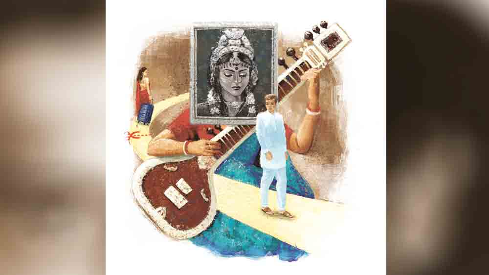

 

<h1 align=center>Short story: আধুনিক</h1>
<h2 align=center>প্রতিমা রায়</h2>
আমার চেয়ে তুমি অনেক বেশি সুখী ছিলে।” কথাগুলো খুবই নিরীহ, কিন্তু হৃদয়বিদারক। এই কথাগুলো দেয়ালে ঝোলানো সাদা-কালো ছবিটাকে বলেই চলেছেন কলাবতী।   ছবির অমন সুন্দরী উনিশ বছর বয়সি মেয়েটার মুখ হাসি হাসি। ভাসা ভাসা চোখ। মেয়েটিও  কলাবতীকে বোঝাতে চায়, ‘এতগুলো বছর পেরিয়ে এসে এখন সংসার সমুদ্রের উথালপাথাল ঢেউয়ের সামনে ভয় পাচ্ছ! সাঁতারের সব কৌশল ভুলে গিয়েছ? তা হলে নিজেকে বদলাও সময়ের সঙ্গে।’   প্রায় প্রৌঢ়ত্বে পৌঁছে গিয়েছেন কলাবতী। পঁয়ত্রিশ বছরের সংসার জীবন। এত দিন তাঁর নির্দেশ ছাড়া এ বাড়িতে এক বিন্দু হাওয়া পর্যন্ত ঢোকার অনুমতি পেত না। এখন বদলাতে হবে তাকে! একমাত্র ছেলের বৌ, বৌভাতের দিন সকালে ব্রেকফাস্ট টেবিলে এসেছে স্লিভলেস নাইটি পরে! ছেলে শুভকে ডেকে কলাবতী চাপা গলায় বলেছিলেন, “বাবু, তোর্সা এটা কী পরেছে? একঘর লোকের সামনে নতুন বৌকে কি এ পোশাকে মানায়? এ পোশাক পরার সময় তো পালিয়ে যাচ্ছে না...”   বিরক্ত হয়েছিল শুভ, “তুমি এবার থামো মা। ডিসগাস্টিং। যত সব সেকেলে মেন্টালিটি। আজকাল এটাই ট্রেন্ড। নিজেকে এবার বদলাও।”   ছেলের মুখের দিকে হাঁ করে তাকিয়ে থাকেন কলাবতী। খুব অশোভন বা অনুচিত কিছু কি দাবি করে ফেলেছিলেন তিনি! নাকি সত্যিই বিয়ের পর ছেলে কাছছাড়া হয়ে যায়!   “ওরা আজকের জেনারেশন। ভীষণ ম্যাচিওর। ছিঃ ছিঃ বৌদি। নিজেকে আপটুডেট করো!” সুযোগ পেয়ে গরম তেলে ফোড়ন দিয়ে দেয় কলাবতীর ননদ।   সামান্য ব্যাপার! তাকে কেন্দ্র করে শুভর বৌভাতের দিন খুশির ভিতর বিষাদের চোরাস্রোত বয়ে যায়। রাতে বিছানায় এসেও ঘুম এল না। ছবিটার দিকে আবার চোখ গেল, সাদা-কালো ছবিতে শাড়ির রং বোঝা যায় না, তবে সিঁথিতে লাল সিঁদুর দেখতে দেখতে ছবির গা থেকে যেন একটা অতীত স্মৃতির পালক খুলে খুলে উড়ে বেড়াতে লাগল ঘরময়। তার সামনে বসে পড়লেন কলাবতী।   ওই তো স্পষ্ট হচ্ছে এ বাড়ির সিংহদরজা। দুধে-আলতায় পা ফেলে এগিয়ে আসছে মেয়েটা। কত বয়স যেন! উনিশ বছর। খুব ফর্সা, মাথাভর্তি চুল। সবাই প্রশংসা করছে রূপের। ক’পা হেঁটে এসেছিল মনে নেই, শুধু মনে আছে ভারী গয়না শাড়ি, বার বার মাথা থেকে আঁচল খসে পড়ছে, শাশুড়ি মা এগিয়ে এসে চুলের কাঁটা দিয়ে মাথার খোঁপায় আঁচলটা আটকে দিলেন, যা আর কখনও খোলেনি। ভিড়ের মাঝে কেউ বলল, “এ মা নতুন বৌ কেমন করে হাঁটছে, খড়ম পা নয় তো?” শাশুড়িমা কানের কাছে মুখ নিয়ে এসে বললেন, “সামনে তাকিয়ে হাঁটো।”   দীর্ঘ সময় পর অতীত থেকে বর্তমানে ফিরে নিজের দুই পায়ের দিকে চোখ চলে যায় কলাবতীর। ক্লান্ত, বয়সের চাপে চামড়া ঈষৎ কোঁচকানো। আজকাল বেশি হাঁটলে পা দুটো ব্যথায় টনটন করে।   হাতায় কুঁচি লাগানো ব্লাউজ়, নীল জর্জেটের শাড়ি, খোঁপায় জুঁইয়ের মালা, কপালে চন্দনের ফোঁটা দিতে দিতে শাশুড়ি মার স্পষ্ট নির্দেশ— “বৌভাতে সব বড়দের পায়ে হাত দিয়ে প্রণাম করবে। নতুন জীবনের শুরুতে বড়দের আশীর্বাদ আর সকলের ভালবাসা খুব দরকার।”   ছবির মেয়েটির মাথায় আজও সেদিনের জুঁইয়ের মালা, কপালে চন্দন। ঠিক শিবজায়া পার্বতীর  মতো লাগছে। পার্বতীর অপর নাম কলাবতী। ফুলশ্যার রাতে তাই তার কাঙ্ক্ষিত মানুষটি ভালবেসে তার নাম দেয় কলাবতী। সেদিন কত মানুষের পায়ে হাত রেখে প্রণাম করেছিল নতুন বৌটি! কলাবতী নিজের হাত দুটো আলোর দিকে তুলে ঘুরিয়ে ঘুরিয়ে দেখে। এখানেও বয়সের ছাপ স্পষ্ট। কপালে চিবুকে বলিরেখার থাবা। চুলের রাশিতে রুপোলি রেখা। কলাবতীর মাথা ধরে আসে। মেয়েটির সঙ্গে আজ আর কথা বলতে ভাল লাগে না, উঠে আলোটা নিভিয়ে দেন। মোষের রঙের মতো অন্ধকার নেমে আসে ঘরের ভিতর। সেই অন্ধকারে ছবির মেয়েটিও নিভে যায়। মুখ গুঁজে শুয়ে থাকেন কলাবতী।   “এভাবে শুয়ে আছ যে? শরীর ঠিক আছে তো?”   কপালে ভালবাসার উষ্ণ ছোঁয়া। আশিস মাথায় হাত রেখেছেন।   “এমনিই। শুয়ে পড়তে চোখটা লেগে গিয়েছিল।”   “অনেকক্ষণ এসেছি, টের পাওনি। যাক শুভর বিয়েটা নিশ্চিন্তে মিটে গেছে, বাবা-মা হিসেবে আমাদের দায়িত্ব শেষ, এ বার ওরা সুখে থাকবে।”   গলায় আটকে থাকা শুভর কথাগুলো প্রায় বলে ফেলছিলেন কলাবতী। বলতে গিয়েও থেমে যান। খুশির আলো চকচক করছে আশিসের মুখে। দায়িত্বশীল পিতা। সদ্য তিনি পিতা হিসেবে বড় একটা দায়িত্ব পালন করেছেন।   কলাবতী মুখটা আলোর উল্টো দিকে ফেরানো। সেখানে সাদা কালোর আলোছায়া আশিস টের পান না। টের পাওয়ার কথাও নয়। আজ ওঁদের দু’জনের যৌথ বিলাস যাপনের দিন নয়, কলাবতী এক নতুন জীবনে প্রবেশ করেছেন, সবে শাশুড়ি হয়ে। জেনারেশন গ্যাপে তিনি কি সত্যিই ব্যাকডেটেড? না শাশুড়ি হয়ে সংসারে ক্ষমতার বণ্টন নিয়ে দ্বিধায়? সমস্যাটা কি তাঁরই? হাজার প্রশ্ন ভিড় করে আসে। একটু পরে আশিস ঘুমিয়ে পড়তেই বারান্দায় এসে দাঁড়ান কলাবতী। বারান্দার করিডর, সামনে প্রাচীর, প্রাচীরের গায়ে মাথা উঁচু করে দাঁড়িয়ে থাকা কৃষ্ণচূড়া গাছটা দুধসাদা চাঁদের আলোয় ভেসে যাচ্ছে, একটা সাদা ডানাওয়ালা পেঁচা চাঁদের আলো মেখে হাওয়ায় ডানা মেলে উড়ে গেল দূরে কোথাও। কাছেই ঝিঁ ঝিঁ পোকা ডাকছে। চরাচর জুড়ে শুধু আলো, কোথাও দ্বিধা নেই, দ্বন্দ্ব নেই। কলাবতীর মনটা হু হু করে ওঠে।   শুভ-তোর্সার বেডরুম দোতলায় সিঁড়ির ঠিক পাশে। ষোলো বাই আঠারো ঘরটা তোর্সা নিজের মনের মতো করে ডেকরেশন করিয়েছে। দেওয়ালের কালার কম্বিনেশন, লাইটিং, আসবাবপত্র, ওয়াল হ্যাঙ্গিং থেকে ফুলের ঝাড়... তোর্সার গৃহিণীপনা মুগ্ধ করে দেয়।   শুভ আজকাল মা-কে কিছুই বলে না। কলাবতীও ছেলে-বৌমার ব্যাপারে মাথা ঘামান না। সংসারে কাজের লোকদের ছাড়া আর কাউকে কিছু নির্দেশও দেন না। দেয়ালের সাদাকালো ছবিটাও সরিয়ে দিয়েছেন।   এখন সময় পেলেই তানপুরাটা নিয়ে বসেন। রেওয়াজ করেন। সুর এখনও তাঁকে ছেড়ে যায়নি। শুধু সংসারের চাপে বন্দি হয়ে ছিল। অবলীলায় গেয়ে যান আশাবরী দীপক মেঘমল্লার। শুনতে শুনতে মুগ্ধ হয়ে আশিস বলেন, “সংসার থেকে তুমি কি সন্ন্যাস নিলে নাকি?”   “আমি কি চিরকাল থাকব? সংসারে চিরকাল কারও প্রয়োজন থাকে না।”   আশিস স্ত্রীর অভিমান বোঝেন।   আষাঢ়ের আকাশ থেকে ঝিমঝিম করে বৃষ্টি পড়ছে। এ মরশুমের প্রথম বৃষ্টি। কলাবতী জানলার ধারে এসে তানপুরাটা নিয়ে বসেন। বৃষ্টির এ রূপ কত দিন দেখেননি। আসলে সব কিছু দেখার জন্য চোখের সঙ্গে একটা মন লাগে। কলাবতীর মন আর চোখ আজ এক হয়ে তানপুরায় মেঘমল্লারের মূর্ছনা ছড়িয়ে দিচ্ছে। সঙ্গীতসাধনায় মগ্ন তিনি প্রথমে টের পেলেন না, তাঁর বাড়িরই অন্যত্র সংলাপ বিনিময়ে ছড়িয়ে পড়ছে খর উত্তাপ।   “তুমি আমার কথাটা একটু 
বোঝো শুভ!”   “কী বুঝব? এতে আবার বোঝার কী আছে?”   “শুভ আমি এক জন মডেল। তোমার সঙ্গে পরিচয়ের আগে থেকেই সহেলি দত্তর ডিজ়াইনার ড্রেস পরে আমি নিয়মিত ফ্যাশন শো-এ হাঁটতাম। সেই সূত্রেই আমাদের আলাপ। তুমি জেনে বুঝেই সম্পর্ক করেছিলে। তা ছাড়া এ বার এটা একটা কনটেস্ট। ‘রূপশ্রীমতী ২০২১’ বিউটি কনটেস্টে উইনার হতে পারলে আমার কেরিয়ারের দরজা খুলে যাবে। এটা একটা গোল্ডেন অপরচুনিটি। আর জেতার ব্যাপারে আমি একশো ভাগ কনফিডেন্ট।”   “কী কেরিয়ার কেরিয়ার করছ? সেই তো ছোট ছোট জামাকাপড় পরে মুখে রং মেখে র‌্যাম্পে হাঁটা। পাশ থেকে জনতা হাততালি দেবে আর শরীরের প্রতিটি ইঞ্চি চোখ দিয়ে চেটেপুটে উপভোগ করবে। আগে যা করেছ করেছ, এ সব আর এখন নয়।”   “নয় মানে! এমন তো কথা ছিল না। এ তো টিপিক্যাল হাসব্যান্ডের মতো কথা বলছ...” উত্তর পাল্টা উত্তর। প্রশ্ন পাল্টা প্রশ্ন। বেডরুমের হাওয়া উত্তপ্ত হয়ে ওঠে। এখন আর কেউ কারও কথা শুনছে না, নিজের নিজের আক্রমণ শানাচ্ছে। শুভ-তোর্সার দাম্পত্যকলহ চার দেওয়াল পেরিয়ে বাইরে আসে।   কলাবতীর সুর নিভতে থাকে, লয় কেটে যায়, কানে আসে সব কিছু। প্রথমটায় বিচলিত হয়েও পরে নিজেকে সামলে নিয়ে আবার রেওয়াজে মন দেয়।   ঝনঝন। জানলার কাঁচে ভারী কিছু পড়ল, দরজায় দড়াম করে আওয়াজ। শুভ চিৎকার করে উঠল, “আউট! আই সে গেট আউট!”   কিছুক্ষণের মধ্যেই দুটো ট্রলিব্যাগ টেনে তোর্সা নেমে আসে দোতলা থেকে। তার দু’চোখে জল ও আগুন। সিঁড়িতে কলাবতীর সঙ্গে চোখাচোখি হতেই মুখ ফিরিয়ে নেয়। ক্যাবে জিনিসপত্র তুলে আর ফিরে দেখে না।   কয়েক দিনের মধ্যেই সবাই সব কিছু বুঝে যায়। সবার কাছে সবটা জলের মতো পরিষ্কারও হয়ে যায়। কলাবতীকে নিয়ে আবার শুরু হয় গুঞ্জন। আত্মীয়-স্বজনদের মুখে ছিছিক্কার— “মায়ের জন্যই তো ছেলে এমন। ছেলের বৌকে ঘর করতে দিল না। ছেলেকে বৌমার বিরুদ্ধে উসকে,  এখন বৌমাকে তাড়িয়ে নিশ্চিন্তে তানপুরায় সুর তুলছেন।” বাদ গেল না বাড়ির কাজের মেয়েরাও। মিনতির মাও ফিসফিসিয়ে বলে, “কী শক্ত গিন্নিমা! ছ্যালের মনে সুখ নাই, তাও উনি বৌমারে ফিরিয়ে আনবা না! ছ্যালে কী মুখ ফুটে কইতে পারে?”   আর ফিরে এল না তোর্সা। শুধু শুভর মধ্যে অনেক পরিবর্তন এসেছে। বাবার ব্যবসায় মন দিয়েছে। সারাদিন ব্যস্ত থাকে। মায়ের সঙ্গে গল্প করে। ছেলেকে অনেক সহজ-স্বাভাবিক মনে হয়, তাকে দেখে কলাবতীরও ভাল লাগে। সবাই জানে, সে তো এ রকমই চেয়েছিল।   “আচ্ছা, আমরা কোথাও যেতে পারি না? একসঙ্গে কোথাও ঘুরতে?” আশিস যেন ভিতরে ভিতরে এই পরিস্থিতি থেকে বেরিয়ে আসার জন্য ছটফট করতে থাকে।   “কালকেই চলো সন্ধেবেলা। সুকান্ত সদনে ফাংশন। আমার গুরুজি আসছেন। অনুষ্ঠান দেখে, বাইরে খেয়ে ফিরব। বহু দিন পর গুরুজির সঙ্গেও দেখা হবে,” বলেন কলাবতী।   শুভ রাজি হতেই কলাবতী টিকিট কেটে যাওয়ার ব্যবস্থা করে ফেলে।   রাস্তার ভিড় পেরিয়ে অনুষ্ঠানে পৌঁছতে দেরি হয়ে যায়। মঞ্চে তখন কলাবতীর গুরুজি সন্ধ্যা রাগের বন্দিশে নিমগ্ন। তাঁর মন্দ্রকণ্ঠের তানকর্তবে শ্রোতারা মন্ত্রমুগ্ধ। ভিতরে ঢুকে ওরা নির্দিষ্ট সিটে বসে পড়েন। সুরের রেশ শেষ হতে না হতেই ঘোষক মঞ্চে আসে, ঘোষণা করে—  “এ বার অনুষ্ঠানের মূল পর্ব। ‘রূপশ্রীমতী ২০২১’ এর ফলাফল। ফাইনালিস্ট তিন প্রতিযোগিনী। মঞ্চে আসছেন ফাস্ট রানার আপ আর সেকেন্ড রানার আপের সঙ্গে এ বছরের বিজয়িনী তোর্সা বসু।”   নাম শুনে চমকে উঠে ক্রুদ্ধ সাপের মতো ফণা তুলে শুভ বলে, “মা তার মানে এ অনুষ্ঠান... তুমি জেনেশুনেই আমাদের আনলে?”   ততক্ষণে তোর্সা মাইক্রোফোন টেনে নিয়েছে, যাবতীয় স্পট লাইট তার মুখের ওপর। সে বলে চলেছে— “একটা সময় এই প্রতিযোগিতায় আমার অংশগ্রহণ করাই অনিশ্চিত হয়ে পড়ে। প্রিয়জনের মুখ চেয়ে যখন আমি বিউটি কনটেস্ট থেকে সরে দাঁড়ানোর কথা চিন্তা করছিলাম, তখন এক জন আমার পাশে দাঁড়িয়েছিলেন। হাত ধরে বুঝিয়েছিলেন, নিজের রাস্তা থেকে না সরতে। প্রিয়জন যদি সত্যিই কাছের হয়, সে নিশ্চয়ই এক দিন সব মেনে নেবে। তিনি আমার শাশুড়িমা। আজকের বিজয় আমার নয়, আমার শাশুড়িমার। ওঁর মতো আধুনিক মনের এক জন আমার পাশে না দাঁড়ালে আজ এখানে পৌঁছতে পারতাম না। উনিই ফর্ম ভরে সাহস জুগিয়ে প্রতিযোগিতায় আমাকে পাঠান। তার পর থেকে প্রতিমুহূর্তে জেতার জন্য উৎসাহ দিয়ে গিয়েছেন। আমি তাঁকে এক বার মঞ্চে আসার জন্য অনুরোধ করতে চাই।”   নিজের কানকে বিশ্বাস করতে পারে না শুভ। সবিস্ময়ে পাশে বসা মায়ের দিকে তাকাতে গিয়ে দেখে সিটে মা নেই। বাবা মঞ্চের দিকে হাঁ করে তাকিয়ে আছে। ওই তো, মাকে মঞ্চে ওঠাচ্ছে। নিঃশ্বাস গরম হয়ে উঠছে শুভর।   কলাবতীকে প্রণাম করতে যাচ্ছিল তোর্সা। কলাবতী বাধা দিয়ে তোর্সাকে বুকে জড়িয়ে ধরে তার কপালে চুম্বন এঁকে দিচ্ছেন। প্রেক্ষাগৃহে হাততালির বন্যা। শাশুড়ি বৌমার মিলনদৃশ্য ক্যামেরাবন্দি করছে শ’খানেক হাত। তোর্সার চোখে আনন্দাশ্রু। তা বয়ে এসে যেন এসে শুভকে ছুঁয়ে ফেলে। ক্রমশ শুভর ভেতরে ঢুকে যায়, ভেতরের জমাট প্রাচীর ধুইয়ে দেয়...   নিজের অজান্তেই অন্যদের মতো শুভর হাতও ওপরে ওঠে, পজিশন মতো মোবাইল ফোনটা ধরে ক্যামেরা অন করে। মুখে বিড়বিড় করে, “কাছে থেকেও... কত দূরত্ব! আর সে দূরত্ব কী দুর্ভেদ্য মা! তোমাকে কোনও দিন বুঝতেই পারিনি!”