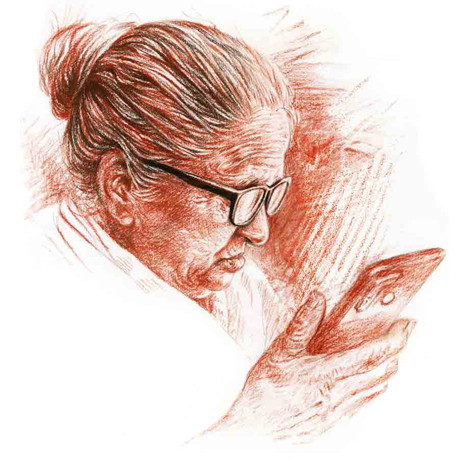

 
 <h1 align=center>অন্ধবিন্দু</h1>
<h2 align=center>কমলেশ কুমার</h2> 

এই জায়গাটাতে চোখ রাখলেই তুমি বুঝতে পারবে মা...” মোবাইলের দিকে তাকিয়ে মাকে বুঝিয়ে চলেছিল অর্ণব, “না না, ওটা তো ব্লাইন্ড স্পট, ওখানে কিছু পাবে না তুমি!”

মানসীদেবী প্রাণপণে বোঝার চেষ্টা করছিলেন কোনটা ব্লাইন্ড স্পট, কোনটা ফার্স্ট ফ্লোর, কোনটা বুকুনের খেলার জায়গা, কোনখানে অর্ণব তার নতুন কেনা গাড়িটা রাখে... এ সবই জানার চেষ্টা করছিলেন তিনি।

মোবাইলে তিনি একেবারেই সড়গড় নন। অভূতপূর্ব প্রযুক্তি তাঁর চোখে ধাঁধা ধরায়। এক কথায় তিনি ভয়ই পান এ সব জিনিস নিয়েনাড়াঘাঁটা করতে।

অর্ণব যখন অ্যান্ড্রয়েড ফোনটা মাস তিনেক আগে মাকে কিনে দেয়, মানসীদেবী রীতিমতো হিমশিম খেতেন মোবাইলটা সামলাতে। তার আগে ওঁর বোতাম-টেপা ফোন ছিল। ধীরে ধীরে অর্ণব মাকে হোয়াটসঅ্যাপ ডাউনলোড করে দেয়। ইউটিউবের ব্যবহার শিখিয়ে দেয়।

মানসীদেবী এখন অবসর সময়ে বসে বসে বিভিন্ন রান্না দেখেন, ঠাকুর শ্রীরামকৃষ্ণের জীবনী শোনেন। কখনও কখনও পুরনো দিনের বাংলা গান শুনতেও মাকে দেখেছে অর্ণব।

কিছু দিন আগে অর্ণবই মাকে বুদ্ধিটা দেয়। ওদের আবাসনটা আপাদমস্তক সিসিটিভিতে মোড়া। আবাসনের ভিতরের বিরাট চৌহদ্দিতে বিকেলের দিকে বাচ্চারা খেলতে নামে। সিসিটিভির সঙ্গে সংযুক্ত একটি বিশেষ অ্যাপে চোখ রাখলে মা প্রতিদিন বুকুনকে ইচ্ছেমতো দেখতে পাবে।

বুদ্ধিটা মনে ধরেছিল মানসীদেবীর। তিনি রাজি হয়ে গিয়েছিলেন। অর্ণবকে বলে বলে আজকে তার সময় হয়েছে মাকে পুরো বিষয়টা বুঝিয়ে বলার। পাঁচ বছরের ছোট্ট বুকুনকে এ ভাবে না হলে আর দেখা সম্ভব নয় মানসীদেবীর।

বুকুন অর্ণবের একমাত্র ছেলে। মানসীদেবীর আদরের দাদাই।

বুকুনের এখন ক্লাস ওয়ান। পড়াশোনার খুব চাপ এই বয়সেই। প্রোজেক্ট ওয়ার্ক, পরীক্ষা লেগেই আছে রোজ। স্বাভাবিক ভাবেই ওরা গ্রামের বাড়িতে আসতে পারে না। মানসীদেবী যক্ষের ধনের মতো আগলে রেখেছেন বাড়িঘর, পুকুর, জমিজমা।

পৌষালী আর বুকুন বছরে এক-আধ বার এক বেলার জন্য আসে। অর্ণব চেষ্টা করে মায়ের কাছে মাসে অন্তত বার দুই আসতে। বৌমা কিংবা নাতির এই যে না আসতে পারা, তার জন্য পুরোটাই বুকুনের স্কুলের ঘাড়ে দোষ চাপালে ভুল হবে।

অর্ণবের স্ত্রী, পৌষালী মানসীদেবীকে পছন্দ করে না। বুকুন যে তার ঠাম্মির কাছে মাঝেমধ্যে যাবে, তার কোল ঘেঁষে বসবে, পৌষালীর এ বড় অপছন্দের। তার মতে, এক জন গ্রাম্য বিধবা মহিলা, যিনি কিনা লোকলস্কর দিয়ে জমিজমার তদারকিতেই সারা জীবন কাটালেন, তিনি পাঁচ বছরের একটা বাচ্চাকে কতটাই বা সুশিক্ষা দিতে পারবেন!

অর্ণবজ্যোতি রায় শহরের এক জন নামকরা নিউরো-সার্জন। সল্টলেকে প্রায় তিন হাজার স্কোয়্যার ফুটের সুবিশাল ফ্ল্যাট। ইন্টিরিয়র ডেকোরেশন করতেই প্রায় কোটি টাকা খরচ করেছিল সে।

স্ত্রীর সঙ্গে যে অর্ণবের খুব ভাল সম্পর্ক, এ কথা বলা মুশকিল। বিয়ের পর থেকেই দু’জনের খিটিরমিটির লেগেই থাকত। ছোট ছোট নানা বিষয় নিয়ে পৌষালী অশান্তি শুরু করত। তার রেশ চলত সপ্তাহখানেক। পুরনো একটা বিষয়ের জের মিটতে না মিটতেই নতুন আর একটা ঝামেলা শুরু হত।

বেশির ভাগ দিনই অর্ণব চেম্বার থেকে ফিরে এসে দেখত, কিচ্ছু খায়নি পৌষালী। ঘর অন্ধকার করে চুপচাপ শুয়ে আছে। অর্ণব ঘরে ঢুকলেই বিরক্ত হত সে। এ সবের পিছনে কী যে কারণ, হাজার ভেবেও কূলকিনারা পেত না অর্ণব।

তার মধ্যেই এক দিন বুকুন এল ওদের জীবনে। দেখতে দেখতে পাঁচ বছর পাঁচেক বয়সও হয়েগেল পুঁচকেটার।

নিরন্তর অশান্তির কারণে অর্ণব আগে মাঝেমধ্যেই বিবাহবিচ্ছেদের কথা ভাবলেও, এখন ছেলেটার মুখ চেয়ে আর ভাবতে পারে না।

বুকুন যখন গলা জড়িয়ে বলে, “বাবা, তোমার মহিমপুর গ্রামের সেই গাঙুর নদীটার কথা বলো!”

অর্ণব নিচু গলায় বলে, “মহিমপুর কি শুধু আমার গ্রাম রে বুকুন! ওই গ্রাম, বাড়ি, ঠাম্মির আগলে রাখা পুকুর, জমি তো তোরও সোনা!”

বুকুন তখন কথা বলে না। চোখ বড় বড় করে বাবার কাছে শুনতে চায় ওদের গ্রামদেশের গল্প।

অর্ণব দীর্ঘশ্বাস ফেলে। ভাবে, ওদের সবুজে-সবুজ গ্রামে যখন চাষিরা মাঠে ধান রুয়ে দেয়, নধর চারাগাছগুলো মনের আনন্দে মাথা নাড়িয়ে কথা বলতে চায়, তা যদি বুকুন এক বার দেখতে পেত!

কিংবা গাঙুর নদীর পাড়ে বেঁধে রাখা কানাইকাকার নৌকোতে যদি বুকুনকে এক বার চাপানো যেত!

অর্ণবের মনে পড়ে ছোটবেলার কথা। বাবা তখন বেঁচে। অর্ণবের বোধহয় ক্লাস ফাইভ-সিক্স হবে। নৌকো-বাঁধা ঘাটের কাছে নিয়ে গিয়ে অর্ণবের বাবা বলতেন, “শোন কানাই, ছেলে বায়না ধরেছে নৌকো চাপার। আমাকে মাঠে বেরোতে হবে। ধান রোয়ার কাজ চলছে, আমি না থাকলে ফাঁকি দেবে লোকজন। তুই ছেলেকে একটু ঘুরিয়ে এনে এখানেই বসিয়ে রাখিস। আমি যাওয়ার পথে নিয়ে যাব।”

একগাল হেসে কানাইকাকা বলত, “কোনও চিন্তা কইরেন না দাদাবু। আমি আছি তো!”

কানাইকাকা এখনও আছে। বয়সের ছাপ শরীরে পড়লেও রাত-দিন নদীর এপার-ওপার করছে।

অর্ণবের বিশেষ সময় হয় না গ্রামের আনাচ-কানাচে ঘুরে বেড়ানোর, কিন্তু কানাইকাকার কাছে গেলে এখনও আগের মতো একগাল হেসে বুড়ো মাঝি বলে, “এয়েচ সোনাবাবু! কত দিন দেহি না তুমায়। কতটুকুন ছিলে তুমি,মনে পড়ে?”

অর্ণব তখন মনে মনে ফিরে যায় সেইসাদাকালো দিনগুলোতে।

বাবা বলত, ইতিহাসের পুনরাবৃত্তি হয়। বুকুনের মতোই এক দিন ও-ও তো ছোট্ট ছিল!

বুকুনদের প্রাচুর্য আছে, পৃথিবীর সঙ্গে টান নেই।

অর্ণবরা কী না করেছে এক দিন! ধুলো মেখেছে। ঝমঝমে বর্ষায় কাদায় নাকানিচোবানি খেয়ে ফুটবল খেলেছে। পুকুরে লাফিয়ে-ঝাঁপিয়ে সাঁতার কেটেছে। বনবাদাড় দাপিয়ে বেড়িয়েছে। গ্রীষ্মের দুপুরে আম চুরি করে খেয়ে বাবার হাতে বেদম মার খেয়েছে।

অর্ণব ভাবে, সারা দিনের বেশির ভাগ সময়টাই খেলার পিছনে ব্যয় হত ওদের। তাও পরীক্ষায় খারাপ ফলাফল হয়নি কখনও। বুকুনদের মতো ব্যাগের ওজন দশ কেজি ছিল না, কিন্তু মেধা আর পরিশ্রমে মহিমপুরের মতো ধুলোয় ঢাকা ছোট্ট একটা গ্রাম থেকেও জয়েন্টে ভাল ফল করতে পেরেছিল অর্ণব।

ও বুঝতে পারে, কোথাও একটা বিপ্লব ঘটে গিয়েছে। বিরাট বিপ্লব। মানুষের হাতে অর্থ এসেছে। জীবন অনেক বেশি আরামপ্রিয় হয়েছে। ভোগ-সুখ পৃথিবীকে আষ্টেপৃষ্ঠে বেঁধে ফেলেছে। কিন্তু মানবিকতা, মূল্যবোধ, প্রকৃতির সঙ্গে সংযোগ ক্রমশ কমে আসছে মানুষের।

এই জায়গাটাতে চোখ রাখলেই তুমি বুঝতে পারবে মা...” মোবাইলের দিকে তাকিয়ে মাকে বুঝিয়ে চলেছিল অর্ণব, “না না, ওটা তো ব্লাইন্ড স্পট, ওখানে কিছু পাবে না তুমি!”

মানসীদেবী প্রাণপণে বোঝার চেষ্টা করছিলেন কোনটা ব্লাইন্ড স্পট, কোনটা ফার্স্ট ফ্লোর, কোনটা বুকুনের খেলার জায়গা, কোনখানে অর্ণব তার নতুন কেনা গাড়িটা রাখে... এ সবই জানার চেষ্টা করছিলেন তিনি।

মোবাইলে তিনি একেবারেই সড়গড় নন। অভূতপূর্ব প্রযুক্তি তাঁর চোখে ধাঁধা ধরায়। এক কথায় তিনি ভয়ই পান এ সব জিনিস নিয়েনাড়াঘাঁটা করতে।

অর্ণব যখন অ্যান্ড্রয়েড ফোনটা মাস তিনেক আগে মাকে কিনে দেয়, মানসীদেবী রীতিমতো হিমশিম খেতেন মোবাইলটা সামলাতে। তার আগে ওঁর বোতাম-টেপা ফোন ছিল। ধীরে ধীরে অর্ণব মাকে হোয়াটসঅ্যাপ ডাউনলোড করে দেয়। ইউটিউবের ব্যবহার শিখিয়ে দেয়।

মানসীদেবী এখন অবসর সময়ে বসে বসে বিভিন্ন রান্না দেখেন, ঠাকুর শ্রীরামকৃষ্ণের জীবনী শোনেন। কখনও কখনও পুরনো দিনের বাংলা গান শুনতেও মাকে দেখেছে অর্ণব।

কিছু দিন আগে অর্ণবই মাকে বুদ্ধিটা দেয়। ওদের আবাসনটা আপাদমস্তক সিসিটিভিতে মোড়া। আবাসনের ভিতরের বিরাট চৌহদ্দিতে বিকেলের দিকে বাচ্চারা খেলতে নামে। সিসিটিভির সঙ্গে সংযুক্ত একটি বিশেষ অ্যাপে চোখ রাখলে মা প্রতিদিন বুকুনকে ইচ্ছেমতো দেখতে পাবে।

বুদ্ধিটা মনে ধরেছিল মানসীদেবীর। তিনি রাজি হয়ে গিয়েছিলেন। অর্ণবকে বলে বলে আজকে তার সময় হয়েছে মাকে পুরো বিষয়টা বুঝিয়ে বলার। পাঁচ বছরের ছোট্ট বুকুনকে এ ভাবে না হলে আর দেখা সম্ভব নয় মানসীদেবীর।

বুকুন অর্ণবের একমাত্র ছেলে। মানসীদেবীর আদরের দাদাই।

বুকুনের এখন ক্লাস ওয়ান। পড়াশোনার খুব চাপ এই বয়সেই। প্রোজেক্ট ওয়ার্ক, পরীক্ষা লেগেই আছে রোজ। স্বাভাবিক ভাবেই ওরা গ্রামের বাড়িতে আসতে পারে না। মানসীদেবী যক্ষের ধনের মতো আগলে রেখেছেন বাড়িঘর, পুকুর, জমিজমা।

পৌষালী আর বুকুন বছরে এক-আধ বার এক বেলার জন্য আসে। অর্ণব চেষ্টা করে মায়ের কাছে মাসে অন্তত বার দুই আসতে। বৌমা কিংবা নাতির এই যে না আসতে পারা, তার জন্য পুরোটাই বুকুনের স্কুলের ঘাড়ে দোষ চাপালে ভুল হবে।

অর্ণবের স্ত্রী, পৌষালী মানসীদেবীকে পছন্দ করে না। বুকুন যে তার ঠাম্মির কাছে মাঝেমধ্যে যাবে, তার কোল ঘেঁষে বসবে, পৌষালীর এ বড় অপছন্দের। তার মতে, এক জন গ্রাম্য বিধবা মহিলা, যিনি কিনা লোকলস্কর দিয়ে জমিজমার তদারকিতেই সারা জীবন কাটালেন, তিনি পাঁচ বছরের একটা বাচ্চাকে কতটাই বা সুশিক্ষা দিতে পারবেন!

অর্ণবজ্যোতি রায় শহরের এক জন নামকরা নিউরো-সার্জন। সল্টলেকে প্রায় তিন হাজার স্কোয়্যার ফুটের সুবিশাল ফ্ল্যাট। ইন্টিরিয়র ডেকোরেশন করতেই প্রায় কোটি টাকা খরচ করেছিল সে।

স্ত্রীর সঙ্গে যে অর্ণবের খুব ভাল সম্পর্ক, এ কথা বলা মুশকিল। বিয়ের পর থেকেই দু’জনের খিটিরমিটির লেগেই থাকত। ছোট ছোট নানা বিষয় নিয়ে পৌষালী অশান্তি শুরু করত। তার রেশ চলত সপ্তাহখানেক। পুরনো একটা বিষয়ের জের মিটতে না মিটতেই নতুন আর একটা ঝামেলা শুরু হত।

বেশির ভাগ দিনই অর্ণব চেম্বার থেকে ফিরে এসে দেখত, কিচ্ছু খায়নি পৌষালী। ঘর অন্ধকার করে চুপচাপ শুয়ে আছে। অর্ণব ঘরে ঢুকলেই বিরক্ত হত সে। এ সবের পিছনে কী যে কারণ, হাজার ভেবেও কূলকিনারা পেত না অর্ণব।

তার মধ্যেই এক দিন বুকুন এল ওদের জীবনে। দেখতে দেখতে পাঁচ বছর পাঁচেক বয়সও হয়েগেল পুঁচকেটার।

নিরন্তর অশান্তির কারণে অর্ণব আগে মাঝেমধ্যেই বিবাহবিচ্ছেদের কথা ভাবলেও, এখন ছেলেটার মুখ চেয়ে আর ভাবতে পারে না।

বুকুন যখন গলা জড়িয়ে বলে, “বাবা, তোমার মহিমপুর গ্রামের সেই গাঙুর নদীটার কথা বলো!”

অর্ণব নিচু গলায় বলে, “মহিমপুর কি শুধু আমার গ্রাম রে বুকুন! ওই গ্রাম, বাড়ি, ঠাম্মির আগলে রাখা পুকুর, জমি তো তোরও সোনা!”

বুকুন তখন কথা বলে না। চোখ বড় বড় করে বাবার কাছে শুনতে চায় ওদের গ্রামদেশের গল্প।

অর্ণব দীর্ঘশ্বাস ফেলে। ভাবে, ওদের সবুজে-সবুজ গ্রামে যখন চাষিরা মাঠে ধান রুয়ে দেয়, নধর চারাগাছগুলো মনের আনন্দে মাথা নাড়িয়ে কথা বলতে চায়, তা যদি বুকুন এক বার দেখতে পেত!

কিংবা গাঙুর নদীর পাড়ে বেঁধে রাখা কানাইকাকার নৌকোতে যদি বুকুনকে এক বার চাপানো যেত!

অর্ণবের মনে পড়ে ছোটবেলার কথা। বাবা তখন বেঁচে। অর্ণবের বোধহয় ক্লাস ফাইভ-সিক্স হবে। নৌকো-বাঁধা ঘাটের কাছে নিয়ে গিয়ে অর্ণবের বাবা বলতেন, “শোন কানাই, ছেলে বায়না ধরেছে নৌকো চাপার। আমাকে মাঠে বেরোতে হবে। ধান রোয়ার কাজ চলছে, আমি না থাকলে ফাঁকি দেবে লোকজন। তুই ছেলেকে একটু ঘুরিয়ে এনে এখানেই বসিয়ে রাখিস। আমি যাওয়ার পথে নিয়ে যাব।”

একগাল হেসে কানাইকাকা বলত, “কোনও চিন্তা কইরেন না দাদাবু। আমি আছি তো!”

কানাইকাকা এখনও আছে। বয়সের ছাপ শরীরে পড়লেও রাত-দিন নদীর এপার-ওপার করছে।

অর্ণবের বিশেষ সময় হয় না গ্রামের আনাচ-কানাচে ঘুরে বেড়ানোর, কিন্তু কানাইকাকার কাছে গেলে এখনও আগের মতো একগাল হেসে বুড়ো মাঝি বলে, “এয়েচ সোনাবাবু! কত দিন দেহি না তুমায়। কতটুকুন ছিলে তুমি,মনে পড়ে?”

অর্ণব তখন মনে মনে ফিরে যায় সেইসাদাকালো দিনগুলোতে।

বাবা বলত, ইতিহাসের পুনরাবৃত্তি হয়। বুকুনের মতোই এক দিন ও-ও তো ছোট্ট ছিল!

বুকুনদের প্রাচুর্য আছে, পৃথিবীর সঙ্গে টান নেই।

অর্ণবরা কী না করেছে এক দিন! ধুলো মেখেছে। ঝমঝমে বর্ষায় কাদায় নাকানিচোবানি খেয়ে ফুটবল খেলেছে। পুকুরে লাফিয়ে-ঝাঁপিয়ে সাঁতার কেটেছে। বনবাদাড় দাপিয়ে বেড়িয়েছে। গ্রীষ্মের দুপুরে আম চুরি করে খেয়ে বাবার হাতে বেদম মার খেয়েছে।

অর্ণব ভাবে, সারা দিনের বেশির ভাগ সময়টাই খেলার পিছনে ব্যয় হত ওদের। তাও পরীক্ষায় খারাপ ফলাফল হয়নি কখনও। বুকুনদের মতো ব্যাগের ওজন দশ কেজি ছিল না, কিন্তু মেধা আর পরিশ্রমে মহিমপুরের মতো ধুলোয় ঢাকা ছোট্ট একটা গ্রাম থেকেও জয়েন্টে ভাল ফল করতে পেরেছিল অর্ণব।

ও বুঝতে পারে, কোথাও একটা বিপ্লব ঘটে গিয়েছে। বিরাট বিপ্লব। মানুষের হাতে অর্থ এসেছে। জীবন অনেক বেশি আরামপ্রিয় হয়েছে। ভোগ-সুখ পৃথিবীকে আষ্টেপৃষ্ঠে বেঁধে ফেলেছে। কিন্তু মানবিকতা, মূল্যবোধ, প্রকৃতির সঙ্গে সংযোগ ক্রমশ কমে আসছে মানুষের।

মানসীদেবী এত ক্ষণ এক মনে তাকিয়েছিলেন মোবাইলটার দিকে। হঠাৎ আনন্দে চিৎকার করে বলে উঠলেন, “ওই তো আমার দাদাই। আজকে নীল রঙের একটা গেঞ্জি পরেছে…”

মায়ের আনন্দোচ্ছল মুখটার দিকে তাকিয়ে অর্ণবের মনটা ভরে গেল। খুশিতে চোখের কোণটা চিকচিক করে উঠল ওর।

অর্ণব দেখল, বুকুন কয়েক দিন আগের কেনা গেঞ্জিটা পরে খেলতে নেমেছে আজ। মা ঠিকই চিনেছে ওকে।

অর্ণব লক্ষ করল, আনন্দে মায়ের যেন নিঃশ্বাস-প্রশ্বাস বন্ধ হয়ে আসছে। মোবাইলের স্ক্রিন থেকে এক বারের জন্যও চোখটা সরাচ্ছেন না মানসীদেবী।

অর্ণবও ঝুঁকে পড়ল মোবাইলটার উপর। আবাসন প্রাঙ্গণের সব ক’টা ক্যামেরাতে বুকুনের সঙ্গে আরও তিনটে বাচ্চাকে দেখা যাচ্ছে।

রিমোট কন্ট্রোল একটা গাড়ি নিয়ে কারসাজি করে চলেছে বুকুন। ওর বন্ধুরা কোমরে হাত দিয়ে অবাক চোখে তাকিয়ে আছে বুকুনের খেলনা গাড়িটার দিকে।

মায়ের মুখের দিকে তাকিয়ে অর্ণব দেখল, বিড়বিড় করে মা যেন কী সব বলে চলেছে। খুব মজা পেয়ে অর্ণব মায়ের কানের কাছে গিয়ে বলল, “নাতিকে দেখতে পেয়ে আনন্দে মাথাটা কি খারাপ হয়ে গেল তোমার?”

“তা কেন!” ক্ষুব্ধ গলায় মানসীদেবী বললেন, “দাদাইয়ের চেহারাটার দিকে তোদের দু’জনেরই দৃষ্টি নেই। কী রোগা হয়ে গেছে নাতিটা আমার! সেটাই বলছিলাম নিজের মনে। ওর মা সারা দিন বাড়িতে বসে বসে করেটা কী! নিজের ছেলেকে একটু খাইয়ে-দাইয়ে গোলগাল বানাতে পারে না!”

অর্ণব কিছু বলে না। ও জানে, মায়ের এটা বলা অভ্যেস। যত বার ও নিজে মায়ের কাছে আসে, তত বার মা বলে, “খাওয়াদাওয়া ছেড়ে দিয়েছিস তুই? কী হাড়-জিরজিরে চেহারা হয়েছে তোর!”

অর্ণব জানে, পৃথিবীর প্রায় সকল মা-ই নিজের ছেলেকে হাড়-জিরজিরে দেখে সারা জীবন। শুধু পৌষালীর মতো আজকের প্রজন্মের মায়েরা তাদের সন্তানদের স্বাস্থ্যের বিষয়ে অত্যধিক মাত্রায় সচেতন। মোটাসোটা গোলগাল চেহারা তাদের না-পসন্দ।

সত্যিটা মাকে বললে মা কষ্ট পাবে ভেবে চুপ করে যায় অর্ণব। মোবাইল থেকে চোখ সরিয়ে খবরের কাগজে চোখ রাখে ও।

মায়ের কোনও ক্লান্তি নেই। মোবাইল থেকে চোখ সরানোর কোনও প্রশ্নই আসে না।

অর্ণব খবরের কাগজ থেকে মাঝেমধ্যে চোখ তুলে দেখে, মায়ের মুখ কখনও হাসিতে ভরে উঠছে, পরমুহূর্তেই আবার গম্ভীর হয়ে যাচ্ছে। পারলে মা যেন মোবাইলের স্ক্রিনের ভিতরেই ঢুকে পড়ে!

একটা চাপা কষ্ট বুক ঠেলে উঠে আসে অর্ণবের। কলকাতার নামী একটি মেডিক্যাল কলেজ থেকে পাশ করেছিল অর্ণব। জীবিকার প্রয়োজনে কলকাতাতেই থাকা শুরু করতে হয়।

এক জন বন্ধু চিকিৎসকের ছেলের অন্নপ্রাশনে গিয়ে প্রথম দেখে পৌষালীকে। প্রথমে নম্বর আদান-প্রদান, তার পর ফোনালাপ। ফোনালাপ প্রেমালাপে পরিবর্তিত হতে ঠিক আটাশ দিন সময় লেগেছিল।

পৌষালীর বিষয়ে মায়ের কোনও প্রশ্ন ছিল না। শুধু বলেছিলেন, অর্ণব সুখী হলেই তাঁর সুখ।

সমস্যাটা এসেছিল পৌষালীর তরফেই। একই ফ্ল্যাটে মাকে রাখা যাবে না। বুকুনকে তাঁর ছোঁয়াচ বাঁচিয়ে চলতে হবে।

মা মুখ বুজে থাকলেও নানা বাহানায় পৌষালী ব্যতিব্যস্ত করে তুলত মাকে। রান্না করলে খাবার পছন্দ হয় না, বিছানা-বালিশ গুছিয়ে রাখতে পারে না মা, ঠিকঠাক বাথরুম ব্যবহার করতে জানে না— এ রকম হাজার দোষে দোষী করতে করতে কোণঠাসা করে দিতে থাকে মাকে।

মায়ের কাছে সবচেয়ে কষ্টের ছিল বুকুনকে ছুঁতে না দেওয়া।

অর্ণব প্রতিবাদ করত প্রথম-প্রথম। পৌষালী রুদ্রমূর্তি ধরত। অশান্তির জের টেনে নিয়ে যেত দিনের পর দিন। অর্ণবের চেম্বার, নিজস্ব পড়াশোনা, সব কিছু তালগোল পাকতে শুরু করে।

এই সমস্যার সমাধান করেন মা নিজেই।

অর্ণবকে ডেকে এক দিন শান্তস্বরে মানসীদেবী বলেন, “আমাদের মহিমপুরের বাড়িঘর, পুকুর, জমি-জিরেত সব পাড়া-পড়শি আর মাইনে-করা লোকের দায়িত্বে পড়ে আছে। এটা ঠিক নয়। তোর বাবার নিজের হাতে করা সম্পত্তি, সেগুলো দেখাশোনা করার দায়িত্ব তো আমি এড়িয়ে থাকতে পারি না! আমি বরং গ্রামের বাড়িটায় গিয়ে থাকতে শুরু করি, তুই ব্যবস্থা করে দে...”

সেই মা চলে গিয়েছিল। আর কখনও সল্টলেকমুখো হয়নি।

মনের মধ্যে গভীর কষ্ট নিয়ে শহরের নামকরা নিউরো-সার্জন অর্ণবজ্যোতি রায় নিজস্ব কষ্ট-অভিযোগ মনেই চেপে রেখে দিন কাটায়। ফ্ল্যাট থেকে নার্সিং হোম কিংবা চেম্বারে যায়। সারা দিন রোগী দেখে আবার ফ্ল্যাটে ফেরে।

বাবাকে মনে পড়ে। তার ফেলে আসা মহিমপুর গ্রাম, গাঙুর নদী, নিঃসঙ্গ মা, সকলেই ঘুমে আর জাগরণে ভেসে ভেসে ওঠে।

মায়ের মুখের দিকে তাকিয়ে অর্ণব দেখল, ম্লান হয়ে এসেছে মায়ের মুখটা।

ও ঝুঁকে পড়ল মোবাইলটার উপর। দেখল, বুকুনকে এই মুহূর্তে আর দেখা যাচ্ছে না।

একটা ঢোঁক গিলে ও বলল, “বোধহয় বুকুন ঘরে চলে গেল! পড়তে বসার সময় হয়েছে। কিংবা...”

“কিংবা?” অর্ণবের ভাবলেশহীন মুখের দিকে তাকিয়ে বিস্ময়াবিষ্ট হয়ে যান মানসীদেবী।

একটু থেমে অর্ণব বলল, “বুকুন হয়তো এই মুহূর্তে এমন কোথাও ঢুকে পড়েছে, যেখান থেকে সিসি ক্যামেরা ওর ছবি তুলে তোমার মোবাইলে পাঠাতে পারছে না!”

আশাহত হলেন মানসীদেবী।

অর্ণব লক্ষ করল, এত ক্ষণ খুশিতে উজ্জ্বল মায়ের মুখটাতে কেমন যেন অন্ধকার ঘনিয়ে এসেছে। তিনি আরও ঝুঁকে পড়লেন মোবাইলটার উপর। সাড়ে পাঁচ ইঞ্চির স্ক্রিন জুড়ে খুঁজে বেড়াতে লাগলেন তাঁর আদরের দাদাইকে।

অর্ণব দেখল, স্বগতোক্তির মতো কথা বলে যাচ্ছেন মানসীদেবী। গলা জুড়ে কি কান্না উঠে আসছে তাঁর!

অর্ণব কান খাড়া করে শুনল, মা বলে চলেছেন, “ক্যামেরা ধরতে পারছে না! মানে ব্লাইন্ড স্পট! ব্লাইন্ড স্পটের বাংলা কি তবে অন্ধবিন্দু! চুপি চুপি বেরিয়ে আয় দাদাই। তুই নিজেই যে আমার গোটা পৃথিবী, আমার অন্ধবিন্দু...”

মায়ের সব কথা পুরোপুরি কানে আসছিল না অর্ণবের। ও শুধু অনুভব করতে পারছিল, শূন্যতার খুব কাছাকাছি থাকা নিঃসঙ্গ এক মহিলাকে জীবনের স্পর্শ জোগাচ্ছে একটি সাড়ে পাঁচ ইঞ্চির স্ক্রিন।

