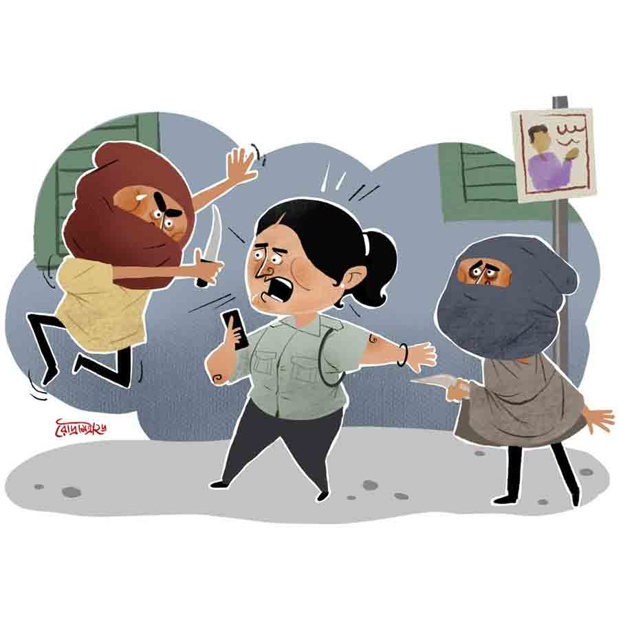

 
 <h1 align=center>ইশকাপনের বিবি</h1>
<h2 align=center>বাণীব্রত গোস্বামী</h2> 

মাধ্যমিকের গাঁটটা তিন বার ড্রপ খেয়ে পেরনোর পরেই সরস্বতী আমার সৎমা হয়ে গেলেন। সম্পর্ক একদম তলানিতে। সারা দিন ক্লাবে তখন টোয়েন্টি-নাইন পিটি। অবশ্য আমার বাকি দু’জন সঙ্গীর তুলনায় আমি বিদ্বান, কারণ তারা বড়জোর ক্লাস ফোর পাস! চিঁড়িতন ন্যাপা আর রুইতন পচা। ক্লাবের একমাত্র সদস্য হিসেবে বাঁকা, মানে বঙ্কুবিহারী দত্ত শুধু কলেজে পা দিয়েছে। আমাদের হরতন। মাঝেমধ্যে ফুলের মধু আর জ্যোৎস্না এক সঙ্গে চটকে কবিতা লেখে। গোপনে। তবে বঙ্কু দত্তের বুকের ভিতর একটা গভীর ‘গত্ত’ আছে। যেখানে পাতকুয়োর দড়ি-ছেঁড়া বালতির মতো ভাসছে একটা মুখ। রেল কলোনির মঞ্জু। এখন আমাদের দায়িত্ব হল, সেই বালতিটাকে বাঁকার কপিকলে মজবুত করে বেঁধে দেওয়া। কিন্তু কী ভাবে?

পচা একটা মতলব শোনাল, “আচ্ছা শিবুদা, বাঁকার কেসটায় যোজনা চারশো কুড়িটা কাজে লাগালে কেমন হয়?”

“সেটা আবার কী রে!”

এ বার কানের কাছে ফিসফিস করে কথাটা বলল পচা। কারণ পাশে ন্যাপা। গাঁজাড়ু তো! যখন তখন পরিকল্পনাটা ফুচুত করে লিক হয়ে যেতে পারে। তা হলেই কেলেঙ্কারি! পচাটা পেঁচো বাংলা মাতাল হলেও তালে ঠিক। মঞ্জু আবার সিভিক পুলিশ। ধরা পড়ে গেলে পিঠের চামড়া থাকবে না। মঞ্জু ছোটবেলা থেকেই ছেলেদের সঙ্গে কাবাডি আর ডাংগুলি খেলে বড় হয়েছে। ব্যাটাছেলের সাহস নিয়ে মেয়েলি গড়ন। অঙ্কফোবিয়া ওকে পড়াশোনায় বেশি এগোতে দেয়নি। ওটা ওর কাছে অঙ্কোলজির থেকেও দুরারোগ্য। তবে জীবনের অঙ্কে বেশ ওস্তাদ। পাড়ার এক নেতার সঙ্গে খুব ঢলাঢলি করত। এখন আর তেমন দেখি না। শুনেছি মাছ খেতে না দিলেও এক সময় কাঁটা চুষতে দিত। নেতাও পোষা হুলোর মতো গায়ে গায়ে ঘুরত। তার পরেই নাকি এই চাকরি!

মঞ্জু যেমন দজ্জাল, তেমনি সেয়ানা। চেহারাটাও এখন একেবারে বুলেটপ্রুফ। দরকারি জায়গা ছাড়া অতিরিক্ত কিছু নেই। তবে বাঁকার সঙ্গে কেসটা জমে যেতে পারে। এই ধরনের মেয়েরা একটু ন্যাতানো ছেলে পছন্দ করে। যেমন আমাদের পাড়ার ফোর-ফর্টি ট্রান্সফর্মারের গায়ে দেখেছি বাসরলতা আষ্টেপৃষ্ঠে জড়িয়ে থাকতে।

বাঁকার আর কী চিন্তা! ওর বাপ টেকো নরেশ দালালি করে ভালই মালকড়ি কামিয়েছে। কয়েক বছর আড্ডা দিয়ে ভালই কাটল। কিন্তু আমাদের তো এ বার কিছু একটা কাজকর্ম করা দরকার! সবাই তো আর ন্যাপা নয়, যে গাঁজার পুরিয়াটা জোগাড় হয়ে গেলেই একেবারে ব্যোম। পচাটা মাল খেলেও ওর চাটের খিদে আছে। কামাতে চায়। ও একটা নতুন লাইনের খবর আনল। পাথর! হ্যাঁ, পাথর সত্যিই কথা বলে। চিৎপুরে। রেলের ওয়াগন ভেঙে রাতের অন্ধকারে পাথর চুরি। ধীরে হলেও পাথর আমাদের কপাল ফেরাতে লাগল। এখন আমার পকেটে নোটের তাড়া থাকে।

কিন্তু এ দিকে বাঁকা ক্রমশ অধৈর্য হয়ে উঠছে। পুলিশের হ্যান্ডকাফে কবি তার ছন্দকে বেঁধে ফেলতে চাইছে। এক দিন খুব দুঃখ করল আমার কাছে, “শিবু, আমার কবিতা কেউ ছাপাচ্ছে না রে! আসলে কেউ বুঝতে পারছে না! বুঝবে একশো বছর পর!”

বললাম, “আমি তোর কবিতার বই ছাপাব। বন্ধুর উপকারেই যদি না লাগল, তবে এই পয়সা দিয়ে আমার হবে কী! তবে আমার শুধু একটাই ইচ্ছে, পোকাশকের জায়গায় নামটা থাকবে আমার, ‘শিবশঙ্কর হালদার’।”

গলে গেল বাঁকা, বলল, “তুই আমার বন্ধু নয় রে, শিবু! তুই আমার মরুভূমির ফুল, অকাল টাকের চুল! আমি ধন্য। এ বার ভাই, মঞ্জুর সঙ্গে চার হাত এক হয়ে গেলেই জীবন একদম জিঙ্গালালা!”

“ভাল কথা মনে করালি, তোর এই বয়সেই টাক পড়ছে কেন রে?”

“টেনশনে ভাই, টেনশনে। চুলের নীচেই তো রাজ্যের টেনশন! টেনশনের চুল পড়ে যায়, ফুর্তির চুল পড়ে না। টেকো সাধু দেখেছিস কোনও দিন? ওদের মনে কত ফুর্তি!”

“ঠিক বলেছিস। তোর বইটা আগে হোক। তাপ্পর মঞ্জুর কেসটা দেখছি।”

“মিলিয়ে নিস, আমার নামে এক দিন কলকাতায় রাস্তার নাম হবে!”

“কলকাতায় কি আর কোনও রাস্তা নাম-ছাড়া আছে রে? আর নতুন রাস্তা হবে বলেও তো মনে হয় না!”

“তুই ভাবছিস কেন? রাস্তা না হোক, উড়ালপুলের নাম হবে!”

এই কথার আমি কোনও উত্তর খুঁজে পেলাম না। মুচকি হেসে কেটে পড়লাম। সমস্যা এখন প্রচুর। পচা আবার প্রেম করছে নরেশকাকার মেয়ে নেড়ি, মানে বাঁকার বোনের সঙ্গে। সেটা জানতে পেরেও বাঁকা কোনও প্রতিবাদ করেনি। কারণ পচাও ওকে মঞ্জু-কেসে সাহায্য করবে। বিনিময় প্রথার চিরস্থায়ী বন্দোবস্ত। ন্যাপার ও সব ঝোঁক নেই! ওর যাবতীয় প্রেম গঞ্জিকার সঙ্গে। শিবঠাকুরের মতো। পার্বতী ওর লাগবে না। দেবদাস পার্বতীকে পেল কী না পেল, ওর সে দিকে হুঁশ নেই।

আমার আবার এক জনকে একটু ভাল লাগে। সামান্য। এখানে বলা উচিত হবে কি না জানি না। নাহ্‌, বলেই ফেলি, আমারও পছন্দ ওই মঞ্জুকেই। কিন্তু মুখ ফুটে বলতে পারি না। সাহসে কুলোয় না। যতই হোক, পুলিশে কাজ করে তো! আমি সে রকম লেখাপড়া জানি না, ওয়াগন ঝাড়ি। কেমন যেন বাধো ঠেকে। সেই জন্যই বাঁকার ব্যাপারে আমি এত আগ্ৰহী। সেই বিয়েবাড়িতে যেমন অনেকে আগে পাশের লোককে দেখিয়ে বলত, “এঁকে আর দুটো মিষ্টি দিন।” মিষ্টির বালতি এলে, হালকা চাপ দিলে, নিজেও দুটো নিত। অনেকটা সে রকমই।

এ বার পুজোয় মঞ্জুকে একটা বেশ দামি গগলস দিয়েছি। দোকানে বলল, অতিবেগুনি না অতিফুলুরি রশ্মি কী যেন আটকায়। তবু মঞ্জুর লাইনে আমি ইট পেতেও সরিয়ে নিয়েছি।

তাই বাঁকাকে নিয়ে আমার চিন্তা হয়! কী ভাবে পচার প্ল্যানটা আমি সফল করব। পচা আবার তার হবু শালা বাঁকার প্রেমের জন্য মাঝেমধ্যেই আমাকে চাপ দেয়। এ দিকে বাঁকা তো চিরকাল মাঠের ধারে দাঁড়িয়ে থেকে বড় হল। কোনও দিন বলে পা না দিয়ে কোনও ছেলে যে বড় হতে পারে, এ কথা বোধহয় বেদেও লেখা নেই। তবুও বাঁকা পারল। সারা বিকেল ঝিলপুকুরের জলে খোলামকুচি ছুড়ত। আবার কখনও গাছ থেকে ফুল ছিঁড়ে কুচিকুচি করে ঘাসের উপর জমিয়ে রাখত। বাপের ইমারতি বা দালালির ব্যবসায় বার বার বলা সত্ত্বেও যেতে ওর মন লাগত না। এই রকম একটা ছেলের সঙ্গে ঝাঁসি কী মঞ্জুরানির প্রেমটা পাকিয়ে দেওয়ার কার্বাইড আমার কাছে নেই। তবু চেষ্টা তো করতেই হবে! বন্ধু বলে কথা! মাঝখানে শুধু বাধার পাঁচিল নেই, তার উপর নানা সমস্যার পেরেক শীর্ষাসন করে দাঁড়িয়ে আছে। দেখা যাক কী হয়! মহড়া তো শুরু হল।

মঞ্জু রাত করে বাড়ি ফেরে উমাকান্ত সেন লেন দিয়ে। তখন ওদিকটা একটু শুনশান, অন্ধকার। চিত্রনাট্য মোটামুটি এই ভাবে সাজানো হয়েছে যে, প্রথমে পচা একটা ছুরি দেখাবে মঞ্জুকে। তার পর ন্যাপা মঞ্জুর পিঠে একটা মুলো বা গাজর ঠেকাবে বন্দুকের মতো, মুখে বলবে ‘হ্যান্ডস আপ’। সেই ফাঁকে পচা মঞ্জুর হাত থেকে মোবাইলটা নিয়ে পালাতে চাইবে। তখনই সেখানে হঠাৎ হাজির হবে বাঁকা। প্রথমে এক ধাক্কায় পচাকে ছিটকে ফেলে তার পর পা দিয়ে এক শটে ন্যাপাকে সরিয়ে দেবে। দু’জনকে কাবু করেই বাঁকা ছুটে গিয়ে পচার হাত থেকে মোবাইলটা ছিনিয়ে নেবে। এসে ফেরত দেবে মঞ্জুর হাতে। আশা করা যায় তখন মঞ্জু আর বাঁকার মাঝখানে একটা ভালবাসার বীজ পোঁতা হয়ে যাবে। তবে ভাবলেই তো আর হবে না! রিহার্সালের প্রয়োজন। মঞ্জুর চরিত্রে ক’দিন আমিই অভিনয়করতে লাগলাম।

সেদিন শিবরাত্রি। মাথায় দুধ-গঙ্গাজল পড়ায়, সব শিবই চাঙ্গা। আকাশে একফালি কুমড়োর মতো চাঁদ। চায়ের দোকানটায় একটা টিমটিমে আলো জ্বলছে। চায়ের ধোঁয়া লিকলিক করে মিশছে কুয়াশায়। তার ঠিক কোনাকুনি উল্টো ফুটপাতে রাখা কর্পোরেশনের একটা বিশাল পাইপ। তার আড়ালে দাঁড়িয়ে আছে বাঁকা। পরে এসেছে সিল্কের পাঞ্জাবি-পাজামা। ওর বাবা বরিষ্ঠ নাগরিক সংবর্ধনা সভায় যে শালটা পেয়েছিল, সেটা গায়ে দিয়ে এসেছে। মনুদার চায়ের দোকানের পাশের বটগাছটার আড়ালে হনুমান টুপি পরে মঞ্জুর আসার অপেক্ষায় রয়েছে পচা, ন্যাপা। মশার প্রতিটি হুল প্রতি মুহূর্তে বুঝিয়ে দিচ্ছে সময়ের টিকটিক কত দীর্ঘতর। সকলেই খুব অধৈর্য। গাছের আড়াল থেকে যে-ই না চলে যেতে যাবে, অমনি দেখে দূরে মঞ্জু আসছে। গায়ে গতরে ভরাট পুরুষালি নারীশরীরে আঁটোসাঁটো সিভিক পুলিশের পোশাক। হাতে মোবাইল।

মঞ্জু কাছাকাছি আসতেই পিংলে চেহারার পচা ভূতের মতো অন্ধকার থেকে লাফিয়ে পড়ল সামনে। ছুরিটা নিয়ে মঞ্জুর সামনে দাঁড়াতেই, মঞ্জু একটা কষে লাথি ঝাড়ল। ছিটকে পড়ল পচা। এর মধ্যেই ন্যাপা মুলোটা ঠেসে ধরল মঞ্জুর পিঠে। এ বার মঞ্জু একটু থতমত। কয়েক মুহূর্ত! একটা চিৎকার করতে যাবে, এমন সময় সেই ফাঁকে পচা উঠে মোবাইলটা হাত থেকে নিয়ে দে ছুট। এ দিকে বাঁকা তো আর বেরোয় না পাইপের আড়াল থেকে। আমি লাফিয়ে যাই পাইপের পাশে। বাঁকাকে ধাক্কা দিই পচাকে ধরার জন্য। দু’চার বার ধাক্কা দেওয়ার পর, বাঁকা পিঠের শাল, কাঁধের সাইড ব্যাগ সামলে শেষে ‘শ্যামা’ নৃত্যনাট্যের প্রহরীর আদলে দৌড় লাগায় ‘ধরো ধরো, ওই চোর, ওই চোর’ বলে। পিছনে ‘ধর শালাকে' বলে দৌড় লাগায় মঞ্জু। দূরে বন্দুকের মতো মুলো হাতে দাঁড়িয়ে থাকে ন্যাপা। এ দিকে পচা ইচ্ছে করলে কখন পগার পার হয়ে যেতে পারত মোবাইল নিয়ে। কিন্তু আগের কথামতো ও আস্তে দৌড়চ্ছে, যাতে সেই সুযোগে বাঁকা ওকে ধরতে পারে। কিন্তু তত ক্ষণে যা হওয়ার হয়ে গেছে, মঞ্জু দৌড়ে বাঁকাকে টপকে দিয়েছে। অনেকটাই পচার কাছাকাছি চলে গেছে।

সব্বোনাশ! এখন মঞ্জু যদি পচাকে ধরে ফেলে, তা হলে তো পুরো প্ল্যান ফেল। পচা এ বার উল্টো দিকে দৌড়চ্ছে। মঞ্জুর দিকেই। কিন্তু মঞ্জুকে কাটিয়ে নিল। মঞ্জু ধরতে পারল না পচাকে। সিনেমায় যেমন অনেক সময় নায়ক হালকা চড় মারলেও ভিলেনের চামচেরা খুব কষ্টে নানা শারীরিক কসরতে অনেক দূরে ছিটকে পড়ে গড়াতে থাকে, ঠিক সে ভাবেই পচা বাঁকার গায়ে এসে ঝাঁপিয়ে পড়ল।

বাঁকা পচাকে জড়িয়ে ধরার আগেই পচা চিৎকার করতে লাগল, “আমায় ছেড়ে দিন, আমি আর চুরি করব না।” এই বলে মোবাইলটা বাঁকার হাতে দিয়ে দিল। তার পর হাতজোড় করে বলল, “আমায় ছেড়ে দিন, আমি এ বার বাড়ি যাই। প্লি...জ়।”

ইতিমধ্যে মঞ্জু সেখানে হাজির। ভাগ্যিস সবার মুখে হনুমান টুপি আর রুমাল বাঁধা, না হলে মঞ্জু নির্ঘাত চিনে ফেলত। তবুও একটা কষে থাপ্পড় ঝাড়ল পচার গালে। দাঁতকপাটি খুলে যাওয়ার জোগাড়। তার পর জামার কলার ধরে হিড়হিড় টানতে লাগল থানায় নিয়ে যাওয়ার জন্য।

অবস্থা বেগতিক দেখে ময়দানে হাজির হলাম, “কী হয়েছে মঞ্জু?”

“দেখো না শিবুদা, এই ছিঁচকেটা আমার মোবাইল নিয়ে পালাচ্ছিল। বাঁকাদা না ধরলে আমার মোবাইলটাই আজ চুরি হয়ে যেত!”

বাঁকা তখন পাশে দাঁড়িয়ে শালের কোণটা আঙুলে নিয়ে গিঁট মারছে, নববধূর শাড়ির আঁচলের মতো। আর মাথা নিচু করে লজ্জায় মিটমিট করে হাসছে। আমি এ বার দায়িত্ব নিয়ে বলে উঠলাম, “মঞ্জু তুমি বাড়ি যাও। অনেক রাত হয়ে গেছে, ঠিক আছে আমি এটাকে থানায় দিয়ে দিচ্ছি।”

আমার দাদাগিরিটা একটা কথার পিনে একদম পাংচার করে দিল মঞ্জু।

“তুমি আবার কী থানায় দেবে? নেহাত তুমি চেনা তাই! তা না হলে তোমার কাজকর্মও জানতে বাকি নেই। এটা আবার তোমার চামচে নয় তো?”

“বিশ্বাস করো মঞ্জু, আমি এটাকে আগাপাছতলা মেরে হাড়গোড় গুঁড়ো করে থানায় জমা দেব। তুমি বাঁকার জন্য তোমার মোবাইলটা পেয়ে গেছ, যাও এ বার বাড়ি যাও। বাঁকা, একটু এগিয়ে দে মঞ্জুকে।”

মাধ্যমিকের গাঁটটা তিন বার ড্রপ খেয়ে পেরনোর পরেই সরস্বতী আমার সৎমা হয়ে গেলেন। সম্পর্ক একদম তলানিতে। সারা দিন ক্লাবে তখন টোয়েন্টি-নাইন পিটি। অবশ্য আমার বাকি দু’জন সঙ্গীর তুলনায় আমি বিদ্বান, কারণ তারা বড়জোর ক্লাস ফোর পাস! চিঁড়িতন ন্যাপা আর রুইতন পচা। ক্লাবের একমাত্র সদস্য হিসেবে বাঁকা, মানে বঙ্কুবিহারী দত্ত শুধু কলেজে পা দিয়েছে। আমাদের হরতন। মাঝেমধ্যে ফুলের মধু আর জ্যোৎস্না এক সঙ্গে চটকে কবিতা লেখে। গোপনে। তবে বঙ্কু দত্তের বুকের ভিতর একটা গভীর ‘গত্ত’ আছে। যেখানে পাতকুয়োর দড়ি-ছেঁড়া বালতির মতো ভাসছে একটা মুখ। রেল কলোনির মঞ্জু। এখন আমাদের দায়িত্ব হল, সেই বালতিটাকে বাঁকার কপিকলে মজবুত করে বেঁধে দেওয়া। কিন্তু কী ভাবে?

পচা একটা মতলব শোনাল, “আচ্ছা শিবুদা, বাঁকার কেসটায় যোজনা চারশো কুড়িটা কাজে লাগালে কেমন হয়?”

“সেটা আবার কী রে!”

এ বার কানের কাছে ফিসফিস করে কথাটা বলল পচা। কারণ পাশে ন্যাপা। গাঁজাড়ু তো! যখন তখন পরিকল্পনাটা ফুচুত করে লিক হয়ে যেতে পারে। তা হলেই কেলেঙ্কারি! পচাটা পেঁচো বাংলা মাতাল হলেও তালে ঠিক। মঞ্জু আবার সিভিক পুলিশ। ধরা পড়ে গেলে পিঠের চামড়া থাকবে না। মঞ্জু ছোটবেলা থেকেই ছেলেদের সঙ্গে কাবাডি আর ডাংগুলি খেলে বড় হয়েছে। ব্যাটাছেলের সাহস নিয়ে মেয়েলি গড়ন। অঙ্কফোবিয়া ওকে পড়াশোনায় বেশি এগোতে দেয়নি। ওটা ওর কাছে অঙ্কোলজির থেকেও দুরারোগ্য। তবে জীবনের অঙ্কে বেশ ওস্তাদ। পাড়ার এক নেতার সঙ্গে খুব ঢলাঢলি করত। এখন আর তেমন দেখি না। শুনেছি মাছ খেতে না দিলেও এক সময় কাঁটা চুষতে দিত। নেতাও পোষা হুলোর মতো গায়ে গায়ে ঘুরত। তার পরেই নাকি এই চাকরি!

মঞ্জু যেমন দজ্জাল, তেমনি সেয়ানা। চেহারাটাও এখন একেবারে বুলেটপ্রুফ। দরকারি জায়গা ছাড়া অতিরিক্ত কিছু নেই। তবে বাঁকার সঙ্গে কেসটা জমে যেতে পারে। এই ধরনের মেয়েরা একটু ন্যাতানো ছেলে পছন্দ করে। যেমন আমাদের পাড়ার ফোর-ফর্টি ট্রান্সফর্মারের গায়ে দেখেছি বাসরলতা আষ্টেপৃষ্ঠে জড়িয়ে থাকতে।

বাঁকার আর কী চিন্তা! ওর বাপ টেকো নরেশ দালালি করে ভালই মালকড়ি কামিয়েছে। কয়েক বছর আড্ডা দিয়ে ভালই কাটল। কিন্তু আমাদের তো এ বার কিছু একটা কাজকর্ম করা দরকার! সবাই তো আর ন্যাপা নয়, যে গাঁজার পুরিয়াটা জোগাড় হয়ে গেলেই একেবারে ব্যোম। পচাটা মাল খেলেও ওর চাটের খিদে আছে। কামাতে চায়। ও একটা নতুন লাইনের খবর আনল। পাথর! হ্যাঁ, পাথর সত্যিই কথা বলে। চিৎপুরে। রেলের ওয়াগন ভেঙে রাতের অন্ধকারে পাথর চুরি। ধীরে হলেও পাথর আমাদের কপাল ফেরাতে লাগল। এখন আমার পকেটে নোটের তাড়া থাকে।

কিন্তু এ দিকে বাঁকা ক্রমশ অধৈর্য হয়ে উঠছে। পুলিশের হ্যান্ডকাফে কবি তার ছন্দকে বেঁধে ফেলতে চাইছে। এক দিন খুব দুঃখ করল আমার কাছে, “শিবু, আমার কবিতা কেউ ছাপাচ্ছে না রে! আসলে কেউ বুঝতে পারছে না! বুঝবে একশো বছর পর!”

বললাম, “আমি তোর কবিতার বই ছাপাব। বন্ধুর উপকারেই যদি না লাগল, তবে এই পয়সা দিয়ে আমার হবে কী! তবে আমার শুধু একটাই ইচ্ছে, পোকাশকের জায়গায় নামটা থাকবে আমার, ‘শিবশঙ্কর হালদার’।”

গলে গেল বাঁকা, বলল, “তুই আমার বন্ধু নয় রে, শিবু! তুই আমার মরুভূমির ফুল, অকাল টাকের চুল! আমি ধন্য। এ বার ভাই, মঞ্জুর সঙ্গে চার হাত এক হয়ে গেলেই জীবন একদম জিঙ্গালালা!”

“ভাল কথা মনে করালি, তোর এই বয়সেই টাক পড়ছে কেন রে?”

“টেনশনে ভাই, টেনশনে। চুলের নীচেই তো রাজ্যের টেনশন! টেনশনের চুল পড়ে যায়, ফুর্তির চুল পড়ে না। টেকো সাধু দেখেছিস কোনও দিন? ওদের মনে কত ফুর্তি!”

“ঠিক বলেছিস। তোর বইটা আগে হোক। তাপ্পর মঞ্জুর কেসটা দেখছি।”

“মিলিয়ে নিস, আমার নামে এক দিন কলকাতায় রাস্তার নাম হবে!”

“কলকাতায় কি আর কোনও রাস্তা নাম-ছাড়া আছে রে? আর নতুন রাস্তা হবে বলেও তো মনে হয় না!”

“তুই ভাবছিস কেন? রাস্তা না হোক, উড়ালপুলের নাম হবে!”

এই কথার আমি কোনও উত্তর খুঁজে পেলাম না। মুচকি হেসে কেটে পড়লাম। সমস্যা এখন প্রচুর। পচা আবার প্রেম করছে নরেশকাকার মেয়ে নেড়ি, মানে বাঁকার বোনের সঙ্গে। সেটা জানতে পেরেও বাঁকা কোনও প্রতিবাদ করেনি। কারণ পচাও ওকে মঞ্জু-কেসে সাহায্য করবে। বিনিময় প্রথার চিরস্থায়ী বন্দোবস্ত। ন্যাপার ও সব ঝোঁক নেই! ওর যাবতীয় প্রেম গঞ্জিকার সঙ্গে। শিবঠাকুরের মতো। পার্বতী ওর লাগবে না। দেবদাস পার্বতীকে পেল কী না পেল, ওর সে দিকে হুঁশ নেই।

আমার আবার এক জনকে একটু ভাল লাগে। সামান্য। এখানে বলা উচিত হবে কি না জানি না। নাহ্‌, বলেই ফেলি, আমারও পছন্দ ওই মঞ্জুকেই। কিন্তু মুখ ফুটে বলতে পারি না। সাহসে কুলোয় না। যতই হোক, পুলিশে কাজ করে তো! আমি সে রকম লেখাপড়া জানি না, ওয়াগন ঝাড়ি। কেমন যেন বাধো ঠেকে। সেই জন্যই বাঁকার ব্যাপারে আমি এত আগ্ৰহী। সেই বিয়েবাড়িতে যেমন অনেকে আগে পাশের লোককে দেখিয়ে বলত, “এঁকে আর দুটো মিষ্টি দিন।” মিষ্টির বালতি এলে, হালকা চাপ দিলে, নিজেও দুটো নিত। অনেকটা সে রকমই।

এ বার পুজোয় মঞ্জুকে একটা বেশ দামি গগলস দিয়েছি। দোকানে বলল, অতিবেগুনি না অতিফুলুরি রশ্মি কী যেন আটকায়। তবু মঞ্জুর লাইনে আমি ইট পেতেও সরিয়ে নিয়েছি।

তাই বাঁকাকে নিয়ে আমার চিন্তা হয়! কী ভাবে পচার প্ল্যানটা আমি সফল করব। পচা আবার তার হবু শালা বাঁকার প্রেমের জন্য মাঝেমধ্যেই আমাকে চাপ দেয়। এ দিকে বাঁকা তো চিরকাল মাঠের ধারে দাঁড়িয়ে থেকে বড় হল। কোনও দিন বলে পা না দিয়ে কোনও ছেলে যে বড় হতে পারে, এ কথা বোধহয় বেদেও লেখা নেই। তবুও বাঁকা পারল। সারা বিকেল ঝিলপুকুরের জলে খোলামকুচি ছুড়ত। আবার কখনও গাছ থেকে ফুল ছিঁড়ে কুচিকুচি করে ঘাসের উপর জমিয়ে রাখত। বাপের ইমারতি বা দালালির ব্যবসায় বার বার বলা সত্ত্বেও যেতে ওর মন লাগত না। এই রকম একটা ছেলের সঙ্গে ঝাঁসি কী মঞ্জুরানির প্রেমটা পাকিয়ে দেওয়ার কার্বাইড আমার কাছে নেই। তবু চেষ্টা তো করতেই হবে! বন্ধু বলে কথা! মাঝখানে শুধু বাধার পাঁচিল নেই, তার উপর নানা সমস্যার পেরেক শীর্ষাসন করে দাঁড়িয়ে আছে। দেখা যাক কী হয়! মহড়া তো শুরু হল।

মঞ্জু রাত করে বাড়ি ফেরে উমাকান্ত সেন লেন দিয়ে। তখন ওদিকটা একটু শুনশান, অন্ধকার। চিত্রনাট্য মোটামুটি এই ভাবে সাজানো হয়েছে যে, প্রথমে পচা একটা ছুরি দেখাবে মঞ্জুকে। তার পর ন্যাপা মঞ্জুর পিঠে একটা মুলো বা গাজর ঠেকাবে বন্দুকের মতো, মুখে বলবে ‘হ্যান্ডস আপ’। সেই ফাঁকে পচা মঞ্জুর হাত থেকে মোবাইলটা নিয়ে পালাতে চাইবে। তখনই সেখানে হঠাৎ হাজির হবে বাঁকা। প্রথমে এক ধাক্কায় পচাকে ছিটকে ফেলে তার পর পা দিয়ে এক শটে ন্যাপাকে সরিয়ে দেবে। দু’জনকে কাবু করেই বাঁকা ছুটে গিয়ে পচার হাত থেকে মোবাইলটা ছিনিয়ে নেবে। এসে ফেরত দেবে মঞ্জুর হাতে। আশা করা যায় তখন মঞ্জু আর বাঁকার মাঝখানে একটা ভালবাসার বীজ পোঁতা হয়ে যাবে। তবে ভাবলেই তো আর হবে না! রিহার্সালের প্রয়োজন। মঞ্জুর চরিত্রে ক’দিন আমিই অভিনয়করতে লাগলাম।

সেদিন শিবরাত্রি। মাথায় দুধ-গঙ্গাজল পড়ায়, সব শিবই চাঙ্গা। আকাশে একফালি কুমড়োর মতো চাঁদ। চায়ের দোকানটায় একটা টিমটিমে আলো জ্বলছে। চায়ের ধোঁয়া লিকলিক করে মিশছে কুয়াশায়। তার ঠিক কোনাকুনি উল্টো ফুটপাতে রাখা কর্পোরেশনের একটা বিশাল পাইপ। তার আড়ালে দাঁড়িয়ে আছে বাঁকা। পরে এসেছে সিল্কের পাঞ্জাবি-পাজামা। ওর বাবা বরিষ্ঠ নাগরিক সংবর্ধনা সভায় যে শালটা পেয়েছিল, সেটা গায়ে দিয়ে এসেছে। মনুদার চায়ের দোকানের পাশের বটগাছটার আড়ালে হনুমান টুপি পরে মঞ্জুর আসার অপেক্ষায় রয়েছে পচা, ন্যাপা। মশার প্রতিটি হুল প্রতি মুহূর্তে বুঝিয়ে দিচ্ছে সময়ের টিকটিক কত দীর্ঘতর। সকলেই খুব অধৈর্য। গাছের আড়াল থেকে যে-ই না চলে যেতে যাবে, অমনি দেখে দূরে মঞ্জু আসছে। গায়ে গতরে ভরাট পুরুষালি নারীশরীরে আঁটোসাঁটো সিভিক পুলিশের পোশাক। হাতে মোবাইল।

মঞ্জু কাছাকাছি আসতেই পিংলে চেহারার পচা ভূতের মতো অন্ধকার থেকে লাফিয়ে পড়ল সামনে। ছুরিটা নিয়ে মঞ্জুর সামনে দাঁড়াতেই, মঞ্জু একটা কষে লাথি ঝাড়ল। ছিটকে পড়ল পচা। এর মধ্যেই ন্যাপা মুলোটা ঠেসে ধরল মঞ্জুর পিঠে। এ বার মঞ্জু একটু থতমত। কয়েক মুহূর্ত! একটা চিৎকার করতে যাবে, এমন সময় সেই ফাঁকে পচা উঠে মোবাইলটা হাত থেকে নিয়ে দে ছুট। এ দিকে বাঁকা তো আর বেরোয় না পাইপের আড়াল থেকে। আমি লাফিয়ে যাই পাইপের পাশে। বাঁকাকে ধাক্কা দিই পচাকে ধরার জন্য। দু’চার বার ধাক্কা দেওয়ার পর, বাঁকা পিঠের শাল, কাঁধের সাইড ব্যাগ সামলে শেষে ‘শ্যামা’ নৃত্যনাট্যের প্রহরীর আদলে দৌড় লাগায় ‘ধরো ধরো, ওই চোর, ওই চোর’ বলে। পিছনে ‘ধর শালাকে' বলে দৌড় লাগায় মঞ্জু। দূরে বন্দুকের মতো মুলো হাতে দাঁড়িয়ে থাকে ন্যাপা। এ দিকে পচা ইচ্ছে করলে কখন পগার পার হয়ে যেতে পারত মোবাইল নিয়ে। কিন্তু আগের কথামতো ও আস্তে দৌড়চ্ছে, যাতে সেই সুযোগে বাঁকা ওকে ধরতে পারে। কিন্তু তত ক্ষণে যা হওয়ার হয়ে গেছে, মঞ্জু দৌড়ে বাঁকাকে টপকে দিয়েছে। অনেকটাই পচার কাছাকাছি চলে গেছে।

সব্বোনাশ! এখন মঞ্জু যদি পচাকে ধরে ফেলে, তা হলে তো পুরো প্ল্যান ফেল। পচা এ বার উল্টো দিকে দৌড়চ্ছে। মঞ্জুর দিকেই। কিন্তু মঞ্জুকে কাটিয়ে নিল। মঞ্জু ধরতে পারল না পচাকে। সিনেমায় যেমন অনেক সময় নায়ক হালকা চড় মারলেও ভিলেনের চামচেরা খুব কষ্টে নানা শারীরিক কসরতে অনেক দূরে ছিটকে পড়ে গড়াতে থাকে, ঠিক সে ভাবেই পচা বাঁকার গায়ে এসে ঝাঁপিয়ে পড়ল।

বাঁকা পচাকে জড়িয়ে ধরার আগেই পচা চিৎকার করতে লাগল, “আমায় ছেড়ে দিন, আমি আর চুরি করব না।” এই বলে মোবাইলটা বাঁকার হাতে দিয়ে দিল। তার পর হাতজোড় করে বলল, “আমায় ছেড়ে দিন, আমি এ বার বাড়ি যাই। প্লি...জ়।”

ইতিমধ্যে মঞ্জু সেখানে হাজির। ভাগ্যিস সবার মুখে হনুমান টুপি আর রুমাল বাঁধা, না হলে মঞ্জু নির্ঘাত চিনে ফেলত। তবুও একটা কষে থাপ্পড় ঝাড়ল পচার গালে। দাঁতকপাটি খুলে যাওয়ার জোগাড়। তার পর জামার কলার ধরে হিড়হিড় টানতে লাগল থানায় নিয়ে যাওয়ার জন্য।

অবস্থা বেগতিক দেখে ময়দানে হাজির হলাম, “কী হয়েছে মঞ্জু?”

“দেখো না শিবুদা, এই ছিঁচকেটা আমার মোবাইল নিয়ে পালাচ্ছিল। বাঁকাদা না ধরলে আমার মোবাইলটাই আজ চুরি হয়ে যেত!”

বাঁকা তখন পাশে দাঁড়িয়ে শালের কোণটা আঙুলে নিয়ে গিঁট মারছে, নববধূর শাড়ির আঁচলের মতো। আর মাথা নিচু করে লজ্জায় মিটমিট করে হাসছে। আমি এ বার দায়িত্ব নিয়ে বলে উঠলাম, “মঞ্জু তুমি বাড়ি যাও। অনেক রাত হয়ে গেছে, ঠিক আছে আমি এটাকে থানায় দিয়ে দিচ্ছি।”

আমার দাদাগিরিটা একটা কথার পিনে একদম পাংচার করে দিল মঞ্জু।

“তুমি আবার কী থানায় দেবে? নেহাত তুমি চেনা তাই! তা না হলে তোমার কাজকর্মও জানতে বাকি নেই। এটা আবার তোমার চামচে নয় তো?”

“বিশ্বাস করো মঞ্জু, আমি এটাকে আগাপাছতলা মেরে হাড়গোড় গুঁড়ো করে থানায় জমা দেব। তুমি বাঁকার জন্য তোমার মোবাইলটা পেয়ে গেছ, যাও এ বার বাড়ি যাও। বাঁকা, একটু এগিয়ে দে মঞ্জুকে।”

অন্ধকারে মনে হয় নাটকটা ধরতে পারেনি মঞ্জু। বলির পাঁঠার মতো পচা কাঁপছে। দেখলাম, আবছা ভেপার আলোয় কথা বলতে বলতে মিলিয়ে গেল মঞ্জু আর বাঁকা।

যাক! এখন দেখা যাক মঞ্জুর মন বাঁকার দিকে বেঁকে কি না। কারণ ভয় একটাই, এখানে তো মালি নিজেই ফুল। সে আর ফুলের যত্ন নেবে কী? আর ফুলও তো আবার যে সে ফুল নয়, একেবারে বিষ-ধুতরো। ছক্কা নিজে কৌটোয় ঢুকবে, না কৌটো ছক্কাকে চালবে, সেটা ভবিষ্যৎ বলবে।

অনেক দিন হয়ে গেল, মঞ্জু বা বাঁকা রাডারে ধরা পড়েনি! হঠাৎ পুজোর আগে মঞ্জুর ফোন, “শিবুদা, তোমার মাপটা বলো না গো!”

মাপ! মস্তানরা গলার মাপ জানতে চায় শুনেছি, কিন্তু পুলিশ কিসের মাপ জানতে চায়! ঘাবড়ে গিয়ে বললাম, “কিসের মাপ?”

“বোকা কোথাকার! তোমার জামার আর প্যান্টের জন্য কোমরের! পুজোয় দেব।”

অবাক হয়ে বলি, “আমাকে?”

“হ্যাঁ মশাই!”

“কেন? হঠাৎ!”

“প্রেম করতে হয় কবির সঙ্গে। কিন্তু বিয়ে করতে হয় প্রকাশককে!”

(এই প্রতিবেদনটি আনন্দবাজার পত্রিকার মুদ্রিত সংস্করণ থেকে নেওয়া হয়েছে)

