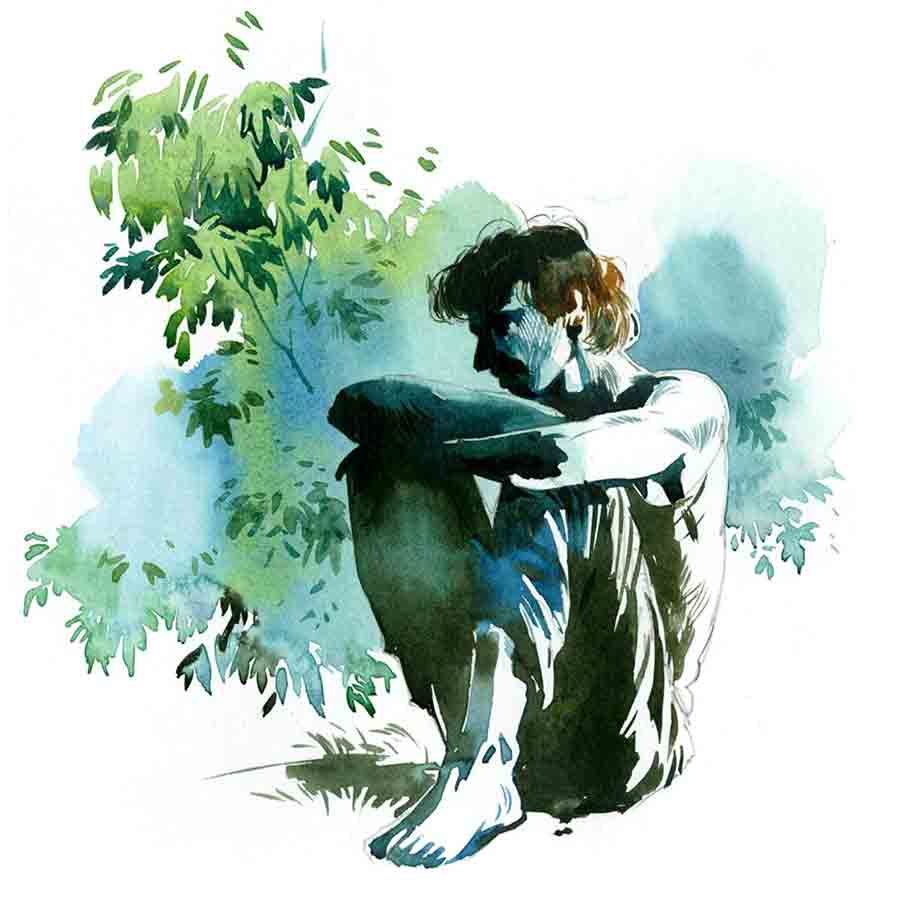

 
 <h1 align=center>একটি গাছের গল্প</h1>
<h2 align=center>জয়দীপ চক্রবর্তী</h2> 

আমি চিরকালই ক্যাবলা। স্কুলে গেলে বন্ধুরা আমার টিফিন খেয়ে নিত। আমি না খেয়ে খালিপেটে বাড়ি ফিরে আসতাম। ক্লাসে বন্ধুরা দুষ্টুমি করে আমার ঘাড়ে দোষ চাপিয়ে দিত। আমি বেমালুম মুখ বুজে মার খেতাম। আমার দুরবস্থা দেখে বন্ধুরা খুশি হত। ক্লাসের মধ্যেই আমার দিকে চেয়ে মুখ টিপে হাসত। যেন রোজ-রোজ আমার মার খাওয়াটা দারুণ মজার একটা ব্যাপার। আমার রাগ হত। নিজেকে অসহায় লাগত। কিন্তু কী করব বুঝে উঠতে না পেরে আমি চুপ করে থাকতাম। প্রতিবাদ করার মতো সাহস আমার কস্মিনকালে ছিল না।

সবাই জানত, আমার বয়সি আর পাঁচ জনের মতো আমি চালাক-চতুর নই। কাজেই মা আমাকে মুদির দোকানে পাঠালে দোকানি নিশ্চিন্তে ওজনে কম মাল দিত। আমি ধরতে পারতাম না। কাঁচা আনাজ কিনে এনে প্রায়ই দেখতাম, ভাল আলুর সঙ্গে পচা আলু মিশে আছে। কানা, পোকা-ধরা বেগুনও মাঝেমধ্যেই পাওয়া যেত আমার বাজারের ব্যাগে। বাবা প্রায়ই আমাকে অকর্মণ্য, অপদার্থ বলে চেঁচামেচি করতেন। প্রথম-প্রথম আমার খুব খারাপ লাগত। কিন্তু পরে এই সব কিছুই আমার কেমন যেন অভ্যেস হয়ে গিয়েছিল।

লিচু গাছটা যখন কিনি, আমার বয়েস পনেরো। বারুইপুর বয়েজ় স্কুলে ক্লাস টেনে পড়ি। আমাদের স্কুলের কাছেই চৌধুরীবাবুদের মস্ত রাসমেলার মাঠ। চৌধুরীরা এক সময় এ অঞ্চলের ডাকসাইটে জমিদার ছিলেন। বাঘে গরুতে এক ঘাটে জল খেত বাবুদের দাপটে। মাঠের এক প্রান্তে ছিল তাঁদের মস্ত প্রাসাদ। সেই প্রাসাদে ঢোকার আগে যে দেউড়ি, তার মাথায় পায়ের নীচে ফুটবলের মতো পৃথিবী নিয়ে এক জোড়া পাথরের সিংহ দাঁড়িয়ে থাকত উদ্ধত ভঙ্গিতে। সেই ফটক পার হয়ে খানিক এগোলে কালীমন্দির, রাধাকৃষ্ণের মন্দির আর দুর্গাপুজোর মস্ত ঠাকুরদালান। ঠাকুরদালানের খিলানে চোখ-জুড়োনো কারুকার্য।

এখন অবশ্য জমিদারি প্রথা নেই। জমিদারদের জৌলুসও নেই। মস্ত প্রাসাদের অধিকাংশই ভেঙে পড়েছে। জমিদারবাড়িতে ঢোকার মূল ফটকের উপরে দাঁড়িয়ে থাকা সিংহ, জংলি লতা আর দেওয়াল ফুঁড়ে ওঠা অশ্বত্থ গাছে ঢাকা পড়েছে বহুকাল। সন্ধের পর মাঠে দাঁড়িয়ে জমিদারবাড়ির দিকে তাকালে গা ছমছম করে ওঠে। যেন রহস্যময় এক খণ্ডহর। সেই খণ্ডহরের মধ্যেই অতীতের স্মৃতি আঁকড়ে এখনও ওই মন্দিরগুলো, ঠাকুরদালান আর মস্ত মাঠটাই কেবল অটুট রয়ে গেছে। মাঠের মাঝখানে মস্ত বড়, বাঁধানো রাসমঞ্চ। আর মাঠের এক প্রান্তে দাঁড়িয়ে থাকা পুরনো, রংচটা কাঠের পেল্লায় রথ। ফি-বছর রাসপূর্ণিমা আর রথের মেলায় এই রাসমঞ্চ আর অনাদরে পড়ে থাকা রথটি নতুন করে সেজে ওঠে। মেলা বসে মাঠ জুড়ে।

আমাদের স্কুল যে হেতু জমিদারদের দান করা জায়গার উপরেই প্রতিষ্ঠিত, তাই জমিদারবাড়ির মেলা-পার্বণে আমাদের স্কুল অনেক সময়েই হাফ ছুটি হয়ে যেত। সে দিনও তাই হয়েছিল সম্ভবত। আষাঢ় মাস তখনও শেষ হয়নি। ফ্যাকাসে আকাশে মেঘের ওড়াউড়ি সূর্যকে ঢেকে রেখেছে। জমিদারদের রাসের মাঠে রথের মেলা চলছে। আকাশ মেঘলা। হঠাৎ স্কুল ছুটি হয়ে যেতে আমাদের ক্লাসের সুতীর্থই প্রস্তাবটা দিয়েছিল, “চল, রথের মেলায় ঘুরতে যাই।”

রণিত, সোমব্রত, নীলাঞ্জনরা হইহই করে উঠেছিল, “চল, চল।”

আমাকে ওরা ডাকেনি, তবু প্রায় জোর করেই রণিতদের সঙ্গে জুটে গিয়েছিলাম আমি। গ্রাম মফস্‌সলের আর পাঁচটা মেলা যেমন হয়, রথের মেলাটা তেমনই ছিল। ভিজে, কাদা-প্যাচপেচে মাঠ। তার ধারে ধারে অস্থায়ী ছাউনিতে হরেক রকম জিনিসপত্তরের ছোট্ট ছোট্ট দোকান বসেছে। সে সব দোকানের কোনওটায় বালিখোলায় চিনেবাদাম ভাজা চলছে; আবার কোথাও চপ, ফুলুরি, বেগুনি, তেলেভাজার গন্ধে ম-ম করছে বাতাস। সেই গন্ধেই মিশে যাচ্ছে পাশের দোকানে সাজিয়ে রাখা জিলিপি, গজা, কটকটি আর ঝুরিভাজার গন্ধ। আমরা জিলিপি খেলাম। চিনেবাদাম খেলাম। তার পর গিয়ে হাজির হলাম হার, দুল,কাচের চুড়ি আর নানা রকমের টিপ বিক্রি হচ্ছে যে দোকানগুলোয়, তাদের সামনে।

আগেই বলেছি, আমাদের তখন ক্লাস টেন। নাকের নীচে সদ্য আবছা গোঁফের রেখা বেরিয়েছে। আমাদের স্কুলের খুব কাছাকাছি একটি মেয়েদের স্কুল ছিল। আমাদের বয়েজ় স্কুলের অনেক ছাত্রের সঙ্গেই ওই স্কুলের মেয়েদের গভীর মেলামেশা। সেই মেলামেশা থেকে ক্রমশ প্রেম। আমি জানি, নীলাঞ্জন রূপাঞ্জনাকে ভালোবাসত। রণিতের প্রেম ছিল মৌবনির সঙ্গে। ওরা ব্যাগ খুলে টিফিনের খরচ বাঁচানো টাকা বার করে দোকান থেকে টিপের পাতা কিনল। কাচের চুড়ি কিনল। তার পর যত্ন করে সেগুলো ব্যাগে ঢোকাতে ঢোকাতে আমার দিকে চেয়ে বলল, “এই ক্যাবলাকান্ত, কাউকে কিছু বলবি না কিন্তু।”

“আচ্ছা,” বাধ্য ছেলের মতো ঘাড় নেড়েছিলাম আমি। ওরা নিশ্চিত ছিল, আমার সঙ্গে কোনও মেয়ের প্রেম নেই। আমার মতো ক্যাবলা আর অপদার্থ ছেলের সঙ্গে কোনও মেয়ের প্রেম হতেই পারে না।

ইতির সঙ্গে আমার প্রেম ছিল না। আমি তাকে কখনও বলতেই পারিনি যে, তাকে আমার ভাল লাগে। অঙ্ক স্যরের পড়ার ব্যাচে আমি তাকে লুকিয়ে লুকিয়ে দেখতাম। ব্যস, এইটুকুই। তবুও আমার খুব ইচ্ছে করছিল, ইতির জন্য কিছু কিনি। এক জোড়া দুল, কিংবা একটা সরু চেন। নিদেনপক্ষে দুটো টিপের পাতা। কিন্তু নীলাঞ্জনদের কথা ভেবে আমি কিছুই কিনলাম না। এক্ষুনি হাজার রকম প্রশ্ন করবে ওরা। স্কুলে গিয়ে আমাকে জ্বালিয়ে মারবে সারা ক্ষণ। তা ছাড়া আর একটা ভয়ও আমার ছিল। যদি কিছু একটা কিনেও ফেলি, ইতিকে সকলের চোখ এড়িয়ে দেব কেমন করে? আর আমি দিলেই কি সে নেবে? সে তো জানেই না, মনে মনে তাকে কত ভালবাসি আমি! আমি দোকান পেরিয়ে গিয়েছিলাম ধীরপায়ে হাঁটতে হাঁটতে।

নীলাঞ্জন আমার সঙ্গে মজা করার জন্যই বলল, “কী রে, তুই মেলা থেকে কিছু কিনবি না?”

তখনই চিন্তাটা মাথায় এসেছিল আমার। আমি আর এক মুহূর্ত দেরি করিনি। মেলায় ঢোকার মুখেই বাঁ হাতে কয়েকটা গাছের চারার দোকান। ফুলের চারা, ফলের চারা, ঘর সাজানোর নানা রকম বাহারি গাছ, কী নেই সেখানে! তারই মধ্যে একটা দোকান কাঞ্চনকাকুর। কাঞ্চনকাকু আমাকে চেনে। ওর ভাইপো রাজেন আমাদের সঙ্গে একই ক্লাসে পড়ত। বছর দুই ফেল করে এখন স্কুল ছেড়ে হাতের কাজ শিখছে। রাজুর সঙ্গে বারদুয়েক ওদের বাড়িতে গেছি। কাঞ্চনকাকু তখন দেখেছে আমায়।

আমি দোকানের সামনে গিয়ে দাঁড়াতে কাঞ্চনকাকু আমায় চিনতে পারল। হেসে বলল, “কী খবর ভাইপো, মেলা দেখতে এসচ?”

“হুঁ,” উপর-নীচে মাথা নেড়েই আমি তড়িঘড়ি বললাম, “কাকু, আমাকে একটা ভাল দেখে লিচু গাছের চারা দেবে?”

“বাড়ির জন্য?” কাকু আমার দিকে চেয়ে জিজ্ঞেস করলেন।

“হ্যাঁ,” আমি বললাম, “এমন একটা চারা দাও, যাতে খুব তাড়াতাড়ি ফল ধরে।”

এক দিন স্যরের ব্যাচে কথায় কথায় ইতি বলেছিল, তার সবচেয়ে প্রিয় ফল লিচু। আমের থেকেও লিচু সে বেশি পছন্দ করে।

কাঞ্চনকাকু বলল, “ভাইপো, একটা কলমের গাছ দিচ্ছি। দামটা একটু বেশি। কিন্তু জাতটা দারুণ। নিয়ে গিয়ে বাগানে পুঁতে দাও। বছর দুয়েকের মধ্যেই বোল এসে যাবে গাছে...”

আমি আমাদের বাড়ির ঠিক পিছনে বাগানে পুঁতে দিয়েছিলাম গাছটাকে। লিচু ইতির প্রিয় ফল। ইতির জন্যেই শুধু এই গাছটা কিনেছি আমি। তাই গাছটা খুব প্রিয় ছিল আমার। যাতে সত্যিই দ্রুত ফল ধরে, খুব সেবা-যত্ন করতাম আমি গাছটাকে। দু’বছর পরেও যদি গাছে ফল ধরে, আমরা তখন ক্লাস টুয়েলভ। ইতিকে আমার গাছের লিচু খাওয়াতে পারব অঙ্ক স্যরের ব্যাচে নিয়ে গিয়ে। ইতি পড়াশোনায় খুব ভাল। আমি জানতাম, ও সায়েন্স নিয়েই পড়বে। শুধু ইতির সঙ্গে এক সঙ্গে পড়তে হবে বলেই আমি পড়াশোনায় আরও মন দিয়েছিলাম।

যে দিন স্যরের বাড়িতে ক্লাস টেনের শেষ পড়ার দিন, ইতিকে ফিসফিস করে বলেছিলাম, “তোর জন্য একটা খুব ভাল উপহার জমিয়ে রেখেছি, জানিস তো?”

“আমার জন্য?”

“হ্যাঁ, শুধুই তোর জন্য,” আমার গলা কাঁপছিল। হাতের তালু ঘামছিল।

ইতি সেই প্রথম আমার চোখের উপর সরাসরি নিজের চোখ রেখেছিল। কৌতূহলী হয়ে জিজ্ঞেস করেছিল, “কী উপহার?”

“একটা গাছ।”

“গাছ?” অবাক হয়েছিল ইতি।

“হ্যাঁ,” মাথা নিচু করে বলেছিলাম, “লিচু গাছ। তুই লিচু খেতে ভালবাসিস। কাঞ্চনকাকু বলেছে, দু’বছরের মধ্যেই গাছে ফল আসবে। ওই গাছের প্রথম ফল শুধু তোর। আর কাউকে খেতে দেব না আমি। তুই এক দিন আমাদের বাড়িতে আসবি?”

“তোর বাড়িতে?” ভ্রু কোঁচকায় ইতি, “কেন?”

“গাছটাকে দেখতে।”

আমার কথা শুনে ইতি খিলখিল করে হেসে উঠেছিল। তার পর কোনও উত্তর না দিয়েই হাঁটা লাগিয়েছিল নিজের বাড়ির দিকে।

আমি বোকার মতো রাস্তায় একলা দাঁড়িয়ে রইলাম আরও কিছু ক্ষণ। কিছুতেই বুঝতে পারলাম না, কী এমন হাসির কথা বলে ফেলেছি।

*****

পরে বুঝেছিলাম, কাঞ্চনকাকুও আমাকে বোকা পেয়ে ঠকিয়েই দিয়েছে। দু’বছরের জায়গায় দশ-বারো বছর পেরিয়ে গেল। রথের মেলা থেকে কিনে আনা ছোট্ট লিচু গাছটা বড় হয়ে গেল। আমি, রণিত, নীলাঞ্জন, সোমব্রত স্কুল, কলেজ, ইউনিভার্সিটি পেরিয়ে ছোট-বড় চাকরিতে ঢুকে পড়লাম। যখন কলেজে পড়ি, আমার বাবা মারা গেলেন। ইতির বিয়ে হয়ে গেল কলেজ পাশ করে বেরিয়েই। কিন্তু গাছটায় ফল দূরের কথা, ফুল পর্যন্ত ধরল না। আর ইতিও এক বারের জন্যও দেখতে এল না গাছটাকে।

ইতির বিয়ে হয়ে গেল যখন, আমার খুব মনখারাপ হয়েছিল। দিন কয়েক উদাস-উদাস মুখে ঘুরে বেড়িয়েছিলাম উদ্‌ভ্রান্তের মতো। সেই সময় এক বার কখনও যা করিনি, তা-ই করে ফেলেছিলাম। কাঞ্চনকাকুর দোকানে গিয়ে চিৎকার করে বললাম, “তুমি আমাকে এই ভাবে কেন ঠকালে কাঞ্চনকাকু? আমি তো তোমাকে বিশ্বাস করেছিলাম!”

কাঞ্চনকাকু কিছুই বুঝতে না পেরে হাঁ করে তাকিয়ে ছিল আমার মুখের দিকে। আমি আবার বললাম, “বিক্রি করার সময় তুমি তো বলেছিলে, দু’বছরের মধ্যেই বোল আসবে লিচু গাছে। ইতির বিয়ে হয়ে গেল, তবুও তো আমার গাছে বোল ধরল না...”

কাঞ্চনকাকু কী বুঝেছিল কে জানে! আমার মাথায় হাত বুলিয়ে দিলে বলেছিল, “ধৈর্য ধরো। মনে রেখো ভাইপো, কারও তাড়াতাড়ি হয়, কারও পরে। কিন্তু ধৈর্যে সব হয়। এক দিন বাঁজা গাছও হঠাৎ ফলের ভারে নুয়ে পড়ে মাটিতে।”

আমি কিছু না বুঝে ভ্যাবলার মতো মুখ করে বাড়ি ফিরে এসেছিলাম।

আগে সকালে-বিকেলে সুযোগ পেলেই গাছটার কাছে গিয়ে দাঁড়াতাম। তার গায়ে হাত বোলাতাম। জল দিতাম শিকড়ে। এখন কিছুই করি না। অফিস থেকে ফিরে মাঝে মাঝে ঝুপসি অন্ধকার করে দাঁড়িয়ে থাকা ঝাঁকড়া গাছটার দিকে তাকিয়ে থাকি। গাছের একটা অংশ আমাদের বাড়ির ছাদের উপরে এসে পড়েছে। শুকনো পাতা পড়ে ছাদ নোংরা হয়ে থাকে। বর্ষাকালে তার পাতার জলে ছাদের ক্ষতি হয়। মনে মনে ভাবলাম, গাছটাকে শুধু শুধু রেখে কী লাভ? এ বারে তো কেটে ফেললেই হয়! মাকে এক দিন কথাটা বলতেই মা কেমন যেন শিউরে উঠল। আমার মুখের দিকে চেয়ে রইল অদ্ভুত চোখে।

আমি অবাক হয়ে বললাম, “কী হল মা?”

মা সে কথার উত্তর না দিয়ে আচমকাই বলে উঠল, “ইতির বিয়ে ভেঙে গেছে, তুই জানিস?”

“না তো!” আমি চমকেউঠে বলি।

“বিয়ের এত বছরেও ছেলেপুলে হচ্ছে না বলে শ্বশুরবাড়িতে বড় লাঞ্ছনা-গঞ্জনা সইতে হত মেয়েটাকে। এত দিন সহ্য করেছে। কিন্তু সহ্যেরও তো সীমা থাকে!”

“ইতি ফিরে এসেছে?” লিচু গাছটার দিকে চেয়ে আমিআনমনে বলি।

“হ্যাঁ,” বলে মা নিজের কাজে ফিরে গেল।

আমি চিরকালই ক্যাবলা। স্কুলে গেলে বন্ধুরা আমার টিফিন খেয়ে নিত। আমি না খেয়ে খালিপেটে বাড়ি ফিরে আসতাম। ক্লাসে বন্ধুরা দুষ্টুমি করে আমার ঘাড়ে দোষ চাপিয়ে দিত। আমি বেমালুম মুখ বুজে মার খেতাম। আমার দুরবস্থা দেখে বন্ধুরা খুশি হত। ক্লাসের মধ্যেই আমার দিকে চেয়ে মুখ টিপে হাসত। যেন রোজ-রোজ আমার মার খাওয়াটা দারুণ মজার একটা ব্যাপার। আমার রাগ হত। নিজেকে অসহায় লাগত। কিন্তু কী করব বুঝে উঠতে না পেরে আমি চুপ করে থাকতাম। প্রতিবাদ করার মতো সাহস আমার কস্মিনকালে ছিল না।

সবাই জানত, আমার বয়সি আর পাঁচ জনের মতো আমি চালাক-চতুর নই। কাজেই মা আমাকে মুদির দোকানে পাঠালে দোকানি নিশ্চিন্তে ওজনে কম মাল দিত। আমি ধরতে পারতাম না। কাঁচা আনাজ কিনে এনে প্রায়ই দেখতাম, ভাল আলুর সঙ্গে পচা আলু মিশে আছে। কানা, পোকা-ধরা বেগুনও মাঝেমধ্যেই পাওয়া যেত আমার বাজারের ব্যাগে। বাবা প্রায়ই আমাকে অকর্মণ্য, অপদার্থ বলে চেঁচামেচি করতেন। প্রথম-প্রথম আমার খুব খারাপ লাগত। কিন্তু পরে এই সব কিছুই আমার কেমন যেন অভ্যেস হয়ে গিয়েছিল।

লিচু গাছটা যখন কিনি, আমার বয়েস পনেরো। বারুইপুর বয়েজ় স্কুলে ক্লাস টেনে পড়ি। আমাদের স্কুলের কাছেই চৌধুরীবাবুদের মস্ত রাসমেলার মাঠ। চৌধুরীরা এক সময় এ অঞ্চলের ডাকসাইটে জমিদার ছিলেন। বাঘে গরুতে এক ঘাটে জল খেত বাবুদের দাপটে। মাঠের এক প্রান্তে ছিল তাঁদের মস্ত প্রাসাদ। সেই প্রাসাদে ঢোকার আগে যে দেউড়ি, তার মাথায় পায়ের নীচে ফুটবলের মতো পৃথিবী নিয়ে এক জোড়া পাথরের সিংহ দাঁড়িয়ে থাকত উদ্ধত ভঙ্গিতে। সেই ফটক পার হয়ে খানিক এগোলে কালীমন্দির, রাধাকৃষ্ণের মন্দির আর দুর্গাপুজোর মস্ত ঠাকুরদালান। ঠাকুরদালানের খিলানে চোখ-জুড়োনো কারুকার্য।

এখন অবশ্য জমিদারি প্রথা নেই। জমিদারদের জৌলুসও নেই। মস্ত প্রাসাদের অধিকাংশই ভেঙে পড়েছে। জমিদারবাড়িতে ঢোকার মূল ফটকের উপরে দাঁড়িয়ে থাকা সিংহ, জংলি লতা আর দেওয়াল ফুঁড়ে ওঠা অশ্বত্থ গাছে ঢাকা পড়েছে বহুকাল। সন্ধের পর মাঠে দাঁড়িয়ে জমিদারবাড়ির দিকে তাকালে গা ছমছম করে ওঠে। যেন রহস্যময় এক খণ্ডহর। সেই খণ্ডহরের মধ্যেই অতীতের স্মৃতি আঁকড়ে এখনও ওই মন্দিরগুলো, ঠাকুরদালান আর মস্ত মাঠটাই কেবল অটুট রয়ে গেছে। মাঠের মাঝখানে মস্ত বড়, বাঁধানো রাসমঞ্চ। আর মাঠের এক প্রান্তে দাঁড়িয়ে থাকা পুরনো, রংচটা কাঠের পেল্লায় রথ। ফি-বছর রাসপূর্ণিমা আর রথের মেলায় এই রাসমঞ্চ আর অনাদরে পড়ে থাকা রথটি নতুন করে সেজে ওঠে। মেলা বসে মাঠ জুড়ে।

আমাদের স্কুল যে হেতু জমিদারদের দান করা জায়গার উপরেই প্রতিষ্ঠিত, তাই জমিদারবাড়ির মেলা-পার্বণে আমাদের স্কুল অনেক সময়েই হাফ ছুটি হয়ে যেত। সে দিনও তাই হয়েছিল সম্ভবত। আষাঢ় মাস তখনও শেষ হয়নি। ফ্যাকাসে আকাশে মেঘের ওড়াউড়ি সূর্যকে ঢেকে রেখেছে। জমিদারদের রাসের মাঠে রথের মেলা চলছে। আকাশ মেঘলা। হঠাৎ স্কুল ছুটি হয়ে যেতে আমাদের ক্লাসের সুতীর্থই প্রস্তাবটা দিয়েছিল, “চল, রথের মেলায় ঘুরতে যাই।”

রণিত, সোমব্রত, নীলাঞ্জনরা হইহই করে উঠেছিল, “চল, চল।”

আমাকে ওরা ডাকেনি, তবু প্রায় জোর করেই রণিতদের সঙ্গে জুটে গিয়েছিলাম আমি। গ্রাম মফস্‌সলের আর পাঁচটা মেলা যেমন হয়, রথের মেলাটা তেমনই ছিল। ভিজে, কাদা-প্যাচপেচে মাঠ। তার ধারে ধারে অস্থায়ী ছাউনিতে হরেক রকম জিনিসপত্তরের ছোট্ট ছোট্ট দোকান বসেছে। সে সব দোকানের কোনওটায় বালিখোলায় চিনেবাদাম ভাজা চলছে; আবার কোথাও চপ, ফুলুরি, বেগুনি, তেলেভাজার গন্ধে ম-ম করছে বাতাস। সেই গন্ধেই মিশে যাচ্ছে পাশের দোকানে সাজিয়ে রাখা জিলিপি, গজা, কটকটি আর ঝুরিভাজার গন্ধ। আমরা জিলিপি খেলাম। চিনেবাদাম খেলাম। তার পর গিয়ে হাজির হলাম হার, দুল,কাচের চুড়ি আর নানা রকমের টিপ বিক্রি হচ্ছে যে দোকানগুলোয়, তাদের সামনে।

আগেই বলেছি, আমাদের তখন ক্লাস টেন। নাকের নীচে সদ্য আবছা গোঁফের রেখা বেরিয়েছে। আমাদের স্কুলের খুব কাছাকাছি একটি মেয়েদের স্কুল ছিল। আমাদের বয়েজ় স্কুলের অনেক ছাত্রের সঙ্গেই ওই স্কুলের মেয়েদের গভীর মেলামেশা। সেই মেলামেশা থেকে ক্রমশ প্রেম। আমি জানি, নীলাঞ্জন রূপাঞ্জনাকে ভালোবাসত। রণিতের প্রেম ছিল মৌবনির সঙ্গে। ওরা ব্যাগ খুলে টিফিনের খরচ বাঁচানো টাকা বার করে দোকান থেকে টিপের পাতা কিনল। কাচের চুড়ি কিনল। তার পর যত্ন করে সেগুলো ব্যাগে ঢোকাতে ঢোকাতে আমার দিকে চেয়ে বলল, “এই ক্যাবলাকান্ত, কাউকে কিছু বলবি না কিন্তু।”

“আচ্ছা,” বাধ্য ছেলের মতো ঘাড় নেড়েছিলাম আমি। ওরা নিশ্চিত ছিল, আমার সঙ্গে কোনও মেয়ের প্রেম নেই। আমার মতো ক্যাবলা আর অপদার্থ ছেলের সঙ্গে কোনও মেয়ের প্রেম হতেই পারে না।

ইতির সঙ্গে আমার প্রেম ছিল না। আমি তাকে কখনও বলতেই পারিনি যে, তাকে আমার ভাল লাগে। অঙ্ক স্যরের পড়ার ব্যাচে আমি তাকে লুকিয়ে লুকিয়ে দেখতাম। ব্যস, এইটুকুই। তবুও আমার খুব ইচ্ছে করছিল, ইতির জন্য কিছু কিনি। এক জোড়া দুল, কিংবা একটা সরু চেন। নিদেনপক্ষে দুটো টিপের পাতা। কিন্তু নীলাঞ্জনদের কথা ভেবে আমি কিছুই কিনলাম না। এক্ষুনি হাজার রকম প্রশ্ন করবে ওরা। স্কুলে গিয়ে আমাকে জ্বালিয়ে মারবে সারা ক্ষণ। তা ছাড়া আর একটা ভয়ও আমার ছিল। যদি কিছু একটা কিনেও ফেলি, ইতিকে সকলের চোখ এড়িয়ে দেব কেমন করে? আর আমি দিলেই কি সে নেবে? সে তো জানেই না, মনে মনে তাকে কত ভালবাসি আমি! আমি দোকান পেরিয়ে গিয়েছিলাম ধীরপায়ে হাঁটতে হাঁটতে।

নীলাঞ্জন আমার সঙ্গে মজা করার জন্যই বলল, “কী রে, তুই মেলা থেকে কিছু কিনবি না?”

তখনই চিন্তাটা মাথায় এসেছিল আমার। আমি আর এক মুহূর্ত দেরি করিনি। মেলায় ঢোকার মুখেই বাঁ হাতে কয়েকটা গাছের চারার দোকান। ফুলের চারা, ফলের চারা, ঘর সাজানোর নানা রকম বাহারি গাছ, কী নেই সেখানে! তারই মধ্যে একটা দোকান কাঞ্চনকাকুর। কাঞ্চনকাকু আমাকে চেনে। ওর ভাইপো রাজেন আমাদের সঙ্গে একই ক্লাসে পড়ত। বছর দুই ফেল করে এখন স্কুল ছেড়ে হাতের কাজ শিখছে। রাজুর সঙ্গে বারদুয়েক ওদের বাড়িতে গেছি। কাঞ্চনকাকু তখন দেখেছে আমায়।

আমি দোকানের সামনে গিয়ে দাঁড়াতে কাঞ্চনকাকু আমায় চিনতে পারল। হেসে বলল, “কী খবর ভাইপো, মেলা দেখতে এসচ?”

“হুঁ,” উপর-নীচে মাথা নেড়েই আমি তড়িঘড়ি বললাম, “কাকু, আমাকে একটা ভাল দেখে লিচু গাছের চারা দেবে?”

“বাড়ির জন্য?” কাকু আমার দিকে চেয়ে জিজ্ঞেস করলেন।

“হ্যাঁ,” আমি বললাম, “এমন একটা চারা দাও, যাতে খুব তাড়াতাড়ি ফল ধরে।”

এক দিন স্যরের ব্যাচে কথায় কথায় ইতি বলেছিল, তার সবচেয়ে প্রিয় ফল লিচু। আমের থেকেও লিচু সে বেশি পছন্দ করে।

কাঞ্চনকাকু বলল, “ভাইপো, একটা কলমের গাছ দিচ্ছি। দামটা একটু বেশি। কিন্তু জাতটা দারুণ। নিয়ে গিয়ে বাগানে পুঁতে দাও। বছর দুয়েকের মধ্যেই বোল এসে যাবে গাছে...”

আমি আমাদের বাড়ির ঠিক পিছনে বাগানে পুঁতে দিয়েছিলাম গাছটাকে। লিচু ইতির প্রিয় ফল। ইতির জন্যেই শুধু এই গাছটা কিনেছি আমি। তাই গাছটা খুব প্রিয় ছিল আমার। যাতে সত্যিই দ্রুত ফল ধরে, খুব সেবা-যত্ন করতাম আমি গাছটাকে। দু’বছর পরেও যদি গাছে ফল ধরে, আমরা তখন ক্লাস টুয়েলভ। ইতিকে আমার গাছের লিচু খাওয়াতে পারব অঙ্ক স্যরের ব্যাচে নিয়ে গিয়ে। ইতি পড়াশোনায় খুব ভাল। আমি জানতাম, ও সায়েন্স নিয়েই পড়বে। শুধু ইতির সঙ্গে এক সঙ্গে পড়তে হবে বলেই আমি পড়াশোনায় আরও মন দিয়েছিলাম।

যে দিন স্যরের বাড়িতে ক্লাস টেনের শেষ পড়ার দিন, ইতিকে ফিসফিস করে বলেছিলাম, “তোর জন্য একটা খুব ভাল উপহার জমিয়ে রেখেছি, জানিস তো?”

“আমার জন্য?”

“হ্যাঁ, শুধুই তোর জন্য,” আমার গলা কাঁপছিল। হাতের তালু ঘামছিল।

ইতি সেই প্রথম আমার চোখের উপর সরাসরি নিজের চোখ রেখেছিল। কৌতূহলী হয়ে জিজ্ঞেস করেছিল, “কী উপহার?”

“একটা গাছ।”

“গাছ?” অবাক হয়েছিল ইতি।

“হ্যাঁ,” মাথা নিচু করে বলেছিলাম, “লিচু গাছ। তুই লিচু খেতে ভালবাসিস। কাঞ্চনকাকু বলেছে, দু’বছরের মধ্যেই গাছে ফল আসবে। ওই গাছের প্রথম ফল শুধু তোর। আর কাউকে খেতে দেব না আমি। তুই এক দিন আমাদের বাড়িতে আসবি?”

“তোর বাড়িতে?” ভ্রু কোঁচকায় ইতি, “কেন?”

“গাছটাকে দেখতে।”

আমার কথা শুনে ইতি খিলখিল করে হেসে উঠেছিল। তার পর কোনও উত্তর না দিয়েই হাঁটা লাগিয়েছিল নিজের বাড়ির দিকে।

আমি বোকার মতো রাস্তায় একলা দাঁড়িয়ে রইলাম আরও কিছু ক্ষণ। কিছুতেই বুঝতে পারলাম না, কী এমন হাসির কথা বলে ফেলেছি।

*****

পরে বুঝেছিলাম, কাঞ্চনকাকুও আমাকে বোকা পেয়ে ঠকিয়েই দিয়েছে। দু’বছরের জায়গায় দশ-বারো বছর পেরিয়ে গেল। রথের মেলা থেকে কিনে আনা ছোট্ট লিচু গাছটা বড় হয়ে গেল। আমি, রণিত, নীলাঞ্জন, সোমব্রত স্কুল, কলেজ, ইউনিভার্সিটি পেরিয়ে ছোট-বড় চাকরিতে ঢুকে পড়লাম। যখন কলেজে পড়ি, আমার বাবা মারা গেলেন। ইতির বিয়ে হয়ে গেল কলেজ পাশ করে বেরিয়েই। কিন্তু গাছটায় ফল দূরের কথা, ফুল পর্যন্ত ধরল না। আর ইতিও এক বারের জন্যও দেখতে এল না গাছটাকে।

ইতির বিয়ে হয়ে গেল যখন, আমার খুব মনখারাপ হয়েছিল। দিন কয়েক উদাস-উদাস মুখে ঘুরে বেড়িয়েছিলাম উদ্‌ভ্রান্তের মতো। সেই সময় এক বার কখনও যা করিনি, তা-ই করে ফেলেছিলাম। কাঞ্চনকাকুর দোকানে গিয়ে চিৎকার করে বললাম, “তুমি আমাকে এই ভাবে কেন ঠকালে কাঞ্চনকাকু? আমি তো তোমাকে বিশ্বাস করেছিলাম!”

কাঞ্চনকাকু কিছুই বুঝতে না পেরে হাঁ করে তাকিয়ে ছিল আমার মুখের দিকে। আমি আবার বললাম, “বিক্রি করার সময় তুমি তো বলেছিলে, দু’বছরের মধ্যেই বোল আসবে লিচু গাছে। ইতির বিয়ে হয়ে গেল, তবুও তো আমার গাছে বোল ধরল না...”

কাঞ্চনকাকু কী বুঝেছিল কে জানে! আমার মাথায় হাত বুলিয়ে দিলে বলেছিল, “ধৈর্য ধরো। মনে রেখো ভাইপো, কারও তাড়াতাড়ি হয়, কারও পরে। কিন্তু ধৈর্যে সব হয়। এক দিন বাঁজা গাছও হঠাৎ ফলের ভারে নুয়ে পড়ে মাটিতে।”

আমি কিছু না বুঝে ভ্যাবলার মতো মুখ করে বাড়ি ফিরে এসেছিলাম।

আগে সকালে-বিকেলে সুযোগ পেলেই গাছটার কাছে গিয়ে দাঁড়াতাম। তার গায়ে হাত বোলাতাম। জল দিতাম শিকড়ে। এখন কিছুই করি না। অফিস থেকে ফিরে মাঝে মাঝে ঝুপসি অন্ধকার করে দাঁড়িয়ে থাকা ঝাঁকড়া গাছটার দিকে তাকিয়ে থাকি। গাছের একটা অংশ আমাদের বাড়ির ছাদের উপরে এসে পড়েছে। শুকনো পাতা পড়ে ছাদ নোংরা হয়ে থাকে। বর্ষাকালে তার পাতার জলে ছাদের ক্ষতি হয়। মনে মনে ভাবলাম, গাছটাকে শুধু শুধু রেখে কী লাভ? এ বারে তো কেটে ফেললেই হয়! মাকে এক দিন কথাটা বলতেই মা কেমন যেন শিউরে উঠল। আমার মুখের দিকে চেয়ে রইল অদ্ভুত চোখে।

আমি অবাক হয়ে বললাম, “কী হল মা?”

মা সে কথার উত্তর না দিয়ে আচমকাই বলে উঠল, “ইতির বিয়ে ভেঙে গেছে, তুই জানিস?”

“না তো!” আমি চমকেউঠে বলি।

“বিয়ের এত বছরেও ছেলেপুলে হচ্ছে না বলে শ্বশুরবাড়িতে বড় লাঞ্ছনা-গঞ্জনা সইতে হত মেয়েটাকে। এত দিন সহ্য করেছে। কিন্তু সহ্যেরও তো সীমা থাকে!”

“ইতি ফিরে এসেছে?” লিচু গাছটার দিকে চেয়ে আমিআনমনে বলি।

“হ্যাঁ,” বলে মা নিজের কাজে ফিরে গেল।

আজ রোববার। অফিস ছুটি। অনেক দিন পর বাগানে এসেছি। লিচু গাছটার গায়ে জংলি লতা উঠেছে। আমি পরিষ্কার করছিলাম। গাছটার গায়ে অনেক দিন পর হাত পড়ল আমার। সারা শরীর শিরশির করে উঠল। তখনই পিছন থেকে কে যেন নাম ধরে ডাকল আমায়, “শিমুল...”

চমকে ফিরে তাকিয়ে দেখলাম, ইতি দাঁড়িয়ে আছে।

অবাক হয়ে বললাম, “তুই!”

“তুই-ই তো এক দিন আমাকে ডেকেছিলি এই গাছটা দেখার জন্য...”

“তুই তো আসিসনি!” আমি অভিমান করে বললাম।

“এই তো এসেছি,” ইতি আমার আরও কাছে এগিয়ে এল, “কাকিমা বলছিল, শুধু ফল ধরেনি বলেই নাকি গাছটা কেটে দিবি তুই?”

“মা আবার কখন বলল তোকে এ সব?” আমি অবাক হয়ে বলি।

“কাকিমা আমাদের বাড়ি গিয়েছিল ক’দিন আগে,” ইতি মাথা নিচু করল, “আমি তো তোকে অন্য রকম ভাবতাম শিমুল। তুইও শেষে অন্যদের মতো ভাবতে শিখে গেলি?”

আমি চিরকালই ক্যাবলা। কী বলব বুঝতে না পেরে ওর মুখের দিকে চেয়ে দাঁড়িয়ে রইলাম চুপটি করে।

ইতি দ্বিতীয় বার আমার চোখে চোখ রাখল। ধীরে ধীরে বলল, “কাকিমার কথায় আমি কিছু বলতে পারিনি। আমি তোর মতটা জানতে চাই শিমুল। স্পষ্ট করে জবাব দিবি।”

মুখে কথা জোগায় না। তাকিয়ে থাকি ওর দিকে।

“আমরা দু’জনে মিলে কি গাছটাকে নতুন করে যত্ন করতে পারি না? আমি এখনও বিশ্বাস করি, পরিচর্যা আর ভালবাসা পেলে গাছটায় এখনও ফুল ধরতে পারে, ফল ফলতে পারে। আমি জানি, গাছটা বন্ধ্যা নয়...”

(এই প্রতিবেদনটি আনন্দবাজার পত্রিকার মুদ্রিত সংস্করণ থেকে নেওয়া হয়েছে)

