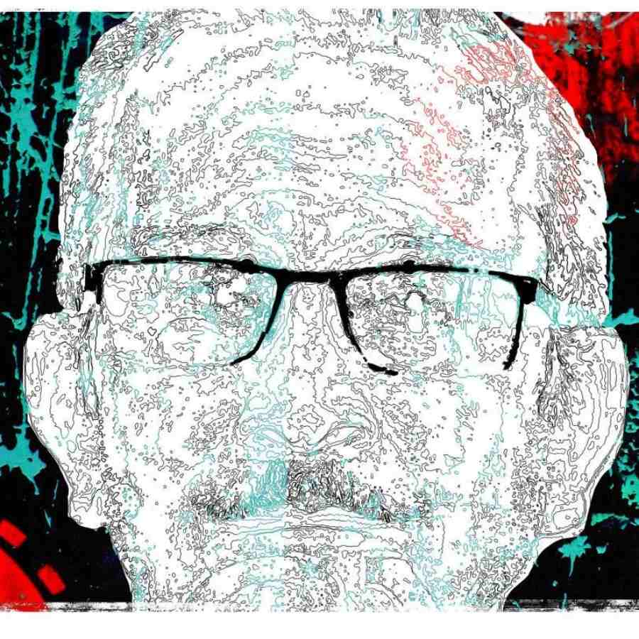

 
 <h1 align=center>এসো তুমি, বাবা</h1>
<h2 align=center>অম্লানকুসুম চক্রবর্তী</h2> 

আমি ল্যাপটপের পর্দা থেকে মুখ না তুলে চিৎকার করে বলতাম, “কাজ করছি দেখতে পাচ্ছ না? অত তাড়া থাকলে নিজে খেয়ে নাও। আমি পরে খাব।”

ঘড়ির কাঁটা রাত এগারোটা পেরিয়েছে তখন। বাবা টেবিলে বসে থাকত। মাইক্রোওভেনের তিরিশ সেকেন্ডের টাইমার পাঁচ বার পিক পিক করে চুপ হয়ে যেত। বাবা বলত, “আয় বাবা। ঠান্ডা হয়ে যাবে। গরম করতে হবে ফের। শরীরে আর দেয় না।”

আমি স্ক্রিনে মুখ গুঁজে থাকতাম। কাজ দেখাতাম। বাবাকে দেখেই আউটলুক এক্সপ্রেসের উইন্ডোটা ম্যাক্সিমাইজ় করে দিতাম। কি-বোর্ডে ইমেল টাইপের টকাটক, আমার দাপট। পিছনে খোলা থাকত ফেসবুক মেসেঞ্জার। আর মেসেঞ্জারে হিয়া। বাবা অত বুঝত না। তিয়াত্তর বছরের লোকটাকে দেখেই নিজের চিবুক আঁচড়াতাম। সেই ছোটবেলারমতো। বাবা জানত এটা আমার মুদ্রাদোষ। খুব জটিল কিছু ভাবলে আমি এমন করতাম। জ্বালা করত। তাও আঁচড়াতাম। আধোঘুমে টের পেতাম, ঠান্ডা কোনও ক্রিম ওই জায়গাটায় লাগিয়ে দিচ্ছেবাবার আঙুল। স্পর্শ। গালে চুমু খেত আমার। দীর্ঘশ্বাস ফেলত। শুনতাম, “মায়ের মর্ম ছেলেটা বুঝলই না।”

ঝিঁঝিপোকার ডাক প্রকট হত আরও।

সেই ছোট্টবেলা। ক্লাস টু কিংবা থ্রি। মনে পড়ে না আর। আমি বাবাকে জড়িয়ে ধরে বলতাম, “তুমিই তো আমার মা।”

আজ মনে হয়, কেন ও কথা বলতাম জানি না। বাবা আমার চুলে বিলি কেটে দিত। বিড়বিড় করে কী বলত, জানি না। আমার হাতদুটো শক্ত করে চেপে ধরত। ছাদের দিকে চেয়ে থাকত। কেন জানি না।

আমার কাছে মা মানে দুটো সাদা-কালো আর গোটাতিনেক রঙিন ছবি। ব্ল্যাক অ্যান্ড হোয়াইট ছবিগুলো ওদের বিয়ের। মুখ সামান্য নিচু করা। লাজুক। আর যে তিনটে রঙিন ছবির কথা বলছিলাম, সেগুলো পুরীর। আমি হইনি তখনও।

আমার সঙ্গে মায়ের কোনও ছবি নেই। থাকার সম্ভাবনাও ছিল না, কারণ যে দিন আমি পৃথিবীতে এলাম, সে দিনই আমার মা চলে যায়। আমাকে জন্ম দেওয়ার সময় সম্ভাব্য কী কী জটিলতা হয়ে থাকতে পারে, তা নিয়ে আত্মীয়স্বজনদের থেকে তিন-চার রকমের ভার্সন শুনেছি। সত্যি বলতে কী, যে মানুষটিকে আমি দেখিনি কখনও, তিনি কী ভাবে চলে গিয়েছিলেন, তা পুঙ্খানুপুঙ্খ ভাবে জানার জন্য আমার সাধ জাগেনি কোনও দিন। মাসি-পিসিরা আদর করে গালে চুমু খেয়ে বলত, “বেচারা মা-হারা ছেলেটা! ওর মুখের দিকে তাকালে বুক ফেটে যায়।”

একটু বড় হওয়ার পরে আমি নাকি ঝটিতি জবাব দিতাম, “আমার বাবাই আমার সব। মায়ের দরকার নেই।”

উত্তরটা একটু ট্যারা গোছের ছিল হয়তো। আত্মীয়রা একে অন্যের মুখের দিকে চাইত। কিন্তু বিশ্বাস করুন, আমার ওই উত্তরের মধ্যে একটুও অভিমানের গুঁড়ো মেশানো ছিল না। যে মানুষটাকে দেখিনি কখনও, তার সম্ভাব্য স্নেহের পরশের আমি কতটুকু হারালাম, তা নিয়ে বৃথা চিন্তা করে হবেটা কী? রবিঠাকুরের কবিতায় পড়েছি, শিশুরা মাতৃক্রোড়ে সুন্দর। আমি গ্যারান্টি দিয়ে বলছি, পিতৃক্রোড়ে আমি একফোঁটাও কষ্টে ছিলাম না। মাই ড্যাড ওয়াজ় দ্য বেস্ট।

আমার বাবার রান্নার শখ ছিল খুব। একেবারে অথেন্টিক বাঙালি রেস্তরাঁয় গিয়ে যে পদগুলো আপনারা সাড়ে চারশো, পাঁচশো, ছ’শো টাকা দিয়ে কিনে খান, রেস্তরাঁ কিংবা ফুড চেনের গায়ে পাঁচের মধ্যে ফোর পয়েন্ট নাইন রেটিং দেন, এমন পদ রান্না করা আমার বাবার কাছে ছিল জলভাত। তিলের বড়া, কলাপাতায় মোড়া ভেটকি পাতুরি, নারকেল দিয়ে মোচার ঘণ্ট, থোড়ের বাহারি উপকরণ, জলপাইয়ের চাটনি— এমন সব আইটেম বাবার বাঁ হাতের খেল ছিল। কোথা থেকে এমন ভাল রান্না করা শিখেছিল, কে জানে। বিদ্যুৎ দফতরে কেরানির চাকরি করা বাবার কাছে রান্না ছিল সাধপূরণের জংশন স্টেশন। চেটেপুটে খেতাম। সুগন্ধ পেয়ে রান্নাঘরের কোণ দিয়ে উঁকি মেরে দেখতাম, একমনে রান্না করে চলেছে আমার বাবা।

আমি ক্লাস সিক্স-সেভেনে ওঠার পর থেকেই বলত, “শিখে নে, যতটা পারিস শিখে নে। হৃদয় দিয়ে শেখ। আমি তোর ঠাম্মার থেকে কিছুটা শিখতে পেরেছিলাম বলেই কাজ চালিয়ে নিতে পারছি। তাও সে ভাবে শিখতে পারলাম কই!”

ঠাম্মার থেকে না শিখতে পারা, হারিয়ে যাওয়া কিছু পদের কথা বলত বাবা। বলেই যেত। মনে হত, না শেখার তালিকা অন্তহীন। আমার কোনও পদের নামই মনে নেই, কারণ খেতে আমার যা ইন্টারেস্ট ছিল, তার দশ শতাংশও রান্না করার দিকে ছিল না।

*****

ইঞ্জিনিয়ারিং ফার্স্ট ইয়ারে হিয়ার সঙ্গে প্রেম একটু গাঢ় হওয়ার পরে, প্রিন্সেপ ঘাট থেকে ভাড়া করা নৌকায় হিয়ার কোলে মাথা রেখে বাবার এই রান্নার অদ্ভুত শখের কথা জানিয়েছিলাম ওকে। শেয়ার করেছিলাম রান্না নিয়ে আমার কোনও রকম উৎসাহ না থাকার কথাও।

বাবার রান্না করা পদগুলোর কথা শোনার পরে হিয়া জিভ দিয়ে ঝোল টেনেছিল, “ইয়াম, ইয়াম, ইয়াম্মি!” বলে আমায় পর পর তিনটে চুমু খেয়েছিল মাঝিকে অন্য দিকে তাকাতে বলে। তার পরই খিলখিল করে হেসে উঠেছিল। ওর হাসি ঢেউ হয়ে ছড়িয়ে পড়েছিল নদীর জলে। ওই ঢেউয়ে স্বর্গ ছিল।

“আজকের দিনে এটা একটা মনখারাপের ইস্যু হল? বিষয় কি কম পড়িয়াছে?”

“আমি শিখতে পারিনি হিয়া।”

“বেশ করেছ শেখোনি। আমিও তো জানি না কিছু। তাই বলে কি খাব না আমি? খাব না আমরা?”

“না শিখলে খাবটা কী করে?”

“ইউ আর মাই হাঁদারাম দ্য গ্রেট! সুপার মার্কেট কিংবা ডিপার্টমেন্টাল স্টোরগুলোয় যাও না তুমি? শেলফে চোখ রাখো না?”

“তোমার কথার মানে বুঝতে পারছি না হিয়া।”

“দাঁড়াও অ্যাপ খুলি। বোকারাম কোথাকার! এই তো ছোট ছোট করে মোচা কাটা। একদম ফ্রেশ। ফার্ম টু ফর্ক। এই দেখো, প্লাস্টিকে মুড়ে দেওয়া একদম তাজা বানানা লিভস। কলাপাতা, যেটাতে মুড়ে তোমার বাবা রান্না করেন। এই যে, মোচা মিনি কাটস। জলপাইয়ের চাটনি বলছিলে না? ওটাও তো আছে, ড্রায়েড। গরম জল দিয়ে পাঁচ মিনিট রেখে দিলেই চাটনি একেবারে রেডি। আজকের দিনে কে আবার এত কষ্ট করে? বেশ করেছ শেখোনি।”

আমার চাহনির মধ্যে হয়তো বিস্ময় মিশে ছিল। হিয়া বলেছিল, “কোনও কিছুর জন্যই কিছু থেমে থাকে না আজকের দুনিয়ায়।”

আমি বললাম, “যে পদগুলো হারিয়ে গেল আমার বাবা শিখতে পারল না বলে?”

হিয়া বলেছিল, “ডারউইন পড়োনি? এটা সারভাইভাল অব দ্য ফিটেস্ট-এর যুগ। লুপ্ত হয়ে যাওয়াই ওই আইটেমগুলোর কপালে লেখা ছিল। টিকতে পারেনি। এটা তোমার আমার দোষ? কাম অন, ম্যান।”

আমাকে আবার আদর করে দিয়েছিল হিয়া। মাঝিকে আর অন্য দিকে তাকানোর কথা বলতে হয়নি এ বারে।

হিয়ার সঙ্গে বিয়ে ঠিক করার কথা বাবাকে জানালাম যে দিন, বাবা বলেছিল, “এ বারে আমার কি একটু কাজ কমবে, বাবু? রান্নাটা আমিই করব, যত দিন পারি। বৌমা অফিস থেকে ফিরে, ফ্রেশ-টেশ হয়ে নিয়ে আমায় কি সামান্য একটুও হেল্প করবে? তুই তো শিখলি না। ওকেই যত্ন করে শিখিয়ে দেব কয়েকটা অজানা পদ। না হলে যে এই রান্নাগুলো একেবারে ধুয়েমুছে যাবে।”

এতগুলো কথা একটানা বলার পরে চোখ নামিয়ে নিয়েছিল বাবা। আমার মুখে কি খুব বিরক্তি মেশানো ছিল?

*****

আমাদের বিয়ের ঠিক মাসদুয়েক আগে বাবা চাকরি থেকে অবসর নেয়। হিয়া এ বাড়িতে আসার পরে বাবার কাজ বিন্দুমাত্র কমেনি, উল্টে বেড়েছিল অনেক। আরও একটা স্টমাক যোগ হওয়াতে রান্নাবান্নার পরিমাণও বাড়ে।

আমরা সন্ধে সাড়ে আটটা নাগাদ অফিস থেকে ফেরার পরে টানা দেড়-দু’ ঘণ্টা ওটিটি সিরিজ় দেখতাম। ভয়ঙ্কর ভাল সিরিজ়গুলো দেখে শেষ করার জন্য এক মানবজীবন যে যথেষ্ট নয়, এ নিয়ে আমার আর হিয়ার কোনও দ্বিমত ছিল না।

বিয়ের ঠিক দেড় বছরের মাথায় হিয়া এ বাড়ি ছেড়ে পাকাপাকি ভাবে চলে যায়। প্রধান কারণ হিসেবে যা বলেছিল, তা হল, “তোমাদের বাড়ির মেনু ভয়ঙ্কর রকমের ডিসগাস্টিং এবং ডিপ্রেসিং।”

“পরে আর এ সব পাবে না হিয়া। এই রান্নাগুলোর মধ্যে ঐতিহ্য মিশে আছে।”

“গেট লস্ট।”

“নৌকোয় যখন প্রথম বারের জন্য এই আইটেমগুলোর কথা বলেছিলাম, তখন ন্যাকামার্কা ইয়াম্মি-ইয়াম্মি করেছিলে কেন?”

“বহু ফালতু পোস্টেও লক্ষ লাইক পড়ে। তো?”

“এক জন বয়স্ক মানুষ দিনের পর দিন আমাদের জন্য রান্না করে চলেছেন, সেই কাজটুকুকে সম্মান করতে পারো না অন্তত?”

“লোকটার ওসিডি আছে। মানে, অবসেসিভ কম্পালসিভ ডিসঅর্ডার।”

“শাট আপ! নিজে যে খাবার খেতে পছন্দ করো, সেটা নিজে রান্না করে নাও না কেন?”

“আই হেট কুকিং। রান্নাঘরে ঢুকব বলে এত পড়াশোনা করিনি।”

“অ্যাপে আনাও।”

“দিনে হাজার টাকা করে তুমি ফান্ড করতে পারবে তো?”

“খেপেছ নাকি?”

গোটা তিনেক সুটকেস ডিকিতে পুরে, অ্যাপ-ক্যাবের দরজাটা আমার মুখের সামনে দড়াম করে বন্ধ করার আগে হিয়া বলেছিল, “আমায় অ্যাফোর্ড করার দম নেই তোমার। সে কথা আমার আগে বোঝা উচিত ছিল! শালা, ডিপ্রেসিং ফ্যামিলি!”

হিয়া চলে যাওয়ার পরে আমার তাজ্জব বনে যাওয়া বাবা কাজ কমানোর বদলে উল্টে বাড়িয়ে দেয় আরও। রান্নার পরিধি আরও বাড়িয়ে দেয়। হিয়ার ভাষায়, ‘প্রাচীন রান্না’। অফিস থেকে ফেরার পরে আমায় আঁকড়ে ধরে টেবিলের সামনে নিয়ে যেত। বলত, “কী কী করেছি দেখ।”

আমার তেতো মুখে হাসির আলপনা খুঁজতে চাইত, হয়তো। কী মিহি করে আনাজ কাটত আমার বাবা। রান্নাঘরে মাথা ঘুরে পড়ে যাওয়ার পরে বলেছিলাম, “অনেক তো হল! এ বার রান্নার লোক রাখতে দাও আমায়।”

আমি ল্যাপটপের পর্দা থেকে মুখ না তুলে চিৎকার করে বলতাম, “কাজ করছি দেখতে পাচ্ছ না? অত তাড়া থাকলে নিজে খেয়ে নাও। আমি পরে খাব।”

ঘড়ির কাঁটা রাত এগারোটা পেরিয়েছে তখন। বাবা টেবিলে বসে থাকত। মাইক্রোওভেনের তিরিশ সেকেন্ডের টাইমার পাঁচ বার পিক পিক করে চুপ হয়ে যেত। বাবা বলত, “আয় বাবা। ঠান্ডা হয়ে যাবে। গরম করতে হবে ফের। শরীরে আর দেয় না।”

আমি স্ক্রিনে মুখ গুঁজে থাকতাম। কাজ দেখাতাম। বাবাকে দেখেই আউটলুক এক্সপ্রেসের উইন্ডোটা ম্যাক্সিমাইজ় করে দিতাম। কি-বোর্ডে ইমেল টাইপের টকাটক, আমার দাপট। পিছনে খোলা থাকত ফেসবুক মেসেঞ্জার। আর মেসেঞ্জারে হিয়া। বাবা অত বুঝত না। তিয়াত্তর বছরের লোকটাকে দেখেই নিজের চিবুক আঁচড়াতাম। সেই ছোটবেলারমতো। বাবা জানত এটা আমার মুদ্রাদোষ। খুব জটিল কিছু ভাবলে আমি এমন করতাম। জ্বালা করত। তাও আঁচড়াতাম। আধোঘুমে টের পেতাম, ঠান্ডা কোনও ক্রিম ওই জায়গাটায় লাগিয়ে দিচ্ছেবাবার আঙুল। স্পর্শ। গালে চুমু খেত আমার। দীর্ঘশ্বাস ফেলত। শুনতাম, “মায়ের মর্ম ছেলেটা বুঝলই না।”

ঝিঁঝিপোকার ডাক প্রকট হত আরও।

সেই ছোট্টবেলা। ক্লাস টু কিংবা থ্রি। মনে পড়ে না আর। আমি বাবাকে জড়িয়ে ধরে বলতাম, “তুমিই তো আমার মা।”

আজ মনে হয়, কেন ও কথা বলতাম জানি না। বাবা আমার চুলে বিলি কেটে দিত। বিড়বিড় করে কী বলত, জানি না। আমার হাতদুটো শক্ত করে চেপে ধরত। ছাদের দিকে চেয়ে থাকত। কেন জানি না।

আমার কাছে মা মানে দুটো সাদা-কালো আর গোটাতিনেক রঙিন ছবি। ব্ল্যাক অ্যান্ড হোয়াইট ছবিগুলো ওদের বিয়ের। মুখ সামান্য নিচু করা। লাজুক। আর যে তিনটে রঙিন ছবির কথা বলছিলাম, সেগুলো পুরীর। আমি হইনি তখনও।

আমার সঙ্গে মায়ের কোনও ছবি নেই। থাকার সম্ভাবনাও ছিল না, কারণ যে দিন আমি পৃথিবীতে এলাম, সে দিনই আমার মা চলে যায়। আমাকে জন্ম দেওয়ার সময় সম্ভাব্য কী কী জটিলতা হয়ে থাকতে পারে, তা নিয়ে আত্মীয়স্বজনদের থেকে তিন-চার রকমের ভার্সন শুনেছি। সত্যি বলতে কী, যে মানুষটিকে আমি দেখিনি কখনও, তিনি কী ভাবে চলে গিয়েছিলেন, তা পুঙ্খানুপুঙ্খ ভাবে জানার জন্য আমার সাধ জাগেনি কোনও দিন। মাসি-পিসিরা আদর করে গালে চুমু খেয়ে বলত, “বেচারা মা-হারা ছেলেটা! ওর মুখের দিকে তাকালে বুক ফেটে যায়।”

একটু বড় হওয়ার পরে আমি নাকি ঝটিতি জবাব দিতাম, “আমার বাবাই আমার সব। মায়ের দরকার নেই।”

উত্তরটা একটু ট্যারা গোছের ছিল হয়তো। আত্মীয়রা একে অন্যের মুখের দিকে চাইত। কিন্তু বিশ্বাস করুন, আমার ওই উত্তরের মধ্যে একটুও অভিমানের গুঁড়ো মেশানো ছিল না। যে মানুষটাকে দেখিনি কখনও, তার সম্ভাব্য স্নেহের পরশের আমি কতটুকু হারালাম, তা নিয়ে বৃথা চিন্তা করে হবেটা কী? রবিঠাকুরের কবিতায় পড়েছি, শিশুরা মাতৃক্রোড়ে সুন্দর। আমি গ্যারান্টি দিয়ে বলছি, পিতৃক্রোড়ে আমি একফোঁটাও কষ্টে ছিলাম না। মাই ড্যাড ওয়াজ় দ্য বেস্ট।

আমার বাবার রান্নার শখ ছিল খুব। একেবারে অথেন্টিক বাঙালি রেস্তরাঁয় গিয়ে যে পদগুলো আপনারা সাড়ে চারশো, পাঁচশো, ছ’শো টাকা দিয়ে কিনে খান, রেস্তরাঁ কিংবা ফুড চেনের গায়ে পাঁচের মধ্যে ফোর পয়েন্ট নাইন রেটিং দেন, এমন পদ রান্না করা আমার বাবার কাছে ছিল জলভাত। তিলের বড়া, কলাপাতায় মোড়া ভেটকি পাতুরি, নারকেল দিয়ে মোচার ঘণ্ট, থোড়ের বাহারি উপকরণ, জলপাইয়ের চাটনি— এমন সব আইটেম বাবার বাঁ হাতের খেল ছিল। কোথা থেকে এমন ভাল রান্না করা শিখেছিল, কে জানে। বিদ্যুৎ দফতরে কেরানির চাকরি করা বাবার কাছে রান্না ছিল সাধপূরণের জংশন স্টেশন। চেটেপুটে খেতাম। সুগন্ধ পেয়ে রান্নাঘরের কোণ দিয়ে উঁকি মেরে দেখতাম, একমনে রান্না করে চলেছে আমার বাবা।

আমি ক্লাস সিক্স-সেভেনে ওঠার পর থেকেই বলত, “শিখে নে, যতটা পারিস শিখে নে। হৃদয় দিয়ে শেখ। আমি তোর ঠাম্মার থেকে কিছুটা শিখতে পেরেছিলাম বলেই কাজ চালিয়ে নিতে পারছি। তাও সে ভাবে শিখতে পারলাম কই!”

ঠাম্মার থেকে না শিখতে পারা, হারিয়ে যাওয়া কিছু পদের কথা বলত বাবা। বলেই যেত। মনে হত, না শেখার তালিকা অন্তহীন। আমার কোনও পদের নামই মনে নেই, কারণ খেতে আমার যা ইন্টারেস্ট ছিল, তার দশ শতাংশও রান্না করার দিকে ছিল না।

*****

ইঞ্জিনিয়ারিং ফার্স্ট ইয়ারে হিয়ার সঙ্গে প্রেম একটু গাঢ় হওয়ার পরে, প্রিন্সেপ ঘাট থেকে ভাড়া করা নৌকায় হিয়ার কোলে মাথা রেখে বাবার এই রান্নার অদ্ভুত শখের কথা জানিয়েছিলাম ওকে। শেয়ার করেছিলাম রান্না নিয়ে আমার কোনও রকম উৎসাহ না থাকার কথাও।

বাবার রান্না করা পদগুলোর কথা শোনার পরে হিয়া জিভ দিয়ে ঝোল টেনেছিল, “ইয়াম, ইয়াম, ইয়াম্মি!” বলে আমায় পর পর তিনটে চুমু খেয়েছিল মাঝিকে অন্য দিকে তাকাতে বলে। তার পরই খিলখিল করে হেসে উঠেছিল। ওর হাসি ঢেউ হয়ে ছড়িয়ে পড়েছিল নদীর জলে। ওই ঢেউয়ে স্বর্গ ছিল।

“আজকের দিনে এটা একটা মনখারাপের ইস্যু হল? বিষয় কি কম পড়িয়াছে?”

“আমি শিখতে পারিনি হিয়া।”

“বেশ করেছ শেখোনি। আমিও তো জানি না কিছু। তাই বলে কি খাব না আমি? খাব না আমরা?”

“না শিখলে খাবটা কী করে?”

“ইউ আর মাই হাঁদারাম দ্য গ্রেট! সুপার মার্কেট কিংবা ডিপার্টমেন্টাল স্টোরগুলোয় যাও না তুমি? শেলফে চোখ রাখো না?”

“তোমার কথার মানে বুঝতে পারছি না হিয়া।”

“দাঁড়াও অ্যাপ খুলি। বোকারাম কোথাকার! এই তো ছোট ছোট করে মোচা কাটা। একদম ফ্রেশ। ফার্ম টু ফর্ক। এই দেখো, প্লাস্টিকে মুড়ে দেওয়া একদম তাজা বানানা লিভস। কলাপাতা, যেটাতে মুড়ে তোমার বাবা রান্না করেন। এই যে, মোচা মিনি কাটস। জলপাইয়ের চাটনি বলছিলে না? ওটাও তো আছে, ড্রায়েড। গরম জল দিয়ে পাঁচ মিনিট রেখে দিলেই চাটনি একেবারে রেডি। আজকের দিনে কে আবার এত কষ্ট করে? বেশ করেছ শেখোনি।”

আমার চাহনির মধ্যে হয়তো বিস্ময় মিশে ছিল। হিয়া বলেছিল, “কোনও কিছুর জন্যই কিছু থেমে থাকে না আজকের দুনিয়ায়।”

আমি বললাম, “যে পদগুলো হারিয়ে গেল আমার বাবা শিখতে পারল না বলে?”

হিয়া বলেছিল, “ডারউইন পড়োনি? এটা সারভাইভাল অব দ্য ফিটেস্ট-এর যুগ। লুপ্ত হয়ে যাওয়াই ওই আইটেমগুলোর কপালে লেখা ছিল। টিকতে পারেনি। এটা তোমার আমার দোষ? কাম অন, ম্যান।”

আমাকে আবার আদর করে দিয়েছিল হিয়া। মাঝিকে আর অন্য দিকে তাকানোর কথা বলতে হয়নি এ বারে।

হিয়ার সঙ্গে বিয়ে ঠিক করার কথা বাবাকে জানালাম যে দিন, বাবা বলেছিল, “এ বারে আমার কি একটু কাজ কমবে, বাবু? রান্নাটা আমিই করব, যত দিন পারি। বৌমা অফিস থেকে ফিরে, ফ্রেশ-টেশ হয়ে নিয়ে আমায় কি সামান্য একটুও হেল্প করবে? তুই তো শিখলি না। ওকেই যত্ন করে শিখিয়ে দেব কয়েকটা অজানা পদ। না হলে যে এই রান্নাগুলো একেবারে ধুয়েমুছে যাবে।”

এতগুলো কথা একটানা বলার পরে চোখ নামিয়ে নিয়েছিল বাবা। আমার মুখে কি খুব বিরক্তি মেশানো ছিল?

*****

আমাদের বিয়ের ঠিক মাসদুয়েক আগে বাবা চাকরি থেকে অবসর নেয়। হিয়া এ বাড়িতে আসার পরে বাবার কাজ বিন্দুমাত্র কমেনি, উল্টে বেড়েছিল অনেক। আরও একটা স্টমাক যোগ হওয়াতে রান্নাবান্নার পরিমাণও বাড়ে।

আমরা সন্ধে সাড়ে আটটা নাগাদ অফিস থেকে ফেরার পরে টানা দেড়-দু’ ঘণ্টা ওটিটি সিরিজ় দেখতাম। ভয়ঙ্কর ভাল সিরিজ়গুলো দেখে শেষ করার জন্য এক মানবজীবন যে যথেষ্ট নয়, এ নিয়ে আমার আর হিয়ার কোনও দ্বিমত ছিল না।

বিয়ের ঠিক দেড় বছরের মাথায় হিয়া এ বাড়ি ছেড়ে পাকাপাকি ভাবে চলে যায়। প্রধান কারণ হিসেবে যা বলেছিল, তা হল, “তোমাদের বাড়ির মেনু ভয়ঙ্কর রকমের ডিসগাস্টিং এবং ডিপ্রেসিং।”

“পরে আর এ সব পাবে না হিয়া। এই রান্নাগুলোর মধ্যে ঐতিহ্য মিশে আছে।”

“গেট লস্ট।”

“নৌকোয় যখন প্রথম বারের জন্য এই আইটেমগুলোর কথা বলেছিলাম, তখন ন্যাকামার্কা ইয়াম্মি-ইয়াম্মি করেছিলে কেন?”

“বহু ফালতু পোস্টেও লক্ষ লাইক পড়ে। তো?”

“এক জন বয়স্ক মানুষ দিনের পর দিন আমাদের জন্য রান্না করে চলেছেন, সেই কাজটুকুকে সম্মান করতে পারো না অন্তত?”

“লোকটার ওসিডি আছে। মানে, অবসেসিভ কম্পালসিভ ডিসঅর্ডার।”

“শাট আপ! নিজে যে খাবার খেতে পছন্দ করো, সেটা নিজে রান্না করে নাও না কেন?”

“আই হেট কুকিং। রান্নাঘরে ঢুকব বলে এত পড়াশোনা করিনি।”

“অ্যাপে আনাও।”

“দিনে হাজার টাকা করে তুমি ফান্ড করতে পারবে তো?”

“খেপেছ নাকি?”

গোটা তিনেক সুটকেস ডিকিতে পুরে, অ্যাপ-ক্যাবের দরজাটা আমার মুখের সামনে দড়াম করে বন্ধ করার আগে হিয়া বলেছিল, “আমায় অ্যাফোর্ড করার দম নেই তোমার। সে কথা আমার আগে বোঝা উচিত ছিল! শালা, ডিপ্রেসিং ফ্যামিলি!”

হিয়া চলে যাওয়ার পরে আমার তাজ্জব বনে যাওয়া বাবা কাজ কমানোর বদলে উল্টে বাড়িয়ে দেয় আরও। রান্নার পরিধি আরও বাড়িয়ে দেয়। হিয়ার ভাষায়, ‘প্রাচীন রান্না’। অফিস থেকে ফেরার পরে আমায় আঁকড়ে ধরে টেবিলের সামনে নিয়ে যেত। বলত, “কী কী করেছি দেখ।”

আমার তেতো মুখে হাসির আলপনা খুঁজতে চাইত, হয়তো। কী মিহি করে আনাজ কাটত আমার বাবা। রান্নাঘরে মাথা ঘুরে পড়ে যাওয়ার পরে বলেছিলাম, “অনেক তো হল! এ বার রান্নার লোক রাখতে দাও আমায়।”

বাবা আমার হাত চেপে ধরে রেখেছিল। মাথা নাড়াচ্ছিল প্রবল। রাখতে দেয়নি।

ম্যাসিভ হার্ট অ্যাটাকের যে মাত্র আট মাস বাকি, বাবা কি বুঝতে পেরেছিল আগেই? মাথার ঘিলু ফুটো করে দেওয়া দরজা বন্ধ করার প্রবল আওয়াজ সে দিন শুনতে পেয়েছিলাম, আবার। সন্তানকে একা করে, কী সহজে চলে যাওয়া যায়!

*****

ডিপার্টমেন্টাল স্টোরে গিয়ে প্রথম বারের জন্য আনাজপাতির শেলফের দিকে চোখ মেলেছিল এই অভাগা। জিরাফের মতো গলা উঁচু করে দেখতে শুরু করেছিল রেডি টু কুক, রেডি টু ইট খাবারের সম্ভার। তুমি কী বোকা মানুষ ছিলে বাবা! এই তো সব আছে— তোমার থেকেও মিহি করে কাটা থোড়, মোচা থেকে শুরু করে ইনস্ট্যান্ট শুক্তো কাট। শুক্তোর জন্য যা-যা লাগে সব কিছুর মেলবন্ধন। কেটে রাখা কাঁচা আনাজকে টেক্কা দিচ্ছে রেডি টু ইট মোচার ঘণ্ট, থোড় ছেঁচকি, ভেটকি উইথ বানানা লিফ, নারকোলের বড়া, ডাল পাতুরি— জাস্টহিট অ্যান্ড ইট। কেন এত খাটতে তুমি বাবা,দিনের পর দিন? ছুঁচ ফুটিয়ে গেল হিয়ার মুখের কৈকেয়ীর হাসি।

ট্রলি ভর্তি করে বিল করালাম বাবাকে। তবে একটা কোম্পানির নামও আমার পছন্দ নয়। ‘মাদার্স চয়েস’, ‘মায়ের ছোঁয়া’, ‘লাভ ইউ মম’, ‘মাতৃক্রোড়’, ‘মাম্মাস প্যায়ার’—এমন আরও কত ব্র্যান্ড। রাজ্যের ব্র্যান্ড, দেশজ কিংবা আন্তর্জাতিক। ব্র্যান্ডের নামে বাবা নেই কেন? একটাও খাব না আমি।

প্রতিটা প্রোডাক্টের গায়ে লেখা ইমেল-ঠিকানায় কড়া করে চিঠি লিখলাম আমি। চিঠি মানে ইমেল। নিজের বড় হওয়ার ইতিহাস লিখলাম। লিখে দিলাম, ‘আজীবন বাবার ভালবাসা ছাড়া কিচ্ছু পাইনি আমি এ জীবনে। চাইনিও।’ লিখলাম, ‘ব্র্যান্ডের নাম বদলে ফেলুন, জলদি। আমার মতো বহু মানুষ হারিয়ে যাওয়া বাবাকে খোঁজে।’

একটা কোম্পানি থেকে আমার কাছে ফোন আসে মেল পাঠানোর এক ঘণ্টার মধ্যেই। বলল, “মুম্বইয়ের টিকিট পাঠাচ্ছি। আমাদের হেড অফিস। কাল সকালেই উড়ে আসুন। আপনার সঙ্গে আমাদের কথা আছে। ফোনে হবে না।”

একটা বিরাট বড়, বিকট বড় কনফারেন্স রুমে চার জনের তুখোড় মার্কেটিং টিম আমাকে বোঝাল, বাবার থেকে মা কেন এত বড় ব্র্যান্ড। শেষে বলল, “টু সাম আপ, বাবা এক কোটির ব্যবসা দিলে মা হাজার কোটির দেবে। বোঝাতে পেরেছি? আপনাকে সামনে ডেকে এত কথা বলা হল টু এডুকেট ইউ। এগুলো আমাদের কর্পোরেট রেসপন্সিবিলিটির মধ্যে পড়ে।”

আমি বললাম, “আমি রাঁধতে জানি না। আমি একা। ব্র্যান্ডে বাবার নাম উল্লেখ করা না থাকলে গলা দিয়ে খাবার নামবে না।”

এটা শুনে চার জন সম্মিলিত ভাবে কাঁধ ঝাঁকিয়েছিল। আমার জন্য তাদের কিছু করার নেই, অথবা তাদের কিছু এসে যায় না।

রান্নার লোক রাখার প্রস্তাবে বাবার ওই মাথা নাড়ানোটা বারবার গিলোটিনের মতো চেপে ধরছে আমায়। ও দিকে অথেন্টিক বাঙালি খাবারের জন্য লালা ঝরে। বাবার মায়া। বাবার শেখানো অভ্যাস। এই খাবারগুলোর মধ্যেই চিরকাল বেঁচে থাকবে আমার বাবা।

‘ফাদার’, ‘বাবা’, ‘পাপা’ লিখে চিরকুট বানাচ্ছি অজস্র। প্রিন্ট দিতে পারতাম। মনে হল এই সুযোগে কয়েক বার বাবা শব্দটা নিজের হাতে লিখি অন্তত।

প্রোডাক্টের গায়ে লেগে থাকা যাবতীয় ‘মা’কে চাপা দিয়ে আমি ‘বাবা’কে বসাব। আমার বাবাকে।

বাবা, এসো তুমি।

কে যেন বলত, “যাই নয়, আসি বলতে হয়।”

(গল্পে উল্লিখিত সব ব্র্যান্ডের নাম কাল্পনিক)

(এই প্রতিবেদনটি আনন্দবাজার পত্রিকার মুদ্রিত সংস্করণ থেকে নেওয়া হয়েছে)

