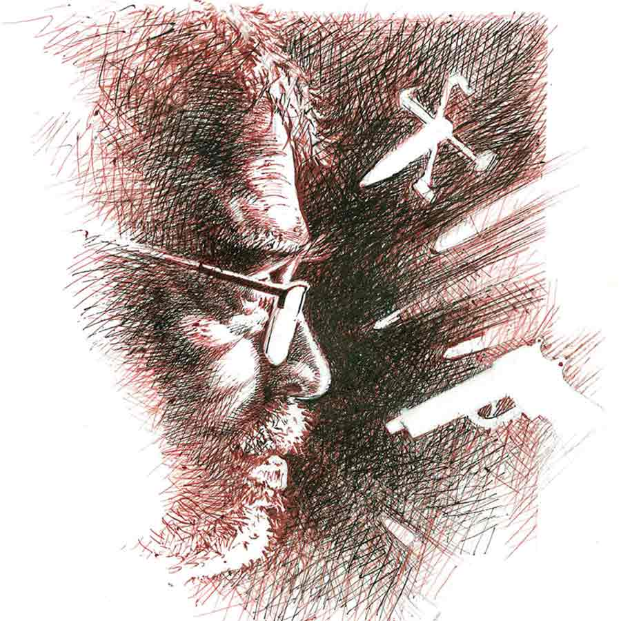

 
 <h1 align=center>কঠিন যুদ্ধ</h1>
<h2 align=center>শুভমানস ঘোষ</h2> 

ক’দিন হল যুদ্ধ বেধেছে।‌ শত্রু দেশ যত মার খাচ্ছে, মেজাজ তত চড়ছে মানুষের। স্টেশনে যে রেজিস্টার্ড মাতাল মহানন্দে হাততালি দিয়ে দেশের-দশের শ্রাদ্ধ করতে করতে হেসে গড়িয়ে পড়ে, সেও কেমন সিরিয়াস হয়ে গেছে। থেকে থেকে হুঙ্কার ছাড়ছে, “মার! মার!”

সীমান্তে যুদ্ধ করছে সেনারা, ট্রেনের প্যাসেঞ্জারদের ভাব, যেন তারাই করছে। নাম কাটা-পড়া সেপাই‌য়ের চালে পান থেকে চুন খসলেই একে অপরকে মিসাইল চার্জ করে বসছে।

হকার ভজন ট্রেনে ভাজা বাদাম বিক্রি করে। বাদামে তার বাপের উদ্ভাবিত, ঘরে তৈরি বিশেষ এক মশলা ব্যবহার করে। তাতে বাদামের সোয়াদ এমন খোলতাই হয়, পড়তে পায় না, হু হু করে সব প্যাকেট বিক্রি হয়ে যায়। তবে যুদ্ধের বাজারে বাদামের বিক্রি কমেছে।

রোজই একটা প্যাকেট সে বেচে না। রেখে দেয়। যে প্যাকেটটা ভজন বেচে না, তা কলেজের মাস্টারমশাই বহমান বসাকের জন্য বরাদ্দ। ট্রেনের নিত্যযাত্রী এই মাস্টারমশাইটিকে বড় ভাল লাগে ভজনের। পাঞ্জাবি ঠেলে উঠেছে বিশাল ছাতি। কিন্তু শান্ত, সৌম্য মূর্তি। কথায় ঝাঁঝ-তাপ দূর, ভাবভঙ্গিতে বোঝার জো নেই, এত বড় পণ্ডিত।

তার চেয়ে বলার মতো কথা এই যে, মানুষটি ভজনের মতো কাঠগোমুখ্যু মানুষকে দেখলেও খুশিতে উজ্জ্বল হয়ে ওঠেন। তার হাঁড়ির খবরটি পর্যন্ত রাখেন।‌ বলেন, “কই হে ভজন, আমায় যে দিলে না? বড় খাসা তোমার বাদাম গো! আজ তোমার মা কী বলল?”

হকার হলেও ভজন মাতৃভক্ত মানুষ। বেলা গড়ালে বাদামের ব্যাগ নিয়ে স্টেশনে যাওয়ার পথে কালীমন্দিরের সামনে এসে মায়ের সঙ্গে মনে মনে কিছু না-কিছু কথা বলে। বায়নাও জুড়ে দেয়।

আজ ভক্তিভরে মাকে প্রণাম ঠুকে বলেছিল, “মা, বাজারের হাল বেজায় খারাপ। রোজ রোজ বৌয়ের খোঁটা যে প্রাণে সয় না। আমি কিছু জানি-টানি নে। যুদ্দু কবে থামবে বলো না মা!”

তবে যতই মধুর বচনের বায়নাক্কা হোক, বললেই যে মা কথা শোনে, তা নয়। বেশির ভাগ দিনই চুপ করে থাকে। তবে পাথরের হলেও তো একেবারে পাথর নয়। এক-আধ দিন মুখ ফুটে যায় তার।

আজও ফুটল। মা উত্তর দিল, “বাহ্! আমি কিছু জানি নে— এটাই আসল কথা, বুঝলি ভজন। মন দিয়ে নিজের কাজ কর রে হতভাগা! সব জানা যায় না। জানতে যাস না।”

ভজন তো খুশিতে ডগমগ। “জয় মা! জয় মা!” বলে লাগাল ছুট। বাদাম ফেরি পরে হবে, মাস্টারমশাই যে কামরায় চড়েন, তাতে উঠে সোজা তাঁর কাছে‌। এক প্যাকেট বাদাম ধরিয়ে দিয়ে বলল, “স্যর! স্যর! আজ মা কথা কয়েছে।”

“তাই?” মাস্টারমশাই শুধোলেন, “তা মা কী বলল তোমাকে?”

ভজন কথাগুলো বলল।

শুনে মাস্টারমশাই কিছু ক্ষণ ভেবে বললেন, “সব কিছু জানা যায় না! ওয়ান্ডারফুল! মায়ের কথা বলে কথা, ভাবার আছে ভজন।”

ভজন সরল-সোজা লোক। বলল, “এতে আর ভাবার-বোজার কী আচে স্যর? ঠিকই তো কয়েচে মা! অ্যাতটুকু মাতা দে হ্যাই মস্ত দুনিয়ার সব কিচু বোজা যায়?”

“না রে বাপু, মানুষের মাথাও কম নয়। তাতে বুদ্ধি গজগজ করছে! তা দিয়ে দুনিয়ার সব রহস্য সে মোটামুটি বুঝেই গেছে। কিন্তু কথা হল, পৃথিবী তো বালির কণার চেয়েও ঢের ঢের ছোট, তার বাইরে প্রকাণ্ড মহাবিশ্ব পড়ে আছে! মাথা খাটিয়ে, হাজার হাজার যন্ত্রপাতি দিয়ে সে সব জানলেও জানতে পারে। কিন্তু বুদ্ধি দিয়ে তোমার মা-কে কোনও দিন জানতে পারবে না। তোমার মতো তার সঙ্গে কথাও বলতে পারবে না।”

ভজন ঘাবড়ে যায়। লজ্জাও পায়, “কী যে বলেন স্যর! এ তো সবাই পারে। মায়ের কাচে গে বললে মা খুশি থাকলে বলে, নয় তো মুকটি টিপে থাকে। সবই তো মায়ের মেজাজ-মর্জি! আমি কী জানি তার!”

মাস্টারমশাই বলেন, “জানো না বলেই তো বড় বড় বুদ্ধিমান ব্যক্তিরা যা জানেন না, তুমি জেনে গেলে।”

যুদ্ধের বাজারে এই সব ভাল লাগে শুনতে? তাও ট্রেনের লোকের কান খাড়া। তাঁদের মধ্যে ছিলেন কলেজের এক তরুণ অধ্যাপকও। মাস্টারমশাইয়ের মতো ধুতি-পাঞ্জাবি নয়, ইনি প্যান্ট-শার্ট ছাড়া পরেন না।

“শোনো ভজন, মন দিয়ে শোনো!” একটু থেমে মাস্টারমশাই আবার বললেন, “পৃথিবী ও তার বাইরের যা কিছু আমরা জেনে গেছি, তাকে ইংরেজিতে বলে, ‘নোন ফ্যাক্ট’। কিছু জিনিস এখনও জানি না। ক্রমে ক্রমে জানব। তাকে বলে ‘নোয়েব্‌ল ফ্যাক্ট’। কিন্তু যা কখনও জানা যাবে না, হাজার যন্ত্রপাতি দিয়ে কখনও প্রমাণ করা যাবে না, তাকে ইংরেজিতে বলে ‘আননোয়েব্‌ল’। যেমন তোমার মা।”

মাস্টারমশায়ের কথায় প্যান্ট-শার্ট পরা যুবক সাধারণত সমীহবশত চুপ করে থাকেন। যুদ্ধের ঝাঁঝে আজ “হুঁহ্!” বলে নাক ঝেড়ে বিস্ফোরক-ভরা ড্রোন উড়িয়ে দিলেন, “এতগুলো লোককে দেশে এসে মেরে দিয়ে গেল, তোর দৌড় বোঝা গেছে‌ মা! এ বার হয় দেখা দে, নয় টাকা দে!”

ট্রেনসুদ্ধ লোকের মুখে বিষাক্ত-বাঁকা হাসি। তার পর মারামারি-কাটাকাটির তর্কবিতর্কে মত্ত হয়ে গেল সব। কেউ বলছে, পাল্টা মারছে বেশ করছে। কেউ বলল, সব দোষ গোয়েন্দা এজেন্সির। তাদের দক্ষতা নেই বলে দেশে ঢুকে এত বড় গণহত্যা করেছে অন্য দেশ। এখন উচিত যুদ্ধ বন্ধ করে আলোচনায় বসা।

মুহূর্তমধ্যে ভজন নিজের সম্পর্কে ধারণার পাকা প্রমাণ হাতে-হাতে পেয়ে গুটিয়েই গেল। সকলে কত জানে। কত খবর রাখে। কিন্তু সে কিছুই জানে‌ না!

কিন্তু ধাক্কা খেল আর এক যাত্রীর কথায়। মাথাজোড়া টাক। এক কানে দুল। মা-কেও ছাড়লেন না। অবিশ্বাসের কামান দেগে জানালেন, “মা আবার কী? মা বলে কিছু নেই। গুলি-বন্দুক-ড্রোন-মিসাইল আর টাকাতেই দুনিয়া চলে।”

মা নেই! বুকে যেন ছুরি চলল। কিন্তু ভজন তো কিছুই জানে না। বলতে গেলে হালে পানি পাবে না। আকুল ভাবে তাকাল মাস্টারমশাইয়ের দিকে।

কিন্তু মাস্টারমশাই যুদ্ধবাজ নন। কানে দুল যেমন মায়ে বিশ্বাস করেন না, তিনিও চাপান-উতোরে বিশ্বাস করেন না। নীরবে কয়েকটা বাদাম মুখে ফেলে চোখ বুজে চিবোচ্ছেন আর “খাসা! খাসা!” করছেন।

বাদাম নয় খাসা, কিন্তু ভজন যে মিইয়ে-পড়া পাঁপড় হয়ে গেছে!

বুঝল, মাস্টারমশাই ওকে যা বলার বলেছেন, আর কাউকে কিছুই বলবেন না। আর দাঁড়াল না সে। স্টেশন আসতেই নেমে পড়ল।

এ কী শুনল! মা নেই! মায়ের উপর ভর করে সুখে-দুঃখে জীবন বয়ে গেল, মা বলেই কেউ নেই? স্রেফ ঠকে গেছে? যুদ্ধে যেমন‌ হয়, ভিতরটা তার তছনছ হয়ে গেল।

ভজন এতটাই বিচলিত হল, কাজে আর মন লাগল না। পরের কামরায় না উঠে স্টেশনে নেমে প্ল্যাটফর্মের সিটেই বসে পড়ল। কেন যে জীবনে কিছু জানল না! শিখল না! পড়ল না কিছুই! নিজেকেই করুণা করতে ইচ্ছা করছিল তার। করুণার কথাও ভুলে গেল।

হুঁ, করুণাই তার বৌ। ঘরে হাত পেতে বসেই আছে। সে ফিরলে দিনের কামাই আঁচলে বেঁধে তবে চায়ের জল চড়ায়।

যুদ্ধের বাজারে ভজনের রোজগারে টান পড়ায় উপস্থিত সেও মেয়ে-সেনানী হয়ে গেছে।

“এ দিয়ে চালাব কী করে?” বলে রোজ সংসার মাথায় করছে। যুদ্ধ বেধেছে শুনে “মুখপোড়া যুদ্ধ মরে না কেন?” বলে যুদ্ধকেও ছাড়ছে না।

ক’দিন হল যুদ্ধ বেধেছে।‌ শত্রু দেশ যত মার খাচ্ছে, মেজাজ তত চড়ছে মানুষের। স্টেশনে যে রেজিস্টার্ড মাতাল মহানন্দে হাততালি দিয়ে দেশের-দশের শ্রাদ্ধ করতে করতে হেসে গড়িয়ে পড়ে, সেও কেমন সিরিয়াস হয়ে গেছে। থেকে থেকে হুঙ্কার ছাড়ছে, “মার! মার!”

সীমান্তে যুদ্ধ করছে সেনারা, ট্রেনের প্যাসেঞ্জারদের ভাব, যেন তারাই করছে। নাম কাটা-পড়া সেপাই‌য়ের চালে পান থেকে চুন খসলেই একে অপরকে মিসাইল চার্জ করে বসছে।

হকার ভজন ট্রেনে ভাজা বাদাম বিক্রি করে। বাদামে তার বাপের উদ্ভাবিত, ঘরে তৈরি বিশেষ এক মশলা ব্যবহার করে। তাতে বাদামের সোয়াদ এমন খোলতাই হয়, পড়তে পায় না, হু হু করে সব প্যাকেট বিক্রি হয়ে যায়। তবে যুদ্ধের বাজারে বাদামের বিক্রি কমেছে।

রোজই একটা প্যাকেট সে বেচে না। রেখে দেয়। যে প্যাকেটটা ভজন বেচে না, তা কলেজের মাস্টারমশাই বহমান বসাকের জন্য বরাদ্দ। ট্রেনের নিত্যযাত্রী এই মাস্টারমশাইটিকে বড় ভাল লাগে ভজনের। পাঞ্জাবি ঠেলে উঠেছে বিশাল ছাতি। কিন্তু শান্ত, সৌম্য মূর্তি। কথায় ঝাঁঝ-তাপ দূর, ভাবভঙ্গিতে বোঝার জো নেই, এত বড় পণ্ডিত।

তার চেয়ে বলার মতো কথা এই যে, মানুষটি ভজনের মতো কাঠগোমুখ্যু মানুষকে দেখলেও খুশিতে উজ্জ্বল হয়ে ওঠেন। তার হাঁড়ির খবরটি পর্যন্ত রাখেন।‌ বলেন, “কই হে ভজন, আমায় যে দিলে না? বড় খাসা তোমার বাদাম গো! আজ তোমার মা কী বলল?”

হকার হলেও ভজন মাতৃভক্ত মানুষ। বেলা গড়ালে বাদামের ব্যাগ নিয়ে স্টেশনে যাওয়ার পথে কালীমন্দিরের সামনে এসে মায়ের সঙ্গে মনে মনে কিছু না-কিছু কথা বলে। বায়নাও জুড়ে দেয়।

আজ ভক্তিভরে মাকে প্রণাম ঠুকে বলেছিল, “মা, বাজারের হাল বেজায় খারাপ। রোজ রোজ বৌয়ের খোঁটা যে প্রাণে সয় না। আমি কিছু জানি-টানি নে। যুদ্দু কবে থামবে বলো না মা!”

তবে যতই মধুর বচনের বায়নাক্কা হোক, বললেই যে মা কথা শোনে, তা নয়। বেশির ভাগ দিনই চুপ করে থাকে। তবে পাথরের হলেও তো একেবারে পাথর নয়। এক-আধ দিন মুখ ফুটে যায় তার।

আজও ফুটল। মা উত্তর দিল, “বাহ্! আমি কিছু জানি নে— এটাই আসল কথা, বুঝলি ভজন। মন দিয়ে নিজের কাজ কর রে হতভাগা! সব জানা যায় না। জানতে যাস না।”

ভজন তো খুশিতে ডগমগ। “জয় মা! জয় মা!” বলে লাগাল ছুট। বাদাম ফেরি পরে হবে, মাস্টারমশাই যে কামরায় চড়েন, তাতে উঠে সোজা তাঁর কাছে‌। এক প্যাকেট বাদাম ধরিয়ে দিয়ে বলল, “স্যর! স্যর! আজ মা কথা কয়েছে।”

“তাই?” মাস্টারমশাই শুধোলেন, “তা মা কী বলল তোমাকে?”

ভজন কথাগুলো বলল।

শুনে মাস্টারমশাই কিছু ক্ষণ ভেবে বললেন, “সব কিছু জানা যায় না! ওয়ান্ডারফুল! মায়ের কথা বলে কথা, ভাবার আছে ভজন।”

ভজন সরল-সোজা লোক। বলল, “এতে আর ভাবার-বোজার কী আচে স্যর? ঠিকই তো কয়েচে মা! অ্যাতটুকু মাতা দে হ্যাই মস্ত দুনিয়ার সব কিচু বোজা যায়?”

“না রে বাপু, মানুষের মাথাও কম নয়। তাতে বুদ্ধি গজগজ করছে! তা দিয়ে দুনিয়ার সব রহস্য সে মোটামুটি বুঝেই গেছে। কিন্তু কথা হল, পৃথিবী তো বালির কণার চেয়েও ঢের ঢের ছোট, তার বাইরে প্রকাণ্ড মহাবিশ্ব পড়ে আছে! মাথা খাটিয়ে, হাজার হাজার যন্ত্রপাতি দিয়ে সে সব জানলেও জানতে পারে। কিন্তু বুদ্ধি দিয়ে তোমার মা-কে কোনও দিন জানতে পারবে না। তোমার মতো তার সঙ্গে কথাও বলতে পারবে না।”

ভজন ঘাবড়ে যায়। লজ্জাও পায়, “কী যে বলেন স্যর! এ তো সবাই পারে। মায়ের কাচে গে বললে মা খুশি থাকলে বলে, নয় তো মুকটি টিপে থাকে। সবই তো মায়ের মেজাজ-মর্জি! আমি কী জানি তার!”

মাস্টারমশাই বলেন, “জানো না বলেই তো বড় বড় বুদ্ধিমান ব্যক্তিরা যা জানেন না, তুমি জেনে গেলে।”

যুদ্ধের বাজারে এই সব ভাল লাগে শুনতে? তাও ট্রেনের লোকের কান খাড়া। তাঁদের মধ্যে ছিলেন কলেজের এক তরুণ অধ্যাপকও। মাস্টারমশাইয়ের মতো ধুতি-পাঞ্জাবি নয়, ইনি প্যান্ট-শার্ট ছাড়া পরেন না।

“শোনো ভজন, মন দিয়ে শোনো!” একটু থেমে মাস্টারমশাই আবার বললেন, “পৃথিবী ও তার বাইরের যা কিছু আমরা জেনে গেছি, তাকে ইংরেজিতে বলে, ‘নোন ফ্যাক্ট’। কিছু জিনিস এখনও জানি না। ক্রমে ক্রমে জানব। তাকে বলে ‘নোয়েব্‌ল ফ্যাক্ট’। কিন্তু যা কখনও জানা যাবে না, হাজার যন্ত্রপাতি দিয়ে কখনও প্রমাণ করা যাবে না, তাকে ইংরেজিতে বলে ‘আননোয়েব্‌ল’। যেমন তোমার মা।”

মাস্টারমশায়ের কথায় প্যান্ট-শার্ট পরা যুবক সাধারণত সমীহবশত চুপ করে থাকেন। যুদ্ধের ঝাঁঝে আজ “হুঁহ্!” বলে নাক ঝেড়ে বিস্ফোরক-ভরা ড্রোন উড়িয়ে দিলেন, “এতগুলো লোককে দেশে এসে মেরে দিয়ে গেল, তোর দৌড় বোঝা গেছে‌ মা! এ বার হয় দেখা দে, নয় টাকা দে!”

ট্রেনসুদ্ধ লোকের মুখে বিষাক্ত-বাঁকা হাসি। তার পর মারামারি-কাটাকাটির তর্কবিতর্কে মত্ত হয়ে গেল সব। কেউ বলছে, পাল্টা মারছে বেশ করছে। কেউ বলল, সব দোষ গোয়েন্দা এজেন্সির। তাদের দক্ষতা নেই বলে দেশে ঢুকে এত বড় গণহত্যা করেছে অন্য দেশ। এখন উচিত যুদ্ধ বন্ধ করে আলোচনায় বসা।

মুহূর্তমধ্যে ভজন নিজের সম্পর্কে ধারণার পাকা প্রমাণ হাতে-হাতে পেয়ে গুটিয়েই গেল। সকলে কত জানে। কত খবর রাখে। কিন্তু সে কিছুই জানে‌ না!

কিন্তু ধাক্কা খেল আর এক যাত্রীর কথায়। মাথাজোড়া টাক। এক কানে দুল। মা-কেও ছাড়লেন না। অবিশ্বাসের কামান দেগে জানালেন, “মা আবার কী? মা বলে কিছু নেই। গুলি-বন্দুক-ড্রোন-মিসাইল আর টাকাতেই দুনিয়া চলে।”

মা নেই! বুকে যেন ছুরি চলল। কিন্তু ভজন তো কিছুই জানে না। বলতে গেলে হালে পানি পাবে না। আকুল ভাবে তাকাল মাস্টারমশাইয়ের দিকে।

কিন্তু মাস্টারমশাই যুদ্ধবাজ নন। কানে দুল যেমন মায়ে বিশ্বাস করেন না, তিনিও চাপান-উতোরে বিশ্বাস করেন না। নীরবে কয়েকটা বাদাম মুখে ফেলে চোখ বুজে চিবোচ্ছেন আর “খাসা! খাসা!” করছেন।

বাদাম নয় খাসা, কিন্তু ভজন যে মিইয়ে-পড়া পাঁপড় হয়ে গেছে!

বুঝল, মাস্টারমশাই ওকে যা বলার বলেছেন, আর কাউকে কিছুই বলবেন না। আর দাঁড়াল না সে। স্টেশন আসতেই নেমে পড়ল।

এ কী শুনল! মা নেই! মায়ের উপর ভর করে সুখে-দুঃখে জীবন বয়ে গেল, মা বলেই কেউ নেই? স্রেফ ঠকে গেছে? যুদ্ধে যেমন‌ হয়, ভিতরটা তার তছনছ হয়ে গেল।

ভজন এতটাই বিচলিত হল, কাজে আর মন লাগল না। পরের কামরায় না উঠে স্টেশনে নেমে প্ল্যাটফর্মের সিটেই বসে পড়ল। কেন যে জীবনে কিছু জানল না! শিখল না! পড়ল না কিছুই! নিজেকেই করুণা করতে ইচ্ছা করছিল তার। করুণার কথাও ভুলে গেল।

হুঁ, করুণাই তার বৌ। ঘরে হাত পেতে বসেই আছে। সে ফিরলে দিনের কামাই আঁচলে বেঁধে তবে চায়ের জল চড়ায়।

যুদ্ধের বাজারে ভজনের রোজগারে টান পড়ায় উপস্থিত সেও মেয়ে-সেনানী হয়ে গেছে।

“এ দিয়ে চালাব কী করে?” বলে রোজ সংসার মাথায় করছে। যুদ্ধ বেধেছে শুনে “মুখপোড়া যুদ্ধ মরে না কেন?” বলে যুদ্ধকেও ছাড়ছে না।

কিন্তু যুদ্ধ কি ছাড়বে? এই তো শুনল, যুদ্ধ আর টাকাই সব কিছু চালায়। মা-ই নেই, করবে কে? এ যে বিশ্বাসের ডাঙা থেকে একেবারে অগাধ রণক্ষেত্রে গিয়ে পড়ল!

ঘণ্টাখানেক ধরে শত্রু দেশের মতো পড়ে পড়ে মার খেয়ে “চুলোয় যাক বাদাম! চুলোয় যাক সংসার!” বলে উঠে হাঁটা লাগাল ভজন।

অবিশ্বাসের গোলায় বিধ্বস্ত পাঁচিলে চাপা পড়েছে। আজ এর একটা হেস্তনেস্ত না করলেই নয়। হনহন করে হাঁটতে হাঁটতে এসে দাঁড়াল সেই মায়ের মন্দিরেই।

মন্দির বন্ধ হব-হব করছে। সিঁড়িতে বসে গুলতানি জুড়েছে স্কুলের ছেলেমেয়েদের মায়েরা। স্কুল ছুটি হলে বাচ্চাদের নিয়ে ফিরতে এখনও কিছুটা সময় তাদের।

মায়েদের মাঝখান দিয়ে পথ করে বিগ্রহের সামনে দাঁড়িয়ে পড়ল ভজন। মা নেই। তাও অভিমান করে তাকেই বলল, “তুই কিছুই করিসনে! পারিসনে! যা করে যুদ্দু করে, টাকায় করে। তা দেয়েই দুনিয়া গড়া। তুই নাকি নেই, হ্যাঁ রে মা? এই ভাবে ডোবুলি আমায়?”

বাই চান্স মা এক বার কথা বলে ফেলেছে। মা তো আর বাচাল নয়, এ বার আর রা কাড়ল না। বার বার বলেও কাজ হল না। উল্টে মায়ের মুখ ঠেলে করুণার মুখখানা ভেসে উঠছে। হাতে রক্তমাখা খাঁড়া। লকলকে জিভ। ভজনের কাটা মুন্ডু ঝুলছে হাতে।

বুক তো চাপড়াতে পারে না। হাহাকার করতে করতে ভজন নেমে এল মন্দির থেকে। সাহসই হল না ঘরে ফেরে। চলে গেল গঙ্গার ধারে।

সারা দিন ঘাটে গুম মেরে বসে রইল। রাত গড়াতে ঠান্ডা চেপে ধরছে, গা-টাও কেমন ছ্যাঁকছ্যাঁক-ম্যাজম্যাজ করছে। অগত্যা যা হওয়ার হবে, গুটিগুটি হাঁটা লাগাল বাড়ির দিকেই। যুদ্ধে আজ সে শত্রুপক্ষ। মা-ই যখন নেই, কপালে আজ যে কী দুর্গতি আছে, মা— না! না! যুদ্ধই জানে!

জানল ভজনও। ভাল করেই জানল। ঘরের দোর খুলে তাকে দেখে “কোথায় ছিলে এত ক্ষণ! আমি ভেবে মরি!” বলে হাঁ হাঁ করে উঠল করুণা।

ঘরে এসে ঝোলাটা রেখে বলির পাঁঠার মতো কাঁপতে কাঁপতে ধড়াস করে বিছানায় মুখ গুঁজে পড়ল ভজন।

“এ আবার কেমন নাটক?” বলে করুণা তার গায়ে হাত দিয়ে চমকে গেল, “এ কী! গায়ে যে জ্বর তোমার! হ্যাঁ গা, কী করে জ্বর বাধালে?”

মাথা যেন ছিঁড়ে পড়ছে। ককিয়ে উঠল ভজন, “আমি তার কী জানি! আমি কিছু জানি-টানি নে গা!”

সে কিছু জানে না। মা আছে কি না তাও সে জানতে পারবে না। তার জানার জন্য তো দুনিয়া পড়ে আছে।

হুঁ, সেটাই জানল ভজন। যুদ্ধ যা জানে না, টাকা দিয়ে যা হয় না, নিজের চোখে দেখল। একাই কামাল করে দিল করুণাই। কত কামাই হল তার খোঁজ নেই। ভজনের গায়ে মোটা একটা চাদর চাপিয়ে ছুটে গেল পাড়ার ওষুধের দোকানে। জোর করে একটু খাইয়ে ওষুধ দিয়ে শুয়েই পড়ল ভজনের পাশে। বলল, “মাথা টিপে দিই তোমার। একটু ঘুমোও দিকি।”

ঠিক তা-ই হল। ওষুধ পড়তেই আস্তে আস্তে শীতভাব চলে গেল। চোখ জুড়ে ঘুম নামল ভজনের। স্বপ্ন দেখল, চারপাশে গুলি-গোলা সাঁই সাঁই করে ছোটাছুটি করছে। গুম গুম করে আগুনের গোলা এসে চারপাশ জ্বালিয়ে-পুড়িয়ে দিচ্ছে।

“আজ আমার এক ট্যাকাও কামাই হয়নে। আমাদের মেরোনি বাবা! মেরোনি!” ভজন চেঁচাচ্ছে, “যুদ্দু থামাও! যুদ্দু থামাও!”

“আরে চেঁচাও কেন?” করুণা তাকে জড়িয়ে রেখেছে, “আমি তো আচি। কে মারে তোমারে?”

করুণার ভালবাসার এত শক্তি! নিশ্চিন্তে ঘুমিয়ে পড়ল ভজন। সকালে ঘুম ভাঙতে শরীর একেবারে চনমনে। উঠতে যাবে, করুণা বলল, “রাতে কী সব বকচিলে? মুকপোড়া যুদ্দু থেমে গেচে গা। আর চিন্তা নেই তোমার। ভেবে শরীল খারাপ করে ফেলচিলে, তোমার বাদাম আবার বিকোবে।”

থেমে গেছে যুদ্ধ! দুনিয়া চালায় যে, সেও থামে! তার চেয়েও বড় কে আছে রে বাবা, থামাল? ভজন উঠে বসে তাকাল করুণার দিকে, “সত্যি?”

মিটিমিটি হাসছে করুণা, আর ঘাড় নাড়ছে। চোখ ছানাবড়া হয়ে গেল ভজনের। করুণা কই? এ যে তার মন্দিরের কথা-বলা মা! মুখের কথা দিয়ে কি শুধু জ্যান্ত হয়? কত ভাবেই না ভালবাসার দুনিয়ায় নিজেকে গড়ে-বদলে আসে মা! নিজের সঙ্গে ভজনের কঠিন যুদ্ধ বেধেছিল, পায়ের তলায় যেন ডাঙা পেল।

আহ্! বিশ্বাসে এত শান্তি! চোখ জলে ভরে এল তার।

(এই প্রতিবেদনটি আনন্দবাজার পত্রিকার মুদ্রিত সংস্করণ থেকে নেওয়া হয়েছে)

