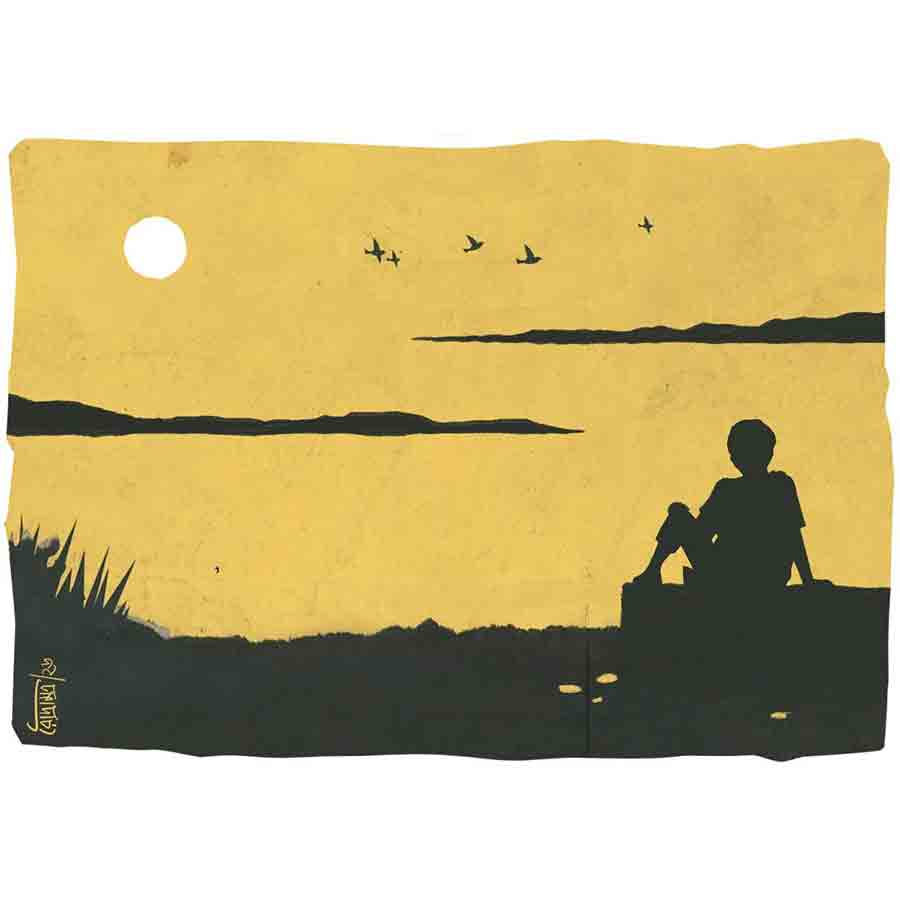

 
 <h1 align=center>কুবেরের সঞ্চয়</h1>
<h2 align=center>উপল পাত্র</h2> 

দিনের কাজকম্ম সেরে কুবের নদীবাঁধের শাণ-বাঁধানো চাতালে এসে বসে। চৈত্র মাস, মরা নদীর জায়গায় জায়গায় চর জেগেছে। বর্ষায় এই নদীই আবার ভয়ঙ্কর। সূর্য ঝুঁকেছে পশ্চিমে, তার পড়ন্ত আলোয় নদীর জল যেন সিঁদুর-গোলা। বটের ঝুরি বেয়ে সন্ধ্যা নামে, পাখিরা ফেরে বাসায়। দিনান্তে ঘরে ফেরে সবাই, শুধু কুবেরের ফেরার তাড়া নেই। ঘর একটা আছে বটে, কিন্তু কেউ নেই তার অপেক্ষায়।

থাকার মধ্যে ছিল এক বিধবা মা। সেও দেহ রাখল দু’দিনের জ্বরে। পয়সার অভাবে কুবের তার চিকিৎসাটুকুও করাতে পারেনি ভাল করে। তার ‘কুবের’ নাম যে রেখেছিল, সে বোধহয় ভাবেনি, নামটা তার জীবনে চূড়ান্ত পরিহাস হয়ে দাঁড়াবে। জন্মে থেকে সে কেবল অভাবই দেখেছে। বাপ নিবারণ জন্মেছিল দেনা নিয়ে, বেঁচেছিল দেনা করে। দেনার সুদ, আসল ছাড়ালে নিবারণের শেষ সম্বল জমিটুকুও গিলে নিল মহাজন। চাষি থেকে ভাগচাষি হওয়ার অসম্মান মেনে নিতে পারেনি সে। দুঃখে আত্মঘাতী হয়েছিল। কুবের তখন বছর সাতেকের। অভাবের সঙ্গে লড়াই শুরু তখন থেকেই।

বাউরিপাড়ার বঙ্কু, মানিক, বিশে, জগাই, শঙ্করের ঘরেও অভাব আছে। তবু তারা কেমন বৌ-বাচ্চা নিয়ে ঘর করে। চব্বিশ বছরের কুবের সুদর্শন, স্বাস্থ্যবান। ইচ্ছে তারও করে ওদের মতো সংসার করতে। বৌয়ের সোহাগ, বাচ্চার আদর পেতে। সম্বন্ধও এসেছিল দু’-একটা, কিন্তু মেয়ের বাপ সাহস করেনি মেয়ে দিতে। তার না আছে জমিজিরেত, না নগদ। থাকার মধ্যে টালির চালের মাটির ঘরখানা, বর্ষায় জল পড়ে।

অবস্থা ফেরাতে উদ্যোগী হয় কুবের, মন দেয় সঞ্চয়ে। তিল তিল করে টাকা জমায়, আর জমানো টাকা পুঁটুলি বেঁধে রাখে ঘরের চালের মটকায়। মাঝে মাঝে গভীর রাতে পুঁটুলি নামিয়ে টাকা গোনে। পোস্টাপিসে ‘বই’ করতে বলেছিল অনেকে। তাতে নাকি জমা টাকার উপর বাড়তি সুদ মেলে, টাকাও নিরাপদ থাকে। রাজি হয়নি কুবের। নামটা সই করতে পারলেও টাকা জমা-তোলার ‘কাগজ’ ভরতে কানাই সামন্তর সাহায্য লাগে। ও ব্যাটা জমা-তোলার লেনদেনে শ’-প্রতি পাঁচ টাকা দস্তুরি নেয়। সুদের টাকা দস্তুরিতে গেলে আর লাভ কী! দরকার নেই সুদের, আসলটা ঠিক থাকলেই হল।

*****

কুবের লোকের জমি ভাগে চাষ করে। অবসরে ঝুড়ি, চুপড়ি বানিয়ে মেলায় মেলায় ঘুরে দু’পয়সা রোজগার করে। ভেবেছিল, এ ভাবেই জীবনটা কাটিয়ে দেবে একা একা। কিন্তু উপরওয়ালার ভাবনা ছিল অন্য রকম।

এ রকমই এক মেলায় দুর্গার সঙ্গে তার দেখা। মাটির পুতুল, পট নিয়ে এসেছিল মেয়েটা। বছর পনেরো-ষোলোর দুর্গা ঝর্নার মতো উচ্ছল, চড়ুইয়ের মতো চঞ্চল। প্রথম দেখাতেই কুবের ফেঁসে গেল তার হরিণচোখের ফাঁদে।

“নাম কী? ঘর কোতা?” লজ্জার মাথা খেয়ে জিজ্ঞেস করেই ফেলল কুবের।

“দুগ্গা, গড়বসন্তপুর।”

“কে আচে ঘরে?”

“কী দরকার সে খোঁজে?” ফোঁস করে ওঠে দুর্গা, “মেয়েমানুষ দেখলেই বুঝি তার ঠিকুজি জানতে হবে... ঘটক নাকি?”

এমন অতর্কিত আক্রমণে কুবের অপ্রস্তুত। মেয়েদের দিকে চোখ তুলে যে তাকায় না, তার এ কী মতিভ্রম! অপমানিত কুবের গুটিয়ে নিল নিজেকে।

বেচাকেনায় দুর্গার একেবারেই মন ছিল না। কুবেরের পসরার পাশে নিজের পসরা সাজিয়ে সে মেলায় ঘুরে বেড়াত নিশ্চিন্তে। খদ্দের তার জিনিসের দাম কুবেরকে জিজ্ঞেস করত। দাম জানলেও কুবের ঠোঁট উল্টে মুখ ফিরিয়ে নিত। ‘ঘটক’ বলায় দুর্গার উপর রাগ পড়েনি তখনও। আবার খদ্দের ফিরিয়ে খারাপও লাগত তার। মনে হত মেয়েটা তারই মতো গরিব, কিছু বিক্রি হলে তবু...

দুর্গার রং ময়লা হলেও চোখমুখ পরিষ্কার, শরীর-স্বাস্থ্যও ভাল। দোষের মধ্যে বড্ড তেজ! কুবের ওতেই মজেছে। দুর্গাকে বেশি ক্ষণ না দেখলে মনটা উসখুস করত। রাগ ভুলে কুবের এক দিন কাছে ডাকল ওকে, “টো টো করে ঘুরে বেড়াস কেন? তোর খদ্দের ফিরে...”

“কী করব, এক জায়গায় বসে থাকতে ভাল্লাগেনে!” পেয়ারা চিবোতে চিবোতে দুর্গা বলে।

“ঘুরেই যদি বেড়াবি, তবে মালপত্তর আনিস কেন? বাপের বুঝি অনেক পয়সা?” সুযোগ পেয়ে কড়া কথা শুনিয়ে গায়ের ঝাল মেটায় কুবের। দুর্গার হাসিখুশি মুখটা মুহূর্তে চুপসে যায়। দেখে মায়াও হয় কুবেরের। তখনই গলা নামিয়ে বলে, “আমার কাছে যে মালপত্র রাখচিস, কবে বলবি তোর জিনিস চুরি করিচি। ওগুলান এখেন থেকে...”

চকিতে ঝিলিক খেলে যায় দুর্গার দু’চোখে। আঁচলে হাসি লুকিয়ে বলে, “চুরি তো করেইচিস।”

“আমি আবার কী চুরি...”

“বোঝো না কী চুরি করেচ... বলদা কোথাকার!” বলে জিভ ভেঙিয়ে ছুটে পালায়।

দুর্গা দুপুরে পান্তা খায় আলুচোখা, ওলের বড়া, তেঁতুলের টক দিয়ে। আর মানুষটা মুড়ি ভিজিয়ে খায় ভেলিগুড় দিয়ে। জোয়ান মানুষের খিদে কি ওই ক’টা মুড়িতে মেটে! সারা দিন কত খাটা-খাটনি যায়। বড্ড মায়া হয় দুর্গার। এক দিন জিজ্ঞেস করে, “চাট্টি ভাত আনিসনে কেন, মুড়ি খেয়ে পেট ভরে?”

“গরিবের মরা পেটের আবার ভরা না-ভরা। আর বেরোই তো সেই আঁধার থাকতে, কে ভাত রাঁধবে তখন?”

‘কেন, ঘরে বৌ নেই?’— কথাটা বলতে গিয়েও আটকায় তার মুখে। সে শুধু বলে, “ও।”

পরদিন থেকে দুর্গা বেশি করে ভাত, তরকারি আনে। দুপুরে মাটিতে গামছা বিছিয়ে সানকিতে ভাত-তরকারি পরিপাটি করে সাজিয়ে খেতে দেয় কুবেরকে। কুবের প্রথমে লজ্জায় খেতে চায়নি। কিন্তু খিদে বড় বালাই। তার উপর নোলায় জল আনা খাবার। লজ্জা শিকেয় তুলে চেটেপুটে খায় কুবের।

কথায় কথায় দুর্গা জেনেছে, কুবেরের কোথাও কেউ নেই। বেচারি হাত পুড়িয়ে রান্না করে। এতে কুবেরের উপরে তার টান আরও বেড়ে যায়। সে সেজেগুজে মেলায় আসে শুধু কুবেরকে দেখতে। মালপত্র তার জিম্মায় রেখে নিশ্চিন্তে ঘুরে বেড়ায়। দুপুরে তাকে সামনে বসিয়ে খাওয়ায়, শেষে নিজে খায়। কুবেরও আর দুর্গার খদ্দের ফেরায় না।

এক দিন খেতে বসে কুবের বলল, “একটা কথা কইব, রাগ করবিনি বল।”

“কী কথা?”

“কাল এট্টু পুঁইচচ্চড়ি আর মোরুলার টক রেঁধে আনবি? কালই তো মেলা শেষ। তোর হাতের চচ্চড়ি খেতে খুব...”

“ইসস! বায়না কত!” কপট রাগ দেখিয়ে দুর্গা বলল, “আমার রান্না যদি এতই ভাল তবে...” কথা শেষ না করে দুর্গা আড়চোখে তাকায়।

“তবে কী... বল?”

“কিছু না, তুই খা।”

“বলবিনি তো, তবে রইল খাওয়া।” রাগ দেখিয়ে উঠেই পড়ছিল কুবের, তাকে ধরে বসাল দুর্গা।

“বাবুর রাগ আছে ষোলো আনা, এক আনা বুদ্ধি যদি থাকত ঘটে! সবই বলতে হবে কেন, নিজে কিছু বুঝিস না তুই?”

অপরাধীর মতো মুখ করে কুবের বলে, “ভেঙে না বললে...”

“রোজ যাতে রেঁধে খাওয়াতে পারি সে উজ্জুগ করলেই পারিস!” কথা ক’টা বলেই দুর্গা লজ্জারাঙা মুখটা আঁচলে ঢাকে।

“কথাটা যে ভাবিনি তা নয় রে দুগ্গা। পেত্থম দিনই তোকে ভাল লেগেছিল। কিন্তুক আমার যে ঘরদোর, জমিজিরেত কিচ্ছু নেই। কী খাওয়াব, কোথায় রাখব তোকে? তোর বাপই বা কেন তোকে আমার হাতে...” কী ভেবে সঞ্চয়ের কথাটা আর তুলল না কুবের।

“যে খায় চিনি, তারে জোগায় চিন্তামণি। তুই-আমি ভাবার কে?” একটু থেমে দুর্গা বলল, “তোর তবু একটা ঘর আচে, আমার তাও নেই। আমার মা-বাপ, ভাই-বোন কেউ নেই। মামা-মামির সংসারে বাঁদী হয়ে এক পাশে পড়ে আচি এঁটো বাসনের মতো।” দুর্গার চোখ ছলছলিয়ে ওঠে। তার পর একটু সামলে নিয়ে দ্বিধাজড়িত কণ্ঠে বলে, “আমাকে... আমাকে বিয়া করবি?”

দুর্গার সজল দৃষ্টিতে সে যে কী নিদারুণ অসহায়তা আর বিপন্নতা, বুঝতে ভুল করেনি কুবের। ওকে কাছে টেনে এক গ্রাস ভাত খাইয়ে দেয় নিজের হাতে।

সে বছরই জ্যৈষ্ঠে কুবেরের বৌ হয়ে আসে দুর্গা। প্রতিবেশীদের দই, চিঁড়ে-মুড়কি, আম, কাঁঠাল আর মিষ্টান্ন দিয়ে ফলাহার করায় কুবের। কথা দেয়, সুদিন এলে ভরপেট মাংস-ভাত খাওয়াবে।

*****

কুবেরের ভাঙা ঘরদোরে শ্রী ফেরাল দুর্গা। রোজ সন্ধেয় তুলসীমঞ্চে প্রদীপ জ্বালে, শাঁখ বাজায়। পুজো-পার্বণে নিকোনো উঠোন সাজে আলপনায়। রং লাগে কুবেরের জীবনেও। কাজ থেকে তেতে-পুড়ে ফিরলে দুর্গা পাখার বাতাস করে, গুড়-বাতাসার শরবত দেয়, চুলে বিলি কেটে ঘুম পাড়ায় রাতে। কুবের এখন কাজের শেষে ঘরে ফেরে।

দুর্গার মিশুকে স্বভাবের জন্য প্রতিবেশীরা সহজেই তাকে কাছে টেনে নেয়, সই পাতায়। আসনে ফুল তোলা, রকমারি চুল বাঁধার কৌশল মেয়ে-বৌদের শিখিয়ে দেয়। মজার হেঁয়ালি বলে— “বলো তো আমি চলি সারা ক্ষণ, তবুও আমি একই জায়গায় থাকি, আমি কী? পারলে না তো? ‘ঘড়ি’।”

কুবের তার দুগ্গার মুখে হাসি ফোটাতে দিনরাত পরিশ্রম করে। গয়ারামের চালকলে দৈনিক মজুরিতে একটা কাজও জুটিয়ে নেয়। বাড়তি কিছু টাকা আসে হাতে। সঞ্চয় বাড়ে, বাড়ে সাহসও। কিন্তু তাকে কাছে পায় না বলে অভিমান হয় দুর্গার। আবদারের সুরে বলে, “তোমায় অত খাটতে হবেনে... থাকো না এট্টু আমার কাচে।”

দুর্গাকে বুকে টানে কুবের, “কোলে তোর খোকা আসচে না? সংসার বাড়ছে, বসে থাকলে এখন চলবে? পাড়ার সবাই ধরেচে খোকার মুখেভাতে মাংস-ভাত খাওয়াতেই হবে। সেথা মেলা খরচ।”

কুবেরের গলা জড়িয়ে দুর্গা বলে, “খোকা হবে জানলে কী করে? আমার যে খুব খুকির শখ। তাকে বেশ সাজাব...”

“দূর পাগলি... ও-সব ভগমানের দান। যা দেয়, মাথা পেতে নিতে হয়।” ওর কপালে চুমো দিয়ে বলে, “ছাড় এখন, মেলা কাজ পড়ে।”

দিন যায়, ডিমভরা পুঁটিমাছের মতো স্ফীত হয় দুর্গার উদর। সইরা সবাই মিলে তাকে সাধ খাওয়ায়, নতুন কাপড় দেয়। মালতী রোজ তার গাইয়ের দুধ খাওয়ায়। আশা, সনকারা নদীর মাছ, টাটকা শাকপাতা জোগাড় করে আনে, বাতাসী টকঝাল আচার করে দেয়।

*****

রাত গভীর। দুর্গা ঘুমোচ্ছে অঘোরে। কুবের চালের মটকা থেকে টাকার পুঁটলিটা নামায়। টাকাগুলো গোনে— চার হাজার তিনশো কুড়ি। মন ভরে ওঠে খুশিতে। বহু কষ্টের সঞ্চয়, খুব বিপদে পড়লে তবেই এতে হাত দেবে। গোনা হলে পুঁটলিটা মটকায় তুলে আলো নিবিয়ে শুয়ে পড়ে।

মাঝরাতে হঠাৎ দুর্গার ‘মাগো’ চিৎকারেঘুম ভেঙে যায় তার, “কী হল রে, খারাপ স্বপন দেখিচিস বুঝি?”

“উহ! কী যেন কাটল পায়ে, জ্বলে গেল...”

তাড়াতাড়ি আলো এনে ঘরের চার দিক আতিপাতি করে খুঁজল কুবের। তেমন কিছু নজরে এল না।

দিনের কাজকম্ম সেরে কুবের নদীবাঁধের শাণ-বাঁধানো চাতালে এসে বসে। চৈত্র মাস, মরা নদীর জায়গায় জায়গায় চর জেগেছে। বর্ষায় এই নদীই আবার ভয়ঙ্কর। সূর্য ঝুঁকেছে পশ্চিমে, তার পড়ন্ত আলোয় নদীর জল যেন সিঁদুর-গোলা। বটের ঝুরি বেয়ে সন্ধ্যা নামে, পাখিরা ফেরে বাসায়। দিনান্তে ঘরে ফেরে সবাই, শুধু কুবেরের ফেরার তাড়া নেই। ঘর একটা আছে বটে, কিন্তু কেউ নেই তার অপেক্ষায়।

থাকার মধ্যে ছিল এক বিধবা মা। সেও দেহ রাখল দু’দিনের জ্বরে। পয়সার অভাবে কুবের তার চিকিৎসাটুকুও করাতে পারেনি ভাল করে। তার ‘কুবের’ নাম যে রেখেছিল, সে বোধহয় ভাবেনি, নামটা তার জীবনে চূড়ান্ত পরিহাস হয়ে দাঁড়াবে। জন্মে থেকে সে কেবল অভাবই দেখেছে। বাপ নিবারণ জন্মেছিল দেনা নিয়ে, বেঁচেছিল দেনা করে। দেনার সুদ, আসল ছাড়ালে নিবারণের শেষ সম্বল জমিটুকুও গিলে নিল মহাজন। চাষি থেকে ভাগচাষি হওয়ার অসম্মান মেনে নিতে পারেনি সে। দুঃখে আত্মঘাতী হয়েছিল। কুবের তখন বছর সাতেকের। অভাবের সঙ্গে লড়াই শুরু তখন থেকেই।

বাউরিপাড়ার বঙ্কু, মানিক, বিশে, জগাই, শঙ্করের ঘরেও অভাব আছে। তবু তারা কেমন বৌ-বাচ্চা নিয়ে ঘর করে। চব্বিশ বছরের কুবের সুদর্শন, স্বাস্থ্যবান। ইচ্ছে তারও করে ওদের মতো সংসার করতে। বৌয়ের সোহাগ, বাচ্চার আদর পেতে। সম্বন্ধও এসেছিল দু’-একটা, কিন্তু মেয়ের বাপ সাহস করেনি মেয়ে দিতে। তার না আছে জমিজিরেত, না নগদ। থাকার মধ্যে টালির চালের মাটির ঘরখানা, বর্ষায় জল পড়ে।

অবস্থা ফেরাতে উদ্যোগী হয় কুবের, মন দেয় সঞ্চয়ে। তিল তিল করে টাকা জমায়, আর জমানো টাকা পুঁটুলি বেঁধে রাখে ঘরের চালের মটকায়। মাঝে মাঝে গভীর রাতে পুঁটুলি নামিয়ে টাকা গোনে। পোস্টাপিসে ‘বই’ করতে বলেছিল অনেকে। তাতে নাকি জমা টাকার উপর বাড়তি সুদ মেলে, টাকাও নিরাপদ থাকে। রাজি হয়নি কুবের। নামটা সই করতে পারলেও টাকা জমা-তোলার ‘কাগজ’ ভরতে কানাই সামন্তর সাহায্য লাগে। ও ব্যাটা জমা-তোলার লেনদেনে শ’-প্রতি পাঁচ টাকা দস্তুরি নেয়। সুদের টাকা দস্তুরিতে গেলে আর লাভ কী! দরকার নেই সুদের, আসলটা ঠিক থাকলেই হল।

*****

কুবের লোকের জমি ভাগে চাষ করে। অবসরে ঝুড়ি, চুপড়ি বানিয়ে মেলায় মেলায় ঘুরে দু’পয়সা রোজগার করে। ভেবেছিল, এ ভাবেই জীবনটা কাটিয়ে দেবে একা একা। কিন্তু উপরওয়ালার ভাবনা ছিল অন্য রকম।

এ রকমই এক মেলায় দুর্গার সঙ্গে তার দেখা। মাটির পুতুল, পট নিয়ে এসেছিল মেয়েটা। বছর পনেরো-ষোলোর দুর্গা ঝর্নার মতো উচ্ছল, চড়ুইয়ের মতো চঞ্চল। প্রথম দেখাতেই কুবের ফেঁসে গেল তার হরিণচোখের ফাঁদে।

“নাম কী? ঘর কোতা?” লজ্জার মাথা খেয়ে জিজ্ঞেস করেই ফেলল কুবের।

“দুগ্গা, গড়বসন্তপুর।”

“কে আচে ঘরে?”

“কী দরকার সে খোঁজে?” ফোঁস করে ওঠে দুর্গা, “মেয়েমানুষ দেখলেই বুঝি তার ঠিকুজি জানতে হবে... ঘটক নাকি?”

এমন অতর্কিত আক্রমণে কুবের অপ্রস্তুত। মেয়েদের দিকে চোখ তুলে যে তাকায় না, তার এ কী মতিভ্রম! অপমানিত কুবের গুটিয়ে নিল নিজেকে।

বেচাকেনায় দুর্গার একেবারেই মন ছিল না। কুবেরের পসরার পাশে নিজের পসরা সাজিয়ে সে মেলায় ঘুরে বেড়াত নিশ্চিন্তে। খদ্দের তার জিনিসের দাম কুবেরকে জিজ্ঞেস করত। দাম জানলেও কুবের ঠোঁট উল্টে মুখ ফিরিয়ে নিত। ‘ঘটক’ বলায় দুর্গার উপর রাগ পড়েনি তখনও। আবার খদ্দের ফিরিয়ে খারাপও লাগত তার। মনে হত মেয়েটা তারই মতো গরিব, কিছু বিক্রি হলে তবু...

দুর্গার রং ময়লা হলেও চোখমুখ পরিষ্কার, শরীর-স্বাস্থ্যও ভাল। দোষের মধ্যে বড্ড তেজ! কুবের ওতেই মজেছে। দুর্গাকে বেশি ক্ষণ না দেখলে মনটা উসখুস করত। রাগ ভুলে কুবের এক দিন কাছে ডাকল ওকে, “টো টো করে ঘুরে বেড়াস কেন? তোর খদ্দের ফিরে...”

“কী করব, এক জায়গায় বসে থাকতে ভাল্লাগেনে!” পেয়ারা চিবোতে চিবোতে দুর্গা বলে।

“ঘুরেই যদি বেড়াবি, তবে মালপত্তর আনিস কেন? বাপের বুঝি অনেক পয়সা?” সুযোগ পেয়ে কড়া কথা শুনিয়ে গায়ের ঝাল মেটায় কুবের। দুর্গার হাসিখুশি মুখটা মুহূর্তে চুপসে যায়। দেখে মায়াও হয় কুবেরের। তখনই গলা নামিয়ে বলে, “আমার কাছে যে মালপত্র রাখচিস, কবে বলবি তোর জিনিস চুরি করিচি। ওগুলান এখেন থেকে...”

চকিতে ঝিলিক খেলে যায় দুর্গার দু’চোখে। আঁচলে হাসি লুকিয়ে বলে, “চুরি তো করেইচিস।”

“আমি আবার কী চুরি...”

“বোঝো না কী চুরি করেচ... বলদা কোথাকার!” বলে জিভ ভেঙিয়ে ছুটে পালায়।

দুর্গা দুপুরে পান্তা খায় আলুচোখা, ওলের বড়া, তেঁতুলের টক দিয়ে। আর মানুষটা মুড়ি ভিজিয়ে খায় ভেলিগুড় দিয়ে। জোয়ান মানুষের খিদে কি ওই ক’টা মুড়িতে মেটে! সারা দিন কত খাটা-খাটনি যায়। বড্ড মায়া হয় দুর্গার। এক দিন জিজ্ঞেস করে, “চাট্টি ভাত আনিসনে কেন, মুড়ি খেয়ে পেট ভরে?”

“গরিবের মরা পেটের আবার ভরা না-ভরা। আর বেরোই তো সেই আঁধার থাকতে, কে ভাত রাঁধবে তখন?”

‘কেন, ঘরে বৌ নেই?’— কথাটা বলতে গিয়েও আটকায় তার মুখে। সে শুধু বলে, “ও।”

পরদিন থেকে দুর্গা বেশি করে ভাত, তরকারি আনে। দুপুরে মাটিতে গামছা বিছিয়ে সানকিতে ভাত-তরকারি পরিপাটি করে সাজিয়ে খেতে দেয় কুবেরকে। কুবের প্রথমে লজ্জায় খেতে চায়নি। কিন্তু খিদে বড় বালাই। তার উপর নোলায় জল আনা খাবার। লজ্জা শিকেয় তুলে চেটেপুটে খায় কুবের।

কথায় কথায় দুর্গা জেনেছে, কুবেরের কোথাও কেউ নেই। বেচারি হাত পুড়িয়ে রান্না করে। এতে কুবেরের উপরে তার টান আরও বেড়ে যায়। সে সেজেগুজে মেলায় আসে শুধু কুবেরকে দেখতে। মালপত্র তার জিম্মায় রেখে নিশ্চিন্তে ঘুরে বেড়ায়। দুপুরে তাকে সামনে বসিয়ে খাওয়ায়, শেষে নিজে খায়। কুবেরও আর দুর্গার খদ্দের ফেরায় না।

এক দিন খেতে বসে কুবের বলল, “একটা কথা কইব, রাগ করবিনি বল।”

“কী কথা?”

“কাল এট্টু পুঁইচচ্চড়ি আর মোরুলার টক রেঁধে আনবি? কালই তো মেলা শেষ। তোর হাতের চচ্চড়ি খেতে খুব...”

“ইসস! বায়না কত!” কপট রাগ দেখিয়ে দুর্গা বলল, “আমার রান্না যদি এতই ভাল তবে...” কথা শেষ না করে দুর্গা আড়চোখে তাকায়।

“তবে কী... বল?”

“কিছু না, তুই খা।”

“বলবিনি তো, তবে রইল খাওয়া।” রাগ দেখিয়ে উঠেই পড়ছিল কুবের, তাকে ধরে বসাল দুর্গা।

“বাবুর রাগ আছে ষোলো আনা, এক আনা বুদ্ধি যদি থাকত ঘটে! সবই বলতে হবে কেন, নিজে কিছু বুঝিস না তুই?”

অপরাধীর মতো মুখ করে কুবের বলে, “ভেঙে না বললে...”

“রোজ যাতে রেঁধে খাওয়াতে পারি সে উজ্জুগ করলেই পারিস!” কথা ক’টা বলেই দুর্গা লজ্জারাঙা মুখটা আঁচলে ঢাকে।

“কথাটা যে ভাবিনি তা নয় রে দুগ্গা। পেত্থম দিনই তোকে ভাল লেগেছিল। কিন্তুক আমার যে ঘরদোর, জমিজিরেত কিচ্ছু নেই। কী খাওয়াব, কোথায় রাখব তোকে? তোর বাপই বা কেন তোকে আমার হাতে...” কী ভেবে সঞ্চয়ের কথাটা আর তুলল না কুবের।

“যে খায় চিনি, তারে জোগায় চিন্তামণি। তুই-আমি ভাবার কে?” একটু থেমে দুর্গা বলল, “তোর তবু একটা ঘর আচে, আমার তাও নেই। আমার মা-বাপ, ভাই-বোন কেউ নেই। মামা-মামির সংসারে বাঁদী হয়ে এক পাশে পড়ে আচি এঁটো বাসনের মতো।” দুর্গার চোখ ছলছলিয়ে ওঠে। তার পর একটু সামলে নিয়ে দ্বিধাজড়িত কণ্ঠে বলে, “আমাকে... আমাকে বিয়া করবি?”

দুর্গার সজল দৃষ্টিতে সে যে কী নিদারুণ অসহায়তা আর বিপন্নতা, বুঝতে ভুল করেনি কুবের। ওকে কাছে টেনে এক গ্রাস ভাত খাইয়ে দেয় নিজের হাতে।

সে বছরই জ্যৈষ্ঠে কুবেরের বৌ হয়ে আসে দুর্গা। প্রতিবেশীদের দই, চিঁড়ে-মুড়কি, আম, কাঁঠাল আর মিষ্টান্ন দিয়ে ফলাহার করায় কুবের। কথা দেয়, সুদিন এলে ভরপেট মাংস-ভাত খাওয়াবে।

*****

কুবেরের ভাঙা ঘরদোরে শ্রী ফেরাল দুর্গা। রোজ সন্ধেয় তুলসীমঞ্চে প্রদীপ জ্বালে, শাঁখ বাজায়। পুজো-পার্বণে নিকোনো উঠোন সাজে আলপনায়। রং লাগে কুবেরের জীবনেও। কাজ থেকে তেতে-পুড়ে ফিরলে দুর্গা পাখার বাতাস করে, গুড়-বাতাসার শরবত দেয়, চুলে বিলি কেটে ঘুম পাড়ায় রাতে। কুবের এখন কাজের শেষে ঘরে ফেরে।

দুর্গার মিশুকে স্বভাবের জন্য প্রতিবেশীরা সহজেই তাকে কাছে টেনে নেয়, সই পাতায়। আসনে ফুল তোলা, রকমারি চুল বাঁধার কৌশল মেয়ে-বৌদের শিখিয়ে দেয়। মজার হেঁয়ালি বলে— “বলো তো আমি চলি সারা ক্ষণ, তবুও আমি একই জায়গায় থাকি, আমি কী? পারলে না তো? ‘ঘড়ি’।”

কুবের তার দুগ্গার মুখে হাসি ফোটাতে দিনরাত পরিশ্রম করে। গয়ারামের চালকলে দৈনিক মজুরিতে একটা কাজও জুটিয়ে নেয়। বাড়তি কিছু টাকা আসে হাতে। সঞ্চয় বাড়ে, বাড়ে সাহসও। কিন্তু তাকে কাছে পায় না বলে অভিমান হয় দুর্গার। আবদারের সুরে বলে, “তোমায় অত খাটতে হবেনে... থাকো না এট্টু আমার কাচে।”

দুর্গাকে বুকে টানে কুবের, “কোলে তোর খোকা আসচে না? সংসার বাড়ছে, বসে থাকলে এখন চলবে? পাড়ার সবাই ধরেচে খোকার মুখেভাতে মাংস-ভাত খাওয়াতেই হবে। সেথা মেলা খরচ।”

কুবেরের গলা জড়িয়ে দুর্গা বলে, “খোকা হবে জানলে কী করে? আমার যে খুব খুকির শখ। তাকে বেশ সাজাব...”

“দূর পাগলি... ও-সব ভগমানের দান। যা দেয়, মাথা পেতে নিতে হয়।” ওর কপালে চুমো দিয়ে বলে, “ছাড় এখন, মেলা কাজ পড়ে।”

দিন যায়, ডিমভরা পুঁটিমাছের মতো স্ফীত হয় দুর্গার উদর। সইরা সবাই মিলে তাকে সাধ খাওয়ায়, নতুন কাপড় দেয়। মালতী রোজ তার গাইয়ের দুধ খাওয়ায়। আশা, সনকারা নদীর মাছ, টাটকা শাকপাতা জোগাড় করে আনে, বাতাসী টকঝাল আচার করে দেয়।

*****

রাত গভীর। দুর্গা ঘুমোচ্ছে অঘোরে। কুবের চালের মটকা থেকে টাকার পুঁটলিটা নামায়। টাকাগুলো গোনে— চার হাজার তিনশো কুড়ি। মন ভরে ওঠে খুশিতে। বহু কষ্টের সঞ্চয়, খুব বিপদে পড়লে তবেই এতে হাত দেবে। গোনা হলে পুঁটলিটা মটকায় তুলে আলো নিবিয়ে শুয়ে পড়ে।

মাঝরাতে হঠাৎ দুর্গার ‘মাগো’ চিৎকারেঘুম ভেঙে যায় তার, “কী হল রে, খারাপ স্বপন দেখিচিস বুঝি?”

“উহ! কী যেন কাটল পায়ে, জ্বলে গেল...”

তাড়াতাড়ি আলো এনে ঘরের চার দিক আতিপাতি করে খুঁজল কুবের। তেমন কিছু নজরে এল না।

“মরে গেলুম... এখেনটায় বড্ড জ্বালা...” কুবের দেখল, দুর্গার গোড়ালির উপর সুচ ফোটানোর মতো দুটো রক্তবিন্দু। বুঝতে বাকি রইল না। চিৎকার করে জড়ো করল পড়শিদের।

মেয়ে-বৌয়েরা দুর্গাকে হাসপাতালে নিয়ে যাওয়ার পরামর্শ দিলেও পুরুষেরা ছুটল বিদ্যেধরের খোঁজে। গাঁয়ে বিদ্যেধরের মতো ধন্বন্তরি থাকতে কুবের কেন হাসপাতালে বাড়তি কড়ি গুনতে যাবে? কুবেরও তাই ওঝাতেই সায় দিল। ভবিষ্যতের জন্য সঞ্চয় বাঁচিয়ে রাখতে হবে। আরও বড় বিপদ আসতে কত ক্ষণ!

বিদ্যেধর বিস্তর ঝাড়ফুঁক করে তাগা-তাবিজ কষে বাঁধল, “আর ভয় নেই কো, মা বিষহরীর কিরপায় বিষ নেমে গেছে। রুগিকে শোয়াবে নে, সারা রাত বোস কইরে রাখো।”

দুর্গা যন্ত্রণায় কাতরায়। সইরা মাথায় হাত বুলিয়ে দেয়, বাতাস করে। ভোরের দিকে তার মুখ থেকে গ্যাঁজলা বেরোতে থাকে। শুরু হয় খিঁচুনি। বেগতিক দেখে সবাই ওকে নিয়ে ছোটে হাসপাতালে।

কিন্তু তত ক্ষণে অনেকটা দেরি হয়ে গেছে।

দুর্গাকে দাহ করে শ্মশান থেকেই কুবের যেন কোথায় নিরুদ্দেশ হয়ে যায়। বছর ঘোরে, কুবেরের দেখা নেই। শুধু পড়ে থাকে পরিত্যক্ত ভিটেটা।

*****

সপ্তাহভর টানা বৃষ্টিতে ফুঁসছে নদী। মানুষকে সরানো হয়েছে নিরাপদ আশ্রয়ে। এক রাতে নদীর কূল ছাপিয়ে হু হু করে বন্যার জল ঢুকল গাঁয়ে। জলের তোড়ে ভেসে গেল কুবেরের ঘরের চাল।

এক দিন, তখনও ভোরের আলো ভাল করে ফোটেনি। পুকুরঘাটে বাসন মাজছিল মালতী। কুবেরের পোড়ো ভিটেয় কার যেন নড়াচড়া নজরে এল। একটা কঙ্কালসার মূর্তি কিছু যেন খুঁজছে। চুলদাড়িতে ঢাকা মুখটা আবছা আলোয় দূর থেকে ভাল ঠাহর না হলেও কেমন চেনা-চেনা লাগল তার। তবে কী এত দিন পরে... উত্তেজিত মালতী বাসনকোসন ফেলেই ছুটল পাড়ায় খবর দিতে।

ঝেঁটিয়ে এল বাউরিপাড়া। ওরা তন্নতন্ন করে ভিটের চার পাশ খুঁজল, কিন্তু কাউকেই দেখতে পেল না। শুধু নরম মাটিতে পায়ের টাটকা ছাপ সাক্ষ্য দিল, কেউ এসেছিল। কিন্তু কে, কিসের খোঁজে এসেছিল তা চিররহস্যই থেকে গেল।

(এই প্রতিবেদনটি আনন্দবাজার পত্রিকার মুদ্রিত সংস্করণ থেকে নেওয়া হয়েছে)

