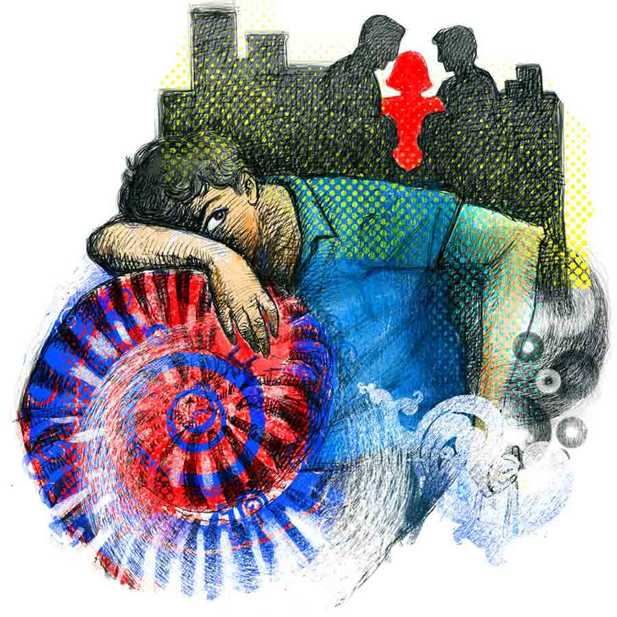

 
 <h1 align=center>কেন্নো</h1>
<h2 align=center>অভিনন্দন সরকার</h2> 

মাঝে মাঝে এ রকম হয়।

যা ঘটে গেল, তা সত্যিই ঘটেছে কি না, বোঝা যায় না। মনের মধ্যে একটা বিভ্রান্তি কাজ করতে থাকে। চোখের সামনে ঘটে যাওয়া ঘটনাও বিশ্বাস হতে চায় না। মনে হয় যা ঘটেছে, তা বাস্তবে ঘটেনি। পুরোটাই কল্পনা... একটা বাজে স্বপ্ন।

এই মুহূর্তে রিপন সেই মানসিক অবস্থার মধ্যে দিয়ে যাচ্ছে। অথচ কতটাই বা সময় কেটেছে? এই তো একটু আগে ভিড়ে-ঠাসা বাসে সে পাড়ার মোড়ে, বড় রাস্তায় এসে নেমেছে। আর সেই বাসেই এমন কিছু ঘটেছিল, যা রিপনকে নাড়া দিয়ে গেছে।

রিপনের হাতে মুদির দোকানের মাসকাবারি মালের ব্যাগ, মেয়ের কালার-পেনসিল সেট, চার্ট-পেপার আরও হাবিজাবি সাংসারিক জিনিস।

থমথমে মুখে বাড়ির দিকে হাঁটা শুরু করল রিপন। এখান থেকে তার বাড়ি মিনিট দশেক।

আজ দশ মিনিটের বেশি সময় লাগবে কারণ ক্লাবের সামনে বাবানের সঙ্গে দেখা, হন্তদন্ত হয়ে কোথায় যেন যাচ্ছে।

রিপনকে দেখে থেমে গেছে হঠাৎ, “কী রে ভাই? তোর তো দেখাই পাওয়া যায় না আজকাল। ডুমুরের ফুল হয়ে গেছিস একেবারে।”

সারা দিন অফিস-যাপনের ক্লান্তিভরা হাসি হাসল রিপন, “আর বলিস না, অফিস যা খাটাচ্ছে। নাওয়া-খাওয়ার সময় নেই।”

হাসল বাবানও, “ভালই আছিস। চেপ্টে চাকরি করছিস, মেয়ে-বৌ নিয়ে জমিয়ে সংসার...”

রিপন কী বলবে বুঝতে পারল না। এক কালে বাবানের সঙ্গে তার গভীর বন্ধুত্ব ছিল। দু’জন এক সঙ্গে সিনেমা-থিয়েটার-যুবভারতী-কফি হাউস...

রিপন চাকরি পাওয়ার পর থেকেই দু’জনের দূরত্ব বেড়েছিল। রিপনই পারেনি যোগাযোগ রাখতে, বেসরকারি চাকরির চাপ... জীবনটাই নিমকি হয়ে যাচ্ছে, বন্ধুবান্ধব নিয়ে মেতে থাকার সময় কোথায়?

রিপনকে চুপচাপ দেখে বাবান নিজেই বলল, “শোন, চাকরি-বাকরি, বৌ-বাচ্চা-সংসার এ সব তো রইলই, কিন্তু সমাজ থেকে পুরোপুরি মুখ ফিরিয়ে থাকলে তো চলবে না। তা ছাড়া এক সময় তুই কবিতা লিখতিস, সমাজচেতনা তো তোর মজ্জায় রে ভাই। ওয়ান্স আ পোয়েট, অলওয়েজ় আ পোয়েট।”

কপালে বুড়ো আঙুল ঘষতে ঘষতে সামান্য অসহিষ্ণু ভাবে রিপন বলল, “কেসটা কী? এত ছুটোছুটি করে বেড়াচ্ছিস কেন?”

বাবান বলল, “সেটাই তো বলছি। আগামী শনিবার, রাত দশটা নাগাদ পাড়ার মোড় থেকে একটা পদযাত্রা অর্গানাইজ় করছি। ক্যান্ডল-মার্চ... মোমবাতি মিছিল। অবশ্যই চলে আসিস। বৌ-মেয়ে সমেত আমন্ত্রণ রইল, ওকে?”

একটু নাড়া খেয়ে গেল রিপন। আজকের দিনেই বাবানকে এই কথাটা বলতে হল? রিপন আনমনা ভাবে বলল, “হঠাৎ মোমবাতি মিছিল যে?”

বাবান আকাশ থেকে পড়ল, “হঠাৎ! হোয়াট ডু ইউ মিন বাই হঠাৎ? ক’দিনই বা হয়েছে? সব ভুলে গেলে চলবে? দ্য প্রোটেস্ট মাস্ট গো অন। চার দিকে যা সব ঘটনা ঘটছে, তা কি তোমার চোখে পড়ছে না বন্ধু? তুমি না মেয়ের বাবা? এ ভাবে ভুললে তো চলবে না ভাই। সব মনে রাখতে হবে... সব কিছু মনে রাখতে হবে। অন্যায়ের সুবিচার এবং অন্যায়কারীর শাস্তি হতে এত দেরি হলে তো চলবে না!”

রিপন সাড়াশব্দ করছে না, দূরে রিকশা স্ট্যান্ডের দিকে তাকিয়ে আছে। বহু বছর পরে আজ বাবান হাত রাখল রিপনের কাঁধে, “দেখ, যদি সময় করতে পারিস, চলে আয়। এলে ভাল লাগবে। রাত দশটা, পাড়ার মোড়ে, মনে থাকবে তো?”

মনে থাকবে কি না জানানোর সময় পেল না রিপন, কারণ বাবান তত ক্ষণে রাস্তা পার হয়ে গেছে।

রিপনের ক্লান্ত লাগছে। নতুন একটা চিন্তা মাথায় ঢুকিয়ে দিয়ে গেল বাবান। সারা দিন অফিসে সে এক জন ব্যস্ত এগজ়িকিউটিভ, সেলস-এর চাকরি। প্রাণান্তকর চাপ। বাড়ি ফিরতে না ফিরতে আরও কত যে কাজ এসে পড়ে! ছোট হলেও একার সংসার, সব দিক সামলাতে হয়। অল্প সময়ের মধ্যেই সেরে ফেলতে হয় অনেকগুলো কাজ।

গত বছর থেকে ঝিমলি নতুন ঝামেলা শুরু করেছে। বছরখানেক আগে এক দিন সে এসে রিপনকে বলেছিল, “বাবা, কলেজে তোমার সাবজেক্ট কী ছিল?”

রিপন বলেছিল, “জ়ুলজি, কেন বল তো?”

“তা হলে আমার বায়োলজিটা তো তুমিই আমাকে পড়িয়ে দিতে পারো।”

“ধুস! সেই কোন জমানার জ়ুলজি অনার্স, এত দিনে সব ভুলে মেরে দিয়েছি।”

“যা মনে আছে তাতেই হবে। আমাদের প্রিন্সিপাল ম্যাডাম বলেছেন, পেরেন্টস আর দ্যবেস্ট টিচার্স।”

আরও কিছু ক্ষণ গাঁইগুঁই করেছিল রিপন, তবে শেষমেশ ঝিমলির জেদের কাছে তাকে হার মানতে হয়েছে। তার ফলে ইদানীং অফিসের মতো বাড়িতেও একটা চাকরি জুটেছে। সে এখন ক্লাস সিক্সের ঝিমলির বায়োলজি স্যর।

গত এক বছর এই স্যরের কাছে পড়ার পরে ঝিমলি নিজের মতো করে বায়োলজি স্যরের পর্যালোচনা করেছে। তার মতে স্যরের পড়ানো খারাপ নয়, কিন্তু স্যর ফাঁকিবাজ প্রকৃতির মানুষ। কখনও শরীর খারাপ, কখনও ক্লান্তির অজুহাতে ক্লাস কামাই করে দেয়। তখন কড়া হতে হয় ঝিমলিকেই। জোর করে অফিস-ফেরতা স্যরকে ধরে বই খুলে বসে যেতে হয়। এক বার বসে গেলে অবশ্য তরতাজা হয়ে যায় রিপন। একে একে পড়াতে থাকে ইকোসিস্টেম, প্ল্যান্ট অ্যান্ড অ্যানিম্যাল ক্লাসিফিকেশন, সেল, টিস্যু, আরওকত কিছু...

অনেক দিন বায়োলজি ক্লাস হয়নি, মান্থ-এন্ড এর অজুহাতে কাটিয়ে গেছে রিপন, আজ ঝিমলি সম্ভবত ছাড়বে না।

ক্লান্ত পায়ে রিপন বাড়ির দিকে এগোচ্ছে। মনটা অসম্ভব বিক্ষিপ্ত, বাসে এমন জঘন্য একটা ঘটনা ঘটে গেল...

*****

মেয়েটিকে প্রায়শই দেখে রিপন। বিশেষ কিছু না, বাকিদের যেমন দেখে তেমন ভাবেই দেখে। আলাদা করে যে দেখে তাও নয়, চোখে পড়ে যায়। যে বাসে রোজ অফিস থেকে ফেরে রিপন, সেই বাসেই ওঠে মেয়েটি। বয়স আর কত হবে? এই কুড়ি-বাইশ! এই বয়স পড়াশোনা করার, তবে তাকে দেখে ছাত্রী বলে মনে হয় না। কোথাও কাজে ঢুকে গেছে। দেখে বোঝা যায়, ডিউটি করে ফিরছে। কাঁধে অফিস যাওয়ার মতো ব্যাগ, চোখেমুখে তেলচিটে ক্লান্তি। চোখাচোখি হলে কোনও দিন হয়তো বা মৃদু পরিচয়েরহাসির রেখা...

রিপনের অফিসের বাইরেই বাস টার্মিনাস। তাই সে বাসে উঠে সবচেয়ে পিছনের সিটের বাঁ দিকের জানলার ধার ঘেঁষে বসে। কারণ এই বাসে অফিস টাইমের প্রচুর ভিড় হয়। রিপন জানে, তুমুলভিড়ে ওই বিশেষ সিটটা সবচেয়ে বেশি নিরাপদ আর শান্তিপূর্ণ।

আজও মেয়েটি বাসে উঠেছিল। বসার জায়গা পায়নি। মেট্রো বিকল, সুতরাং বাসে অমানুষিক ভিড়। কোনও মতে একটু জায়গা করে দাঁড়াল মেয়েটি। বেশ কিছু ক্ষণ ধরেই তাকে দেখে মনে হচ্ছিল সে অস্বস্তিতে ভুগছে। এক সময় থাকতে না পেরে মেয়েটি পিছন ফিরে বলল, “আপনি একটু ঠিক হয়ে দাঁড়ান, আমার অসুবিধা হচ্ছে।”

যাকে উদ্দেশ্য করে বলা সে এক বিশালদেহী যুবক। প্রকাণ্ড বাহুতে বীভৎস সব ট্যাটু আঁকা, বাসের ছাদে মাথা ঠেকে যাবে বলে দু’-পা ফাঁক করে দাঁড়িয়েছে। সে টেঁটিয়া ভাবে বলল, “দেখছেন তো কী ভিড়! আমি কী করব! আমার উপরেও তোচাপ আছে।”

মেয়েটি মুখ ঘুরিয়ে নিল তবে কিছু ক্ষণ পরে আবার বলল, “আপনি অসভ্যতা করছেন কিন্তু, যান সরে যান, এক চড় মারব এ বার।”

ঘটনা সিরিয়াস দিকে মোড় নিল। দেখা গেল ছেলেটি একা নেই, ভিড়ের মধ্যে থেকে তার তিন শাগরেদ এগিয়ে এল। চোয়াড়ে, উগ্র চেহারা, হাতে মোটা বালা, বহুবর্ণে রঞ্জিত বিচিত্র কেশদাম।

কথা কাটাকাটি চলছে, গলার স্বর চড়ছে দু’পক্ষেরই। বাস এরই মধ্যে এক বার তিন মিনিটের ট্রাফিকে দাঁড়িয়ে রইল, সিগনাল সবুজ হলে আবার এগোচ্ছে সন্ধের শহরের পথে, গদাইলশকরি চালে।

এ সব সময়ে মেয়েদের পক্ষ নেওয়াটাই দস্তুর। কিন্তু তার জন্যে মেয়েটির বিপক্ষে থাকতে হবে রোগা, বেঁটে, চ্যাংড়া এবং ভিতু চেহারার, কাকু-গোত্রের লোক। তখন সেই লোককে কটূক্তি করা যায়, কলার খামচে ধরা যায়, চাই কি দু’-একটা চড়-চাপড়ও লাগিয়ে দেওয়া যেতে পারে। এখানে পরিস্থিতি আলাদা। ছেলেগুলো বলশালী, উঁচু-লম্বা, বেপরোয়া ভাব সর্বাঙ্গে। কে আর ঝামেলায় যায়? যাদের সমস্যা তারা বুঝে নিক, সুশীল সমাজ দূর থেকে নজর রাখবে।

ছেলেগুলো মনে হয় বাড়াবাড়ি শুরু করেছে, মেয়েটি প্রায় চিৎকার করে উঠল, “এ ভাবে গায়ের ওপরে আসছেন কেন? কী আশ্চর্য!”

ছেলে চার জন মেয়েটিকে প্রায় পুরোপুরি ঘিরে ফেলেছে, মেয়েটিকে আর দেখাই যাচ্ছে না। হঠাৎ এক বার তার কাতর, বিপন্ন স্বর শোনা গেল, “হেল্প, প্লিজ় হেল্প...”

এ বার বাসের মধ্যে মৃদু একটা গুঞ্জন উঠল, “আহ কী ঝামেলা! এই কন্ডাক্টর দেখো না কীহচ্ছে ওখানে... এই ভিড়, এত গরম, তার মধ্যেএরা আবার...”

রিপন নড়েচড়ে বসল, তার চোখের সামনে একটা মেয়ের লাঞ্ছনা হবে আর সে কিছুই করতে পারবে না! এগিয়ে যাবে এক বার? রুখে দাঁড়াবে? একা হয়তো পারবে না, কিন্তু সে এগিয়ে গেলে বাকি যাত্রীরাও তো সাহস পাবে।

রিপন এগিয়ে যেতে পারল না। মেয়েটি চিৎকার করে উঠল, “কন্ডাক্টর, বাস থামাও!”

তার পর কোনও মতে ছেলেগুলোর তৈরি করা বেষ্টনী ছেড়ে বেরিয়ে বাসের দরজা দিয়ে হুড়মুড় করে নেমে গেল। রিপন দেখল, এই অল্প সময়েই মেয়েটির বিপর্যস্ত অবস্থা, বেশবাস অবিন্যস্ত, চুল এলোমেলো, ব্যাগের বেল্ট ছিঁড়ে গেছে, হতবাক মুখেচোখে আতঙ্ক।

বাস ছেড়ে যাওয়ার আগে এক বার মেয়েটির সঙ্গে চোখাচোখি হয়ে গেল রিপনের। চোখ সরিয়ে নিতে হল। ওই চোখে চোখ রাখা যায় না।

ছেলেগুলো জানলার কাছে মুখ বাড়িয়ে মেয়েটিকে উদ্দেশ্য করে কিছু কটু কথা বলল, কান ঝলসে যাওয়া হুইসল মারল, বাস-ভর্তি লোক নির্বিকার দেখল গোটা ঘটনাটা।

ছেলেগুলো নেমে গেল কিছু পরে। রিপন শুনল, তার পাশে বসা এক জন লোক এত ক্ষণে মুখ খুলল, “দেখলেন কাণ্ডখানা? এ সব ছেলেপিলেকে কী-ই বা বলা যায় বলুন তো?”

তার পাশের লোকটিও বিজ্ঞের মতো সম্মতিতে ঘাড় নেড়ে বলল, “দিনকাল খুব খারাপ। কন্ডাক্টরটাকেও দেখলেন তো, একটা কথা বলল?”

কন্ডাক্টর টিকিট নিতে পিছনের সিটে এসেছিল, সে গুটখার ছোপ-ধরা দাঁত বার করে খিঁচিয়ে উঠল, “প্যাসেঞ্জারে প্যাসেঞ্জারে ইয়ে... মারামারি করছে, আর আমি মাঝখানে চুলকোতে যাব... পাগল কুত্তায় কামড়েছে নাকি! আপনারাও তো কেউ কিছু বলেননি, চেপে বসে ছিলেন তখন। নিন, ভাড়া বের করুন। সন্ধেবেলা যত কিচাইন, শালা...”

অনুভূতিশূন্য, বোধহীন জ়োম্বির মতো মুখ করে বাস থেকে নেমে এসেছিল রিপন।

*****

ঝিমলির বায়োলজি ক্লাস চলছে। রিপন তাকে সাধ্যমতো বুঝিয়ে দিচ্ছে প্রাণিজগতের বিবর্তন। কেমন করে স্পঞ্জ জেলিফিশ থেকে শুরু হয়ে, জোঁক, শামুক পেরিয়ে স্তন্যপায়ী, মেরুদণ্ডী প্রাণীতে পৌঁছে যাচ্ছে বিবর্তনের ধারা।

বায়োলজি স্যরের আজ পড়ানোয় মন নেই, ক্লাস তেমন জমল না। কোনও মতে দুটো মুখে দিয়ে শুয়ে পড়ল রিপন। তার স্ত্রী পৃথা ঘরের সব কাজ সেরে শুতে এল, রিপন সচরাচর তারই মধ্যে ঘুমিয়ে পড়ে। আজ সে জেগে উসখুস করতে লাগল। দু’জনের মাঝখানে শোওয়া ঝিমলিও ক্রমাগত বকবক করতে করতে এক সময়ে ঘুমিয়ে পড়ল।

রিপনের ছটফটানি যাচ্ছে না। ঘুমন্ত স্ত্রী আর মেয়ের পাশে শুয়ে প্রায় সারা রাত জেগে রইল সে। কিছুই কি করা যেত না? মেয়েটির কথাভাবতে যেতেই কেন যে ঝিমলির মুখ ভেসে উঠছে চোখের সামনে!

এলোমেলো চিন্তা করতে করতে রিপন এক সময় বুঝল, কাজটা সে ভুল করেনি। কে জানে ছেলেগুলোর সঙ্গে মেয়েটির পূর্বপরিচয় ছিল কি না, যা হল সেটা আগেকার কোনও ঝামেলার ফল... অথবা ছেলেগুলো আর মেয়েটির যোগসাজশ থাকাও আশ্চর্যের নয়, প্রতারণার হরেক উপায় আজকাল... প্রতিবাদ করতে গিয়ে হয়তো নিজেই ফেঁসে যেত রিপন।

মাঝে মাঝে এ রকম হয়।

যা ঘটে গেল, তা সত্যিই ঘটেছে কি না, বোঝা যায় না। মনের মধ্যে একটা বিভ্রান্তি কাজ করতে থাকে। চোখের সামনে ঘটে যাওয়া ঘটনাও বিশ্বাস হতে চায় না। মনে হয় যা ঘটেছে, তা বাস্তবে ঘটেনি। পুরোটাই কল্পনা... একটা বাজে স্বপ্ন।

এই মুহূর্তে রিপন সেই মানসিক অবস্থার মধ্যে দিয়ে যাচ্ছে। অথচ কতটাই বা সময় কেটেছে? এই তো একটু আগে ভিড়ে-ঠাসা বাসে সে পাড়ার মোড়ে, বড় রাস্তায় এসে নেমেছে। আর সেই বাসেই এমন কিছু ঘটেছিল, যা রিপনকে নাড়া দিয়ে গেছে।

রিপনের হাতে মুদির দোকানের মাসকাবারি মালের ব্যাগ, মেয়ের কালার-পেনসিল সেট, চার্ট-পেপার আরও হাবিজাবি সাংসারিক জিনিস।

থমথমে মুখে বাড়ির দিকে হাঁটা শুরু করল রিপন। এখান থেকে তার বাড়ি মিনিট দশেক।

আজ দশ মিনিটের বেশি সময় লাগবে কারণ ক্লাবের সামনে বাবানের সঙ্গে দেখা, হন্তদন্ত হয়ে কোথায় যেন যাচ্ছে।

রিপনকে দেখে থেমে গেছে হঠাৎ, “কী রে ভাই? তোর তো দেখাই পাওয়া যায় না আজকাল। ডুমুরের ফুল হয়ে গেছিস একেবারে।”

সারা দিন অফিস-যাপনের ক্লান্তিভরা হাসি হাসল রিপন, “আর বলিস না, অফিস যা খাটাচ্ছে। নাওয়া-খাওয়ার সময় নেই।”

হাসল বাবানও, “ভালই আছিস। চেপ্টে চাকরি করছিস, মেয়ে-বৌ নিয়ে জমিয়ে সংসার...”

রিপন কী বলবে বুঝতে পারল না। এক কালে বাবানের সঙ্গে তার গভীর বন্ধুত্ব ছিল। দু’জন এক সঙ্গে সিনেমা-থিয়েটার-যুবভারতী-কফি হাউস...

রিপন চাকরি পাওয়ার পর থেকেই দু’জনের দূরত্ব বেড়েছিল। রিপনই পারেনি যোগাযোগ রাখতে, বেসরকারি চাকরির চাপ... জীবনটাই নিমকি হয়ে যাচ্ছে, বন্ধুবান্ধব নিয়ে মেতে থাকার সময় কোথায়?

রিপনকে চুপচাপ দেখে বাবান নিজেই বলল, “শোন, চাকরি-বাকরি, বৌ-বাচ্চা-সংসার এ সব তো রইলই, কিন্তু সমাজ থেকে পুরোপুরি মুখ ফিরিয়ে থাকলে তো চলবে না। তা ছাড়া এক সময় তুই কবিতা লিখতিস, সমাজচেতনা তো তোর মজ্জায় রে ভাই। ওয়ান্স আ পোয়েট, অলওয়েজ় আ পোয়েট।”

কপালে বুড়ো আঙুল ঘষতে ঘষতে সামান্য অসহিষ্ণু ভাবে রিপন বলল, “কেসটা কী? এত ছুটোছুটি করে বেড়াচ্ছিস কেন?”

বাবান বলল, “সেটাই তো বলছি। আগামী শনিবার, রাত দশটা নাগাদ পাড়ার মোড় থেকে একটা পদযাত্রা অর্গানাইজ় করছি। ক্যান্ডল-মার্চ... মোমবাতি মিছিল। অবশ্যই চলে আসিস। বৌ-মেয়ে সমেত আমন্ত্রণ রইল, ওকে?”

একটু নাড়া খেয়ে গেল রিপন। আজকের দিনেই বাবানকে এই কথাটা বলতে হল? রিপন আনমনা ভাবে বলল, “হঠাৎ মোমবাতি মিছিল যে?”

বাবান আকাশ থেকে পড়ল, “হঠাৎ! হোয়াট ডু ইউ মিন বাই হঠাৎ? ক’দিনই বা হয়েছে? সব ভুলে গেলে চলবে? দ্য প্রোটেস্ট মাস্ট গো অন। চার দিকে যা সব ঘটনা ঘটছে, তা কি তোমার চোখে পড়ছে না বন্ধু? তুমি না মেয়ের বাবা? এ ভাবে ভুললে তো চলবে না ভাই। সব মনে রাখতে হবে... সব কিছু মনে রাখতে হবে। অন্যায়ের সুবিচার এবং অন্যায়কারীর শাস্তি হতে এত দেরি হলে তো চলবে না!”

রিপন সাড়াশব্দ করছে না, দূরে রিকশা স্ট্যান্ডের দিকে তাকিয়ে আছে। বহু বছর পরে আজ বাবান হাত রাখল রিপনের কাঁধে, “দেখ, যদি সময় করতে পারিস, চলে আয়। এলে ভাল লাগবে। রাত দশটা, পাড়ার মোড়ে, মনে থাকবে তো?”

মনে থাকবে কি না জানানোর সময় পেল না রিপন, কারণ বাবান তত ক্ষণে রাস্তা পার হয়ে গেছে।

রিপনের ক্লান্ত লাগছে। নতুন একটা চিন্তা মাথায় ঢুকিয়ে দিয়ে গেল বাবান। সারা দিন অফিসে সে এক জন ব্যস্ত এগজ়িকিউটিভ, সেলস-এর চাকরি। প্রাণান্তকর চাপ। বাড়ি ফিরতে না ফিরতে আরও কত যে কাজ এসে পড়ে! ছোট হলেও একার সংসার, সব দিক সামলাতে হয়। অল্প সময়ের মধ্যেই সেরে ফেলতে হয় অনেকগুলো কাজ।

গত বছর থেকে ঝিমলি নতুন ঝামেলা শুরু করেছে। বছরখানেক আগে এক দিন সে এসে রিপনকে বলেছিল, “বাবা, কলেজে তোমার সাবজেক্ট কী ছিল?”

রিপন বলেছিল, “জ়ুলজি, কেন বল তো?”

“তা হলে আমার বায়োলজিটা তো তুমিই আমাকে পড়িয়ে দিতে পারো।”

“ধুস! সেই কোন জমানার জ়ুলজি অনার্স, এত দিনে সব ভুলে মেরে দিয়েছি।”

“যা মনে আছে তাতেই হবে। আমাদের প্রিন্সিপাল ম্যাডাম বলেছেন, পেরেন্টস আর দ্যবেস্ট টিচার্স।”

আরও কিছু ক্ষণ গাঁইগুঁই করেছিল রিপন, তবে শেষমেশ ঝিমলির জেদের কাছে তাকে হার মানতে হয়েছে। তার ফলে ইদানীং অফিসের মতো বাড়িতেও একটা চাকরি জুটেছে। সে এখন ক্লাস সিক্সের ঝিমলির বায়োলজি স্যর।

গত এক বছর এই স্যরের কাছে পড়ার পরে ঝিমলি নিজের মতো করে বায়োলজি স্যরের পর্যালোচনা করেছে। তার মতে স্যরের পড়ানো খারাপ নয়, কিন্তু স্যর ফাঁকিবাজ প্রকৃতির মানুষ। কখনও শরীর খারাপ, কখনও ক্লান্তির অজুহাতে ক্লাস কামাই করে দেয়। তখন কড়া হতে হয় ঝিমলিকেই। জোর করে অফিস-ফেরতা স্যরকে ধরে বই খুলে বসে যেতে হয়। এক বার বসে গেলে অবশ্য তরতাজা হয়ে যায় রিপন। একে একে পড়াতে থাকে ইকোসিস্টেম, প্ল্যান্ট অ্যান্ড অ্যানিম্যাল ক্লাসিফিকেশন, সেল, টিস্যু, আরওকত কিছু...

অনেক দিন বায়োলজি ক্লাস হয়নি, মান্থ-এন্ড এর অজুহাতে কাটিয়ে গেছে রিপন, আজ ঝিমলি সম্ভবত ছাড়বে না।

ক্লান্ত পায়ে রিপন বাড়ির দিকে এগোচ্ছে। মনটা অসম্ভব বিক্ষিপ্ত, বাসে এমন জঘন্য একটা ঘটনা ঘটে গেল...

*****

মেয়েটিকে প্রায়শই দেখে রিপন। বিশেষ কিছু না, বাকিদের যেমন দেখে তেমন ভাবেই দেখে। আলাদা করে যে দেখে তাও নয়, চোখে পড়ে যায়। যে বাসে রোজ অফিস থেকে ফেরে রিপন, সেই বাসেই ওঠে মেয়েটি। বয়স আর কত হবে? এই কুড়ি-বাইশ! এই বয়স পড়াশোনা করার, তবে তাকে দেখে ছাত্রী বলে মনে হয় না। কোথাও কাজে ঢুকে গেছে। দেখে বোঝা যায়, ডিউটি করে ফিরছে। কাঁধে অফিস যাওয়ার মতো ব্যাগ, চোখেমুখে তেলচিটে ক্লান্তি। চোখাচোখি হলে কোনও দিন হয়তো বা মৃদু পরিচয়েরহাসির রেখা...

রিপনের অফিসের বাইরেই বাস টার্মিনাস। তাই সে বাসে উঠে সবচেয়ে পিছনের সিটের বাঁ দিকের জানলার ধার ঘেঁষে বসে। কারণ এই বাসে অফিস টাইমের প্রচুর ভিড় হয়। রিপন জানে, তুমুলভিড়ে ওই বিশেষ সিটটা সবচেয়ে বেশি নিরাপদ আর শান্তিপূর্ণ।

আজও মেয়েটি বাসে উঠেছিল। বসার জায়গা পায়নি। মেট্রো বিকল, সুতরাং বাসে অমানুষিক ভিড়। কোনও মতে একটু জায়গা করে দাঁড়াল মেয়েটি। বেশ কিছু ক্ষণ ধরেই তাকে দেখে মনে হচ্ছিল সে অস্বস্তিতে ভুগছে। এক সময় থাকতে না পেরে মেয়েটি পিছন ফিরে বলল, “আপনি একটু ঠিক হয়ে দাঁড়ান, আমার অসুবিধা হচ্ছে।”

যাকে উদ্দেশ্য করে বলা সে এক বিশালদেহী যুবক। প্রকাণ্ড বাহুতে বীভৎস সব ট্যাটু আঁকা, বাসের ছাদে মাথা ঠেকে যাবে বলে দু’-পা ফাঁক করে দাঁড়িয়েছে। সে টেঁটিয়া ভাবে বলল, “দেখছেন তো কী ভিড়! আমি কী করব! আমার উপরেও তোচাপ আছে।”

মেয়েটি মুখ ঘুরিয়ে নিল তবে কিছু ক্ষণ পরে আবার বলল, “আপনি অসভ্যতা করছেন কিন্তু, যান সরে যান, এক চড় মারব এ বার।”

ঘটনা সিরিয়াস দিকে মোড় নিল। দেখা গেল ছেলেটি একা নেই, ভিড়ের মধ্যে থেকে তার তিন শাগরেদ এগিয়ে এল। চোয়াড়ে, উগ্র চেহারা, হাতে মোটা বালা, বহুবর্ণে রঞ্জিত বিচিত্র কেশদাম।

কথা কাটাকাটি চলছে, গলার স্বর চড়ছে দু’পক্ষেরই। বাস এরই মধ্যে এক বার তিন মিনিটের ট্রাফিকে দাঁড়িয়ে রইল, সিগনাল সবুজ হলে আবার এগোচ্ছে সন্ধের শহরের পথে, গদাইলশকরি চালে।

এ সব সময়ে মেয়েদের পক্ষ নেওয়াটাই দস্তুর। কিন্তু তার জন্যে মেয়েটির বিপক্ষে থাকতে হবে রোগা, বেঁটে, চ্যাংড়া এবং ভিতু চেহারার, কাকু-গোত্রের লোক। তখন সেই লোককে কটূক্তি করা যায়, কলার খামচে ধরা যায়, চাই কি দু’-একটা চড়-চাপড়ও লাগিয়ে দেওয়া যেতে পারে। এখানে পরিস্থিতি আলাদা। ছেলেগুলো বলশালী, উঁচু-লম্বা, বেপরোয়া ভাব সর্বাঙ্গে। কে আর ঝামেলায় যায়? যাদের সমস্যা তারা বুঝে নিক, সুশীল সমাজ দূর থেকে নজর রাখবে।

ছেলেগুলো মনে হয় বাড়াবাড়ি শুরু করেছে, মেয়েটি প্রায় চিৎকার করে উঠল, “এ ভাবে গায়ের ওপরে আসছেন কেন? কী আশ্চর্য!”

ছেলে চার জন মেয়েটিকে প্রায় পুরোপুরি ঘিরে ফেলেছে, মেয়েটিকে আর দেখাই যাচ্ছে না। হঠাৎ এক বার তার কাতর, বিপন্ন স্বর শোনা গেল, “হেল্প, প্লিজ় হেল্প...”

এ বার বাসের মধ্যে মৃদু একটা গুঞ্জন উঠল, “আহ কী ঝামেলা! এই কন্ডাক্টর দেখো না কীহচ্ছে ওখানে... এই ভিড়, এত গরম, তার মধ্যেএরা আবার...”

রিপন নড়েচড়ে বসল, তার চোখের সামনে একটা মেয়ের লাঞ্ছনা হবে আর সে কিছুই করতে পারবে না! এগিয়ে যাবে এক বার? রুখে দাঁড়াবে? একা হয়তো পারবে না, কিন্তু সে এগিয়ে গেলে বাকি যাত্রীরাও তো সাহস পাবে।

রিপন এগিয়ে যেতে পারল না। মেয়েটি চিৎকার করে উঠল, “কন্ডাক্টর, বাস থামাও!”

তার পর কোনও মতে ছেলেগুলোর তৈরি করা বেষ্টনী ছেড়ে বেরিয়ে বাসের দরজা দিয়ে হুড়মুড় করে নেমে গেল। রিপন দেখল, এই অল্প সময়েই মেয়েটির বিপর্যস্ত অবস্থা, বেশবাস অবিন্যস্ত, চুল এলোমেলো, ব্যাগের বেল্ট ছিঁড়ে গেছে, হতবাক মুখেচোখে আতঙ্ক।

বাস ছেড়ে যাওয়ার আগে এক বার মেয়েটির সঙ্গে চোখাচোখি হয়ে গেল রিপনের। চোখ সরিয়ে নিতে হল। ওই চোখে চোখ রাখা যায় না।

ছেলেগুলো জানলার কাছে মুখ বাড়িয়ে মেয়েটিকে উদ্দেশ্য করে কিছু কটু কথা বলল, কান ঝলসে যাওয়া হুইসল মারল, বাস-ভর্তি লোক নির্বিকার দেখল গোটা ঘটনাটা।

ছেলেগুলো নেমে গেল কিছু পরে। রিপন শুনল, তার পাশে বসা এক জন লোক এত ক্ষণে মুখ খুলল, “দেখলেন কাণ্ডখানা? এ সব ছেলেপিলেকে কী-ই বা বলা যায় বলুন তো?”

তার পাশের লোকটিও বিজ্ঞের মতো সম্মতিতে ঘাড় নেড়ে বলল, “দিনকাল খুব খারাপ। কন্ডাক্টরটাকেও দেখলেন তো, একটা কথা বলল?”

কন্ডাক্টর টিকিট নিতে পিছনের সিটে এসেছিল, সে গুটখার ছোপ-ধরা দাঁত বার করে খিঁচিয়ে উঠল, “প্যাসেঞ্জারে প্যাসেঞ্জারে ইয়ে... মারামারি করছে, আর আমি মাঝখানে চুলকোতে যাব... পাগল কুত্তায় কামড়েছে নাকি! আপনারাও তো কেউ কিছু বলেননি, চেপে বসে ছিলেন তখন। নিন, ভাড়া বের করুন। সন্ধেবেলা যত কিচাইন, শালা...”

অনুভূতিশূন্য, বোধহীন জ়োম্বির মতো মুখ করে বাস থেকে নেমে এসেছিল রিপন।

*****

ঝিমলির বায়োলজি ক্লাস চলছে। রিপন তাকে সাধ্যমতো বুঝিয়ে দিচ্ছে প্রাণিজগতের বিবর্তন। কেমন করে স্পঞ্জ জেলিফিশ থেকে শুরু হয়ে, জোঁক, শামুক পেরিয়ে স্তন্যপায়ী, মেরুদণ্ডী প্রাণীতে পৌঁছে যাচ্ছে বিবর্তনের ধারা।

বায়োলজি স্যরের আজ পড়ানোয় মন নেই, ক্লাস তেমন জমল না। কোনও মতে দুটো মুখে দিয়ে শুয়ে পড়ল রিপন। তার স্ত্রী পৃথা ঘরের সব কাজ সেরে শুতে এল, রিপন সচরাচর তারই মধ্যে ঘুমিয়ে পড়ে। আজ সে জেগে উসখুস করতে লাগল। দু’জনের মাঝখানে শোওয়া ঝিমলিও ক্রমাগত বকবক করতে করতে এক সময়ে ঘুমিয়ে পড়ল।

রিপনের ছটফটানি যাচ্ছে না। ঘুমন্ত স্ত্রী আর মেয়ের পাশে শুয়ে প্রায় সারা রাত জেগে রইল সে। কিছুই কি করা যেত না? মেয়েটির কথাভাবতে যেতেই কেন যে ঝিমলির মুখ ভেসে উঠছে চোখের সামনে!

এলোমেলো চিন্তা করতে করতে রিপন এক সময় বুঝল, কাজটা সে ভুল করেনি। কে জানে ছেলেগুলোর সঙ্গে মেয়েটির পূর্বপরিচয় ছিল কি না, যা হল সেটা আগেকার কোনও ঝামেলার ফল... অথবা ছেলেগুলো আর মেয়েটির যোগসাজশ থাকাও আশ্চর্যের নয়, প্রতারণার হরেক উপায় আজকাল... প্রতিবাদ করতে গিয়ে হয়তো নিজেই ফেঁসে যেত রিপন।

চিন্তাগুলো সামান্য স্বস্তি দিল রিপনকে। তবে এটা ঠিক দিনকাল খুব খারাপ, প্রতিবাদ একটা হওয়া উচিত। আগামী শনিবার মোমবাতি মিছিলে যাওয়ার সিদ্ধান্তটা নিয়েই ফেলল রিপন। একা যাবে না, পৃথা আর ঝিমলিকেও নিয়ে যাবে।

ঝিমলিকে কী পোশাক পরতে বলা যায়? পুজোয় নিউমার্কেট থেকে যে লং-ড্রেসটা কিনেছিল সেটা, নাকি সেজকাকা জন্মদিনে যে গাউনটা দিয়েছিলেন সেটা?

একটা প্ল্যাকার্ড বানিয়ে দেবে ঝিমলিকে। গোটা ক্যান্ডল-মার্চে ঝিমলির গলা থেকে সেই প্ল্যাকার্ড ঝুলবে, লাল কালিতে সেখানে লেখা থাকবে: উই ওয়ান্ট জাস্টিস।

রিপন বুঝল তার গ্লানি, অপরাধবোধ সব ধীরে ধীরে মিলিয়ে যাচ্ছে, ঠোঁটের কোণে এক চিলতে হাসি নিয়ে নির্ভার রিপন ঘুমিয়ে পড়ল... পাখিরা ডেকে ওঠার একটু আগে।

*****

সচরাচর পৃথা আর ঝিমলি খুব সকালে উঠে পড়ে। ঝিমলির সকালের স্কুল, তাকে তৈরি হতে হয়। রিপন একটু বেলা করেই ওঠে। উঠেই অফিস যাওয়ার হুড়ুমদুড়ুম শুরু করে দেয়।

আজ ভোরবেলায় রিপনকে বিছানায় পাওয়া গেল না।

মেয়েকে ধাক্কা দিল পৃথা, “এই ঝিমলি, তোর বাবা কোথায় গেল?”

ঝিমলি পাশ ফিরে দেখল বিছানায় বাবা নেই। সে হাত বাড়িয়ে বেডসুইচ টিপে আলো জ্বালাল।

বিস্মিত হয়ে মা আর মেয়ে দেখল, বিছানার শূন্য জায়গায় একটা কেন্নো পড়ে আছে।

পৃথা ঘৃণাভরে বলে উঠল, “ম্যা গো! কেন্নো এল কোত্থেকে! ফেলে দে ঝিমলি, দূর কর ওটাকে।”

“ফেলে তো দেবই মা, তুমি ঝাঁটাটা নিয়ে এসো। তার আগে একটু কাছ থেকে দেখে নিই।” কেন্নোর দিকে স্থির চোখে তাকিয়ে বায়োলজি স্যরের পড়া ঝালিয়ে নিল ঝিমলি, “কেন্নো... আর্থ্রোপোড, নন-কর্ডেট... অমেরুদণ্ডী।”

(এই প্রতিবেদনটি আনন্দবাজার পত্রিকার মুদ্রিত সংস্করণ থেকে নেওয়া হয়েছে)

