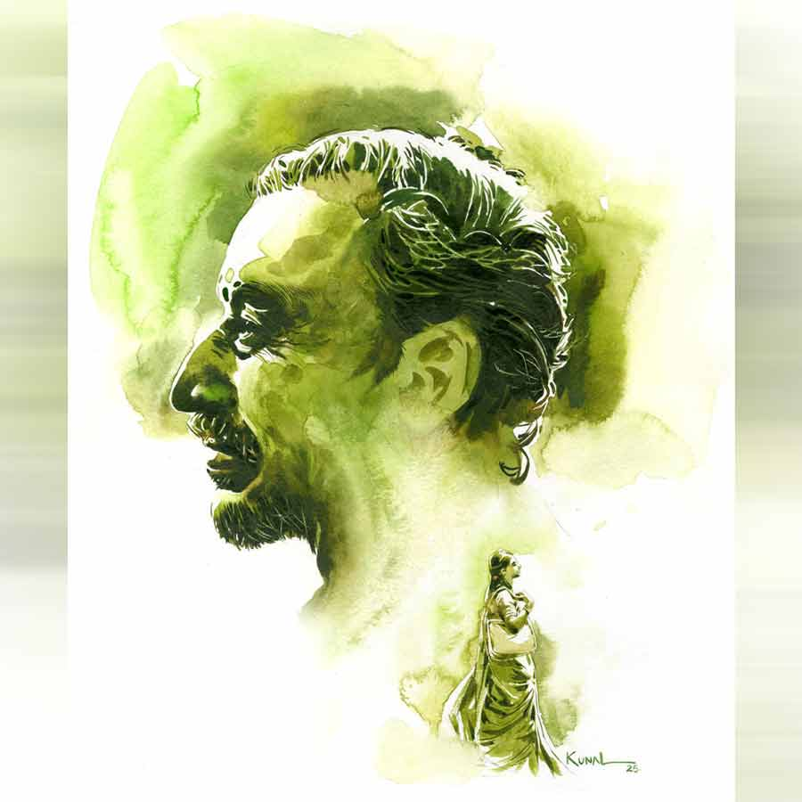

 
 <h1 align=center>গরম ভাত</h1>
<h2 align=center>রাখী নাথ কর্মকার</h2> 

আরে না না, বুথের মধ্যে ওটাকে ও ভাবে পিটিয়ে মেরো না, এক্ষুনি মার্ডার কেসে ফেঁসে যাবে তো!” প্রিসাইডিং অফিসার নমিতাদি একেবারে হাঁ-হাঁ করে উঠলেন।

“বেশ, তবে ইনসেক্ট কিলার স্প্রেটাই অ্যাপ্লাই করা হোক!” নমিতাদির কথা শুনে ফার্স্ট পোলিং অফিসার সীমাদি হাত থেকে চটিটা চটাস করে মেঝেতে ফেলে দিলেন। তার পর স্প্রের বোতলটা হাতে নিয়ে ঠিক ‘যুদ্ধং দেহি’ মনোভাবে হিলহিলে তেঁতুলবিছেটার উপর ঝাঁপিয়ে পড়লেন। আমি আর থার্ড পোলিং অফিসার সুকন্যা বসে বসে ওদের কাণ্ডকারখানা দেখছিলাম। ডিসিআরসি থেকে নিয়ে আসা গুচ্ছের কাগজপত্র, ফর্ম-টর্ম সব গোছগাছ করে আমাদের আগামী কালের প্রস্তুতিপর্ব প্রায় শেষের দিকে। বাইরে এখন ঘুটঘুটে অন্ধকার।

গ্রামের একটা ছোট্ট প্রাইমারি স্কুল। পলেস্তারা খসা, ইটের দাঁত বার করা। কালচে-লাল টালির চালের নীচে ঝুরঝুরে কাঠের বিম থেকে মাথার উপর টিমটিম করে একটা হলুদ বাল্‌ব জ্বলছে। এত বড় একটা রুমে একটাই পাখা, আক্ষরিক অর্থেই সেটা ঠুকুস ঠুকুস করে ঘুরছে মাথার উপরে। স্কুলের দুটো রুমে দুটো বুথ। পাশের রুমে অন্য মহিলা বুথের ভোটকর্মীরা তাদের কাজে ব্যস্ত। গ্রামের একেবারে শেষ প্রান্তে খানকয়েক মাটির বাড়ি। সেগুলোর মাঝখান দিয়ে কিছুটা এগিয়ে একটা নির্জন মাঠের উপর স্কুলবাড়িটা। স্কুলের তিন দিকে নিঝুম অন্ধকারে ডুবে থাকা তিনটে মজা ডোবা। পাড়ের ঝুরঝুরে, ভেজা নরম মাটিকে আঁকড়ে ধরে জালের মতো বিছিয়ে আছে হেলে পড়া থমথমে গাছেদের শিকড়। নিস্তব্ধ বাঁশবাগানে চুঁইয়ে পড়া চটচটে আঁধারের বুকে টুপটাপ জোনাকিরা জ্বলছে-নিভছে। চার পাশটা যেন খাঁ-খাঁ করছে।

“দিমুণি, আসব?”

অচেনা গলার আওয়াজ শুনে দরজার দিকে তাকালাম। বছর পঞ্চান্নর একটি কালোকুলো, বেঁটেখাটো লোক দাঁড়িয়ে আছে। পরনে খাটো লুঙ্গি, হলদেটে গেঞ্জি, কাঁধে গামছা।

“এঁজ্ঞে, ভোটের সময় এখানে খাওয়াদাওয়ার ব্যাপস্তাটা আমিই করি। তা আপনেরা রাতে কী খাবেন দিমুণিরা? ভাত না রুটি?”

আমরা কিছু বলার আগেই প্রিসাইডিং অফিসার নমিতাদি ভুরু কুঁচকে বললেন, “না না, ভাত না। রুটিই ভাল। রুটির সঙ্গে কী আছে?”

এই জ্যৈষ্ঠের গরমে, রাতে আমার মোটেও রুটি চিবোতে ইচ্ছে হচ্ছিল না, কিন্তু কেউ কিছু বলল না দেখে আমি চুপ মেরে গেলাম।

লোকটা বত্রিশ পাটি বের করে হেসে বলল, “সে আপনেরা ঝা বলবেন, ডিমের তরকারি, সবজি, আলুর ঝোল...”

“তা ওই আলুর ঝোলই দাও তা হলে আমাদের। তা, আমাদের ছ’জনের জন্য কত টাকা দিতেহবে এখন?”

লোকটা লজ্জায় জিব কাটল, “কী ঝে বলেন দিমুণি! আগে তো আপনেরা খাওয়াদাওয়া করেন। ট্যাকাপহার কতা পরে হবে’খন।”

বছর পঁয়তাল্লিশের নমিতাদি একটু বিরক্ত হলেন। কর্কশ গলায় বললেন, “না না, সে হবে না। কত টাকা লাগবে এখনই বলো, একটা রফা হয়ে যাক। তার পর খাওয়াদাওয়া হয়ে যাওয়ার পরে বিশাল একটা অঙ্ক দেখিয়ে বলবে, এত টাকা দিতেই হবে। সেটি বাপু হচ্ছে না!”

কলকাতার একটা হাই স্কুলের হেড টিচার নমিতাদি। ছেলে নাকি চার্টার্ড অ্যাকাউন্ট্যান্ট। তাই হয়তো এমন চুলচেরা হিসাব না করে জীবনে এক পা-ও এগোন না! লোকটা অবশ্য এই মুহূর্তে হিসাবের ধারকাছ দিয়ে গেল না, জিব কেটে বলল, “আমি কি আপনেদের কাচ থেকে বেশি নিব দিমুণি? শুধু বাজারের খরচডাই আমায় দিবেন...”

লোকটা আর এক মিনিটও দাঁড়াল না, যেমন অতর্কিতে এসেছিল, তেমনই অতর্কিতে উধাওহয়ে গেল।

বাড়ি থেকে একটা ফোন এসেছে আমার। ভিডিয়ো কল। আমার তিন বছরের মেয়েটার ধুম জ্বর আজ ভোররাত থেকে। অসুস্থ হলে বাচ্চারা সবার আগে মাকে কাছে পেতে চায়। কিন্তু আজ আমি নিরুপায়। সকালে ডিসিআরসি-তে বেরোনোর সময় জ্বরের ঘোরেই হাপুস নয়নে সে কী কান্না মেয়ের! মাকে পইপই করে ওষুধগুলো সব বুঝিয়ে দিয়ে এসেছি।

“জ্বরের ঘোরে নিস্তেজ হয়ে পড়ে থাকছে রে, মাঝে ঘোরটা কাটলেই ‘মা মা’ করে কেঁদে উঠছে!” মা বেশ চিন্তিত মুখে বলছেন। ব্যাকগ্রাউন্ডে মেয়ের গলা-ফাটানো কান্নার আওয়াজ পাচ্ছি। বুকের ভিতরটা দুমড়ে মুচড়ে যাচ্ছে আমার। ডাক্তারের সঙ্গে আর এক বার কথা বলতে বলে, ওষুধগুলো আর এক বার মাকে বুঝিয়ে দিয়ে ফোনটা কেটে দিলাম আমি।

থার্ড পোলিং অফিসার সুকন্যা চুপচাপ মেশিনগুলো সব চেক করছিল। শুনলাম, বেচারির মা মারা গিয়েছেন মাত্র দু’দিন আগে। সেরিব্রাল অ্যাটাক। তবুও ডিউটি থেকে ছাড় পায়নি। কিছুটা আমার মতোই তেতো গেলার মতো মুখ করে বসে আছে সে। প্রিসাইডিং অফিসার নমিতাদি আর ফার্স্ট পোলিং অফিসার সীমাদি দু’জনে কী সব বকবক করে যাচ্ছিলেন, মাঝে মাঝে হাসতে হাসতে বেঞ্চের উপর গড়িয়ে পড়ছিলেন।

আরে না না, বুথের মধ্যে ওটাকে ও ভাবে পিটিয়ে মেরো না, এক্ষুনি মার্ডার কেসে ফেঁসে যাবে তো!” প্রিসাইডিং অফিসার নমিতাদি একেবারে হাঁ-হাঁ করে উঠলেন।

“বেশ, তবে ইনসেক্ট কিলার স্প্রেটাই অ্যাপ্লাই করা হোক!” নমিতাদির কথা শুনে ফার্স্ট পোলিং অফিসার সীমাদি হাত থেকে চটিটা চটাস করে মেঝেতে ফেলে দিলেন। তার পর স্প্রের বোতলটা হাতে নিয়ে ঠিক ‘যুদ্ধং দেহি’ মনোভাবে হিলহিলে তেঁতুলবিছেটার উপর ঝাঁপিয়ে পড়লেন। আমি আর থার্ড পোলিং অফিসার সুকন্যা বসে বসে ওদের কাণ্ডকারখানা দেখছিলাম। ডিসিআরসি থেকে নিয়ে আসা গুচ্ছের কাগজপত্র, ফর্ম-টর্ম সব গোছগাছ করে আমাদের আগামী কালের প্রস্তুতিপর্ব প্রায় শেষের দিকে। বাইরে এখন ঘুটঘুটে অন্ধকার।

গ্রামের একটা ছোট্ট প্রাইমারি স্কুল। পলেস্তারা খসা, ইটের দাঁত বার করা। কালচে-লাল টালির চালের নীচে ঝুরঝুরে কাঠের বিম থেকে মাথার উপর টিমটিম করে একটা হলুদ বাল্‌ব জ্বলছে। এত বড় একটা রুমে একটাই পাখা, আক্ষরিক অর্থেই সেটা ঠুকুস ঠুকুস করে ঘুরছে মাথার উপরে। স্কুলের দুটো রুমে দুটো বুথ। পাশের রুমে অন্য মহিলা বুথের ভোটকর্মীরা তাদের কাজে ব্যস্ত। গ্রামের একেবারে শেষ প্রান্তে খানকয়েক মাটির বাড়ি। সেগুলোর মাঝখান দিয়ে কিছুটা এগিয়ে একটা নির্জন মাঠের উপর স্কুলবাড়িটা। স্কুলের তিন দিকে নিঝুম অন্ধকারে ডুবে থাকা তিনটে মজা ডোবা। পাড়ের ঝুরঝুরে, ভেজা নরম মাটিকে আঁকড়ে ধরে জালের মতো বিছিয়ে আছে হেলে পড়া থমথমে গাছেদের শিকড়। নিস্তব্ধ বাঁশবাগানে চুঁইয়ে পড়া চটচটে আঁধারের বুকে টুপটাপ জোনাকিরা জ্বলছে-নিভছে। চার পাশটা যেন খাঁ-খাঁ করছে।

“দিমুণি, আসব?”

অচেনা গলার আওয়াজ শুনে দরজার দিকে তাকালাম। বছর পঞ্চান্নর একটি কালোকুলো, বেঁটেখাটো লোক দাঁড়িয়ে আছে। পরনে খাটো লুঙ্গি, হলদেটে গেঞ্জি, কাঁধে গামছা।

“এঁজ্ঞে, ভোটের সময় এখানে খাওয়াদাওয়ার ব্যাপস্তাটা আমিই করি। তা আপনেরা রাতে কী খাবেন দিমুণিরা? ভাত না রুটি?”

আমরা কিছু বলার আগেই প্রিসাইডিং অফিসার নমিতাদি ভুরু কুঁচকে বললেন, “না না, ভাত না। রুটিই ভাল। রুটির সঙ্গে কী আছে?”

এই জ্যৈষ্ঠের গরমে, রাতে আমার মোটেও রুটি চিবোতে ইচ্ছে হচ্ছিল না, কিন্তু কেউ কিছু বলল না দেখে আমি চুপ মেরে গেলাম।

লোকটা বত্রিশ পাটি বের করে হেসে বলল, “সে আপনেরা ঝা বলবেন, ডিমের তরকারি, সবজি, আলুর ঝোল...”

“তা ওই আলুর ঝোলই দাও তা হলে আমাদের। তা, আমাদের ছ’জনের জন্য কত টাকা দিতেহবে এখন?”

লোকটা লজ্জায় জিব কাটল, “কী ঝে বলেন দিমুণি! আগে তো আপনেরা খাওয়াদাওয়া করেন। ট্যাকাপহার কতা পরে হবে’খন।”

বছর পঁয়তাল্লিশের নমিতাদি একটু বিরক্ত হলেন। কর্কশ গলায় বললেন, “না না, সে হবে না। কত টাকা লাগবে এখনই বলো, একটা রফা হয়ে যাক। তার পর খাওয়াদাওয়া হয়ে যাওয়ার পরে বিশাল একটা অঙ্ক দেখিয়ে বলবে, এত টাকা দিতেই হবে। সেটি বাপু হচ্ছে না!”

কলকাতার একটা হাই স্কুলের হেড টিচার নমিতাদি। ছেলে নাকি চার্টার্ড অ্যাকাউন্ট্যান্ট। তাই হয়তো এমন চুলচেরা হিসাব না করে জীবনে এক পা-ও এগোন না! লোকটা অবশ্য এই মুহূর্তে হিসাবের ধারকাছ দিয়ে গেল না, জিব কেটে বলল, “আমি কি আপনেদের কাচ থেকে বেশি নিব দিমুণি? শুধু বাজারের খরচডাই আমায় দিবেন...”

লোকটা আর এক মিনিটও দাঁড়াল না, যেমন অতর্কিতে এসেছিল, তেমনই অতর্কিতে উধাওহয়ে গেল।

বাড়ি থেকে একটা ফোন এসেছে আমার। ভিডিয়ো কল। আমার তিন বছরের মেয়েটার ধুম জ্বর আজ ভোররাত থেকে। অসুস্থ হলে বাচ্চারা সবার আগে মাকে কাছে পেতে চায়। কিন্তু আজ আমি নিরুপায়। সকালে ডিসিআরসি-তে বেরোনোর সময় জ্বরের ঘোরেই হাপুস নয়নে সে কী কান্না মেয়ের! মাকে পইপই করে ওষুধগুলো সব বুঝিয়ে দিয়ে এসেছি।

“জ্বরের ঘোরে নিস্তেজ হয়ে পড়ে থাকছে রে, মাঝে ঘোরটা কাটলেই ‘মা মা’ করে কেঁদে উঠছে!” মা বেশ চিন্তিত মুখে বলছেন। ব্যাকগ্রাউন্ডে মেয়ের গলা-ফাটানো কান্নার আওয়াজ পাচ্ছি। বুকের ভিতরটা দুমড়ে মুচড়ে যাচ্ছে আমার। ডাক্তারের সঙ্গে আর এক বার কথা বলতে বলে, ওষুধগুলো আর এক বার মাকে বুঝিয়ে দিয়ে ফোনটা কেটে দিলাম আমি।

থার্ড পোলিং অফিসার সুকন্যা চুপচাপ মেশিনগুলো সব চেক করছিল। শুনলাম, বেচারির মা মারা গিয়েছেন মাত্র দু’দিন আগে। সেরিব্রাল অ্যাটাক। তবুও ডিউটি থেকে ছাড় পায়নি। কিছুটা আমার মতোই তেতো গেলার মতো মুখ করে বসে আছে সে। প্রিসাইডিং অফিসার নমিতাদি আর ফার্স্ট পোলিং অফিসার সীমাদি দু’জনে কী সব বকবক করে যাচ্ছিলেন, মাঝে মাঝে হাসতে হাসতে বেঞ্চের উপর গড়িয়ে পড়ছিলেন।

বাইরে ঝিঁঝির ডাক, রাত-জাগা পাখিদের আওয়াজ ছাড়া আর কোথাও কোনও শব্দ নেই। কাল ভোটটা হয়ে যাওয়ার পর পরশুই মেয়েটাকে ডাক্তার মৈত্রর কাছে দেখাতে নিয়ে যেতে হবে। তিন বছরের মেয়ে, আধো-আধো কথার বকুনিতে তটস্থ করে রাখে সবাইকে... সেই মেয়ে আজ ভোর থেকে প্রায় বেহুঁশ পড়ে রয়েছে।

“দিমুণিরা নেন, ঝটপট খেইয়ে নেন দিকিনি...” লোকটা দেখলাম কলাপাতায় মুড়ে খান ত্রিশেক রুটি আর গামলায় আলু-পটলের তরকারি, ডিমের ঝোল নিয়ে এসেছে। নমিতাদি হিসাব করতে বসে গেলেন, আমরা চার জন ভোটকর্মী আর দু’জন মহিলা পুলিশকর্মীর রুটি-তরকারির দাম কত হবে!

“কাল সকালে চা খাবেন তো দিমুণিরা?”

“হ্যাঁ, সঙ্গে শুধু শুকনো মুড়ি। দুপুরেও ভাত, ডাল ছাড়া আর কিছু লাগবে না। আমাদের ছ’জনের জন্য কত খরচ হবে জানিয়ে দাও...”

লোকটা টেবিলের উপর খাবারগুলো নামিয়ে দিয়ে এ বারও মুচকি হাসল, “নিচ্চিন্তে খান দিমুণিরা। আমি কি আর ব্যাপসা করতেছি?”

লোকটা চলে যেতে নমিতাদি খসখসে গলায় বললেন, “লোকটা মহা ধড়িবাজ তো! কত টাকা লাগবে তা কিছুতেই বলছে না। এ ভাবেই মানুষের ঘাড় ভাঙে ওরা!”

সীমাদি ঘাড় নাড়লেন, “আর বোলো না! এমন অভিজ্ঞতা আমারও হয়েছিল গো। সে বার পঞ্চায়েত ভোটে গিয়ে...”

আজকের রাতটা যে কী ভাবে কাটল তা আমিই জানি! পারিপার্শ্বিক সমস্যার থেকেও অসহনীয় এই মানসিক অসহায়তা! উদ্বিগ্ন মনটা আমার সারা ক্ষণই কেমন ছানা-কাটা দুধের মতো ছাড়া-ছাড়া হয়ে রয়েছে। ভোরবেলা মক পোল শুরু করার আগেই দেখলাম চা এসে হাজির! সঙ্গে মুড়ি, ঢেঁড়স-আলুর তরকারি। ইতিমধ্যে বাড়ি থেকে আমার ফোন এসেছে দু’বার। জ্বরের ঘোরে মেয়ে কেঁদেই চলেছে। জ্বরটা কমার নাম নেই। মাকে বলেছি, “যে ভাবে পারো বিকেলে ডাক্তারের কাছে নিয়ে যেয়ো।”

সমীরও ফোন করেছিল। ফোনের ও পার থেকে চিৎকার করে চলেছে মানুষটা, “মেয়েটার কিছু হলে তোমায় ছাড়ব না আমি! ওই সামান্য ক’টা টাকা মাইনের জন্য বাড়িঘরদোর ছেড়ে, অসুস্থ মেয়েকে ছেড়ে গিয়ে পড়ে আছ কোথাকার কোন গণ্ডগ্রামে... লজ্জা করে না তোমার?...”

মাল্টিন্যাশনাল কোম্পানির উচ্চপদস্থ কর্মী সমীর। বাবা মারা যাওয়ার পর মায়ের দায়িত্বটা নিতেই হত আমাকে। বাবা চাকরি করতেন প্রাইভেট ফার্মে। পেনশন ছিল না। মায়ের জন্য সমীরের কাছে হাত পাততে আমি চাইনি। এই চাকরিটা অনেক ঘুমহীন রাতের শেষে, অনেক অপমানের শেষে, অনেক লড়াইয়ের শেষে সকালের সূর্যের মতো আলো ছড়িয়েছিল আমার একাকী আকাশে।

অ্যাপয়েন্টমেন্ট লেটারটা পাওয়ার পরে সমীর চোখ সরু করে বলেছিল, “তোমার চাকরির দরকার কী? কোনও অভাব রেখেছি আমি তোমার? দিব্যি খাচ্ছ-দাচ্ছ, ফুর্তিতে আছ, সংসার সামলাচ্ছ, মেয়েটাকে সামলাচ্ছ... পছন্দ হচ্ছে না? সুখে থাকতে ভূতের কিল খেতে ছুটছ?”

ডিএলএড কোর্সটা শেষ হতে না হতেই বিয়েটা হয়ে গিয়েছিল আমার। বাবা তখন খুবই অসুস্থ। বাবার এক সহকর্মী মারফত সম্বন্ধটা এসেছিল। পাত্রের বাবা-মা মারা গিয়েছে, ভাইবোনও কেউ নেই। কোনও দাবিদাওয়াও নেই। মাল্টিন্যাশনাল কোম্পানির উঁচু পদে রয়েছে। নাহ্‌, বাবা আর দেরি করতে চাননি! আমার বিয়ের পর বছরটাও ঘুরল না, বাবা চলে গেলেন! সেই মুহূর্তে... সমস্ত সম্পর্কগুলো কেমন অজানা আগন্তুকের মতো সরে সরে যেতে শুরু করেছিল পাশ থেকে। কাকু-কাকিমারা মুখ ফিরিয়ে নিয়েছিলেন, মাসি ফোন করাই বন্ধ করে দিয়েছিলেন। ফ্ল্যাটের ভাড়া বাকি পড়েছিল তিন মাস। এত দিনের সম্পর্ক বাড়িওয়ালার সঙ্গে, কিন্তু বাড়ি ছেড়ে দেওয়ার জন্য মাকে চাপ দিতে শুরু করেছিলেন। মায়ের কাছে গেলেই দেখতাম, আমার সদা-হাস্যমুখী মায়ের মুখে শ্রাবণের আকাশ নেমে এসেছে।

না, সেই সময় কেউ পাশে এসে দাঁড়ায়নি, কেউ মাথায় হাত বুলিয়ে আশ্বাস দেয়নি। যে মানুষটা রোজ অফিস থেকে ফিরে এসে কোম্পানির লাখ লাখ টাকার হিসাব মিলিয়ে নিশ্চিন্তে পাশে শুয়ে নাক ডাকিয়ে ঘুমোত, ঘরের তিন অঙ্কের হিসাব না মিললেই তার রাতের ঘুম কোথায় উধাও হয়ে যেত!

তখনই মনস্থির করে নিয়েছিলাম আমি, চাকরিটা আমায় পেতেই হবে। প্রথম বারের পরীক্ষাতেই! হয় এ বার, নয় নেভার! অফিস ট্যুরে মাঝে মাঝেই সমীরকে বাইরে যেতে হত, আমার পরীক্ষার সময়টা ও বেঙ্গালুরুতে ছিল তখন...

এই চাকরির খবরটায় ও একটা বড় ধাক্কা খেয়েছিল। পায়ের তলায় পড়ে থাকা মনুষ্যেতর প্রাণীটা হঠাৎ মাথা তুলে উঠে দাঁড়াতে চাইলে যেমন হয় আর কী! আসলে, মানুষের মতো বাঁচতে গেলে যে তথাকথিত সুখের সংসারের লক্ষ্মণরেখাটা আমায় ডিঙোতেই হবে, সেটা তত দিনে আমিবুঝে গিয়েছিলাম...

আমার মাসমাইনে সমীরের পিএ-র মাইনের প্রায় সমান! সমীরের কাছে সেটা চূড়ান্ত অসম্মানের। লজ্জারও বটে! সবে একটা বছর হল চাকরিটা পেয়েছি আমি। এক হাতে চাকরিটা পেয়েছি, অন্য হাতে ছেড়েছি সমীরের ঝাঁ-চকচকে দোতলা বাড়ি, এসি সেডান গাড়ি, শপিং মলের বিলাসিতা, সুখের সংসার... সব ছেড়ে এখন আমি প্রাইমারি স্কুলের দিদিমণি।

“দিমুণিরা... ছাতুর শরবত খেই নাও। গরমে শরীল ভাল থাকবে...!”

আজ সকাল ছ’টা থেকেই ভোট নেওয়া শুরু হয়ে গিয়েছে। ভোটাররা বেশির ভাগই নিরক্ষর গ্রামবাসী, মাঠেঘাটে কাজ করেন। ভোট দেওয়ার কায়দাকানুন অনেককেই ধরে ধরে বুঝিয়ে দিতে হচ্ছে। এর মাঝে বার তিন-চারেক ঠান্ডা ছাতুর শরবত নিয়ে এসেছে লোকটা। কখনও বা লেবুজল!

এক জন রাজনৈতিক দলের প্রতিনিধি শুনলাম প্রিসাইডিং অফিসারকে জিজ্ঞেস করছে, “আপনাদের খাওয়াদাওয়ার আশা করি কোনও অসুবিধে হচ্ছে না। নিতাইকাকা কিন্তু এই ব্যাপারে খুব দায়িত্বশীল মানুষ। আসলে কাকার মেয়েটা যে বছর ভোটের ডিউটি করতে গিয়ে মারা পড়ল, সেই বছর থেকেই কাকা গোঁ ধরেছে, এখানে ভোটের কাজ করতে আসা দিদিমণিদের সে-ই খাওয়াবে। প্রাইমারি স্কুলে চাকরি করত কাকার মেয়েটা। যে স্কুলে ডিউটি পড়েছিল মেয়েটার... সেখানে নাকি চূড়ান্ত অব্যবস্থা ছিল... দু’দিন নাকি শুধু মুড়ি খেয়ে কাটাতে হয়েছিল বেচারিকে... সে দিন গভীর রাতে বাড়ি ফেরার পথে একটা লরির তলায় চাপা পড়ে...”

আমাদের কথা বলার সময় নেই, শোনারও না। তবু কিছু কিছু কথা ভাঙা বাসার খড়কুটোর মতো উড়ে উড়ে এসে পড়ছিল আনাচে কানাচে। কিছু কষ্ট বুকের মাঝেই ঘূর্ণির মতো ঘুরপাক খেতে থাকে... বেরিয়ে আসার পথ পায় না!

দুপুরে সেই কালোকুলো মানুষটা, নিতাইকাকা এসে হাঁক পাড়ল, “এক এক করে আসেন দিমুণিরা... ভাত খেয়ি যান...”

আমার পালা এলে স্কুলের রান্নাঘরে গিয়ে ঢুকলাম। ওখানেই পাত পেড়ে বসার ব্যবস্থা করেছে মানুষটা। আশ্চর্য হলাম, “এ কী করেছেন?”

চটের আসনের সামনে এক থালা গরম ভাত, অ্যালুমিনিয়ামের বাটিতে আম-ডাল, উচ্ছে-আলুভাজা, মাছের ঝোল, আমের চাটনি! এ তো এলাহি ব্যাপার! মানুষটা হেসে বেরিয়ে গেল। মাঝে দু’-তিন বার এসে মায়ের মমতায় জিজ্ঞেস করে গেল, “আর এট্টুসখানি ভাত দি দিমুণি?”

সারা দিনের উত্তাল কাজের ফাঁকেও সেই গরম ভাতের গন্ধ শরীর-মন ছেয়ে রইল আমার। আসলে কিছু কিছু মুগ্ধতা অস্তিত্বের গভীরে গিয়ে কোষে কোষে ছড়িয়ে পড়ে, যার ঋণ শোধ করা যায় না!

এই মুহূর্তে আলোচোরা সন্ধে নেমেছে গ্রামের সীমান্তে। আপাতত এখানে, আমাদের যুদ্ধ শেষ। এক ক্লান্ত-বিধ্বস্ত-পরিশ্রান্ত, দীর্ঘ দিনের শেষে সব হিসেব-টিসেব মিলিয়ে, ইভিএম সিল করে আমরা এ বার ডিসিআরসি-তে যাওয়ার জন্য প্রস্তুতি নিচ্ছি...

“দিমুণিরা একটু কিছু খাবেন তো এখন?” মানুষটা এসে হাজির হয়েছে।

সন্দিগ্ধ চোখে তাকালেন প্রিসাইডিং অফিসার, “না। এ বার বলুন তো, আমাদের খাবারের জন্য কত টাকা দিতে হবে আপনাকে?”

মানুষটা সঙ্কোচে মাথা চুলকোয়, “কত আর দেবেন দিমুণি! দেন, দুশো ট্যাকাই দেন!”

আমরা আকাশ থেকে পড়ি! দু’শো টাকা! লোকটা বলে কী? কাল থেকে শুধুমাত্র এক জনের খাবারের হিসাব করলেই যে দুশো ছুঁয়ে যাবে!

সহজ-সরল গ্রাম্য লোকটা ক্ষয়ে যাওয়া দাঁত বের করে হাসে, “তা আমার খরচ তো ওট্টুসখানিই হইচে। আমারে শুধু আটা, ছাতু, চা আর তেলডা কিনতে হইচে। চাল, কলাইয়ের ডাল, ঢেঁড়স, পটল, উচ্ছে, আলু... সবই তো আমার খেতির। ডিম আমার মুরগির, মাছ আমার পুকুরের, আম আর নেবুও আমার গাছের... হেগুলির জন্যি কি পইসা নিব আমি? আরে বাবা, মানুষরে দুটো গরম ভাত খাইয়ে ঝে সুখ... সে সুখ আর কিচুতে আচে?”

একটা বিরাশি সিক্কার থাপ্পড় যেন সপাটে এসে পড়েছে আমাদের গালে!

প্রিসাইডিং অফিসারের দিকে আড়চোখে চেয়ে দেখলাম আমি, গাল লাল হয়ে গেছে তার...

পিছন থেকে কে যেন তাড়া দিচ্ছে, “তাড়াতাড়ি করুন... বাস এসে গেছে...”

এই মুহূর্তে বেশ বুঝতে পারছি আমি, আমার ঝাপসা হয়ে আসা চোখের সামনে কালোকুলো, বেঁটেখাটো মানুষটার চেহারা ছাপিয়ে একটু একটু করে স্পষ্ট হয়ে উঠছে একটা দৃশ্য...

একটা চিরন্তন দৃশ্য... এক থালা গরম ভাত বেড়ে মা আকুল হয়ে ডেকে চলেছেন, “মামণি, আয় রে, খেয়ে যা মা...”

(এই প্রতিবেদনটি আনন্দবাজার পত্রিকার মুদ্রিত সংস্করণ থেকে নেওয়া হয়েছে)

