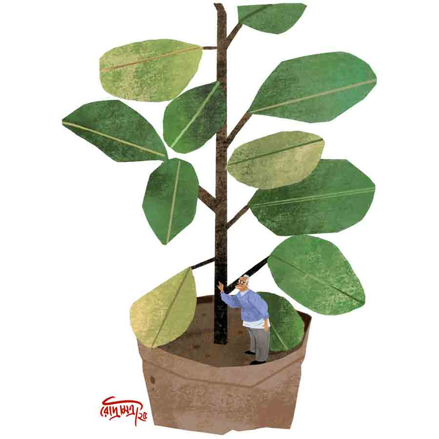

 
 <h1 align=center>গাছবুড়োরা</h1>
<h2 align=center>সোমা কুশারী বন্দ্যোপাধ্যায়</h2> 

সৌরভ বলে রেখেছিল, লোকটা আসবে।

রোববার বেলার দিকে বেল বাজল। দুপুরের খাওয়াদাওয়া তখন সবে শেষ হয়েছে, গ্যাস পরিষ্কার করা, এঁটো বাসন তোলা, সব বাকি। সুধা তাড়াতাড়ি সিঁড়ি বেয়ে নীচে নেমে এল। হ্যাঁ, যা ভেবেছিল তা-ই। এ নিশ্চয়ই সেই! তবে বড্ড বুড়ো মানুষ যে!

সুধা থমকাল। পারবে কি? সৌরভ অবশ্য বলেছিল, লোকটার হাতের কাজ নাকি দারুণ! পয়সার খাঁইও সে রকম নয়। একটা ডাকে চমক ভাঙল, “ভিতরে আসব ম্যাডাম? আমাকে ওই মাতৃ নার্সারি থেকে পাঠাল।”

“হ্যাঁ হ্যাঁ, আসুন।”

ভারী ব্যাগটা নিয়ে সিঁড়ি বেয়ে ধীরপায়ে উপরে উঠে এল লোকটা, ঠিক সুধার পিছন পিছন। সিঁড়ির ল্যান্ডিংয়ে বেশ আলো-আঁধারি, লোকটা থমকাল। অভ্যস্ত পায়ে তেতলায় উঠতে লাগল।

সুধা সামান্য অবাক হল। তেতলার ছাদেই যে সব, লোকটার জানার তো কথা নয়। তবে?

কয়েকটা সিঁড়ি বাকি থাকতে থমকে দাঁড়িয়ে পড়ল বুড়ো। তার পর শীর্ণ হাতে নাকের উপর চশমাটা ঠিক করে বসাল, বুক ভরে শ্বাস নিয়ে বলল, “চলুন।”

সিঁড়িঘরের দরজা খুললেই প্রশস্ত ছাদ। সুধার পিছন পিছন ছাদে উঠে এসে বোধহয় দম নেওয়ার জন্যেই আবারও একটা জোরে শ্বাসনিল বুড়ো।

সুধা এত ক্ষণে ভাল করে লক্ষ করল, মানুষটা বড্ড দুবলা-পাতলা। পরনের প্যান্টটা বেশ ঢলঢলে। ঊর্ধ্বাঙ্গের রংচটা সোয়েটারটাও হাড়-জিরজিরে চেহারায় স্বাস্থ্যের আভাস আনতে পারেনি।

“আপনার গাছেরা তো আমারই মতো, ম্যাডাম। বড্ড বুড়ো হয়ে গেছে দেখছি সব।”

সুধাকে চমকে দিয়ে বুড়ো তত ক্ষণে ছাদের কোণ ঘেঁষে রাখা পর পর সাজানো টবগুলোর কাছেচলে গেছে।

টব বা গাছ কোনওটাই সুধার নয়। সবই এ বাড়ির পূর্বতন মালিক সুবোধ বিশ্বাসের। বাড়ি সমেত এ সব টব হাতবদল হয়ে সুধার দখলে এসেছে। মাস দুয়েক আগেই এ বাড়ি সারিয়ে সুধা আর সৌরভ উঠে এসেছে। এ শহরে এমন একটা বাড়ি যে নেহাত কপালজোরেই জুটে গেছে, এ ব্যাপারে ওরা দু’জনেই একমত।

সুবোধ বিশ্বাসের এই বাড়ি বিক্রি আছে শুনে যে ভাবে পঙ্গপালের মতো অসংখ্য দালাল আর ব্রোকার ঢুকে পড়েছিল, তাতে এ বাড়ি হাতে পাওয়া এক কথায় অসম্ভবই ছিল ওদের পক্ষে। বলা যায় বিড়ালের ভাগ্যে শিকে ছিঁড়েছে এক রকম।

বৃদ্ধ সুবোধ সুধার মধ্যে কী যে দেখলেন! বাড়িটা ওদের দিয়ে দিতে এক কথায় রাজি হয়ে গেলেন। সৌরভ মনে করে, সবটাই ভাগ্য! না হলে এত বড় বাড়ি এমন একটা অবিশ্বাস্য দামে পাওয়া তার মতে ‘জাস্ট নেক্সট টু ইমপসিবল’!

“বলছি ম্যাডাম, ওই বড় চাড়ির গাছগুলো কিন্তু মাটিতে পুঁতলেই ভাল হত, বুঝলেন! এগুলো জমিতে পোঁতারই কথা ছিল।”

সুধার কানে কথাটা কেমন যেন অন্য রকম ঠেকল! ‘কথা ছিল’ মানে? কার কাছে কে কথা দিয়েছিল? সুধা এগিয়ে আসে। ষোলো ইঞ্চির বেশ কয়েকটা টব আছে দেখেছিল বটে এ দিকে, তবে সেগুলো নিয়ে তেমন মাথা ঘামায়নি। এখন কাছে আসতেই টের পেল, প্রায় আধ হাত লম্বা গোটা দুয়েক পেয়ারা সবেদা আর চার-চারটে নারকেল গাছ। বাড়ির পিছনে এত জায়গা থাকতে টবে এ সব গাছ লাগানোর দরকারটাই বা কী ছিল?

সৌরভ বলে রেখেছিল, লোকটা আসবে।

রোববার বেলার দিকে বেল বাজল। দুপুরের খাওয়াদাওয়া তখন সবে শেষ হয়েছে, গ্যাস পরিষ্কার করা, এঁটো বাসন তোলা, সব বাকি। সুধা তাড়াতাড়ি সিঁড়ি বেয়ে নীচে নেমে এল। হ্যাঁ, যা ভেবেছিল তা-ই। এ নিশ্চয়ই সেই! তবে বড্ড বুড়ো মানুষ যে!

সুধা থমকাল। পারবে কি? সৌরভ অবশ্য বলেছিল, লোকটার হাতের কাজ নাকি দারুণ! পয়সার খাঁইও সে রকম নয়। একটা ডাকে চমক ভাঙল, “ভিতরে আসব ম্যাডাম? আমাকে ওই মাতৃ নার্সারি থেকে পাঠাল।”

“হ্যাঁ হ্যাঁ, আসুন।”

ভারী ব্যাগটা নিয়ে সিঁড়ি বেয়ে ধীরপায়ে উপরে উঠে এল লোকটা, ঠিক সুধার পিছন পিছন। সিঁড়ির ল্যান্ডিংয়ে বেশ আলো-আঁধারি, লোকটা থমকাল। অভ্যস্ত পায়ে তেতলায় উঠতে লাগল।

সুধা সামান্য অবাক হল। তেতলার ছাদেই যে সব, লোকটার জানার তো কথা নয়। তবে?

কয়েকটা সিঁড়ি বাকি থাকতে থমকে দাঁড়িয়ে পড়ল বুড়ো। তার পর শীর্ণ হাতে নাকের উপর চশমাটা ঠিক করে বসাল, বুক ভরে শ্বাস নিয়ে বলল, “চলুন।”

সিঁড়িঘরের দরজা খুললেই প্রশস্ত ছাদ। সুধার পিছন পিছন ছাদে উঠে এসে বোধহয় দম নেওয়ার জন্যেই আবারও একটা জোরে শ্বাসনিল বুড়ো।

সুধা এত ক্ষণে ভাল করে লক্ষ করল, মানুষটা বড্ড দুবলা-পাতলা। পরনের প্যান্টটা বেশ ঢলঢলে। ঊর্ধ্বাঙ্গের রংচটা সোয়েটারটাও হাড়-জিরজিরে চেহারায় স্বাস্থ্যের আভাস আনতে পারেনি।

“আপনার গাছেরা তো আমারই মতো, ম্যাডাম। বড্ড বুড়ো হয়ে গেছে দেখছি সব।”

সুধাকে চমকে দিয়ে বুড়ো তত ক্ষণে ছাদের কোণ ঘেঁষে রাখা পর পর সাজানো টবগুলোর কাছেচলে গেছে।

টব বা গাছ কোনওটাই সুধার নয়। সবই এ বাড়ির পূর্বতন মালিক সুবোধ বিশ্বাসের। বাড়ি সমেত এ সব টব হাতবদল হয়ে সুধার দখলে এসেছে। মাস দুয়েক আগেই এ বাড়ি সারিয়ে সুধা আর সৌরভ উঠে এসেছে। এ শহরে এমন একটা বাড়ি যে নেহাত কপালজোরেই জুটে গেছে, এ ব্যাপারে ওরা দু’জনেই একমত।

সুবোধ বিশ্বাসের এই বাড়ি বিক্রি আছে শুনে যে ভাবে পঙ্গপালের মতো অসংখ্য দালাল আর ব্রোকার ঢুকে পড়েছিল, তাতে এ বাড়ি হাতে পাওয়া এক কথায় অসম্ভবই ছিল ওদের পক্ষে। বলা যায় বিড়ালের ভাগ্যে শিকে ছিঁড়েছে এক রকম।

বৃদ্ধ সুবোধ সুধার মধ্যে কী যে দেখলেন! বাড়িটা ওদের দিয়ে দিতে এক কথায় রাজি হয়ে গেলেন। সৌরভ মনে করে, সবটাই ভাগ্য! না হলে এত বড় বাড়ি এমন একটা অবিশ্বাস্য দামে পাওয়া তার মতে ‘জাস্ট নেক্সট টু ইমপসিবল’!

“বলছি ম্যাডাম, ওই বড় চাড়ির গাছগুলো কিন্তু মাটিতে পুঁতলেই ভাল হত, বুঝলেন! এগুলো জমিতে পোঁতারই কথা ছিল।”

সুধার কানে কথাটা কেমন যেন অন্য রকম ঠেকল! ‘কথা ছিল’ মানে? কার কাছে কে কথা দিয়েছিল? সুধা এগিয়ে আসে। ষোলো ইঞ্চির বেশ কয়েকটা টব আছে দেখেছিল বটে এ দিকে, তবে সেগুলো নিয়ে তেমন মাথা ঘামায়নি। এখন কাছে আসতেই টের পেল, প্রায় আধ হাত লম্বা গোটা দুয়েক পেয়ারা সবেদা আর চার-চারটে নারকেল গাছ। বাড়ির পিছনে এত জায়গা থাকতে টবে এ সব গাছ লাগানোর দরকারটাই বা কী ছিল?

“পিছনের জমিতে বসাবেন? হবে? একটা গাছও কিন্তু নষ্ট হলে চলবে না!” জানতে চায় সুধা।

“নষ্ট হবে কেন? আমার কাজ দেখেই তো পয়সা দেবেন। কাজ পছন্দ না হলে একটা পয়সাও দিতে হবে না।”

“না, না, আমি তা বলিনি,” সুধা দ্রুত নিজেকে সামলে নেয়। একে চটালে চলবে না। গাছগুলো যত্নে রাখাই মূল লক্ষ্য।

সুবোধ বিশ্বাস, অশীতিপর অসুস্থ মানুষ হলেও ভিতরে যে কোথাও একটা জোরের জায়গা আছে, প্রথম আলাপেই টের পেয়েছিল সুধা আর সৌরভ। বাড়ি কিনতে চায় জানতে পেরেই প্রথম প্রশ্ন করেছিলেন, “নতুন চাকরি, এত টাকা ইনভেস্ট করাটা কী ঠিক হবে?”

সৌরভ বেশ বিরক্ত হয়েছিল। সুধা বুঝতে পেরেই সামলে নিয়েছিল, খুব মোলায়েম গলায় বলেছিল, “কাকু, দু’জনেই আমরা এ শহরটাকে ভালবেসে ফেলেছি। সেই কলেজ লাইফ থেকে এ শহরে হস্টেলে থেকে কাটিয়েছি। তার পর তো চাকরি, বিয়ে... বুঝতেই পারছেন, আমাদের আলাপটাও এই শহরে পড়তে আসার সূত্রেই, তাই এখানেই একটা মাথা গোঁজার আশ্রয় গড়তে চাই।”

ভদ্রলোক হেসেছিলেন, চকচক করে উঠেছিল ওঁর চোখদুটো। পুরু চশমার তলায় ঈষৎ খয়েরি মণিদুটো কৌতুকেই বোধহয় বিস্ফারিত হয়েছিল। মৃদু কিন্তু স্পষ্ট গলায় বলেছিলেন, “বলো কী! এতগুলো টাকা দিয়ে মাথা গোঁজার ঠাঁই? আমাদের সময় অবশ্য মাস্টাররা এমন কথা বলতে সাত বার ভাবত!”

রাগে গরগর করে উঠেছিল সৌরভ, সেই রাগ ফুটে উঠেছিল তার গলার আওয়াজেও, “আমরা বাড়িটা কিনতে চাই। আপনি বিক্রি করবেন বলে বিজ্ঞাপন দেওয়ার পরই এখানে এসেছি! তাও...”

সৌরভকে কথা শেষ করতে দেননি সুবোধবাবু, হো হো করে হেসে উঠেছিলেন, “মাস্টার বুঝি রাগ করলে? আরে বাবা, আমরা পুরনো দিনের লোক তো! তাই একটু বেশি কথা বলে ফেলি, রাগ কোরো না তাই বলে।”

কাজের মেয়েটি ঠিক সেই মুহূর্তে দু’কাপ চা আর দু’-তিন রকমের বিস্কুট নিয়ে ঢুকছে দেখেই বোধহয় বলেছিলেন, “নাও, চা-টুকু খাও। আজ আমার অর্ধাঙ্গিনী জীবিত থাকলে অবশ্য আতিথেয়তার কোনও ত্রুটি হত না। এই সামান্য চা-বিস্কুটে রেহাই পেতে না তখন।”

সুধাকে সে দিন ঘুরে ঘুরে বাড়ি দেখানোর ফাঁকে ভারী উৎসাহ নিয়ে নিজের গাছের ভান্ডার দেখিয়েছিলেন সুবোধ। ওঁর পরিচয় করানোরভঙ্গি দেখে সুধার মনে হয়েছিল, ভদ্রলোক যেন নিজের পরিবারের সদস্যদের সঙ্গে এক-এক করে পরিচয় করাচ্ছেন।

বটানির ছাত্রী সুধা স্বাভাবিক দক্ষতায় গাছেদের বিষয়ে এটা-সেটা বলতেই সুবোধবাবু বেশ খুশি হয়েছিলেন। সৌরভ অবশ্য বেজার মুখে ঘুরে বেড়াচ্ছিল আর আড়ে আড়ে দেখছিল বাড়ির দেওয়াল, মার্বেলের মেঝের অবস্থা। বাথরুমের ফিটিংসের দুর্দশা দেখে তো সুধার কানের কাছে মুখ নিয়ে বেশ জোরেই বলে ফেলেছিল, “বাড়ির রিপেয়ারিং-এর ধাক্কাটা খেয়াল রেখো!”

সুবোধবাবুর কান এড়ায়নি সে কথা, বলেছিলেন, “হ্যাঁ, ও ব্যাপারটা ভাল করে ভেবে নিয়েই এগোতেহবে তোমাদের।”

সে দিন সুধার মনে কোথায় যেন একটা আশা জেগেছিল, হয়তো বা বাড়িটা উনি ওদেরই দেবেন। সৌরভ অবশ্য জোরগলায় বলেছিল, “ও সব আশা কোরো না। মাত্র ত্রিশ লাখে অত বড় একটা দোতলা বাড়ি? ইমপসিবল! কত দালাল টাকার থলি নিয়ে দু’বেলা ঘুরছে দেখো গিয়ে!”

ফোনটা পেয়ে তাই অবাকই হয়েছিল ওরা। সুবোধবাবুর প্রস্তাবটিও ছিল অভিনব। সুধাকে একাই দেখা করতে বলেছিলেন মানুষটা। সৌরভ অবশ্য প্রথমে গজগজ করেছিল, বিপত্নীক, আবার বয়স্ক! ও সব লোক ভাল হতে পারে না! তবে সুধা যখন জেদ করে স্কুল কামাই করে যাবে বলে তৈরি হচ্ছে, তখন অবশ্য আর আপত্তি করেনি।

সুবোধবাবু অপেক্ষা করছিলেন। সুধা যেতেই সরাসরি বলেছিলেন, “অবাক হয়েছ নিশ্চয়ই, তোমাকে একা আসতে বললাম বলে?”

সুধা হেসেছিল। উত্তর দেয়নি। সুবোধবাবুর সঙ্গে কথা বলে ফিরে সুধা যখন ওঁর সেই অদ্ভুত শর্তের বিষয়ে জানিয়েছিল, সৌরভ কেন যেন তৎক্ষণাৎ কোনও জবাব দিতে পারেনি। দু’জনের মাথায় তখন একটাই চিন্তা— এত তাড়াতাড়ি এতগুলো টাকা জোগাড় হবে কী করে? ব্যাঙ্ক লোনের ভরসায় এগোলেও, তাতে যে সবটুকু কুলোবে না, প্রথমে খেয়ালই হয়নি।

আবার ছুটেছিল সুধা। রাজি হয়েছিলেন সুবোধ, অর্ধেক টাকা ছ’মাস পরে নেবেন বলেছিলেন। শুধু বার বার ওর শর্তের কথাটা মনে করিয়ে দিয়েছিলেন।

সুবোধবাবুর সব গুছিয়ে নিয়ে উঠে যেতে সপ্তাহ দুয়েক লেগেছিল। ভদ্রলোক বেঙ্গালুরুর একটি অভিজাত বৃদ্ধাশ্রমে চলে যাচ্ছেন জেনে সুধার ভারী কৌতূহল হয়েছিল। খুঁটিয়ে খুঁটিয়ে সব জেনে নিয়ে সৌরভকে বলেছিল, “আমরাও বয়স হলে এমন একটা বৃদ্ধাবাসে উঠে যাবো। জানো, এই কনসেপ্টটা ভেরি রিসেন্ট লঞ্চ হয়েছে। আমাদের কলকাতায় তেমন ভাবে ডেভলপ না করলেও বেঙ্গালুরু-চেন্নাইতে...”

কথা শেষ করতে দেয়নি সৌরভ, বলেছে, “ছাড়ো তো বুড়ো ভামের কথা! এক কালে নামকরা কোম্পানির জিএম ছিল, টাকার অভাব নেই। ছেলেপিলেও তো নেই দেখছ, এখন বৌও মরেছে, তাই ও লোক অমন দামি জায়গায় বাকি জীবন আয়েশ করতে ছুটছে, ওর আর...”

সুধার আর শুনতে ইচ্ছে হয়নি। কোথায় যেন একটু মায়া পড়ে গেছে ভদ্রলোকের উপর। চাবি হ্যান্ডওভারের দিন যে ভাবে হাতদুটো ধরে অনুরোধ করেছিলেন...

প্রথম দু’মাস তো বাড়ি-ঘর টুকটাক রিপেয়ারিং করাতেই বেরিয়ে গেল। তার পর খেয়াল পড়ল, সুবোধবাবুর শর্তমাফিক দিন এগিয়ে আসছে। ছ’মাস পরেই উনি এক ভাইপোর কাছে কলকাতায় আসবেন কথা আছে, তখনই বাকি টাকা আর শর্তমাফিক এ বাড়ি ঘুরে যাবেন।

“দিদিমণি, বাগানের পাঁচিল ঘেঁষে সুপুরিগুলো লাগিয়ে ফেলি?” মানুষটার কথায় চটকা ভাঙে সুধার। বলে, “হ্যাঁ, লাগান। তবে দেখবেন যেন গাছগুলো সব বেঁচে থাকে। আমি এক জনকে কথা দিয়েছি...”

বয়স্ক মানুষটা মৃদু হাসেন, “উনি যেমনটা পছন্দ করেন, আমি তেমনটাই করব। কোনও চিন্তানেই আপনার।”

চমকে ওঠে সুধা, “কার কথা বলছেন আপনি?”

“কেন, এ বাড়ির আগের মালিকের কথা!

“আপনি ওকে চেনেন নাকি?” অবাক হয় সুধা। অভ্যস্ত হাতে টবের মাটি ভাঙতে ভাঙতে বুড়ো মানুষটা কি মৃদু হাসলেন! ঠিক বুঝে উঠতে পারল না সুধা। ছাদের কোণে ট্যাঙ্কের গায়ে কল থেকে ছোট বালতিতে জল ভরে মাপমতো গাছের গোড়া ভেজাতে ভেজাতে সুধাকে অবাক করে উনি মুখ খুললেন, “সুবুবাবু আর সন্ধ্যাদি আমার বহুকালের পরিচিত। দিদির বাবার বাড়ি ছিল আমাদের গ্রামেই, সেই ন্যাজাট পেরিয়ে ভুতোখালি। বলতে পারেন, দিদিমণিই আমায় এ লাইনে এনেছিল। বিয়ের অনেক বছর পরেও যখন ছেলেপুলে হল না, দিদিমণি তখন এই গাছ নিয়ে পড়ল। বড় শখ ছিল মানুষটার গাছের, ভাইদের সঙ্গে খুটোমুটি লাগতে আমি যখন গ্রাম ছাড়লাম, দিদিমণি আমাকে এ শহরে নিয়ে এল। বলল, ‘চাষিঘরের ছেলে তুই, গাছের মর্ম বুঝবি না? এ শহরে এখনও অনেক সবুজ। এ কাজে লেগে পড় ভাই! দেখিস, ভাতে মরবি না!’ সত্যি বলতে ওই ভরসাতেই কেটে গেল আজ পঁয়ত্রিশ বছর...”

“সুবোধবাবুই কি আপনাকে আমাদের কথা বলেছেন? তাই কি মাতৃ নার্সারি আমার হাজ়ব্যান্ডকে আপনার কথা বলেছিল?”

উপর-নীচে মাথা নাড়েন বৃদ্ধ।

“আসলে, দিদিমণি অসময়ে চলে যেতে দাদা বড্ড দুর্বল হয়ে পড়েছেন। আপনাকে ভরসা করে বাড়ি দিয়েছেন সত্যি, কিন্তু পুরোপুরি বিশ্বাস করতে পারেননি ওই গাছেদের ব্যাপারে। তিন মাসের সময়সীমাও ওই জন্যই দেওয়া। আমাকে বলেছিলেন, ‘গাছেদের যদি কোনও রকম অযত্ন হয়, সন্ধ্যা আমাকে ছাড়বে না রে পিন্টু!’ তার পর যখন আপনারা বাড়ি কিনবেন বলে গেলেন, সে দিন দাদা আমাকে ডেকে পাঠিয়েছিলেন। বললেন, ‘মেয়েটাকে দেখে ভরসা হচ্ছে রে পিন্টু! বুঝিয়ে বললে, ও ঠিক সন্ধ্যার গাছেদের যত্ন করবে।’”

সুধা আর একটি কথাও বলতে পারেনি। কেমন আশ্চর্য লেগেছিল গাছেদের নিয়ে দুই অশীতিপর বৃদ্ধের এমন পাগলামি দেখে। শুধুই কি প্রিয়জনের স্মৃতিরক্ষার তাগিদ? না কি এও গাছ-সন্তানদের মধ্যে নিজের অস্তিত্ব টিকিয়ে রাখার একধরনের চেষ্টা?

শীতের দুপুর উলের নরম গোলার মতো গড়াতে গড়াতে বিকেলের কোলে ওম পোহাচ্ছে। সুধা ছাদের আলসেতে থুতনি ঠেকিয়ে পিছনের জমিটার দিকে একদৃষ্টে তাকিয়ে আছে। বৃদ্ধ মানুষটি এখনও খুরপি আর নিড়ানি নিয়ে একমনে কাজ করে চলেছে। বিরক্ত সৌরভ বারকয়েক সুধাকে ডেকে ডেকে ক্লান্ত হয়ে নীচে চলে গেছে। ওই বুড়োর কাজ কী যে এত মন দিয়ে দেখছে মেয়েটা, ভগাই জানে! এত গাছপ্রীতিই বা কবে গজাল রে বাবা! অন্যমনস্ক হাতে টিভির চ্যানেল পাল্টাতে পাল্টাতে সৌরভ ভাবছিল।

আগাছা আর অবাঞ্ছিত চারার ধাক্কা কাটিয়ে টবের গাছগুলো কি বেশ একটু সতেজ হয়ে উঠেছে? একটু আগে তিন-চার রকমের কাগজের ঠোঙা থেকে হাতের আন্দাজে একটু একটু করে নানা রকমের গুঁড়ো মিশিয়ে গাছের গোড়ায় ছড়িয়ে দিতে দিতে বুড়ো মানুষটিকে বিড়বিড় করতে দেখেছে সুধা। মানুষটা আপনমনে বলছেন, “আর ভয় নেই তোদের! সে জন গেছে জানি, কিন্তু এই দিদিও তোদের যত্নে রাখবে দেখিস! দাদা আমার মানুষ চেনে।”

মজুরির সামান্য টাকাক’টা পকেটে ঢুকিয়ে চলে যাওয়ার আগে মানুষটা যখন হাতজোড় করে নমস্কার করলেন, সুধার কেন যেন ভীষণ কৃতজ্ঞ আর নিশ্চিন্ত লাগছিল।

“আবার কবে আসবেন? ওদের ভালমন্দের বিষয়টা তো আপনাকেই দেখতে হবে।”

বুড়োর চোখে কি দপ করে খুশির আলো জ্বলে উঠল? ঠিক বুঝতে পারল না সুধা, শুধু শুনতে পেল, “ঠিক পনেরো দিন পরেই আমি আসব। ওই রোববার হলেই তো আপনার সুবিধে? সুবুদাদা আমাকে সব বুঝিয়ে বলেছেন। শুধু আপনি মাটির হালচাল বুঝে জলটুকু দেবেন দিদি! তেষ্টা পেলে ওরা যে মুখ ফুটে বলতে পারে না...”

(এই প্রতিবেদনটি আনন্দবাজার পত্রিকার মুদ্রিত সংস্করণ থেকে নেওয়া হয়েছে)

