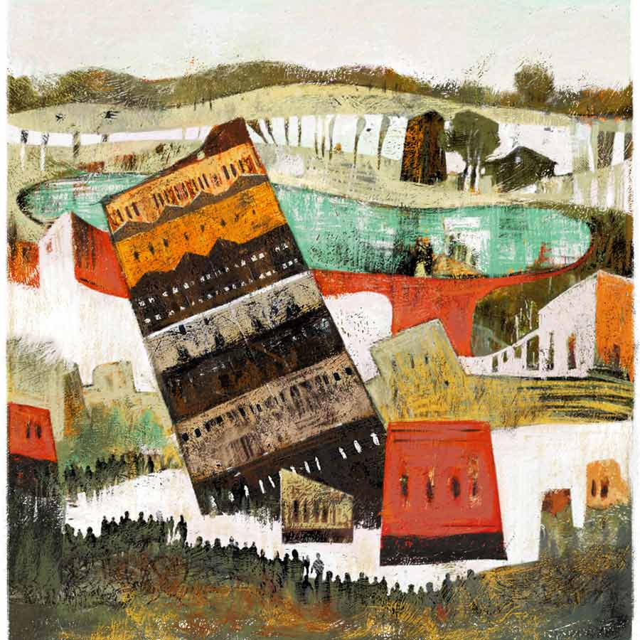

 
 <h1 align=center>ঘর</h1>
<h2 align=center>শাশ্বতী নন্দী</h2> 

দুপুর গড়িয়ে বিকেল। পুরসভার যান্ত্রিক মইয়ে বিপর্যয় মোকাবিলা বাহিনী। ভাঙছে হেলে পড়া বাড়ির কার্নিস। চার পাশে গার্ডরেল, তবু বাসিন্দাদের কারও কারও ভিতরে ঢোকার জন্য আকুলি-বিকুলি।

ও দিকে শহর থেকে দূরে লোকচক্ষুর আড়ালে বসে আছে লক্ষ্মণ পাল। গা-ঢাকা দিয়ে। তাকে এখন মাসখানেক আন্ডারগ্রাউন্ড হয়ে যেতে হবে। হঠাৎ মোবাইল বেজে উঠল। মনে দোলাচল, ধরবে কি লাইনটা? কিন্তু যদি কোনও গোপন খবর থাকে!

“হ্যালো!” লক্ষ্মণের কাঁপা গলা।

“লক্কাদা, আমি বিশ্বনাথ। তোমার শ্বশুরবাড়ির পড়শি, নেক্সট ডোর নেবার।”

“আপদ, ফোন করেছিস কেন? আর লক্ষ্মণদা ছেড়ে আমাকে লক্কাদা বলে ডাকছিস যে!”

“লক্ষ্মণ নামটা যে তোমার সঙ্গে যায় না। নিজের দাদার যা হাল করলে, বেচারা এখন জেলে পচছে।”

“হারামজাদা! ফোন রাখ।”

“সামনে কিন্তু তোমার বিরাট বিপদ, লক্কাদা।”

“চমকাচ্ছিস নাকি!”

“আরে না। আচ্ছা লক্কাদা, প্রোমোটার হিসেবে তোমার দাদার নাম থাকলেও, তুমিই তো দু’নম্বরি কাজগুলোর কারিগর ছিলে, তাই না? পুরনো বাড়ির মালিকদের বুঝিয়ে-সুজিয়ে জমি হাতিয়ে নেওয়া, একেবারেই অনাগ্রহী হলে তোমার চমকা-বাহিনীকে কাজে লাগানো, ডোবা বুজিয়ে চারতলা বাড়ির প্ল্যান স্যাংশনের জন্য মুঠো মুঠো ঘুষ দেওয়া, সব…”

“অ্যাই শা…”

“আর এগিয়ো না। ওই শা-তেই থাকো। তবে যা-ই বলো, সবচেয়ে খারাপ করলে তোমার ভালমানুষ শ্বশুরের সঙ্গে। বেচারার স্ট্রোক হয়ে গেল, যে দিন জানতে পারলেন তাঁর বাড়িটা হেলে পড়ছে, যে কোনও মুহূর্তে ধস নামবে। আচ্ছা লক্কাদা, কত ডিগ্রি হেলেছে গো? ইটালির লিনিং টাওয়ার তো প্রায় ৪ ডিগ্রি হেলে আছে। আমি তো সিভিল ইঞ্জিনিয়ারিংয়ের স্টুডেন্ট, জানি।”

“বিশু, ফোন ছাড়।”

“আরে পুরোটা শোনো, শেষে টুইস্ট আছে। আমি আগেই আঁচ করেছিলাম তোমার শ্বশুরবাড়িটা হেলছে। রোজ ছাদে উঠে ওই বাড়িটাকে ছোঁয়ার চেষ্টা করি তো। হাসছ কেন, সত্যি! আমার এক্স-প্রেমিকা, রুনু তো ওই বাড়ির মেয়ে! যাকে তুমি হাইজ্যাক করে বিয়ে করে ফেললে। মাঝে মাঝে ওকে একটু স্পর্শ করতে ইচ্ছে করে, জানো। তখনই ওই বাড়িটা ছুঁই। ক্রমে বুঝতে পারছিলাম, রুনু একটু একটু করে আমার কাছে সরে আসছে। মানে বাড়িটা হেলছে। হয়তো কাকতালীয়।”

“হারামজাদা, রুনু তোর দিকে হেলছে!”

“আরে রাগছ কেন? রুনুর কায়াটা আছে তোমার কাছে, হৃদয় উড়ে গেছে। মেয়েদের হৃদয়, পাখির ডানার মতো। কখন কোথায় উড়ে যায়।”

“চোপরাও...”

“লাস্ট কথা একটা আছে। তোমার শ্বশুরের ওই সাতমহলা বাড়ি আর পুকুরটা হাতিয়ে আজকের এই ধসা বাড়ি উপহার দিলে!

“হুঁ, সাতমহলা নামেই, ছিল তো শুধু ইটের পাঁজর। চুন, সুরকি, বালির আস্তরণ কোথাও নেই। ফ্রেম-ভাঙা জানলা, কোথাও আগাছা চিরে দিয়েছে দেওয়ালের শরীর…”

“এক্সেলেন্ট বিবরণ দিচ্ছ লক্কাদা! বাংলায় কী দখল! শোন, তুমি যেমন খারাপেও সেরা, চাইলে ভালতেও সেরার সেরা হতে পারবে। আর কথায় আছে, ভোগের পরেই ত্যাগ আসে। এ জীবনে অনেক তো ভোগ হল লক্কাদা, এ বার…”

“ধর্মশাস্ত্র কপচাচ্ছিস নাকি রে ঘাটের মড়া?”

“মড়া নই, জ্যান্ত। এখনও। এই মুহূর্তে আমি মরলে তোমারই ক্ষতি। এক কাজ করি, দাঁড়াও, এই কলটা কেটে তোমায় একটা ভিডিয়ো কল করি।”

ঠিক দু’মিনিটেই লক্ষ্মণের মোবাইলে ভিডিয়ো কল ঢোকে।

“হ্যালো, লক্কাদা?”

“তুই কোথায় রে? উফ্‌ কী শব্দ!”

“হ্যাঁ, হাতুড়ির ঘা পড়ছে রুনুদের ওই হেলা বাড়িতে। জানো, এই ছেনি হাতুড়ির প্রত্যেকটা ঘা ভেঙে ফেলছে এই বাড়ির মানুষগুলোর বুক। কী ভাবে যে রাস্তায় দাঁড়িয়ে ওরা কাঁদছে, তুমি যদি দেখতে... আর দেখবেই বা কী করে... দেখবে না বলেই তো টাইম বুঝে সটকেছ!”

“সর্বনাশ! তুই কি ওই বাড়িতে ঢুকেছিস? পুরসভার লোক আটকায়নি?”

“পিছনের সিঁড়ি দিয়ে উঠেছি। দাঁড়াও, ক্যামেরাটা নিজের দিকে ফোকাস করি। তবে আমায় দেখে যেন চমকে যেয়ো না।”

“বিশু-উ-উ! তোর কোলে আমার কুশ, না? অ্যাই শালা, তুই কি আমার ছেলেকে ওই বিপজ্জনক বাড়িতে নিয়ে গিয়ে… নেমে আয় বলছি। আমাকে ব্ল্যাকমেল করে পার পাবি না কিন্তু... ”

“এখনও ভয় দেখাচ্ছ, লক্কাদা?”

“না না, শোন, কুশ আমার বুকের পাঁজর। ওকে ছাড়া আমি বাঁচব না। নিয়ে আয় ওকে।”

“লক্কাদা, তুমি কি ভয় পেয়েছ? গলাটা কেমন শোনাচ্ছে! কাঁদছ নাকি? কাঁদো, কাঁদো। চোখের জল তোমাকে শুদ্ধ করবে।”

“বিশু, তুই ওই শিশুটার ক্ষতি করে আমায় শাস্তি দিতে পারিস না!”

“উঁহু, ভুল বুঝছ! তোমার ব্র্যান্ড আর আমার ব্র্যান্ড এক নয়। কুশকে আমি বাঁচাতে এসেছি। দাদুর ঘরে নাকি ওর ব্যাটম্যান আর কী সব খেলনা ছিল। সকলের চোখের আড়ালে কী ভাবে যেন পুঁচকেটা ঢুকে পড়েছে বিল্ডিংয়ে। আমি নিজের বাড়ির ছাদে ঘুরতে ঘুরতে হঠাৎ দেখি ওকে। দু’জনের চোখাচোখি হতেই সে ছেলের হাপুস কান্না আর আবদার, ‘ব্যাটম্যানকে খুঁজে দাও।’ এ বার কী করি বলো?”

“বিশু, যে কোনও মুহূর্তে দেওয়াল ভেঙে পড়বে। নেমে আয় প্লিজ়, প্লিজ়...”

“একটু অপেক্ষা করো লক্কাদা। কুশকে কোলে নিয়ে প্রাণটা জুড়িয়ে যাচ্ছে। এ রকম একটা স্বপ্ন তো আমিও দেখেছিলাম। রুনু, আমি আর আমাদের সন্তানকে ঘিরে একটা বৃত্ত। তবে মন বলছে, ছেলেকে খুঁজতে খুঁজতে রুনুও এখানে এল বলে। আমি বাতাবিলেবু-ফুলের গন্ধ পাচ্ছি, রুনুর গায়ে এই গন্ধটা পেতাম।”

“বিশু, কুশকে ফিরিয়ে দে। ও আমার সব। বদলে কী চাস বল? টাকা? দেব, অনেক টাকা...”

“দূর, টাকা ফালতু জিনিস। অন্য কিছু ভাবি দাঁড়াও। আরে দুশ্চিন্তা কোরো না। তোমার সাধ্যের মধ্যেই চাইব। আমি ভাঙা ঘর সহ্য করতে পারি না, আমি ঘর গড়ায় বিশ্বাসী। শোনো, কুশের দিকে তাকিয়ে একটা শপথ নিতে পারবে? যারা আজ বেঘর হল, তাদের প্রত্যেককে আবার ঘর ফিরিয়ে দেবে তুমি। ও মা, বলেছিলাম না, বাতাবি ফুলের গন্ধ পাচ্ছি। কুশকে না পেয়ে রুনুও কাঁদতে কাঁদতে এখানে এসে হাজির হয়েছে দেখো। এখন আমরা তিন জন। ভয় পেয়ো না, ওই বৃত্তটা আঁকব না। তোমার চোখে কি এখনও জল, মুছে নাও শিগগির। পাথরেও ফুল ফোটে! শপথটা নাও দাদা! তুমি পারবে রাখতে। তোমার বুকে এখনও ভালবাসার নদীটা বইছে। টলটল করছে স্রোত। আমি নেমে আসছি, তোমার ঘরে ওদের ফিরিয়ে দিতে।”

