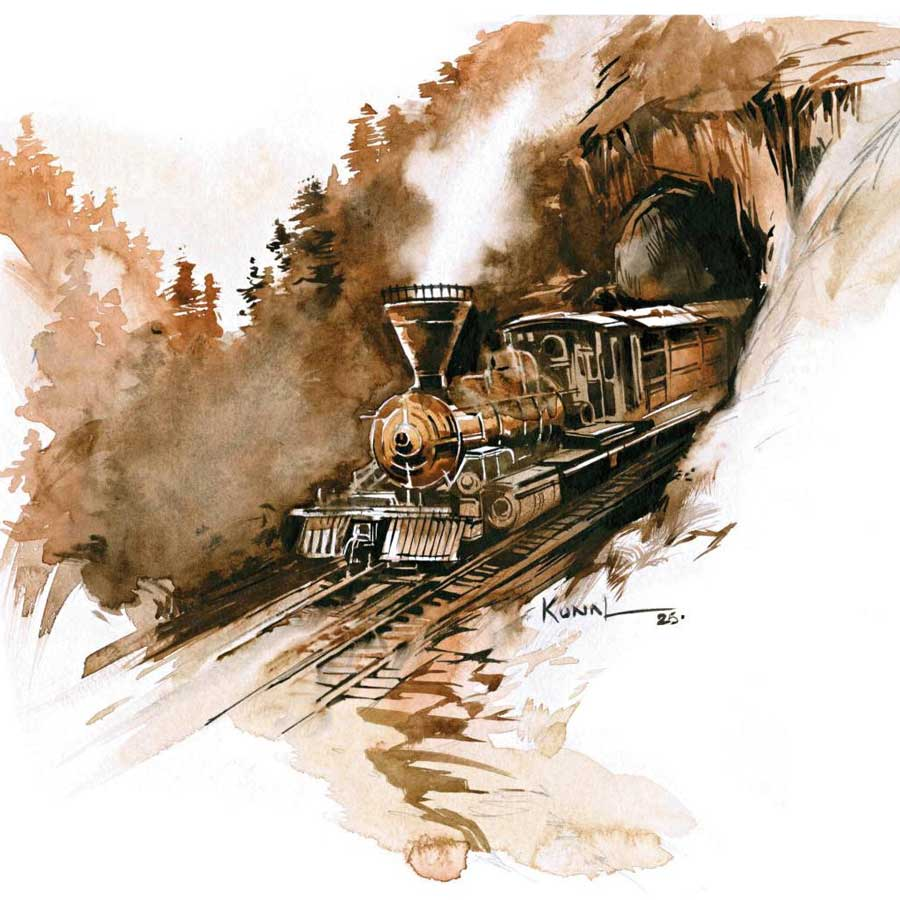

 
 <h1 align=center>ঘুম</h1>
<h2 align=center>সেবন্তী ঘোষ</h2> 

গোলাপের মতো দেখতে সাদা গোলাপি অ্যাজেলিয়া ঘেরা বারান্দা পেরিয়ে বরফ পাহাড়ের চূড়াগুলি যেন একেবারে হাতের কাছেই ঝলমল করছে। ঝকঝকে রেল স্টেশনের দোতলায় কোয়ার্টারের কাচের শার্সি থেকে ভারী পর্দা সরিয়ে দিচ্ছিল সরোজিনী। সুমথ তাকে এক হাতে কাছে টানে।

ছদ্ম-অভিমানে ঠোঁট ফোলায় সরোজিনী। বলে, “ছাড়েন তো, আপনার সব সোহাগ ওই রিকি সাহেবের ঘোড়ার সঙ্গে আর ঢং ঢং ঘণ্টায়, এক মুহূর্ত দাঁড়াতে পারেন না।”

সুমথ উত্তর না দিয়ে সরোজিনীর হাতে বোনা বেগনি রঙা সোয়েটারের প্রথম বোতামটি খুলে মুখ ডুবিয়ে গভীর শ্বাস নেয়।

সরোজিনী তাকে ঠেলে সরানোর চেষ্টা করতেই দরজা ঠেলে তনয় প্রবেশ করে। বলে, “বাবা, আপনারে নীচের লাইনম্যান ডাকতিছে। কোথায় যেন বাঘে খেয়েছে কারে, ভালুও বেরিয়েছে।”

তড়িঘড়ি নিজেকে সামলে নেয় সরোজিনী। মুহূর্তে সুমথ যেন অন্য পুরুষ। ত্রস্ত ভাবে ধুতির উপর কালো কোট, মাফলার আর খাকি মোজা ঠিক করে ঘর থেকে বেরোয়। এই হয়েছে বিপদ! হয় ধস নামে, না হয় বাঘ-ভাল্লুক বেরিয়ে কুলিদের আক্রমণ করে। এ ভাবে চললে রেলে চড়া তো দূরস্থান, রক্ষণাবেক্ষণের মানুষ পাওয়া দুষ্কর হবে।

চা-করদের হিল স্টেশনে বাঙালি বাবুরা প্রথম থেকে হাজির হলেও রেললাইন পাতার পর সংখ্যাটা বাড়ল। মামাতো, পিসতুতো ভাই দেশ-গাঁয়ে জ্ঞাতিশত্রুতায় অস্থির হয়ে ঘুরতে ঘুরতে কার্শিয়াঙে চলে এল। শ’সাহেব বললেন, “পরের বছর এসো। কাজ পাবে। হিল কার্ট রোড ভাল ভাবে তৈরি হচ্ছে, রেললাইনেও শিলিগুড়ি থেকে ঘুম হয়ে একেবারে দার্জিলিং ছুঁয়ে ফেলবে।”

যে কথা সেই কাজ। দু’-তিন বছর কাজ শিখেই ভাগ্যান্বেষী সুমথ হয়ে গেল পৃথিবীর সর্বোচ্চ রেলস্টেশন ঘুমের প্রথম ভারতীয় স্টেশন মাস্টার। তার মামাতো দাদা প্রতাপের গল্পটা অবশ্য গড়িয়ে গেল দার্জিলিঙে বোর্ডিং হাউস ব্যবসার দিকে। নতুন স্থাপনার কাজে মানুষকে চব্বিশ ঘণ্টাই মাথা গুঁজে রাখতে হয়। তারও হয়েছে এই দশা। সে গ্রামে যাওয়ার সময় পায় না। প্রতাপ তার মতো সরকারের দাস নয়। নিজের ইচ্ছেমতো ভ্রমণ করতে পারে।

তার সর্বক্ষণের সঙ্গী সাইলা এসে গরম চা আর বিস্কুট এনে রাখে। সাইলা বলে, “সব ঠিক আছে, ধসে লাইন চালু হয়েছে কিন্তু পাগলাঝোরার ওখানে রাস্তায় জল আসা বন্ধ হচ্ছে না।”

সুমথ চিন্তিত মুখে বলে, “দার্জিলিং থেকে সার্ভেয়ার সাহেবের সঙ্গে সুপারও আসবেন। দেখি ওঁরা মাটির তলায় টানেল করতে বলেন কি না।”

বই পড়ার অভ্যাস তৈরি হয়েছে তার। সাহেবরা খুবই পড়ুয়া। তাদের পড়া বইগুলি ক্লাবে ক্লাবে দিয়ে যায়। পৃথিবীর ইতিহাসে বিপ্লবের গল্পগুলিতে সে উত্তেজিত বোধ করে। কাজ করতে এসে বুঝেছে সব ইংরেজ মোটেই মন্দ নয়। তবে নিজেদের স্বার্থে সেয়ানা। কেবল সাদা চামড়ার সূত্রে উপরওয়ালা হয়ে যায় তারা। এ সময় পরাধীনতার জ্বালা শীতের ত্বকে ফাটল ধরানোর মতো চিড়বিড় করে। শ’সাহেব সে দিন বলেছেন, তাঁরা, স্কটিশরাও ইংরেজদের মন থেকে পছন্দ করেন না।

সাত-পাঁচ ভাবতে ভাবতে ঢং ঢং ঘণ্টা পড়ে। কাঠের কামরা ঢকঢক করে হেলিয়ে দুলিয়ে কয়লার ধোঁয়া উগরে একটু পরেই উঠে আসে। তাদের স্বপ্নের ডিএইচআর বা দার্জিলিং হিমালয়ান রেলওয়ের খেলনা ট্রেন। ট্রেন চলে গেলে দেখে, প্ল্যাটফর্মের এক প্রান্ত থেকে তারই মতো পরিচ্ছদের এক উজ্জ্বল চোখের যুবক তার দিকেই হেঁটে আসছে।

*****

চৌরাস্তা এই সময় ঝলমলে উৎসবের মতো দেখায়। চিত্রবিচিত্র লেস আর ক্রুশের কাজ করা গাউন কার্ডিগান টুপি পরা ফ্যাকাসে বর্ণের নারীরা নিচু স্বরে গল্পগুজব করে। দেশীয় মানুষরা পারতপক্ষে ওই সব পথ মাড়ায় না।

পোস্ট-অফিসে এক মিনিটও দেরিতে পৌঁছয় না হরলাল চাকী। এমন বিদেশ-বিভুঁইয়ে নির্বাসনের চাকরি নিয়ে সে চলে আসার সময় মা-পিসি কেঁদে ফেলেছিল। কিন্তু তার এই চাকরি নেওয়া ছাড়া উপায় ছিল না। বারাসত, কলকাতায় তার চাকরি পাওয়ার উপায় নেই। যেখানে কেউ মরতে আসবে না সেখানেই কাজ পেতে পারে সে। হরলাল তাই তার নিয়মানুবর্তিতার উপরেও কঠোর ভাবে নিজের কাজ করে। কিন্তু তাতেই বিপদ বাধল আজ। পোস্টমাস্টার শীতের ছুটিতে বাড়ি গেছে। একাই সব দায়িত্ব সামলাতে হচ্ছে তাকে। শেষ পর্বে যখন কাউন্টারের শাটার নেমে গেছে প্রায়, তখনই এক লালমুখো এসে হাজির। তার চাই পোস্টকার্ড আর টিকিট। হরলাল ঘড়িতে দেখেছে চারটে তিন। ব্যস, কাউন্টারের শাটার আর তোলেনি কিছুতেই। সাহেবের জাঁদরেল মুখ বন্ধ কাউন্টারের ও পারে মিলিয়ে গেছে। কাজের চাপে তখন সে হিমশিম।

হিসেব মেলানোর পর সব গুছিয়ে তালা দিয়ে যখন সে পথে নামে, ঝিরঝির বৃষ্টি শুরু হয়েছে। হঠাৎ বিদ্যুৎ চমকের মতো মনে হয়, এই রে, সাহেব আবার কোনও কেউকেটা নয় তো? মনে হচ্ছে যেন কাঁধের উপর তারা চিহ্ন ছিল! সর্বনাশ! সে তার বোর্ডিং হাউসে আরও দ্রুত ছোটে। দার্জিলিং আসা ইস্তক বাঙালি সমাজের পরিত্রাতা হিসেবে বোর্ডিং মালিক প্রতাপ মুস্তাফির নাম শুনেছে। তিনিই হয়তো তাকে বাঁচাতে পারবেন।

*****

ট্রেন ছেড়ে যাওয়ার পর কিছু হিসাবের কাজকর্ম থাকে। সুমথ কাজ সারতে সারতে তার সামনে উপবিষ্ট ছেলেটিকে দেখে নিয়েছে। যুবকবয়স, কিন্তু মাফলারটি বয়স্কদের মতো মুখ পেঁচিয়ে ভাল ভাবে বাঁধা। পায়ে গামবুট। গায়ের ওভারকোটটির স্থূলতা বিষয়ে কার্পণ্য নেই। অর্থাৎ ছেলেটি দু’দিনের শখের চাকরি নয়, স্থায়ী ভাবে কাজটি করতে এসেছে। মনে মনে খুশি হয় সে। বঙ্গযুবকদের সুখী ভাব তার পছন্দ নয়। বলে, “ফিরতি ট্রেনে যেতে হবে আপনাকে। আমার বাসায় খাবারের কথা বলে দিচ্ছি। বলুন কী সমস্যা হয়েছে?”

হরলাল পকেট থেকে এক টুকরো কাগজ এগিয়ে দেয়। প্রতাপের চিঠি। তার বোর্ডিং হাউসে থাকা ছেলেটিকে যেন সে যথাসম্ভব সাহায্য করে। চিঠিটি খুব সাবধানে পকেটে রাখে সুমথ। প্রতাপের চিঠিতে বিশদ কিছু লেখা নেই। হরলাল সাহেবের সঙ্গে তার পোস্ট-অফিসের ঘটনাটি জানায়।

কপালে ভাঁজ ফেলে সুমথ পুরোটা শোনে। বলে, “কী করে জানলেন আমার কাছে এলে এ বিপদ থেকে উদ্ধার পাবেন? জলে বাস করে কুমিরের সঙ্গে কেউ বিবাদ বাধায়? আমি এক জন সাধারণ দেশীয় স্টেশন মাস্টার।”

হরলালের চোখ যেন মর্মভেদী। সে মাথা নেড়ে বলে, “প্রতাপবাবু বললেন, সুপারিন্টেন্ডেন্ট সাহেব আপনার বন্ধু। আর আমি শুনলাম এ দিকে রেললাইনে কিছু সমস্যা হয়েছে, ফলে আগামী কাল সুপার সাহেব আসবেনই, আর এলে আপনার সঙ্গে দেখা না করে তো যাবেন না।”

সুমথ হরলালের চোখে চোখ রেখে বলে, “আপনার তো দেখছি গোয়েন্দা বা বিপ্লবীদের মতো বিশ্লেষণ ক্ষমতা। খুব সাবধানে থাকবেন। ইংরেজদের অধীনে কাজ পাওয়া যদি বা সহজ, কিন্তু আবার একটু সন্দেহের বশে কাজ চলে যায়, চাই কি প্রাণও যেতে পারে।”

হরলাল চোখ নামায় না। স্বগতোক্তির ঢঙে বলে, “তা আমার চেয়ে ভাল আর কে জানে!বহু কষ্টে এই চাকরি জোগাড় করেছি। বাড়িতে আমার উপর নির্ভরশীল চার-পাঁচ জন। এখন আপনার বিবেচনা।”

সাইলাকে ডাকে সুমথ। হরলালকে খাইয়ে দেওয়ার ব্যবস্থা করতে বলে। বলে, “আপনি কাগজে নাম-ঠিকানা, পরিষ্কার করে লিখে দিয়ে যান।দ্রুত বেরোবেন। পরের গাড়ি চলে গেলে ঘোড়ায় যেতে হবে।”

হরলালের চোখ ঈষৎ ভিজে আসে যেন। নমস্কার করে সাইলা দাজুর সঙ্গে বেরিয়ে যায় সে।

সুমথ হরলালের হাতের লেখা দেখে। শিক্ষিত বাঙালি ছেলের বাড়িতে যেমন হাতের লেখার উপর জোর দেওয়া হয়, এর তেমন নেই। অর্থাৎ বাবা-ঠাকুরদা পড়াশোনা জানা পরিবারের নয়। চেহারাটি বেশ শক্তপোক্ত, বড়সড়। হরলাল চাকী। চাকী পদবিটা খুব কম শোনা যায়। শোনা-শোনা লাগছে বোধহয় এই কারণেই।

ফিরতি ট্রেন এলে হরলালকে দেখতে পায় না সুমথ। শিলিগুড়ি থেকে প্রচুর মালপত্র উপরে ওঠে। কার্শিয়াঙের ক্লাব থেকে সোডার বোতল উঠেছে ক্রেট ক্রেট। এমনকি নিজের কফিন অবধি উপরে নিয়ে যাচ্ছে এক বিষণ্ণ সদ্য-চাকুরে সাহেব! সোডা দেখে দীর্ঘশ্বাস ছাড়ল সুমথ। এই হাড় কাঁপানো ঠান্ডায়ও সরোজিনী তার ব্র্যান্ডি পান করা পছন্দ করে না। ভরসা এখন হরলালের বলা ওই রিকি সাহেব, রিকি ম্যাকগিল। শ’সাহেবের মতো আর এক তরুণ স্কটিশ। অল্প ক’দিন এসেছেন দার্জিলিঙে। তাতেই সুমথর জ্ঞানস্পৃহা, বিশেষত বিপ্লবের প্রতি আকর্ষণ, কাজ চালানোর মতো ইংরেজি, সর্বোপরি উদাস কুসংস্কারহীন মন তাঁকে আকৃষ্ট করেছে। না হলে দার্জিলিঙের সুপারিন্টেনডেন্টের সঙ্গে তার খাতির কানে কানে এমন ভাবে ছড়িয়ে পড়ত না। এ সব মনে পড়তেই চনমন করে উঠল সে। হরলালের কথাই ঠিক। কাল সাহেব আসছেন।

*****

ম্যাকের সঙ্গে দু’পাত্তর নিয়ে বসে পাগলাঝোরার তলায় টানেলের কথা ইত্যাদি সারে সুমথ। সহজে সমানে সমানে কথা বলে না। তাঁর কোনও বেফাঁস কথায় এক মুহূর্তে ম্যাকগিল ভুলে যাবে, সেও ইংরেজদের দ্বারা অত্যাচারিত স্কটিশ।

ইতস্তত করে সুমথ বলে, “আমার একটি ভাইয়ের মতো ছেলে দার্জিলিঙে চাকরি নিয়ে এসেছে। পোস্ট-অফিসে সহকারী হয়ে। স্থায়ী চাকরি নয় এখনও।”

ম্যাকগিল ব্র্যান্ডিতে চুমুক দেয়, বলে, “হুঁ।”

সুমথ বলে, “বেচারা একটা ভুল করে ফেলেছে। ঘড়ি ধরে একেবারে ঠিক সময়ে ঝাঁপ ফেলছিল। এমন সময় এক সাহেব এসে ওর কাছে টিকিট চায়। হবে বোধহয় কোনও আর্মির কেউ। না হলে আপনাদের মধ্যে যেমন নিয়মানুবর্তিতা আছে, এমনটা তো হওয়ার কথা নয়। বেচারা আরশাটার তোলেনি।”

ম্যাকগিল বলে, “তাতে কী হল?”

সুমথ বলে, “পরে ওর মনে হয়েছে, সাহেবের কাঁধে বোধ হয় স্টার ছিল। বড়সড় কেউ হবেন। এ বারে ওর নামে নালিশ গেলে চাকরিটা চলে যাবে। বুঝতেই পারছেন, ছোটখাটো একটা চাকরি নিয়ে এত দূরে এসেছে কিন্তু পরিবারে অনেক লোকজন।”

গোলাপের মতো দেখতে সাদা গোলাপি অ্যাজেলিয়া ঘেরা বারান্দা পেরিয়ে বরফ পাহাড়ের চূড়াগুলি যেন একেবারে হাতের কাছেই ঝলমল করছে। ঝকঝকে রেল স্টেশনের দোতলায় কোয়ার্টারের কাচের শার্সি থেকে ভারী পর্দা সরিয়ে দিচ্ছিল সরোজিনী। সুমথ তাকে এক হাতে কাছে টানে।

ছদ্ম-অভিমানে ঠোঁট ফোলায় সরোজিনী। বলে, “ছাড়েন তো, আপনার সব সোহাগ ওই রিকি সাহেবের ঘোড়ার সঙ্গে আর ঢং ঢং ঘণ্টায়, এক মুহূর্ত দাঁড়াতে পারেন না।”

সুমথ উত্তর না দিয়ে সরোজিনীর হাতে বোনা বেগনি রঙা সোয়েটারের প্রথম বোতামটি খুলে মুখ ডুবিয়ে গভীর শ্বাস নেয়।

সরোজিনী তাকে ঠেলে সরানোর চেষ্টা করতেই দরজা ঠেলে তনয় প্রবেশ করে। বলে, “বাবা, আপনারে নীচের লাইনম্যান ডাকতিছে। কোথায় যেন বাঘে খেয়েছে কারে, ভালুও বেরিয়েছে।”

তড়িঘড়ি নিজেকে সামলে নেয় সরোজিনী। মুহূর্তে সুমথ যেন অন্য পুরুষ। ত্রস্ত ভাবে ধুতির উপর কালো কোট, মাফলার আর খাকি মোজা ঠিক করে ঘর থেকে বেরোয়। এই হয়েছে বিপদ! হয় ধস নামে, না হয় বাঘ-ভাল্লুক বেরিয়ে কুলিদের আক্রমণ করে। এ ভাবে চললে রেলে চড়া তো দূরস্থান, রক্ষণাবেক্ষণের মানুষ পাওয়া দুষ্কর হবে।

চা-করদের হিল স্টেশনে বাঙালি বাবুরা প্রথম থেকে হাজির হলেও রেললাইন পাতার পর সংখ্যাটা বাড়ল। মামাতো, পিসতুতো ভাই দেশ-গাঁয়ে জ্ঞাতিশত্রুতায় অস্থির হয়ে ঘুরতে ঘুরতে কার্শিয়াঙে চলে এল। শ’সাহেব বললেন, “পরের বছর এসো। কাজ পাবে। হিল কার্ট রোড ভাল ভাবে তৈরি হচ্ছে, রেললাইনেও শিলিগুড়ি থেকে ঘুম হয়ে একেবারে দার্জিলিং ছুঁয়ে ফেলবে।”

যে কথা সেই কাজ। দু’-তিন বছর কাজ শিখেই ভাগ্যান্বেষী সুমথ হয়ে গেল পৃথিবীর সর্বোচ্চ রেলস্টেশন ঘুমের প্রথম ভারতীয় স্টেশন মাস্টার। তার মামাতো দাদা প্রতাপের গল্পটা অবশ্য গড়িয়ে গেল দার্জিলিঙে বোর্ডিং হাউস ব্যবসার দিকে। নতুন স্থাপনার কাজে মানুষকে চব্বিশ ঘণ্টাই মাথা গুঁজে রাখতে হয়। তারও হয়েছে এই দশা। সে গ্রামে যাওয়ার সময় পায় না। প্রতাপ তার মতো সরকারের দাস নয়। নিজের ইচ্ছেমতো ভ্রমণ করতে পারে।

তার সর্বক্ষণের সঙ্গী সাইলা এসে গরম চা আর বিস্কুট এনে রাখে। সাইলা বলে, “সব ঠিক আছে, ধসে লাইন চালু হয়েছে কিন্তু পাগলাঝোরার ওখানে রাস্তায় জল আসা বন্ধ হচ্ছে না।”

সুমথ চিন্তিত মুখে বলে, “দার্জিলিং থেকে সার্ভেয়ার সাহেবের সঙ্গে সুপারও আসবেন। দেখি ওঁরা মাটির তলায় টানেল করতে বলেন কি না।”

বই পড়ার অভ্যাস তৈরি হয়েছে তার। সাহেবরা খুবই পড়ুয়া। তাদের পড়া বইগুলি ক্লাবে ক্লাবে দিয়ে যায়। পৃথিবীর ইতিহাসে বিপ্লবের গল্পগুলিতে সে উত্তেজিত বোধ করে। কাজ করতে এসে বুঝেছে সব ইংরেজ মোটেই মন্দ নয়। তবে নিজেদের স্বার্থে সেয়ানা। কেবল সাদা চামড়ার সূত্রে উপরওয়ালা হয়ে যায় তারা। এ সময় পরাধীনতার জ্বালা শীতের ত্বকে ফাটল ধরানোর মতো চিড়বিড় করে। শ’সাহেব সে দিন বলেছেন, তাঁরা, স্কটিশরাও ইংরেজদের মন থেকে পছন্দ করেন না।

সাত-পাঁচ ভাবতে ভাবতে ঢং ঢং ঘণ্টা পড়ে। কাঠের কামরা ঢকঢক করে হেলিয়ে দুলিয়ে কয়লার ধোঁয়া উগরে একটু পরেই উঠে আসে। তাদের স্বপ্নের ডিএইচআর বা দার্জিলিং হিমালয়ান রেলওয়ের খেলনা ট্রেন। ট্রেন চলে গেলে দেখে, প্ল্যাটফর্মের এক প্রান্ত থেকে তারই মতো পরিচ্ছদের এক উজ্জ্বল চোখের যুবক তার দিকেই হেঁটে আসছে।

*****

চৌরাস্তা এই সময় ঝলমলে উৎসবের মতো দেখায়। চিত্রবিচিত্র লেস আর ক্রুশের কাজ করা গাউন কার্ডিগান টুপি পরা ফ্যাকাসে বর্ণের নারীরা নিচু স্বরে গল্পগুজব করে। দেশীয় মানুষরা পারতপক্ষে ওই সব পথ মাড়ায় না।

পোস্ট-অফিসে এক মিনিটও দেরিতে পৌঁছয় না হরলাল চাকী। এমন বিদেশ-বিভুঁইয়ে নির্বাসনের চাকরি নিয়ে সে চলে আসার সময় মা-পিসি কেঁদে ফেলেছিল। কিন্তু তার এই চাকরি নেওয়া ছাড়া উপায় ছিল না। বারাসত, কলকাতায় তার চাকরি পাওয়ার উপায় নেই। যেখানে কেউ মরতে আসবে না সেখানেই কাজ পেতে পারে সে। হরলাল তাই তার নিয়মানুবর্তিতার উপরেও কঠোর ভাবে নিজের কাজ করে। কিন্তু তাতেই বিপদ বাধল আজ। পোস্টমাস্টার শীতের ছুটিতে বাড়ি গেছে। একাই সব দায়িত্ব সামলাতে হচ্ছে তাকে। শেষ পর্বে যখন কাউন্টারের শাটার নেমে গেছে প্রায়, তখনই এক লালমুখো এসে হাজির। তার চাই পোস্টকার্ড আর টিকিট। হরলাল ঘড়িতে দেখেছে চারটে তিন। ব্যস, কাউন্টারের শাটার আর তোলেনি কিছুতেই। সাহেবের জাঁদরেল মুখ বন্ধ কাউন্টারের ও পারে মিলিয়ে গেছে। কাজের চাপে তখন সে হিমশিম।

হিসেব মেলানোর পর সব গুছিয়ে তালা দিয়ে যখন সে পথে নামে, ঝিরঝির বৃষ্টি শুরু হয়েছে। হঠাৎ বিদ্যুৎ চমকের মতো মনে হয়, এই রে, সাহেব আবার কোনও কেউকেটা নয় তো? মনে হচ্ছে যেন কাঁধের উপর তারা চিহ্ন ছিল! সর্বনাশ! সে তার বোর্ডিং হাউসে আরও দ্রুত ছোটে। দার্জিলিং আসা ইস্তক বাঙালি সমাজের পরিত্রাতা হিসেবে বোর্ডিং মালিক প্রতাপ মুস্তাফির নাম শুনেছে। তিনিই হয়তো তাকে বাঁচাতে পারবেন।

*****

ট্রেন ছেড়ে যাওয়ার পর কিছু হিসাবের কাজকর্ম থাকে। সুমথ কাজ সারতে সারতে তার সামনে উপবিষ্ট ছেলেটিকে দেখে নিয়েছে। যুবকবয়স, কিন্তু মাফলারটি বয়স্কদের মতো মুখ পেঁচিয়ে ভাল ভাবে বাঁধা। পায়ে গামবুট। গায়ের ওভারকোটটির স্থূলতা বিষয়ে কার্পণ্য নেই। অর্থাৎ ছেলেটি দু’দিনের শখের চাকরি নয়, স্থায়ী ভাবে কাজটি করতে এসেছে। মনে মনে খুশি হয় সে। বঙ্গযুবকদের সুখী ভাব তার পছন্দ নয়। বলে, “ফিরতি ট্রেনে যেতে হবে আপনাকে। আমার বাসায় খাবারের কথা বলে দিচ্ছি। বলুন কী সমস্যা হয়েছে?”

হরলাল পকেট থেকে এক টুকরো কাগজ এগিয়ে দেয়। প্রতাপের চিঠি। তার বোর্ডিং হাউসে থাকা ছেলেটিকে যেন সে যথাসম্ভব সাহায্য করে। চিঠিটি খুব সাবধানে পকেটে রাখে সুমথ। প্রতাপের চিঠিতে বিশদ কিছু লেখা নেই। হরলাল সাহেবের সঙ্গে তার পোস্ট-অফিসের ঘটনাটি জানায়।

কপালে ভাঁজ ফেলে সুমথ পুরোটা শোনে। বলে, “কী করে জানলেন আমার কাছে এলে এ বিপদ থেকে উদ্ধার পাবেন? জলে বাস করে কুমিরের সঙ্গে কেউ বিবাদ বাধায়? আমি এক জন সাধারণ দেশীয় স্টেশন মাস্টার।”

হরলালের চোখ যেন মর্মভেদী। সে মাথা নেড়ে বলে, “প্রতাপবাবু বললেন, সুপারিন্টেন্ডেন্ট সাহেব আপনার বন্ধু। আর আমি শুনলাম এ দিকে রেললাইনে কিছু সমস্যা হয়েছে, ফলে আগামী কাল সুপার সাহেব আসবেনই, আর এলে আপনার সঙ্গে দেখা না করে তো যাবেন না।”

সুমথ হরলালের চোখে চোখ রেখে বলে, “আপনার তো দেখছি গোয়েন্দা বা বিপ্লবীদের মতো বিশ্লেষণ ক্ষমতা। খুব সাবধানে থাকবেন। ইংরেজদের অধীনে কাজ পাওয়া যদি বা সহজ, কিন্তু আবার একটু সন্দেহের বশে কাজ চলে যায়, চাই কি প্রাণও যেতে পারে।”

হরলাল চোখ নামায় না। স্বগতোক্তির ঢঙে বলে, “তা আমার চেয়ে ভাল আর কে জানে!বহু কষ্টে এই চাকরি জোগাড় করেছি। বাড়িতে আমার উপর নির্ভরশীল চার-পাঁচ জন। এখন আপনার বিবেচনা।”

সাইলাকে ডাকে সুমথ। হরলালকে খাইয়ে দেওয়ার ব্যবস্থা করতে বলে। বলে, “আপনি কাগজে নাম-ঠিকানা, পরিষ্কার করে লিখে দিয়ে যান।দ্রুত বেরোবেন। পরের গাড়ি চলে গেলে ঘোড়ায় যেতে হবে।”

হরলালের চোখ ঈষৎ ভিজে আসে যেন। নমস্কার করে সাইলা দাজুর সঙ্গে বেরিয়ে যায় সে।

সুমথ হরলালের হাতের লেখা দেখে। শিক্ষিত বাঙালি ছেলের বাড়িতে যেমন হাতের লেখার উপর জোর দেওয়া হয়, এর তেমন নেই। অর্থাৎ বাবা-ঠাকুরদা পড়াশোনা জানা পরিবারের নয়। চেহারাটি বেশ শক্তপোক্ত, বড়সড়। হরলাল চাকী। চাকী পদবিটা খুব কম শোনা যায়। শোনা-শোনা লাগছে বোধহয় এই কারণেই।

ফিরতি ট্রেন এলে হরলালকে দেখতে পায় না সুমথ। শিলিগুড়ি থেকে প্রচুর মালপত্র উপরে ওঠে। কার্শিয়াঙের ক্লাব থেকে সোডার বোতল উঠেছে ক্রেট ক্রেট। এমনকি নিজের কফিন অবধি উপরে নিয়ে যাচ্ছে এক বিষণ্ণ সদ্য-চাকুরে সাহেব! সোডা দেখে দীর্ঘশ্বাস ছাড়ল সুমথ। এই হাড় কাঁপানো ঠান্ডায়ও সরোজিনী তার ব্র্যান্ডি পান করা পছন্দ করে না। ভরসা এখন হরলালের বলা ওই রিকি সাহেব, রিকি ম্যাকগিল। শ’সাহেবের মতো আর এক তরুণ স্কটিশ। অল্প ক’দিন এসেছেন দার্জিলিঙে। তাতেই সুমথর জ্ঞানস্পৃহা, বিশেষত বিপ্লবের প্রতি আকর্ষণ, কাজ চালানোর মতো ইংরেজি, সর্বোপরি উদাস কুসংস্কারহীন মন তাঁকে আকৃষ্ট করেছে। না হলে দার্জিলিঙের সুপারিন্টেনডেন্টের সঙ্গে তার খাতির কানে কানে এমন ভাবে ছড়িয়ে পড়ত না। এ সব মনে পড়তেই চনমন করে উঠল সে। হরলালের কথাই ঠিক। কাল সাহেব আসছেন।

*****

ম্যাকের সঙ্গে দু’পাত্তর নিয়ে বসে পাগলাঝোরার তলায় টানেলের কথা ইত্যাদি সারে সুমথ। সহজে সমানে সমানে কথা বলে না। তাঁর কোনও বেফাঁস কথায় এক মুহূর্তে ম্যাকগিল ভুলে যাবে, সেও ইংরেজদের দ্বারা অত্যাচারিত স্কটিশ।

ইতস্তত করে সুমথ বলে, “আমার একটি ভাইয়ের মতো ছেলে দার্জিলিঙে চাকরি নিয়ে এসেছে। পোস্ট-অফিসে সহকারী হয়ে। স্থায়ী চাকরি নয় এখনও।”

ম্যাকগিল ব্র্যান্ডিতে চুমুক দেয়, বলে, “হুঁ।”

সুমথ বলে, “বেচারা একটা ভুল করে ফেলেছে। ঘড়ি ধরে একেবারে ঠিক সময়ে ঝাঁপ ফেলছিল। এমন সময় এক সাহেব এসে ওর কাছে টিকিট চায়। হবে বোধহয় কোনও আর্মির কেউ। না হলে আপনাদের মধ্যে যেমন নিয়মানুবর্তিতা আছে, এমনটা তো হওয়ার কথা নয়। বেচারা আরশাটার তোলেনি।”

ম্যাকগিল বলে, “তাতে কী হল?”

সুমথ বলে, “পরে ওর মনে হয়েছে, সাহেবের কাঁধে বোধ হয় স্টার ছিল। বড়সড় কেউ হবেন। এ বারে ওর নামে নালিশ গেলে চাকরিটা চলে যাবে। বুঝতেই পারছেন, ছোটখাটো একটা চাকরি নিয়ে এত দূরে এসেছে কিন্তু পরিবারে অনেক লোকজন।”

ম্যাকগিল এ বারে সোজা হয়ে বসে, বলে, “গোস, পরের উপকার করতে চাও করো। কিন্তু ভাল করে খোঁজখবর নিয়ে করো। হরলাল তোমার কাছেই আসবে, জানতাম।”

সুমথ চমকে যায়।

ম্যাক বলে, “ওকে বাজিয়ে দেখতে আমিই গেছিলাম। পোস্ট-অফিস বন্ধ হয়ে যাওয়ার পর আমিই চেয়েছিলাম ডাকটিকিট আর পোস্টকার্ড। পরীক্ষা করে দেখতে চেয়েছিলাম ও নিজের কাজে কতটা সৎ।”

সুমথ এ বারে আরও হতভম্ব।

ম্যাক বলে, “কই, তুমি আর এক পেগ নাও। আরও শোনো, হরলালের বাবা মিউটিনি-র কনভিক্ট। ওরা কুমায়ুন ছেড়ে নিমতা গ্রামে চলে এসেছে। ও অবশ্য বাবাকে দেখেইনি। পুরো পরিবার সিপাহি ছিল ওর।”

হঠাৎ মনে পড়ে যায় সুমথর। এই জন্য চাকী পদবিটা তার কেমন চেনা লাগছিল। সিপাহি বিদ্রোহে বাঙালিদের তো বটেই, প্রবাসী বাঙালিদের সংখ্যা ছিল একেবারেই নগণ্য। সেখানে তরুণ বিধূভূষণ চাকীর ফাঁসির কথা কলকাতার কাগজে গুরুত্ব দিয়ে ছাপা হয়েছিল।

সে হতবুদ্ধির মতো কী বলবে বুঝে পায় না। ম্যাকগিল হেসে তার পিঠ চাপড়ে বলে, “তোমার দোষ নেই, গোস। তুমি পড়ুয়া মানুষ। দয়ালু। তবে চিন্তা কোরো না। ও তোমার ভাই নয় জেনেও আমি ওর পক্ষেই থাকব। কারণ কাজের ক্ষেত্রে ও সততা ও দক্ষতা দেখিয়েছে। তার পরও আমাদের নজর থাকবে। ভবিষ্যতে ও বিপ্লবী দলের সঙ্গে মেলামেশা করে কি করে না, কে জানে। জানো তো এই বিষয়টা আমরা খুব ভাল করে বুঝি, বংশপরম্পরায় বলতে পারো। ইংরেজরা আসলে মনে মনে আমাদের বিশ্বাস করে না। আমরাও ওদের নয়।”

এই প্রথম ম্যাকগিলের ধূসর চোখ কালচে বাদামি চুলে ভরা মুখটি বিষণ্ণ দেখায়। এই প্রথম সুমথ আবেগে ভর দিয়ে তার হাত ধরে ফেলে।

খোলা জানলা দিয়ে হু হু করে কুয়াশা ঢুকতে থাকে। রিকি ম্যাকগিল লাফিয়ে উঠে বলে, “চলো গোস, আমার সহকারীর ঘোড়ায় চাপো। দু’জনে একটু পাগলাঝোরার দিকে বাঘ-ভাল্লুক দেখে আসি। না চাইলেও আমাদের দু’জনকেই তো আরও অনেক দিন বলতে হবে, ‘লং লিভ আওয়ার কিং’।”

(এই প্রতিবেদনটি আনন্দবাজার পত্রিকার মুদ্রিত সংস্করণ থেকে নেওয়া হয়েছে)

