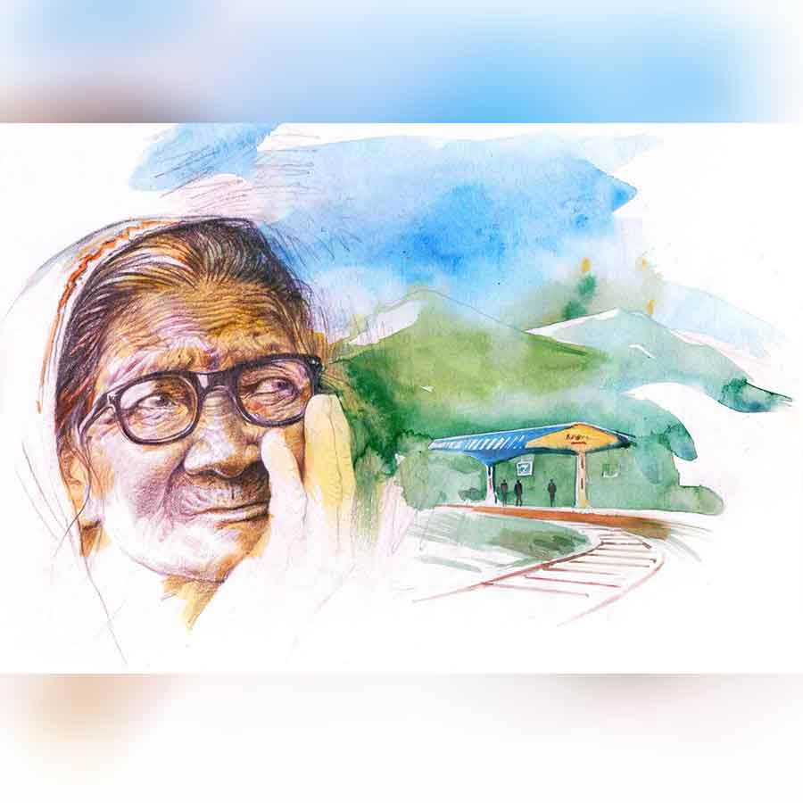

 
 <h1 align=center>চলে যাওয়ার ঠিকানা</h1>
<h2 align=center>শ্যামলী আচার্য</h2> 

আর পারছি না, এ বার যে দিকে দু’চোখ যায় চলে যাব। দেখিস।”

বেশ জোরে জোরে বলত মণিপিসি। ঘর মোছার সময় ওর মাথার তালুর উপর টেনে বাঁধা খোঁপাটা দেখতাম শুধু। আঁট করে বাঁধা। বড়সড় খোঁপা। যতই চেষ্টা করি না কেন, আমার বব-ছাঁট চুলে গামছা জড়িয়েও অমন সুন্দর নিটোল খোঁপা হবে না। মণিপিসি চোখের নিমেষে সব আসবাবের পাশ দিয়ে মেঝেতে হাত বুলিয়ে যাচ্ছে। হাতের ভেজা ন্যাকড়া থেকে এক বালতি ফিনাইল গোলা জলে মিশে যাচ্ছে ধুলো, ক্রমশ কালচে হয়ে যাওয়া জলে ভেসে থাকে মণিপিসির টুকরো ঝাঁজ।

মণিপিসি রোজ বলত, চলে যাবে।

“কোথায় যাবে মণিপিসি?” পড়ার বই থেকে চোখ তুলে এক দিন জিজ্ঞেস করলাম।

“যাওয়ার জায়গার কি অভাব আছে? শুধু এক বার ছাড়ো না তোমরা। তখনই দেখবে।”

মণিপিসি তাকাল এক ঝলক, বিরক্তির রেখা কপাল জুড়ে।

আমি বিছানার উপর তত ক্ষণে উপুড় হয়ে শুয়ে পড়েছি। আর ভাল লাগছে না ভূগোল বইয়ের অক্ষাংশের হিসেব-নিকেশ।

“কোথায় যাবে শুনি না এক বার...”

মণিপিসির চোখদুটোয় হালকা আলো জ্বলে ওঠে, “সোজা ময়নাগুড়ি। শেয়ালদা থেকে ট্রেন ধরব। এক রাত্তিরের ব্যাপার। ট্রেন বলবে দোল দোল দুলুনি। দেব এক ঘুম। ঘুম থেকে উঠলেই জানলার দু’ধারে জঙ্গল আর আকাশের গায়ে সব পাহাড়। আঃ! চার পাশে কী সুন্দর সুবাস... কাঁচা ডালপালা, সবুজ খেত, ঠান্ডা বাতাসে নরম রোদ্দুরের ওম...”

ভূগোল বই ফেলে উঠে বসতাম আমি।

“তাই মণিপিসি? আকাশের গায়ে পাহাড়?”

“হ্যাঁ গো। সত্যিকার পাহাড়। এ কি তোমাদের ওই বারান্দার খাঁচার মধ্যে থেকে দেখা আকাশ পেয়েছ? দিনভর সূর্য উঠল কি উঠল না... টের পাওয়ার জো নেই। দিনের বেলাতেও ঘরে বিজলির আলো। একটা বাড়ির জানলা দিয়ে আর একটা বাড়ির রান্নার ধোঁয়া, টিভির গান আর চিল্লাচিল্লি। একটু ফাঁকা জায়গা আছে এখেনে? শুধু লোক আর লোক। বাক্সের মতো সাজানো কেবল বাড়ি আর বাড়ি।... দমবন্ধ হয়ে আসে। মা গো মা! ঠেকায় না পড়লে মানুষ থাকে এইখানে?”

মণিপিসির ঘর-মোছার স্বাভাবিক গতির সঙ্গে সময় মিলিয়ে ঠিক এই সময় ঠাম্মা হাঁক দেয়, “অ মনু, আমার পানডা ছেঁইচ্যা দিয়া গেলি না? কাম না সাইর‌্যা এই বার কই প্যাঁচাল পাড়তে গেলি?”

আমার বরিশালিয়া ঠাকুমা মণিপিসিকে আদর করে ‘মনু’ বলে ডাকলে কী হবে, তাঁর খরখরে গলার আহ্বানে আদর তেমন প্রকাশ পায় না। তাঁর দোষ নয়, তিনি বলেন, “এয়া হইল আমাগো দ্যাশের ম্যাজাজ। আমরা অত চিনির পানা মাখাইয়া কথা কই না। সিধা মাইনসে সিধা কথা কয়,” ঠাম্মার এহেন ‘সিধা’ কথায় মণিপিসিকে বিচলিত হতে দেখিনি কখনও। ঠাম্মার হাঁকডাকে সে পাল্টা গলা তোলে, “এই তো আসচিইই... হাতের কাজটা শেষ করতে দাও বাপু।”

বলতে বলতেই সেই অমোঘ বাক্যে মণিপিসির কথা শেষ হয়, “দূর, জেঠিমা কেবল আমারে খাটিয়ে মারে। কবে যে চলে যাব। আর পারি না।”

আমার ক্লাস সেভেনের মাথায় সেই সময় ওটুকুই পৌঁছত, মণিপিসিকে ছেড়ে দিলেই সে চলে যাবে। সেই যেখানে আকাশের গায়ে পাহাড় আঁকা।

মণিপিসিকে আমি জ্ঞান হওয়া ইস্তক দেখছি। শুনেছি সেই যখন আমার ঠাকুরদা দিন দুয়েকের জ্বরে তাঁর স্ত্রী-পুত্র আর শিশুকন্যাটিকে ফেলে কোন অজানা লোকে পাড়ি দিলেন, আমার বাবা আর পিসিমণির সঙ্গে তখন থেকে মণিপিসিও ঠাম্মার জিম্মায়। আত্মীয়স্বজনের মধ্যে কেউ এক জন বাড়িতে রেখে গিয়েছিল মণিপিসিকে। দূর সম্পর্কের লতায়-পাতায় আত্মীয় বা পরিচিত কত ছেলেপুলে তখন যৌথ পরিবারে আশ্রিত থেকে দিব্যি বড় হয়ে যেত। তখন মণিপিসির বয়স তেরো-চোদ্দো হবে। এই এখন আমি যত লম্বা, মণিপিসি ঠাম্মার কাছে ঠিক ততটুকু চেহারায় এসে হাজির হয়েছিল। উদারহৃদয় ঠাকুরদা তাকে নিজের কাছে রেখেছিলেন। শুধু একার আয়ে চালানো সংসার ছেড়ে তাঁর অকালে ও-পারে চলে যাওয়ার ডাক আসবে, এই সত্য তিনি আগাম জানতে পারলে হয়তো অন্য রকম পরিকল্পনা করতেন।

মণিপিসির গল্প তার মুখেই শোনা। সব গল্পের শেষে থাকত, “আর পারি না। এ বার চলে যাব।”

ছেলেবেলা ফুরিয়ে ক্লাস টেন হয়ে টুয়েলভে পৌঁছতে বেশি দিন লাগে না। কিন্তু এই সময়ের মধ্যে ঢুকে পড়ে অনেক রকম লেখাপড়া, ভবিষ্যতের চিন্তা আর বিভিন্ন কৌতূহল। আমার জানতে ইচ্ছে করত, সেই আকাশের গায়ে পেনসিল-রেখায় আঁকা পাহাড়ের কোন দিকে যেতে চায় মণিপিসি। পাহাড়ের কোলে গিয়ে থামবে, না ডান দিক-বাঁ দিক কোনও দিকে চলে যাবে। সেই ঠিকানাটা মণিপিসি কিছুতেই বলত না। কেবল অন্য কথায় ঘুরে যেত। পাহাড়ের শরীর বেয়ে আলগোছে নেমে আসা ঝর্নার মতো, গাছের পাতার ফাঁক দিয়ে বয়ে চলা হাওয়ার মতো ভাসিয়ে দিত ওর ঠিকানা। যে-মণিপিসি সেই কোন কাকভোরে উঠে ছাদের গাছে জল দেয়, ছাদ আর বারান্দার টব থেকে ঠাম্মার জন্য দু’-চারটে ফুল তোলে, পাতাবাহারের ডাল ভেঙে সাজিয়ে রাখে কাচের গেলাসে, সূর্য ওঠার আগেই শোনা যায় তার গুনগুনিয়ে গাওয়া কীর্তন, ঠাম্মার শেখানো রান্নায় সে অক্লেশে মিশিয়ে দেয় নিজের স্নেহ মায়া আর অনাবিল মমতা, আমার টিফিনবাক্সের স্যান্ডউইচ আর বাবার কৌটোর চিঁড়ের পোলাও বরাবর একই রকম সুস্বাদু হয়... মায়ের সমস্ত ফরমায়েশ সে হাসিমুখে পালন করে, ঠাম্মার বকুনি হজম করে নির্বিবাদে, সেই মণিপিসি কেন লেখাপড়া করল না, চাকরি করল না— এই প্রশ্ন আমার মাথার মধ্যে ঘুরপাক খেল কিছু দিন।

এমন হওয়াই স্বাভাবিক, কারণ বাড়ির মধ্যে একমাত্র পড়ুয়া পেয়ে আমার উপর যে অতিরিক্ত মনোযোগ দেওয়া হত, তার বিরুদ্ধে একটা আক্রোশ কিংবা বিদ্রোহ তো থাকবেই। বিশেষত যেখানে একই বাড়িতে মণিপিসি কেবল বলে, “এ বার চলে যাব।” তাকে পড়িয়ে-লিখিয়ে ইস্কুল-কলেজ-অফিস ইত্যাদি জায়গায় পাঠাতে পারলে নিশ্চয়ই সে এমন ‘যাই যাই’ করত না। বা গেলেও সে অমন মেদুর আলো-মাখানো জায়গায় বেশি দিন থাকতে পারত না। তার কত কাজ থাকত, বাড়ির কাজ, অফিসের কাজ, সংসার। মায়ের যেমন থাকে। পিছুটান। মণিপিসিকেও ঠিক ফিরে আসতে হত। আমার মা বেড়াতে যাওয়ার কথা ভাবে বছরের শুরুতে; ক্যালেন্ডারের তারিখ দেখে বাবা-মায়ের অফিসের ছুটি, আমার ইস্কুলের পরীক্ষা, ঠাম্মার ডাক্তারের পরামর্শ মিলিয়ে কয়েক দিনের বেড়ানো। সে এক দীর্ঘ আলোচনা, বহু দিনের প্রস্তুতি। মণিপিসিকে অবশ্য সঙ্গে নিয়ে যাই না আমরা। সে গেলে ঠাম্মাকে কে দেখবে! এমনকি ঠাম্মা আমার পিসিমণির বাড়িতে থাকতে গেলেও মণিপিসির ছুটি নেই। ও মা! মণিদি চলে গেলে আমার ইস্কুল, বাবা-মায়ের অফিস চলবে কী করে!

কিন্তু ওর মতো এই বাড়িতে কেউ বলে না, “চলে যাব।” কিংবা “চল এ বার রওনা হই।”

মণিপিসি বুঝিয়ে বলত না, কিন্তু আমি বুঝতাম, আসলে আমাদের কারও অমন একটা আকাশের গায়ে পাহাড় আঁকা থাকার জায়গা নেই।

আমাদের বাড়িতে রাগী লোকের অভাব নেই। দুঃসাহসে ভর করে এক দিন ঠাম্মাকে মণিপিসির জীবনের কথা জিজ্ঞেস করলাম। তিনি বয়স্ক মানুষ, অন্যদের থেকে তাঁর তেজ তুলনায় কম হওয়ার একটা সম্ভাবনা থাকে, বিশেষ করে নাতনির কাছে।

“আচ্ছা ঠাম্মা, মণিপিসি কখনও ইস্কুলে গেলনা কেন?”

“পাঠাইসিলাম। চইল্যা আইল।”

“পাঠানোর পরেও? কেন চলে এল?”

“অরে জিগা। অর পড়াল্যাখা করার মনআসিল না।”

এগুলো সদুত্তর নয়। আমারও তো পড়তে একদম ভাল লাগে না। আমাকে কে কবে অমন অবাধ স্বাধীনতা দিয়েছে শুনি! তবে বড়রা কে আর কবে সদুত্তর দিয়েছে?

“বাবা এত পড়ল, পিসিমণি এত কিছু পড়ল, ও পড়ল না?”

আর পারছি না, এ বার যে দিকে দু’চোখ যায় চলে যাব। দেখিস।”

বেশ জোরে জোরে বলত মণিপিসি। ঘর মোছার সময় ওর মাথার তালুর উপর টেনে বাঁধা খোঁপাটা দেখতাম শুধু। আঁট করে বাঁধা। বড়সড় খোঁপা। যতই চেষ্টা করি না কেন, আমার বব-ছাঁট চুলে গামছা জড়িয়েও অমন সুন্দর নিটোল খোঁপা হবে না। মণিপিসি চোখের নিমেষে সব আসবাবের পাশ দিয়ে মেঝেতে হাত বুলিয়ে যাচ্ছে। হাতের ভেজা ন্যাকড়া থেকে এক বালতি ফিনাইল গোলা জলে মিশে যাচ্ছে ধুলো, ক্রমশ কালচে হয়ে যাওয়া জলে ভেসে থাকে মণিপিসির টুকরো ঝাঁজ।

মণিপিসি রোজ বলত, চলে যাবে।

“কোথায় যাবে মণিপিসি?” পড়ার বই থেকে চোখ তুলে এক দিন জিজ্ঞেস করলাম।

“যাওয়ার জায়গার কি অভাব আছে? শুধু এক বার ছাড়ো না তোমরা। তখনই দেখবে।”

মণিপিসি তাকাল এক ঝলক, বিরক্তির রেখা কপাল জুড়ে।

আমি বিছানার উপর তত ক্ষণে উপুড় হয়ে শুয়ে পড়েছি। আর ভাল লাগছে না ভূগোল বইয়ের অক্ষাংশের হিসেব-নিকেশ।

“কোথায় যাবে শুনি না এক বার...”

মণিপিসির চোখদুটোয় হালকা আলো জ্বলে ওঠে, “সোজা ময়নাগুড়ি। শেয়ালদা থেকে ট্রেন ধরব। এক রাত্তিরের ব্যাপার। ট্রেন বলবে দোল দোল দুলুনি। দেব এক ঘুম। ঘুম থেকে উঠলেই জানলার দু’ধারে জঙ্গল আর আকাশের গায়ে সব পাহাড়। আঃ! চার পাশে কী সুন্দর সুবাস... কাঁচা ডালপালা, সবুজ খেত, ঠান্ডা বাতাসে নরম রোদ্দুরের ওম...”

ভূগোল বই ফেলে উঠে বসতাম আমি।

“তাই মণিপিসি? আকাশের গায়ে পাহাড়?”

“হ্যাঁ গো। সত্যিকার পাহাড়। এ কি তোমাদের ওই বারান্দার খাঁচার মধ্যে থেকে দেখা আকাশ পেয়েছ? দিনভর সূর্য উঠল কি উঠল না... টের পাওয়ার জো নেই। দিনের বেলাতেও ঘরে বিজলির আলো। একটা বাড়ির জানলা দিয়ে আর একটা বাড়ির রান্নার ধোঁয়া, টিভির গান আর চিল্লাচিল্লি। একটু ফাঁকা জায়গা আছে এখেনে? শুধু লোক আর লোক। বাক্সের মতো সাজানো কেবল বাড়ি আর বাড়ি।... দমবন্ধ হয়ে আসে। মা গো মা! ঠেকায় না পড়লে মানুষ থাকে এইখানে?”

মণিপিসির ঘর-মোছার স্বাভাবিক গতির সঙ্গে সময় মিলিয়ে ঠিক এই সময় ঠাম্মা হাঁক দেয়, “অ মনু, আমার পানডা ছেঁইচ্যা দিয়া গেলি না? কাম না সাইর‌্যা এই বার কই প্যাঁচাল পাড়তে গেলি?”

আমার বরিশালিয়া ঠাকুমা মণিপিসিকে আদর করে ‘মনু’ বলে ডাকলে কী হবে, তাঁর খরখরে গলার আহ্বানে আদর তেমন প্রকাশ পায় না। তাঁর দোষ নয়, তিনি বলেন, “এয়া হইল আমাগো দ্যাশের ম্যাজাজ। আমরা অত চিনির পানা মাখাইয়া কথা কই না। সিধা মাইনসে সিধা কথা কয়,” ঠাম্মার এহেন ‘সিধা’ কথায় মণিপিসিকে বিচলিত হতে দেখিনি কখনও। ঠাম্মার হাঁকডাকে সে পাল্টা গলা তোলে, “এই তো আসচিইই... হাতের কাজটা শেষ করতে দাও বাপু।”

বলতে বলতেই সেই অমোঘ বাক্যে মণিপিসির কথা শেষ হয়, “দূর, জেঠিমা কেবল আমারে খাটিয়ে মারে। কবে যে চলে যাব। আর পারি না।”

আমার ক্লাস সেভেনের মাথায় সেই সময় ওটুকুই পৌঁছত, মণিপিসিকে ছেড়ে দিলেই সে চলে যাবে। সেই যেখানে আকাশের গায়ে পাহাড় আঁকা।

মণিপিসিকে আমি জ্ঞান হওয়া ইস্তক দেখছি। শুনেছি সেই যখন আমার ঠাকুরদা দিন দুয়েকের জ্বরে তাঁর স্ত্রী-পুত্র আর শিশুকন্যাটিকে ফেলে কোন অজানা লোকে পাড়ি দিলেন, আমার বাবা আর পিসিমণির সঙ্গে তখন থেকে মণিপিসিও ঠাম্মার জিম্মায়। আত্মীয়স্বজনের মধ্যে কেউ এক জন বাড়িতে রেখে গিয়েছিল মণিপিসিকে। দূর সম্পর্কের লতায়-পাতায় আত্মীয় বা পরিচিত কত ছেলেপুলে তখন যৌথ পরিবারে আশ্রিত থেকে দিব্যি বড় হয়ে যেত। তখন মণিপিসির বয়স তেরো-চোদ্দো হবে। এই এখন আমি যত লম্বা, মণিপিসি ঠাম্মার কাছে ঠিক ততটুকু চেহারায় এসে হাজির হয়েছিল। উদারহৃদয় ঠাকুরদা তাকে নিজের কাছে রেখেছিলেন। শুধু একার আয়ে চালানো সংসার ছেড়ে তাঁর অকালে ও-পারে চলে যাওয়ার ডাক আসবে, এই সত্য তিনি আগাম জানতে পারলে হয়তো অন্য রকম পরিকল্পনা করতেন।

মণিপিসির গল্প তার মুখেই শোনা। সব গল্পের শেষে থাকত, “আর পারি না। এ বার চলে যাব।”

ছেলেবেলা ফুরিয়ে ক্লাস টেন হয়ে টুয়েলভে পৌঁছতে বেশি দিন লাগে না। কিন্তু এই সময়ের মধ্যে ঢুকে পড়ে অনেক রকম লেখাপড়া, ভবিষ্যতের চিন্তা আর বিভিন্ন কৌতূহল। আমার জানতে ইচ্ছে করত, সেই আকাশের গায়ে পেনসিল-রেখায় আঁকা পাহাড়ের কোন দিকে যেতে চায় মণিপিসি। পাহাড়ের কোলে গিয়ে থামবে, না ডান দিক-বাঁ দিক কোনও দিকে চলে যাবে। সেই ঠিকানাটা মণিপিসি কিছুতেই বলত না। কেবল অন্য কথায় ঘুরে যেত। পাহাড়ের শরীর বেয়ে আলগোছে নেমে আসা ঝর্নার মতো, গাছের পাতার ফাঁক দিয়ে বয়ে চলা হাওয়ার মতো ভাসিয়ে দিত ওর ঠিকানা। যে-মণিপিসি সেই কোন কাকভোরে উঠে ছাদের গাছে জল দেয়, ছাদ আর বারান্দার টব থেকে ঠাম্মার জন্য দু’-চারটে ফুল তোলে, পাতাবাহারের ডাল ভেঙে সাজিয়ে রাখে কাচের গেলাসে, সূর্য ওঠার আগেই শোনা যায় তার গুনগুনিয়ে গাওয়া কীর্তন, ঠাম্মার শেখানো রান্নায় সে অক্লেশে মিশিয়ে দেয় নিজের স্নেহ মায়া আর অনাবিল মমতা, আমার টিফিনবাক্সের স্যান্ডউইচ আর বাবার কৌটোর চিঁড়ের পোলাও বরাবর একই রকম সুস্বাদু হয়... মায়ের সমস্ত ফরমায়েশ সে হাসিমুখে পালন করে, ঠাম্মার বকুনি হজম করে নির্বিবাদে, সেই মণিপিসি কেন লেখাপড়া করল না, চাকরি করল না— এই প্রশ্ন আমার মাথার মধ্যে ঘুরপাক খেল কিছু দিন।

এমন হওয়াই স্বাভাবিক, কারণ বাড়ির মধ্যে একমাত্র পড়ুয়া পেয়ে আমার উপর যে অতিরিক্ত মনোযোগ দেওয়া হত, তার বিরুদ্ধে একটা আক্রোশ কিংবা বিদ্রোহ তো থাকবেই। বিশেষত যেখানে একই বাড়িতে মণিপিসি কেবল বলে, “এ বার চলে যাব।” তাকে পড়িয়ে-লিখিয়ে ইস্কুল-কলেজ-অফিস ইত্যাদি জায়গায় পাঠাতে পারলে নিশ্চয়ই সে এমন ‘যাই যাই’ করত না। বা গেলেও সে অমন মেদুর আলো-মাখানো জায়গায় বেশি দিন থাকতে পারত না। তার কত কাজ থাকত, বাড়ির কাজ, অফিসের কাজ, সংসার। মায়ের যেমন থাকে। পিছুটান। মণিপিসিকেও ঠিক ফিরে আসতে হত। আমার মা বেড়াতে যাওয়ার কথা ভাবে বছরের শুরুতে; ক্যালেন্ডারের তারিখ দেখে বাবা-মায়ের অফিসের ছুটি, আমার ইস্কুলের পরীক্ষা, ঠাম্মার ডাক্তারের পরামর্শ মিলিয়ে কয়েক দিনের বেড়ানো। সে এক দীর্ঘ আলোচনা, বহু দিনের প্রস্তুতি। মণিপিসিকে অবশ্য সঙ্গে নিয়ে যাই না আমরা। সে গেলে ঠাম্মাকে কে দেখবে! এমনকি ঠাম্মা আমার পিসিমণির বাড়িতে থাকতে গেলেও মণিপিসির ছুটি নেই। ও মা! মণিদি চলে গেলে আমার ইস্কুল, বাবা-মায়ের অফিস চলবে কী করে!

কিন্তু ওর মতো এই বাড়িতে কেউ বলে না, “চলে যাব।” কিংবা “চল এ বার রওনা হই।”

মণিপিসি বুঝিয়ে বলত না, কিন্তু আমি বুঝতাম, আসলে আমাদের কারও অমন একটা আকাশের গায়ে পাহাড় আঁকা থাকার জায়গা নেই।

আমাদের বাড়িতে রাগী লোকের অভাব নেই। দুঃসাহসে ভর করে এক দিন ঠাম্মাকে মণিপিসির জীবনের কথা জিজ্ঞেস করলাম। তিনি বয়স্ক মানুষ, অন্যদের থেকে তাঁর তেজ তুলনায় কম হওয়ার একটা সম্ভাবনা থাকে, বিশেষ করে নাতনির কাছে।

“আচ্ছা ঠাম্মা, মণিপিসি কখনও ইস্কুলে গেলনা কেন?”

“পাঠাইসিলাম। চইল্যা আইল।”

“পাঠানোর পরেও? কেন চলে এল?”

“অরে জিগা। অর পড়াল্যাখা করার মনআসিল না।”

এগুলো সদুত্তর নয়। আমারও তো পড়তে একদম ভাল লাগে না। আমাকে কে কবে অমন অবাধ স্বাধীনতা দিয়েছে শুনি! তবে বড়রা কে আর কবে সদুত্তর দিয়েছে?

“বাবা এত পড়ল, পিসিমণি এত কিছু পড়ল, ও পড়ল না?”

“না। অর মন করে নাই, পড়ে নাই। আমিকী করুম?”

“জোর করে পড়াতে...”

“অরে? ফাঁক পাইলেই সিধা গিয়া ছাদের ঘরখানায় বইস্যা থাকত।”

“ও কেবল বলে, চলে যাব। ওকে ছেড়ে দাওনা কেন?”

“ছাইড়াই রাখসি। অরে বাঁধবে ক্যাডা?”

“মণিপিসির বাবা-মা কেউ নেই?”

“না। অকালে গ্যাসে গিয়া। আপনজনেরা থাকতে কেউ কি আর সাধ কইরা পরেরঘরে আসে?”

আমাদের বাড়িটাকে মণিপিসি ‘পরের ঘর’ বলে ভাবে কেন? সে তো দিব্যি থাকে। ঠাম্মাকে ‘জেঠিমা’ বলে ডাকে, ঠাম্মার মুখে-মুখে তর্ক করে। বাবা-পিসিমণি ঠাম্মাকে যা বলতে পারে না, মণিপিসি অক্লেশে সে-সব বলে দেয়। একটু একটু রুপোলি রেখা জড়িয়ে ধরে ওর খোঁপা। আমার কাঁধ ছাপিয়ে ঝামরে নামা চুলে এখনও অমন খোঁপা হয় না। আমার মাথা ছাড়িয়ে যায় মণিপিসিকে। মণিপিসি ভুরু কুঁচকে সুচে সুতো পরায়, পর্দা টাঙায়, ডিভান থেকে সব বার করে রোদ খাওয়ায়। আমি ব্যস্ত হয়ে থাকি আজকাল। সব সময় কান পেতে শোনা হয় না মণিপিসির চলে যাওয়ার ইচ্ছেগুলো। বরং মনে রাখতে হয় বাবা-মা বলছেন, “আর কলকাতায় নয়, এ বার বাইরে যাও, বাইরে গিয়ে পড়ো।” আমি মোটাসোটা বই আর বিদেশি কলেজের হাতছানিতে ডুবে যাই।

আমার আঠারো-পেরোনো জন্মদিনের রাতে সব বন্ধুরা যখন বাড়ি চলে গেছে, মণিপিসি আমার ঘরে আসে, বলে, “মামন, এই বার তুমিই আমাকে ছুটি দিতে পারো।”

কিছু বুঝতে পারি না আমি, “তুমি কী বলছ মণিপিসি? আমি ছুটি দেব?”

“তুমিই তো দেবে। তুমি এখন আঠারো। দাদা বলল, তুমি এখন অ্যাডাল, তুমি চাইলেই হবে।”

মণিপিসির মুখে ‘অ্যাডাল’ হয়ে গেছি শুনে হেসে লুটোপুটি খাই আমি।

“কী যে বলো না... দূর! আমি তোমায় ছুটি দেওয়ার কে? ঠাম্মাকে বলো... আচ্ছা, কোথায় যাবে তুমি ছুটি পেলে?”

“সেই যে... বলি না তোমায়...” বলতে বলতে চোখ দুটোয় টিমটিমে বালবের আলো, দেখি, বয়সের সর পড়েছে আলোর উপরে। ঝুলকালি ময়লায় মলিন। তবু আলো তো!

“ময়নাগুড়ি যাব গো। এক রাত্তির লাগবে। ট্রেনের দুলুনিতে ঘুম, ঘুম ভাঙলেই সকালের রোদ্দুর নদী জঙ্গল পাহাড়। তোমার ঠাম্মাকে বললে ছাড়বে না আমায়। কেবল বেঁধে-বেঁধে রাখবে।”

হঠাৎ খটকা লাগে।

“আচ্ছা মণিপিসি, এত যে তুমি ময়নাগুড়িরগল্প বলো, সেখানে কে আছে তোমার? কার কাছে যাবে তুমি?”

“এ সব কী বলছ তুমি! কে নেই? সেখেনেই তো আমার ঘর, আমার বাড়ি, আমার লোকজন সব। সেই কোন ছেলেবেলায় ছেড়ে চলে এসচি তাদের...” বলতে বলতে কেমন আনমনা হয়ে যায় মণিপিসি।

“এখন গেলে চিনবে তারা তোমাকে? তুমি তো কত কাল যাওনি। তারা তো কেউ কোনও দিন তোমার খোঁজ নিতে এল না!”

আমার প্রশ্ন শুনে মণিপিসি কটমট করে তাকায়, “চিনবে না মানে, আমি সব বেশ মনে রেখেছি, তারা সব ভুলে যাবে... হয় নাকি এমনটা? তারা ভাবছে আমি যাব, আমি ফিরব এক দিন, এখানে কি এই ভাবে থেকে যাওয়ার কথা নাকি আমার... জেঠিমা ছাড়েই না আমায়... আটকে রাখে শুধু...” বলতে বলতে ঘড়ির দিকে তাকিয়ে, “উফ কত রাত হয়ে গেল দেকচ, রান্নাঘরে এক কাঁড়ি বাসন, সাতসকালে উঠতে হবে, কাল দাদাভাইয়ের অফিস আছে না... তোমার সঙ্গে এখন ময়নাগুড়ির গল্প করলে চলবে?” বলতে বলতে চলে যায় ঘর ছেড়ে।

অসংখ্য উপহার আর সারা দিনের প্রচুর শুভেচ্ছা আমার উপর ঝাঁপিয়ে পড়ে এ বার, মণিপিসির ময়নাগুড়ি সরিয়ে রেখে আমি ডুবে যাই তার মধ্যে।

তিন-চার দিন ব্যস্ততায় ছিলাম। দেখছি মণিপিসি বইয়ের তাকের ধুলো ঝাড়ছে, রান্নাঘরের দেওয়াল চকচকে করে ঘষে ফেলছে নতুনের মতো, ঠাম্মার বাতের ব্যথায় গরম সেঁক, ব্যালকনিতে নেমে এল আলমারির শাড়িজামাকাপড়, তারা সব ভাদ্রের রোদ্দুর খাবে। আর এর মধ্যেই কানে এল, “আর ভাল লাগে না। কবে যে যাব। কবে ছুটি পাব, ভগবানই জানে।”

কেমন যেন গলাব্যথা করে আমার।

দৌড়ে গিয়ে ফোন করি মাকে।

“কী হল রে, এমন অসময়ে?” অফিসেব্যস্ত মায়ের গলায় উৎকণ্ঠা, “হ্যাঁ রে, ঠাম্মা ঠিক আছে তো?”

“আরে হ্যাঁ হ্যাঁ, সব ঠিক আছে। শোনো মা, আমরা মণিপিসিকে ক’দিন ছুটি দিতে পারি না?”

“কী? কাকে? মণিদিকে? কিসের ছুটি? কী হয়েছে ওর?”

“আরে, মণিপিসি কেবল বলে, ছুটি পেলেই ময়নাগুড়ি যাবে, সেখানে সবাই আছে ওর, ওকে কোনও দিন ছুটি দাও না কেন? ওকে এ বার কিছু দিন ছেড়ে দাও না... ও ঘুরে আসুক। আমরা যাওয়া-আসার টিকিট কেটে দেব না-হয়...” এক নিঃশ্বাসে বলতে থাকি আমি।

মা কেমন করে যেন বলে, “আচ্ছা তুই থাম এখন। বাড়ি গিয়ে কথা বলছি।”

সেই কথাও আর বলা হয় না। হারিয়ে যায় কাজের চাপে।

যে দিন ঠাম্মা ঘুমের মধ্যে তলিয়ে গেল, আর উঠল না ভোরবেলায়, কেউ কাঁদছি, কেউ থমথমে স্তব্ধ, বাড়ি-ভর্তি লোকের মধ্যে হঠাৎ ডাক ছেড়ে চেঁচিয়ে উঠল মণিপিসি, “এ বার আমারে তুলে নাও গো ঠাকুর... আমি কোথায় যাব জেঠিমা, এ বার তুমি আমারে বলে দাও... এখন কোথায় যাব আমি... আমার যে আর কেউ নাই কোথাও...”

কুয়াশা কেটে যাওয়া সকালের আলোয়, দূরে কোথাও থেকে ট্রেনের আওয়াজ ভেসে আসে।

ছবি: মহেশ্বর মণ্ডল

(এই প্রতিবেদনটি আনন্দবাজার পত্রিকার মুদ্রিত সংস্করণ থেকে নেওয়া হয়েছে)

