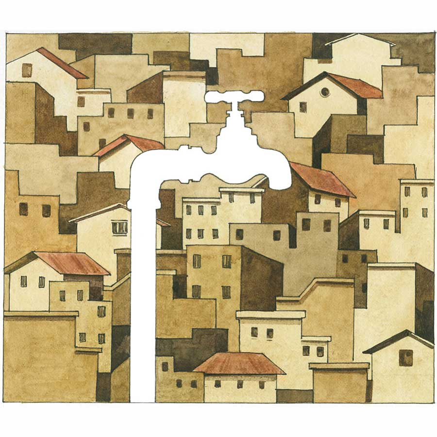

 
 <h1 align=center>জল</h1>
<h2 align=center>সিজার বাগচী</h2> 

এতটা ঝামেলা হয়ে যাবে, সুব্রত ভাবতেও পারেননি।

সুরজিৎ অবশ্য বলেছিলেন, “কেন এই সব করছিস?”

সুব্রত আমল দেননি। তিনি এই সুধন্যপুরের ভূমিপুত্র। উচ্চ মাধ্যমিক পর্যন্ত এখানে পড়াশোনা করেছেন। চাকরি পাওয়ার পর এলাকা ছেড়েছেন। ফিরেছেনও চাকরি থেকে অবসর নেওয়ার এক বছর বাদে। তাই ভেবেছিলেন, এলাকায় তাঁর জোর আছে। এখনও।

সেই ধারণা টাল খেয়েছে।

এখন সন্ধে। বাড়ির দোতলার বারান্দায় সুব্রত দাঁড়িয়ে। খানিক আগে অন্তরা এসে জানিয়েছে, “ওরা আর জল দেবে না। মিতাও কাজ ছেড়ে দিল। শুক্লাও রান্নার কাজ ছেড়ে দেবে।”

“কে বলল?” সুব্রত চিন্তিত গলায় জানতে চাইলেন অন্তরার কাছে।

“মিতাই বলল।”

সুব্রত চুপ করে থাকলেন। অন্তরা ঘরে ঢুকে গেলেন। নিঃশব্দে।

অন্ধকারে দাঁড়িয়ে সুব্রতর মনে পড়ল পুরনো দিনের কথা। ব্যাঙ্কে চাকরির পর-পর বিয়ে। অন্তরার বাপের বাড়ি উত্তরবঙ্গের মালবাজারে। বৌ নিয়ে তিনি পাড়ি দিয়েছিলেন ডিব্রুগড়ে। তখন ওখানে পোস্টিং ছিল। এক বছরের মাথায় সানি জন্মাল। সেই থেকে দিনগুলো কেমন হু হু করে কেটে গেল। বছর কয়েক বাদে মা মারা গেলেন। পিছু-পিছু বাবা। দেখতে দেখতে সানি বড় হল। পড়াশোনা করল। চাকরি পেল বেঙ্গালুরুতে। দেড় বছর পেরোতেই সুব্রত অবসর নিলেন চাকরি থেকে।

তখন কোথায় থাকবেন দু’জনে? অন্তরা ঠিক করলেন, ছেলের কাছে। বেঙ্গালুরুর হোয়াইটফিল্ডে। আগের ফ্ল্যাট ছেড়ে মা-বাবার জন্য সানি দু’কামরার ফ্ল্যাট নিল। মুশকিল দেখা দিল গরমকালে। হোয়াইটফিল্ডে প্রবল জলের অভাব। এ দিকে অন্তরা বেজায় পিটপিটে। দিনে দু’বার অন্তত স্নান করেন। ওখানে তা সম্ভব হচ্ছিল না।

এক দিন সানি রেগে বলল, “মা, এখানে অত জল নষ্ট করা যায় না।”

ছেলের বান্ধবী ইন্দিরাও এসে বোঝাল।

তার পরই বেঁকে বসলেন অন্তরা। ছেলে অফিস বেরিয়ে যেতে সুব্রতকে বললেন, “আমি এখানে থাকব না।”

আকাশ থেকে পড়লেন সুব্রত। কোথায় যাবেন? যাওয়ার মধ্যে আছে কলকাতা। সেখানে কি হুট করে যাওয়া যায়? সানিকেও জানানো দরকার। কিন্তু অন্তরার সেই এক গোঁ। সারা জীবন মর্জিমতো সংসার করেছেন। এখন এমন পরিস্থিতিতে থাকতে পারবেন না।

সুব্রত বোঝাতে চাইলেন, “কলকাতায় কি চাইলেই বাড়ি ভাড়া পাওয়া যায়?”

অন্তরা তখন বললেন, “তা হলে মালবাজার চলো। ওখানকার বাড়ি ফাঁকা। কবে থেকে ভাবছি বিক্রি করে দেব। ভাগ্যিস করিনি।”

“বুড়ো বয়সে পাহাড়ে যাব? হঠাৎ অসুস্থ হলে?”

“মালবাজার আর আগের মালবাজার নেই। যাবে কি না বলো?”

কোনও দিনই স্ত্রীর সঙ্গে এঁটে উঠতে পারেননি সুব্রত। রাজি হলেন। ছেলেকে বুঝিয়ে-সুজিয়ে হাজির হলেন মালবাজারের বাড়িতে। এসে জায়গাটা ভাল লাগল। কাছে সেবক ব্রিজ। দূরে পাহাড় দেখা যায়। ধুলো-ধোঁয়া নেই।

কিন্তু যে সমস্যার হাত থেকে নিষ্কৃতি পাওয়ার জন্য আসা, তা মিটল না। মালবাজারেও খুব জলের কষ্ট। গরমকালে বেশির ভাগ বাড়ির কুয়ো শুকিয়ে যায়। পুরসভা থেকে জলের ব্যবস্থা করা হয় ঠিকই, তা প্রয়োজনের তুলনায় অল্প। দিনকয়েক বাদে অন্তরা বলে বসলেন, “টকের জ্বালায় দেশ ছাড়লাম, তেঁতুলতলায় বাস!”

প্রমাদ গুনলেন সুব্রত। অন্তরা হয়তো প্রস্তাব দেবেন, “চলে, সানির কাছে ফিরে যাই।” আবার সব মালপত্র ঘাড়ে করে বেঙ্গালুরু ফিরতে হবে!

অন্তরা অবশ্য তা বললেন না। বললেন, “সুধন্যপুর গেলে কেমন হয়?”

শুনেই সুব্রত রেগে উঠলেন। বললেন, “কী ভেবেছ! বাকি জীবন জল-জল করে ছুটিয়ে মারবে? এত লোক থাকতে পারছে, তুমি পারবে না কেন?”

গুম মেরে গেলেন অন্তরা। সুব্রত বলতে থাকলেন, “সুধন্যপুরে মাঠ-ঘাট-পুকুর বুজিয়ে ফ্ল্যাট উঠছে। কোন দিন প্রোমোটার এসে না আমাদের বাড়ি জবরদখল করে বসে!”

শেষ কথাটা লুফে নিলেন অন্তরা। বললেন, “তা হলে তো অতি অবশ্যই সুধন্যপুর ফেরা দরকার।”

অগত্যা সুধন্যপুর।

এখানে এসে প্রথম প্রথম একটু খারাপ লাগলেও এক-দু’জন পুরনো বন্ধুকে পেয়ে শেষ পর্যন্ত ভালই লাগতে শুরু করল সুব্রতর। হালদারদের ঝিলের ধারে আড্ডা বসে নিয়মিত। প্রায়ই হাজির হতে লাগলেন। আড্ডায় নানা বিষয় আলোচনা হয়। সুব্রত বললেন বেঙ্গালুরু, মালবাজারের জলকষ্টের অভিজ্ঞতা নিয়ে।

সুরজিৎ বললেন, “এখানে ও সব নেই। যত খুশি জল খরচ কর। ফুরোবে না।”

অনির্বাণও সায় দিলেন, “হ্যাঁ। আগে কষ্ট ছিল। টিউবওয়েল ছা়ড়া খাবার জল পাওয়া যেত না। এখন রানিং ওয়াটার এসে গিয়েছে। প্লাস অনেকে মাটির নীচের জল তুলে শোধন করছে। প্লাস্টিকের জারে করে বাড়ি বাড়ি পৌঁছে দিচ্ছে। বেশ সস্তা।”

সুব্রত এত খুঁটিনাটি জানতেন না। সব শুনে অবাক হয়ে বললেন, “পাম্প করে জল তুলছে? মাটির নীচের জল তো ফুরিয়ে যাবে!”

এতটা ঝামেলা হয়ে যাবে, সুব্রত ভাবতেও পারেননি।

সুরজিৎ অবশ্য বলেছিলেন, “কেন এই সব করছিস?”

সুব্রত আমল দেননি। তিনি এই সুধন্যপুরের ভূমিপুত্র। উচ্চ মাধ্যমিক পর্যন্ত এখানে পড়াশোনা করেছেন। চাকরি পাওয়ার পর এলাকা ছেড়েছেন। ফিরেছেনও চাকরি থেকে অবসর নেওয়ার এক বছর বাদে। তাই ভেবেছিলেন, এলাকায় তাঁর জোর আছে। এখনও।

সেই ধারণা টাল খেয়েছে।

এখন সন্ধে। বাড়ির দোতলার বারান্দায় সুব্রত দাঁড়িয়ে। খানিক আগে অন্তরা এসে জানিয়েছে, “ওরা আর জল দেবে না। মিতাও কাজ ছেড়ে দিল। শুক্লাও রান্নার কাজ ছেড়ে দেবে।”

“কে বলল?” সুব্রত চিন্তিত গলায় জানতে চাইলেন অন্তরার কাছে।

“মিতাই বলল।”

সুব্রত চুপ করে থাকলেন। অন্তরা ঘরে ঢুকে গেলেন। নিঃশব্দে।

অন্ধকারে দাঁড়িয়ে সুব্রতর মনে পড়ল পুরনো দিনের কথা। ব্যাঙ্কে চাকরির পর-পর বিয়ে। অন্তরার বাপের বাড়ি উত্তরবঙ্গের মালবাজারে। বৌ নিয়ে তিনি পাড়ি দিয়েছিলেন ডিব্রুগড়ে। তখন ওখানে পোস্টিং ছিল। এক বছরের মাথায় সানি জন্মাল। সেই থেকে দিনগুলো কেমন হু হু করে কেটে গেল। বছর কয়েক বাদে মা মারা গেলেন। পিছু-পিছু বাবা। দেখতে দেখতে সানি বড় হল। পড়াশোনা করল। চাকরি পেল বেঙ্গালুরুতে। দেড় বছর পেরোতেই সুব্রত অবসর নিলেন চাকরি থেকে।

তখন কোথায় থাকবেন দু’জনে? অন্তরা ঠিক করলেন, ছেলের কাছে। বেঙ্গালুরুর হোয়াইটফিল্ডে। আগের ফ্ল্যাট ছেড়ে মা-বাবার জন্য সানি দু’কামরার ফ্ল্যাট নিল। মুশকিল দেখা দিল গরমকালে। হোয়াইটফিল্ডে প্রবল জলের অভাব। এ দিকে অন্তরা বেজায় পিটপিটে। দিনে দু’বার অন্তত স্নান করেন। ওখানে তা সম্ভব হচ্ছিল না।

এক দিন সানি রেগে বলল, “মা, এখানে অত জল নষ্ট করা যায় না।”

ছেলের বান্ধবী ইন্দিরাও এসে বোঝাল।

তার পরই বেঁকে বসলেন অন্তরা। ছেলে অফিস বেরিয়ে যেতে সুব্রতকে বললেন, “আমি এখানে থাকব না।”

আকাশ থেকে পড়লেন সুব্রত। কোথায় যাবেন? যাওয়ার মধ্যে আছে কলকাতা। সেখানে কি হুট করে যাওয়া যায়? সানিকেও জানানো দরকার। কিন্তু অন্তরার সেই এক গোঁ। সারা জীবন মর্জিমতো সংসার করেছেন। এখন এমন পরিস্থিতিতে থাকতে পারবেন না।

সুব্রত বোঝাতে চাইলেন, “কলকাতায় কি চাইলেই বাড়ি ভাড়া পাওয়া যায়?”

অন্তরা তখন বললেন, “তা হলে মালবাজার চলো। ওখানকার বাড়ি ফাঁকা। কবে থেকে ভাবছি বিক্রি করে দেব। ভাগ্যিস করিনি।”

“বুড়ো বয়সে পাহাড়ে যাব? হঠাৎ অসুস্থ হলে?”

“মালবাজার আর আগের মালবাজার নেই। যাবে কি না বলো?”

কোনও দিনই স্ত্রীর সঙ্গে এঁটে উঠতে পারেননি সুব্রত। রাজি হলেন। ছেলেকে বুঝিয়ে-সুজিয়ে হাজির হলেন মালবাজারের বাড়িতে। এসে জায়গাটা ভাল লাগল। কাছে সেবক ব্রিজ। দূরে পাহাড় দেখা যায়। ধুলো-ধোঁয়া নেই।

কিন্তু যে সমস্যার হাত থেকে নিষ্কৃতি পাওয়ার জন্য আসা, তা মিটল না। মালবাজারেও খুব জলের কষ্ট। গরমকালে বেশির ভাগ বাড়ির কুয়ো শুকিয়ে যায়। পুরসভা থেকে জলের ব্যবস্থা করা হয় ঠিকই, তা প্রয়োজনের তুলনায় অল্প। দিনকয়েক বাদে অন্তরা বলে বসলেন, “টকের জ্বালায় দেশ ছাড়লাম, তেঁতুলতলায় বাস!”

প্রমাদ গুনলেন সুব্রত। অন্তরা হয়তো প্রস্তাব দেবেন, “চলে, সানির কাছে ফিরে যাই।” আবার সব মালপত্র ঘাড়ে করে বেঙ্গালুরু ফিরতে হবে!

অন্তরা অবশ্য তা বললেন না। বললেন, “সুধন্যপুর গেলে কেমন হয়?”

শুনেই সুব্রত রেগে উঠলেন। বললেন, “কী ভেবেছ! বাকি জীবন জল-জল করে ছুটিয়ে মারবে? এত লোক থাকতে পারছে, তুমি পারবে না কেন?”

গুম মেরে গেলেন অন্তরা। সুব্রত বলতে থাকলেন, “সুধন্যপুরে মাঠ-ঘাট-পুকুর বুজিয়ে ফ্ল্যাট উঠছে। কোন দিন প্রোমোটার এসে না আমাদের বাড়ি জবরদখল করে বসে!”

শেষ কথাটা লুফে নিলেন অন্তরা। বললেন, “তা হলে তো অতি অবশ্যই সুধন্যপুর ফেরা দরকার।”

অগত্যা সুধন্যপুর।

এখানে এসে প্রথম প্রথম একটু খারাপ লাগলেও এক-দু’জন পুরনো বন্ধুকে পেয়ে শেষ পর্যন্ত ভালই লাগতে শুরু করল সুব্রতর। হালদারদের ঝিলের ধারে আড্ডা বসে নিয়মিত। প্রায়ই হাজির হতে লাগলেন। আড্ডায় নানা বিষয় আলোচনা হয়। সুব্রত বললেন বেঙ্গালুরু, মালবাজারের জলকষ্টের অভিজ্ঞতা নিয়ে।

সুরজিৎ বললেন, “এখানে ও সব নেই। যত খুশি জল খরচ কর। ফুরোবে না।”

অনির্বাণও সায় দিলেন, “হ্যাঁ। আগে কষ্ট ছিল। টিউবওয়েল ছা়ড়া খাবার জল পাওয়া যেত না। এখন রানিং ওয়াটার এসে গিয়েছে। প্লাস অনেকে মাটির নীচের জল তুলে শোধন করছে। প্লাস্টিকের জারে করে বাড়ি বাড়ি পৌঁছে দিচ্ছে। বেশ সস্তা।”

সুব্রত এত খুঁটিনাটি জানতেন না। সব শুনে অবাক হয়ে বললেন, “পাম্প করে জল তুলছে? মাটির নীচের জল তো ফুরিয়ে যাবে!”

সুরজিৎ হো হো করে হেসে উঠলেন। বললেন, “এ হল শস্যশ্যামলা বাংলা। কিস্যু হবে না।”

“হতে কত ক্ষণ?”

বন্ধুরা কেউ সুব্রতর কথায় আমল দিল না। কিন্তু সুব্রত হাত গুটিয়ে বসে থাকলেন না। চার পাশ ঘুরে দেখলেন, অমন তিন-চারটে ইউনিট রয়েছে। রাস্তার ধারের বেশির ভাগ কলের প্যাঁচও কাটা। জল পড়ে যায় ঘণ্টার পর ঘণ্টা। সানি ফেসবুক অ্যাকাউন্ট খুলে দিয়েছে। সুব্রত সেখানে ছবি পোস্ট করলেন। লিখলেন। তিন-চারটে খবরের কাগজে চিঠি পাঠালেন। দুটো চিঠি ছাপা হল।

তারপরই শুরু হল গোলমাল। অনির্বাণের ছেলে কিশলয়ের ফোন এল। কিশলয় স্থানীয় রাজনৈতিক দলের কর্মী। মিহি গলায় কিশলয় বলল, “কাজটা কি ভাল করলেন? শেষ বয়সে তো মারধর খেয়ে যাবেন। আমাদের কিছু করার থাকবে না।”

অন্তরা ক্ষোভে ফেটে পড়ল, “কী লিখেছ কাগজে? জলের ছেলেটা আর জল দেবে না। বলেছে, তোমাকে দেখে নেবে।”

বারান্দায় দাঁড়িয়ে সুব্রত এই সব ভাবছিলেন। পকেটে রাখা মোবাইল বেজে উঠল।

ফোন ধরতে সানি বলল, “মায়ের কাছে সব শুনলাম। কলকাতার বাইপাসের ধারে একটা কমপ্লেক্স দেখেছি। রেডিমেড ফ্ল্যাট আছে। রিটায়ারমেন্টের পর তো অনেকগুলো টাকা পেয়েছ। তা দিয়ে ইনিশিয়াল পেমেন্ট করো। মালবাজার আর সুধন্যপুরের বাড়ি বিক্রি করলে বাকি টাকা উঠে আসবে। অসুবিধে হবে না।”

“সব বিক্রি করে ওখানে যাব কেন?” সুব্রত আশ্চর্য হয়ে বললেন।

সানি বলল, “ওখানে প্রচুর জলের সাপ্লাই। টাকা দিলেই জল পাবে। তোমাদের জলকষ্ট হবে না।”

ফোন ছেড়ে সুব্রত বাইরের অন্ধকারে দিকে তাকিয়ে থাকলেন। জলের জন্য সর্বস্ব বিকিয়ে নতুন ঠিকানায় উঠে যেতে হবে?

(এই প্রতিবেদনটি আনন্দবাজার পত্রিকার মুদ্রিত সংস্করণ থেকে নেওয়া হয়েছে)

