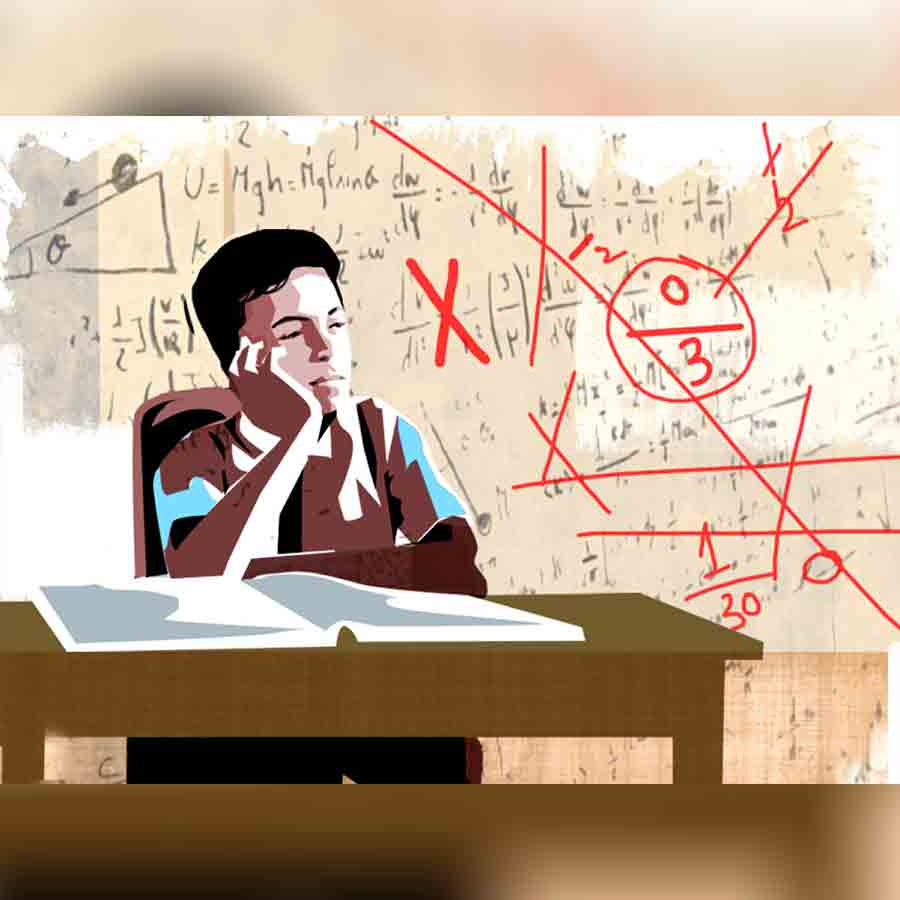

 
 <h1 align=center>দাগ</h1>
<h2 align=center>সৌমী গুপ্ত</h2> 

গা  গুলিয়ে উঠল তমালের। হাসপাতাল চত্বরটা গুমোট হয়ে উঠেছে। চার দিকে ছড়িয়ে-ছিটিয়ে রয়েছে পেশেন্ট পার্টি। অসুস্থ মানুষজন, কাতর চিৎকার, কষ্টের আর্তনাদ, ওষুধপত্রের তীব্র গন্ধের মাঝে নিদারুণ অবস্থায় পড়েছে তমাল। আশপাশটা বড় নোংরা। ওয়াক উঠে আসে।

গেটের সামনে দশ-বারো জনের জটলা। সে গলা উঁচু করে বলে, “পরিতোষ রায়! একটু দেখবেন, কত নম্বর কেবিন?”

“লাইনে দাঁড়ান। তাড়াহুড়ো করবেন না। এক-এক করে ডাকব।”

তমাল পিছন ফিরে দেখার চেষ্টা করল। বাবা বেঞ্চের উপর ঢুলে পড়েছে। সেই সকাল থেকে চলছে। শরীর দেয়? হাসপাতালে বেড পেতে যা বেগ পেতে হয়েছে, বলাই বাহুল্য। কাউন্সিলার তো লিখে দিয়েই খালাস। সকালে এসে লাইন দেখে চক্ষু চড়কগাছ হয়ে গিয়েছিল তমালের। এ কিসের লাইন? শেষ বার দক্ষিণেশ্বর কালীবাড়িতে পুজো দিতে গিয়ে এমন লাইন দেখেছিল তমাল! শিপ্রাকে ধমক দিয়ে বার করে এনেছিল লাইন থেকে। দূর থেকেই প্রণাম ঠুকে চলে এসেছিল ওরা। কিন্তু এ তো মন্দিরের লাইনকেও হার মানায়!

সারা দিন যে সব পরিস্থিতির মুখোমুখি হয়েছে তমাল, তাতে হাসপাতালে বেড পাওয়া আর ডাক্তার দেখানো, ঠাকুর দর্শনের চেয়ে কিছু কম নয়। কালঘাম ছুটে যাওয়ার জোগাড়। এ বিল্ডিং, সে বিল্ডিং করে জুতোর সুকতলা ক্ষইয়ে শেষে বেড মিলেছে একটা।

তমাল সাহস করে বলল, “একটু যদি তাড়াতাড়ি বলেন খুব ভাল হয়। পেশেন্ট বসে থাকতে পারছে না!”

ভাবলেশহীন মুখ, নিমতেতো গলায় নার্স বললেন, “সময় লাগবে। এ সব জায়গায় তাড়া দেখালে চলবে না। সবাই বিপদে পড়েই এসেছে!”

তমাল ভিড় থেকে বেরিয়ে এল। বেঞ্চের সামনে এগিয়ে এসে বলল, “বাবা, জল খাবে?”

পরিতোষবাবু চোখ তুলে বললেন, “র-চা হবে রে একটু!”

গলাটা বেশ ঘড়ঘড় করছে। ঘাড়টা বুকের কাছে ঝুঁকে এসেছে যেন। ক্লান্ত, শ্রান্ত স্বর। তমালের বুকের ভিতরটা কি নড়ে উঠল?

তমাল ঢোক গিলে বলল, “লাইন ছেড়ে বেরোনো যাবে না বাবা! এক বার বেডটা হাতছাড়া হয়ে গেলে আবার তিন দিন পর…”

পরিতোষবাবু হাত তুলে বললেন, “ঠিক আছে, একটু বসি, বেড পেলে দেখা যাবে’খন!”

বেঞ্চটা একটু খালি হতেই পরিতোষবাবু গুটিসুটি মেরে শুয়ে পড়লেন। তমাল দাঁড়িয়ে আছে। পা দুটো টনটন করছে। শিরদাঁড়া বেয়ে একটা ব্যথা নেমে আসছে।

আজ অনেক বলে-কয়ে ছুটি ম্যানেজ করেছে তমাল। ছুটি তো নয়, যেন বসের কাছ থেকে তাঁর জীবনের কয়েকটা ঘণ্টা ধার চাওয়া হয়েছে, এমন করে তাকিয়েছিল বস। বাছা-বাছা দুটো শব্দ মুখে এসে গিয়েছিল তমালের। এই সময় ছুটি নেওয়াটাও রিস্ক। তমাল জানে, সবাই একটা দড়ির উপর হাঁটছে। কখন কে দড়ি থেকে ছিটকে পড়বে, কেউ জানে না। অফিস এখন কস্ট কাটিং করছে। সারা ক্ষণ একটা চাপা টেনশন। বাড়িতেও কি কম? শিপ্রা তো সারা দিন তাতানো লোহার কড়াইয়েই বসে থাকে। ওকেও দোষ দেওয়া যায় কি? দিনকাল যা পড়েছে, দু’জনের মুখে রক্ত ওঠার জোগাড়। সংসার চালানো হিমালয় জয় করার থেকেও কঠিন মনে হয় তমালের। বাবার চিকিৎসা, নিজের হাতখরচা, শিপ্রার…

মনে পড়তেই হোঁচট খেল তমাল! নাহ, শিপ্রার খরচটুকু নিজেই চালায় ও। নিজে যেটুকু রোজগার করে, তাতে ওর নিজের খরচ চালানোর পর বাবানের স্কুলের খরচটাও কিছুটা চালায়। নয়তো বাবার পিছনে এ যাবৎকাল তমাল যা খরচ করে এসেছে, তার পর সংসারের খরচ ছাড়া আর বাহুল্য দেখানোর ক্ষমতা নেই ওর। বাবানের কথা মনে পড়তেই তাড়াতাড়ি মোবাইলটা খুলল তমাল। মেল আসার কথা ছিল না আজ স্কুল থেকে? নাহ, ওর কাছে তো আসেনি! তা হলে কি শিপ্রার মোবাইলে? ফোন করল ও শিপ্রাকে।

বেসরকারি হাসপাতালের রিসেপশনে সর্বদা ভিড়। তুলছে না কেন ফোনটা? আবার ফোন করল তমাল। গানটা লাগিয়েছে সাংঘাতিক। ‘আমি আমি জানি জানি চোরাবালি কতখানি গিলেছে আমাদের রোজ!’ শিপ্রার জীবনবোধ বরাবরই তমালের চেয়ে স্বচ্ছ। নয়তো দু’দিন আগে কী সাংঘাতিক কথা কেমন অবলীলায় বলে দিল! তমাল হলে পারত?

তমালের আজকাল জীবনটা চোরাবালির মতোই মনে হয়। পা দুটো যেন কেউ টেনে নিচ্ছে নীচে‌। মাঝরাতে হাঁসফাঁস করে উঠে বসে তমাল। এসির মৃদু ঠান্ডা বাতাসেও কপালে বিনবিনে ঘাম জমে। বাথরুমে যায়, জল খায়। শিপ্রা অঘোরে ঘুমোয়। বাবানের মাথাটা বালিশ থেকে নেমে আসে। তমাল ঠিক করে দেয়। খুব সন্তর্পণে দরজাটা খুলে ও ঘরে গিয়ে দেখে আসে বাবাকে। জানালা খোলা। এসির ঠান্ডা বাবা নিতে পারে না। গুমোট গরমেও ফ্যানের হাওয়ায় দিব্যি ঘুমোচ্ছে।

ঘুমোচ্ছে তো? না কি? একটু কাছে এগিয়ে এসে দেখে তমাল। ওই তো বুকটা ওঠানামা করছে। ভয়ে লাইট জ্বালাতে পারে না। নাকের কাছে আঙুল দিয়ে দেখে। নাহ, ঠিক আছে। নির্জীব, নিঃসাড়। কিন্তু আছে!

তমাল ফিরে আসে বিছানায়। এ পাশ-ও পাশ করে বাকি রাতটা নির্ঘুম কেটে যায়।

“হ্যাঁ বলো!” শিপ্রার ব্যস্ত গলা শোনা যায়।

“বাবানের স্কুল থেকে মেল আসেনি কোনও?”

একটু হোঁচট খায় শিপ্রা, “আজকেই আসার কথা ছিল না? ওয়েট!” কুড়ি সেকেন্ডের মতো সময় লাগল শিপ্রার, “মঙ্গলবার সময় দিয়েছে। বেলা বারোটা!”

তমালের গলায় উষ্ণতা নেমে আসে, “আমার অফিস নেই? যা হোক একটা সময় দিলেই হবে?”

শিপ্রা ততোধিক জোর দিয়ে বলল, “আজও তো অফিস ছিল তমাল! ম্যানেজ করেছ তো? আমাকেও ম্যানেজ করতে হবে! এ সব বড় স্কুলে পড়াতে গেলে ম্যানেজ করতে হয়। এ তো তোমার পাড়ার সরলাবালা বয়েজ় স্কুল নয়, যে তোমার মর্জিমতো চলবে!”

তমাল চুপ করে গেল। শিপ্রা ঠিক সময়ে ঠিক ঠিক কোপ মেরে কথা বলতে পারে। এটাও একটা দক্ষতা। তমাল পারে না। তমাল অনেক কিছু পারে না।

“পরিতোষ রায়ের বাড়ির লোক কে আছেন?”

হুঁশ ফেরে তমালের।

“তিন নম্বর কেবিন। বিকেল চারটে থেকে কেমো শুরু হবে। চার ঘণ্টার কেমো। আয়া রাখতে চাইলে কথা বলুন। পেশেন্টের অবস্থা ভাল নয়। এক জন সঙ্গে থাকতে হবে!”

মুখস্থ বলার মতো বলে দিল কথাগুলো। তমাল তিন নম্বর কেবিনে নিয়ে গিয়ে বাবাকে শুইয়ে দিল। জলের বোতল, কাগজপত্র রেখে চা আনার জন্য নীচে নেমে গেল। সঙ্গে শুকনো কিছু খাবার। খালি পেটে কেমো নেওয়া যায় না, তমাল জানে। এর আগে তিনটে কেমো নিয়েছে বাবা। মেডিক্লেম করানো ছিল না। অফিসের মেডিক্যাল ইনশিয়োরেন্সের যা প্যাকেজ, তার পরেও তিন বারে তিরিশ করে এক লাখের কাছাকাছি টাকা লেগেছে তমালের। আরও চোদ্দোটা বাকি।

হিসাব করতে গিয়ে শুধু ঢোঁক গিলেছে বার বার। বাবার জমানো টাকা বলতে তো কিছু নেই। যেটুকু ছিল, ভাড়াবাড়ি ছেড়ে এই ফ্ল্যাটটা কেনার সময়েই শেষ। মায়ের চিকিৎসাতেও কম যায়নি। তাও টেনেটুনে চলছিল মোটামুটি। একটা প্রোমোশন, একটা ইনক্রিমেন্ট যদি হয়ে যায়! মরীচিকা খুঁজতে চাইছিল তমাল। কিন্তু বাবানের স্কুলের ওই মেলটা গোলমাল করে দিল সব।

বাবাকে উঠে বসিয়ে চায়ের কাপটা দিল তমাল। আঙুলগুলো ঈষৎ কাঁপছে!

চায়ে চুমুক দিয়ে পরিতোষবাবু বললেন, “হ্যাঁ রে, দাদুভাই ফিরেছে স্কুল থেকে? খোঁজ নিয়েছিস?”

গা  গুলিয়ে উঠল তমালের। হাসপাতাল চত্বরটা গুমোট হয়ে উঠেছে। চার দিকে ছড়িয়ে-ছিটিয়ে রয়েছে পেশেন্ট পার্টি। অসুস্থ মানুষজন, কাতর চিৎকার, কষ্টের আর্তনাদ, ওষুধপত্রের তীব্র গন্ধের মাঝে নিদারুণ অবস্থায় পড়েছে তমাল। আশপাশটা বড় নোংরা। ওয়াক উঠে আসে।

গেটের সামনে দশ-বারো জনের জটলা। সে গলা উঁচু করে বলে, “পরিতোষ রায়! একটু দেখবেন, কত নম্বর কেবিন?”

“লাইনে দাঁড়ান। তাড়াহুড়ো করবেন না। এক-এক করে ডাকব।”

তমাল পিছন ফিরে দেখার চেষ্টা করল। বাবা বেঞ্চের উপর ঢুলে পড়েছে। সেই সকাল থেকে চলছে। শরীর দেয়? হাসপাতালে বেড পেতে যা বেগ পেতে হয়েছে, বলাই বাহুল্য। কাউন্সিলার তো লিখে দিয়েই খালাস। সকালে এসে লাইন দেখে চক্ষু চড়কগাছ হয়ে গিয়েছিল তমালের। এ কিসের লাইন? শেষ বার দক্ষিণেশ্বর কালীবাড়িতে পুজো দিতে গিয়ে এমন লাইন দেখেছিল তমাল! শিপ্রাকে ধমক দিয়ে বার করে এনেছিল লাইন থেকে। দূর থেকেই প্রণাম ঠুকে চলে এসেছিল ওরা। কিন্তু এ তো মন্দিরের লাইনকেও হার মানায়!

সারা দিন যে সব পরিস্থিতির মুখোমুখি হয়েছে তমাল, তাতে হাসপাতালে বেড পাওয়া আর ডাক্তার দেখানো, ঠাকুর দর্শনের চেয়ে কিছু কম নয়। কালঘাম ছুটে যাওয়ার জোগাড়। এ বিল্ডিং, সে বিল্ডিং করে জুতোর সুকতলা ক্ষইয়ে শেষে বেড মিলেছে একটা।

তমাল সাহস করে বলল, “একটু যদি তাড়াতাড়ি বলেন খুব ভাল হয়। পেশেন্ট বসে থাকতে পারছে না!”

ভাবলেশহীন মুখ, নিমতেতো গলায় নার্স বললেন, “সময় লাগবে। এ সব জায়গায় তাড়া দেখালে চলবে না। সবাই বিপদে পড়েই এসেছে!”

তমাল ভিড় থেকে বেরিয়ে এল। বেঞ্চের সামনে এগিয়ে এসে বলল, “বাবা, জল খাবে?”

পরিতোষবাবু চোখ তুলে বললেন, “র-চা হবে রে একটু!”

গলাটা বেশ ঘড়ঘড় করছে। ঘাড়টা বুকের কাছে ঝুঁকে এসেছে যেন। ক্লান্ত, শ্রান্ত স্বর। তমালের বুকের ভিতরটা কি নড়ে উঠল?

তমাল ঢোক গিলে বলল, “লাইন ছেড়ে বেরোনো যাবে না বাবা! এক বার বেডটা হাতছাড়া হয়ে গেলে আবার তিন দিন পর…”

পরিতোষবাবু হাত তুলে বললেন, “ঠিক আছে, একটু বসি, বেড পেলে দেখা যাবে’খন!”

বেঞ্চটা একটু খালি হতেই পরিতোষবাবু গুটিসুটি মেরে শুয়ে পড়লেন। তমাল দাঁড়িয়ে আছে। পা দুটো টনটন করছে। শিরদাঁড়া বেয়ে একটা ব্যথা নেমে আসছে।

আজ অনেক বলে-কয়ে ছুটি ম্যানেজ করেছে তমাল। ছুটি তো নয়, যেন বসের কাছ থেকে তাঁর জীবনের কয়েকটা ঘণ্টা ধার চাওয়া হয়েছে, এমন করে তাকিয়েছিল বস। বাছা-বাছা দুটো শব্দ মুখে এসে গিয়েছিল তমালের। এই সময় ছুটি নেওয়াটাও রিস্ক। তমাল জানে, সবাই একটা দড়ির উপর হাঁটছে। কখন কে দড়ি থেকে ছিটকে পড়বে, কেউ জানে না। অফিস এখন কস্ট কাটিং করছে। সারা ক্ষণ একটা চাপা টেনশন। বাড়িতেও কি কম? শিপ্রা তো সারা দিন তাতানো লোহার কড়াইয়েই বসে থাকে। ওকেও দোষ দেওয়া যায় কি? দিনকাল যা পড়েছে, দু’জনের মুখে রক্ত ওঠার জোগাড়। সংসার চালানো হিমালয় জয় করার থেকেও কঠিন মনে হয় তমালের। বাবার চিকিৎসা, নিজের হাতখরচা, শিপ্রার…

মনে পড়তেই হোঁচট খেল তমাল! নাহ, শিপ্রার খরচটুকু নিজেই চালায় ও। নিজে যেটুকু রোজগার করে, তাতে ওর নিজের খরচ চালানোর পর বাবানের স্কুলের খরচটাও কিছুটা চালায়। নয়তো বাবার পিছনে এ যাবৎকাল তমাল যা খরচ করে এসেছে, তার পর সংসারের খরচ ছাড়া আর বাহুল্য দেখানোর ক্ষমতা নেই ওর। বাবানের কথা মনে পড়তেই তাড়াতাড়ি মোবাইলটা খুলল তমাল। মেল আসার কথা ছিল না আজ স্কুল থেকে? নাহ, ওর কাছে তো আসেনি! তা হলে কি শিপ্রার মোবাইলে? ফোন করল ও শিপ্রাকে।

বেসরকারি হাসপাতালের রিসেপশনে সর্বদা ভিড়। তুলছে না কেন ফোনটা? আবার ফোন করল তমাল। গানটা লাগিয়েছে সাংঘাতিক। ‘আমি আমি জানি জানি চোরাবালি কতখানি গিলেছে আমাদের রোজ!’ শিপ্রার জীবনবোধ বরাবরই তমালের চেয়ে স্বচ্ছ। নয়তো দু’দিন আগে কী সাংঘাতিক কথা কেমন অবলীলায় বলে দিল! তমাল হলে পারত?

তমালের আজকাল জীবনটা চোরাবালির মতোই মনে হয়। পা দুটো যেন কেউ টেনে নিচ্ছে নীচে‌। মাঝরাতে হাঁসফাঁস করে উঠে বসে তমাল। এসির মৃদু ঠান্ডা বাতাসেও কপালে বিনবিনে ঘাম জমে। বাথরুমে যায়, জল খায়। শিপ্রা অঘোরে ঘুমোয়। বাবানের মাথাটা বালিশ থেকে নেমে আসে। তমাল ঠিক করে দেয়। খুব সন্তর্পণে দরজাটা খুলে ও ঘরে গিয়ে দেখে আসে বাবাকে। জানালা খোলা। এসির ঠান্ডা বাবা নিতে পারে না। গুমোট গরমেও ফ্যানের হাওয়ায় দিব্যি ঘুমোচ্ছে।

ঘুমোচ্ছে তো? না কি? একটু কাছে এগিয়ে এসে দেখে তমাল। ওই তো বুকটা ওঠানামা করছে। ভয়ে লাইট জ্বালাতে পারে না। নাকের কাছে আঙুল দিয়ে দেখে। নাহ, ঠিক আছে। নির্জীব, নিঃসাড়। কিন্তু আছে!

তমাল ফিরে আসে বিছানায়। এ পাশ-ও পাশ করে বাকি রাতটা নির্ঘুম কেটে যায়।

“হ্যাঁ বলো!” শিপ্রার ব্যস্ত গলা শোনা যায়।

“বাবানের স্কুল থেকে মেল আসেনি কোনও?”

একটু হোঁচট খায় শিপ্রা, “আজকেই আসার কথা ছিল না? ওয়েট!” কুড়ি সেকেন্ডের মতো সময় লাগল শিপ্রার, “মঙ্গলবার সময় দিয়েছে। বেলা বারোটা!”

তমালের গলায় উষ্ণতা নেমে আসে, “আমার অফিস নেই? যা হোক একটা সময় দিলেই হবে?”

শিপ্রা ততোধিক জোর দিয়ে বলল, “আজও তো অফিস ছিল তমাল! ম্যানেজ করেছ তো? আমাকেও ম্যানেজ করতে হবে! এ সব বড় স্কুলে পড়াতে গেলে ম্যানেজ করতে হয়। এ তো তোমার পাড়ার সরলাবালা বয়েজ় স্কুল নয়, যে তোমার মর্জিমতো চলবে!”

তমাল চুপ করে গেল। শিপ্রা ঠিক সময়ে ঠিক ঠিক কোপ মেরে কথা বলতে পারে। এটাও একটা দক্ষতা। তমাল পারে না। তমাল অনেক কিছু পারে না।

“পরিতোষ রায়ের বাড়ির লোক কে আছেন?”

হুঁশ ফেরে তমালের।

“তিন নম্বর কেবিন। বিকেল চারটে থেকে কেমো শুরু হবে। চার ঘণ্টার কেমো। আয়া রাখতে চাইলে কথা বলুন। পেশেন্টের অবস্থা ভাল নয়। এক জন সঙ্গে থাকতে হবে!”

মুখস্থ বলার মতো বলে দিল কথাগুলো। তমাল তিন নম্বর কেবিনে নিয়ে গিয়ে বাবাকে শুইয়ে দিল। জলের বোতল, কাগজপত্র রেখে চা আনার জন্য নীচে নেমে গেল। সঙ্গে শুকনো কিছু খাবার। খালি পেটে কেমো নেওয়া যায় না, তমাল জানে। এর আগে তিনটে কেমো নিয়েছে বাবা। মেডিক্লেম করানো ছিল না। অফিসের মেডিক্যাল ইনশিয়োরেন্সের যা প্যাকেজ, তার পরেও তিন বারে তিরিশ করে এক লাখের কাছাকাছি টাকা লেগেছে তমালের। আরও চোদ্দোটা বাকি।

হিসাব করতে গিয়ে শুধু ঢোঁক গিলেছে বার বার। বাবার জমানো টাকা বলতে তো কিছু নেই। যেটুকু ছিল, ভাড়াবাড়ি ছেড়ে এই ফ্ল্যাটটা কেনার সময়েই শেষ। মায়ের চিকিৎসাতেও কম যায়নি। তাও টেনেটুনে চলছিল মোটামুটি। একটা প্রোমোশন, একটা ইনক্রিমেন্ট যদি হয়ে যায়! মরীচিকা খুঁজতে চাইছিল তমাল। কিন্তু বাবানের স্কুলের ওই মেলটা গোলমাল করে দিল সব।

বাবাকে উঠে বসিয়ে চায়ের কাপটা দিল তমাল। আঙুলগুলো ঈষৎ কাঁপছে!

চায়ে চুমুক দিয়ে পরিতোষবাবু বললেন, “হ্যাঁ রে, দাদুভাই ফিরেছে স্কুল থেকে? খোঁজ নিয়েছিস?”

“হ্যাঁ। ফিরেছে।”

“তুই বাড়ি যা, আমি ঠিক আছি। বেচারা একা একা…” বাবা কথা বলতে বলতে হাঁপাচ্ছে।

এক দিন তো শিপ্রা স্কুল থেকেই ফোন করেছিল তমালকে। অসময়ে হঠাৎ ওর ফোন দেখে একটু ভয় পেয়েছিল তমাল।

“তোমার ছেলের লিস্টে নাম ওঠেনি!” শিপ্রার চেরা গলা আছড়ে পড়েছিল ফোনেই।

তমাল বাইরে বেরিয়ে এসেছিল অফিস থেকে, “মানে?”

শিপ্রা হিসহিস করে বলেছিল, “ডিসকোয়ালিফায়েড! মানে বোঝো? কালই দেখা করতে বলেছে!”

পরের দিন এক দফা চুলচেরা আলোচনার পর বাবানের ক্লাস টিচার বলেছিল, “ইউ নো অন্বয় ইজ় ভেরি মাচ অ্যাবসেন্ট-মাইন্ডেড। ডে-ড্রিম করে। সব সময় বাইরের দিকে তাকিয়ে থাকে। রেসপন্ড করে না!”

শিপ্রার হাতের তালু ঘামছিল, ”পড়াশোনাও করে না?”

ক্লাস টিচার চশমার উপরে তাকিয়ে বলেছিলেন, “আমাদের স্কুলে পড়াশোনাটাই সব নয় ম্যাম। গ্রুমিং ইজ় দ্য মোস্ট ইম্পর্ট্যান্ট থিং!”

ঘরে এসে তমালের উপর আছড়ে পড়েছিল শিপ্রা, “হল তো? অফিস থেকে এসেই মোবাইলে মুখ গুঁজে থাকো। জপমালা! বারবার বলি ছেলেটাকে একটু দেখো!”

তমাল শান্ত হয়েই বলেছিল, “আরে কুল ডাউন। এই শহরে একটাই স্কুল নাকি!”

শিপ্রা তাকিয়েছিল ফণা-তোলা সাপের মতো, “তা হলে আর কী! ছেলে প্রথম থেকে জেনে গেল ও ডিসকোয়ালিফায়েড!”

তমাল শেষরক্ষা করার চেষ্টা করেছিল, “এত চিন্তা কোরো না, সেকেন্ড লিস্টে হয়ে যাবে!”

হিসহিস করে উঠেছিল শিপ্রা, “সেকেন্ড কেন? ফার্স্ট কেন নয়? হবেই বা কী করে? একটা ঘরে অসুস্থতা, আর একটা ঘরে ফোনের ব্যস্ততা! সুস্থ পরিবেশ আছে? অবশ্য ফার্স্ট লিস্টে হলেও পড়াতে পারবে কি না সন্দেহ! আজ তো মেলে লেখা ছিল ওয়ানের অ্যাডমিশন ফি এক লাখের মতো! পারবে তুমি দিতে?”

“মানে?” তমাল যেন ডিকশনারি খুঁজে পাচ্ছে না, “এই তো টডলারে দিলাম সত্তর!”

“তা হলে কী? দেবে না? দেবে না তো সরলাবালায় ভর্তি করে দাও! ছেলে বড় হয়ে কেরানিগিরি করবে!”

দংশন আরও কিছু বাকি ছিল। শিপ্রা সেটাকেই মোক্ষম হিসেবে তুলে নিল, “কাউন্সিলারকে ধরে বাবাকে হাসপাতালে ভর্তি করে দেওয়ার একটা ব্যবস্থা করো! বাবানকে ভর্তি করতে এখনও তো তিন মাস আছে। কেমোর খরচ তিন তিরিক্কে নব্বই হাজার বেঁচে যাবে! বাকি দশ না-হয় আমি দিয়ে দেব!”

“হাসপাতালে ?” শুধু বিস্ময় প্রকাশ করেছিল তমাল।

“কেন নয়? রাজ্যের লোক তো দেখাচ্ছে। মরে যাচ্ছে সবাই? তা ছাড়া তোমার বাবার যা অবস্থা, কেমোগুলো নিয়েও আদৌ কোনও...”

দিগ্বিদিক ভুলে তমাল ঠাস করে একটা চড় মেরেছিল শিপ্রাকে, “পাগল হয়ে গেছ তুমি!”

বাবান পাশ থেকে কেঁদে উঠেছিল। তমাল বেরিয়ে গিয়েছিল ঘর থেকে। শিপ্রা হিসহিস করে বলছিল, “পুরুষমানুষের আর কোনও ক্ষমতা না থাকলে গায়ে হাত তোলে!”

পরের দিন অফিস যাওয়ার সময় বাবা তমালের হাত ধরে হাঁপাতে হাঁপাতে বলেছিল, “পারিস তো কাউন্সিলারের সঙ্গে কথা বলে আসিস। নয়তো আর চিকিৎসা করাব না আমি।”

এক ঘণ্টা হল কেমো চলছে। বাবা ঘোরে আছে। তার মধ্যেই বমি করেছে দু’বার। বাবার মুখে অজস্র বলিরেখা। কাঁচা গমের মতো গায়ের রংটা পুড়ে গেছে। তমাল ছোটবেলায় খুব দুরন্ত ছিল। এক বার স্কুল থেকে কমপ্লেন এসেছিল। বাবা সেই এক বারই মেরেছিল খুব। তমালের খুব ইচ্ছে করে, পিঠটা পেতে দেয় বাবার কাছে। স্কেল দিয়ে মেরে পিঠ সোজা করে দিক বাবা। না পারার দাগগুলো মুছে দিক মারের দাগে।

ডাক্তার এসে দাঁড়াল।

“বমি করেছে দু’বার!” তমাল উত্তর দেয়।

প্রেসক্রিপশনে চোখ বুলিয়ে বললেন, “হবে। ক্রিটিক্যাল পেশেন্ট। কেমো নিতে পারাটাই চ্যালেঞ্জ।”

রাতটুকু বাড়ি ফেরে না তমাল।

দু’দিন কেটে গেছে। বাবা নির্জীব। বমি কমেনি। বাবা এখনও হাসপাতালেই।

মঙ্গলবার অফিস থেকে এক ঘণ্টা ম্যানেজ করে এসেছে স্কুলে। দু’জনেই প্রিন্সিপ্যালের মুখোমুখি।

অজস্র অভিযোগ, অজস্র দাগ বাবানের খাতায়। শিপ্রার মুখের রেখা ক্রমশ কঠিন হচ্ছে। একটা সময় যেন মাথায় অসম্ভব ভার লাগল তমালের। মনে হল, আর সে পারবে না। মাথার মধ্যে বিস্ফোরণ হবে তার। এখনই কিছু করা দরকার। আর কত শুনবে সে! হঠাৎ যেন প্রবল চাপে ঘুম ভাঙে আগ্নেয়গিরির। খুলে যায় জ্বালামুখ, উঠে আসে লাভা।

সটান উঠে দাঁড়াল তমাল, “আমি কয়েকটা কথা বলি? স্কুল এত দিন কী করল বলতে পারেন? এই যে আমরা দু’জন এতটুকু ছেলের অভিযোগ শুনতে শুনতে বিচ্ছিন্ন হয়ে যাচ্ছি ক্রমশ, প্রতিযোগিতায় ঠেলে দিচ্ছি অতটুকু ছেলেকে, তার জন্য আপনারা দায়ী নন? আপনি বলুন তো, কেন আপনি এতটুকু ছেলেকে ক্লাসে আগ্রহী করতে পারেন না? কেন সে ঘণ্টার পর ঘণ্টা বাইরে তাকিয়ে থাকে? কেন আপনাদের অদ্ভুত সিস্টেমের জন্য গোটা পরিবারকে সাফার করতে হয়? আমার বাবা মৃত্যুর সঙ্গে লড়ছে! আমার অফিসে সবাইকে আল্টিমেটাম দিচ্ছে? আর আমি সব ছেড়ে এখানে! তাও ক্লাস ওয়ানের অ্যাডমিশনের জন্য? এতটুকু ছেলে স্কুলের খাতায় কি শুধুই অভিযোগের দাগ নিতে এসেছে? কী বোঝে ও? গ্রুমিং? শব্দটা চেনে ও?”

রীতিমত হাঁপাচ্ছে তমাল। শিপ্রা অবাক হয়ে দেখছে তমালকে। প্রিন্সিপ্যাল ম্যাডাম শশব্যস্ত হয়ে বললেন, “কিপ ইয়োর পেশেন্স স্যর। ইট’স অল রাইট। আদারওয়াইজ়... অন্বয় ইজ আ ভেরি গুড বয়। উই উইল টেক গুড কেয়ার অব হিম”

দশ মিনিট পর প্রিন্সিপালের ঘর থেকে বেরিয়ে আসে ওরা দু’জনে। তমাল একটা সিগারেট ধরায়। শিপ্রা ওর কাঁধে হাত দিল এক বার।

তমালের মনে হল, শিপ্রা কি ওর যাবতীয় অভিযোগ, অসহযোগের দাগ মুছতে চাইছে?

বাবার মুখটা মনে পড়ল তমালের। সব দাগ কি মোছা যায়?

(এই প্রতিবেদনটি আনন্দবাজার পত্রিকার মুদ্রিত সংস্করণ থেকে নেওয়া হয়েছে)

