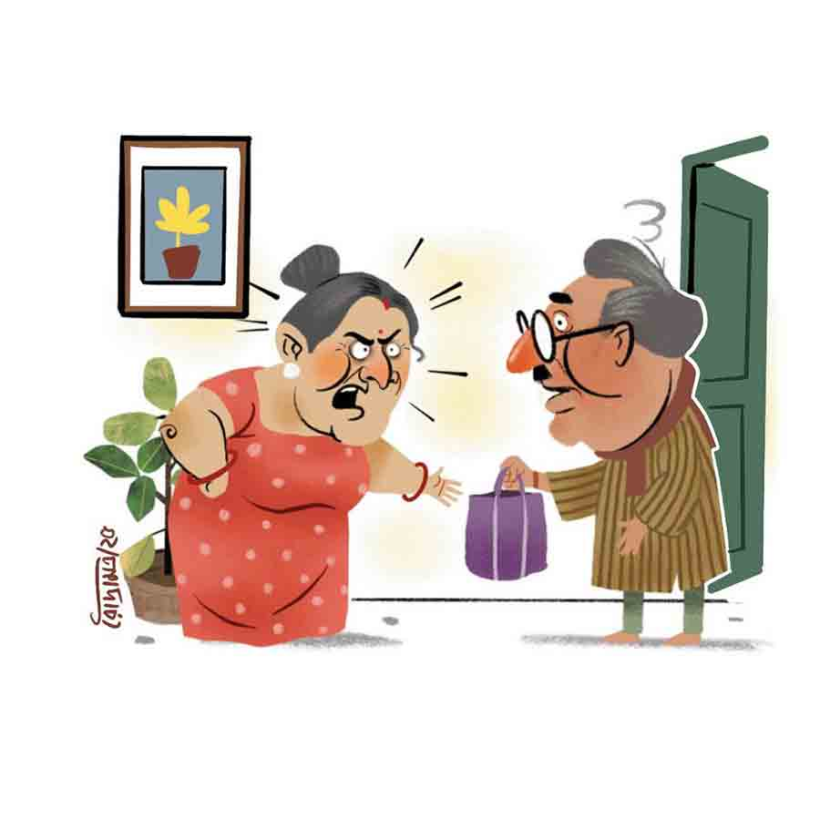

 
 <h1 align=center>দাম্পত্য রহস্য</h1>
<h2 align=center>মৌসুমী বন্দ্যোপাধ্যায়</h2> 

আজকাল রাতে ললিতার সহজে ঘুম আসে না। অনিদ্রাজনিত রোগ বা মেয়ের বিয়ে হচ্ছে না, অথবা ছেলে বেকার হয়ে ঘরে বসে আছে— এই ধরনের কোনও দুশ্চিন্তা ওঁর নেই। একটামাত্র ছেলে। বিয়ে হয়ে গেছে। চাকরিসূত্রে বৌ নিয়ে প্রবাসে সুখেই আছে। এখন বাড়িতে তিনি আর তাঁর স্বামী ভুবনবাবু। তাঁদের বিয়ের বয়স পঁয়ত্রিশ। সংসারে ঝক্কি এখন প্রায় নেই বললেই চলে। তবুও ঘটছে ঘুম না আসার মতো গুরুতর ব্যাপার।

আজকাল একটু এ দিক-ও দিক হলেই ওঁদের ঝগড়া হয়ে যায়। মতের মিল প্রায় নেই। ললিতার ধারণা, বয়স বাড়ার সঙ্গে সঙ্গে ভুবনবাবুর যুক্তি-বুদ্ধি ঠিকমতো কাজ করছে না। তাই তর্কই সম্বল।

অন্য দিকে ভুবনবাবুও ভাবেন, বয়স বাড়ার সঙ্গে সঙ্গে ললিতা ক্রমশ আরও কলহপটীয়সী হয়ে উঠেছেন। তাঁর সঙ্গে পেরে ওঠা মুশকিল।

তবে এই সব কারণে ললিতার ঘুমের অসুবিধে হওয়ার কথা নয়। ভুবনবাবুর করা নানা গোলযোগ সামলাতে সামলাতে তিনি অভ্যস্ত হয়ে উঠেছেন। তা হলে কী এমন ঘটল যে, ললিতার ঘুমের সমস্যা হচ্ছে?

সে কথায় আস্তে আস্তে আসছি।

সপ্তাহখানেক আগের কথা। ভুবনবাবু বাজার থেকে চুনোমাছ এনেছেন। দেখেই ললিতা ঝনঝনিয়ে ওঠেন, “এতগুলো চুনো মাছ! বাছবে কে? খাবেই বা কে?”

“মাছগুলো খুব টাটকা। জমিয়ে চুনো মাছের ঝাল আর টক করো।” ললিতার কথার গুরুত্ব না দিয়ে ভুবনবাবু বলেন।

“আহারে বাহারে রসনা! অ্যাঁ?”

ললিতার কথার জুতসই একটা জবাব দিতে গিয়েও ভুবনবাবু চুপ করে যান। স্ত্রী ক্ষেপে গেলে চুনোমাছের কী গতি হবে!

তবে ললিতা চুপ করেন না।

“এনেছ যখন, রান্নাঘরে ঢোকো। বড় বাটি নাও। সিঙ্কের সামনে দাঁড়িয়ে মাছগুলো বেছে ফেলো। রান্নাঘরের মেঝে যেন জল জল না হয়ে থাকে!”

“আমি! আমি কি কোনও দিন মাছ বেছেছি?” ভুবনবাবুর স্বরে অপার বিস্ময় ফুটে ওঠে।

“বাছোনি তো কী হয়েছে! সব কিছুরই একটা শুরু থাকে! আজ সেই শুরুর দিন। আজ থেকেই বাছবে। আজকাল হাতে কাজ নেই বলেই যত অকাজ করছ। এখন থেকে আমায় সমস্ত কাজকর্মে সাহায্য করাই তোমার কাজ!” কথা শেষ করে ললিতা চলে যান।

ভুবনবাবুর মুখ বিরক্তিতে ভরে ওঠে। কোথায় ভাবছিলেন বাজার নিয়ে এলেই আজকের মতো কাজ শেষ। এর পর কাগজটা ভাল করে পড়বেন। কোনও দিনই সকালে কাগজ পড়া হয় না। দু’জন মানুষের সংসার। চাকরি থেকে অবসর নিয়েছেন। তাড়াহুড়োর তো কিছু নেই। সে কথা ললিতা শুনলে তো! ভোর ছ’টায় অ্যালার্ম বাজিয়ে ভুবনবাবুর ঘুমের বারোটা বাজান। তার পর সকাল সাতটা বাজতে না বাজতে হাতে বাজারের ব্যাগ ধরিয়ে তবেই ললিতার শান্তি।

এখন ভুবনবাবু কী করবেন? মাছ বাছবেন! তাঁর কপালে বিন্দু বিন্দু ঘাম ফুটে উঠল। মনে হল, হে ভগবান! কী কুক্ষণে তাঁর মনে চুনো মাছ খাওয়ার বাসনা জেগেছিল!

এমন সময় কাজের মেয়ে মালতী এসে যাওয়ায় ভুবনবাবু হাঁপ ছেড়ে বাঁচেন! চাপা স্বরে বলেন, “মাছগুলো বেছে দে তাড়াতাড়ি। দেখিস কাকিমা যেন টের না পায়। তার আগে চট করে এক কাপ চা এনে দে তো।”

মালতী একগাল হেসে বলে, “চিন্তা কোরোনি, কাকিমা ঠাকুরঘরে ঢুকেছে। পাক্কা এক ঘণ্টা লাগবে।”

উফ! কানের পাশ দিয়ে বেরিয়ে গেছে বুলেট! ভাবতে ভাবতে ভুবনবাবু সোফায় আরাম করে বসেন। হাতঘড়িতে চোখ রাখেন। সায়ন্তীর ফোন করতে এখনও মিনিট পনেরো দেরি।

সায়ন্তী, ভুবনবাবুর পুত্রবধূ। প্রতিদিন অফিস যাওয়ার পথে ক্যাবে বসে শ্বশুরমশাইকে ফোন করে। পুত্রবধূর সঙ্গে কথা বলে ভুবনবাবুও একটু হালকা হন। কেননা, সেই কথার মধ্যে বেশির ভাগই থাকে ললিতার বিরুদ্ধে তাঁর অভিযোগ, যেগুলো সায়ন্তী ছাড়া শোনার কেউ নেই। শান্ত ভাবে শোনে সায়ন্তী।

শাশুড়ির সঙ্গে প্রথম থেকেই বনিবনা হয়নি। সায়ন্তী মানিয়ে-গুছিয়ে থাকার চেষ্টা করেনি, এমন কথা ভুবনবাবু বলতে পারবেন না। কিন্তু ললিতা ছেলের পছন্দ করা বৌকে মেনে, মনে কোনওটাই নিতে পারেননি। সেই নিয়ে সায়ন্তী কোনও কথা বলে না। বুদ্ধিমতী মেয়ে। বোঝে, কোনটা বলা উচিত আর কোনটা নয়।

সায়ন্তী না বললেও ভুবনবাবু ছাড়েন না। কারণ প্রথম থেকেই শত্রুর শত্রু, অর্থাৎ নিজের বন্ধু হিসেবে বৌমাকে চিনে নিতে ভুল হয়নি ভুবনবাবুর। ফলে উঠতে-বসতে সুযোগ পেলেই ললিতাকে কথা শোনান, “তোমার মেজাজের জন্যই তো ছেলে, ছেলের বৌ কাছে থাকল না। ওরা বুদ্ধিমান। এক বাড়িতে থেকে আলাদা হওয়া ভাল দেখায় না, সেটা ওরা বোঝে। তাই ট্রান্সফারের অছিলায় বাইরে চলে গেল। এখন সায়ন্তীও চাকরি করছে। আর এখানে ফিরবেও না। হয়তো আরও কিছু দিন পরে দেশ ছেড়ে বিদেশে পাড়ি দেবে। ওদের তো কোনও দোষ নেই। ঝামেলাবাজদের সঙ্গে সবাই দূরত্ব রেখে চলতে চেষ্টা করে।”

ললিতাও ছেড়ে দেওয়ার পাত্রী নন, “অতই যদি তোমার দরদ, যাও না, ক’টা দিন ওদের কাছে থেকে এসো। বলা তো যায় না, কবে ওরা বিদেশে চলে যায়। তুমিও ঝামেলা থেকে দূরে সরে গিয়ে নিজের হাড় জুড়িয়ে এসো। আমিও দু’দণ্ড শান্তি পাই। তোমার পিছনে খেটে খেটেই তো আমার জীবনটা শেষ হয়ে গেল! আমারও একটু বিশ্রাম হয়।”

ললিতার এই কথার পর কেন কে জানে ভুবনবাবু আর কোনও উত্তর দেন না। বিতর্কে বিরতি দিয়ে হঠাৎ ব্যস্ততার ভান করে অন্যত্র চলে যান।

*****

যত দিন যাচ্ছে ললিতা নানা ব্যাপারে ভুবনবাবুকে নিয়ে নাজেহাল হয়ে যাচ্ছেন। তার মধ্যে আবার মাস দুই হল, নতুন উপদ্রব শুরু হয়েছে। সারা দিন ফোন নিয়ে ভুবনবাবু কী সব খুটখাট করেই চলেন। স্মার্টফোন, শ্রদ্ধেয় শ্বশুরমশাইকে দেওয়া পুত্রবধূর উপহার।

“বাবা, এখন আপনার অখণ্ড অবসর। আর আপনি তো বই পড়তে ভালবাসেন। ফোনেও গোটা দুই লাইব্রেরির মতো অ্যাপ ইনস্টল করে দিয়েছি। ওখানে আপনি গল্প, উপন্যাস, কবিতা, ফিচার সব রকম পড়তে পারবেন। অনেক দেশি বিদেশি বই, পত্রপত্রিকার সংগ্রহও পেয়ে যাবেন।”

খুব খুশি হয়েছিলেন ভুবনবাবু। সেই থেকে প্রায় সারা দিন ফোনই সঙ্গী। ললিতা বিরক্ত হয়ে পড়ছেন। কোনও কাজ বললে ভুবনবাবু হয় শোনেন না, নয়তো বলেন পরে করবেন। ললিতার কথার ঝনঝনানি আরও বেড়ে যায়। সাধে কি বৌমার উপর তাঁর রাগ ধরে! একটা গাছকুঁড়ে লোককে হাতে মোবাইল ধরিয়ে বিশ্বকুঁড়ে করে দিয়ে গেছে, যাতে নিষ্কর্মা লোকটার পাল্লায় পড়ে, সংসারে সারাদিন খাটতে খাটতে ললিতার হাড়-মাস কালি হয়।

কিন্তু এতেও কি কারও ঘুমের সমস্যা হতে পারে? হওয়ার কথা নয়। তবু ললিতার হয়েছে। তার কারণ অন্য। এবার সে কথাতেই আসছি।

*****

দিনকয়েক আগের কথা। এক দিন মাঝরাতে ললিতা ঘুম ভেঙে দেখেন, ভুবনবাবু পা টিপে টিপে ঘর থেকে বেরিয়ে যাচ্ছেন। সারা দিনের পরিশ্রমের পর সচরাচর ললিতার ঘুম ভাঙে না। সেদিন ভেঙেছিল। বিছানায় শুয়েই তিনি টের পান, ভুবনবাবু গিয়ে বসার ঘরে ঢুকলেন। ঘরের আলো জ্বাললেন। তার পর কী একটা টানার শব্দ পেলেন।

শুয়ে শুয়ে ললিতা ভাবেন, এত রাতে দেরাজের ড্রয়ার খুলে কী করছে ও? বিরক্ত হন ললিতা। গজগজ করেন, “নিজের চোখে ঘুম নেই বলে যেন আর কেউ ঘুমোবে না। রাতদুপুরে যত উদ্ভট কাণ্ড!”

আজকাল রাতে ললিতার সহজে ঘুম আসে না। অনিদ্রাজনিত রোগ বা মেয়ের বিয়ে হচ্ছে না, অথবা ছেলে বেকার হয়ে ঘরে বসে আছে— এই ধরনের কোনও দুশ্চিন্তা ওঁর নেই। একটামাত্র ছেলে। বিয়ে হয়ে গেছে। চাকরিসূত্রে বৌ নিয়ে প্রবাসে সুখেই আছে। এখন বাড়িতে তিনি আর তাঁর স্বামী ভুবনবাবু। তাঁদের বিয়ের বয়স পঁয়ত্রিশ। সংসারে ঝক্কি এখন প্রায় নেই বললেই চলে। তবুও ঘটছে ঘুম না আসার মতো গুরুতর ব্যাপার।

আজকাল একটু এ দিক-ও দিক হলেই ওঁদের ঝগড়া হয়ে যায়। মতের মিল প্রায় নেই। ললিতার ধারণা, বয়স বাড়ার সঙ্গে সঙ্গে ভুবনবাবুর যুক্তি-বুদ্ধি ঠিকমতো কাজ করছে না। তাই তর্কই সম্বল।

অন্য দিকে ভুবনবাবুও ভাবেন, বয়স বাড়ার সঙ্গে সঙ্গে ললিতা ক্রমশ আরও কলহপটীয়সী হয়ে উঠেছেন। তাঁর সঙ্গে পেরে ওঠা মুশকিল।

তবে এই সব কারণে ললিতার ঘুমের অসুবিধে হওয়ার কথা নয়। ভুবনবাবুর করা নানা গোলযোগ সামলাতে সামলাতে তিনি অভ্যস্ত হয়ে উঠেছেন। তা হলে কী এমন ঘটল যে, ললিতার ঘুমের সমস্যা হচ্ছে?

সে কথায় আস্তে আস্তে আসছি।

সপ্তাহখানেক আগের কথা। ভুবনবাবু বাজার থেকে চুনোমাছ এনেছেন। দেখেই ললিতা ঝনঝনিয়ে ওঠেন, “এতগুলো চুনো মাছ! বাছবে কে? খাবেই বা কে?”

“মাছগুলো খুব টাটকা। জমিয়ে চুনো মাছের ঝাল আর টক করো।” ললিতার কথার গুরুত্ব না দিয়ে ভুবনবাবু বলেন।

“আহারে বাহারে রসনা! অ্যাঁ?”

ললিতার কথার জুতসই একটা জবাব দিতে গিয়েও ভুবনবাবু চুপ করে যান। স্ত্রী ক্ষেপে গেলে চুনোমাছের কী গতি হবে!

তবে ললিতা চুপ করেন না।

“এনেছ যখন, রান্নাঘরে ঢোকো। বড় বাটি নাও। সিঙ্কের সামনে দাঁড়িয়ে মাছগুলো বেছে ফেলো। রান্নাঘরের মেঝে যেন জল জল না হয়ে থাকে!”

“আমি! আমি কি কোনও দিন মাছ বেছেছি?” ভুবনবাবুর স্বরে অপার বিস্ময় ফুটে ওঠে।

“বাছোনি তো কী হয়েছে! সব কিছুরই একটা শুরু থাকে! আজ সেই শুরুর দিন। আজ থেকেই বাছবে। আজকাল হাতে কাজ নেই বলেই যত অকাজ করছ। এখন থেকে আমায় সমস্ত কাজকর্মে সাহায্য করাই তোমার কাজ!” কথা শেষ করে ললিতা চলে যান।

ভুবনবাবুর মুখ বিরক্তিতে ভরে ওঠে। কোথায় ভাবছিলেন বাজার নিয়ে এলেই আজকের মতো কাজ শেষ। এর পর কাগজটা ভাল করে পড়বেন। কোনও দিনই সকালে কাগজ পড়া হয় না। দু’জন মানুষের সংসার। চাকরি থেকে অবসর নিয়েছেন। তাড়াহুড়োর তো কিছু নেই। সে কথা ললিতা শুনলে তো! ভোর ছ’টায় অ্যালার্ম বাজিয়ে ভুবনবাবুর ঘুমের বারোটা বাজান। তার পর সকাল সাতটা বাজতে না বাজতে হাতে বাজারের ব্যাগ ধরিয়ে তবেই ললিতার শান্তি।

এখন ভুবনবাবু কী করবেন? মাছ বাছবেন! তাঁর কপালে বিন্দু বিন্দু ঘাম ফুটে উঠল। মনে হল, হে ভগবান! কী কুক্ষণে তাঁর মনে চুনো মাছ খাওয়ার বাসনা জেগেছিল!

এমন সময় কাজের মেয়ে মালতী এসে যাওয়ায় ভুবনবাবু হাঁপ ছেড়ে বাঁচেন! চাপা স্বরে বলেন, “মাছগুলো বেছে দে তাড়াতাড়ি। দেখিস কাকিমা যেন টের না পায়। তার আগে চট করে এক কাপ চা এনে দে তো।”

মালতী একগাল হেসে বলে, “চিন্তা কোরোনি, কাকিমা ঠাকুরঘরে ঢুকেছে। পাক্কা এক ঘণ্টা লাগবে।”

উফ! কানের পাশ দিয়ে বেরিয়ে গেছে বুলেট! ভাবতে ভাবতে ভুবনবাবু সোফায় আরাম করে বসেন। হাতঘড়িতে চোখ রাখেন। সায়ন্তীর ফোন করতে এখনও মিনিট পনেরো দেরি।

সায়ন্তী, ভুবনবাবুর পুত্রবধূ। প্রতিদিন অফিস যাওয়ার পথে ক্যাবে বসে শ্বশুরমশাইকে ফোন করে। পুত্রবধূর সঙ্গে কথা বলে ভুবনবাবুও একটু হালকা হন। কেননা, সেই কথার মধ্যে বেশির ভাগই থাকে ললিতার বিরুদ্ধে তাঁর অভিযোগ, যেগুলো সায়ন্তী ছাড়া শোনার কেউ নেই। শান্ত ভাবে শোনে সায়ন্তী।

শাশুড়ির সঙ্গে প্রথম থেকেই বনিবনা হয়নি। সায়ন্তী মানিয়ে-গুছিয়ে থাকার চেষ্টা করেনি, এমন কথা ভুবনবাবু বলতে পারবেন না। কিন্তু ললিতা ছেলের পছন্দ করা বৌকে মেনে, মনে কোনওটাই নিতে পারেননি। সেই নিয়ে সায়ন্তী কোনও কথা বলে না। বুদ্ধিমতী মেয়ে। বোঝে, কোনটা বলা উচিত আর কোনটা নয়।

সায়ন্তী না বললেও ভুবনবাবু ছাড়েন না। কারণ প্রথম থেকেই শত্রুর শত্রু, অর্থাৎ নিজের বন্ধু হিসেবে বৌমাকে চিনে নিতে ভুল হয়নি ভুবনবাবুর। ফলে উঠতে-বসতে সুযোগ পেলেই ললিতাকে কথা শোনান, “তোমার মেজাজের জন্যই তো ছেলে, ছেলের বৌ কাছে থাকল না। ওরা বুদ্ধিমান। এক বাড়িতে থেকে আলাদা হওয়া ভাল দেখায় না, সেটা ওরা বোঝে। তাই ট্রান্সফারের অছিলায় বাইরে চলে গেল। এখন সায়ন্তীও চাকরি করছে। আর এখানে ফিরবেও না। হয়তো আরও কিছু দিন পরে দেশ ছেড়ে বিদেশে পাড়ি দেবে। ওদের তো কোনও দোষ নেই। ঝামেলাবাজদের সঙ্গে সবাই দূরত্ব রেখে চলতে চেষ্টা করে।”

ললিতাও ছেড়ে দেওয়ার পাত্রী নন, “অতই যদি তোমার দরদ, যাও না, ক’টা দিন ওদের কাছে থেকে এসো। বলা তো যায় না, কবে ওরা বিদেশে চলে যায়। তুমিও ঝামেলা থেকে দূরে সরে গিয়ে নিজের হাড় জুড়িয়ে এসো। আমিও দু’দণ্ড শান্তি পাই। তোমার পিছনে খেটে খেটেই তো আমার জীবনটা শেষ হয়ে গেল! আমারও একটু বিশ্রাম হয়।”

ললিতার এই কথার পর কেন কে জানে ভুবনবাবু আর কোনও উত্তর দেন না। বিতর্কে বিরতি দিয়ে হঠাৎ ব্যস্ততার ভান করে অন্যত্র চলে যান।

*****

যত দিন যাচ্ছে ললিতা নানা ব্যাপারে ভুবনবাবুকে নিয়ে নাজেহাল হয়ে যাচ্ছেন। তার মধ্যে আবার মাস দুই হল, নতুন উপদ্রব শুরু হয়েছে। সারা দিন ফোন নিয়ে ভুবনবাবু কী সব খুটখাট করেই চলেন। স্মার্টফোন, শ্রদ্ধেয় শ্বশুরমশাইকে দেওয়া পুত্রবধূর উপহার।

“বাবা, এখন আপনার অখণ্ড অবসর। আর আপনি তো বই পড়তে ভালবাসেন। ফোনেও গোটা দুই লাইব্রেরির মতো অ্যাপ ইনস্টল করে দিয়েছি। ওখানে আপনি গল্প, উপন্যাস, কবিতা, ফিচার সব রকম পড়তে পারবেন। অনেক দেশি বিদেশি বই, পত্রপত্রিকার সংগ্রহও পেয়ে যাবেন।”

খুব খুশি হয়েছিলেন ভুবনবাবু। সেই থেকে প্রায় সারা দিন ফোনই সঙ্গী। ললিতা বিরক্ত হয়ে পড়ছেন। কোনও কাজ বললে ভুবনবাবু হয় শোনেন না, নয়তো বলেন পরে করবেন। ললিতার কথার ঝনঝনানি আরও বেড়ে যায়। সাধে কি বৌমার উপর তাঁর রাগ ধরে! একটা গাছকুঁড়ে লোককে হাতে মোবাইল ধরিয়ে বিশ্বকুঁড়ে করে দিয়ে গেছে, যাতে নিষ্কর্মা লোকটার পাল্লায় পড়ে, সংসারে সারাদিন খাটতে খাটতে ললিতার হাড়-মাস কালি হয়।

কিন্তু এতেও কি কারও ঘুমের সমস্যা হতে পারে? হওয়ার কথা নয়। তবু ললিতার হয়েছে। তার কারণ অন্য। এবার সে কথাতেই আসছি।

*****

দিনকয়েক আগের কথা। এক দিন মাঝরাতে ললিতা ঘুম ভেঙে দেখেন, ভুবনবাবু পা টিপে টিপে ঘর থেকে বেরিয়ে যাচ্ছেন। সারা দিনের পরিশ্রমের পর সচরাচর ললিতার ঘুম ভাঙে না। সেদিন ভেঙেছিল। বিছানায় শুয়েই তিনি টের পান, ভুবনবাবু গিয়ে বসার ঘরে ঢুকলেন। ঘরের আলো জ্বাললেন। তার পর কী একটা টানার শব্দ পেলেন।

শুয়ে শুয়ে ললিতা ভাবেন, এত রাতে দেরাজের ড্রয়ার খুলে কী করছে ও? বিরক্ত হন ললিতা। গজগজ করেন, “নিজের চোখে ঘুম নেই বলে যেন আর কেউ ঘুমোবে না। রাতদুপুরে যত উদ্ভট কাণ্ড!”

বাড়িতে তিনটে ঘর। দুটো শোয়ার ঘর, অন্যটা বসার ঘর। বসার ঘরে ভুবনবাবু পড়াশোনা করেন। এখন আলাদা করে সেভাবে বসার ঘরে বসানোর মতো বাইরের লোকজন আসে না। ভুবনবাবু নিজের মতো করে ঘরটা গুছিয়ে নিয়েছেন। আত্মীয়-পরিজন এলে ললিতা ছেলে-বৌয়ের ঘরে বসান। ব্যাপারটা ভুবনবাবুর পছন্দ নয়। তিনি জানেন, আপত্তি করলে ললিতা শুনবেন না। কথা কাটাকাটি করতে সব সময় ইচ্ছে করে না। ললিতার যুক্তি, ব্যবহার না করলে যে কোনও জিনিসই নষ্ট হয়ে যায়, ঘরে ধুলো পড়ে, নোংরা জমে।

ভুবনবাবু রোজকার মতো বাজার সেরে এসে চা খান। এই সময়টা ললিতা স্নান, পুজো নিয়ে ব্যস্ত থাকেন। মালতী চা নিয়ে আসে। কিন্তু আজ হঠাৎ মালতীর বদলে ললিতাকে হাতে চায়ের কাপ নিয়ে এসে দাঁড়াতে দেখে অবাক হন ভুবনবাবু।

কোনও রকম ভণিতা না করে ললিতা বলেন, “একটা কথা বলি। মন দিয়ে শোনো। বয়স বাড়ছে। ঘুমের সমস্যা হতেই পারে। তা ছাড়া সারা দিনে কাজকর্ম বলতে তো কিছু নেই। একটা কুটো পর্যন্ত নেড়ে দুটো করো না। পরিশ্রম না হলে ঘুম আসবে কী করে? যাই হোক, দরকার মনে করলে ডাক্তারের কাছে যাও, ওষুধপত্র খাও। মাঝরাতে ঘর থেকে পা টিপে টিপে বেরিয়ে পাশের ঘরে খুটখাট, ঘটাংঘট শব্দ করে অন্যের ঘুম নষ্ট কোরো না।”

ভুবনবাবু চমকে ওঠেন ললিতার কথায়। ললিতার সেটা চোখে পড়লেও এড়িয়ে যান।

*****

ভুবনবাবুর ব্যাপারটা ললিতা হালকা ভাবে নিলেও রমিতা পারেন না। রমিতা, ললিতার একমাত্র বোন। বয়সের সঙ্গে সঙ্গে দুই বোনের পারস্পরিক টান আরও বেড়েছে। একে অপরের কাছে সব কথা বলতে না পারলে হাঁপিয়ে ওঠেন।

ললিতার মুখে সব শুনে রমিতা গম্ভীর ভাবে বলেন, “ব্যাপারটা আমার একেবারেই ভাল ঠেকছে না। সারাক্ষণ জামাইবাবুর সঙ্গে ঝগড়াঝাঁটি করে যাচ্ছিস। অথচ কোন বিষয়টায় গুরুত্ব দিতে হবে, সে দিকে খেয়াল নেই! এই বয়সটা ভাল নয়, কত রকম গোলমাল হতে পারে, তোর কোনও আন্দাজ আছে! আমার মনে হয় তোর এখন জামাইবাবুর উপর কড়া নজর রাখা উচিত।”

“নজর রাখব মানে?” ললিতা অবাক হন। কিছুটা বিরক্তও। কী বলতে চাইছে রমিতা! “হেঁয়ালি না করে যা বলতে চাইছিস পরিষ্কার করে খুলে বল তো!”

“আমিও কি ঠিক বুঝতে পারছি, যে গুছিয়ে বলব! তবে এটুকু বুঝতে পারছি, জামাইবাবু এমন কোনও গোপন কাজ করছেন, যা তোকে জানাতে চান না। হয়তো তুই জানতে পারলে সেটা মেনে নিতে পারবি না। এমনটাও হতে পারে, এই বয়সে এসে তোদের ডিভোর্সের কেস ফাইল করতে হল।”

রমিতার কথায় এ বার ললিতা ভয় পেয়ে যান। কী এমন বিষয় থাকতে পারে যেটা ভুবনবাবু তাঁর কাছ থেকে লুকোতে চাইছেন! যে বিষয়টা তিনি গুরুত্বই দেননি, সেটা এতটাই জটিল! কী বলতে চাইছে রমিতা? ভুবনবাবুর কি এই বয়সে নতুন করে কাউকে... কী কাণ্ড! গোলমেলে ভাবনাটাকে আর এগোতে না দিয়েই মনেই ধামাচাপা দিতে চেষ্টা করলেন ললিতা।

এখন শুধু রাতে নয়, ভরদুপুরে ললিতা শুয়ে পড়লে ভুবনবাবু বসার ঘরের দরজা বন্ধ করে কী সব করছেন। লুকিয়ে করতে চাইলেও ললিতা দেখে ফেলেছেন। যদিও ললিতা যে দেখেছেন, সে কথা ভুবনবাবুকে জানতে দেননি।

দিন দুই আগের কথা। বসার ঘরের জানলায় উঁকি দিতে ললিতা দেখেন, ভুবনবাবু দেরাজের ড্রয়ার খুলে একমনে কী সব দেখছেন। কোনও দিকে খেয়াল নেই। ললিতা ঠিক করে রাখেন, বিকেলে ভুবনবাবু হাঁটতে গেলে ওই সময় উনি দেরাজ খুলে দেখবেন।

অমন মন দিয়ে কী দেখছেন ভুবনবাবু? কারও ফোটো? কার? না কোনও দলিল-দস্তাবেজ? হঠাৎ করে বড়সড় টাকা, সম্পত্তি পাওয়ার খবর এসেছে নাকি? স্ত্রীকে লুকোচ্ছেন? নাকি পুত্রবধূর সঙ্গে তাকে জব্দ করার কোনও গুরুতর ষড়যন্ত্র? নাকি তিনি যা ভাবতে চাইছিলেন না কিছুতেই, সেই দুর্ঘটনাই ঘটে গেল? বেশি বয়সে তো কত রকমেরই ভীমরতি হয় মানুষের! খবরের কাগজে খবর বেরোয়, বৃদ্ধবয়সে তরুণীকে বিবাহ! বুক ধক করে ওঠে ললিতার।

বিকেলে স্বামী বেরিয়ে যেতে ললিতা দেরি করেন না। সেই দেরাজ খোলেন এবং হতাশ হন। কোথায় কী! কিছু পুরনো কাগজপত্র ছাড়া কিছুই নেই। একটা একটা করে দেখেন। পুরনো প্রেসক্রিপশন, কাপড়জামা কেনার বিল, মুদিখানার পুরনো হিসেবের খাতা, ধোপাবাড়িতে দেওয়া কাপড়ের লিস্ট।

এইগুলো দেখেন ভুবনবাবু! এই তুচ্ছ, ফেলে দেওয়া কাগজপত্র দেখার জন্য এত গোপনীয়তা? হতেই পারে না। নিশ্চয়ই অন্য কিছু আছে। তা হলে কি ভুবনবাবু সব কিছু সরিয়ে রেখে গেলেন?

রাগ বাড়তে থাকে ললিতার। নজরদারি আরও বাড়ান। কিন্তু নজর রাখাই সার। ঘর, বাড়ি তন্নতন্ন করে খুঁজেও খেয়াল করার মতো কিছু পাওয়া গেল না। সবই পুরনো জিনিসপত্র। ছেলের ছোটবেলার ঝুমঝুমি, লাট্টু, তাঁর হারিয়ে যাওয়া নকশাকাটা চুলের কাঁটা, ভুবনবাবুর পাঞ্জাবির আধভাঙা স্টিলের বোতাম। খোঁজাখুজির জন্য ঘরের দেরাজ, আলমারির চারটে তাক, কাঠের টেবিল, জানলার মাথার শো-কেস পরিষ্কার করা হয়ে গেল। বলার মতো, দেখার মতো কিছুই নেই।

তা হলে ভুবনবাবুর কিসের টানে এমন আচরণ করছেন! কিসের জন্য এমন কঠিন গোপনীয়তা!

অবশেষে ললিতা খুঁজে পেলেন। নিশ্চয়ই ভুবনবাবু বুঝতে পারছিলেন, স্ত্রী সন্দেহ করছে। সেই জন্য ‘গোপন জায়গা’র থেকে আরও ‘গোপন জায়গা’ বার করেছেন। কিন্তু ললিতাও কিছু কম যান না! নাছোড়বান্দা গোয়েন্দার মতো তল্লাশি চালিয়ে ললিতা সেই ‘গোপন জায়গা’ এবং ‘গোপন জিনিসের’ সন্ধান পেলেন।

কাঠের আলমারির পিছন দিকে লুকোনো ছোট একটা বাক্স। বাক্স খুলতে বেরিয়ে পড়ল একগোছা কাগজ। কাগজ নয়, চিঠি। যে-সে চিঠি নয়, প্রেমপত্র। ভুবনবাবুকে লেখা ললিতার চিঠি। বিয়ের কথা পাকা হওয়ার পর তরুণী ললিতার লেখা। পাত্র ভুবনের উত্তরও রয়েছে। বিয়ের পর ভুবনবাবুকে অফিসের কাজে বাইরে বাইরে ঘুরতে হত। সেই সময়ও চিঠি চালাচালি কম হয়নি। মোবাইল ফোন তো ছিল না। অনেক চিঠি রয়েছে। এত যত্ন করে চিঠিগুলো ও রেখে দিয়েছে! এই বয়সেও কি গাল আরক্ত হল ললিতার? আলতো ভাবে চিঠিগুলোর উপর হাত রাখলেন। যেন ফেলে আসা সময় আর বয়ে আনা ভালবাসাকে ছুঁলেন। চোখদুটো চিকচিক করে উঠল। চিঠিগুলো আবার বাক্সবন্দি করে আগের মতো আলমারির পিছনে রেখে দিলেন ললিতা। মুখে মিটিমিটি হাসি। থাক, ও যেন বুঝতে না পারে।

*****

স্মার্টফোন যেন এক জাদুনগরী। এক রাস্তায় ঘুরতে ঘুরতে আরও কত যে রাস্তার সন্ধান মেলে, তার লেখাজোখা নেই! ভুবনবাবু অনলাইনে বইপত্র পড়তে পড়তেই অনলাইনে কেনাকাটা করতে শিখে গিয়েছেন। শিখেই একটা কেলেঙ্কারি করেছেন। একটা হলুদ রঙের শাড়ি কিনে ফেলেছেন। সম্ভবত স্ত্রীর মাথা ঠান্ডা রাখতে ‘চমক দেওয়া ঘুষ’। কিন্তু শাড়ি দেখে ললিতার মাথায় ডবল আগুন ধরেছে। এক নম্বর আগুনের কারণ, বুড়ো বয়সে এ কী আদিখ্যেতা! আগে কোনও দিন নিজে থেকে একা একা শাড়ি কিনে এনেছে? তবে? আর দু’নম্বর আগুনের কারণ, শাড়ির রং। এমন রঙের শাড়ি কে পরবে? এই বয়সে কি তাঁকে মানাবে?

ললিতা বলেন, “এটা একটা শাড়ি হল! যে ভাবে হোক ফেরত দাও। এখনই দাও। দরকার হলে মুড়ে পাকিয়ে তোমার মোবাইল ফোনের ভিতরে সেঁধিয়ে দাও। যত সব জঞ্জাল! আমার চোখের সামনে যেন এক মুহূর্ত না থাকে।”

কথা বলতে বলতে দুপদাপ আওয়াজ করে ললিতা ঘরের পর্দা সরিয়ে বেরোতে গিয়ে থমকে দাঁড়িয়ে যান। পিছনে ফিরে ভুবনবাবুকে দেখেন। পরমুহূর্তে দ্রুত ঘর থেকে বেরিয়ে যান।

আর ভুবনবাবু? কিছু একটা বলতে গিয়েও চুপ করে যান।

ললিতা চলে যাওয়ার পর ভুবনবাবু খানিকক্ষণ থম মেরে বসে থাকেন। তার পর ফোন খুলে বসেন। শাড়িটা ফেরত দেওয়ার সুলুকসন্ধান করতে হবে। ‘রিটার্ন পলিসি’ বলে কী যেন একটা থাকে, সেটা পড়ে দেখতে হবে। কী ভাবে করবেন কিছুই জানা নেই। টেনশনে কপালটা টিপ-টিপ করছে ওঁর।

এই সময়ে এক কাপ চা খেতে পারলে ভাল হত। তবে ললিতার এখন যা মেজাজ, তাতে চায়ের কথা বলতে সাহস হল না।

“আবার তুমি ফোন নিয়ে বসেছ! ঝামেলার চূড়ান্ত না করে ছাড়বে না দেখছি!” ললিতা কখন ঘরে এসেছে ভুবনবাবু টের পাননি। হাতে ধোঁয়া-ওঠা চায়ের কাপ, “নাও, ফোনটা রেখে চা-টা খেয়ে উদ্ধার করো...” ললিতা চায়ের কাপ এগিয়ে দেন।

“প্রাণটা খুব চা-চা করছিল। কী করে বুঝে যাও বলো তো?” ভুবনবাবু বিগলিত গলায় বলেন।

“থাক, অনেক হয়েছে। আর আদিখ্যেতা করতে হবে না! আবার ফোন নিয়ে কী খুটুরখাটুর হচ্ছিল?” ললিতা প্রশ্ন করেন।

“না মানে, ওই শাড়িটা তো ফেরত দিতে হবে, তাই...”

ললিতা হাত তুলে ভুবনবাবুকে থামিয়ে দিয়ে বলেন, “থাক। অনেক করেছ, আর কেরদানির দরকার নেই। শাড়িটা থাক। এর পর থেকে যখন আমার জন্য কিছু অর্ডার করবে, আমায় দেখিয়ে করবে। বুঝেছ?”

ভুবনবাবু তড়িঘড়ি বলে ওঠেন, “সে আর বলতে!” তার পর গোপনে স্বস্তির নিঃশ্বাস ফেলেন।

উঠে ফের রান্নাঘরের দিকে পা বাড়ালেন ললিতা।

ভুবনবাবুকে শাড়ি ফেরত দিতে বারণ করার কারণ অন্য। প্রথমে রেগে গেলেও, পরে ভেবেচিন্তে ললিতার মনে হয়েছে, চাঁপাফুলের মতো শাড়ির রংটা তাঁকে খারাপ মানাবে না। লোকটার পছন্দটা একেবারে মন্দ নয়। কথাটা ফের মনে হতে মেঘভাঙা রোদের মতো সলজ্জ হাসি খেলে যায় ললিতার মুখে। ভুবনবাবুর অলক্ষ্যে।

(এই প্রতিবেদনটি আনন্দবাজার পত্রিকার মুদ্রিত সংস্করণ থেকে নেওয়া হয়েছে)

