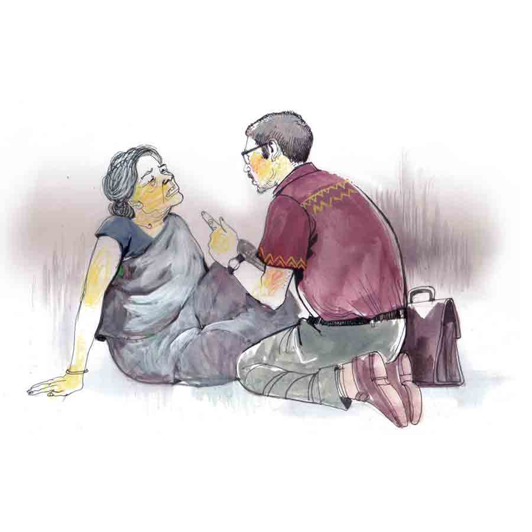

 
 <h1 align=center>পিসিমার ঘরবাড়ি</h1>
<h2 align=center>তমাল বন্দ্যোপাধ্যায়</h2> 

হাড়ের ডাক্তার হিসেবে এই টাউনে তাঁর পসার তুঙ্গে, তবুও বিলাসিতা ব্যাপারটা কোনও কালেই ধাতে নেই ডাক্তার পালের। বাড়ির গ্যারাজে দু’-দুটো দামি চারচাকা, ড্রাইভার মানিক দিনরাত হামেহাল, তবু একা কোথাও যেতে হলে চিরকাল ট্রেনই তাঁর পছন্দের। আজও যেমন হঠাৎই কলকাতায় জরুরি কাজ এসে পড়ায় তাড়াহুড়োর মধ্যে স্টেশনে আসতে হয়েছে তাঁকে, প্যাচপেচে গরমের মধ্যে টিকিট-কাউন্টারের লম্বা লাইনের পিছনে দাঁড়িয়ে থাকতে হচ্ছে নিজের টিকিটটি কাটার অপেক্ষায়।

অবশেষে কাউন্টারের গর্তের সামনে এসে পড়ার পরেও দেখা দিল বিপত্তি। কলকাতা পর্যন্ত লোকাল ট্রেনের টিকিটের দাম পঁচিশ টাকা, কিন্তু কাউন্টারের রেলওয়ে স্টাফ একশো টাকার নোট ভাঙিয়ে দিতে পারছে না। ফলে ডাক্তারবাবু পড়ে গেছেন ফ্যাসাদে। পাশের লোকটা কাউন্টারের ঠিক নীচে, মেঝেয় থেবড়ে বসে থাকা এক সত্তর ছুঁই-ছুঁই বুড়ি ভিখিরির দিকে তর্জনী দেখিয়ে বলল, “এই বুড়িকে দিন, ভাঙিয়ে দেবে।”

ভাবার সময় নেই, তাই ডাক্তার দ্রুত একশো টাকার নোটটা বুড়ির দিকে এগিয়ে দিয়ে বলে উঠলেন, “টাকাটা তাড়াতাড়ি একটু ভাঙিয়ে দেবেন পিসিমা, না হলে এই ট্রেনটা ধরতে পারব না।”

বুড়ি দেরি করেনি। এক হাতে ময়লাটে সাদা কাপড়ের খুঁট থেকে একটা ভাঁজ খাওয়া পঞ্চাশ, দুটো কুড়ি টাকার নোট আর এক জোড়া পাঁচ টাকার কয়েন ডাক্তারের দিকে এগিয়ে দিয়েছে, অন্য হাতে ওঁর হাত থেকে নিজের মুঠোর মধ্যে নিয়ে নিয়েছে একশোর নোটটা। ফেরত পাওয়া একটা পাঁচের কয়েন বুড়ির বাড়ানো ফুটিফাটা চামড়ার হাতে গুঁজে দিয়ে, ওভারব্রিজ পেরিয়ে প্রায় ছুটে তিন নম্বর প্ল্যাটফর্মে যেতে হলেও ট্রেন মিস হয়নি ডাক্তারের।

কাজকর্ম সব মিটিয়ে রাতটা দমদমে নিজের ফ্ল্যাটে কাটিয়ে পরের দিন ফিরবেন ভেবে রেখেছিলেন, কিন্তু কাজটা ঝটপট হয়ে যাওয়ায় শেষ লোকালে ফিরে আসার সিদ্ধান্ত নিলেন বাড়িতে। ক্লান্ত ছিলেন, ফেরার পথের শেষ দিকে এতটাই তলিয়ে গিয়েছিলেন ঘুমের গভীরে যে, ফাঁকা হয়ে আসা ট্রেনটা দীর্ঘ অন্ধকার পেরিয়ে কখন যে ঝমঝমিয়ে আলো ঝলমলে এক নম্বর প্ল্যাটফর্মে ঢুকে পড়েছে, জোরালো ঝাঁকুনি দিয়ে থেমে কামরা ফাঁকা করতে লেগেছে, কিছুই টের পাননি তিনি।

এক ঝালমুড়িয়ালা ডেকে না দিলে ট্রেনটা ওঁকে নিয়ে ফিরেও যেতে পারত শিয়ালদা। যাই হোক, ওভারব্রিজ পেরিয়ে সামনেই সেই টিকিট কাউন্টার লাগোয়া থার্ড ক্লাস ওয়েটিং রুমের এই বিশাল চাতালটা স্টেশন থেকে বাইরে বেরনোর সবচেয়ে ভাল শর্টকাট। যাত্রীরা কেউ নেই এখন, রাত বাড়ার সঙ্গে সঙ্গে এটা পুরোপুরি চলে গেছে প্ল্যাটফর্মের ভিখারিদের দখলে, হয়ে উঠেছে ওদের অঘোষিত নিদ্রাপুরী। চার দিকে মেঝের উপর যেখানেই চোখ পড়ছে, ইতস্তত বিক্ষিপ্ত ভাবে পাতা ওদের ধূলিধূসর সব বিছানা, যার উপর শুয়ে মহাসুখে ঘুমোচ্ছে অসংখ্য অন্ধ, খঞ্জ, আতুর, নানা ধরনের বিকলাঙ্গ, উন্মাদ, বিকৃতদর্শন নরনারী। তাকালেই মনে হতে পারে, বাতিল জিনিসপত্র ফেলার জন্য রাস্তার ধারে যেমন ডাস্টবিন আছে, বাতিল মানুষ ফেলার জন্য আছে এই রেলওয়ে স্টেশনগুলো।

দিনের বেলায় যে কাউন্টারে টিকিট কেটেছিলেন, সেটার পাশ দিয়ে যাওয়ার সময় পায়ের কাছের বিছানাটার দিকে চোখ যেতেই নজরে পড়ল— সেই বুড়িটা। কাত হয়ে তেরছা ভাবে শুয়ে একটা লাইটার দিয়ে মশা তাড়ানোর ধূপ জ্বালানোর চেষ্টা করছে, কিন্তু বুড়ো আঙুল দিয়ে চাকা ঘুরিয়ে লাইটারটা থেকে আগুন বার করতে পারছে না কিছুতেই। গতি থামান ডাক্তার, হাঁটু ভাঁজ করে বসেন বুড়ির পাশে। হাত থেকে লাইটারটা নিয়ে ধূপটার মুখে আগুন ধরিয়ে দিয়ে জিজ্ঞেস করেন, “আমাকে চিনতে পারছেন, সেই যে দুপুরে আমার টাকা ভাঙিয়ে দিয়েছিলেন...”

বুড়ির ঘোলাটে চোখে চিনতে পারার কোনও চিহ্ন ফুটে উঠল না । শ্লেষ্মা জড়ানো গলায় বলল, “রাত হলে কাউরে চিনতে পারি না বাবা। তার ওপর কোমরে-পায়ে যা ব্যথা, রাতে ঘুমুতে পারি না।”

যন্ত্রণার তলানি থেকে ঠেলে উঠে আসা মোচড়ানি মুখের ভাঁজগুলোকে প্রকট করে তুলছে। ঘড়িতে সাড়ে এগারোটা বেজে গেছে, বাইরে স্ট্যান্ডে আর রিকশা বা টোটো নেই। মানিক গাড়ি নিয়ে পৌঁছতে আরও মিনিট পাঁচেক লাগাবে এখনও। হাতে কিছুটা সময় আছে বুঝে ডাক্তার বলেন, “কোথায় ব্যথা, কিসের ব্যথা বলো তো দেখি...”

“আর বোলো না বাবা, আমাদের গেরামে এক ভ্যানয়ালা এমুন জোর ধাক্কা দিয়েল যে, মাজা ভেঙে সেই যে পড়লাম আর উঠতি পারলাম না । দাঁড়াতে পারি না আর, পাছা ছেঁচড়ে ছেঁচড়ে যেটুকু যাই ওট্টুকুই। আজ বছর চার হল পিরায়, এই পিলাটফমেই ছেঁচড়ে-ছেঁচড়ে যা পাই, তাতেই খাই।”

“ধাক্কা লাগার পর হাসপাতালে নিয়ে যায়নি কেউ? ডাক্তারকে দেখাওনি?”

“নিই গিইছিল তো। ডাক্তার বলেল, অনেক কাটাকাটি করতি হবে, হাসপাতালে হবি না, করতি গেলি না কি মরি যাব, অনেক ট্যাকা খরচাও হবে...”

“তাই নাকি! শুনুন মাসিমা, আমি এখানকার বড় হাসপাতালের হাড়ের ডাক্তার। আমাকে আপনার পা আর কোমরটা একটু দেখাতে পারবেন, লজ্জার কিছু নেই, ডাক্তারের কাছে লজ্জা করতে নেই...”

আশপাশে কেউই প্রায় জেগে নেই আঁচ করে নিয়ে বুড়ি হাঁটুর উপর থেকে কাপড়টা বেশ খানিকটা তুলে ধরলে ডাক্তার ব্যথার জায়গাটা ভাল করে দেখলেন। কোমরটা দেখাতে বললে বুড়ি এক বার ডাক্তারের চোখের দিকে তাকাল, তার পর খুব কষ্ট করে কোমরের কাপড়টা পিছনের দিক থেকে নামিয়ে ধরল কিছুটা।

ডাক্তার এই ভাবে যতখানি দেখা সম্ভব দেখে কাপড়ের প্রান্তগুলো আগের জায়গায় এনে দিতে দিতে বুঝলেন, অবস্থা খুবই সঙ্গিন, কিন্তু চিকিৎসার বাইরে নয়। বুড়ির শরীর-স্বাস্থ্য এখনও যেমন আছে, সার্জারির ধকল সামলাতে অসুবিধা হওয়ার কথা নয়। কেন যেন রাতের এই শ্রান্ত, কোমল, থিতিয়ে পড়া আলোয় বৃদ্ধাকে তাঁর খুব চেনা মনে হল। দেখতে অনেকটা যেন ওঁর পিসি-ঠাকুমার মতো, বাবার এক দূরসম্পর্কের পিসি, বিধবা। স্বামী হারানোর পর ছেলে-মেয়েকে নিয়ে ওঁদের পরিবারেই আশ্রয় পেয়েছিলেন আমৃত্যু।

“সব ব্যথা চলে যাবে। আবার আগের মতো হাঁটতে চাও?” আত্মবিশ্বাসী গলায় বলেন ডাক্তার।

শুনে বুড়ির পাংশুটে মুখটা মুহূর্তে ঝলমল করে উঠল। জ্বলে উঠল চোখজোড়া। কথা বেরল না মুখ দিয়ে, তবে এ ক্ষেত্রে আন্দাজ করে নিতে অসুবিধা হয় না, অতিরিক্ত আনন্দে কী বলবে বুঝে উঠতে পারছে না। ডাক্তার পকেট থেকে ওঁর একটা কার্ড বুড়ির হাতে দিয়ে বলে, “কাল আত্মীয়স্বজন কাউকে নিয়ে দুপুরের দিকে এক বার জেলা হাসপাতালে আসতে পারবে? আমি ব্যথার জায়গাগুলোর ফোটো তুলে আর এক বার দেখব। গ্যারান্টি দিয়ে যাচ্ছি, তুমি একেবারে ঠিক হয়ে যাবে। ব্যথাবেদনা আর থাকবে না তো বটেই, কথা দিয়ে যাচ্ছি, তোমাকে যদি আবার আগের মতো না হাঁটাতে পারি, আমার নাম ডাক্তার নির্বাণ পাল নয়।”

“কিন্তু আমার তো আর কুনো আত্মীয়স্বজন নেই, সেই যে ফেলে রেখে চলে গিইছিল আর কেউ খোঁজখবর নেইনি। এখানকার ভিকিরিরাই আমার সব কিছু, ওদের বলে দেখি নিই যায় কি না।”

হাড়ের ডাক্তার হিসেবে এই টাউনে তাঁর পসার তুঙ্গে, তবুও বিলাসিতা ব্যাপারটা কোনও কালেই ধাতে নেই ডাক্তার পালের। বাড়ির গ্যারাজে দু’-দুটো দামি চারচাকা, ড্রাইভার মানিক দিনরাত হামেহাল, তবু একা কোথাও যেতে হলে চিরকাল ট্রেনই তাঁর পছন্দের। আজও যেমন হঠাৎই কলকাতায় জরুরি কাজ এসে পড়ায় তাড়াহুড়োর মধ্যে স্টেশনে আসতে হয়েছে তাঁকে, প্যাচপেচে গরমের মধ্যে টিকিট-কাউন্টারের লম্বা লাইনের পিছনে দাঁড়িয়ে থাকতে হচ্ছে নিজের টিকিটটি কাটার অপেক্ষায়।

অবশেষে কাউন্টারের গর্তের সামনে এসে পড়ার পরেও দেখা দিল বিপত্তি। কলকাতা পর্যন্ত লোকাল ট্রেনের টিকিটের দাম পঁচিশ টাকা, কিন্তু কাউন্টারের রেলওয়ে স্টাফ একশো টাকার নোট ভাঙিয়ে দিতে পারছে না। ফলে ডাক্তারবাবু পড়ে গেছেন ফ্যাসাদে। পাশের লোকটা কাউন্টারের ঠিক নীচে, মেঝেয় থেবড়ে বসে থাকা এক সত্তর ছুঁই-ছুঁই বুড়ি ভিখিরির দিকে তর্জনী দেখিয়ে বলল, “এই বুড়িকে দিন, ভাঙিয়ে দেবে।”

ভাবার সময় নেই, তাই ডাক্তার দ্রুত একশো টাকার নোটটা বুড়ির দিকে এগিয়ে দিয়ে বলে উঠলেন, “টাকাটা তাড়াতাড়ি একটু ভাঙিয়ে দেবেন পিসিমা, না হলে এই ট্রেনটা ধরতে পারব না।”

বুড়ি দেরি করেনি। এক হাতে ময়লাটে সাদা কাপড়ের খুঁট থেকে একটা ভাঁজ খাওয়া পঞ্চাশ, দুটো কুড়ি টাকার নোট আর এক জোড়া পাঁচ টাকার কয়েন ডাক্তারের দিকে এগিয়ে দিয়েছে, অন্য হাতে ওঁর হাত থেকে নিজের মুঠোর মধ্যে নিয়ে নিয়েছে একশোর নোটটা। ফেরত পাওয়া একটা পাঁচের কয়েন বুড়ির বাড়ানো ফুটিফাটা চামড়ার হাতে গুঁজে দিয়ে, ওভারব্রিজ পেরিয়ে প্রায় ছুটে তিন নম্বর প্ল্যাটফর্মে যেতে হলেও ট্রেন মিস হয়নি ডাক্তারের।

কাজকর্ম সব মিটিয়ে রাতটা দমদমে নিজের ফ্ল্যাটে কাটিয়ে পরের দিন ফিরবেন ভেবে রেখেছিলেন, কিন্তু কাজটা ঝটপট হয়ে যাওয়ায় শেষ লোকালে ফিরে আসার সিদ্ধান্ত নিলেন বাড়িতে। ক্লান্ত ছিলেন, ফেরার পথের শেষ দিকে এতটাই তলিয়ে গিয়েছিলেন ঘুমের গভীরে যে, ফাঁকা হয়ে আসা ট্রেনটা দীর্ঘ অন্ধকার পেরিয়ে কখন যে ঝমঝমিয়ে আলো ঝলমলে এক নম্বর প্ল্যাটফর্মে ঢুকে পড়েছে, জোরালো ঝাঁকুনি দিয়ে থেমে কামরা ফাঁকা করতে লেগেছে, কিছুই টের পাননি তিনি।

এক ঝালমুড়িয়ালা ডেকে না দিলে ট্রেনটা ওঁকে নিয়ে ফিরেও যেতে পারত শিয়ালদা। যাই হোক, ওভারব্রিজ পেরিয়ে সামনেই সেই টিকিট কাউন্টার লাগোয়া থার্ড ক্লাস ওয়েটিং রুমের এই বিশাল চাতালটা স্টেশন থেকে বাইরে বেরনোর সবচেয়ে ভাল শর্টকাট। যাত্রীরা কেউ নেই এখন, রাত বাড়ার সঙ্গে সঙ্গে এটা পুরোপুরি চলে গেছে প্ল্যাটফর্মের ভিখারিদের দখলে, হয়ে উঠেছে ওদের অঘোষিত নিদ্রাপুরী। চার দিকে মেঝের উপর যেখানেই চোখ পড়ছে, ইতস্তত বিক্ষিপ্ত ভাবে পাতা ওদের ধূলিধূসর সব বিছানা, যার উপর শুয়ে মহাসুখে ঘুমোচ্ছে অসংখ্য অন্ধ, খঞ্জ, আতুর, নানা ধরনের বিকলাঙ্গ, উন্মাদ, বিকৃতদর্শন নরনারী। তাকালেই মনে হতে পারে, বাতিল জিনিসপত্র ফেলার জন্য রাস্তার ধারে যেমন ডাস্টবিন আছে, বাতিল মানুষ ফেলার জন্য আছে এই রেলওয়ে স্টেশনগুলো।

দিনের বেলায় যে কাউন্টারে টিকিট কেটেছিলেন, সেটার পাশ দিয়ে যাওয়ার সময় পায়ের কাছের বিছানাটার দিকে চোখ যেতেই নজরে পড়ল— সেই বুড়িটা। কাত হয়ে তেরছা ভাবে শুয়ে একটা লাইটার দিয়ে মশা তাড়ানোর ধূপ জ্বালানোর চেষ্টা করছে, কিন্তু বুড়ো আঙুল দিয়ে চাকা ঘুরিয়ে লাইটারটা থেকে আগুন বার করতে পারছে না কিছুতেই। গতি থামান ডাক্তার, হাঁটু ভাঁজ করে বসেন বুড়ির পাশে। হাত থেকে লাইটারটা নিয়ে ধূপটার মুখে আগুন ধরিয়ে দিয়ে জিজ্ঞেস করেন, “আমাকে চিনতে পারছেন, সেই যে দুপুরে আমার টাকা ভাঙিয়ে দিয়েছিলেন...”

বুড়ির ঘোলাটে চোখে চিনতে পারার কোনও চিহ্ন ফুটে উঠল না । শ্লেষ্মা জড়ানো গলায় বলল, “রাত হলে কাউরে চিনতে পারি না বাবা। তার ওপর কোমরে-পায়ে যা ব্যথা, রাতে ঘুমুতে পারি না।”

যন্ত্রণার তলানি থেকে ঠেলে উঠে আসা মোচড়ানি মুখের ভাঁজগুলোকে প্রকট করে তুলছে। ঘড়িতে সাড়ে এগারোটা বেজে গেছে, বাইরে স্ট্যান্ডে আর রিকশা বা টোটো নেই। মানিক গাড়ি নিয়ে পৌঁছতে আরও মিনিট পাঁচেক লাগাবে এখনও। হাতে কিছুটা সময় আছে বুঝে ডাক্তার বলেন, “কোথায় ব্যথা, কিসের ব্যথা বলো তো দেখি...”

“আর বোলো না বাবা, আমাদের গেরামে এক ভ্যানয়ালা এমুন জোর ধাক্কা দিয়েল যে, মাজা ভেঙে সেই যে পড়লাম আর উঠতি পারলাম না । দাঁড়াতে পারি না আর, পাছা ছেঁচড়ে ছেঁচড়ে যেটুকু যাই ওট্টুকুই। আজ বছর চার হল পিরায়, এই পিলাটফমেই ছেঁচড়ে-ছেঁচড়ে যা পাই, তাতেই খাই।”

“ধাক্কা লাগার পর হাসপাতালে নিয়ে যায়নি কেউ? ডাক্তারকে দেখাওনি?”

“নিই গিইছিল তো। ডাক্তার বলেল, অনেক কাটাকাটি করতি হবে, হাসপাতালে হবি না, করতি গেলি না কি মরি যাব, অনেক ট্যাকা খরচাও হবে...”

“তাই নাকি! শুনুন মাসিমা, আমি এখানকার বড় হাসপাতালের হাড়ের ডাক্তার। আমাকে আপনার পা আর কোমরটা একটু দেখাতে পারবেন, লজ্জার কিছু নেই, ডাক্তারের কাছে লজ্জা করতে নেই...”

আশপাশে কেউই প্রায় জেগে নেই আঁচ করে নিয়ে বুড়ি হাঁটুর উপর থেকে কাপড়টা বেশ খানিকটা তুলে ধরলে ডাক্তার ব্যথার জায়গাটা ভাল করে দেখলেন। কোমরটা দেখাতে বললে বুড়ি এক বার ডাক্তারের চোখের দিকে তাকাল, তার পর খুব কষ্ট করে কোমরের কাপড়টা পিছনের দিক থেকে নামিয়ে ধরল কিছুটা।

ডাক্তার এই ভাবে যতখানি দেখা সম্ভব দেখে কাপড়ের প্রান্তগুলো আগের জায়গায় এনে দিতে দিতে বুঝলেন, অবস্থা খুবই সঙ্গিন, কিন্তু চিকিৎসার বাইরে নয়। বুড়ির শরীর-স্বাস্থ্য এখনও যেমন আছে, সার্জারির ধকল সামলাতে অসুবিধা হওয়ার কথা নয়। কেন যেন রাতের এই শ্রান্ত, কোমল, থিতিয়ে পড়া আলোয় বৃদ্ধাকে তাঁর খুব চেনা মনে হল। দেখতে অনেকটা যেন ওঁর পিসি-ঠাকুমার মতো, বাবার এক দূরসম্পর্কের পিসি, বিধবা। স্বামী হারানোর পর ছেলে-মেয়েকে নিয়ে ওঁদের পরিবারেই আশ্রয় পেয়েছিলেন আমৃত্যু।

“সব ব্যথা চলে যাবে। আবার আগের মতো হাঁটতে চাও?” আত্মবিশ্বাসী গলায় বলেন ডাক্তার।

শুনে বুড়ির পাংশুটে মুখটা মুহূর্তে ঝলমল করে উঠল। জ্বলে উঠল চোখজোড়া। কথা বেরল না মুখ দিয়ে, তবে এ ক্ষেত্রে আন্দাজ করে নিতে অসুবিধা হয় না, অতিরিক্ত আনন্দে কী বলবে বুঝে উঠতে পারছে না। ডাক্তার পকেট থেকে ওঁর একটা কার্ড বুড়ির হাতে দিয়ে বলে, “কাল আত্মীয়স্বজন কাউকে নিয়ে দুপুরের দিকে এক বার জেলা হাসপাতালে আসতে পারবে? আমি ব্যথার জায়গাগুলোর ফোটো তুলে আর এক বার দেখব। গ্যারান্টি দিয়ে যাচ্ছি, তুমি একেবারে ঠিক হয়ে যাবে। ব্যথাবেদনা আর থাকবে না তো বটেই, কথা দিয়ে যাচ্ছি, তোমাকে যদি আবার আগের মতো না হাঁটাতে পারি, আমার নাম ডাক্তার নির্বাণ পাল নয়।”

“কিন্তু আমার তো আর কুনো আত্মীয়স্বজন নেই, সেই যে ফেলে রেখে চলে গিইছিল আর কেউ খোঁজখবর নেইনি। এখানকার ভিকিরিরাই আমার সব কিছু, ওদের বলে দেখি নিই যায় কি না।”

“অপারেশন না করালে দিন-দিন ব্যথা বাড়বে। এখন যা-ও ঠিক হওয়ার মতো আছে, এর পরে আর থাকবে না, এই ভাবে ছেঁচড়ে ছেঁচড়ে চলতে চলতে পাছায় ঘা হয়ে গেছে তো! এ ভাবে থাকলে বেঘোরে প্রাণটা খোয়াবে! বাঁচতে চাও তো, না কি?”

দু’দিন পরে বুড়িকে হাসপাতালের আউটডোরে পৌঁছে দিয়ে গিয়েছিল প্ল্যাটফর্মের ভিখিরিদেরই কয়েক জন। বুড়িকে হাঁটাবেন যখন কথা দিয়েছেন, ডাক্তার সে দিন থেকেই পড়ে গেছেন তাকে নিয়ে। সমস্ত রকম পরীক্ষা করে দেখা গেল, কোমরে তো সমস্যা আছেই, তবে আসল ভাঙার জায়গাটা হাঁটুর ঠিক উপরে থাই-বোনে। পুরনো মাংস জমে ফিমারের ভাঙাটা এমন বাজে অবস্থায় আছে যে, বড়সড় সার্জারি করতে হবে। কোমর থেকে হাড় কেটে নিয়ে বোন-গ্রাফটিং করতে হবে ওখানে, তিন-সাড়ে তিন ঘণ্টার টানা অপারেশন তো বটেই।

পেশেন্টের আত্মীয়স্বজন কেউ নেই, তাই সুপারকে বলে-কয়ে এদের মতো কেস বা ভবঘুরেদের জন্য স্পেশাল গ্রাউন্ডে তাঁকে দিয়েই কনসেন্ট ফর্মে সই করিয়ে নেওয়া গেল। বহুকালের পুরনো ফ্র্যাকচার, তাই প্রচুর রক্ত বেরোবে। দু’বোতল রক্ত দিয়ে, দু’বোতল হাতে রাখা হল। দীর্ঘ কাটাছেঁড়ার পর সাফল্যের সঙ্গে উতরে গেল অপারেশন। তার পর বুড়িকে বেশ ক’দিনের জন্য আইসিসিইউ-তে রেখে আনা হল বেডে।

যখন অনেক ডাক্তার বলেই দিয়েছিল এ বুড়িকে বাঁচিয়ে ফেরানো অসম্ভব, তখন এটা ডাক্তার পালের অসাধ্য-সাধন ছাড়া আর কী! বুড়িরও প্রাণশক্তি অশেষ! ওই বয়সে অত বড় অপারেশনের ধকল সামলে, ভয়ঙ্কর ব্যথা সহ্য করে সুস্থ হয়ে উঠতে লাগল দ্রুত। ডাক্তার নিজের খরচায় দামি দামি ওষুধ জোগানোর পাশাপাশি ওয়াকার পর্যন্ত কিনে দিয়েছেন। সিস্টাররা কিনে দিয়েছে শাড়ি, গামছা, তেল, সাবান, চিরুনি। অনেক দিন হাসপাতালে থেকে চমৎকার সম্পর্ক হয়ে উঠেছে সবার সঙ্গে, যত্নে ও নিয়মের মধ্যে থেকে শরীর-স্বাস্থ্যের উন্নতি হয়েছে চোখে পড়ার মতো। এ বার বুড়িকে হাঁটানোর পালা। এ আর এক কঠিন পরীক্ষা, কারণ এত বছরের অনভ্যাসে বুড়ি হাঁটতে ভুলে গেছে। তাই ডাক্তারের দেখানো পদ্ধতিতে করিডর বরাবর হাঁটি-হাঁটি পা-পা করে হাঁটানোর চেষ্টায় লেগে গেছে সিস্টারদের সঙ্গে ওয়ার্ড বয়রাও।

কিন্তু বুড়ি কিছুতেই হাঁটতে চাইছে না। চূড়ান্ত অসহযোগিতা শুরু করেছে। অথচ সিস্টার-ওয়ার্ড বয়দের হাত ধরে না হাঁটার কিছু নেই। শুধু ডাক্তার পালই নয়, হাসপাতালের বাকি সব অর্থোপেডিক সার্জেনরাও বলেছেন, বুড়ির কোমর আর থাইয়ের হাড়ের ভাঙা জায়গাটার যে রকম কন্ডিশন, তাতে না হাঁটার কিছু নেই। অথচ বুড়িকে হাঁটানো যাচ্ছে না, হাত ছেড়ে দিলেই বসে পড়ছে।

আর নরম হলে চলবে না, গরম না দেখালে কাজ হবে না। ভেবে ডাক্তারবাবু সে দিন এলেন, নিজে হাতে ধরে হাঁটানোর চেষ্টা আরম্ভ করলেন। কিন্তু বুড়ি একই ভাবে কোনও কথা শুনছে না, ওয়াকার ধরে বেডে বসে পড়ছে বার বার। ক্লান্ত ও বিরক্ত হয়ে ডাক্তার মেজাজ হারালেন এবার। মেজাজ হারানোটা চিকিৎসারই অংশ কখনও কখনও, সেই মতো চেঁচিয়ে উঠলেন শেষ অস্ত্র হিসেবে, “না হাঁটলে তোমার খাওয়াদাওয়া বন্ধ! সিস্টাররাও কেউ সাহায্য করবে না, পেচ্ছাপ-পায়খানার পটে হাত দেবে না। আর তোমাকে তো এই ওয়ার্ডে রাখাই যাবে না, সোজা তুলে নিয়ে গিয়ে ছেড়ে দিয়ে আসা হবে ওই স্টেশনে। আর যদি হাঁটো, তোমাকে আমার লোক নিয়ে গিয়ে বাড়ি পৌঁছে দিয়ে আসবে। তোমার বাড়ির ঠিকানা জানতে পেরেছি, নাজিরপুরের ভিতরে, মুরুটিয়া থানা।”

তাতে হাউমাউ করে করে ওঠে বুড়ি, ডাক্তারের হাত চেপে ধরে, “ওগো বাপ আমার মা আমার, আমায় বাড়ি দিই এসো না, পায়ে পড়ি। বাড়িতে ওরা না খেতি দিই, পিটিয়েপুটিয়ে মেরে ফেলবি গো। আমায় আবার টেশনে পোঁছে দাও গো সুনা আমার। ওটাই আমার বাড়িঘর, উরাই আমার আত্মীয়স্বজন।”

ডাক্তারের গলা আটকে আসে কণ্ঠার কাছে, “তা হলে তোমায় এখানে আনলাম কেন, এত কষ্ট করে অপারেশন করে তোমায় দাঁড় করালাম কেন? এরা সবাই যে তোমার জন্য এত কিছু করল?”

তাতে আবার কেঁদে উঠল বুড়ি, চোখের দু’কোণ দিয়ে জল গড়াতে লাগল অঝোরে, “তুমার সঙ্গে একা এট্টু কথা বলা যাবে বাপ, কানে কানে এট্টা কথা বলার আছে, না হলে কিচ্ছুটি বুঝতে পারবা না, আমায় ভুল বুঝবা।”

ডাক্তার সব সিস্টার-ওয়ার্ড বয়দের বাইরে যেতে বলে, বুড়ির পাশে বসলেন। কানটা ওঁর মুখের কাছে নিয়ে গেলে বুড়ি ফিসফিসিয়ে উঠল ফোঁপানির সঙ্গে, “আমি তুমার পায়ে পড়ি ডাক্তার, আমাকে ইখানে হাঁটতে বোলো না, হাঁটলে ঠিক খবর চলি যাবে টেশনে। হেঁটি হেঁটি ভিক্ষে করলে কেউ ভিক্ষে দেয় না, পাছার তলায় মুটা পিচবোড নিই ছেঁচড়ে ছেঁচড়ে হাত পাতি, তাই ভিক্ষে পাই।”

“বুঝলাম, কিন্তু তোমাকে না হাঁটাতে পারলে যে আমার বদনাম হবে।”

অসহায় চোখে তাকাল বুড়ি, “তায়লে হাঁটছি, কিন্তু এই ঘরের বাইরে কুনু কতা বেরুবে না তো? পিসিমা যখন বোলোছ, না খেতে পেয়ি মরি তা নেশ্চই চাইবা না!”

“না তা আর কী করে চাই! আচ্ছা পিসিমা, কথা দিলাম...” দীর্ঘশ্বাস বেরিয়ে এল ডাক্তার পালের বুকের গভীর থেকে।

(এই প্রতিবেদনটি আনন্দবাজার পত্রিকার মুদ্রিত সংস্করণ থেকে নেওয়া হয়েছে)

