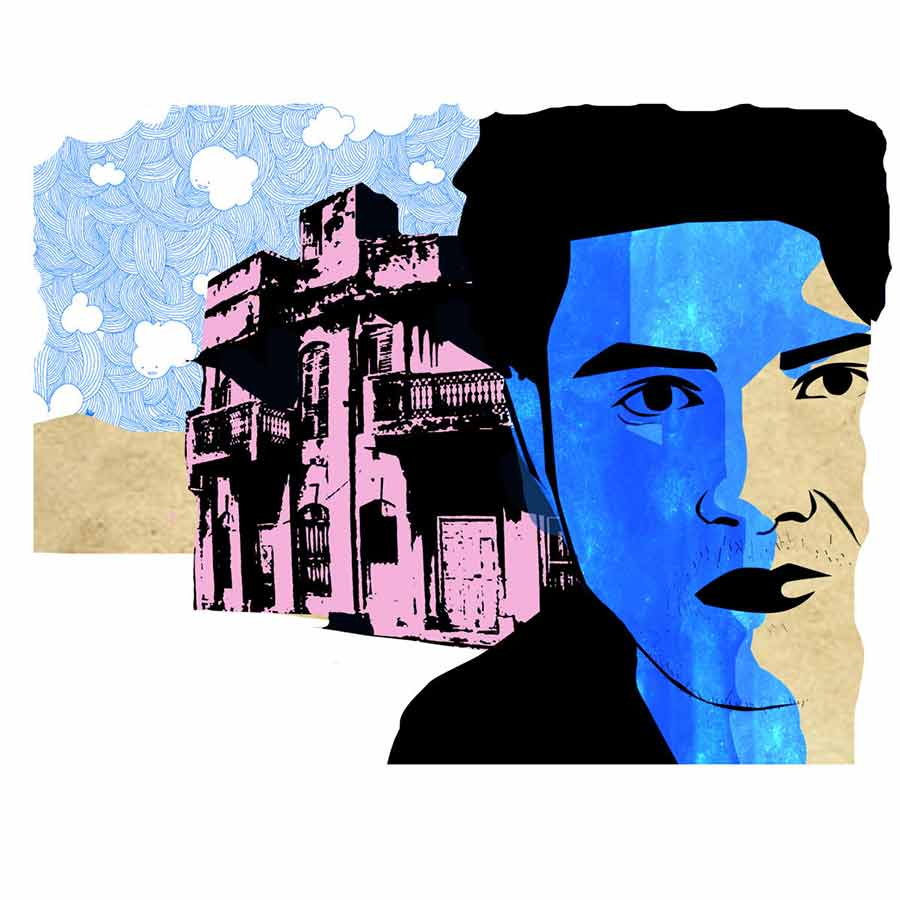

 
 <h1 align=center>বাবার মতো লোক</h1>
<h2 align=center>অন্বেষা রায়</h2> 

মৃগাঙ্ক দাস দু’টো দিন সময় চেয়ে বিদায় নিলেন। বললেন, “অনেকগুলো টাকা তো… লাখখানেক যদি কমানো যেত।”

অরিত্র ভুরুর ভাঁজ গাঢ় করে মুখ ফেরাল। লোকটাকে প্রথম থেকেই বিরক্তিকর লেগেছে তার। বয়স ওর বাবার মতোই। যদিও চেহারায় একেবারে বিপরীত। যৌবন এখনও আহত বাঘের মতো লড়ে যাচ্ছে লোকটির শরীর জুড়ে। সময় যেটুকু ছোবল বসিয়েছে, তা কেবল চুলে আর চোখের পাশে।

আলাপের সময় বুকের কাছে হাত জড়ো করে গদগদ ভঙ্গিতে হেসেছিলেন। পরনে ঢোলা পাজামা, ফ্যাকাসে রঙের পাঞ্জাবি। চলনে-বলনে আলগা তেলের মতো জবজবে বিগলিত ভাব অসহ্য লেগেছিল অরিত্রর। স্বরূপ চাকলাদার পিছন থেকে ইশারা করেছিল। এই সেই লোক। বাড়ি দেখার আগেই কেনার জন্য তৈরি হয়ে আছেন যিনি। সামনে এসে বলেছিল, “মৃগাঙ্কদা গ্রামে আমার প্রতিবেশী। একা মানুষ। বললাম, বাগানওয়ালা বাড়ি। কম দামে পাচ্ছেন, নিয়ে নিন। বাড়িওয়ালা সাচ্চা লোক, কোনও চাপ নেই।”

‘সাচ্চা লোক’ কথাটা অত বিরক্তির মধ্যেও অরিত্রকে কুঁকড়ে দিয়েছিল। তার মনে পড়েছিল, বাগানে লাউশাক তুলতে তুলতে মা বলেছিলেন, “হ্যাঁরে অরু, বাড়িটা কি হেলে যাচ্ছে? দক্ষিণের দিকটা দেখ এক বার।”

বহু ক্ষণ নিবিড় ভাবে তাকিয়ে থেকেও কোনও ফারাক ধরতে পারেনি অরিত্র। তবে মায়ের কথা অবিশ্বাসও করতে পারেনি। বিয়ের গয়না আর বাবার যাবতীয় সঞ্চয়ের বিনিময়ে কেনা এই বাড়িটাকে মা আজও সন্তানস্নেহে আগলে রাখেন। সামান্যতম তারতম্যও তাঁর চোখ এড়ায় না। অরিত্রর মন কু গেয়েছে। দেওয়ালের চকচকে রং ঠেলে বেরিয়ে আসা নোনা, কল্কা ডিজাইনের রেলিং-ভাঙা ছাদ আর চলটা ওঠা বহিরঙ্গের পর বাড়িটা কি এ বার ধসে পড়বে?

ইলেকট্রনিক্সের দোকানে সেলসম্যানের চাকরি করে অরিত্র। সৎ বলে ভারী সুনাম। বছরখানেক আগে এই সততায় মুগ্ধ হয়েই তার জীবনে এসেছে অনুপ্রিয়া। দীপাবলির প্রদীপের মতো স্নিগ্ধ মেয়েটির দিকে তাকিয়েই অরিত্র টের পেয়েছে, একে তার মলিন, প্রাচীন বাড়িতে এনে রাখা যাবে না। এর জন্য উজ্জ্বল, ঝকঝকে ফ্ল্যাটবাড়ি দরকার। বাড়িটা ভাল দামে বিক্রি না করতে পারলে, আধুনিক ফ্ল্যাট কেনা অসম্ভব। তত দিন বিয়ে দূরবর্তী স্টেশন। প্রোমোটাররা কুৎসিত বাড়িটার বিষয়ে যথেষ্ট উৎসাহ দেখিয়েছিল, তবে মনের মতো দাম দিতে রাজি হয়নি। তখনই বিক্রির কথা চিন্তা করে স্বরূপকে ফোন করেছিল অরিত্র।

স্বরূপ বলেছিল, “ভায়া, এ জগতে সবই বিক্রি হয়। শুধু যোগাযোগটা দরকার। তুমি প্রোমোটারগুলোকে ঠেকিয়ে রাখো, আমি লোক দেখে দিচ্ছি।”

গত তিন মাসে সাতাশ জনকে বাড়িটা দেখিয়েছে স্বরূপ। যারা এসেছিল, তারা প্রত্যেকেই সচেতন ও সজাগ মানুষ। বাড়িটার অজস্র ত্রুটি তারা ধরে ফেলেছেন প্রথম দেখাতেই। কেউ সন্দেহ নিশ্চিত করতে সঙ্গে নিয়ে এসেছেন বন্ধু-আত্মীয়দের।

মৃগাঙ্ক দাস সে সবের ধার ধারেননি। আলগা চোখে, হালকা পায়ে ঘুরে বেড়িয়েছেন গোটা বাড়ি। ছাদ থেকে নেমে আসা জলের দাগ, মেঝে থেকে পাতাহীন গাছের মতো মাথাচাড়া দেওয়া ফাটল, কোনও কিছুতেই চোখ আটকায়নি তাঁর। লোকটাকে দেখতে দেখতে প্রতি মুহূর্তে অরিত্রর বিরক্তি ঊর্ধ্বগামী হয়েছে। বাবার বয়সি মানুষটার উদ্দেশে একটাই কথা ঘুরপাক খেয়েছে জিভের আশপাশে।

অপদার্থ!

*****

মৃগাঙ্ক দাস চলে যাওয়ার পর, অস্বস্তি বাড়ল অরিত্রর। বিজবিজে একটা রাগ, নোংরা পাঁকের মতো সমস্ত ভাবনাচিন্তায় মাখামাখি হয়ে গেল। মাথায় আঙুল চালিয়ে সে মুঠোয় চেপে ধরল চুল।

স্বরূপের জোরাজুরিতেই আজ ছুটি নিয়ে বাড়ি দেখিয়েছে। এই রকম গাঁইয়া ভূত এসে জুটবে জানলে কাটিয়ে দিত। এই লোক আর যা-ই হোক, লক্ষ লক্ষ টাকা দিয়ে বাড়ি কেনার মানুষ নিশ্চয়ই নয়। স্বরূপ চাকলাদার যা-ই বলুক, মা যতই উপুড় হয়ে আপ্যায়ন করুক, এ লোক কিছুতেই এ বাড়ি নেবে না। জোরের সঙ্গে মনে মনে নিজেকেবলল অরিত্র।

লোকটার চোখেমুখে অভাবের ছাপ স্পষ্ট। পায়ের হাওয়াই চটি ঘষটে প্রথমেই ঢুকেছিল বাবার ঘরে। স্যাঁতসেঁতে অন্ধকার ঘরে চব্বিশ ঘণ্টা শুয়ে থাকা মানুষটাকে বাবা বলে ভাবতে বহু দিন আগেই ভুলে গেছে অরিত্র। যে লোকটার হুজুগে এই বাড়ি কেনা হয়েছিল পনেরো বছর আগে, সে এক জন কমবয়সি, আবেগসর্বস্ব মানুষ।

মৃগাঙ্ক দাস অরিত্রর মাকে দিদি সম্বোধন করে প্রশ্ন শুরু করেছিল। কবে থেকে বাবার এই অসুখ, সারেনি কেন, কোন ডাক্তার দেখছেন ইত্যাদি। মা-ও উত্তর দিতে দিতে গলে যাচ্ছিলেন।

বাড়ি বিক্রির তাগিদে, জীবন থেকে অনেক পর্দা তুলে দিতে হয়েছে অরিত্রকে। বহু বার তাদের শোওয়ার ঘরে, রান্নাঘরে, মায়ের শাড়ি-ব্লাউজ় মেলা ছাদে অপরিচিত লোকেরা ঘুরে-ফিরে গেছে। উজ্জ্বল জামাকাপড় পরা মানুষের দল, জুতো পায়ে হেঁটে, অনুৎসাহী চোখ বুলিয়ে গেছে বিবর্ণ দেওয়াল আর জল-ঝরা ছাদে। সেই সব লোকেরা অরিত্রর বাবাকে নিয়ে কোনও কৌতূহল প্রকাশ করেনি।

ছাদের দিকে যাওয়ার সময় অরিত্র দেখেছিল, ঘর থেকে ভেসে আসা বাবার গোঙানিকে উপেক্ষা করে, মৃগাঙ্ক দাসকে মা অনুপ্রিয়ার কথা বলছেন। বিয়ের তাড়া, তাই বাড়িটা বিক্রি করে দিতে চাইছেন। নয়তো এত ভাল বাড়ি হাতছাড়া করার বিন্দুমাত্র ইচ্ছে নেই তাদের।

মিথ্যে বলায় অপটু মায়ের এই আকুল প্রয়াসে, অরিত্র অপমানিত বোধ করেছে। তার মনে হয়েছে, বিচ্ছিরি রকমের গরিব হলেই এত কথা বলে মানুষ। যেমন তার মা, যেমন মৃগাঙ্ক দাস।

*****

পৈতৃক বাড়িতে নিজের অংশটুকু বিনামূল্যে দাদাদের লিখে দিয়েছিলেন অরিত্রর বাবা। বিশ্বাস করতেন, ওই বাড়ি ফ্ল্যাট হলে ভাগ দেবেন দাদারা। এই অন্ধবিশ্বাস কোনও রকমের সারল্য নয়। সাধারণবোধ ও দায়িত্বজ্ঞানের অভাব। জানে অরিত্র।

“পরের কথা ভেবেই জীবন কাটিয়ে দিল বাবা। যতীনকাকু শাড়ির ব্যবসা করে লাখপতি হওয়ার স্বপ্ন দেখাল, বাবা নেচে উঠল। পিএফ থেকে লোন নিয়ে বন্ধুর ব্যবসার ক্যাপিটাল জোগালেন উনি। কী লাভ হল? একটা ভাল কলেজে লেখাপড়া করতে পারলাম না, বাবার নিজের চিকিৎসা ছাড়ো, একটা আয়া পর্যন্ত রাখা যাচ্ছে না স্রেফ টাকার অভাবে। এগুলো ভালমানুষি নয় মা। এগুলো মূর্খামি। একটার পর একটা ভুল করে আমাদের লাইফটাকে হেল করে দিয়েছে বাবা।”

মায়ের দিকে ধারালো কথা ছুড়ে দিতে দিতে ভিতরে ভিতরে নিজেও আহত হয়েছে অরিত্র। কত রাত ঘুম আসেনি। বাবার উপর রাগে আজও দিশেহারা লাগে তার।

কফি শপের শীতলতায় অরিত্রর হাতে হাত রেখে সাদা-কালো সিনেমার নায়িকাদের মতো অনুপ্রিয়া বলেছে, “বাড়িতে বিয়ের জন্য চাপ দিচ্ছে। তুমি এক বার কাকিমাকে নিয়ে এসো না! অসুবিধে থাকলে আমরাও যেতে পারি তোমাদের বাড়ি।”

অরিত্র জবাব দেয়নি। তার মনে হয়েছে, বাবার অসুস্থতার খবরে যে মেঘের মতো মায়া অনুপ্রিয়ার চোখে ঘনিয়েছে, বাড়িতে গেলে তা কেটে যাবে এক নিমেষে। ‘সরল’ শব্দটা শুনতে যতটা ভাল, ‘বোকা’ কথাটা ততটাই বিরক্তিকর। অসহায় রাগে সে মাকে বলেছে, “বাড়ির অমতে একখানা বর জুটিয়েছিলে বটে। জাত ছাড়ো, বোধবুদ্ধিও বাঁধিয়ে রাখার মতো। বাড়িটা কেনার আগে একটু চোখকান খোলা রাখলেই আর ঠকতে হত না বাবাকে।”

বিকেলের দিকে স্বরূপ ফোন করল অরিত্রকে। উত্তেজিত গলায় বলল, “মৃগাঙ্কদা তোমার ফোন নম্বর নিয়েছে। দাম কমাবে না কিন্তু। গ্রামের বাড়ি আর দোকান বিক্রি করে ভাল মাল পেয়েছে। বৌ, বাচ্চা কেউই তো নেই। খরচ করবে কার পিছনে? তবে বাড়ি বিক্রির ক্রেডিট কিন্তু ভাই হান্ড্রেট পার্সেন মাসিমার। যা পারফর্ম করেছেন না আজ!”

ফোনটা রেখে ছাদে উঠে এল অরিত্র। সিগারেটে লম্বা টান দিয়ে ভাবল, সত্যিই মা যেন আজ অন্য মানুষ। বলিরেখাময় কাপে কালো চা-বিস্কুট সাজিয়ে দেওয়া থেকে মৃগাঙ্ক দাসের হাতে বাগান থেকে লঙ্কা, টমেটো আর পালংশাক তুলে দেওয়া। এই সব কিছুর মাঝে যেটুকু ফাঁক ছিল, তাও বাড়ির সুখ্যাতিতে ভরিয়ে দিয়েছেন মা।

অরিত্রর চোয়াল শক্ত হল। হঠাৎই বাবার উপর রাগে মাথা ঝিমঝিম করে ওঠে নতুন করে।

ঘষে ঘষে সিগারেট নিবিয়ে অরিত্র বিড়বিড় করে বলল, “অসহ্য।”

*****

পরবর্তী দুটো দিনে, অশান্তি আরও আগ্রাসী হল। অনুপ্রিয়াকে এড়িয়ে গেল অরিত্র। অফিসে গিয়েও কাজে মন বসাতে পারল না। প্রবল এক অস্থিরতা ওকে শান্তিতে বসতে দিল না দু’দণ্ড। শরীর খারাপের অজুহাতে সে বেরিয়ে গেল তাড়াতাড়ি। শেয়ালদা থেকে ট্রেন ধরে যাত্রা করল বাড়ির একেবারে উল্টো দিকে। যে দিকে দু’চোখ যায়।

স্বরূপ ইতিমধ্যে আরও কয়েক বার ফোন করেছে। আপাতত সে কাউকে অরিত্রদের বাড়ি দেখাচ্ছে না, কারণ মৃগাঙ্ক দাসের বিষয়ে সে নিশ্চিত। লোকটা ঋণ সংক্রান্ত কথা বলছে দু’-এক জায়গায়। এখন শুধু সময়ের অপেক্ষা।

সব চুপচাপ শুনে ফোন রেখে দিয়েছে অরিত্র।

রাতে, অরিত্রর ঘরে এসে মা বললেন, “লোকটা দূরে থাকে এটাই বাঁচোয়া। প্রোমোটারগুলো যে রকম ছোঁক-ছোঁক করে, বাগে পেলেই ভাঙচি দেবে। তার পর নিজেরা দু’কড়ি ঠেকিয়ে, বাড়ি কব্জা করবে আর ভেঙেচুরে লাখ লাখ টাকার ফ্ল্যাট বানাবে। স্বরূপ বলছিল এই লোকটা নাকি খোঁজখবর করবে না। আমাদের কথাই ওঁর কাছে শেষ কথা। সেটা হলেই শান্তি বাবা। আমরা তো ঠকাচ্ছি না। বাড়ি, দলিল, প্ল্যান সব দেখিয়েছি। তার পর এই ভাঙা বাড়ি নিলে নেবে।”

মৃগাঙ্ক দাস দু’টো দিন সময় চেয়ে বিদায় নিলেন। বললেন, “অনেকগুলো টাকা তো… লাখখানেক যদি কমানো যেত।”

অরিত্র ভুরুর ভাঁজ গাঢ় করে মুখ ফেরাল। লোকটাকে প্রথম থেকেই বিরক্তিকর লেগেছে তার। বয়স ওর বাবার মতোই। যদিও চেহারায় একেবারে বিপরীত। যৌবন এখনও আহত বাঘের মতো লড়ে যাচ্ছে লোকটির শরীর জুড়ে। সময় যেটুকু ছোবল বসিয়েছে, তা কেবল চুলে আর চোখের পাশে।

আলাপের সময় বুকের কাছে হাত জড়ো করে গদগদ ভঙ্গিতে হেসেছিলেন। পরনে ঢোলা পাজামা, ফ্যাকাসে রঙের পাঞ্জাবি। চলনে-বলনে আলগা তেলের মতো জবজবে বিগলিত ভাব অসহ্য লেগেছিল অরিত্রর। স্বরূপ চাকলাদার পিছন থেকে ইশারা করেছিল। এই সেই লোক। বাড়ি দেখার আগেই কেনার জন্য তৈরি হয়ে আছেন যিনি। সামনে এসে বলেছিল, “মৃগাঙ্কদা গ্রামে আমার প্রতিবেশী। একা মানুষ। বললাম, বাগানওয়ালা বাড়ি। কম দামে পাচ্ছেন, নিয়ে নিন। বাড়িওয়ালা সাচ্চা লোক, কোনও চাপ নেই।”

‘সাচ্চা লোক’ কথাটা অত বিরক্তির মধ্যেও অরিত্রকে কুঁকড়ে দিয়েছিল। তার মনে পড়েছিল, বাগানে লাউশাক তুলতে তুলতে মা বলেছিলেন, “হ্যাঁরে অরু, বাড়িটা কি হেলে যাচ্ছে? দক্ষিণের দিকটা দেখ এক বার।”

বহু ক্ষণ নিবিড় ভাবে তাকিয়ে থেকেও কোনও ফারাক ধরতে পারেনি অরিত্র। তবে মায়ের কথা অবিশ্বাসও করতে পারেনি। বিয়ের গয়না আর বাবার যাবতীয় সঞ্চয়ের বিনিময়ে কেনা এই বাড়িটাকে মা আজও সন্তানস্নেহে আগলে রাখেন। সামান্যতম তারতম্যও তাঁর চোখ এড়ায় না। অরিত্রর মন কু গেয়েছে। দেওয়ালের চকচকে রং ঠেলে বেরিয়ে আসা নোনা, কল্কা ডিজাইনের রেলিং-ভাঙা ছাদ আর চলটা ওঠা বহিরঙ্গের পর বাড়িটা কি এ বার ধসে পড়বে?

ইলেকট্রনিক্সের দোকানে সেলসম্যানের চাকরি করে অরিত্র। সৎ বলে ভারী সুনাম। বছরখানেক আগে এই সততায় মুগ্ধ হয়েই তার জীবনে এসেছে অনুপ্রিয়া। দীপাবলির প্রদীপের মতো স্নিগ্ধ মেয়েটির দিকে তাকিয়েই অরিত্র টের পেয়েছে, একে তার মলিন, প্রাচীন বাড়িতে এনে রাখা যাবে না। এর জন্য উজ্জ্বল, ঝকঝকে ফ্ল্যাটবাড়ি দরকার। বাড়িটা ভাল দামে বিক্রি না করতে পারলে, আধুনিক ফ্ল্যাট কেনা অসম্ভব। তত দিন বিয়ে দূরবর্তী স্টেশন। প্রোমোটাররা কুৎসিত বাড়িটার বিষয়ে যথেষ্ট উৎসাহ দেখিয়েছিল, তবে মনের মতো দাম দিতে রাজি হয়নি। তখনই বিক্রির কথা চিন্তা করে স্বরূপকে ফোন করেছিল অরিত্র।

স্বরূপ বলেছিল, “ভায়া, এ জগতে সবই বিক্রি হয়। শুধু যোগাযোগটা দরকার। তুমি প্রোমোটারগুলোকে ঠেকিয়ে রাখো, আমি লোক দেখে দিচ্ছি।”

গত তিন মাসে সাতাশ জনকে বাড়িটা দেখিয়েছে স্বরূপ। যারা এসেছিল, তারা প্রত্যেকেই সচেতন ও সজাগ মানুষ। বাড়িটার অজস্র ত্রুটি তারা ধরে ফেলেছেন প্রথম দেখাতেই। কেউ সন্দেহ নিশ্চিত করতে সঙ্গে নিয়ে এসেছেন বন্ধু-আত্মীয়দের।

মৃগাঙ্ক দাস সে সবের ধার ধারেননি। আলগা চোখে, হালকা পায়ে ঘুরে বেড়িয়েছেন গোটা বাড়ি। ছাদ থেকে নেমে আসা জলের দাগ, মেঝে থেকে পাতাহীন গাছের মতো মাথাচাড়া দেওয়া ফাটল, কোনও কিছুতেই চোখ আটকায়নি তাঁর। লোকটাকে দেখতে দেখতে প্রতি মুহূর্তে অরিত্রর বিরক্তি ঊর্ধ্বগামী হয়েছে। বাবার বয়সি মানুষটার উদ্দেশে একটাই কথা ঘুরপাক খেয়েছে জিভের আশপাশে।

অপদার্থ!

*****

মৃগাঙ্ক দাস চলে যাওয়ার পর, অস্বস্তি বাড়ল অরিত্রর। বিজবিজে একটা রাগ, নোংরা পাঁকের মতো সমস্ত ভাবনাচিন্তায় মাখামাখি হয়ে গেল। মাথায় আঙুল চালিয়ে সে মুঠোয় চেপে ধরল চুল।

স্বরূপের জোরাজুরিতেই আজ ছুটি নিয়ে বাড়ি দেখিয়েছে। এই রকম গাঁইয়া ভূত এসে জুটবে জানলে কাটিয়ে দিত। এই লোক আর যা-ই হোক, লক্ষ লক্ষ টাকা দিয়ে বাড়ি কেনার মানুষ নিশ্চয়ই নয়। স্বরূপ চাকলাদার যা-ই বলুক, মা যতই উপুড় হয়ে আপ্যায়ন করুক, এ লোক কিছুতেই এ বাড়ি নেবে না। জোরের সঙ্গে মনে মনে নিজেকেবলল অরিত্র।

লোকটার চোখেমুখে অভাবের ছাপ স্পষ্ট। পায়ের হাওয়াই চটি ঘষটে প্রথমেই ঢুকেছিল বাবার ঘরে। স্যাঁতসেঁতে অন্ধকার ঘরে চব্বিশ ঘণ্টা শুয়ে থাকা মানুষটাকে বাবা বলে ভাবতে বহু দিন আগেই ভুলে গেছে অরিত্র। যে লোকটার হুজুগে এই বাড়ি কেনা হয়েছিল পনেরো বছর আগে, সে এক জন কমবয়সি, আবেগসর্বস্ব মানুষ।

মৃগাঙ্ক দাস অরিত্রর মাকে দিদি সম্বোধন করে প্রশ্ন শুরু করেছিল। কবে থেকে বাবার এই অসুখ, সারেনি কেন, কোন ডাক্তার দেখছেন ইত্যাদি। মা-ও উত্তর দিতে দিতে গলে যাচ্ছিলেন।

বাড়ি বিক্রির তাগিদে, জীবন থেকে অনেক পর্দা তুলে দিতে হয়েছে অরিত্রকে। বহু বার তাদের শোওয়ার ঘরে, রান্নাঘরে, মায়ের শাড়ি-ব্লাউজ় মেলা ছাদে অপরিচিত লোকেরা ঘুরে-ফিরে গেছে। উজ্জ্বল জামাকাপড় পরা মানুষের দল, জুতো পায়ে হেঁটে, অনুৎসাহী চোখ বুলিয়ে গেছে বিবর্ণ দেওয়াল আর জল-ঝরা ছাদে। সেই সব লোকেরা অরিত্রর বাবাকে নিয়ে কোনও কৌতূহল প্রকাশ করেনি।

ছাদের দিকে যাওয়ার সময় অরিত্র দেখেছিল, ঘর থেকে ভেসে আসা বাবার গোঙানিকে উপেক্ষা করে, মৃগাঙ্ক দাসকে মা অনুপ্রিয়ার কথা বলছেন। বিয়ের তাড়া, তাই বাড়িটা বিক্রি করে দিতে চাইছেন। নয়তো এত ভাল বাড়ি হাতছাড়া করার বিন্দুমাত্র ইচ্ছে নেই তাদের।

মিথ্যে বলায় অপটু মায়ের এই আকুল প্রয়াসে, অরিত্র অপমানিত বোধ করেছে। তার মনে হয়েছে, বিচ্ছিরি রকমের গরিব হলেই এত কথা বলে মানুষ। যেমন তার মা, যেমন মৃগাঙ্ক দাস।

*****

পৈতৃক বাড়িতে নিজের অংশটুকু বিনামূল্যে দাদাদের লিখে দিয়েছিলেন অরিত্রর বাবা। বিশ্বাস করতেন, ওই বাড়ি ফ্ল্যাট হলে ভাগ দেবেন দাদারা। এই অন্ধবিশ্বাস কোনও রকমের সারল্য নয়। সাধারণবোধ ও দায়িত্বজ্ঞানের অভাব। জানে অরিত্র।

“পরের কথা ভেবেই জীবন কাটিয়ে দিল বাবা। যতীনকাকু শাড়ির ব্যবসা করে লাখপতি হওয়ার স্বপ্ন দেখাল, বাবা নেচে উঠল। পিএফ থেকে লোন নিয়ে বন্ধুর ব্যবসার ক্যাপিটাল জোগালেন উনি। কী লাভ হল? একটা ভাল কলেজে লেখাপড়া করতে পারলাম না, বাবার নিজের চিকিৎসা ছাড়ো, একটা আয়া পর্যন্ত রাখা যাচ্ছে না স্রেফ টাকার অভাবে। এগুলো ভালমানুষি নয় মা। এগুলো মূর্খামি। একটার পর একটা ভুল করে আমাদের লাইফটাকে হেল করে দিয়েছে বাবা।”

মায়ের দিকে ধারালো কথা ছুড়ে দিতে দিতে ভিতরে ভিতরে নিজেও আহত হয়েছে অরিত্র। কত রাত ঘুম আসেনি। বাবার উপর রাগে আজও দিশেহারা লাগে তার।

কফি শপের শীতলতায় অরিত্রর হাতে হাত রেখে সাদা-কালো সিনেমার নায়িকাদের মতো অনুপ্রিয়া বলেছে, “বাড়িতে বিয়ের জন্য চাপ দিচ্ছে। তুমি এক বার কাকিমাকে নিয়ে এসো না! অসুবিধে থাকলে আমরাও যেতে পারি তোমাদের বাড়ি।”

অরিত্র জবাব দেয়নি। তার মনে হয়েছে, বাবার অসুস্থতার খবরে যে মেঘের মতো মায়া অনুপ্রিয়ার চোখে ঘনিয়েছে, বাড়িতে গেলে তা কেটে যাবে এক নিমেষে। ‘সরল’ শব্দটা শুনতে যতটা ভাল, ‘বোকা’ কথাটা ততটাই বিরক্তিকর। অসহায় রাগে সে মাকে বলেছে, “বাড়ির অমতে একখানা বর জুটিয়েছিলে বটে। জাত ছাড়ো, বোধবুদ্ধিও বাঁধিয়ে রাখার মতো। বাড়িটা কেনার আগে একটু চোখকান খোলা রাখলেই আর ঠকতে হত না বাবাকে।”

বিকেলের দিকে স্বরূপ ফোন করল অরিত্রকে। উত্তেজিত গলায় বলল, “মৃগাঙ্কদা তোমার ফোন নম্বর নিয়েছে। দাম কমাবে না কিন্তু। গ্রামের বাড়ি আর দোকান বিক্রি করে ভাল মাল পেয়েছে। বৌ, বাচ্চা কেউই তো নেই। খরচ করবে কার পিছনে? তবে বাড়ি বিক্রির ক্রেডিট কিন্তু ভাই হান্ড্রেট পার্সেন মাসিমার। যা পারফর্ম করেছেন না আজ!”

ফোনটা রেখে ছাদে উঠে এল অরিত্র। সিগারেটে লম্বা টান দিয়ে ভাবল, সত্যিই মা যেন আজ অন্য মানুষ। বলিরেখাময় কাপে কালো চা-বিস্কুট সাজিয়ে দেওয়া থেকে মৃগাঙ্ক দাসের হাতে বাগান থেকে লঙ্কা, টমেটো আর পালংশাক তুলে দেওয়া। এই সব কিছুর মাঝে যেটুকু ফাঁক ছিল, তাও বাড়ির সুখ্যাতিতে ভরিয়ে দিয়েছেন মা।

অরিত্রর চোয়াল শক্ত হল। হঠাৎই বাবার উপর রাগে মাথা ঝিমঝিম করে ওঠে নতুন করে।

ঘষে ঘষে সিগারেট নিবিয়ে অরিত্র বিড়বিড় করে বলল, “অসহ্য।”

*****

পরবর্তী দুটো দিনে, অশান্তি আরও আগ্রাসী হল। অনুপ্রিয়াকে এড়িয়ে গেল অরিত্র। অফিসে গিয়েও কাজে মন বসাতে পারল না। প্রবল এক অস্থিরতা ওকে শান্তিতে বসতে দিল না দু’দণ্ড। শরীর খারাপের অজুহাতে সে বেরিয়ে গেল তাড়াতাড়ি। শেয়ালদা থেকে ট্রেন ধরে যাত্রা করল বাড়ির একেবারে উল্টো দিকে। যে দিকে দু’চোখ যায়।

স্বরূপ ইতিমধ্যে আরও কয়েক বার ফোন করেছে। আপাতত সে কাউকে অরিত্রদের বাড়ি দেখাচ্ছে না, কারণ মৃগাঙ্ক দাসের বিষয়ে সে নিশ্চিত। লোকটা ঋণ সংক্রান্ত কথা বলছে দু’-এক জায়গায়। এখন শুধু সময়ের অপেক্ষা।

সব চুপচাপ শুনে ফোন রেখে দিয়েছে অরিত্র।

রাতে, অরিত্রর ঘরে এসে মা বললেন, “লোকটা দূরে থাকে এটাই বাঁচোয়া। প্রোমোটারগুলো যে রকম ছোঁক-ছোঁক করে, বাগে পেলেই ভাঙচি দেবে। তার পর নিজেরা দু’কড়ি ঠেকিয়ে, বাড়ি কব্জা করবে আর ভেঙেচুরে লাখ লাখ টাকার ফ্ল্যাট বানাবে। স্বরূপ বলছিল এই লোকটা নাকি খোঁজখবর করবে না। আমাদের কথাই ওঁর কাছে শেষ কথা। সেটা হলেই শান্তি বাবা। আমরা তো ঠকাচ্ছি না। বাড়ি, দলিল, প্ল্যান সব দেখিয়েছি। তার পর এই ভাঙা বাড়ি নিলে নেবে।”

অরিত্র বিরক্ত স্বরে বলল, “এখনই অত খুশি হওয়ার কিছু নেই। একটা আপাদমস্তক বোকা আর অপদার্থ লোক, কিনবে না বলেই এত নাটক করছে। মিলিয়ে নিয়ো আমার কথা। ও কিছুতেই কিনবে না এই বাড়ি।”

মা বললেন, “এ রকম বলছিস কেন? এত দিন ধরে আমরা তোর বাবার মতো এক জনকেই তো খুঁজছিলাম। যে আগুপিছু বিবেচনা না করেই ঝট করে কিনে নেবে বাড়িটা। তাই না? তা হলে আজ এত রেগে যাচ্ছিস কেন?”

শেষ কথাটায় চমকে ওঠে অরিত্র। সত্যিই তো কেন রেগে যাচ্ছে সে এত? কার উপর রেগে যাচ্ছে?

*****

সেই রাতে আর ঘুম এল না অরিত্রর। অস্থির ভাবে পায়চারি করতে করতে এক সময় সে নিজেকে আবিষ্কার করে দক্ষিণের বাগানে। বুকের অন্ধকারটুকু যেন নিঝুম হয়ে ছড়িয়ে আছে বাগানময়। বাড়িটা কি সত্যিই হেলে যাচ্ছে? মা দ্বিতীয় বার বলেননি ও কথা। আজকাল শুধুই সুখ্যাতি চলে এই বাড়ির। যেন চলে গিয়েও থেকে গিয়েছেন মৃগাঙ্ক দাস। এই বাড়ি সম্পর্কে যিনি কোনও খোঁজখবর নেননি। শুধু দেখেই কেনার প্রস্তুতি নিচ্ছেন।

সে দিন কিসের টানে কে জানে, শেয়ালদা থেকে ট্রেন ধরে সে চলে গিয়েছিল মৃগাঙ্ক দাসের গ্রামে। জেনেছে, গত বছর একটা দুর্ঘটনায় ভদ্রলোকের স্ত্রী আর মেয়ে এক সঙ্গে মারা গেছেন। তার পরই গ্রাম ছাড়তে ব্যস্ত হয়ে উঠেছেন ভদ্রলোক।

ফিরতি ট্রেনে উঠতে গিয়ে অরিত্র দেখে, সেখানে স্মৃতির ঠাসাঠাসি ভিড়। কত কথা, কত ঘটনা জানলা দিয়ে ভেসে আসা হাওয়ার মতো এলোমেলো করে দিচ্ছিল অরিত্রর চিন্তা। তার বাবা তো ছিলেন না এমন! ঠাকুমা মারা যেতেই সবটা বদলে গেল। দত্তক নেওয়া ছেলে বলে জেঠারা এমন রূঢ় হয়ে উঠল যে অভিমানে নিজের অংশটুকু লিখে দিলেন বাবা। আসলে এতখানি ভেঙে পড়েছিলেন যে, বোধবুদ্ধি কাজ করছিল না। স্বামী, পিতা হওয়ার পরেও মানুষের ভিতরে একটা শিশু কি থেকেই যায় আজীবন? হাজার দায়িত্বের বোঝা কাঁধে নিয়েও যে একটু ভালবাসা চায়, ভরসা চায়। এই দুর্বলতাটুকু বুঝি অনায়াসে টের পেয়ে যায় যতীনকাকুর মতো ধূর্ত লোকেরা। হাতে বন্ধুত্ব আর মুখে হাসি নিয়ে তারা আসে লুঠ করতে।

হঠাৎ যেন হুঁশ ফেরে তার। বাগান থেকে ছুটে অরিত্র চলে আসে ঘুমন্ত মায়ের কাছে। গায়ে ঠেলা দিয়ে ডেকে তুলে বলে, “নিয়ম মেনে সৎ থাকাটাই কি সততার শেষ কথা মা? জেঠু, যতীনকাকা, বাড়িওয়ালা সবাই তো কাগুজে নিয়ম মেনেই চলেছিল, তাও কেন ঠকে গেল বাবা? বাবা মৃগাঙ্ক দাসের মতো লোক বলে? নাকি আমরা... ”

বুকের ভিতর মাথা তুলে দাঁড়ানো পুরনো একটা দেওয়াল যেন পলক ফেলার আগেই ধসে গেল। অরিত্রর দুই চোখ উপচে পড়ল জলে। কোনও রকমে সে বলল, “ঠকে যাওয়াটা খুব দোষের, তাই না মা? এক বার ঠকে গেলে আর এক জনকে না ঠকানো অবধি বুঝি তার প্রায়শ্চিত্ত হয় না? এ নিয়ম কে বানাল? কবে বানাল?”

বিহ্বল চোখে ছেলের দিকে তাকিয়ে থাকেন মা। মুখে শব্দ ফোটে না। নিজেকে দ্রুত গুছিয়ে নেয় অরিত্র। আর এক মুহূর্তও দেরি করবে না সে। ঘর ছাড়তে ছাড়তে পকেট থেকে ফোন বার করে অরিত্র।

(এই প্রতিবেদনটি আনন্দবাজার পত্রিকার মুদ্রিত সংস্করণ থেকে নেওয়া হয়েছে)

