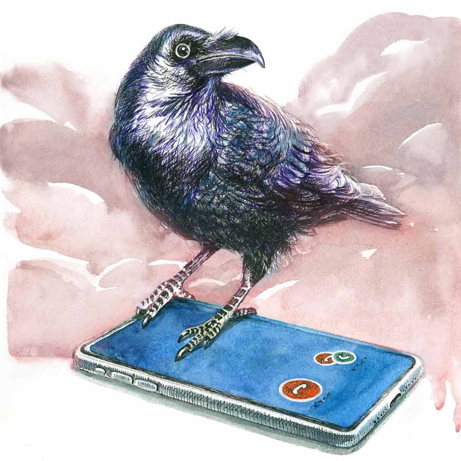

 
 <h1 align=center>ভবিতব্য</h1>
<h2 align=center>বাণীব্রত গোস্বামী</h2> 

মহা সমস্যায় পড়েছি। ক’দিন ধরেই মাঝেমধ্যে গোলমালটা হচ্ছে। মোবাইলে একটা ফোন আসছে, কোনও নাম নেই, নম্বরও নেই। ধরব না ভেবেও ধরে ফেলছি, দরকারি ভেবে। পুরুষকণ্ঠ। একটাই কথা বলছে, “কেমন আছ?”

তার পর খানিক ক্ষণ চুপ। আমি ‘হ্যালো, হ্যালো’ করছি। কিন্তু ফোনটা কেটে যায়।

তার কিছু দিন পরে, হঠাৎ এক দিন দেখি একটা নারীকণ্ঠ। ওই সেই রকম... নাম নেই, নম্বর নেই। শুধু একটাই প্রশ্ন, “ভাল আছেন?” তার পর চুপচাপ। ফোনটা কেটে যায়। এটা প্রায়ই হতে থাকে। আকাশপাতাল ভাবতে থাকি। রাত্তিরে ঘুম আসতে চায় না। মনে করার চেষ্টা করি। কে হতে পারে? মোবাইলের কল লিস্টে কোনও নাম বা নম্বর নেই। গলাটা হালকা চেনা লাগছে। অনেকটা নিশীথ আর ছায়ার মতো, তবে কেমন ফ্যাসফেসে।

কিন্তু তা-ই বা কী করে হবে! ওরা তো... আর নেই। অনেক দিন আগেই এই দুনিয়া ছেড়ে চলে গেছে। ওরা হবে কী করে! আর হঠাৎ আমার পিছনেই বা পড়ল কেন? আচ্ছা, ওদের মৃত্যুর জন্য কি আমি দায়ী? কিন্তু আমি কেন দায়ী হব! আমার তো কোনও অসৎ উদ্দেশ্য ছিল না! নিয়তির উপর কারই বা হাত থাকতে পারে!

ঠিক আছে, আমি পুরো ঘটনাটা বলছি, আপনারাই সবটা শুনে বিচার করবেন।

এখনও মনে আছে, সালটা ছিল ১৯৯৯। জুলাই মাসের মাঝামাঝি। অফিসের কাজেই আমার আর নিশীথের অসম যাওয়ার কথা হল। বেঁকে বসল নিশীথ। কারণ ও তখন সবে বিয়ে করেছে। নতুন বৌ। হানিমুনে যাওয়ার প্ল্যান করছে। তার মধ্যে অফিসের এই ফরমাশ।

আমাকে বেজার মুখে বলল, “কী করা যায় বলো তো অমরদা? একটা উপায় বাতলাও। বৌ তো খুব অভিমান করছে, কিছুতেই যেতে দিতে চাইছে না! সবে দিন পনেরো হল বিয়ে হয়েছে। আমারও ইয়ে... মানে একেবারেই মন চাইছে না।”

আমি অনেক ভেবেচিন্তে পরামর্শ দিলাম, “উপায় একটা আছে বটে, কিন্তু জানাজানি হলে দু’জনেরই চাকরি যাবে।”

“কী উপায়, বলো?”

“ধর, তুই তোর নিজের খরচাতেই বৌকে নিয়ে গেলি। আমাদের তো দু’দিন লাগবে কাজ সারতে। তার পর শনি-রবি গুয়াহাটি, শিলং ঘুরব। সোমবার ফিরে আসব। আমি না-হয় একটু বেশি চাপ নিয়ে নেব, মানে তোর ভাগের কাজটাও আমি তুলে দেব। আমাকে এক দিন ভাল করে খাইয়ে দিবি, ব্যস! আর তোর হানিমুনটাও হয়ে যাবে। আর আমাকে নিয়ে ভয় নেই! আমি কাবাবে হাড্ডি হব না।”

চোখেমুখে যেন আলো জ্বলে উঠল নিশীথের, “গুরু, তুমি আমার গুরু, তোমার কী বুদ্ধি মাইরি!”

“আচ্ছা, তা হলে ওই কথাই ফাইনাল।”

গোপনে তৈরি হয়ে গেল আমাদের যাত্রার পরিকল্পনা। কী ভাবে কাজ হবে, আর ঘোরার ছক। যথাসময়ে আমার লাগেজ নিয়ে হাওড়ায় বড় ঘড়ির নীচে আমি উপস্থিত। একটু পরেই ওরা এসে গেল।

নিশীথের বৌ ছায়াকে আমি প্রথম দেখেছিলাম ওর বিয়ের দিন। তবে সেটাকে দেখা না বলাই ভাল। ভিড়ের মধ্যে স‌ং সেজে, রং মেখে একটা ফোটো-ফ্রেমের হাসি মুখে ঝুলিয়ে সবাইকে হাতজোড় করে নমস্কার করছে। তাতে এক ঝলক দেখা হয় বটে, তবে চেনা যায় না। নিশীথ যে হেতু সুপুরুষ, ওর পাশে ভালই মানিয়েছিল। আজ ভাল করে দেখলাম। একে সুন্দরী, তার উপর নববধূ। নতুন বিয়ের জল পড়েছে। সিঁদুর তখনও সিঁথির পথ পুরোপুরি খুঁজে পায়নি। এলোমেলো হয়ে আছে পাশের বাদামি চুলে। দু’-চার ছিটে ফুলের রেণুর মতো রক্তাভ গালে ঝরে পড়েছে।

বোঝা যাচ্ছে, খুব জোরে হেঁটে এসেছে। কমলা লিপস্টিক মাখা ঠোঁটের উপর ঘামের বিন্দু। অনেকটা শিউলির উপর শরতের শিশিরের মতো। তবে তার থেকেও মিষ্টি ওর হাসি আর কথা বলার ধরন। কাচের গ্লাসে গ্লাসে মৃদু ঠোকার মতো গলার আওয়াজ। বড় ভাল লাগল আমার। মনে হল, খুব সুন্দর মানিয়েছে। যেন রাজযোটক মিল, ওরা খুব সুখী হোক।

নিশীথের কাঁধে হাত দিয়ে বললাম, “ভাল ট্রোফিই ঘরে তুলেছ ভাইটি।”

তখনই ওর ঘাড়ের কাছে একটা সিঁদুরের দাগ দেখলাম। বোধহয় শুভ যাত্রাক্ষণে, ঘর থেকে বেরোনোর মুখে শেষ মাসুলের অভিজ্ঞান।

যাত্রা হল শুরু। ট্রেন ছাড়তেই আমরা যত সামনে ছুটতে লাগলাম, প্রকৃতি পিছনে দৌড়তে লাগল। পরদিন সকালে শিলিগুড়ি পেরোতেই প্রকৃতি আরও সেজে উঠল। চার পাশের সবুজ দূরের পর্বতশ্রেণির ধূসরে গিয়ে মিলেছে। সেই ধূসর ক্রমশ ঊর্ধ্বগামী হয়ে মিলে গেছে আকাশের ধোঁয়া-ধোঁয়া নীল মেঘে। সুদূরে হিমালয় হাতছানি দিচ্ছে। ছোট ছোট পাহাড়ের মতো আমার চোখের সামনেও নবদম্পতির প্রেম ঢেউ খেলছে। অদ্ভুত খুশি ঝরে পড়ছে ছায়ার চোখেমুখে।

নিশীথ আমাকে এখনও কথায় কথায় ধন্যবাদ দিয়ে যাচ্ছে। আমি হেসে পিঠে হাত দিয়ে বললাম, “এত কাছ থেকে কখনও কারও মধুচন্দ্রিমা আমি দেখিনি, তুমি আমায় কত গল্পের রসদ জুগিয়ে যাচ্ছ জানো? উল্টে আমিই তোমাদের কাছে কৃতজ্ঞ।”

বাড়িয়ে বলিনি একটুও। সত্যিই ওদের জমাট বাঁধা হিমবাহের মতো প্রেম ধীরে উষ্ণতা পাচ্ছে, আর নদীর স্রোতের মতো আমার কলম ভরিয়ে দিচ্ছে। লেখালিখির শখ থাকলে অন্যের জীবন এমন কাছ থেকে দেখার সুযোগ পাওয়া খুব জরুরি।

গুয়াহাটি নেমে স্নান করে আমরা কামাখ্যা মন্দিরে পুজো দিতে গেলাম। মন্দির প্রাঙ্গণে একটা বহু প্রাচীন অশ্বত্থ গাছ আছে। তাতে লাল সুতো দিয়ে একটা ছোট প্রস্তরখণ্ড বাঁধল ছায়া। লেখালিখির রসদ খুঁজতে খুঁজতে সব সময় কৌতূহলে উন্মুখ হয়ে থাকি। তাই ফস করে জিজ্ঞেস করে বসলাম, “তুমি এ সব বিশ্বাস করো! তা, কী চাইলে মায়ের কাছে?”

লজ্জায় লাল হয়ে উঠেছিল ছায়া। আমি অপ্রস্তুত। অনধিকার চর্চা করে ফেললাম নাকি! কামরূপ কামাখ্যা মায়ের কাছে বোধহয় ও সন্তান চেয়েছিল। মুখ ফুটে কিছু বলেনি। শুধু জিজ্ঞেস করেছিল, “আপনার বন্ধু কী চাইল?”

আমি বন্ধুসুলভ মজা করেছিলাম, “দু’জনে আলোচনা করে নিয়ে চাইতে পারতে, না হলে মা তো দ্বিধাগ্ৰস্ত হয়ে পড়তে পারেন।”

বেশ মজায় কাটছিল দিনগুলো। আমি ফাঁকে ফাঁকে অফিসের কাজ সারতে লাগলাম। কথামতো একাই একটু বেশি চাপ নিলাম, যাতে নিশীথকে যতটা সম্ভব ফ্রি রাখা যায়। আসলে ওদের এই অমলিন ভালবাসা দেখার লোভ ছাড়তেপারছিলাম না।

আরও ভাল লাগল শিলং গিয়ে। বিকেলে বসে ছিলাম শিলং ভিউ-পয়েন্টে। মৌসুমি বাতাস সমস্ত মেঘ হাওয়ার চামরে এক প্রান্তের দিকে সরিয়ে নিয়ে যাচ্ছে। আকাশ পরিষ্কার করে যেন আয়োজন করছে ওদের মধুচন্দ্রিমার। চলে যাওয়ার আগে দিবাকর শেষ বারের মতো একটু আলো ফেলে গেল ছায়ার মুখে। কনে-দেখা আলো। ভারী সুন্দর দেখাচ্ছিল ওকে। যেন ওই সুন্দর মুখ থেকে একটা নরম আলো ছড়িয়ে যাচ্ছে প্রকৃতির বুকে।

খাসি পাহাড়ের কোল থেকে একটা শিরশিরে হাওয়ার আমেজ। ছায়া আর একটু ঘেঁষে বসল নিশীথের দিকে। গায়ে-গায়ে। পরস্পরের ওমে প্রেম পোহাতে লাগল অপরূপ নবদম্পতি। আমার ঝুলনপূর্ণিমার কথা মনে পড়ল। মুগ্ধতায় অন্যমনস্ক হয়ে পড়েছিলাম। সম্বিৎ ফিরল নিশীথের ডাকে।

“অমরদা, আর এক দিন থেকে গেলে হত না?”

“না ভাই, সেটি হওয়ার উপায় নেই। বুধবার একটু দেরি হলেও, অফিসে ঢুকতেই হবে। তোমাদের বাকি মধুচন্দ্রিমা পরে কোথাও সমাপন করে নিয়ো প্লিজ়। কালকে আমাদের বেরিয়ে পড়তেই হবে। উপায় নেই একেবারেই।”

ওদের মনের বিরুদ্ধে এক প্রকার জোরই করলাম। চাকরির ব্যাপার বলে কথা। ও দিকটা আলগা না দেওয়াই ভাল। যে কাজে আমরা এসেছি, অগস্টের প্রথম সপ্তাহের মধ্যে তা জমা দেওয়ার কথা। আজ জুলাইয়ের শেষ দিন। এ বাজারে একটা চাকরি গেলে আর একটা সহজে জুটবে না। কিন্তু বিধি বাম। প্রেমের দেবতা নিমরাজি। কোনও ট্রেনে টিকিট নেই। অবশেষে অনেক কষ্টে অওয়ধ-অসম এক্সপ্রেসে টিকিট জোগাড় হল কিষানগঞ্জ পর্যন্ত। তার পর ওখান থেকে বাস বা যে কোনও ট্রেনে কলকাতা ফিরব, এ রকমই ঠিক করলাম।

পরদিন সকাল। এ অঞ্চলে খুব দাঁড়কাক দেখা যায়। সাধারণ কাকের থেকে বেশ বড়। গায়ে পালকও বেশি। একেবারে কুচকুচে কালো। ঠোঁটটা বড় আর বাঁকানো। আমাদের হোটেলের সামনে ক্রিসমাস ট্রি-তে বসে অনবরত ডাকছে। সেই ডাকেই ঘুম ভাঙল।

বেশ একটা মোলায়েম ঠান্ডা সকাল। উঠে দেখি নিশীথ আর ছায়া দু’জনেরই স্নান হয়ে গেছে। বারান্দায় খোলা চুলে দাঁড়িয়ে আছে ছায়া। সদ্যস্নাতা মেঘ-ভেজা মুখ। প্রসাধনহীন। পবিত্র। শুধু চোখ দুটোয় রাতের ভালবাসা লেগে আছে। হাসিতে পরিতৃপ্তির ঝিলিক। আলতো করে চোখ তুলে জিজ্ঞেস করল, “ঘুম হল, অমরদা?”

নিশীথ বলল, “গাড়ি বলে দিয়েছি। এসে যাবে কিছু ক্ষণের মধ্যেই। তৈরি হয়ে নাও।”

ওদের ফিরে যাওয়ার জন্য চাপ দিলাম, কিন্তু এখন কেন যেন আমারই যেতে ইচ্ছে করছে না। মনটা অন্য দিকে ঘোরালাম। হালকা গলায় বললাম, “নিশীথ জানো, অসমিয়ারা ‘স’ কে ‘চ’ বলে। ওরা সুমো-কে চুমো বলে। আচ্ছা, তা হলে ওরা ‘চুমু’কে কী বলে? সুমু? মানে ‘চ’ আর ‘স’ কি ওদের কথায় জায়গা বদলে নেয়?”

ছায়া মজা করে বলল, “আপনি বরং এখানকার কাউকে বিয়ে করে ব্যাপারটা জেনে নেবেন।”

ঘণ্টাদুয়েকের মধ্যেই গুয়াহাটি স্টেশন পৌঁছলাম। ঠিক হল জমিয়ে খেয়ে ট্রেনে উঠব। নিশীথ খাওয়াবে। ওখানকার বোরোলি মাছের ঝাল বিখ্যাত। অনেকে বোরালিও বলেন। ব্রহ্মপুত্রে পাওয়া যায়। সিলেটের বাঙালি গুয়াহাটিতে ভর্তি। ওরা শোল মাছও দারুণ রাঁধে। আমরা একটা বাঙালি হোটেলেই ঢুকলাম। বললাম, “শোল মাছটা খেয়ে দেখো।”

নিশীথ বলল, “ও তুমি খাও। লেখালিখি করো। সোল, মানে আত্মা থেকে লিখতে পারবে।”

আমি হাসলাম, “আমার মনে হয়, ভূতেরা জ্যান্ত শোল খুব পছন্দ করে। কেন জানিস? ওদের তো শরীর নেই, শুধুই সোল।”

আহারপর্বের পর ট্রেনে উঠলাম। হইহই করেই সময় কাটছিল। রাতে আমি শুলাম উপরের বার্থে, মাঝখানে নিশীথ, নীচে ছায়া। শিলিগুড়ি ছাড়ার পর আর কিচ্ছুটি মনে নেই। যে যার মতোঘুমিয়েই পড়েছিলাম।

একটা প্রচণ্ড শব্দে ঘুম ভাঙল। অনেক বোমা এক সঙ্গে ফাটার আওয়াজ। শরীরে একটা অসহ্য যন্ত্রণা! সারা ট্রেনে কোনও আলো নেই। মৃত্যুর মতো অন্ধকার। শুধু চার দিক থেকে কান্নার রোল, আর অসহ্য ব্যথার চিৎকার। কিচ্ছু শোনা যাচ্ছে না। আমার পা দিয়ে গরম তরল গড়িয়ে পড়ছে। অথচ হাত দিতে পারছি না। হাত আটকে আছে। মাথার উপর ছাদটা যেন নেমে এসে বুকের ওপর চেপে বসে আছে। এক ফোঁটা নড়ার ক্ষমতা নেই। শুধু কানে আসছে, ‘বাঁচাও’ ‘বাঁচাও’ আর্তনাদ। কেকাকে বাঁচাবে?

অত চিৎকারের মধ্যেও, নীচে থেকে কেউ এক জন জল চাইছে। মহিলা। মনে হয় ছায়া। জ্ঞান হারিয়ে ফেলছি। কত ক্ষণ এ ভাবে অচৈতন্য পড়েছিলাম, জানি না। হঠাৎ গায়ে প্রচণ্ড তাপ। লোহা কাটার শব্দ। শুধু বাঁ দিকের চোখটা খুলতে পারছি। একটা ছোট গর্ত। হালকা আলো। মনে হয় ভোর হচ্ছে।

এক জন চিৎকার করল, “হাত ধরে টেনে বডিটা বার কর।”

ডোম না স্বয়ং যম, কিচ্ছু বুঝতে পারছি না। শুধু জীবনের শেষ প্রাণশক্তিটুকু দিয়ে আর্তনাদ করলাম, ‘‘আমাকে বাঁচান।”

সেই আকুতি এতই আস্তে হল, নিজেই শুনতে পেলাম না। আর একটা কথাও বলতে গেলাম, “আমার আরও দু’জন আছে।” কিন্তু সে কথাটা মুখেই হারিয়ে গেল। তিন দিন পর যখন জ্ঞান ফিরল, আমি কিষানগঞ্জ হাসপাতালে।

কিছু মনে নেই। আধবোজা এক চোখে দেখা শুধু চাপ-চাপ রক্তের কাদা। আলকাতরার মতো। চার দিকে টুকরো নরমাংস, অঙ্গপ্রত্যঙ্গের ছড়াছড়ি। নারী-পুরুষ সব দলা পাকিয়ে এক রকম হয়ে গেছে। মৃত, অর্ধমৃত, রক্তে মাখামাখি, লাশের পাহাড়ের উপর আমাকে ফেলে দিয়েছিল। বাম হাতটা তুলতে গিয়েছিলাম। পারিনি। শুধু কানে একটা কথা এসেছিল, “বাবু এটা নড়ছে, এখানেই ফেলব?”

“যদি অ্যাম্বুল্যান্স আসা অবধি নড়ে তো তুলে দিবি। তা না হলে নম্বর লাগিয়ে গাদায় ফেলে দিবি। লাশের ট্রেন আসছে। সব কাউন্ট করে তুলবি।”

বুঝতে পেরেছিলাম, থ্যাঁতলানো মাংসের পাহাড় থেকে আমার হাত আর পা ধরে চ্যাংদোলা করে নামিয়ে পাশের জমিতে ঘাসের উপর শোওয়াল। আমি সম্পূর্ণ জ্ঞান হারালাম। যে দিন জ্ঞান এল, বিকেলে বাড়ি, অফিসের ঠিকানা-ফোন নম্বর জিজ্ঞেস করল। কিছু বলতে পারছিলাম না। আরও দু’দিন লাগল সব মনে পড়তে। দু’পায়ে, এক হাতে আর বুকে প্লাস্টার, মাথায় ব্যান্ডেজ। আমার পাশে এক জন শুয়ে আছে, তার দুটো পা-ই বাদ গেছে। আর এক জনের দুটো চোখই নষ্ট। ভয়াবহ পরিবেশ। ছ’মাস লাগল শারীরিক ভাবে সুস্থ হতে। কিন্তু মানসিক ধাক্কা সামলাতে অনেক সময় লাগল। আর এই ঘটনা যে জীবনে ভোলার নয়, সেটা হয়তো কাউকে বলে বোঝাতে হবে না।

ইতিহাসের ভয়াবহতম রেল-দুর্ঘটনাগুলোর মধ্যে জায়গা করে নিল সেই গাইসাল ট্রেন দুর্ঘটনা। অওয়ধ-অসম এক্সপ্রেস কিষানগঞ্জ থেকে ১৯ কিলোমিটারের মতো দূরে উত্তর দিনাজপুরের গাইসাল রেলওয়ে স্টেশনে ব্রহ্মপুত্র মেলের সঙ্গে ধাক্কা খায়। কিষানগঞ্জে ভুল সিগন্যালের জন্য নাকি, অওয়ধ-অসম এক্সপ্রেসকে ব্রহ্মপুত্র মেল ট্রেনের সঙ্গে একই ট্র্যাকে পাঠিয়ে দেওয়া হয়েছিল। কেউ কোথাও লক্ষ করেনি। ব্রহ্মপুত্র মেল গাইসালে অওয়ধ-অসম এক্সপ্রেসের সামনের দিকে ধাক্কা খায়। শোনা যায়, সংঘর্ষের অভিঘাতে এক্সপ্রেস নাকি ছিটকে শূন্যে উঠে গিয়েছিল!

উফ ভগবান! ভাবলেও হাড় হিম হয়ে যায়। সাক্ষাৎ মৃত্যুর মুখ থেকে বেঁচে ফিরতে পেরেছিলাম সে বার। কিন্তু মৃত্যু ছিনিয়ে নিয়েছিল নিশীথ আর ছায়াকে। মাঝে মাঝে মনে হয় সে দিন ফেরার জন্য জোর না করলেই কি ভাল করতাম! কিন্তু এ ভাবে কি কিছু বলা যায়! অদৃষ্ট পুরুষের মনে কী আছে, তা বুঝব কী করে!

সেই দুর্ঘটনার পর নিজেকে সামলে স্বাভাবিক জীবনে ফিরতে আমার সময় লেগেছিল আরও বছর দুয়েক। তার পর আমি সংসার পাতলাম অতসীর সঙ্গে। একটা ছেলেও হল। জড়িয়ে পড়া জীবন, মৃত্যুকে ভুলিয়ে দিতে লাগল। নিশীথ আর ছায়া আমার নিজের ছোট্ট সংসারের গণ্ডির অনেক বাইরে চলে গেল। সময়ের ধুলো মানুষকে সব ভুলিয়ে দেয়। পিছনে অতীত, সামনে ভবিষ্যৎ। বর্তমান বলে কিছু নেই। এখনও মাঝেমধ্যে অফিসের কাজেবাইরে যাই।

সেই ভয়াবহ ঘটনার পর প্রায় এগারো বছর কেটে গেছে, এখন ২০১০ সাল, কিন্তু কাজের চাপে গল্পটা কোনও দিন লেখা হয়নি। তবে আতঙ্কে এখন আর ট্রেনে রাতে ঘুম হয় না, জেগে বসে থাকি। মনে হয়, ঘুমোলেই সেই দুর্ঘটনার ভয়ঙ্কর স্মৃতি দুঃস্বপ্ন হয়ে বুকের উপর চেপে বসবে। এই যেমন আজকেও বসে আছি। কী করব! গল্পটা লিখে ফেললাম।

এ বার গন্তব্য নাগপুর। একাই যাচ্ছি। টিকিট কনফার্মড ছিল না। কপাল ভাল, জ্ঞানেশ্বরী এক্সপ্রেসে এক্সট্রা পয়সা দিয়ে বার্থ পেয়ে গেছি। কোচ এস সিক্স, বার্থ নম্বর তেরো।

গল্পটা শেষ করেই মনে হল, অতসী কী করছে এখন! ফোন করে ওকে গল্পটা শোনালে কেমন হয়! ও জেগে আছে নিশ্চয়ই। মে মাস শেষ হতে আর তিন দিন বাকি। ছেলের স্কুলে গরমের ছুটি জুনের মাঝামাঝি পর্যন্ত, তাই কাল ভোরে ওঠার তাড়া নেই। এ সব ভেবে অতসীকে ফোন করে গল্পটা শোনাতে যাব, হঠাৎ খুব ঘুম এল। চোখ লেগে আসছে যেন।

ঘুম ভাঙল অতসীরই ফোনে।

“হ্যালো...”

“সব ঠিক আছে তো?”

“কেন?”

“না… ওই টিভিতে কী সব আজেবাজে খবর দেখাচ্ছে। তাই চিন্তা হল... জ্ঞানেশ্বরী এক্সপ্রেসে নাকি বিরাট দুর্ঘটনা হয়েছে! এস সিক্সে নাকি এক জনও বেঁচে নেই। তুমি ঠিক আছ তো?”

“আমি তোমাকে এক বার ফোন করেছিলাম তো! তুমি ধরোনি।”

“না! তোমার তো কোনও মিসড কল নেই কল লিস্টে! এই যে এখনও কথা বলছি, তোমার নামটা কিন্তু মোবাইলে উঠল না। মনে হয় ফোনটা কোনও সমস্যা করছে। দেখাতে হবে। তবে সারা রাত খুব চিন্তা হচ্ছিল।”

“মানে! আমার নাম উঠছে না! তোমার কথা তো আমি কিছুই বুঝতে পারছি না! যাক গে... তোমরা সব সাবধানে থেকো…”

