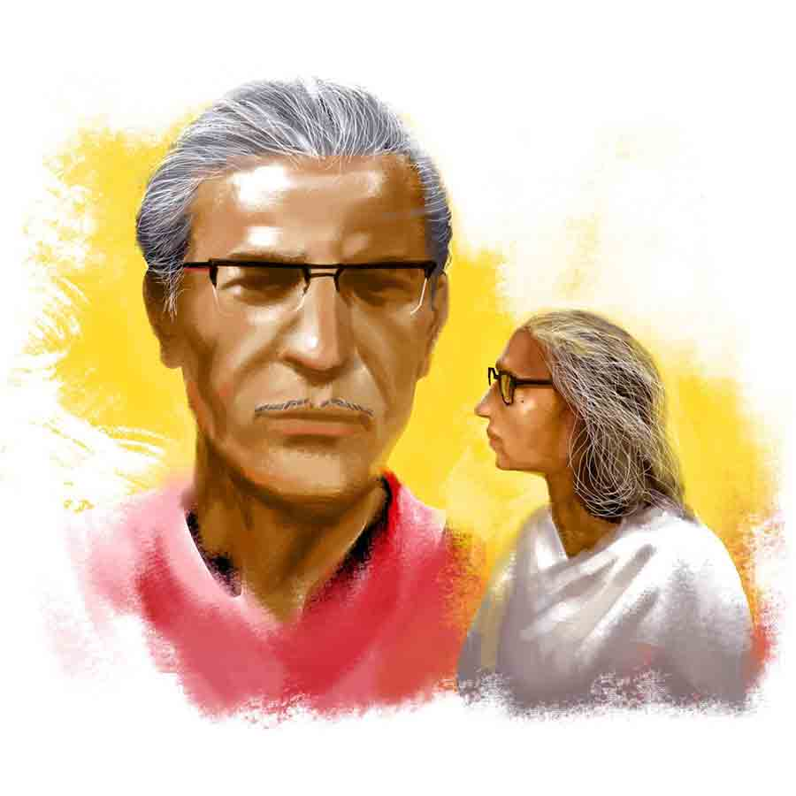

 
 <h1 align=center>মণিকণা</h1>
<h2 align=center>শৌভিক চট্টোপাধ্যায়</h2> 

মণি প্রায়ই দেখে স্বপ্নটা। আজও দেখেছে। দীর্ঘদিন ধরে স্বপ্নটা আসে। একটা ট্রেন ছেড়ে যাচ্ছে। মণি অনেক তাড়াহুড়ো করে স্টেশনে পৌঁছয়। তবে সে এসে পৌঁছনোর আগেই ট্রেন ছেড়ে যায়। তার পর সে প্ল্যাটফর্মে বসে হাপুসনয়নে কাঁদে। স্বপ্নের ভিতরের ব্যক্তিগত কষ্টটা ভীষণ নাস্তানাবুদ করে দেয় মণিকে। কমলেশ থাকতে এক বার কাউন্সেলরের কাছেও নিয়ে গিয়েছিল। তিনি জানতে চেয়েছিলেন, শৈশব বা কৈশোরের এমন কোনও ঘটনা ঘটেছিল কিনা যার জন্য ওঁর কোনও সেন্স অব ইনসিকিয়োরিটি, লস অর সেন্স অব ডিফিট আছে, কিংবা একা হয়ে পড়ার আশঙ্কা। মণি সদুত্তর দিতে পারেনি।

মণি, মণিকণার ডাক নাম। সকলে তাকে মণি বলে ডাকে। ওর হাজ়ব্যান্ড কমলেশও তা-ই বলেই ডাকত। কমলেশ বছর খানেক আগে আকস্মিক ভাবে পরলোকগত হয়েছে। মণির জীবন জুড়ে কমলেশ আর মিলি। মিলি মণির মেয়ে। বছর পাঁচেক হল বিয়ে হয়েছে। জামাই সফ্টওয়্যার ইঞ্জিনিয়ার। আপাতত একটি ফুটফুটে কন্যাসন্তান-সহ তারা কানাডায় থাকে। মণি দীর্ঘ কুড়ি বছর যাবৎ কমলাসুন্দরী দেবী মেমোরিয়াল স্কুলের হেডমিস্ট্রেস।

মণি আর কমলেশ থাকত সখের বাজারে। ওখানে ওদের নিজের বাড়ি। কমলেশ একটা কলেজে কমার্স পড়াত। তখনও বছর দুয়েকের চাকরি বাকি ছিল তার। এক দিন সকালে ঘুম থেকে আর উঠল না। মণি গায়ে হাত ছুঁইয়ে দেখল, সব ঠান্ডা। কমলেশ নেই। যে মানুষটা আগের দিন রাতেই বলল, “কাল রোববার, তোমার সেই স্পেশাল বেগুন দিয়ে ইলিশের ঝোলটা কোরো তো!” সেই মানুষটা সকালে নেই হয়ে গেল।

কমলেশ মণির জীবনের পরতে পরতে ওর পাশে থেকে গিয়েছে। যে কোনও সমস্যায় এক জন যথার্থ বন্ধুর মতোই স্ত্রীর পাশে থেকেছে। সারা জীবন দু’জনেই যে-যার কর্মজীবনে ভীষণ ব্যস্ত ছিল। ঠিক করেছিল, রিটায়ার করে দু’জনে খুব ঘুরবে। এক বার ইউরোপ ট্যুরে যাবে। সেই অনুযায়ী পাসপোর্ট করার ভাবনাচিন্তাও চলছিল। কিন্তু মানুষটাই কেমন হুট করে চলে গেল! চলে গেল, বলে গেল না! শখ করে বাড়ির নাম দিয়েছিল ‘বন্ধন’!

খুব শৌখিন মানুষ ছিল কমলেশ। ছাদবাগানে কত ফুলের গাছ! নীচে লিভিং রুমে অ্যাকোরিয়াম— সর্বত্র তার স্মৃতি! কমলেশ চলে যাওয়ার পর মণি ওই বাড়িতে থাকতে পারছিল না। স্মৃতি মানুষকে ভারী করে রাখে। মিলিই প্রস্তাব দেয়, “মা, আমাদের কমপ্লেক্সে আর একটা ব্লক রেডি হয়েছে শুনলাম। শুনছি থার্ড ফ্লোরে একটা থ্রিবিএইচকে রেডি টু মুভ সিচুয়েশনে আছে। কথা বলি? পাঁচটা মানুষের মাঝে সোসাইটিতে থাকলে ভাল লাগবে তোমার!”

মণি বলেছিল, “আমি ও-সব ফ্ল্যাটে গিয়ে থাকতে পারব না। ওখানে সবাই নিজেদের নিয়েই ব্যস্ত! আমার মোটেই ভাল লাগবে না।”

“মা, এটা আর পাঁচটা কমপ্লেক্সের থেকে আলাদা, তুমি আগে থেকেই জানো। আর আমরা কি সারা জীবনের মতো কানাডায় যাচ্ছি নাকি। ওর প্রোজেক্টের কাজ মিটলেই আমরা কলকাতায় ফিরে আসব। ম্যাক্সিমাম টু টু থ্রি ইয়ার্স!”

অনেক ভাবনাচিন্তার পর মণি কামালগাজির এই ফ্ল্যাটে এসেছে বছর খানেক হল। তবে সখের বাজারের বাড়ি বহাল তবিয়তে আছে। ওর যখন যেখানে থাকার ইচ্ছে হবে থাকবে। তবে এক বছরেই এই কমপ্লেক্সের কর্মকাণ্ডে ভীষণ ভাবে জড়িয়ে পড়েছে মণি। সবই ওই অসহ্য লোকটার কারণে!

মণি এই কমপ্লেক্সে যে দিন এল, ঠিক তার পরের দিনই সন্ধেবেলা ডোরবেল বাজল। দরজা খুলল ছবি। ছবি মণির দেখাশোনা করে। রান্নাবান্না করে দেয়। সর্বক্ষণ থাকে। মণি স্বয়ংসম্পূর্ণ মানুষ, কিন্তু মিলির জোরাজুরিতে রাখতে হয়েছে। এখন বুঝতে পারে, ছবির দরকার আছে। বয়স বাড়ছে। কমলেশ চলে যাওয়ার পর থেকে কোনও কিছু করার জন্য সেই মনের জোরও পায় না আগের মতো।

ছবি দরজা খুললে দেখা গেল, বাইরে পাঞ্জাবি পরা ধোপদুরস্ত এক জন দাঁড়িয়ে আছে।

“মণিকণা দেবী আছেন?”

ছবির পাশ দিয়ে নিজেই উত্তর দিয়েছিল মণি, “বলুন, কী ব্যাপার?”

“যদি অনুমতি দেন, তা হলে ভিতরে আসি।”

“আসুন।”

“মণিকণা দেবী নমস্কার। আমি মানিকরঞ্জন রায়। এই হাউজ়িং সোসাইটির প্রেসিডেন্ট...”

সে দিন সোসাইটির মেম্বারশিপ ফর্ম ফিল-আপ করানোর পাশাপাশি সোসাইটির কাজকর্মের ধারা, ভবিষ্যতে কী করতে চায় ইত্যাদি আলোচনা করে চলে যায় মানিকরঞ্জন। মানিকরঞ্জনের কথাবার্তায় এটুকু বুঝেছিল মণি, লোকটা হাউজ়িং সোসাইটির ভাল চায়, আর সোসাইটিতে যথেষ্ট প্রভাব-প্রতিপত্তি আছে!

কিছু দিন পরেই মানিকরঞ্জন ওকে এই সোসাইটির কালচারাল সেক্রেটারি হওয়ার প্রস্তাব দেয়। মণিকণা স্কুলের অনুষ্ঠানগুলোয় ছাত্রছাত্রীদের নিয়ে বরাবর সাংস্কৃতিক কাজ করে এসেছে। শুধু স্কুল কেন! ছোটবেলায় মামাবাড়ি বারাসতে থাকতেও সমবয়সি বা ছোটদের নিয়ে রবীন্দ্রজন্মজয়ন্তী পালন করা থেকে শুরু করে কুইজ়, ব্রতচারী সবই করে এসেছে। এ-সব ওর বড় ভালবাসার কাজ। মামাবাড়িতেই মানুষ মণি। মামাবাড়ির কথা মনে এলেই কেমন যেন হারিয়ে যায়।

স্বাভাবিকভাবেই মণি সে দিন মানিকরঞ্জনের দেওয়া কালচারাল সেক্রেটারি হওয়ার প্রস্তাব গ্রহণ করে। সোসাইটির মিটিং থাকে মাঝেমধ্যেই। প্রত্যেক মিটিংয়ে মণির সঙ্গে মানিকরঞ্জনের দেখা হয়। মণি খেয়াল করেছে, মানিকরঞ্জন যেন সব কিছুতেই প্রচ্ছন্ন সমর্থন করে মণিকে। কিন্তু মণির লোকটাকে বিন্দুমাত্র পছন্দ হয় না। কেমন যেন! মণি কিছু না বলতেই সব কিছু বুঝে যায়। তার কাজ করতে কী সুবিধে-অসুবিধে, যেন সব তার জানা। আর মণি নিজে মুখে কিছু বললে তো কথাই নেই। কী ভাবে তা কার্যকর করবে, সেই চেষ্টায় সে ব্যস্ত হয়ে পড়ে। গেল-মাসে মণি বলেছিল, “আমাদের কমপ্লেক্সের কমিউনিটি হলে একটা ওয়াটার পিউরিফায়ার বসালে কেমন হয়? পুজোর সময় তো দরকার হয়। এত মানুষ পুজোয় পার্টিসিপেট করে, এ ছাড়াও সারা বছর বাচ্চাদের যোগা, আঁকার ক্লাস হয়। ওটা থাকলে কাউকে আর জল বয়ে আনতে হবে না।”

সে দেখল, পরের মিটিংয়ে মানিকরঞ্জন প্রস্তাবটা রাখল আর মসৃণ ভাবে সেটা মঞ্জুর করিয়ে নিল, একেবারে ফান্ড থেকে সব বন্দোবস্তও করে নিল। মানিকরঞ্জনের স্বভাব হল, দেখা হলেই একগাল হাসি। সব সময় হ্যাপি মোড অন। এমন লোক আজকাল বিরল। মণি শুনেছে কয়েক বছর আগে ওঁর স্ত্রীবিয়োগ হয়েছে, তার পর থেকে উনি এই সোসাইটির ভালমন্দে সর্বক্ষণের সঙ্গী। এত ভাল ব্যবহার কাঁহাতক সহ্য হয়। এমনিতেই মণি স্বভাবগম্ভীর মানুষ। প্রধান শিক্ষিকার জীবিকাও তাকে কিছুটা অমন করে দিয়েছে।

এক দিন তো মণি কথাপ্রসঙ্গে মানিকরঞ্জনকে বলেই ফেলেছে, “আপনার এত অমায়িক ব্যবহারের রিপ্লাইয়ে আমি যদি এতটাই হ্যা-হ্যা রিটার্ন দিতে না পারি, আপনি কি অফেন্ডেড হবেন?”

মানিকরঞ্জন আসলে হা-হা করে হাসে না। কিন্তু মণির মুখোমুখি হলে ওর যেন অনেক জমে থাকা কথা বেরোতে চায়, সেগুলো না বেরোতে পেরে অমন স্মিতহাসি হয়ে ছড়িয়ে থাকে মুখ জুড়ে। মণি এ-সব মধ্যবয়স্ক লোকেদের খুব ভাল করে জানে। এদের ক্রাইসিস অন্য প্রকৃতির। কিন্তু সমস্যা হল, এ লোক তেমনও নয়। ওয়টস্যাপে প্রয়োজনীয় কথাটুকু হয়ে গেলে একটা হাসি-হাসি ইমোজি পাঠিয়ে লিখে দেয়, “আসি। পরে কথা হবে।” হুটপাট ফোন করে না। ফোন করার আগে সাধারণত এক বার জিজ্ঞেস করে, “ব্যস্ত? এক বার কি ফোন করতে পারি?”

লোকটার ভদ্রতার জ্বালায় অসহ্য বোধ হয়। মনে হয় পিদিমের দৈত্যের মতো এরও কাজ মণির সুবিধে-অসুবিধে দেখা। লোকটার কথা বলার ধরন প্রয়োজন ছাড়াই আন্তরিক, যেন কত যুগের চেনা! এতটা আন্তরিকতা মণির আবার ধাতে সয় না।

সে দিন যেমন মিটিংয়ে জোর কথা-কাটাকাটি হচ্ছিল। মণির প্রস্তাব ছিল, কমপ্লেক্সের জিম আর সুইমিং পুলে মহিলাদেরও অ্যাকসেস থাকুক। মি. আগরওয়াল বলে উঠল, “দেখেন মেডাম, এই সোসাইটির কিছু রুলস আছে। আমাদের লেডিজ়, বহুবিটিয়া আধি নাঙ্গি… পুল মে….! ঠিক নেহি লগতা! পুছিয়ে না পেরসিডেন্ট সাব সে!”

মণি যেন জানতই মানিকরঞ্জন কী বলবে, “আগরওয়ালদা, বাধ্যতামূলক তো কিছু নয়। কিন্তু এটা অ্যালাও করা উচিত। মহিলারা আজকাল সব জায়গায় এগিয়ে!”

সর্বসম্মতিক্রমে সিদ্ধান্ত পাস হয়ে গিয়েছিল। এত দিন সোসাইটিতে সরস্বতী পুজো হত না। মণির প্রস্তাবে সেই প্রস্তাবেও সিলমোহর পড়ার বন্দোবস্ত করে মানিকরঞ্জন। মণি মনে মনে তারিফ করে। কিন্তু তার অসহ্য লাগে এত কিছুর পরেও। একটা মানুষের সঙ্গে একটা অর্গানাইজ়েশন চালাচ্ছে। কখনও কোনও বিষয়ে মতানৈক্য হওয়াটা জরুরি। না হলে মণিই বা বুঝবে কী করে তার কোনও সিদ্ধান্তে ভুল হয়ে যাচ্ছে কি না! এখানে আসার দু’বছরের মাথায় মানিকরঞ্জনের উৎসাহে মণিকে অ্যাসিস্ট্যান্ট প্রেসিডেন্ট হতে হয়েছিল। মণি প্রথমটায় রাজি হচ্ছিল না, কিন্তু ওই জোরাজুরি!

“না মণিকণা, আমি জানি আপনি ভাল অর্গানাইজ়ার। আপনার উপস্থিতির গুরুত্ব অসীম। আপনাকে থাকতে হবে।”

মণিকণা রাজি হতে বাধ্যই হয়।

“কিন্তু আপনি কী করে জানলেন আমি ভাল অর্গানাইজ়ার?” হালকা হেসে প্রশ্ন করে মণি।

“জানি, বুঝলেন, জানি!”

*****

মণি প্রায়ই দেখে স্বপ্নটা। আজও দেখেছে। দীর্ঘদিন ধরে স্বপ্নটা আসে। একটা ট্রেন ছেড়ে যাচ্ছে। মণি অনেক তাড়াহুড়ো করে স্টেশনে পৌঁছয়। তবে সে এসে পৌঁছনোর আগেই ট্রেন ছেড়ে যায়। তার পর সে প্ল্যাটফর্মে বসে হাপুসনয়নে কাঁদে। স্বপ্নের ভিতরের ব্যক্তিগত কষ্টটা ভীষণ নাস্তানাবুদ করে দেয় মণিকে। কমলেশ থাকতে এক বার কাউন্সেলরের কাছেও নিয়ে গিয়েছিল। তিনি জানতে চেয়েছিলেন, শৈশব বা কৈশোরের এমন কোনও ঘটনা ঘটেছিল কিনা যার জন্য ওঁর কোনও সেন্স অব ইনসিকিয়োরিটি, লস অর সেন্স অব ডিফিট আছে, কিংবা একা হয়ে পড়ার আশঙ্কা। মণি সদুত্তর দিতে পারেনি।

মণি, মণিকণার ডাক নাম। সকলে তাকে মণি বলে ডাকে। ওর হাজ়ব্যান্ড কমলেশও তা-ই বলেই ডাকত। কমলেশ বছর খানেক আগে আকস্মিক ভাবে পরলোকগত হয়েছে। মণির জীবন জুড়ে কমলেশ আর মিলি। মিলি মণির মেয়ে। বছর পাঁচেক হল বিয়ে হয়েছে। জামাই সফ্টওয়্যার ইঞ্জিনিয়ার। আপাতত একটি ফুটফুটে কন্যাসন্তান-সহ তারা কানাডায় থাকে। মণি দীর্ঘ কুড়ি বছর যাবৎ কমলাসুন্দরী দেবী মেমোরিয়াল স্কুলের হেডমিস্ট্রেস।

মণি আর কমলেশ থাকত সখের বাজারে। ওখানে ওদের নিজের বাড়ি। কমলেশ একটা কলেজে কমার্স পড়াত। তখনও বছর দুয়েকের চাকরি বাকি ছিল তার। এক দিন সকালে ঘুম থেকে আর উঠল না। মণি গায়ে হাত ছুঁইয়ে দেখল, সব ঠান্ডা। কমলেশ নেই। যে মানুষটা আগের দিন রাতেই বলল, “কাল রোববার, তোমার সেই স্পেশাল বেগুন দিয়ে ইলিশের ঝোলটা কোরো তো!” সেই মানুষটা সকালে নেই হয়ে গেল।

কমলেশ মণির জীবনের পরতে পরতে ওর পাশে থেকে গিয়েছে। যে কোনও সমস্যায় এক জন যথার্থ বন্ধুর মতোই স্ত্রীর পাশে থেকেছে। সারা জীবন দু’জনেই যে-যার কর্মজীবনে ভীষণ ব্যস্ত ছিল। ঠিক করেছিল, রিটায়ার করে দু’জনে খুব ঘুরবে। এক বার ইউরোপ ট্যুরে যাবে। সেই অনুযায়ী পাসপোর্ট করার ভাবনাচিন্তাও চলছিল। কিন্তু মানুষটাই কেমন হুট করে চলে গেল! চলে গেল, বলে গেল না! শখ করে বাড়ির নাম দিয়েছিল ‘বন্ধন’!

খুব শৌখিন মানুষ ছিল কমলেশ। ছাদবাগানে কত ফুলের গাছ! নীচে লিভিং রুমে অ্যাকোরিয়াম— সর্বত্র তার স্মৃতি! কমলেশ চলে যাওয়ার পর মণি ওই বাড়িতে থাকতে পারছিল না। স্মৃতি মানুষকে ভারী করে রাখে। মিলিই প্রস্তাব দেয়, “মা, আমাদের কমপ্লেক্সে আর একটা ব্লক রেডি হয়েছে শুনলাম। শুনছি থার্ড ফ্লোরে একটা থ্রিবিএইচকে রেডি টু মুভ সিচুয়েশনে আছে। কথা বলি? পাঁচটা মানুষের মাঝে সোসাইটিতে থাকলে ভাল লাগবে তোমার!”

মণি বলেছিল, “আমি ও-সব ফ্ল্যাটে গিয়ে থাকতে পারব না। ওখানে সবাই নিজেদের নিয়েই ব্যস্ত! আমার মোটেই ভাল লাগবে না।”

“মা, এটা আর পাঁচটা কমপ্লেক্সের থেকে আলাদা, তুমি আগে থেকেই জানো। আর আমরা কি সারা জীবনের মতো কানাডায় যাচ্ছি নাকি। ওর প্রোজেক্টের কাজ মিটলেই আমরা কলকাতায় ফিরে আসব। ম্যাক্সিমাম টু টু থ্রি ইয়ার্স!”

অনেক ভাবনাচিন্তার পর মণি কামালগাজির এই ফ্ল্যাটে এসেছে বছর খানেক হল। তবে সখের বাজারের বাড়ি বহাল তবিয়তে আছে। ওর যখন যেখানে থাকার ইচ্ছে হবে থাকবে। তবে এক বছরেই এই কমপ্লেক্সের কর্মকাণ্ডে ভীষণ ভাবে জড়িয়ে পড়েছে মণি। সবই ওই অসহ্য লোকটার কারণে!

মণি এই কমপ্লেক্সে যে দিন এল, ঠিক তার পরের দিনই সন্ধেবেলা ডোরবেল বাজল। দরজা খুলল ছবি। ছবি মণির দেখাশোনা করে। রান্নাবান্না করে দেয়। সর্বক্ষণ থাকে। মণি স্বয়ংসম্পূর্ণ মানুষ, কিন্তু মিলির জোরাজুরিতে রাখতে হয়েছে। এখন বুঝতে পারে, ছবির দরকার আছে। বয়স বাড়ছে। কমলেশ চলে যাওয়ার পর থেকে কোনও কিছু করার জন্য সেই মনের জোরও পায় না আগের মতো।

ছবি দরজা খুললে দেখা গেল, বাইরে পাঞ্জাবি পরা ধোপদুরস্ত এক জন দাঁড়িয়ে আছে।

“মণিকণা দেবী আছেন?”

ছবির পাশ দিয়ে নিজেই উত্তর দিয়েছিল মণি, “বলুন, কী ব্যাপার?”

“যদি অনুমতি দেন, তা হলে ভিতরে আসি।”

“আসুন।”

“মণিকণা দেবী নমস্কার। আমি মানিকরঞ্জন রায়। এই হাউজ়িং সোসাইটির প্রেসিডেন্ট...”

সে দিন সোসাইটির মেম্বারশিপ ফর্ম ফিল-আপ করানোর পাশাপাশি সোসাইটির কাজকর্মের ধারা, ভবিষ্যতে কী করতে চায় ইত্যাদি আলোচনা করে চলে যায় মানিকরঞ্জন। মানিকরঞ্জনের কথাবার্তায় এটুকু বুঝেছিল মণি, লোকটা হাউজ়িং সোসাইটির ভাল চায়, আর সোসাইটিতে যথেষ্ট প্রভাব-প্রতিপত্তি আছে!

কিছু দিন পরেই মানিকরঞ্জন ওকে এই সোসাইটির কালচারাল সেক্রেটারি হওয়ার প্রস্তাব দেয়। মণিকণা স্কুলের অনুষ্ঠানগুলোয় ছাত্রছাত্রীদের নিয়ে বরাবর সাংস্কৃতিক কাজ করে এসেছে। শুধু স্কুল কেন! ছোটবেলায় মামাবাড়ি বারাসতে থাকতেও সমবয়সি বা ছোটদের নিয়ে রবীন্দ্রজন্মজয়ন্তী পালন করা থেকে শুরু করে কুইজ়, ব্রতচারী সবই করে এসেছে। এ-সব ওর বড় ভালবাসার কাজ। মামাবাড়িতেই মানুষ মণি। মামাবাড়ির কথা মনে এলেই কেমন যেন হারিয়ে যায়।

স্বাভাবিকভাবেই মণি সে দিন মানিকরঞ্জনের দেওয়া কালচারাল সেক্রেটারি হওয়ার প্রস্তাব গ্রহণ করে। সোসাইটির মিটিং থাকে মাঝেমধ্যেই। প্রত্যেক মিটিংয়ে মণির সঙ্গে মানিকরঞ্জনের দেখা হয়। মণি খেয়াল করেছে, মানিকরঞ্জন যেন সব কিছুতেই প্রচ্ছন্ন সমর্থন করে মণিকে। কিন্তু মণির লোকটাকে বিন্দুমাত্র পছন্দ হয় না। কেমন যেন! মণি কিছু না বলতেই সব কিছু বুঝে যায়। তার কাজ করতে কী সুবিধে-অসুবিধে, যেন সব তার জানা। আর মণি নিজে মুখে কিছু বললে তো কথাই নেই। কী ভাবে তা কার্যকর করবে, সেই চেষ্টায় সে ব্যস্ত হয়ে পড়ে। গেল-মাসে মণি বলেছিল, “আমাদের কমপ্লেক্সের কমিউনিটি হলে একটা ওয়াটার পিউরিফায়ার বসালে কেমন হয়? পুজোর সময় তো দরকার হয়। এত মানুষ পুজোয় পার্টিসিপেট করে, এ ছাড়াও সারা বছর বাচ্চাদের যোগা, আঁকার ক্লাস হয়। ওটা থাকলে কাউকে আর জল বয়ে আনতে হবে না।”

সে দেখল, পরের মিটিংয়ে মানিকরঞ্জন প্রস্তাবটা রাখল আর মসৃণ ভাবে সেটা মঞ্জুর করিয়ে নিল, একেবারে ফান্ড থেকে সব বন্দোবস্তও করে নিল। মানিকরঞ্জনের স্বভাব হল, দেখা হলেই একগাল হাসি। সব সময় হ্যাপি মোড অন। এমন লোক আজকাল বিরল। মণি শুনেছে কয়েক বছর আগে ওঁর স্ত্রীবিয়োগ হয়েছে, তার পর থেকে উনি এই সোসাইটির ভালমন্দে সর্বক্ষণের সঙ্গী। এত ভাল ব্যবহার কাঁহাতক সহ্য হয়। এমনিতেই মণি স্বভাবগম্ভীর মানুষ। প্রধান শিক্ষিকার জীবিকাও তাকে কিছুটা অমন করে দিয়েছে।

এক দিন তো মণি কথাপ্রসঙ্গে মানিকরঞ্জনকে বলেই ফেলেছে, “আপনার এত অমায়িক ব্যবহারের রিপ্লাইয়ে আমি যদি এতটাই হ্যা-হ্যা রিটার্ন দিতে না পারি, আপনি কি অফেন্ডেড হবেন?”

মানিকরঞ্জন আসলে হা-হা করে হাসে না। কিন্তু মণির মুখোমুখি হলে ওর যেন অনেক জমে থাকা কথা বেরোতে চায়, সেগুলো না বেরোতে পেরে অমন স্মিতহাসি হয়ে ছড়িয়ে থাকে মুখ জুড়ে। মণি এ-সব মধ্যবয়স্ক লোকেদের খুব ভাল করে জানে। এদের ক্রাইসিস অন্য প্রকৃতির। কিন্তু সমস্যা হল, এ লোক তেমনও নয়। ওয়টস্যাপে প্রয়োজনীয় কথাটুকু হয়ে গেলে একটা হাসি-হাসি ইমোজি পাঠিয়ে লিখে দেয়, “আসি। পরে কথা হবে।” হুটপাট ফোন করে না। ফোন করার আগে সাধারণত এক বার জিজ্ঞেস করে, “ব্যস্ত? এক বার কি ফোন করতে পারি?”

লোকটার ভদ্রতার জ্বালায় অসহ্য বোধ হয়। মনে হয় পিদিমের দৈত্যের মতো এরও কাজ মণির সুবিধে-অসুবিধে দেখা। লোকটার কথা বলার ধরন প্রয়োজন ছাড়াই আন্তরিক, যেন কত যুগের চেনা! এতটা আন্তরিকতা মণির আবার ধাতে সয় না।

সে দিন যেমন মিটিংয়ে জোর কথা-কাটাকাটি হচ্ছিল। মণির প্রস্তাব ছিল, কমপ্লেক্সের জিম আর সুইমিং পুলে মহিলাদেরও অ্যাকসেস থাকুক। মি. আগরওয়াল বলে উঠল, “দেখেন মেডাম, এই সোসাইটির কিছু রুলস আছে। আমাদের লেডিজ়, বহুবিটিয়া আধি নাঙ্গি… পুল মে….! ঠিক নেহি লগতা! পুছিয়ে না পেরসিডেন্ট সাব সে!”

মণি যেন জানতই মানিকরঞ্জন কী বলবে, “আগরওয়ালদা, বাধ্যতামূলক তো কিছু নয়। কিন্তু এটা অ্যালাও করা উচিত। মহিলারা আজকাল সব জায়গায় এগিয়ে!”

সর্বসম্মতিক্রমে সিদ্ধান্ত পাস হয়ে গিয়েছিল। এত দিন সোসাইটিতে সরস্বতী পুজো হত না। মণির প্রস্তাবে সেই প্রস্তাবেও সিলমোহর পড়ার বন্দোবস্ত করে মানিকরঞ্জন। মণি মনে মনে তারিফ করে। কিন্তু তার অসহ্য লাগে এত কিছুর পরেও। একটা মানুষের সঙ্গে একটা অর্গানাইজ়েশন চালাচ্ছে। কখনও কোনও বিষয়ে মতানৈক্য হওয়াটা জরুরি। না হলে মণিই বা বুঝবে কী করে তার কোনও সিদ্ধান্তে ভুল হয়ে যাচ্ছে কি না! এখানে আসার দু’বছরের মাথায় মানিকরঞ্জনের উৎসাহে মণিকে অ্যাসিস্ট্যান্ট প্রেসিডেন্ট হতে হয়েছিল। মণি প্রথমটায় রাজি হচ্ছিল না, কিন্তু ওই জোরাজুরি!

“না মণিকণা, আমি জানি আপনি ভাল অর্গানাইজ়ার। আপনার উপস্থিতির গুরুত্ব অসীম। আপনাকে থাকতে হবে।”

মণিকণা রাজি হতে বাধ্যই হয়।

“কিন্তু আপনি কী করে জানলেন আমি ভাল অর্গানাইজ়ার?” হালকা হেসে প্রশ্ন করে মণি।

“জানি, বুঝলেন, জানি!”

*****

মণি এই কমপ্লেক্সে আসার আড়াই বছর অতিক্রান্ত। নিজের মনের মতো করে সোসাইটিকে সাজিয়েছে সে। এখন সোসাইটিতে হাজারো অ্যাকটিভিটি হয়। মানিকরঞ্জনের সহায়তায় বিভিন্ন পদক্ষেপের সঙ্গে এ বছর সোসাইটির নিজস্ব কো-অপারেটিভ হয়েছে। এখান থেকে আবাসিকরা প্রয়োজন মতো সীমিত পরিমাণে ঋণ নিতে পারবে। সোসাইটির নিজস্ব অফিস হয়েছে। মানিকরঞ্জন আজও মণির পাশে থাকে। রিটায়ার করার পর মানিকরঞ্জন সোসাইটির কাজে এখন আরও সক্রিয়!

মর্নিং ওয়াকের সময় লেকের পাশে ওদের রোজ দেখা হয়। আজও হল। তবে মণির মেজাজ আজ তুঙ্গে। শেষ এক সপ্তাহ মানিকরঞ্জন বেপাত্তা হয়ে গেছিল। শুনেছে, দুর্গাপুরে মেয়ের বাড়ি গিয়েছিল। বিপিনবাবু আর ওর স্ত্রীকে জিজ্ঞেস করেছিল মণি, “আপনাদের বন্ধুটিকে যে দেখতে পাচ্ছি না...”

আসলে সব কিছুই একটা অভ্যেস। আজ সকালে মানিকরঞ্জনের সঙ্গে দেখা হওয়ার পর অন্য দিকে পা চালিয়েছিল মণি। মনে মনে ভারী রাগ হয়েছিল ওর। কোনও মানে হয়? ওকে না বলে পুরো বেপাত্তা হয়ে যাওয়া! ওর জীবনে এই না বলে বেপাত্তা হয়ে যাওয়া ব্যাপারটার বিরাট ভূমিকা। জীবনে অনেক ধাক্কা সে পেয়েছে। জীবনে কমলেশ আসায় বেশ থিতু হয়। মণির পুরো জীবন জুড়ে সে ছিল। সে-ও চলে গিয়েছিল কোনও মানসিক প্রস্তুতি ছাড়াই। এমনকি মিলিরাও এ দেশে থাকবে না, কানাডায় উড়ে যাবে— সে সংবাদও আকস্মিক ভাবেই পায় মণি। কাজেই এমন হঠাৎ করে উধাও হয়ে মানিকরঞ্জন মোটেও ভাল কাজ করেনি। সারা দিন কোনও কথা হয়নি প্রেসিডেন্ট আর ভাইস প্রেসিডেন্টের মধ্যে।

“আচ্ছা মণিকণা, আপনি কি রেগে আছেন!” এই একই প্রশ্ন বারকতক করেও কোনও উত্তর পায়নি। আজ সন্ধেবেলা কিছু জরুরি সইসাবুদের জন্য মানিকরঞ্জন আসে মণির ফ্ল্যাটে। এখনও মণির মুখ ভার। কাজের কথার পর মানিকরঞ্জনই বলল, “ছবিকে বলুন না এক কাপ চা খাওয়াতে!”

“কেন আমি করলে খাবেন না? ছবি ছুটিতে।”

“তা কেন! দিন, দিন। সেই আদা দিয়ে লিকার চা-টা করবেন, কেমন?”

“এ ভাবে কাউকে কিছু না বলে হঠাৎ উধাও? মানুষ তো জানায়, না কি? এই বেপাত্তা হয়ে যাওয়ার হ্যাবিটটা কবে থেকে হল?”

“বলতে পারেন ছোটবেলা থেকেই! জোকস অ্যাপার্ট, আই অ্যাম এক্সট্রিমলি সরি! আসলে নাতনিটা এমন করে ডাকল!”

একটু রাগ কমছে মণির। হালকা হেসে উঠে গেল। চা করে প্লেটের উপর সাজিয়ে নিয়ে ঘরে আসছে। আকস্মিক ভাবে ম্যাট্রেসে পা আটকে গরম চা-সমেত মেঝেয় পড়ে গেল। মুহূর্তে ব্ল্যাক-আউট।

*****

মণিকে নার্সিংহোমে নিয়ে আসতে হয়েছিল। মেঝেতে পড়ায় পায়ের হাড়ে একটা হালকা ফ্র‍্যাকচার, আর কপালের কাছে একটা সেলাই হয়েছে। জ্ঞান এসে গিয়েছিল ঘটনার সামান্য পরেই। এমনিতে রিপোর্টে দুশ্চিন্তার কিছু নেই। ডাক্তারের নির্দেশে অবজ়ারভেশনে আজকের দিনটাও নার্সিং হোমে থাকবে মণি। কাল সকালে ছুটি। দুপুরে ঘুমিয়েছে ভাল। সেই স্বপ্নটা অনেক দিন পর আবার দেখল আজ। ঘুমের মধ্যে হয়তো কেঁদেওছে কিঞ্চিৎ। কাচের জানলা দিয়ে দেখছে, দূরে শেষ বিকেলের হলুদ রোদ এসে পড়েছে ফ্লাইওভারের বুকে।

“কী, ভাবছেন কী?”

হাসিমুখে এল মানিকরঞ্জন। মণি ভাবল একটু কথা বলা যাবে, ছবিও বাড়ি গেল এইমাত্র।

আজ মানিকরঞ্জনের হাসিতে একই হাসি ফিরিয়ে দিল মণি, “জানেন, আমি বহু বছর ধরে একটা স্বপ্ন দেখে আসছি। আজও দেখলাম।” তার পর সেই ট্রেন চলে যাওয়া, আর স্টেশনে বসে মণির হাপুসনয়নে কাঁদার স্বপ্নটা মানিকরঞ্জনকে বলল।

“এই স্বপ্ন তো শুধু স্বপ্ন নয়। এ তো ঘটনা! শুধু তো ট্রেন মিস করেননি, ট্রেনে চেপে তো কেউ চলেও গিয়েছিল! তাই তো?”

“গিয়েছিল তো! রঞ্জু। ওর বাবা নাকি ইউপি ট্রান্সফার হয়েছিল। তাই হঠাৎ এক দিন রঞ্জু চলে গেল। আমি ছুটতে ছুটতে স্টেশনে গেলাম, কিন্তু দেখা হল না। আর কোনও দিন দেখা হল না। রঞ্জু আমার বন্ধু। প্রেমিক ঠিক নয়, জানেন! আবার যেন শুধু বন্ধুও নয়। ও সবার চেয়ে আলাদা। সেই কোন ছোটবেলার কথা, তেরো-চোদ্দো বছর বয়স তখন। কাউকে কখনও বলতে পারিনি রঞ্জুর কথা! আবার ওকে ভুলতেও পারিনি আজও!”

“দূর! বেমালুম ভুলে গেছেন!”

মুখ জুড়ে হাসি ছড়িয়ে বলল মানিকরঞ্জন।

(এই প্রতিবেদনটি আনন্দবাজার পত্রিকার মুদ্রিত সংস্করণ থেকে নেওয়া হয়েছে)

