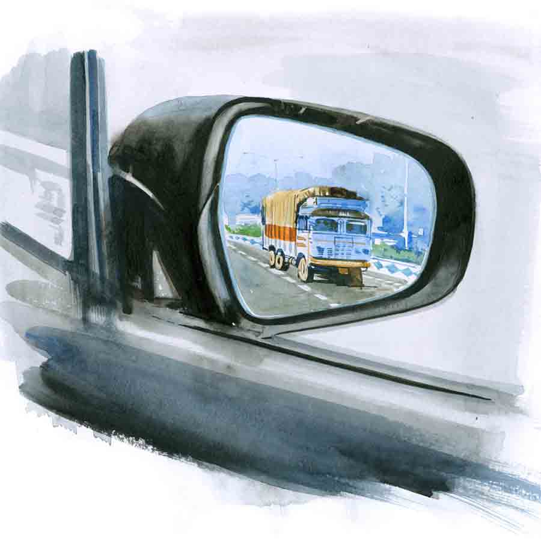

 
 <h1 align=center>মৃত্যুর ইশারা</h1>
<h2 align=center>বিনতা রায়চৌধুরী</h2> 

অপরাজিতা ছোট থেকেই খুব মেধাবী। পড়ত কম, কিন্তু রেজ়াল্ট ভাল করত। মা যদি বলত, “অপু, আরও একটু পড়লে, কত ভাল রেজ়াল্ট হত তোর!” তখন অপুর স্পষ্ট উত্তর, “ভাল রেজ়াল্ট করা ছাড়া আমার কি আর কোনও কাজ নেই?”

“এ আবার কী রকম কথা? স্টুডেন্ট লাইফে পড়াশোনা করাটাই তো আসল কাজ!”

অপরাজিতা বলত, “আসল-নকল জানি না। বইয়ে মুখ গুঁজে ফার্স্ট-সেকেন্ড হওয়ার দৌড়ে আমি নেই। এই যে আমাদের কলেজে আন্তর্জাতিক ভাষা দিবস পালিত হবে, আমিই কনভেনর। আমাকে স্ক্রিপ্ট লিখতে হবে, প্রোগ্রাম সাজাতে হবে। অনুষ্ঠান পরিবেশনের দায়িত্ব আমার। এটা করব না?”

মা বলত, “পড়াশোনা ছেড়ে ওই সবে মন দিবি?”

“কারণ আমার ভাল লাগে। দাদুই শিখিয়েছেন, ‘ওয়ান-সাইডেড রোস্টেড এগ হবে না দিদিভাই। জীবনের একটা দিকেই শুধু পাকা হলে, আর কিছুই জানা হল না, এটা কোনও কাজের কথা নয়।’ জীবনের সব ভাল লাগার পাত্র থেকে আনন্দ গ্রহণ করতে হয়, মা। তবেই না জীবন সম্পূর্ণ হয়।”

এই কথা শুনে মা খুশি হল না, কিন্তু চুপ করে গেল।

অপরাজিতা আঠারো বছর পেরোনোর সঙ্গে সঙ্গে দাদু বললেন, “চল, তোকে ড্রাইভিং শেখাই।” অপরাজিতা এক কথায় রাজি। শুধু রাজি নয়, সানন্দে রাজি।

অল্প কিছু দিনের মধ্যেই অপরাজিতা ড্রাইভিংটা করায়ত্ত করে ফেলল। রীতিমতো নেশায় পেয়ে বসল ওকে। সুযোগ পেলেই গাড়ি চালাতে চায়। ওর বাবা একটু ভয় পান, বলেন, “নতুন হাত, চল আমিও সঙ্গে যাই।”

প্রথম প্রথম বাবাকে নিয়ে বেরোত অপরাজিতা, তার পর একাই বেরিয়ে যেত। দারুণ সাহস ছিল, আজও আছে। অপরাজিতা এত ভাল গাড়ি চালানো শিখে গেল যে, দাদু একেবারে নিশ্চিন্তে অপুর হাতে গাড়ি ছেড়ে দিতেন।

সেই দাদু যখন হাসপাতালে ভর্তি হলেন, তখন অপরাজিতা সব ছেড়ে হাসপাতালেই পড়ে রইল। মা বলেছিল, “তোর সামনে পরীক্ষা, তুই এত আসিস না। আমরা তো আছি।”

অপরাজিতা মুখ ভার করে বলেছিল, “এই টেস্ট পরীক্ষায় কম পেলে ফাইনালে পুষিয়ে নেব। কিন্তু দাদুর পেসমেকার বসবে। সেখানে আর টেস্ট-ফাইনাল নেই মা।”

অপরাজিতার বাবা মেয়েকেই সমর্থন করেছিলেন। যেমন সব সময়ই করেন।

সবাইকে চমকে দিয়েছিল অপরাজিতা বিয়ের পর শ্বশুরবাড়ি যাওয়ার দিন। মা যখন বিদায়বেলায় চোখে জল নিয়ে আঁচল পেতে দাঁড়াল, “কনকাঞ্জলিটা দিয়ে যা অপু।”

মাকে জড়িয়ে ধরে তাঁর অপু বলেছিল, “তোমার আঁচলে চাল ফেলে ঋণ শোধ করে যাব? ওই সব নিয়ম আমি মানব না মা। তোমাকে হাত নেড়ে টা-টা করে যাব।”

কেউ এক জন এসে মায়ের কানে কানে বলে গেল, অপরাজিতা নিজে ড্রাইভ করে শ্বশুরবাড়ি যাচ্ছে। মা তো আঁতকে উঠল, “কী সাংঘাতিক কথা! তুমি ওকে বারণ করো।”

মেয়ের বাবা কিন্তু খুশিমনে বলল, “বারণ করব কেন? যাচ্ছে, যাক না। ও এত ভালবাসে গাড়ি চালাতে, দারুণ চালায়।”

এই গল্পটা অপরাজিতা নিজের মেয়ে অর্ণাকেও বলেছে পরে। ছোটবেলা থেকে এই গল্প কত বার শুনেছে অর্ণা, আর খুব হেসেছে।

*****

সেই অর্ণা যখন আঠারো হল, অপরাজিতা বললেন, “চল, তোকে গাড়ি চালানো শেখাই।”

কিন্তু অর্ণা কোনও দিক থেকেই অপরাজিতা নয়। তার ড্রাইভিংয়ে ইন্টারেস্টই নেই।

এক দিন অপরাজিতা বললেন, “না, আমার কাছে তোর শেখা হবে না। এক-এক দিন তোর এক-এক রকম বাহানা, আজ মাথা ধরেছে তো কাল মুড নেই। তুই বরং একটা ড্রাইভিং স্কুলে ভর্তি হয়ে যা।” অর্ণার বাবাও তা-ই বললেন, “তোমার মতো ওর অত ন্যাক নেই। সময় লাগবে। ড্রাইভিং স্কুলে দিয়ে দেওয়াই ভাল। ওরা শেখাবে, প্র্যাকটিস করাবে, লাইসেন্সও করিয়ে দেবে।”

লাইসেন্স তো পেয়ে গেছে অর্ণা। কিন্তু প্র্যাকটিসের অভাব। তাই ভয় কাটেনি। যখনই ওকে চালাতে দেওয়া হবে, ও হয় ড্রাইভারদাকে ডাকবে, নয়তো মাকে বলবে সঙ্গে যেতে।

অপরাজিতা ছিলেন বাবা-ভক্ত মেয়ে। মায়ের সঙ্গে ভাব ছিল না। এখানে হয়েছে উল্টো। অর্ণা ভীষণই মা-ভক্ত। মা-ই তার বেস্ট ফ্রেন্ড।

অর্ণা কাল বন্ধুর বাড়ি যাবে। একটা ছোটখাটো গেট-টুগেদার আছে। তার জন্য কিছু শপিং করা দরকার। আজ সেই শপিংয়ে যাওয়ার প্রস্তুতি নিচ্ছে অর্ণা।

অপরাজিতা বললেন, “আর দেরি করিস না, বেরিয়ে পড়। না হলে যেতে পারবি না সোনা।”

“হ্যাঁ, এখনই বেরোচ্ছি মা। ড্রাইভারদা এসে গেছে?”

“ড্রাইভারদা কেন? আজ তো তুই নিজেই চালাবি গাড়িটা।”

“না না মা, আজ থাক। আমি বরং নেক্সট দিন চালাব।”

“না, আজই চালাবি। ও রকম করলে কোনও দিনই ইজ়ি হতে পারবি না।”

“পারব পারব, আর কিছু দিন পর ঠিক পারব।”

“কত বড় জায়গা থেকে গাড়ি চালানো শিখেছিস! অথচ চালাতে গেলেই ভয় পাস। প্র্যাকটিস না করলে তো ভয় ভাঙবে না।”

“ভাঙবে ভাঙবে, পরে ভেঙে যাবে। আজ তো ড্রাইভারদা চালাক।”

অপরাজিতা ছোট থেকেই খুব মেধাবী। পড়ত কম, কিন্তু রেজ়াল্ট ভাল করত। মা যদি বলত, “অপু, আরও একটু পড়লে, কত ভাল রেজ়াল্ট হত তোর!” তখন অপুর স্পষ্ট উত্তর, “ভাল রেজ়াল্ট করা ছাড়া আমার কি আর কোনও কাজ নেই?”

“এ আবার কী রকম কথা? স্টুডেন্ট লাইফে পড়াশোনা করাটাই তো আসল কাজ!”

অপরাজিতা বলত, “আসল-নকল জানি না। বইয়ে মুখ গুঁজে ফার্স্ট-সেকেন্ড হওয়ার দৌড়ে আমি নেই। এই যে আমাদের কলেজে আন্তর্জাতিক ভাষা দিবস পালিত হবে, আমিই কনভেনর। আমাকে স্ক্রিপ্ট লিখতে হবে, প্রোগ্রাম সাজাতে হবে। অনুষ্ঠান পরিবেশনের দায়িত্ব আমার। এটা করব না?”

মা বলত, “পড়াশোনা ছেড়ে ওই সবে মন দিবি?”

“কারণ আমার ভাল লাগে। দাদুই শিখিয়েছেন, ‘ওয়ান-সাইডেড রোস্টেড এগ হবে না দিদিভাই। জীবনের একটা দিকেই শুধু পাকা হলে, আর কিছুই জানা হল না, এটা কোনও কাজের কথা নয়।’ জীবনের সব ভাল লাগার পাত্র থেকে আনন্দ গ্রহণ করতে হয়, মা। তবেই না জীবন সম্পূর্ণ হয়।”

এই কথা শুনে মা খুশি হল না, কিন্তু চুপ করে গেল।

অপরাজিতা আঠারো বছর পেরোনোর সঙ্গে সঙ্গে দাদু বললেন, “চল, তোকে ড্রাইভিং শেখাই।” অপরাজিতা এক কথায় রাজি। শুধু রাজি নয়, সানন্দে রাজি।

অল্প কিছু দিনের মধ্যেই অপরাজিতা ড্রাইভিংটা করায়ত্ত করে ফেলল। রীতিমতো নেশায় পেয়ে বসল ওকে। সুযোগ পেলেই গাড়ি চালাতে চায়। ওর বাবা একটু ভয় পান, বলেন, “নতুন হাত, চল আমিও সঙ্গে যাই।”

প্রথম প্রথম বাবাকে নিয়ে বেরোত অপরাজিতা, তার পর একাই বেরিয়ে যেত। দারুণ সাহস ছিল, আজও আছে। অপরাজিতা এত ভাল গাড়ি চালানো শিখে গেল যে, দাদু একেবারে নিশ্চিন্তে অপুর হাতে গাড়ি ছেড়ে দিতেন।

সেই দাদু যখন হাসপাতালে ভর্তি হলেন, তখন অপরাজিতা সব ছেড়ে হাসপাতালেই পড়ে রইল। মা বলেছিল, “তোর সামনে পরীক্ষা, তুই এত আসিস না। আমরা তো আছি।”

অপরাজিতা মুখ ভার করে বলেছিল, “এই টেস্ট পরীক্ষায় কম পেলে ফাইনালে পুষিয়ে নেব। কিন্তু দাদুর পেসমেকার বসবে। সেখানে আর টেস্ট-ফাইনাল নেই মা।”

অপরাজিতার বাবা মেয়েকেই সমর্থন করেছিলেন। যেমন সব সময়ই করেন।

সবাইকে চমকে দিয়েছিল অপরাজিতা বিয়ের পর শ্বশুরবাড়ি যাওয়ার দিন। মা যখন বিদায়বেলায় চোখে জল নিয়ে আঁচল পেতে দাঁড়াল, “কনকাঞ্জলিটা দিয়ে যা অপু।”

মাকে জড়িয়ে ধরে তাঁর অপু বলেছিল, “তোমার আঁচলে চাল ফেলে ঋণ শোধ করে যাব? ওই সব নিয়ম আমি মানব না মা। তোমাকে হাত নেড়ে টা-টা করে যাব।”

কেউ এক জন এসে মায়ের কানে কানে বলে গেল, অপরাজিতা নিজে ড্রাইভ করে শ্বশুরবাড়ি যাচ্ছে। মা তো আঁতকে উঠল, “কী সাংঘাতিক কথা! তুমি ওকে বারণ করো।”

মেয়ের বাবা কিন্তু খুশিমনে বলল, “বারণ করব কেন? যাচ্ছে, যাক না। ও এত ভালবাসে গাড়ি চালাতে, দারুণ চালায়।”

এই গল্পটা অপরাজিতা নিজের মেয়ে অর্ণাকেও বলেছে পরে। ছোটবেলা থেকে এই গল্প কত বার শুনেছে অর্ণা, আর খুব হেসেছে।

*****

সেই অর্ণা যখন আঠারো হল, অপরাজিতা বললেন, “চল, তোকে গাড়ি চালানো শেখাই।”

কিন্তু অর্ণা কোনও দিক থেকেই অপরাজিতা নয়। তার ড্রাইভিংয়ে ইন্টারেস্টই নেই।

এক দিন অপরাজিতা বললেন, “না, আমার কাছে তোর শেখা হবে না। এক-এক দিন তোর এক-এক রকম বাহানা, আজ মাথা ধরেছে তো কাল মুড নেই। তুই বরং একটা ড্রাইভিং স্কুলে ভর্তি হয়ে যা।” অর্ণার বাবাও তা-ই বললেন, “তোমার মতো ওর অত ন্যাক নেই। সময় লাগবে। ড্রাইভিং স্কুলে দিয়ে দেওয়াই ভাল। ওরা শেখাবে, প্র্যাকটিস করাবে, লাইসেন্সও করিয়ে দেবে।”

লাইসেন্স তো পেয়ে গেছে অর্ণা। কিন্তু প্র্যাকটিসের অভাব। তাই ভয় কাটেনি। যখনই ওকে চালাতে দেওয়া হবে, ও হয় ড্রাইভারদাকে ডাকবে, নয়তো মাকে বলবে সঙ্গে যেতে।

অপরাজিতা ছিলেন বাবা-ভক্ত মেয়ে। মায়ের সঙ্গে ভাব ছিল না। এখানে হয়েছে উল্টো। অর্ণা ভীষণই মা-ভক্ত। মা-ই তার বেস্ট ফ্রেন্ড।

অর্ণা কাল বন্ধুর বাড়ি যাবে। একটা ছোটখাটো গেট-টুগেদার আছে। তার জন্য কিছু শপিং করা দরকার। আজ সেই শপিংয়ে যাওয়ার প্রস্তুতি নিচ্ছে অর্ণা।

অপরাজিতা বললেন, “আর দেরি করিস না, বেরিয়ে পড়। না হলে যেতে পারবি না সোনা।”

“হ্যাঁ, এখনই বেরোচ্ছি মা। ড্রাইভারদা এসে গেছে?”

“ড্রাইভারদা কেন? আজ তো তুই নিজেই চালাবি গাড়িটা।”

“না না মা, আজ থাক। আমি বরং নেক্সট দিন চালাব।”

“না, আজই চালাবি। ও রকম করলে কোনও দিনই ইজ়ি হতে পারবি না।”

“পারব পারব, আর কিছু দিন পর ঠিক পারব।”

“কত বড় জায়গা থেকে গাড়ি চালানো শিখেছিস! অথচ চালাতে গেলেই ভয় পাস। প্র্যাকটিস না করলে তো ভয় ভাঙবে না।”

“ভাঙবে ভাঙবে, পরে ভেঙে যাবে। আজ তো ড্রাইভারদা চালাক।”

“তাকে ডাকাই হয়নি। আমি বলছি, তুই পারবি। তোর হাত পরিষ্কার। আমি দেখেছি।”

“তা হলে তুমি চলো আমার সঙ্গে।”

“ওই বাহানা কিন্তু রোজ রোজ চলবে না। যে দিনই তুই ড্রাইভ করবি, আমি সঙ্গে যাব?”

“এই লাস্ট রিকোয়েস্ট। আর বলব না। আজ চলো। প্লিজ় মা।”

অপরাজিতা পিছনের সিটে উঠে বসলেন। অর্ণা তাড়াতাড়ি বলল, “সামনে এসে পাশে বোসো।”

“না। সামনে বসলে প্রতি মুহূর্তে তুই জিজ্ঞেস করবি, ‘এ বার থার্ড গিয়ার দেব? এ বার ক্লাচ চেপে নেব আগে? ব্রেক করে ফেলি?’ না অর্ণা। আমি পিছনে বসছি। তুই মন দিয়ে ড্রাইভ কর।”

অর্ণা আর মাকে কিছু না বলে ড্রাইভারের সিটে গিয়ে বসল।

বেশ ভালই স্টার্ট দিল অর্ণা। গিয়ারটাও ঠিকঠাক চেঞ্জ করল। তার পর একটু এগিয়ে পাশের গলিতে ঢুকল। অপরাজিতা পিছন থেকে বললেন, “আবার গলিতে ঢুকলি কেন? সোজা বড় রাস্তা ধর।”

“কী দরকার? গলি দিয়ে দিয়ে ঠিক চলে যাব। বড় রাস্তায় আমার ভয় করে।”

“ওই রকম ভয় পুষে রাখলে বড় রাস্তায় কোনও দিনই চালাতে পারবি না। ভয়টা ভাঙতে হবে তো?”

“ঠিক আছে বড় রাস্তায় যাচ্ছি, কিন্তু তুমি আমার পাশে এসে বোসো। নইলে যাব না বড় রাস্তায়।”

*****

অগত্যা অপরাজিতা সামনের সিটে মেয়ের পাশে এসে বসলেন। অর্ণা বলল, “সকলের সব কিছু হয় না মা। ড্রাইভিংটা আমার ঠিক আসে না।”

“দেখিস, এক দিন তুই এত ভাল ড্রাইভিং শিখে যাবি যে, লোকে বলবে অর্ণা চক্রবর্তীর মতো গাড়ি চালাতে কেউ পারে না।”

হেসে ফেলল অর্ণা। মাকে পাশে পেয়ে এত ক্ষণে হাসল মেয়ে, বলল, “মা, আজ তোমাকে খুব সুন্দর দেখাচ্ছে। এত সুন্দর অন্য কোনও দিন লাগে না।”

অপরাজিতা হাসতে লাগলেন, “তুমি আমাকে যতই খুশি করো, স্টিয়ারিংয়ে আমি আজ হাত দেব না। পুরোটা নিজে চালাবে।”

“হ্যাঁ দেখো, আমিই চালাব। তোমাকে চালাতে বলব না। তোমার মতো না পারলেও, আমি মোটামুটি শিখে গেছি চালাতে।”

ভালই চালাচ্ছে অর্ণা। বেশি স্পিড নিচ্ছে না। ধীরে ধীরে চালাচ্ছে। আজ কিছু জিজ্ঞাসাও করছে না মাকে। কনফিডেন্সের কোনও অভাব দেখছেন না মেয়ের মধ্যে অপরাজিতা। ভাল লাগছে তাঁর।

বেশ যাচ্ছিল। কিন্তু যেতে যেতে হঠাৎ সামনে কোথা থেকে একটা লরি এসে গেল।

অর্ণা ভয় পেয়ে গেল, চেঁচিয়ে উঠল, “মা, কী করব? ভয় করছে।”

“কোনও ভয় নেই। ডান দিকে কাটা... কাটিয়ে নে।”

তখনই ভুলটা করে ফেলল অর্ণা। অ্যাকসিলারেটরে ভুল করে জোরে চাপ দিয়ে ফেলল।

অপরাজিতা পাশ থেকে ঝাঁপিয়ে পড়লেন স্টিয়ারিংয়ের উপর। কোনও দিকে তাকালেন না। কিছু ভাবলেন না। প্রাণপণে ডান দিকে ঘুরিয়ে দিলেন। গাড়িটা ডান দিকে ঘুরে গেল। অনেকটাই গেল অপরাজিতার দক্ষ হাতে, কিন্তু পুরোটা বেরোল না। লরিটা এসে প্রবল ধাক্কা মেরে গাড়ির মধ্যে ঢুকে গেল। প্রচণ্ড আওয়াজ করে ঘটে গেল দুর্ঘটনাটা।

চার পাশের মানুষ জন হইহই করে ছুটে এল। পুলিশের গাড়িও এসে গেল। ভাঙা গাড়ি থেকে ওরা প্রথমে নামাল অর্ণাকে। সে অজ্ঞান হয়ে গেছে। হয়তো ভয়েই। তেমন কিছু লাগেনি ওর। শুধু কপালটা একটু কেটে গেছে।

অপরাজিতাকে নামাতে গিয়ে সবাই চমকে উঠল। কী সাংঘাতিক অবস্থা! গাড়ির সামনের দিকটা ভেঙে লরিটা সোজা ঢুকে গেছে ভিতরে। আর অপরাজিতার শরীরটা পিষে দিয়েছে সিটের সঙ্গে। দেখলেই বোঝা যাচ্ছে প্রাণের লেশমাত্র নেই। শরীরটার হাড়-রক্ত-মাংস একেবারে থেঁতলে গেছে। তখনও হাতে স্টিয়ারিংটা ধরা। শেষ মুহূর্তে গাড়িটা ডান দিকে ঘুরে না গেলে দু’জনেই মারা যেত।

*****

বিশাল এই জায়গাটা প্রত্যেক বারই দারুণ সুন্দর করে সাজানো হয়। কার-রেসিং কম্পিটিশন হয় এখানে। দূর-দূরান্ত থেকে বহু প্রতিযোগী এসে যোগ দেয়। দীর্ঘ টানা গ্যালারি। দর্শক-পরিপূর্ণ। সামনে ঝাঁ-চকচকে রাস্তা। রাস্তার ও পারেও গ্যালারি ভরে আছে অসংখ্য মানুষে। মিউজ়িক-হুইসলে জমজমাট পরিবেশ।

এই বার প্রতিযোগীদের নাম ঘোষণা করা হচ্ছে। আর প্রত্যেক প্রতিযোগী গাড়ি থেকে নেমে গ্যালারির দিকে তাকিয়ে হাত নাড়ছে। তারাও তাদের প্রিয় প্রতিযোগীকে হাত নেড়ে উৎসাহিত করছে।

স্পিকারে ঘোষিত হল, অর্ণা চক্রবর্তীর নাম। একটি গাড়ি থেকে একটি মেয়ে নামল। রেসিং স্যুট আর হেলমেট পরা। ফর্সা, লম্বা মেয়েটি মাথার হেলমেট খুলে গ্যালারির দিকে তাকাল। কিন্তু সে অন্য সবার মতো গ্যালারির দিকে তাকিয়ে হাত নাড়ল না বা উড়ন্ত চুম্বন ছুড়ে দিল না। সে শান্ত ভাবে সকলকে নমস্কার জানাল। ওর গলায় চেনের সঙ্গে একটা বড় লকেট ঝুলছিল, সেটা প্রথমে কপালে ছোঁয়াল, তার পর ঠোঁটে ছুঁইয়ে নিল। যেন খুব যত্ন করে প্রণাম আর আদর জানাল লকেটেটাকে। তার পর উঠে বসল গাড়িতে।

এক জন বলল, “অর্ণা এ বার গলার চেন-লকেট খুলে লুকিং গ্লাসে টাঙিয়ে রাখবে। ওই লকেটে নাকি এক জন ভদ্রমহিলার ছবি রাখা আছে। তার পর গাড়ি স্টার্ট করবে। ও যত বার কার-রেসিং কম্পিটিশনে নাম দিয়েছে, তত বারই ফার্স্ট হয়েছে। এ বারও নিশ্চয়ই হবে। অসাধারণ হাত ওর। সত্যি, অর্ণা চক্রবর্তীর মতো গাড়ি চালাতে কেউ পারে না।”

(এই প্রতিবেদনটি আনন্দবাজার পত্রিকার মুদ্রিত সংস্করণ থেকে নেওয়া হয়েছে)

