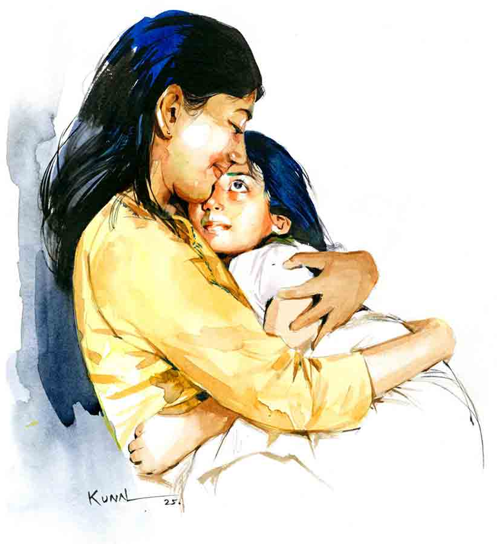

 
 <h1 align=center>রং বদল</h1>
<h2 align=center>বর্ষা পূততুণ্ড</h2> 

সূর্যদেব নিজ মহিমায় বিরাজ করছেন। রুক্ষ হাওয়ার ঝাপটায় পুড়ে যাচ্ছে মুখচোখ।রাস্তায় বেরিয়ে বুলুর মেজাজটা খারাপ হয়ে গেল। দেরি হয়ে গেছে। শরীরটা ঠিক নেই। প্রাইভেট কাজে এক মিনিট দেরি হলে কথা শুনতে হয়।

হনহন করে পা চালাল বুলু বড় রাস্তার দিকে। আজ পল্টুর দেখা পাওয়া গেল না। রোজ দাঁড়িয়ে থাকে। কী হল কে জানে? অটোতে উঠতে উঠতে টের পেল, পেটটা জ্বালা-জ্বালা করছে। গরিবের ঘোড়ারোগ! হল নাকি আলসার! ডাক্তারবাবু বেজায় বকাবকি করেছিলেন, “না খেয়ে খেয়ে রোগ বাধালি তো! কত দিন বলেছি ব্যাগে বিস্কুট নিয়ে ঘুরতে। খালি পেটে থাকবি না। এ বার বোঝ।”

ব্যাগে হাত ঢুকিয়ে দেখে নিল বুলু। ওষুধ, বিস্কুট সব আছে।

পেট খালিই থাকত। সকালে মেয়েকে রেডি করে, শেয়ার রিকশায় তুলে দিয়ে কোনও রকমে দুটো পাউরুটি আর চা গিলেই শুরু হয় ঘরের কাজ। না করলে হয় না। দিদি সকালে উঠতে কোনও দিনই পারে না। মায়ের সকালের দিকটা হাঁপানি বেড়ে যায়। তবে রান্নাটা দিদি সামলায়। মাঝে মাঝে মনে হয়, দিদির বিয়েটা না হয়ে ভালই হয়েছে। ও আছে বলে বুলু মেয়েকে নিয়ে নিশ্চিন্ত।

খুব ছুটতে হয় বুলুকে। বিশেষ করে বাবার অসুখের সময় যে ধারটা হয়েছে, সেটা ভীষণ তাড়া করে। বিনয়ের ব্যবসা খুব একটা চলছে না। সাহস করে মেয়েটাকে একটা দামি ইংলিশ মিডিয়াম স্কুলে ভর্তি করেছে, এখন খরচ সামলাতে প্রাণ বেরিয়ে যাচ্ছে। পার্লারের কাজ না ছেড়ে উপায় ছিল না। পয়সা কম, অগাধ খাটুনি। প্রাইভেট কাজগুলোই বাঁচিয়ে রেখেছে। মুখে রক্ত তুলে খাটলে দুটো পয়সা বেশি আসে।

বিনয় থাকে মালদহে, মা আর অসুস্থ ভাইটাকে নিয়ে। বিয়ে করতে চায়নি বুলু। পার্লারে ঢুকে কাজ শিখে ফেলেছে। তা ছাড়া পল্টু তখন মনের কাছাকাছি এসে গেছে। জেনেশুনে বাবা যেন ক্ষেপে গেল। দিদির গলার সাদা দাগটা বাড়ছিল। বিয়ের জোগাড় করে উঠতে পারল না। ঝড়ের গতিতে নিজে পছন্দ করে বিনয়ের সঙ্গে বুলুর বিয়েটা দিয়ে দিল বাবা। পল্টু তখন একেবারেই বেকার। কিছু বলার মতো মুখ ছিল না। বুলুও কিছু করে উঠতে পারল না। শুধু পল্টুর মা এক পাশে দাঁড়িয়ে চোখ মুছছিল। বড্ড পছন্দ ছিল বুলুকে।

কিন্তু বিয়ের পর এক সঙ্গে থাকা আর হয়ে উঠল কোথায়? বুলুর কাজের সুযোগ এখানে। বিনয় মাঝেমধ্যে আসে। মেয়েটা খুব বাবা-বাবা করে। তখন বড় কষ্ট হয়। একটা নিঃশ্বাস চেপে বুলু মনটা অন্য দিকে ঘোরাল। অটো থেকে নেমে হনহন করে চলল মণিকাঞ্চন কমপ্লেক্সের দিকে। বেলটা টিপে হাঁপাতে লাগল। দরজা খুলে শান্তি বলে কাজের মেয়েটা মুখ টিপে হাসল।

“যাও না, হবে’খন! রেগে টং হয়ে আছে।”

গম্ভীর মুখে এগিয়ে এলেন ভাবি।

“এত লেট কেনো বুলু? না পারবি তো বোলে দে। হামাদের টাইমের দাম আছে...”

“না না ভাবি। আর দেরি হবে না। আজ একটু শরীরটা— মানে উঠতে দেরি হয়ে গেছে।”

বুলুর গলা মিনতিতে ভেঙে পড়ে। উপায় নেই। এরা খুশি হলে পাওনা টাকার উপর টিপস দেয়। দেওয়ালির মিষ্টির একটা বড় প্যাকেট পাওয়া যায়। মাঝে মাঝে লোন চাইলেও পাওয়া যায়। এসি-র ঠান্ডায় শরীরটা জুড়িয়ে যায়। চোখটা বুজে আসে।

বিনয়ের অভিমান এখন জমাট বেঁধে রাগে পরিণত হয়েছে। বুলুকে মালদহ যাওয়ার জন্য জোর করে। অবুঝের মতো জেদ ধরে বসে আছে। “মেয়েকে স্কুল ছাড়াও!” বলে বলে পাগল করে দিল। বোঝে না যে, অনেক কাঠখড় পুড়িয়ে এই স্কুলে ভর্তি করা গেছে। অনেক টাকা লাগে। মেয়ের ভবিষ্যতের কথা ভেবে প্রাণপণ লড়াই করছে বুলু।

বাবার অসুখের সময় অল্পস্বল্প সাহায্য করেছে বিনয়। বুলু তখন মাঝে মাঝে মেয়েকে নিয়ে দু’চার দিন করে থেকে আসত মালদহে। শাশুড়ি মানুষটা ভাল। নাতনির আদরের সীমা নেই। মেয়েও খুশি থাকত। দেওরটার উপর মায়া পড়ে গিয়েছিল। কিন্তু এখন তো বিনয়ের ব্যবসা ভাল চলছে না। এ দিকে এখানে প্রাইভেট কাজগুলো পাওয়া যাচ্ছে। এ রকম চললে ধার-কর্জগুলো ম্যানেজ করে নিতে পারবে। মালদহে গিয়ে কী করবে? ওখানে তো বুলুকে কেউ চেনে না। পরিচিতি তৈরি করতেই মাস ছয়েক লেগে যাবে। মেয়েরও মন বসে গেছে এই স্কুলটায়। বিনয়ের মনটা মেয়ের জন্য কাঁদে, বোঝে বুলু। এই সব নিয়ে ভাবতে গেলে পাগল-পাগল লাগে।

কমপ্লেক্সের গেট থেকে বেরিয়ে একটা লাইট পোস্টের পাশে দাঁড়াল বুলু। ব্যাগ থেকে দুটো বিস্কুট, আর বোতল থেকে জল খেয়ে নিল। অটোয় উঠে ওড়না দিয়ে মুখটা মুছতে মুছতে মনে পড়ে গেল, মায়ের ইনহেলারটা না কিনলেই নয়। মেয়ের ওয়ার্ক এডুকেশনের জিনিসগুলো কেনা হয়নি। পার্লারের ম্যাডাম কাল ফোন করেছিল।

“সকালের দিকে কয়েক ঘণ্টা করে দে না বুলু! টাকা নিয়ে ভাবিস না। মেয়ে কমে গেছে রে!”

সময় বার করতে পারবে কি না, ভাবছিল বুলু।

সব কাজ সেরে মেয়েকে রিকশা থেকে নামাতে গিয়ে পল্টুর সঙ্গে দেখা হল। ঝাঁ ঝাঁ রোদে মাথা ঢেকে, চোখ কুঁচকে তাকিয়ে ছিল বুলু। রোদে পুড়তে পুড়তে পল্টু আসছিল সাইকেল চালিয়ে। এখন আর ও বেকার নয়। সামনের মোড়ে ওর ফোটোকপি, প্রিন্টআউটের দোকান। ফর্সা রংটা রোদে পুড়ে তামাটে। তাও একটা লাল-কালো টি-শার্টে বেশ দেখাচ্ছে। সব সময় একটা হিরো-হিরো ভাব। কালো চশমাটা আঙুলে দোলাতে দোলাতে লাফিয়ে নামল সাইকেল থেকে।

“কী রে বিউটি দিদিমণি! খেটে খেটে যে রোগা হয়ে যাচ্ছিস রে! কবে থেকে বলছি চল, এক দিন একটা সিনেমা দেখে আসি!”

“এক থাপ্পড় মারব! সব সময় ইয়ার্কি! আমি মরছি নিজের জ্বালায়...” ঝাঁঝিয়ে উঠল বুলু।

“ইয়ার্কি কোথায় করলাম? এক দিন চল না,” পল্টু্র মুখের হাসি মেলায় না।

“ভাল হচ্ছে না বলছি। থাম এ বার!” বুলুর গলায় যন্ত্রণার সুর শুনে পল্টু্র গলার আওয়াজ বদলে গেল।

“কী হয়েছে বুলু? আবার খালিপেটে আছিস তো? পেট জ্বালা করছে বুঝি?”

মেয়ের রিকশা এসে গেল। পল্টু ওকে নামাল। মুন্তুর সঙ্গে ওরখুব ভাব।

“ওহ! পল্টু্মামা তুমি এসেছ। বলছিলে যে আমাদের বেড়াতে নিয়ে যাবে? কবে?”

মুন্তুর গলা আনন্দে কলকলিয়ে ওঠে। কচি মুখটা প্রত্যাশায় রাঙা হয়ে উঠেছে।

“তোর পরীক্ষাটা হয়ে যাক না। তার পর তুই, মা আর আমি যাব বেড়াতে।”

পল্টুর হাত থেকে টফি পেয়ে মুন্তু আহ্লাদে আটখানা। কড়া গলায় বলল বুলু, “যখন-তখন ওর হাতে এ সব দিবি না পল্টু। চল মুন্তু, খেতে বড্ড দেরি করিস। আমায় আবার বেরোতে হবে।”

টিভি না চালালে মেয়ের খাওয়া হয় না। আজকে বাজার হয়ে ওঠেনি। যা হোক করে দিদি সামলে নিয়েছে। মেয়ে তো ডাল-ভাত দিব্যি খেয়ে নিল। ঠাকুমার পাঠানো আচার থাকলে ওর আর কিচ্ছু লাগে না। গতকাল আবার বলছিল, “সবাই ভেকেশনে বেড়াতে যাচ্ছে মা। আমরা মালদা যাব না? বাপি তো অনেক দিন আসেনি।”

বিনয় ক’মাস হল আসছে না। ফোনেও বিশেষ কথা হয় না আজকাল। হলেও সেটা ঝগড়ায় দাঁড়িয়ে যায়। সেই এক কথা, “এমন করে কি চলে? আর কত দিন এ ভাবে আলাদা আলাদা থেকে সংসার করব আমরা?”

বিয়ের সময় বিনয় খুব বুঝদার ছিল। বিয়ের আগেই কাজ শিখে পার্লারে ঢুকেছিল বুলু। রোজগার ভালই হচ্ছিল। দিদির লেখাপড়াটা হয়নি। বিয়েও হল না। বুলুকে বিয়ের পর সব ছেড়েছুড়ে মালদহ চলে যেতে হল। চেষ্টা করছিল খুশিমনে সংসার করার। পল্টু্কে ভুলেই গিয়েছিল। মুন্তু কোলে এল। কিন্তু বিনয় তো ব্যবসাটা ঠিকমতো গুছিয়ে করতে পারছিল না। মুন্তুকে নিয়ে বুলু অনেক বড় আকাশের স্বপ্ন দেখে। কাজেই ফিরে এসে ফের পার্লারে ঢোকা।

টাকাপয়সার মুখ দেখে প্রথমটা বিনয় কিছু বলেনি। বাবা যত দিন বেঁচে ছিল, বিনয়কে মাঝে মাঝে ব্যবসার জন্য টাকাপয়সা দিয়েছিল বুলু। কিন্তু সে টাকাগুলো জলেই গেছে। এখন সব চিন্তা মেয়েকে ঘিরে। পল্টু পাশে থেকেছে বরাবর। বাবার অসুখের সময় দৌড়োদৌড়ি, মেয়ের ভর্তি— ও না থাকলে কী যে হত! বিয়ের আগে পল্টু যে কী চোখে ওর দিকে তাকাত, তা ভাবার মতো অবকাশ ছিল না। ঝড়ের গতিতে দিনগুলো কেটে গিয়েছিল। পল্টু একই রকম আছে। যাওয়া-আসার পথে ওর হাসি, ঠাট্টা দিনটা সহজ করে দেয়।

বিকেলে দুটো জায়গায় যেতে হল। প্রথমে ডাক্তারবাবুর বাড়ি। এই দিনটা বৌদি একটু সময় বার করেন। কর্তা-গিন্নি দু’জনেই ডাক্তার। ওঁদের সময় খুব কম। বিপদে-আপদে খুব সাহায্য করেন। নিঃসঙ্কোচে ওঁদের কাছে যাওয়া যায়।

ঘরে ঢুকেই পেডিকিয়োরের ব্যবস্থা শুরু করে দেয় বুলু। বৌদি নিয়ম করে পেডিকিয়োর করান। পা দুটো বুলুর হাতে ছেড়ে দিয়ে ডাক্তার বৌদি জিজ্ঞেস করেন, “মেয়ের পড়াশোনা কেমন চলছে বুলু?”

“চলছে বৌদি কোনও রকম। আজকাল খুব ফাঁকিবাজ হয়েছে।”

“একটু নজর রেখো, বুঝলে। শিক্ষার গোড়াটা যেন পাকা হয়...”

বৌদির বাকি কথাগুলো কানে যায় না। মনটা চলে গেছে অন্য কোথাও। বিয়েটা এখনও অবধি করল না পল্টু। হেসে উড়িয়ে দেয়। কাকিমার বুড়ো বয়সে কত কষ্ট! মাঝে মাঝে পল্টুর চোখের দিকে তাকালে খুব খারাপ লাগে।

সূর্যদেব নিজ মহিমায় বিরাজ করছেন। রুক্ষ হাওয়ার ঝাপটায় পুড়ে যাচ্ছে মুখচোখ।রাস্তায় বেরিয়ে বুলুর মেজাজটা খারাপ হয়ে গেল। দেরি হয়ে গেছে। শরীরটা ঠিক নেই। প্রাইভেট কাজে এক মিনিট দেরি হলে কথা শুনতে হয়।

হনহন করে পা চালাল বুলু বড় রাস্তার দিকে। আজ পল্টুর দেখা পাওয়া গেল না। রোজ দাঁড়িয়ে থাকে। কী হল কে জানে? অটোতে উঠতে উঠতে টের পেল, পেটটা জ্বালা-জ্বালা করছে। গরিবের ঘোড়ারোগ! হল নাকি আলসার! ডাক্তারবাবু বেজায় বকাবকি করেছিলেন, “না খেয়ে খেয়ে রোগ বাধালি তো! কত দিন বলেছি ব্যাগে বিস্কুট নিয়ে ঘুরতে। খালি পেটে থাকবি না। এ বার বোঝ।”

ব্যাগে হাত ঢুকিয়ে দেখে নিল বুলু। ওষুধ, বিস্কুট সব আছে।

পেট খালিই থাকত। সকালে মেয়েকে রেডি করে, শেয়ার রিকশায় তুলে দিয়ে কোনও রকমে দুটো পাউরুটি আর চা গিলেই শুরু হয় ঘরের কাজ। না করলে হয় না। দিদি সকালে উঠতে কোনও দিনই পারে না। মায়ের সকালের দিকটা হাঁপানি বেড়ে যায়। তবে রান্নাটা দিদি সামলায়। মাঝে মাঝে মনে হয়, দিদির বিয়েটা না হয়ে ভালই হয়েছে। ও আছে বলে বুলু মেয়েকে নিয়ে নিশ্চিন্ত।

খুব ছুটতে হয় বুলুকে। বিশেষ করে বাবার অসুখের সময় যে ধারটা হয়েছে, সেটা ভীষণ তাড়া করে। বিনয়ের ব্যবসা খুব একটা চলছে না। সাহস করে মেয়েটাকে একটা দামি ইংলিশ মিডিয়াম স্কুলে ভর্তি করেছে, এখন খরচ সামলাতে প্রাণ বেরিয়ে যাচ্ছে। পার্লারের কাজ না ছেড়ে উপায় ছিল না। পয়সা কম, অগাধ খাটুনি। প্রাইভেট কাজগুলোই বাঁচিয়ে রেখেছে। মুখে রক্ত তুলে খাটলে দুটো পয়সা বেশি আসে।

বিনয় থাকে মালদহে, মা আর অসুস্থ ভাইটাকে নিয়ে। বিয়ে করতে চায়নি বুলু। পার্লারে ঢুকে কাজ শিখে ফেলেছে। তা ছাড়া পল্টু তখন মনের কাছাকাছি এসে গেছে। জেনেশুনে বাবা যেন ক্ষেপে গেল। দিদির গলার সাদা দাগটা বাড়ছিল। বিয়ের জোগাড় করে উঠতে পারল না। ঝড়ের গতিতে নিজে পছন্দ করে বিনয়ের সঙ্গে বুলুর বিয়েটা দিয়ে দিল বাবা। পল্টু তখন একেবারেই বেকার। কিছু বলার মতো মুখ ছিল না। বুলুও কিছু করে উঠতে পারল না। শুধু পল্টুর মা এক পাশে দাঁড়িয়ে চোখ মুছছিল। বড্ড পছন্দ ছিল বুলুকে।

কিন্তু বিয়ের পর এক সঙ্গে থাকা আর হয়ে উঠল কোথায়? বুলুর কাজের সুযোগ এখানে। বিনয় মাঝেমধ্যে আসে। মেয়েটা খুব বাবা-বাবা করে। তখন বড় কষ্ট হয়। একটা নিঃশ্বাস চেপে বুলু মনটা অন্য দিকে ঘোরাল। অটো থেকে নেমে হনহন করে চলল মণিকাঞ্চন কমপ্লেক্সের দিকে। বেলটা টিপে হাঁপাতে লাগল। দরজা খুলে শান্তি বলে কাজের মেয়েটা মুখ টিপে হাসল।

“যাও না, হবে’খন! রেগে টং হয়ে আছে।”

গম্ভীর মুখে এগিয়ে এলেন ভাবি।

“এত লেট কেনো বুলু? না পারবি তো বোলে দে। হামাদের টাইমের দাম আছে...”

“না না ভাবি। আর দেরি হবে না। আজ একটু শরীরটা— মানে উঠতে দেরি হয়ে গেছে।”

বুলুর গলা মিনতিতে ভেঙে পড়ে। উপায় নেই। এরা খুশি হলে পাওনা টাকার উপর টিপস দেয়। দেওয়ালির মিষ্টির একটা বড় প্যাকেট পাওয়া যায়। মাঝে মাঝে লোন চাইলেও পাওয়া যায়। এসি-র ঠান্ডায় শরীরটা জুড়িয়ে যায়। চোখটা বুজে আসে।

বিনয়ের অভিমান এখন জমাট বেঁধে রাগে পরিণত হয়েছে। বুলুকে মালদহ যাওয়ার জন্য জোর করে। অবুঝের মতো জেদ ধরে বসে আছে। “মেয়েকে স্কুল ছাড়াও!” বলে বলে পাগল করে দিল। বোঝে না যে, অনেক কাঠখড় পুড়িয়ে এই স্কুলে ভর্তি করা গেছে। অনেক টাকা লাগে। মেয়ের ভবিষ্যতের কথা ভেবে প্রাণপণ লড়াই করছে বুলু।

বাবার অসুখের সময় অল্পস্বল্প সাহায্য করেছে বিনয়। বুলু তখন মাঝে মাঝে মেয়েকে নিয়ে দু’চার দিন করে থেকে আসত মালদহে। শাশুড়ি মানুষটা ভাল। নাতনির আদরের সীমা নেই। মেয়েও খুশি থাকত। দেওরটার উপর মায়া পড়ে গিয়েছিল। কিন্তু এখন তো বিনয়ের ব্যবসা ভাল চলছে না। এ দিকে এখানে প্রাইভেট কাজগুলো পাওয়া যাচ্ছে। এ রকম চললে ধার-কর্জগুলো ম্যানেজ করে নিতে পারবে। মালদহে গিয়ে কী করবে? ওখানে তো বুলুকে কেউ চেনে না। পরিচিতি তৈরি করতেই মাস ছয়েক লেগে যাবে। মেয়েরও মন বসে গেছে এই স্কুলটায়। বিনয়ের মনটা মেয়ের জন্য কাঁদে, বোঝে বুলু। এই সব নিয়ে ভাবতে গেলে পাগল-পাগল লাগে।

কমপ্লেক্সের গেট থেকে বেরিয়ে একটা লাইট পোস্টের পাশে দাঁড়াল বুলু। ব্যাগ থেকে দুটো বিস্কুট, আর বোতল থেকে জল খেয়ে নিল। অটোয় উঠে ওড়না দিয়ে মুখটা মুছতে মুছতে মনে পড়ে গেল, মায়ের ইনহেলারটা না কিনলেই নয়। মেয়ের ওয়ার্ক এডুকেশনের জিনিসগুলো কেনা হয়নি। পার্লারের ম্যাডাম কাল ফোন করেছিল।

“সকালের দিকে কয়েক ঘণ্টা করে দে না বুলু! টাকা নিয়ে ভাবিস না। মেয়ে কমে গেছে রে!”

সময় বার করতে পারবে কি না, ভাবছিল বুলু।

সব কাজ সেরে মেয়েকে রিকশা থেকে নামাতে গিয়ে পল্টুর সঙ্গে দেখা হল। ঝাঁ ঝাঁ রোদে মাথা ঢেকে, চোখ কুঁচকে তাকিয়ে ছিল বুলু। রোদে পুড়তে পুড়তে পল্টু আসছিল সাইকেল চালিয়ে। এখন আর ও বেকার নয়। সামনের মোড়ে ওর ফোটোকপি, প্রিন্টআউটের দোকান। ফর্সা রংটা রোদে পুড়ে তামাটে। তাও একটা লাল-কালো টি-শার্টে বেশ দেখাচ্ছে। সব সময় একটা হিরো-হিরো ভাব। কালো চশমাটা আঙুলে দোলাতে দোলাতে লাফিয়ে নামল সাইকেল থেকে।

“কী রে বিউটি দিদিমণি! খেটে খেটে যে রোগা হয়ে যাচ্ছিস রে! কবে থেকে বলছি চল, এক দিন একটা সিনেমা দেখে আসি!”

“এক থাপ্পড় মারব! সব সময় ইয়ার্কি! আমি মরছি নিজের জ্বালায়...” ঝাঁঝিয়ে উঠল বুলু।

“ইয়ার্কি কোথায় করলাম? এক দিন চল না,” পল্টু্র মুখের হাসি মেলায় না।

“ভাল হচ্ছে না বলছি। থাম এ বার!” বুলুর গলায় যন্ত্রণার সুর শুনে পল্টু্র গলার আওয়াজ বদলে গেল।

“কী হয়েছে বুলু? আবার খালিপেটে আছিস তো? পেট জ্বালা করছে বুঝি?”

মেয়ের রিকশা এসে গেল। পল্টু ওকে নামাল। মুন্তুর সঙ্গে ওরখুব ভাব।

“ওহ! পল্টু্মামা তুমি এসেছ। বলছিলে যে আমাদের বেড়াতে নিয়ে যাবে? কবে?”

মুন্তুর গলা আনন্দে কলকলিয়ে ওঠে। কচি মুখটা প্রত্যাশায় রাঙা হয়ে উঠেছে।

“তোর পরীক্ষাটা হয়ে যাক না। তার পর তুই, মা আর আমি যাব বেড়াতে।”

পল্টুর হাত থেকে টফি পেয়ে মুন্তু আহ্লাদে আটখানা। কড়া গলায় বলল বুলু, “যখন-তখন ওর হাতে এ সব দিবি না পল্টু। চল মুন্তু, খেতে বড্ড দেরি করিস। আমায় আবার বেরোতে হবে।”

টিভি না চালালে মেয়ের খাওয়া হয় না। আজকে বাজার হয়ে ওঠেনি। যা হোক করে দিদি সামলে নিয়েছে। মেয়ে তো ডাল-ভাত দিব্যি খেয়ে নিল। ঠাকুমার পাঠানো আচার থাকলে ওর আর কিচ্ছু লাগে না। গতকাল আবার বলছিল, “সবাই ভেকেশনে বেড়াতে যাচ্ছে মা। আমরা মালদা যাব না? বাপি তো অনেক দিন আসেনি।”

বিনয় ক’মাস হল আসছে না। ফোনেও বিশেষ কথা হয় না আজকাল। হলেও সেটা ঝগড়ায় দাঁড়িয়ে যায়। সেই এক কথা, “এমন করে কি চলে? আর কত দিন এ ভাবে আলাদা আলাদা থেকে সংসার করব আমরা?”

বিয়ের সময় বিনয় খুব বুঝদার ছিল। বিয়ের আগেই কাজ শিখে পার্লারে ঢুকেছিল বুলু। রোজগার ভালই হচ্ছিল। দিদির লেখাপড়াটা হয়নি। বিয়েও হল না। বুলুকে বিয়ের পর সব ছেড়েছুড়ে মালদহ চলে যেতে হল। চেষ্টা করছিল খুশিমনে সংসার করার। পল্টু্কে ভুলেই গিয়েছিল। মুন্তু কোলে এল। কিন্তু বিনয় তো ব্যবসাটা ঠিকমতো গুছিয়ে করতে পারছিল না। মুন্তুকে নিয়ে বুলু অনেক বড় আকাশের স্বপ্ন দেখে। কাজেই ফিরে এসে ফের পার্লারে ঢোকা।

টাকাপয়সার মুখ দেখে প্রথমটা বিনয় কিছু বলেনি। বাবা যত দিন বেঁচে ছিল, বিনয়কে মাঝে মাঝে ব্যবসার জন্য টাকাপয়সা দিয়েছিল বুলু। কিন্তু সে টাকাগুলো জলেই গেছে। এখন সব চিন্তা মেয়েকে ঘিরে। পল্টু পাশে থেকেছে বরাবর। বাবার অসুখের সময় দৌড়োদৌড়ি, মেয়ের ভর্তি— ও না থাকলে কী যে হত! বিয়ের আগে পল্টু যে কী চোখে ওর দিকে তাকাত, তা ভাবার মতো অবকাশ ছিল না। ঝড়ের গতিতে দিনগুলো কেটে গিয়েছিল। পল্টু একই রকম আছে। যাওয়া-আসার পথে ওর হাসি, ঠাট্টা দিনটা সহজ করে দেয়।

বিকেলে দুটো জায়গায় যেতে হল। প্রথমে ডাক্তারবাবুর বাড়ি। এই দিনটা বৌদি একটু সময় বার করেন। কর্তা-গিন্নি দু’জনেই ডাক্তার। ওঁদের সময় খুব কম। বিপদে-আপদে খুব সাহায্য করেন। নিঃসঙ্কোচে ওঁদের কাছে যাওয়া যায়।

ঘরে ঢুকেই পেডিকিয়োরের ব্যবস্থা শুরু করে দেয় বুলু। বৌদি নিয়ম করে পেডিকিয়োর করান। পা দুটো বুলুর হাতে ছেড়ে দিয়ে ডাক্তার বৌদি জিজ্ঞেস করেন, “মেয়ের পড়াশোনা কেমন চলছে বুলু?”

“চলছে বৌদি কোনও রকম। আজকাল খুব ফাঁকিবাজ হয়েছে।”

“একটু নজর রেখো, বুঝলে। শিক্ষার গোড়াটা যেন পাকা হয়...”

বৌদির বাকি কথাগুলো কানে যায় না। মনটা চলে গেছে অন্য কোথাও। বিয়েটা এখনও অবধি করল না পল্টু। হেসে উড়িয়ে দেয়। কাকিমার বুড়ো বয়সে কত কষ্ট! মাঝে মাঝে পল্টুর চোখের দিকে তাকালে খুব খারাপ লাগে।

পরের বাড়িটায় গিয়ে মেজাজটা খারাপ হয়ে গেল। মেয়ে ভুরু প্লাক করাবে। মা-র আজ সময় নেই ফেশিয়াল করানোর। যদি ফোনে আগে বলে দিত, ওই ক’টা টাকার জন্য ছুটে আসত না বুলু। কাজ শেষ করে ঝটপট রওনা দিল সে। বাড়ি গিয়ে মেয়েটাকে ধরে পড়তে বসাতে হবে।

দিদিকে বিশেষ মানে না। আর দিদিও হয়েছে সেই রকম। মেয়েকে নিয়ে টিভির সামনে বসে পড়ে। দিদির সঙ্গে ঝগড়া হয় বুলুর, আবার কষ্টও হয়। ওর জীবনটা কেমন করে কাটবে, কে জানে! মা আর দিদিকে নিয়ে চিন্তার শেষ নেই।

বিনয় এ সব কিছুই বুঝতে চায় না। বুলু বোঝে, বিনয় ওদের নিয়ে সংসার করতে চায়। কিছু দিন আগে বেপরোয়া হয়ে বুলু বিনয়কে বলেছিল, মা আর ভাইকে নিয়ে এখানে চলে আসতে। ডাক্তারবাবুকে ধরে একটা ছোটখাটো কাজের চেষ্টা করছিল। ডাক্তারবাবু একটা নতুন চেম্বার করছেন। তার দেখাশোনা, রোগী সামলানোর জন্য এক জন চেনাশোনা লোক খুঁজছিলেন। কিন্তু প্রস্তাবটা বিনয়েরসম্মানে লাগল।

“ওখানে গিয়ে শেষমেশ তোমার হাত তোলায়থাকব নাকি?”

বুলু অনেক বোঝানোর চেষ্টা করেছিল যে, মেয়েকে নিয়ে ওর পক্ষে মালদহ যাওয়া সম্ভব নয়। ওর রোজগার এখন বাড়তির দিকে। শরীর চলে না। তাও বুলু দৌড়ে বেড়ায়। সব থেকে মনে লেগেছিল ঝগড়ার সময় বিনয়ের বলা কথাগুলো, “বাড়ি বাড়ি ঘুরে ওই সব কাজ ছাড়ো তো। ওই মুখ পরিষ্কার, পা পরিষ্কার আর করতে হবে না তোমায়।”

স্তম্ভিত হয়ে গিয়েছিল বুলু।

বাড়িতে ঢুকে মাথায় আগুন জ্বলে গেল। মাসির সঙ্গে বসে সিনেমা দেখছে মুন্তু। মেয়েটাকে ঠাস ঠাস করে দুটো চড় কষিয়ে দিল। মায়ের রুদ্রমূর্তি দেখে মুন্তু কাঁদতে কাঁদতে বইখাতা নিয়ে বসে পড়ল। দিদিও কাঁচুমাচু মুখ করে ঘর থেকে বেরিয়ে গেল। বড় অসহায় লাগে। কেউ ওকে বোঝে না।

আবার বেরোতেই হল। একটা মাসাজ ক্রিম অর্ডার দেওয়া আছে। ক্রিমটা নিয়ে মেয়ের টিফিন দেবে বলে কেক আর বিস্কুটের প্যাকেট কিনল বুলু।

দোকান থেকে বেরিয়ে দেখল পল্টু সাইকেল নিয়ে দাঁড়িয়ে আছে।

ও জিজ্ঞেস করল, “কী রে, দোকান ছেড়েএলি কেন?”

পল্টু্র মুখে হাসি, “দোকানে লোক আছে। তোকে ভাবতে হবে না। তুই কী করছিস?”

“এই টুকটাক দরকার ছিল। একটু চিকেন কিনব। মেয়েটাকে মেরেছি। কাঁদছিল। চিকেনটা খুব ভালবাসে তো!”

“চোখটা মোছ বুলু। মেয়েটাকে মেরে মনটা খারাপ লাগছে, তাই তো?”

“আর পারছি না রে। সব দিক থেকে যেন আমায় চেপে ধরেছে।”

“বর কী বলে?”

“কী আর বলবে? ফোনও করে না আজকাল। আমিও করি না। কথা বললেই তো অশান্তি।”

চিকেনটা পল্টুই কিনে দিল। মিষ্টির দোকানে ঢুকে জোর করে দুটো রসগোল্লা খাওয়াল।

“খালিপেটে থাকিস না বুলু। মরবি। এ বার একটা কিছু ঠিক কর। আর পিছুটান রাখিস না। আমার কথাটা একটু ভাব।”

চমকে উঠল বুলু। এমন করে তো পল্টু কখনও বলে না! ওর মন সায় দেয়। পল্টু্র হাত ধরলে ক্ষতি কী? মুন্তুকে খুব ভালবাসে পল্টু। পা চালাল বুলু। আজ চিকেনটা নিজেই করবে তাড়াতাড়ি করে। মুন্তুটা ঘুমিয়ে পড়ে। একটু চিকেন পল্টুদের বাড়ি পাঠিয়ে দেবে দিদিকে দিয়ে।

ঘরে ঢুকে পা থেমে গেল। পলকের জন্য যেন উল্টোপাল্টা হয়ে গেল অবচেতনের কিছু হিসেব-নিকেশ। মাথায় কাপড় দিয়ে মা বসে আছে। দিদির হাতে চায়ের কাপ। মুন্তু এক গাল হেসে হাত নেড়ে নেড়ে গল্প করছে। ফিরে তাকাল বিনয়। খুব রোগা হয়ে গেছে। গলার হাড়গুলো দেখা যাচ্ছে। খোঁচা-খোঁচা দাড়ি। জামার কলারটা চিটচিটে কালো। মনটা টনটন করে উঠল। এ রকম না খেতে পাওয়া চেহারা হল কী করে? ওকে দেখে ম্লান হাসল বিনয়।

বিস্কুটের প্যাকেটটা এগিয়ে দিয়ে বলল বুলু, “বিস্কুট দে দিদি। ভাতটা চড়া। পা ধুয়ে আসছি। আজ চিকেনটা আমি করব।”

চিকেন শুনেই মেয়ে লাফিয়ে বাবার গলা জড়িয়ে ধরল। পল্টুদের বাড়ি আর চিকেন পাঠানো যাবে না। কুলোবে না।

(এই প্রতিবেদনটি আনন্দবাজার পত্রিকার মুদ্রিত সংস্করণ থেকে নেওয়া হয়েছে)

