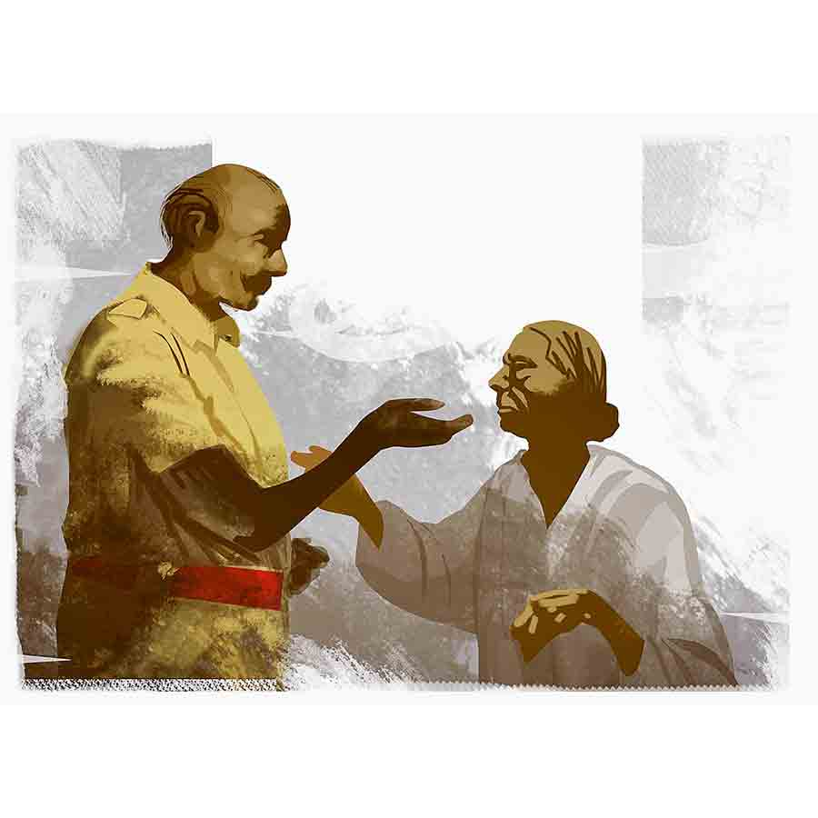

 
 <h1 align=center>শির-তাকিয়া</h1>
<h2 align=center>সমীরণ বন্দ্যোপাধ্যায়</h2> 

যুধিষ্ঠির সাহুর মা দেখা করতে এসেছে, স্যর!”

জরুরি কাজেবসেছিলাম, কিন্তু বিরক্ত হতে পারলাম না। সদ্য-পুত্রহারা মায়ের আচরণ যতই অযৌক্তিক হোক, সহানুভূতির দৃষ্টিতে দেখা উচিত। ল্যাপটপ থেকে চোখ না তুলে বললাম, “কী চান উনি? সরকার ঘোষণা করেছে কম্পেনসেশন দেবে। কোম্পানিও সাহায্যের প্রতিশ্রুতি দিয়েছে। এর পর আর কী করার থাকতে পারে আমার?”

“জানি না স্যর। বুড়ি বলছে আপনাকেই বলবে!”

নামকরা নির্মাণ সংস্থার সাইট ম্যানেজার আমি। বছরখানেক আগে একটা বড় সরকারি কাজের বরাত পেয়ে কোম্পানি আমাকে পাঠিয়েছে বিহার-ঘেঁষা এই মফস্সল শহরে।

একে তো সাইট ম্যানেজারের কাজের তালিকা লম্বা। প্রোজেক্টের হাজার হুজ্জোত সামলানো থেকে শুরু করে লোকাল দাদাদের হরেক আবদার মেটানো, প্রশাসনের সঙ্গে হাসিমুখে সুসম্পর্ক রাখা— সব তারই দায়িত্ব। এর পর উপরি পাওনা এমন আবেগঘন পরিস্থিতি!

ল্যাপটপের ডালা নামিয়ে বললাম, “নিয়ে এসো, দেখি কীবক্তব্য বুড়ির!”

মিনিট দুয়েক পর লেবার সুপারভাইজ়ার বক্সির পিছু পিছু হাজির হল যুধিষ্ঠির সাহুর মা। মুখের কুঞ্চিত ত্বকের এবড়োখেবড়ো উল্কি বুঝিয়ে দিচ্ছে তার বয়সের আধিক্য।

বসতে বলায় এক বার সসম্ভ্রমে চেয়ারের দিকে তাকিয়ে হাতজোড় করে দাঁড়িয়ে থাকল সে। হিন্দির সীমিত জ্ঞান নিয়ে সান্ত্বনার সুরে বললাম, “বাতাও মা জি, ম্যায় আপকে লিয়ে কেয়া কর সকতা হুঁ, জো চলা গয়া উও ওয়াপস নেহি আয়েগা। লেকিন সরকার অউর কোম্পানি ভরপাই করেগি। ম্যায়নে সারে দস্তাবেজ় তৈয়ার করকে ভেজ দিয়ে হ্যায়। ম্যায় ইয়ে দেখুঙ্গা কি আপকো জলদি প্যায়সা মিল যায়ে।”

উত্তরে যুধিষ্ঠির সাহুর মা কিছু বললেন। ঘড়ঘড়ে কণ্ঠস্বরের ভোজপুরি উচ্চারণ বোধগম্য হল না। জিজ্ঞাসু চোখে তাকাতে বক্সি বলল, “ওঁর একটা অনুরোধ আছে স্যর। উনি ওই ঘরে ঢোকার চেষ্টা করেছিলেন কিন্তু সেন্ট্রি আটকে দিয়েছে। ওঁর বিশ্বাস, আপনি বলে দিলে পুলিশ আপত্তি করবে না।”

প্রস্তাব শুনে শঙ্কিত হলাম। ওখানে যে দু’জন কনস্টেবল ডিউটি করছে তারা আমার পরিচিত। লোকাল থানার ওসি-র সঙ্গেও এই এক বছরে উষ্ণ সম্পর্ক গড়ে উঠেছে। অনুমতি হয়তো আমি জোগাড় করতে পারব, কিন্তু ঘাতক ট্রাকটা সরিয়ে নেওয়ার পর স্তূপীকৃত ইটের টুকরো, মাটিতে মিশে যাওয়া এক জোড়া ক্যাম্পখাট আর শুকিয়ে যাওয়া রক্তের ধারা নিয়ে বীভৎস অবস্থায় রয়েছে ঘরটা! ঘটনা কানে শোনা এক রকম, কিন্তু একমাত্র সন্তানের উপর মৃত্যুর ছোবল কতটা নির্মম ভাবে নেমে এসেছিল তা চাক্ষুষ করার যন্ত্রণা অপরিসীম!

কাটানোর জন্য বললাম, “আপ ওয়াহাঁ ক্যা করোগি মা? কোম্পানি নে আপকো নয়া আবাস দিয়া হ্যায়, ওয়াহাঁ রহো।”

আবার দুর্বোধ্য ভাষায় ঘড়ঘড়ানি, পুনরায় ত্রাতার ভূমিকা বক্সির, “আসলে স্যর, টাকা-পয়সা, নতুন কোয়ার্টার, কিছুই চাই না ওঁর। ওই ঘরে একটা কিমতি চিজ়... মানে দামি জিনিস আছে, সেটা নিয়ে উনি ফিরে যাবেন দেশে। ছেলে মারা যাওয়ার পর এখানে ওঁর নিজের বলে তো কেউ রইল না, গাঁয়ে রিস্তেদাররা আছে, আপদে-বিপদে দেখবে।”

আমি বোঝাতে চেষ্টা করলাম, “পয়সে লিয়ে বিনা কহি মত যাও মা, অগর হাত মে প্যায়সা হ্যায় তো ফির ইস উমর মে আপকো জাদা মেহনত নেহি করনি পড়েগি!”

এ বার দুর্বোধ্য ঘড়ঘড়ানির সঙ্গে ফুঁপিয়ে কান্না! অস্বস্তিভরা চোখে তাকালাম অনুবাদকের দিকে।

বুড়ির কথা শেষ হলে বক্সি বলল, “ছেলের রক্ত লেগে আছে এমন টাকা উনি চান না স্যর! বরং আপনি দয়ালু মানুষ, আর এক বার মেহেরবানি করুন। তা হলে সেই মূল্যবান জিনিসটা নিয়ে উনি চলে যাবেন গাঁয়ে, আর কখনও আমাদের বিরক্ত করতে আসবেন না!”

ক’দিন আগে দুপুরবেলা কাজ চলার সময় এক জন শ্রমিক রোদের তাপে অসুস্থ হয়ে পড়েছিল। এ সব ক্ষেত্রে চোখমুখে জলের ঝাপটা, এক গ্লাস সস্তার ওআরএস এবং ঘণ্টাখানেকের বিশ্রাম বরাদ্দ থাকে অসুস্থ কর্মীর জন্য। কিন্তু আমার অনুরোধে লেবার কনট্রাক্টর তাকে সে দিনের মতো সবেতন ছুটি মঞ্জুর করেছিল। মনে হয় সেই ঘটনাটা এই অধমকে দয়ার অবতার হিসেবে প্রতিষ্ঠা দিয়েছে শ্রমিকমহলে, কারণ এমন সচরাচর ঘটে না।

“জিজ্ঞেস করো কিমতি চিজ়টা কী! তেমন বুঝলে সেটা বার করে আনার ব্যবস্থা করব।”

এ বার আর বুড়ির কথার তর্জমা করতে হল না বক্সিকে। ‘শির-তাকিয়া’ মানে যে ‘মাথার বালিশ’ তা বুঝতে আমার হিন্দি-জ্ঞানই যথেষ্ট! কিন্তু জোড়া ক্ষতিপূরণের টাকা হেলায় ফিরিয়ে বুড়ি শুধু একটা মাথার বালিশের জন্য ব্যাকুল হয়ে উঠল কেন! কী আছে ওই বালিশে? কোনও মূল্যবান গয়না? জমানো টাকা? গরিব মানুষেরা অনেক সময় বালিশ-তোশকে দামি জিনিস, সোনা-দানা, টাকা-পয়সা পুরে রাখে। বুড়ি কি সে রকম কিছু রেখে দিয়েছিল বালিশে? কী এমন দামি জিনিস যে, তার সরকারি ক্ষতিপূরণেরও দরকার নেই! নানা কৌতূহল তৈরি হল মনের আনাচ-কানাচে।

বাইরে আঁধার ঘনালেও ঘড়ি বলছে পাঁচটা দশ। অফিস বন্ধ হবে সাতটায়। তত ক্ষণ বুড়িকে বসিয়ে রাখতে মন সায় দিল না। ল্যাপটপ বন্ধ করে বললাম, “চলো, সেন্ট্রিদের সঙ্গে কথা বলি।”

বেরনোর আগে টর্চলাইটটা সঙ্গে নিল বক্সি। রাস্তায় আলো থাকলেও ওদিকটা অন্ধকার। দুর্ঘটনার পর থেকেই ওই এলাকার বিদ্যুৎ-সংযোগ বিচ্ছিন্ন। ইলেকট্রিশিয়ানরা কাজ করছে। ভেঙে যাওয়া ট্রান্সফর্মার মেরামত হলেই চালু হবে সংযোগ।

দু’জন কনস্টেবলের প্রথম জন ষাটের কাছাকাছি। হাড়-কাঁপানো শীতে কাহিল তিনি। খাকি জ্যাকেট আর মোটা মাফলারে নিজেকে মুড়ে বসে আছেন জবুথবু হয়ে। অন্য জন বাইশ-তেইশের সদ্য তরুণ। গভীর ভাবে মগ্ন স্মার্টফোনে।

“বলুন ম্যানেজার সাহেব, এমন অসময়ে এখানে! হেড অফিস থেকে কর্তারা আসছেন নাকি?” আমাদের দেখে প্রশ্ন করলেন প্রথম জন।

“নাহ নন্দীবাবু, তেমন কিছু নয়। এই ভদ্রমহিলা যুধিষ্ঠির সাহুর মা। ইনি এক বার ভিতরে ঢুকতে চাইছেন একটা দরকারি জিনিস নেওয়ার জন্য। যদি অনুগ্রহ করে অনুমতি দেন!”

“কিন্তু ঘর যে সিল করা রয়েছে সাহেব। এখানে তো দরজা বলে কিছু নেই, তাই দু’জন রয়েছি পাহারায়। কোনও এভিডেন্স নষ্ট হলে আমাদের চাকরি নিয়ে টানাটানি পড়বে!”

প্রস্তুত ছিলাম এমন হালকা আপত্তির জন্য। নরম গলায় বললাম, “একটা সামান্য মাথার বালিশে কী এসে যায় নন্দীবাবু! তা ছাড়া এটা কোনও মার্ডার মিস্ট্রি নয় যে, ঘরের প্রতিটি জিনিস ফরেনসিক বিশেষজ্ঞরা যাচাই করে দেখবে। একটা ট্রাক নিয়ন্ত্রণ হারিয়ে ঢুকে পড়েছে লেবার কোয়ার্টারে। ড্রাইভার নিজের দোষ স্বীকার করেছে, প্রত্যক্ষদর্শীদের বয়ান নেওয়া হয়েছে, রয়েছে সিসি ক্যামেরার ফুটেজ, তোলা হয়েছে ছবি। চার্জশিট পেশ করার জন্য এর চেয়ে বেশি আর কী প্রয়োজন! আপনারা অনুমতি দিলে বালিশটা তুলে দেব বুড়ির হাতে। গরিব মানুষের স্বভাব তো জানেন, হয়তো কোনও দামি জিনিস রয়েছে ওটায়! এ নিয়ে পরে কথা উঠলে আমি না হয় ওসি সাহেবকে বুঝিয়ে বলব।”

বসের সঙ্গে চা-সিগারেট সহযোগে যে আড্ডা মারে, তার অনুরোধ ফেরানো সমীচীন নয়। সহকর্মীর সঙ্গে চোখাচোখি সেরে নন্দীবাবু বললেন, “ঘরের যা অবস্থা, ওখানে ওই মহিলার না ঢোকাই ভাল। আপনারা কেউ আমার সঙ্গে চলুন, বালিশটা পেলে নিয়ে নেবেন।”

এটাই চাইছিলাম আমি। বক্সির হাত থেকে টর্চটা নিয়ে বললাম, “বুড়িকে চোখে চোখে রেখো, হুট করে ইমোশনাল হয়ে ঢুকে না পড়ে!”

“নিশ্চিন্ত থাকুন স্যর, আমি ওকে সামলে রাখব।“

ভারী কালো পলিথিন শিটটা সরিয়ে নন্দীবাবুর পিছু পিছু ঢুকলাম অকুস্থলে। ঘরের এক পাশের দেওয়াল ট্রাকের ধাক্কায় ধূলিসাৎ। জঞ্জালের মাঝে দলা পাকিয়ে পড়ে রয়েছে দুটো ক্যাম্পখাট। গতকাল রাতে ওখানেই শুয়ে ছিল মা আর ছেলে। সোয়া একটা নাগাদ দুর্ঘটনার মুহূর্তে বুড়ি বাইরে বেরিয়েছিল প্রকৃতির ডাকে সাড়া দিতে, নইলে তার পরিণতিও হত ছেলের মতোই।

এক জোড়া এলইডি টর্চের দুধসাদা আলো ঘোরাফেরা করছিল ঘরের আনাচ-কানাচে। চার দিক লন্ডভন্ড হয়ে গেলেও উল্টো দিকের দেয়ালে টাঙানো ক্যালেন্ডারটা দাগহীন। অক্ষত রয়েছে জলচৌকির উপরে রাখা টিনের তোরঙ্গ, দরজার পাশের প্লাস্টিক চেয়ার। স্বাভাবিক জীবনযাপনের নানা চিহ্ন এখনও অক্ষত রয়েছে। মর্মান্তিক দুর্ঘটনা ঘটতে পারে এমন আশঙ্কার লেশমাত্র ছিল না সেসবের কোথাও, কিন্তু নিয়তির মর্জি কে আর কবে আগাম বুঝতে পেরেছে!

মনে নানা ভাবনাচিন্তা খেলে বেড়ালেও, চোখ কিন্তু খুঁজে যাচ্ছিল বুড়ির সেই কাঙ্ক্ষিত বস্তুটিই। কোথায় সেই অভীষ্ট বস্তুটি— শির-তাকিয়া— যেটা পাওয়ার জন্য অমন ব্যাকুল হয়ে উঠেছে বুড়ি! সামনে এগোতে গিয়ে আমার মতো শক্ত মনের মানুষেরও গা গুলিয়ে উঠল। মেঝের অনেকখানি অংশ জুড়ে ধুলোমাখা শুকিয়ে যাওয়া রক্ত, সেখানে লেপ্টে রয়েছে থ্যাঁতলানো দেহাংশের অবশেষ! আশপাশে উদ্ধারকারীদের জুতোর শোণিত-নিশান!

সাতাশ বছরের কর্মজীবনে বেশ কয়েকটা দুর্ঘটনা চাক্ষুষ করতে হয়েছে, তাই এমন বিভীষিকার সাক্ষী হয়েও দ্রুত সামলে নিলাম নিজেকে।

আমার চেয়ে ঢের তীক্ষ্ণ নন্দীবাবুর পুলিশি নজর। আবর্জনার মাঝে এক জায়গায় আলো ফেলে বললেন, “এক বার এ দিকে দেখুন সাহেব, মনে হচ্ছে এই সেই বালিশ!”

ক্যাম্পখাটের দুমড়েমুচড়ে যাওয়া লোহার ফ্রেমের আড়াল থেকে নন্দীবাবু বার করে আনলেন কালো রঙের বালিশটা। কিন্তু এ তো তুলোর বালিশ নয়, দূরপাল্লার ট্রেন অথবা স্টেশনে বিক্রি হওয়া সস্তার এয়ার পিলো। এর ভিতরে দামি কিছু লুকিয়ে রাখা অসম্ভব!

যুধিষ্ঠির সাহুর মা দেখা করতে এসেছে, স্যর!”

জরুরি কাজেবসেছিলাম, কিন্তু বিরক্ত হতে পারলাম না। সদ্য-পুত্রহারা মায়ের আচরণ যতই অযৌক্তিক হোক, সহানুভূতির দৃষ্টিতে দেখা উচিত। ল্যাপটপ থেকে চোখ না তুলে বললাম, “কী চান উনি? সরকার ঘোষণা করেছে কম্পেনসেশন দেবে। কোম্পানিও সাহায্যের প্রতিশ্রুতি দিয়েছে। এর পর আর কী করার থাকতে পারে আমার?”

“জানি না স্যর। বুড়ি বলছে আপনাকেই বলবে!”

নামকরা নির্মাণ সংস্থার সাইট ম্যানেজার আমি। বছরখানেক আগে একটা বড় সরকারি কাজের বরাত পেয়ে কোম্পানি আমাকে পাঠিয়েছে বিহার-ঘেঁষা এই মফস্সল শহরে।

একে তো সাইট ম্যানেজারের কাজের তালিকা লম্বা। প্রোজেক্টের হাজার হুজ্জোত সামলানো থেকে শুরু করে লোকাল দাদাদের হরেক আবদার মেটানো, প্রশাসনের সঙ্গে হাসিমুখে সুসম্পর্ক রাখা— সব তারই দায়িত্ব। এর পর উপরি পাওনা এমন আবেগঘন পরিস্থিতি!

ল্যাপটপের ডালা নামিয়ে বললাম, “নিয়ে এসো, দেখি কীবক্তব্য বুড়ির!”

মিনিট দুয়েক পর লেবার সুপারভাইজ়ার বক্সির পিছু পিছু হাজির হল যুধিষ্ঠির সাহুর মা। মুখের কুঞ্চিত ত্বকের এবড়োখেবড়ো উল্কি বুঝিয়ে দিচ্ছে তার বয়সের আধিক্য।

বসতে বলায় এক বার সসম্ভ্রমে চেয়ারের দিকে তাকিয়ে হাতজোড় করে দাঁড়িয়ে থাকল সে। হিন্দির সীমিত জ্ঞান নিয়ে সান্ত্বনার সুরে বললাম, “বাতাও মা জি, ম্যায় আপকে লিয়ে কেয়া কর সকতা হুঁ, জো চলা গয়া উও ওয়াপস নেহি আয়েগা। লেকিন সরকার অউর কোম্পানি ভরপাই করেগি। ম্যায়নে সারে দস্তাবেজ় তৈয়ার করকে ভেজ দিয়ে হ্যায়। ম্যায় ইয়ে দেখুঙ্গা কি আপকো জলদি প্যায়সা মিল যায়ে।”

উত্তরে যুধিষ্ঠির সাহুর মা কিছু বললেন। ঘড়ঘড়ে কণ্ঠস্বরের ভোজপুরি উচ্চারণ বোধগম্য হল না। জিজ্ঞাসু চোখে তাকাতে বক্সি বলল, “ওঁর একটা অনুরোধ আছে স্যর। উনি ওই ঘরে ঢোকার চেষ্টা করেছিলেন কিন্তু সেন্ট্রি আটকে দিয়েছে। ওঁর বিশ্বাস, আপনি বলে দিলে পুলিশ আপত্তি করবে না।”

প্রস্তাব শুনে শঙ্কিত হলাম। ওখানে যে দু’জন কনস্টেবল ডিউটি করছে তারা আমার পরিচিত। লোকাল থানার ওসি-র সঙ্গেও এই এক বছরে উষ্ণ সম্পর্ক গড়ে উঠেছে। অনুমতি হয়তো আমি জোগাড় করতে পারব, কিন্তু ঘাতক ট্রাকটা সরিয়ে নেওয়ার পর স্তূপীকৃত ইটের টুকরো, মাটিতে মিশে যাওয়া এক জোড়া ক্যাম্পখাট আর শুকিয়ে যাওয়া রক্তের ধারা নিয়ে বীভৎস অবস্থায় রয়েছে ঘরটা! ঘটনা কানে শোনা এক রকম, কিন্তু একমাত্র সন্তানের উপর মৃত্যুর ছোবল কতটা নির্মম ভাবে নেমে এসেছিল তা চাক্ষুষ করার যন্ত্রণা অপরিসীম!

কাটানোর জন্য বললাম, “আপ ওয়াহাঁ ক্যা করোগি মা? কোম্পানি নে আপকো নয়া আবাস দিয়া হ্যায়, ওয়াহাঁ রহো।”

আবার দুর্বোধ্য ভাষায় ঘড়ঘড়ানি, পুনরায় ত্রাতার ভূমিকা বক্সির, “আসলে স্যর, টাকা-পয়সা, নতুন কোয়ার্টার, কিছুই চাই না ওঁর। ওই ঘরে একটা কিমতি চিজ়... মানে দামি জিনিস আছে, সেটা নিয়ে উনি ফিরে যাবেন দেশে। ছেলে মারা যাওয়ার পর এখানে ওঁর নিজের বলে তো কেউ রইল না, গাঁয়ে রিস্তেদাররা আছে, আপদে-বিপদে দেখবে।”

আমি বোঝাতে চেষ্টা করলাম, “পয়সে লিয়ে বিনা কহি মত যাও মা, অগর হাত মে প্যায়সা হ্যায় তো ফির ইস উমর মে আপকো জাদা মেহনত নেহি করনি পড়েগি!”

এ বার দুর্বোধ্য ঘড়ঘড়ানির সঙ্গে ফুঁপিয়ে কান্না! অস্বস্তিভরা চোখে তাকালাম অনুবাদকের দিকে।

বুড়ির কথা শেষ হলে বক্সি বলল, “ছেলের রক্ত লেগে আছে এমন টাকা উনি চান না স্যর! বরং আপনি দয়ালু মানুষ, আর এক বার মেহেরবানি করুন। তা হলে সেই মূল্যবান জিনিসটা নিয়ে উনি চলে যাবেন গাঁয়ে, আর কখনও আমাদের বিরক্ত করতে আসবেন না!”

ক’দিন আগে দুপুরবেলা কাজ চলার সময় এক জন শ্রমিক রোদের তাপে অসুস্থ হয়ে পড়েছিল। এ সব ক্ষেত্রে চোখমুখে জলের ঝাপটা, এক গ্লাস সস্তার ওআরএস এবং ঘণ্টাখানেকের বিশ্রাম বরাদ্দ থাকে অসুস্থ কর্মীর জন্য। কিন্তু আমার অনুরোধে লেবার কনট্রাক্টর তাকে সে দিনের মতো সবেতন ছুটি মঞ্জুর করেছিল। মনে হয় সেই ঘটনাটা এই অধমকে দয়ার অবতার হিসেবে প্রতিষ্ঠা দিয়েছে শ্রমিকমহলে, কারণ এমন সচরাচর ঘটে না।

“জিজ্ঞেস করো কিমতি চিজ়টা কী! তেমন বুঝলে সেটা বার করে আনার ব্যবস্থা করব।”

এ বার আর বুড়ির কথার তর্জমা করতে হল না বক্সিকে। ‘শির-তাকিয়া’ মানে যে ‘মাথার বালিশ’ তা বুঝতে আমার হিন্দি-জ্ঞানই যথেষ্ট! কিন্তু জোড়া ক্ষতিপূরণের টাকা হেলায় ফিরিয়ে বুড়ি শুধু একটা মাথার বালিশের জন্য ব্যাকুল হয়ে উঠল কেন! কী আছে ওই বালিশে? কোনও মূল্যবান গয়না? জমানো টাকা? গরিব মানুষেরা অনেক সময় বালিশ-তোশকে দামি জিনিস, সোনা-দানা, টাকা-পয়সা পুরে রাখে। বুড়ি কি সে রকম কিছু রেখে দিয়েছিল বালিশে? কী এমন দামি জিনিস যে, তার সরকারি ক্ষতিপূরণেরও দরকার নেই! নানা কৌতূহল তৈরি হল মনের আনাচ-কানাচে।

বাইরে আঁধার ঘনালেও ঘড়ি বলছে পাঁচটা দশ। অফিস বন্ধ হবে সাতটায়। তত ক্ষণ বুড়িকে বসিয়ে রাখতে মন সায় দিল না। ল্যাপটপ বন্ধ করে বললাম, “চলো, সেন্ট্রিদের সঙ্গে কথা বলি।”

বেরনোর আগে টর্চলাইটটা সঙ্গে নিল বক্সি। রাস্তায় আলো থাকলেও ওদিকটা অন্ধকার। দুর্ঘটনার পর থেকেই ওই এলাকার বিদ্যুৎ-সংযোগ বিচ্ছিন্ন। ইলেকট্রিশিয়ানরা কাজ করছে। ভেঙে যাওয়া ট্রান্সফর্মার মেরামত হলেই চালু হবে সংযোগ।

দু’জন কনস্টেবলের প্রথম জন ষাটের কাছাকাছি। হাড়-কাঁপানো শীতে কাহিল তিনি। খাকি জ্যাকেট আর মোটা মাফলারে নিজেকে মুড়ে বসে আছেন জবুথবু হয়ে। অন্য জন বাইশ-তেইশের সদ্য তরুণ। গভীর ভাবে মগ্ন স্মার্টফোনে।

“বলুন ম্যানেজার সাহেব, এমন অসময়ে এখানে! হেড অফিস থেকে কর্তারা আসছেন নাকি?” আমাদের দেখে প্রশ্ন করলেন প্রথম জন।

“নাহ নন্দীবাবু, তেমন কিছু নয়। এই ভদ্রমহিলা যুধিষ্ঠির সাহুর মা। ইনি এক বার ভিতরে ঢুকতে চাইছেন একটা দরকারি জিনিস নেওয়ার জন্য। যদি অনুগ্রহ করে অনুমতি দেন!”

“কিন্তু ঘর যে সিল করা রয়েছে সাহেব। এখানে তো দরজা বলে কিছু নেই, তাই দু’জন রয়েছি পাহারায়। কোনও এভিডেন্স নষ্ট হলে আমাদের চাকরি নিয়ে টানাটানি পড়বে!”

প্রস্তুত ছিলাম এমন হালকা আপত্তির জন্য। নরম গলায় বললাম, “একটা সামান্য মাথার বালিশে কী এসে যায় নন্দীবাবু! তা ছাড়া এটা কোনও মার্ডার মিস্ট্রি নয় যে, ঘরের প্রতিটি জিনিস ফরেনসিক বিশেষজ্ঞরা যাচাই করে দেখবে। একটা ট্রাক নিয়ন্ত্রণ হারিয়ে ঢুকে পড়েছে লেবার কোয়ার্টারে। ড্রাইভার নিজের দোষ স্বীকার করেছে, প্রত্যক্ষদর্শীদের বয়ান নেওয়া হয়েছে, রয়েছে সিসি ক্যামেরার ফুটেজ, তোলা হয়েছে ছবি। চার্জশিট পেশ করার জন্য এর চেয়ে বেশি আর কী প্রয়োজন! আপনারা অনুমতি দিলে বালিশটা তুলে দেব বুড়ির হাতে। গরিব মানুষের স্বভাব তো জানেন, হয়তো কোনও দামি জিনিস রয়েছে ওটায়! এ নিয়ে পরে কথা উঠলে আমি না হয় ওসি সাহেবকে বুঝিয়ে বলব।”

বসের সঙ্গে চা-সিগারেট সহযোগে যে আড্ডা মারে, তার অনুরোধ ফেরানো সমীচীন নয়। সহকর্মীর সঙ্গে চোখাচোখি সেরে নন্দীবাবু বললেন, “ঘরের যা অবস্থা, ওখানে ওই মহিলার না ঢোকাই ভাল। আপনারা কেউ আমার সঙ্গে চলুন, বালিশটা পেলে নিয়ে নেবেন।”

এটাই চাইছিলাম আমি। বক্সির হাত থেকে টর্চটা নিয়ে বললাম, “বুড়িকে চোখে চোখে রেখো, হুট করে ইমোশনাল হয়ে ঢুকে না পড়ে!”

“নিশ্চিন্ত থাকুন স্যর, আমি ওকে সামলে রাখব।“

ভারী কালো পলিথিন শিটটা সরিয়ে নন্দীবাবুর পিছু পিছু ঢুকলাম অকুস্থলে। ঘরের এক পাশের দেওয়াল ট্রাকের ধাক্কায় ধূলিসাৎ। জঞ্জালের মাঝে দলা পাকিয়ে পড়ে রয়েছে দুটো ক্যাম্পখাট। গতকাল রাতে ওখানেই শুয়ে ছিল মা আর ছেলে। সোয়া একটা নাগাদ দুর্ঘটনার মুহূর্তে বুড়ি বাইরে বেরিয়েছিল প্রকৃতির ডাকে সাড়া দিতে, নইলে তার পরিণতিও হত ছেলের মতোই।

এক জোড়া এলইডি টর্চের দুধসাদা আলো ঘোরাফেরা করছিল ঘরের আনাচ-কানাচে। চার দিক লন্ডভন্ড হয়ে গেলেও উল্টো দিকের দেয়ালে টাঙানো ক্যালেন্ডারটা দাগহীন। অক্ষত রয়েছে জলচৌকির উপরে রাখা টিনের তোরঙ্গ, দরজার পাশের প্লাস্টিক চেয়ার। স্বাভাবিক জীবনযাপনের নানা চিহ্ন এখনও অক্ষত রয়েছে। মর্মান্তিক দুর্ঘটনা ঘটতে পারে এমন আশঙ্কার লেশমাত্র ছিল না সেসবের কোথাও, কিন্তু নিয়তির মর্জি কে আর কবে আগাম বুঝতে পেরেছে!

মনে নানা ভাবনাচিন্তা খেলে বেড়ালেও, চোখ কিন্তু খুঁজে যাচ্ছিল বুড়ির সেই কাঙ্ক্ষিত বস্তুটিই। কোথায় সেই অভীষ্ট বস্তুটি— শির-তাকিয়া— যেটা পাওয়ার জন্য অমন ব্যাকুল হয়ে উঠেছে বুড়ি! সামনে এগোতে গিয়ে আমার মতো শক্ত মনের মানুষেরও গা গুলিয়ে উঠল। মেঝের অনেকখানি অংশ জুড়ে ধুলোমাখা শুকিয়ে যাওয়া রক্ত, সেখানে লেপ্টে রয়েছে থ্যাঁতলানো দেহাংশের অবশেষ! আশপাশে উদ্ধারকারীদের জুতোর শোণিত-নিশান!

সাতাশ বছরের কর্মজীবনে বেশ কয়েকটা দুর্ঘটনা চাক্ষুষ করতে হয়েছে, তাই এমন বিভীষিকার সাক্ষী হয়েও দ্রুত সামলে নিলাম নিজেকে।

আমার চেয়ে ঢের তীক্ষ্ণ নন্দীবাবুর পুলিশি নজর। আবর্জনার মাঝে এক জায়গায় আলো ফেলে বললেন, “এক বার এ দিকে দেখুন সাহেব, মনে হচ্ছে এই সেই বালিশ!”

ক্যাম্পখাটের দুমড়েমুচড়ে যাওয়া লোহার ফ্রেমের আড়াল থেকে নন্দীবাবু বার করে আনলেন কালো রঙের বালিশটা। কিন্তু এ তো তুলোর বালিশ নয়, দূরপাল্লার ট্রেন অথবা স্টেশনে বিক্রি হওয়া সস্তার এয়ার পিলো। এর ভিতরে দামি কিছু লুকিয়ে রাখা অসম্ভব!

বুড়ি কি তবে অন্য কোনও বালিশের কথা বলেছিল? নাকি সন্তানের ব্যবহৃত যে কোনও জিনিসের মূল্য মায়ের কাছে অপরিসীম, আমরাই অজ্ঞতাবশত তাতে প্রাইস স্টিকার সেঁটে দিই! কিন্তু ঘরে তো যুধিষ্ঠির সাহুর ব্যবহার করা আরও অনেক জিনিস রয়েছে, সব ছেড়ে এটাই কেন চাইছে বুড়ি!

বালিশটা হাতে নিয়ে দাঁড়িয়ে থাকলাম বিমূঢ়ের মতো। একটু উসখুস করে নন্দীবাবু বললেন, “এ বার বাইরে যাওয়া যাক সাহেব। শুনেছি এসপি সাহেব স্পট ভেরিফিকেশনে আসবেন। খামখেয়ালি মানুষ তিনি, হুট করে এখনই হাজির হলে বিপদ!”

নিজের এক্তিয়ারের বাইরে বেরিয়ে আমার অনুরোধ রেখেছেন নন্দীবাবু। কর্মজীবনের শেষ লগ্নে তাঁর রেকর্ড বুকে যাতে আঁচড় না পড়ে, সেটা দেখা উচিত। দীর্ঘশ্বাস ফেলে বললাম, “চলুন। এটা যদি না হয়, বুড়িকে বলব দু’-এক দিন অপেক্ষা করতে। ঘর পরিষ্কার হলে তার শির-তাকিয়া মিলে যাবে।”

বাইরে বেরোতেই বুড়ি দৌড়ে এসে ন্যাতপেতে হয়ে পড়া বালিশটা এক রকম ছিনিয়ে নিল আমার হাত থেকে! তার পর আদর করতে লাগল গভীর আবেগে— ঠিক যে ভাবে সদ্যোজাত শিশুকে বুকে তুলেনেয় মা!

স্বস্তির শ্বাস ফেলে কৃতজ্ঞতা জানালাম নন্দীবাবু এবং তাঁর সহকর্মীকে। ওঁরা সহযোগিতা না করলে সন্তানের স্মৃতিটুকু তুলে দিতে পারতাম না নিঃস্ব মায়ের হাতে। টর্চটা বক্সিকে দিয়ে বললাম, “চলো, অফিসে অনেক কাজ পড়ে আছে।”

আমাকে এগোতে দেখে বুড়ি হাউমাউ করে ছুটে এসে লুটিয়ে পড়ল পায়ে। কান্না-জড়ানো গলায় কী যেন বলে যাচ্ছে। বিব্রত হয়ে পিছিয়ে এলাম কয়েক কদম। বললাম, “অ্যায়সা মত করো মা, অব ঘর যাও।”

বক্সিকে নির্দেশ দিলাম, “কাছের কোয়ার্টার থেকে কোনও মহিলাকে ডেকে আনো। বলো ওকে ঘরেনিয়ে যেতে।”

হতভম্বের মতো দাঁড়িয়ে থাকল বক্সি। একটু উঁচু গলায় বললাম, “কী হল, যা বললাম করো। উনি যা চেয়েছিলেন সেটা তো জোগাড় করে দিয়েছি, আর কী চাই ওঁর।”

ভারি গলায় বক্সি বলল, “ওঁর আর কিছুই চাই না স্যর! ছেলেকে ফিরে পেয়ে উনি আপনাকে কৃতজ্ঞতা জানাচ্ছেন! বলছেন, উপরওয়ালা আপনাকে, আপনার পরিবারকে চিরকাল সুখে রাখবেন।”

ঘেঁটে গেলাম পুরো। আজ বিকেলে শ’খানেক মানুষের উপস্থিতিতে যার দাহ সম্পন্ন হল, সে ইহজগতে ফিরে আসে কেমন করে! পুত্রশোকে বুড়ির মাথা খারাপ হয়ে গেল নাকি!

বেকুবের মতো প্রশ্ন করলাম, “মানে? ওই বালিশটা বুড়ির ছেলে হল কেমন করে! ধরে নিচ্ছি যুধিষ্ঠির সাহু ওটা ব্যবহার করত, কিন্তু বালিশ তো একটা নিষ্প্রাণ জড়বস্তু!”

মাথা ঝাঁকিয়ে বক্সি বলল, “বুড়ি তেমনটা ভাবে না স্যর। ওই বালিশ কাল রাতে ফুঁ দিয়ে হাওয়া ভরে ফুলিয়েছিল যুধিষ্ঠির। ও মনে করে, ওতে ছেলের শ্বাস ধরা আছে। শ্বাসবায়ু মানেই তো জীবন!”

কান্নাভেজা ধরা গলায় আরও কিছু কথা বলে চোখ মুছে উঠে দাঁড়াল যুধিষ্টির সাহুর মা। তার পরপায়ে পায়ে এগিয়ে গেল ওদের কোয়ার্টার্সের দিকে।

আমরা চার জন দাঁড়িয়ে থাকলাম পাথরের মূর্তির মতো।

(এই প্রতিবেদনটি আনন্দবাজার পত্রিকার মুদ্রিত সংস্করণ থেকে নেওয়া হয়েছে)

