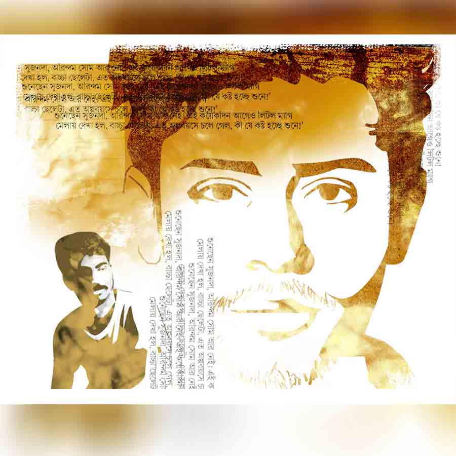

 
 <h1 align=center>সমাজ মাধ্যম</h1>
<h2 align=center>সুপর্ণা চট্টোপাধ্যায় ঘোষাল</h2> 

নামের পাশে সবুজ আলোটা জ্বলতে দেখেই পিং করল সপ্তর্ষি।

“শুনেছেন সুজনদা, অরিন্দম সোম আর নেই। এই কয়েক দিন আগেও লিটল ম্যাগ মেলায় দেখা হল, বাচ্চা ছেলেটা, এত অল্প বয়সে চলে গেল, কী যে কষ্ট হচ্ছে শুনে!”

মেসেজ ডেলিভারি হওয়ার কয়েক সেকেন্ডের মধ্যেই ডবল টিকের রং বদলে গেল ঘন নীলে। সুজনদা মেসেজ সিন করেছেন। কিছু ক্ষণের মধ্যেই অপর প্রান্ত থেকে টাইপিং-এর আইকন দেখা দিল।

সপ্তর্ষির এখন একটু খারাপ লাগছে, সুজনদা যদি না জানতেন খবরটা, এই সাতসকালে তাঁকে জানানোটা কি আদৌ ঠিক হল! তবু সকালবেলা ফেসবুক অন করে খবরটা দেখে আর নিজেকে সামলে রাখতে পারেনি।

“কী বলছ তুমি সপ্তর্ষি? অরিন্দম! নেই! এ কী সংবাদ শোনালে তুমি আমায়!” সঙ্গে তিনটে বিস্ময় আর চারটে স্যাড ইমোজি। নাহ, সুজনদা সত্যিই জানতেন না। অপরাধবোধ চেপে ধরল সপ্তর্ষিকে। ক্ষমা চেয়ে নেবে এমন অসময়ে মৃত্যুসংবাদ শোনানোর জন্য!

“হ্যাঁ দাদা, ওর টাইমলাইনে গিয়ে দেখে আসুন। দিন কয়েক ধরেই খুব ডিপ্রেসড ধরনের স্টেটাস দিচ্ছিল। আমরা ভেবেছিলাম হয়তো কবিতা লিখছে। সে যে নিজের মাংস কেটে নৈবেদ্য চড়াচ্ছে, বুঝতে পারিনি। আর স্যরি, আপনাকে সাতসকালে এই সংবাদ দিতে চাইনি, কিন্তু বিশ্বাস করুন, খবরটা পেয়ে আমি আর স্থির থাকতে পারছিলাম না।”

মেসেজটা সেন্ড করে কিছু ক্ষণ চোখ বন্ধ করে রইল সপ্তর্ষি। কতই বা বয়স হবে অরিন্দমের, পঁচিশ-ছাব্বিশ। বাচ্চা ছেলেগুলোর যে দিন-দিন কী হচ্ছে! এত ডিপ্রেশন কোথা থেকে আসে তাদের? কী ভাল কবিতা লিখত ছেলেটা—

‘আমাদের আশ্রয় ট্রাম লাইনের নীচে শুয়ে আছে।

কতকাল সেখানে নক্ষত্রবীথির গর্ভধারণ হয় না।

অকস্মাৎ এই বিবর্ণ দেশে অনাথা তামসী নৃত্য করে— হা হা হা হা।

ইদানিং শালিকের, খঞ্জনের ছিন্ন পক্ষ দেখা দেয় বাতিল শহরে।

কবি, আত্মহত্যা ছাড়া কি মোক্ষের পথ চেনো না?’

সপ্তর্ষির মতো আরও বহু মানুষ ভেবেছিল বুঝি জীবনানন্দকে উৎসর্গ করে লিখেছে।

সুজনদা লেখেন, “শক্ত হও সপ্তর্ষি, আমিও কথাটা শোনা ইস্তক নিশ্বাস নিতে পারছি না। এ কী নিদারুণ সংবাদ! একটু নিরবচ্ছিন্ন শান্তি চাই। সামান্য অন্ধকার চাই। আমার সন্তানের বয়স অরিন্দমের কাছাকাছি। ওর বয়সে আমিও কবি হিসাবে স্বীকৃতি পাইনি, তবু লড়াই চালিয়ে গিয়েছি দাঁতে দাঁত চেপে। সপ্তর্ষি, এক দিন দেখা কোরো। এখন কিছুই ভাল লাগছে না, ঘর অন্ধকার করে একটু শুয়ে থাকতে চাই। আমার ইন্দ্রিয়গুলো কোনও প্রতিক্রিয়া করতে পারছে না। সমস্ত কিছুই বড় বিবশ ঠেকছে সপ্তর্ষি।”

“হ্যাঁ, হ্যাঁ, নিশ্চয়ই দাদা। ভাল থাকবেন। সাক্ষাতে কথা হবে।”

এত বড় কবিকে আর বিব্রত করা উচিত হবে না মনে করেই কথা শেষ করে ও। সুজনদার চ্যাট বক্সে একটা হাই ফাইভের ইমোজি ফুটে উঠল। অনেকেই এটাকে নমস্কারের চিহ্ন ভেবে ভুল করে পাঠায়। সুজনদাও এখন তাই করলেন।

ঘটনাটা কিছুতেই যেন মাথা থেকে সরাতে পারছে না সপ্তর্ষি। সুজনদার মতো ঘর অন্ধকার করে শুয়ে থাকলেও যন্ত্রণার উপশম হবে না। ওর ধাত আলাদা। বরং যত একা থাকবে, অরিন্দমের মৃত্যু ওর গলা টিপে ধরতে আসবে।

কী করবে এখন ও? কাগজ কলম টেনে নেবে কোলের কাছে! একটা লাইন লিখেও কি এই অব্যক্ত যন্ত্রণা থেকে মুক্তি পাওয়া যাবে না!

বিছানার চাদরটা অকারণেই বার পাঁচেক টান-টান করার চেষ্টা চালায়। খাটের পায়ের কাছে ‘অক্ষয় মালবেরি’ পড়ে আছে। পেজ মার্কের ড্রাগনটা মুখ বাড়িয়ে ওর দিকেই তাকিয়ে আছে বইয়ের মাঝামাঝি জায়গা থেকে। অতি প্রিয় বইটাকে বুকের কাছে তুলে ধরতেও এখন আর ইচ্ছে করছে না।

মোবাইলের নোটসটা খুলে কিছু ক্ষণ ব্ল্যাঙ্ক পেজের দিকে তাকিয়ে আপনমনেই বিড়বিড় করল ও, ‘এত তাড়াতাড়ি চলে যাওয়ার কি খুব দরকার ছিল অরিন্দম?’ সঙ্গে সঙ্গে এলোমেলো চুল, পাতলা ঠোঁটের চার পাশে হালকা দাড়িগোঁফ, আর গভীর চোখের ছেলেটার মুখ ভেসে উঠল। সপ্তর্ষি দ্রুত উইন্ডোটা বন্ধ করে দেয়।

এক তলায় যেটা সপ্তর্ষির ঘর, তার লাগোয়া একটা ছোট্ট পূর্বমুখী বারান্দা। গ্রিলের গায়ে ঝুলন্ত টবে খানকয়েক গাছ লাগিয়ে রেখেছে সপ্তর্ষি। মন ভাল না থাকলে উঠে গিয়ে গাছেদের সঙ্গে ও মনে মনে কথা বলে। যে কথা কাউকে বলা যায় না, গাছেরা সে কথা অনায়াসে বুঝে নেয়। তারা নীরবে মলম লাগিয়ে দেয় যে কোনও ক্ষতের মুখে, ধীরে ধীরে বন্ধ হয়ে আসে রক্তক্ষরণ।

তবে এখন বারান্দায় গিয়ে পায়চারি করেও লাভ নেই। মা ওখানে বসে কলাই ডালের বড়ি দিচ্ছে। কাছে গেলেই নিজের পায়ে ব্যথা, শুগারের ওষুধ, বিন্নি মাসির ছেলের বিয়ের সাতকাহন তুলে মাথা খারাপ করে দেবে। একই ঘ্যানঘ্যান শুনতে আজকাল ক্লান্ত লাগে ওর।

অথচ ছোটবেলায় মা কী সুন্দর সপ্তর্ষিকে বুঝতে পারত। ও হাঁ করলেই মা বুঝে নিত ওর মন খারাপ কি না, টিউশনের কোন মেয়েটাকে ওর ভাল লাগে, টাকার অভাবে টিনটিনের কমিক্স কিনতে পারেনি বলে কতটা দুঃখ নিয়ে বাড়ি ফিরেছে বইমেলা থেকে। এখন যত দিন যাচ্ছে, মা আর সপ্তর্ষিকে বোঝার চেষ্টাই করে না। মায়ের সংবেদনশীলতা এত কমে গিয়েছে! সে কথা ভাবলেও ওর আশ্চর্য লাগে।

বরং সুজনদার মতো বড় মাপের কবি ওকে বোঝেন। গুরুত্ব দেন ওর কথায়। অবশ্য মায়ের সঙ্গে সুজনদার তুলনা! কবিদের মনোজগতের সঙ্গে আর পাঁচটা সাধারণ মানুষের তুলনা করলে চলবে কেন! তাঁরা সমগ্র বিশ্বের চেতনাকে নিজের মধ্যে আত্মস্থ করেন, আপন বোধ দিয়ে অনুভব করেন বিশ্বের চেতনাপ্রবাহ। তাঁদের অনুভব-উপলব্ধির ব্যাপ্তিই আলাদা। মানুষের অন্তর ও মর্মবেদনা তাঁদের মতো করে আর কার পক্ষেই বা বোঝা সম্ভব!

এই যেমন অরিন্দম, মাত্র বারকয়েকই দেখা হয়েছে ওর সঙ্গে; তবু কথা বলে বুঝতে পেরেছে কী বিপুল সম্ভাবনা রয়েছে ছেলেটার মধ্যে। মুহূর্তের মধ্যে নিজেকে শুধরে নিল সপ্তর্ষি। রয়েছে নয়, ছিল। বুক থেকে একটা দীর্ঘশ্বাস বেরিয়ে আসে। মানুষ কত তাড়াতাড়ি পাস্ট টেন্সে বদলে যায়!

মোবাইলটা বিছানা থেকে তুলে নিয়ে আবার লকড প্যাটার্নে নির্দিষ্ট গতিতে আঙুল বুলিয়ে আনলক করে ও। অদ্ভুত এই প্যাটার্নও। হয় যে ভাবে চলতে বলা হয়েছে, সে ভাবে চলো, তা হলে তোমার জন্য খুলে যাবে জীবনের দরজা, নয়তো রেড সিগন্যাল দেখিয়ে বলবে, ‘ফেল! ফেল! তুমি পারলে না ঠিক রাস্তায় হাঁটতে। তোমার জন্য জীবনের সব দরজাই বন্ধ!’ অরিন্দমও কি এই ভাবেই ভাবছিল ইদানীং!

ফেসবুকের পেজটা খোলা ছিল বলে প্রথমেই ওর নিজের নিউজ় ফিড ভেসে উঠল মোবাইলের স্ক্রিনে। চন্দ্রিমাদি এক জন পরিচিত লেখক। তিনি কুড়ি মিনিট আগে পোস্ট দিয়েছেন, “এই সাত সকাল থেকেই বিয়াল্লিশ ডিগ্রি। তায় টপ ফ্লোরে থাকি। কেউ যদি মাথায় ভাতের হাঁড়ি চাপাতে চান, চলে আসুন। গ্যাসের খরচ বেঁচে যাবে।”

পোস্টের মাথার উপর লেখা সুজনদা এটায় কমেন্ট করেছেন। নিশ্চয়ই চন্দ্রিমাদিকে অরিন্দমের খবরটা জানিয়েছেন। পোস্ট দেখেই বোঝা যাচ্ছে চন্দ্রিমাদি এখনও শোনেননি। শুনলে এমন খিল্লির পোস্ট করতেন না। অভ্যাসবশতই কমেন্ট সেকশনে ঢুকে গেল সপ্তর্ষি। সুজনদার কমেন্ট, “ওই জন্যই আপনাকে ইদানীং হট দেখায়।” সঙ্গে অনেকগুলো আগুনের ইমোজি।

সপ্তর্ষি ভুরু কুঁচকে সময়টা লক্ষ করল। আজ সকালের পোস্টই বটে!

মাথাটা ঝাঁ-ঝাঁ করছে ওর। টাইমটা ঠিক দেখছে তো! হ্যাঁ, কোনও ভুল নেই। যখন সুজনদাকে অরিন্দমের মৃত্যুসংবাদ দিচ্ছে ও, তার খানিক পরেই তো এই কমেন্টটা লেখা। ওদের দু’জনের কমন ফ্রেন্ড পঁচাত্তরের উপর। নিউজ় ফিডে তাদের সবার পোস্টই আসতে থাকে একের পর এক। আর সুজনদাকে ফেভারিট লিস্টে রাখা আছে বলে, তিনি কোথায় কী কমেন্ট করছেন, লাইক করছেন— সব, সব সব ভেসে আসে সপ্তর্ষির নিউজ় ফিডে। সবার আগে। এতটা না এলেই হয়তো পারত।

চন্দ্রিমাদির নীচেই বাসুদেবদার রুমটেক মনাস্ট্রি যাওয়ার পোস্ট, “চলল ভোলা, উঠিয়ে ঝোলা।”

তাতে সুজনদা লিখছেন, “কয়েকটা বুড়ো সাধু ঝুলিতে ভরে নিয়ে এসো হে ভায়া।” সঙ্গে তিনটে হাসতে হাসতে চোখে জল এসে যাওয়ার ইমোজি। সেটাও কয়েক মিনিট আগের পোস্ট। খাটের ব্যাকরেস্টে হেলান দিল সপ্তর্ষি। পিঠটা আর সোজা করে ধরে রাখতে পারছে না। বাসুদেবদার পোস্টের নিচে একটা পপুলার গ্রুপের ক্রিঞ্জ টাইপের পোস্ট, “এক্ষুনি এক কোটি টাকা পেলে আপনি কী করবেন?”

সুজনদা কমেন্ট করেছেন, “আগে দিয়ে দেখান, তার পর বলছি।”

কমেন্টগুলো কি চোখের ভুল! এ সময় সুজনদার ঘর অন্ধকার করে শুয়ে নিরবচ্ছিন্ন শান্তি খোঁজার কথা ছিল না!

কোথাও একটা কোকিল একটানা সুরে ডেকে যাচ্ছে। শুনতে শুনতে ক্লান্তি চলে আসে। সুজনদার নামে ট্যাপ করে, ওঁর নিজস্ব প্রোফাইলে ঢুকে পড়ল এক লহমায়। অরিন্দমের মৃত্যু, ইয়াং জেনারেশনের ডিপ্রেশন নিয়ে নাতিদীর্ঘ একটা পোস্ট। সবার শেষে তিনি লিখেছেন, কেউ যখনই একা বোধ করবে, ইচ্ছা করবে কারও সঙ্গে কথা বলতে, কারও সঙ্গ চাইবে, যেন নির্দ্বিধায় সুজনদার সঙ্গে যোগাযোগ করে।

সপ্তর্ষি বেরিয়ে আসে ওঁর প্রোফাইল থেকে। সময় মিলিয়ে নেয় আরও একটা পোস্টের কমেন্টের। টলিউডের বিখ্যাত অভিনেত্রী আরাত্রিকা মুখোপাধ্যায়ের ক্লিভেজ দেখানো পোস্ট, “এখন ঊনত্রিশ। জানি না ঊনসত্তর হলে এই সৌন্দর্য ধরে রাখতে পারব কি না!”

সুজনদা লিখছেন, “সিক্সটি নাইন বড়ই অশ্লীল সংখ্যা। মেক ইট এইট্টি।” চোখ মারার ইমোজিটা সপ্তর্ষির চোখ এড়ায় না। সুজনদার নিজের টাইমলাইনে পোস্ট দেওয়ার অব্যবহিত পরেই এই কমেন্ট। সপ্তর্ষির অজানতেই একটা হাহাকার বেরিয়ে এল মুখ থেকে। চোখ বন্ধ হয়ে নিজে থেকেই। কোকিলের ডাকটা ক্রমশ বিরক্তিকর হয়ে উঠছে। পাশের বাড়ির বাচ্চাটা টিভিতে গাঁকগাঁক করে কার্টুন চ্যানেল চালিয়ে রেখেছে। কলাই ডালের গন্ধটা যে কী বিচ্ছিরি। বড়িগুলো বারান্দায় না দিলেই হচ্ছিল না মায়ের! ঘরটা কী অদ্ভুত রকমের অন্ধকার আর স্যাঁতসেঁতে হয়ে যাচ্ছে দিনকে দিন।

“বাবান, ওঠ সোনা!”

কখন ঘুমিয়ে পড়েছিল খেয়াল নেই। মাথায় নরম হাতের ছোঁয়া পেতেই ধড়মড়িয়ে উঠে বসল সপ্তর্ষি। মা এসে দাঁড়িয়েছে কাছে। গা থেকে কলাই ডালের গন্ধ উঠছে মায়ের। আঁচলে হলুদের ছোপ। কিছু ক্ষণের জন্য ওর মনে পড়ল না, কেন এই রকম অদ্ভুত ভাবে বসে বসেই ঘুমিয়ে পড়েছিল। তার পর একে একে ফিরে আসে অরিন্দমের মৃত্যুর কথা, সুজনদার কমেন্টগুলোর স্মৃতি।

“উফফ!” গুছিয়ে বসতে গিয়ে সামান্য ককিয়ে উঠল ও। আপদের মাইগ্রেনটা জানান দিচ্ছে।

“আয়, কোলে মাথা রেখে শো। আমি মাথা টিপে দিচ্ছি। সব ঠিক হয়ে যাবে বাবু। সব ঠিক হয়ে যাবে।”

মা তো কিছুই জানে না, তবু কেমন অন্তর্যামীর মতো সপ্তর্ষিকে টেনে নিচ্ছে নিজের কোলে। চুলের জঙ্গল থেকে মায়ের শীর্ণ আঙুলগুলো ওর কপালে নেমে আসে; যে ভাবে ভগীরথের ইশারায় নেমে এসেছিল অমৃতপ্রবাহিণী সুরধুনী।

“মা! তোমার পায়ে ব্যথা কেমন আছে?” অনেক দিন পরে সপ্তর্ষি নিজে থেকে মায়ের শরীরের খবর নিল। আঙুলগুলো এক বার থমকে গিয়েই আবার কপালের রগ বরাবর চলতে শুরু করেছে। মা মনে মনে কী বলে, আজকাল ও নিজেও শুনতে পায় না।

নামের পাশে সবুজ আলোটা জ্বলতে দেখেই পিং করল সপ্তর্ষি।

“শুনেছেন সুজনদা, অরিন্দম সোম আর নেই। এই কয়েক দিন আগেও লিটল ম্যাগ মেলায় দেখা হল, বাচ্চা ছেলেটা, এত অল্প বয়সে চলে গেল, কী যে কষ্ট হচ্ছে শুনে!”

মেসেজ ডেলিভারি হওয়ার কয়েক সেকেন্ডের মধ্যেই ডবল টিকের রং বদলে গেল ঘন নীলে। সুজনদা মেসেজ সিন করেছেন। কিছু ক্ষণের মধ্যেই অপর প্রান্ত থেকে টাইপিং-এর আইকন দেখা দিল।

সপ্তর্ষির এখন একটু খারাপ লাগছে, সুজনদা যদি না জানতেন খবরটা, এই সাতসকালে তাঁকে জানানোটা কি আদৌ ঠিক হল! তবু সকালবেলা ফেসবুক অন করে খবরটা দেখে আর নিজেকে সামলে রাখতে পারেনি।

“কী বলছ তুমি সপ্তর্ষি? অরিন্দম! নেই! এ কী সংবাদ শোনালে তুমি আমায়!” সঙ্গে তিনটে বিস্ময় আর চারটে স্যাড ইমোজি। নাহ, সুজনদা সত্যিই জানতেন না। অপরাধবোধ চেপে ধরল সপ্তর্ষিকে। ক্ষমা চেয়ে নেবে এমন অসময়ে মৃত্যুসংবাদ শোনানোর জন্য!

“হ্যাঁ দাদা, ওর টাইমলাইনে গিয়ে দেখে আসুন। দিন কয়েক ধরেই খুব ডিপ্রেসড ধরনের স্টেটাস দিচ্ছিল। আমরা ভেবেছিলাম হয়তো কবিতা লিখছে। সে যে নিজের মাংস কেটে নৈবেদ্য চড়াচ্ছে, বুঝতে পারিনি। আর স্যরি, আপনাকে সাতসকালে এই সংবাদ দিতে চাইনি, কিন্তু বিশ্বাস করুন, খবরটা পেয়ে আমি আর স্থির থাকতে পারছিলাম না।”

মেসেজটা সেন্ড করে কিছু ক্ষণ চোখ বন্ধ করে রইল সপ্তর্ষি। কতই বা বয়স হবে অরিন্দমের, পঁচিশ-ছাব্বিশ। বাচ্চা ছেলেগুলোর যে দিন-দিন কী হচ্ছে! এত ডিপ্রেশন কোথা থেকে আসে তাদের? কী ভাল কবিতা লিখত ছেলেটা—

‘আমাদের আশ্রয় ট্রাম লাইনের নীচে শুয়ে আছে।

কতকাল সেখানে নক্ষত্রবীথির গর্ভধারণ হয় না।

অকস্মাৎ এই বিবর্ণ দেশে অনাথা তামসী নৃত্য করে— হা হা হা হা।

ইদানিং শালিকের, খঞ্জনের ছিন্ন পক্ষ দেখা দেয় বাতিল শহরে।

কবি, আত্মহত্যা ছাড়া কি মোক্ষের পথ চেনো না?’

সপ্তর্ষির মতো আরও বহু মানুষ ভেবেছিল বুঝি জীবনানন্দকে উৎসর্গ করে লিখেছে।

সুজনদা লেখেন, “শক্ত হও সপ্তর্ষি, আমিও কথাটা শোনা ইস্তক নিশ্বাস নিতে পারছি না। এ কী নিদারুণ সংবাদ! একটু নিরবচ্ছিন্ন শান্তি চাই। সামান্য অন্ধকার চাই। আমার সন্তানের বয়স অরিন্দমের কাছাকাছি। ওর বয়সে আমিও কবি হিসাবে স্বীকৃতি পাইনি, তবু লড়াই চালিয়ে গিয়েছি দাঁতে দাঁত চেপে। সপ্তর্ষি, এক দিন দেখা কোরো। এখন কিছুই ভাল লাগছে না, ঘর অন্ধকার করে একটু শুয়ে থাকতে চাই। আমার ইন্দ্রিয়গুলো কোনও প্রতিক্রিয়া করতে পারছে না। সমস্ত কিছুই বড় বিবশ ঠেকছে সপ্তর্ষি।”

“হ্যাঁ, হ্যাঁ, নিশ্চয়ই দাদা। ভাল থাকবেন। সাক্ষাতে কথা হবে।”

এত বড় কবিকে আর বিব্রত করা উচিত হবে না মনে করেই কথা শেষ করে ও। সুজনদার চ্যাট বক্সে একটা হাই ফাইভের ইমোজি ফুটে উঠল। অনেকেই এটাকে নমস্কারের চিহ্ন ভেবে ভুল করে পাঠায়। সুজনদাও এখন তাই করলেন।

ঘটনাটা কিছুতেই যেন মাথা থেকে সরাতে পারছে না সপ্তর্ষি। সুজনদার মতো ঘর অন্ধকার করে শুয়ে থাকলেও যন্ত্রণার উপশম হবে না। ওর ধাত আলাদা। বরং যত একা থাকবে, অরিন্দমের মৃত্যু ওর গলা টিপে ধরতে আসবে।

কী করবে এখন ও? কাগজ কলম টেনে নেবে কোলের কাছে! একটা লাইন লিখেও কি এই অব্যক্ত যন্ত্রণা থেকে মুক্তি পাওয়া যাবে না!

বিছানার চাদরটা অকারণেই বার পাঁচেক টান-টান করার চেষ্টা চালায়। খাটের পায়ের কাছে ‘অক্ষয় মালবেরি’ পড়ে আছে। পেজ মার্কের ড্রাগনটা মুখ বাড়িয়ে ওর দিকেই তাকিয়ে আছে বইয়ের মাঝামাঝি জায়গা থেকে। অতি প্রিয় বইটাকে বুকের কাছে তুলে ধরতেও এখন আর ইচ্ছে করছে না।

মোবাইলের নোটসটা খুলে কিছু ক্ষণ ব্ল্যাঙ্ক পেজের দিকে তাকিয়ে আপনমনেই বিড়বিড় করল ও, ‘এত তাড়াতাড়ি চলে যাওয়ার কি খুব দরকার ছিল অরিন্দম?’ সঙ্গে সঙ্গে এলোমেলো চুল, পাতলা ঠোঁটের চার পাশে হালকা দাড়িগোঁফ, আর গভীর চোখের ছেলেটার মুখ ভেসে উঠল। সপ্তর্ষি দ্রুত উইন্ডোটা বন্ধ করে দেয়।

এক তলায় যেটা সপ্তর্ষির ঘর, তার লাগোয়া একটা ছোট্ট পূর্বমুখী বারান্দা। গ্রিলের গায়ে ঝুলন্ত টবে খানকয়েক গাছ লাগিয়ে রেখেছে সপ্তর্ষি। মন ভাল না থাকলে উঠে গিয়ে গাছেদের সঙ্গে ও মনে মনে কথা বলে। যে কথা কাউকে বলা যায় না, গাছেরা সে কথা অনায়াসে বুঝে নেয়। তারা নীরবে মলম লাগিয়ে দেয় যে কোনও ক্ষতের মুখে, ধীরে ধীরে বন্ধ হয়ে আসে রক্তক্ষরণ।

তবে এখন বারান্দায় গিয়ে পায়চারি করেও লাভ নেই। মা ওখানে বসে কলাই ডালের বড়ি দিচ্ছে। কাছে গেলেই নিজের পায়ে ব্যথা, শুগারের ওষুধ, বিন্নি মাসির ছেলের বিয়ের সাতকাহন তুলে মাথা খারাপ করে দেবে। একই ঘ্যানঘ্যান শুনতে আজকাল ক্লান্ত লাগে ওর।

অথচ ছোটবেলায় মা কী সুন্দর সপ্তর্ষিকে বুঝতে পারত। ও হাঁ করলেই মা বুঝে নিত ওর মন খারাপ কি না, টিউশনের কোন মেয়েটাকে ওর ভাল লাগে, টাকার অভাবে টিনটিনের কমিক্স কিনতে পারেনি বলে কতটা দুঃখ নিয়ে বাড়ি ফিরেছে বইমেলা থেকে। এখন যত দিন যাচ্ছে, মা আর সপ্তর্ষিকে বোঝার চেষ্টাই করে না। মায়ের সংবেদনশীলতা এত কমে গিয়েছে! সে কথা ভাবলেও ওর আশ্চর্য লাগে।

বরং সুজনদার মতো বড় মাপের কবি ওকে বোঝেন। গুরুত্ব দেন ওর কথায়। অবশ্য মায়ের সঙ্গে সুজনদার তুলনা! কবিদের মনোজগতের সঙ্গে আর পাঁচটা সাধারণ মানুষের তুলনা করলে চলবে কেন! তাঁরা সমগ্র বিশ্বের চেতনাকে নিজের মধ্যে আত্মস্থ করেন, আপন বোধ দিয়ে অনুভব করেন বিশ্বের চেতনাপ্রবাহ। তাঁদের অনুভব-উপলব্ধির ব্যাপ্তিই আলাদা। মানুষের অন্তর ও মর্মবেদনা তাঁদের মতো করে আর কার পক্ষেই বা বোঝা সম্ভব!

এই যেমন অরিন্দম, মাত্র বারকয়েকই দেখা হয়েছে ওর সঙ্গে; তবু কথা বলে বুঝতে পেরেছে কী বিপুল সম্ভাবনা রয়েছে ছেলেটার মধ্যে। মুহূর্তের মধ্যে নিজেকে শুধরে নিল সপ্তর্ষি। রয়েছে নয়, ছিল। বুক থেকে একটা দীর্ঘশ্বাস বেরিয়ে আসে। মানুষ কত তাড়াতাড়ি পাস্ট টেন্সে বদলে যায়!

মোবাইলটা বিছানা থেকে তুলে নিয়ে আবার লকড প্যাটার্নে নির্দিষ্ট গতিতে আঙুল বুলিয়ে আনলক করে ও। অদ্ভুত এই প্যাটার্নও। হয় যে ভাবে চলতে বলা হয়েছে, সে ভাবে চলো, তা হলে তোমার জন্য খুলে যাবে জীবনের দরজা, নয়তো রেড সিগন্যাল দেখিয়ে বলবে, ‘ফেল! ফেল! তুমি পারলে না ঠিক রাস্তায় হাঁটতে। তোমার জন্য জীবনের সব দরজাই বন্ধ!’ অরিন্দমও কি এই ভাবেই ভাবছিল ইদানীং!

ফেসবুকের পেজটা খোলা ছিল বলে প্রথমেই ওর নিজের নিউজ় ফিড ভেসে উঠল মোবাইলের স্ক্রিনে। চন্দ্রিমাদি এক জন পরিচিত লেখক। তিনি কুড়ি মিনিট আগে পোস্ট দিয়েছেন, “এই সাত সকাল থেকেই বিয়াল্লিশ ডিগ্রি। তায় টপ ফ্লোরে থাকি। কেউ যদি মাথায় ভাতের হাঁড়ি চাপাতে চান, চলে আসুন। গ্যাসের খরচ বেঁচে যাবে।”

পোস্টের মাথার উপর লেখা সুজনদা এটায় কমেন্ট করেছেন। নিশ্চয়ই চন্দ্রিমাদিকে অরিন্দমের খবরটা জানিয়েছেন। পোস্ট দেখেই বোঝা যাচ্ছে চন্দ্রিমাদি এখনও শোনেননি। শুনলে এমন খিল্লির পোস্ট করতেন না। অভ্যাসবশতই কমেন্ট সেকশনে ঢুকে গেল সপ্তর্ষি। সুজনদার কমেন্ট, “ওই জন্যই আপনাকে ইদানীং হট দেখায়।” সঙ্গে অনেকগুলো আগুনের ইমোজি।

সপ্তর্ষি ভুরু কুঁচকে সময়টা লক্ষ করল। আজ সকালের পোস্টই বটে!

মাথাটা ঝাঁ-ঝাঁ করছে ওর। টাইমটা ঠিক দেখছে তো! হ্যাঁ, কোনও ভুল নেই। যখন সুজনদাকে অরিন্দমের মৃত্যুসংবাদ দিচ্ছে ও, তার খানিক পরেই তো এই কমেন্টটা লেখা। ওদের দু’জনের কমন ফ্রেন্ড পঁচাত্তরের উপর। নিউজ় ফিডে তাদের সবার পোস্টই আসতে থাকে একের পর এক। আর সুজনদাকে ফেভারিট লিস্টে রাখা আছে বলে, তিনি কোথায় কী কমেন্ট করছেন, লাইক করছেন— সব, সব সব ভেসে আসে সপ্তর্ষির নিউজ় ফিডে। সবার আগে। এতটা না এলেই হয়তো পারত।

চন্দ্রিমাদির নীচেই বাসুদেবদার রুমটেক মনাস্ট্রি যাওয়ার পোস্ট, “চলল ভোলা, উঠিয়ে ঝোলা।”

তাতে সুজনদা লিখছেন, “কয়েকটা বুড়ো সাধু ঝুলিতে ভরে নিয়ে এসো হে ভায়া।” সঙ্গে তিনটে হাসতে হাসতে চোখে জল এসে যাওয়ার ইমোজি। সেটাও কয়েক মিনিট আগের পোস্ট। খাটের ব্যাকরেস্টে হেলান দিল সপ্তর্ষি। পিঠটা আর সোজা করে ধরে রাখতে পারছে না। বাসুদেবদার পোস্টের নিচে একটা পপুলার গ্রুপের ক্রিঞ্জ টাইপের পোস্ট, “এক্ষুনি এক কোটি টাকা পেলে আপনি কী করবেন?”

সুজনদা কমেন্ট করেছেন, “আগে দিয়ে দেখান, তার পর বলছি।”

কমেন্টগুলো কি চোখের ভুল! এ সময় সুজনদার ঘর অন্ধকার করে শুয়ে নিরবচ্ছিন্ন শান্তি খোঁজার কথা ছিল না!

কোথাও একটা কোকিল একটানা সুরে ডেকে যাচ্ছে। শুনতে শুনতে ক্লান্তি চলে আসে। সুজনদার নামে ট্যাপ করে, ওঁর নিজস্ব প্রোফাইলে ঢুকে পড়ল এক লহমায়। অরিন্দমের মৃত্যু, ইয়াং জেনারেশনের ডিপ্রেশন নিয়ে নাতিদীর্ঘ একটা পোস্ট। সবার শেষে তিনি লিখেছেন, কেউ যখনই একা বোধ করবে, ইচ্ছা করবে কারও সঙ্গে কথা বলতে, কারও সঙ্গ চাইবে, যেন নির্দ্বিধায় সুজনদার সঙ্গে যোগাযোগ করে।

সপ্তর্ষি বেরিয়ে আসে ওঁর প্রোফাইল থেকে। সময় মিলিয়ে নেয় আরও একটা পোস্টের কমেন্টের। টলিউডের বিখ্যাত অভিনেত্রী আরাত্রিকা মুখোপাধ্যায়ের ক্লিভেজ দেখানো পোস্ট, “এখন ঊনত্রিশ। জানি না ঊনসত্তর হলে এই সৌন্দর্য ধরে রাখতে পারব কি না!”

সুজনদা লিখছেন, “সিক্সটি নাইন বড়ই অশ্লীল সংখ্যা। মেক ইট এইট্টি।” চোখ মারার ইমোজিটা সপ্তর্ষির চোখ এড়ায় না। সুজনদার নিজের টাইমলাইনে পোস্ট দেওয়ার অব্যবহিত পরেই এই কমেন্ট। সপ্তর্ষির অজানতেই একটা হাহাকার বেরিয়ে এল মুখ থেকে। চোখ বন্ধ হয়ে নিজে থেকেই। কোকিলের ডাকটা ক্রমশ বিরক্তিকর হয়ে উঠছে। পাশের বাড়ির বাচ্চাটা টিভিতে গাঁকগাঁক করে কার্টুন চ্যানেল চালিয়ে রেখেছে। কলাই ডালের গন্ধটা যে কী বিচ্ছিরি। বড়িগুলো বারান্দায় না দিলেই হচ্ছিল না মায়ের! ঘরটা কী অদ্ভুত রকমের অন্ধকার আর স্যাঁতসেঁতে হয়ে যাচ্ছে দিনকে দিন।

“বাবান, ওঠ সোনা!”

কখন ঘুমিয়ে পড়েছিল খেয়াল নেই। মাথায় নরম হাতের ছোঁয়া পেতেই ধড়মড়িয়ে উঠে বসল সপ্তর্ষি। মা এসে দাঁড়িয়েছে কাছে। গা থেকে কলাই ডালের গন্ধ উঠছে মায়ের। আঁচলে হলুদের ছোপ। কিছু ক্ষণের জন্য ওর মনে পড়ল না, কেন এই রকম অদ্ভুত ভাবে বসে বসেই ঘুমিয়ে পড়েছিল। তার পর একে একে ফিরে আসে অরিন্দমের মৃত্যুর কথা, সুজনদার কমেন্টগুলোর স্মৃতি।

“উফফ!” গুছিয়ে বসতে গিয়ে সামান্য ককিয়ে উঠল ও। আপদের মাইগ্রেনটা জানান দিচ্ছে।

“আয়, কোলে মাথা রেখে শো। আমি মাথা টিপে দিচ্ছি। সব ঠিক হয়ে যাবে বাবু। সব ঠিক হয়ে যাবে।”

মা তো কিছুই জানে না, তবু কেমন অন্তর্যামীর মতো সপ্তর্ষিকে টেনে নিচ্ছে নিজের কোলে। চুলের জঙ্গল থেকে মায়ের শীর্ণ আঙুলগুলো ওর কপালে নেমে আসে; যে ভাবে ভগীরথের ইশারায় নেমে এসেছিল অমৃতপ্রবাহিণী সুরধুনী।

“মা! তোমার পায়ে ব্যথা কেমন আছে?” অনেক দিন পরে সপ্তর্ষি নিজে থেকে মায়ের শরীরের খবর নিল। আঙুলগুলো এক বার থমকে গিয়েই আবার কপালের রগ বরাবর চলতে শুরু করেছে। মা মনে মনে কী বলে, আজকাল ও নিজেও শুনতে পায় না।

বারান্দা থেকে টপকে বিছানায় এসে রোদ পড়েছে সপ্তর্ষির পায়ের বুড়ো আঙুলে। ঘরটাকে কই এখন আর তেমন স্যাঁতসেঁতে লাগছে না তো! মায়ের কোলে মুখটা গুঁজে সপ্তর্ষি পড়ে থাকে।

(এই প্রতিবেদনটি আনন্দবাজার পত্রিকার মুদ্রিত সংস্করণ থেকে নেওয়া হয়েছে)

