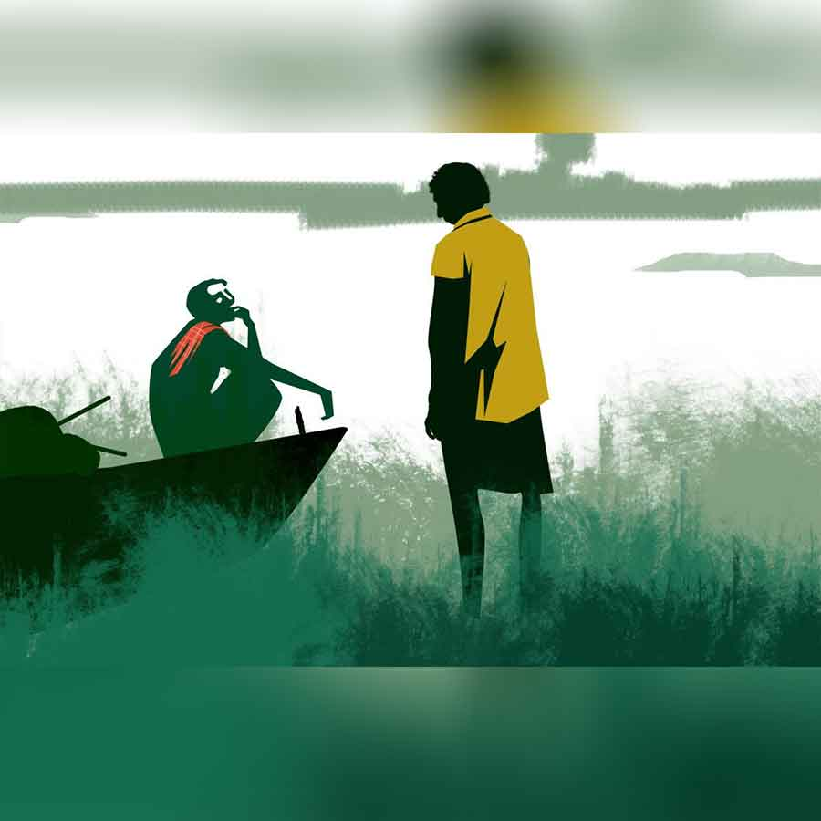

 
 <h1 align=center>সাধভক্ষণ</h1>
<h2 align=center>বিপুল দাস</h2> 

একেই বলে সমাপতন। জটার পক্ষে কোনও মতেই জানা সম্ভব নয় যে, সে দিন ছিল পঞ্জিকা অনুসারে সাধভক্ষণের প্রশস্ত কাল। আর সে দিনই সকালে উঠেই তার পোয়াতি বৌয়ের কি না মাছ খাওয়ার সাধ হল! তাও আবার কুচোকাচা নয়, এক দাগা বড় মাছ!

বৈশাখ মাসে পুকুর-ডোবার জল শুকিয়ে থকথকে কাদা বেরিয়ে পড়ে। কুয়োর জল কোন পাতালে চলে যায়। দলে দলে কুয়ো ঝালাইয়ের লোক বেরিয়ে পড়ে। পাড়ায় কুয়োর চেয়ে ঝালাইয়ের লোক বেশি। ভাদ্র-আশ্বিনের ভরা গাং তখন লোকজন দিব্যি হেঁটে পার হয়ে যায়। ঘাটের মাঝি সাধু মালো তখন কিছু কাল গোপালগঞ্জের আড়তে মাল মাপে। কয়ালের কাজ করতে করতেই চোখ রাখে আকাশের দিকে। বাপ রে, কী দাপুটে আগুনের গোলা! চোখে হাতের আড়াল দিয়ে আকাশের এ দিক-ও দিক দেখে। দৈবাৎ এক-দু’টুকরো মেঘ ওড়াউড়ি করে বটে, কিন্তু সাধু জানে এ হল খরার মেঘ। মায়ামেঘ। বাদুলে মেঘের লক্ষণ অন্য রকম।

পাল্লায় দু’কুইন্টালের পাথর চাপিয়ে সিজনের ফসল মাপতে মাপতে তার ভয়ানক জলতেষ্টা পায়। সাধু জানে, এ পিপাসা পেট ভরে জল খেয়ে মেটার নয়। ভরা কলসির মতো পেটটা জলে ঢকঢক করবে, তবু মনে হবে তেষ্টা মেটেনি।

তার পর এক দিন আসে আষাঢ়। খেপা বুনোমোষের মতো আকাশ জুড়ে কালো মেঘের দাপাদাপি শুরু হয়। তার পর মুষলধারায় জল নামে মেঘ ভেঙে। পাতাপাতালি থেকে ধুলো মুছে যাওয়ার পর আরও সবুজ হয়ে ওঠে সেগুলো।

সাধুর মন আনচান করে ওঠে। আড়তের কয়ালগিরি ছেড়ে ঘাটের দিকে এক দিন রওনা হয়। কত কাজ পড়ে আছে। ছ’-সাত মাস ডাঙায় কচ্ছপের মতো উল্টো হয়ে পড়ে ছিল তার নৌকো। কাঠফাটা রোদ গেছে এর ওপর দিয়ে। এ রকম রোদে কাঠ শুকিয়ে খিল আলগা হয়ে যায়। তক্তার জোড়ে ফাঁক ধরে। তখন তার বিশ্রাম নেওয়ার ফুরসত থাকে না। তুষ, খড়কুচি, গোবর আর গাবের আঠা দিয়ে নৌকো গাবগোবর করতে হবে, নৌকোর খোল, আগগলুই-পাছগলুইয়ের কাঠ, লগি— সব দেখে শুনে তবে এক দিন, ‘বদর বদর’ বলে পিরফকির, দুগ্গা-কালীর নাম নিয়ে নৌকো জলে নামায়।

যে রাতে তুমুল বৃষ্টির পর ময়নার ঘোলা জল পাড় ছুঁয়ে ফেলে, সে দিন ভোরে সাধু আবার ঘাটোয়াল হয়ে যায়। স্রোতে নাও ভাসানোর পর সে টের পায়, ঘোলাজল তার শরীরের সব ছিদ্র দিয়ে ভিতরে ঢুকে যাচ্ছে। ভিজে উঠছে সর্ব অঙ্গ। কী আরাম তখন। ঘোলাজলই মনে হয় মিঠে পানি। শরীর আর মন শীতল হতে থাকে। তেষ্টা মেটে।

ও পার থেকে এখন ফিরবে সাধু। এটাই শেষ খেয়া। এইমাত্র পশ্চিমের রেললাইনের ও দিকে সূর্য ডুব দিল। আরও কিছু ক্ষণ আলো থাকবে। এই আলোয় ছায়া পড়ে না, কিন্তু লোকজন দিব্যি চেনা যায়। সাধু ভাবল আর একটু দেখবে। একেবারে শূন্য নৌকো নিয়ে ফিরলে পোষায় না। রক্ত জল করা পরিশ্রম, নৌকোর ডহরে চড়নদার না থাকলে, নাও বেয়ে, লগি ঠেলে কী লাভ!

তখনই দেখতে পেল, পাটখেতের আড়াল ছেড়ে এক জন বেরিয়ে ঘাটের দিকেই আসছে। মুখ ভাল বুঝতে পারল না। একটা পা একটু টেনে হাঁটা দেখে মনে হল জটা হতে পারে।

সাধুর মেজাজ বিগড়ে গেল। ফালতু সওয়ারি! ওর গামছা খুলে নিলেও একটা কানাকড়ি বেরোবে না। এখানে-ওখানে মাটি খুঁড়ে কচু-ঘেঁচু খুঁজে বেড়ায়, ডোবায় নদীতে গামছা দিয়ে চুনোমাছ ধরে, শাকপাতা তুলে নিয়ে যায়। ধানের মরসুমে মুনিষের কাজ পেলে তো বর্তে যায়। কী আর করবে সাধু! ঝগড়া করে ওর থেকে পয়সা আদায় করতেও কষ্ট হয়। যাকগে, দুটো কথা বলতে বলতে পার হওয়া যাবে।

“শুনেছিস সাধু, তোর বোধহয় এ বার কপাল পুড়ল!” নৌকোয় বসেই কথা শুরু করল জটা বাগদি।

মনে মনে হাসল সাধু। এই হল জটার কথা শুরুর কায়দা। প্রথমেই ভড়কি দিয়ে কথা চালাচালি শুরু করবে। উল্টো দিকের লোকটাকে ঘাবড়ে দেবে প্রথমে। তার পর নিজের খুশিমতো গল্প বানাতে শুরু করবে। আর গল্পও বটে। ঘুরিয়ে ফিরিয়ে সেই ভূতপ্রেতে এনে ফেলবে। মা মনসার দিব্যি গেলে বলবে ওর নিজের চোখে নাকি দেখা!

“মাইরি, বললে বিশ্বেস যাবিনে, এই দেখ, গায়ের লোম খাড়া হয়ে গেছে…”

“বাজে কথা ছেড়ে আসল কথা বল। তোর সেই বেম্মদত্যির কথা তো?”

“আরে মনসাতলার ঘটনা। এই ধর, মাসখানেক আগের কথা। জষ্টি মাসের শেষের দিক, ভ্যাপসা গরম, ঘুম আসছিল না দেখে ভোররাতের দিকে উঠেই পড়লাম। যাই, এট্টু পাড়াটা টহল দিয়ে আসি। মুনি-ঋষিরা এ সময়েই ধ্যানে বসে।”

জটার মুখে মুনি-ঋষির কথা শুনে সাধু হেসে ফেলল। এ বাড়ির কলা, ও বাড়ির লাউ জটা সরিয়ে ফেলে সবাই জানে। দু’-চার বার ধরা পড়ে মারধরও খেয়েছে। নির্ঘাত সেই বিষয়কর্মেই বেরিয়েছিল।

“কী দেখলি?”

“মনসাতলায় দাঁড়িয়ে আছি, হঠাৎ শুনি সাঁই সাঁই শব্দ। ভাবলাম বাদুড়টাদুড় হবে। উপরে তাকিয়ে দেখি একটা মানুষ, কালো চাদরে শরীর ঢাকা, দু’হাত পাখনার মতো ছড়িয়ে দিয়ে উড়ছে। আমার চোখের সামনে দিয়ে মোর্শেদের বাঁশবাগানে নামল। রাম রাম!”

সাধু বলে, “তা আমার কপাল পোড়ার কী দেখলি?”

“শুনিসনি, ময়নার উপরে তো পোল হবে! উড়ো উড়ো শোনা যাচ্ছে। জমির দর চড়া শুরু হয়ে গেছে। লোকজন থোড়াই তোকে আর তেল মাখাবে। দিব্যি জুতো পায়েই গটমট করে নদী পার হবে। নতুন পোলের উপর দিয়ে।”

খেয়া শেষ করে গায়ের ব্যথা মারার জন্য তার চালার নীচে বসে দু’ছিলিম চড়ায় সাধু। আজ সে অনেক ক্ষণ নদীর কালো জলের দিকে তাকিয়ে রইল। দিনের নদী রাতে কেমন অচেনা মনে হয়। কালো জলের ছলাত ছলাত বড় বেশি কানে বাজে। উজানভাটি অচেনা অন্ধকারে ডুবে আছে, মাঝে সামান্য জায়গায় জল বোঝা যায়। ও পারে চেনা কোনও চিহ্ন নেই, কোথায় নাও লাগাবে সাধুমাঝি!

বেশ ক’ছিলিম চড়িয়ে আকাশের দিকে তাকিয়ে চিত হয়ে শুয়ে রইল সাধু মালো।

*****

হরিপদ দত্তর বাড়িতে কান্নাকাটির রোল বড় বেশি হয়েছিল। যদিও দত্তমশাই তাঁর হিমঘর, করাতকল, দু’খানা বাড়ি, জমিজমা, দিঘি ইত্যাদি স্থাবর এবং অস্থাবর সম্পত্তি তিন ছেলে এক মেয়ের মধ্যে যথারীতি উইল করে রেখে চলে গেলেন, তবু সবাই খুব জোরে জোরে কাঁদছিল। জানা যায় যে, রাতে তার বেশ ক’বার বমি হয়। তার পর তিনি বিছানা নষ্ট করতে শুরু করেন। উঠে বাথরুম পর্যন্ত যাওয়ার আর ক্ষমতা ছিল না। এমনিতেই বাতের প্রকোপে তার ডান হাঁটু ভাল কাজ করে না। একটু টেনে হাঁটেন। তাঁর স্ত্রী কনফার্ম করেন যে, শেষ বারের বমির কালার ছিল তুঁতে টাইপের।

খবর পেয়ে ভোরবেলায় মেয়ে এসেছিল। সে দেখেছে, তাদের গেটের সামনে কেউ সিঁদুরমাখা পান-সুপুরি রেখে গেছে। বাণ-মারা বিষয়ে তার কোনও সন্দেহ ছিল না। তবে তিন ছেলেই নিশ্চিত ছিল যে, ফুড-পয়জ়নিং। তাদের গর্ভধারিণী শুধু বলার চেষ্টা করেছিলেন, রোজকার মতো রঘু কর্তাকে রাত আটটা নাগাদ গেলাস-বোতল সাজিয়ে দিয়েছিল। তার পর তিনি রঘুকে দিয়ে দোকান থেকে অনেকগুলো পিঁয়াজি আর আলুর চপ আনিয়েছিলেন। তার পর রাতের খাওয়াও বেশ ভারী ছিল। শেষ পাতে এক বাটি ক্ষীরও খেয়েছিলেন।

মেয়ে অবশ্য বাণের ব্যাপারেই সওয়াল চালিয়ে যাচ্ছিল। যারা বাণ মেরেছে, তাদের মধ্যে বড়বৌদির বাপের বাড়ির লোকও সন্দেহভাজনদের তালিকায় ছিল। শেষে তার বড়দা মাধব দত্ত পিঠে দু’ঘা দিয়ে খারাপ গালাগালি দিলে মেয়ের কান্না অনেক নরম হয়ে যায়। মা-বোনকে অন্য ঘরে সরিয়ে ছেলেরা বিভিন্ন ট্রাঙ্ক, সুটকেস, সিন্দুক, চাবি ইত্যাদি বিষয়ে মনোযোগী হতে শুরু করে।

শ্রাদ্ধের ব্যাপারে মেয়ের ইচ্ছে ছিল, তার মায়েরও, যে দানসাগর হবে। কাঁঠালতলির মানুষজনের স্মৃতিতে যেন এই শ্রাদ্ধের কথা বহু দিন থেকে যায়। হ্যাঁ, শ্রাদ্ধ হয়েছিল বটে হরি দত্তের। হাতে এখনও ঘিয়ের গন্ধ লেগে আছে। মৎস্যমুখীতে যেন তিন রকমের মাছ হয়। ইস্তক পায়েস। ছেলেরা কিছুতেই আপত্তি করেনি। মাধব, যাদব আর দামোদর হাত খুলে খরচ করছিল। এমন কী গুঞ্জাবাড়ি থেকে যমুনা সরকারের কীর্তনের দলকে পর্যন্ত আনার ব্যবস্থা ফাইনাল হয়ে গেল।

বাড়ির জামাইয়ের একটু গোঁসা হয়েছিল, শ্মশানযাত্রী হওয়ার জন্য কেউ তাকে সাধেনি। তার কি একটা সম্মান নেই! সেও তো কম কেউকেটা নয়। মৎস্যমুখীর মেনুতে তার কথা কেউ গ্রাহ্যের মধ্যেই আনল না! ঝামেলা মিটুক, সম্পত্তির হিসেব সেও বুঝে নেবে। মুশকিল হয়েছে তার বৌকে নিয়ে। দাদাদের সামনে এমন মেনিমুখো হয়ে থাকে, নিজের ভাগের কথা বলতেও ভয়ে কেন্নো হয়ে থাকে। তার বর যে একটা সত্যিই ওজনদার লোক, সে যেন বিশ্বাসই করে না। একা হাতে ‘বিষ্ণুপ্রিয়া জুয়েলার্স’ সামলাচ্ছে। ইয়ার্কি! শালা-সম্বন্ধী আসলে আপন হয় না। শাস্ত্রেই আছে।

দিনমানে শ্রাদ্ধের কাজ মিটে গেলে সন্ধ্যার মুখে তিন ভাই বড় একটা মালসায় বাবার পছন্দের খাবার সাজিয়ে ঘাটের দিকে রওনা হল। সঙ্গে আজ ভগ্নিপতি সাত্যকি রয়েছে। জীবিত মানুষের আত্মার চেয়ে মৃত মানুষের আত্মা কত বেশি শক্তিশালী, সে বিষয়ে নিজের অভিজ্ঞতার কথা জোর দিয়ে বলছিল সে। তার হাতের টর্চ জ্বেলে পথ দেখাচ্ছিল তিন ভাইকে। আহা, এই সুখ যদি চিরকালের হত! শালা-সম্বন্ধীদের যদি এ ভাবেই সংসারে পথ দেখিয়ে চালাতে পারত! মানুষের সব আশা কী আর ঠাকুর পূর্ণ করেন? দীক্ষা নেওয়ার পর কত দিন কাটল, এখনও জোড় বেঁধে মায়াপুরে যাওয়া হল না।

মালসা থেকে চিতল মাছের কালিয়ার উগ্র গন্ধ আসছিল। সঙ্গে বিভিন্ন মিষ্টান্ন আর আলুর চপের গন্ধ মিশে ছিল। একটা কথা মনে পড়ায় মুচকি হাসল সাত্যকি বসাক। ছেলেরা কি তার শ্বশুরমশাই অর্থাৎ কিনা তাদের বাপের সন্ধেবেলার আচমনের কথা জানত না? ঠুন ঠুন গ্লাস, ঢুকু ঢুকু সাঁঝ, সঙ্গে আলুর চপ, পিঁয়াজি, কখনও বা কাদা চিংড়ির বড়া।

সাত্যকির মনে হয়, একটা দামি কিছু দেওয়া উচিত ছিল। মানুষের অনেক রকম শখ থাকে, মরলেও যায় না। যাকগে, যাদের বাপ মরেছে, তারা বুঝবে। তার তো আর এ কথা বলা সাজে না। সে বড় লজ্জার হবে। মাধবটা বড় গোঁয়ার টাইপের।

*****

অন্ধকারে পাড়ের এঁটেল মাটি বুঝতে না পেরে গুবুস করে থকথকে কাদায় গিয়ে পড়ল জটা। তার পর শরীরটা টেনে হিঁচড়ে কাদা ঠেলে বেরিয়ে আসতে তার ঘাম ছুটে গেছে। এখন এই অন্ধকারে, শ্মশানঘাটের পাশে তাকে কেউ দেখলে মানুষ বলে চিনতে পারবে না। সে এখন কাদামাখা একটা ভূত ছাড়া কিছু নয়। একেই তার একটা পা খুঁতো। আছাড় খেয়ে কাদা ঠেলে বেরোতেই তার শরীরের সব বল শেষ হয়ে গেছে। দুপুরে একটু জল-মুড়ি খেয়ে বেরিয়েছে। হাঁড়িতে এক জনের মতো জল দেওয়া ভাত ছিল। পোয়াতি বৌ দুপুরে খালিপেটে থাকবে, এই ভেবে সে মুড়ি খেয়ে বেরিয়েছে। এখন আর শরীর টানতে পারছে না।

কোমর থেকে খুলে যাওয়া গামছা আর পরল না জটা। এই অন্ধকার শ্মশানঘাটে কে দেখতে আসছে তাকে। কাদায়-কালো গামছা মাথায় জড়িয়ে নিল। এ বার কিছু ক্ষণ আড়াল নিয়ে থাকতে হবে। ঘাটের কাছে জনা চারেক লোক এখনও রয়েছে। এক জনের হাতে টর্চ মাঝে মাঝে জ্বলছে।

একেই বলে সমাপতন। জটার পক্ষে কোনও মতেই জানা সম্ভব নয় যে, সে দিন ছিল পঞ্জিকা অনুসারে সাধভক্ষণের প্রশস্ত কাল। আর সে দিনই সকালে উঠেই তার পোয়াতি বৌয়ের কি না মাছ খাওয়ার সাধ হল! তাও আবার কুচোকাচা নয়, এক দাগা বড় মাছ!

বৈশাখ মাসে পুকুর-ডোবার জল শুকিয়ে থকথকে কাদা বেরিয়ে পড়ে। কুয়োর জল কোন পাতালে চলে যায়। দলে দলে কুয়ো ঝালাইয়ের লোক বেরিয়ে পড়ে। পাড়ায় কুয়োর চেয়ে ঝালাইয়ের লোক বেশি। ভাদ্র-আশ্বিনের ভরা গাং তখন লোকজন দিব্যি হেঁটে পার হয়ে যায়। ঘাটের মাঝি সাধু মালো তখন কিছু কাল গোপালগঞ্জের আড়তে মাল মাপে। কয়ালের কাজ করতে করতেই চোখ রাখে আকাশের দিকে। বাপ রে, কী দাপুটে আগুনের গোলা! চোখে হাতের আড়াল দিয়ে আকাশের এ দিক-ও দিক দেখে। দৈবাৎ এক-দু’টুকরো মেঘ ওড়াউড়ি করে বটে, কিন্তু সাধু জানে এ হল খরার মেঘ। মায়ামেঘ। বাদুলে মেঘের লক্ষণ অন্য রকম।

পাল্লায় দু’কুইন্টালের পাথর চাপিয়ে সিজনের ফসল মাপতে মাপতে তার ভয়ানক জলতেষ্টা পায়। সাধু জানে, এ পিপাসা পেট ভরে জল খেয়ে মেটার নয়। ভরা কলসির মতো পেটটা জলে ঢকঢক করবে, তবু মনে হবে তেষ্টা মেটেনি।

তার পর এক দিন আসে আষাঢ়। খেপা বুনোমোষের মতো আকাশ জুড়ে কালো মেঘের দাপাদাপি শুরু হয়। তার পর মুষলধারায় জল নামে মেঘ ভেঙে। পাতাপাতালি থেকে ধুলো মুছে যাওয়ার পর আরও সবুজ হয়ে ওঠে সেগুলো।

সাধুর মন আনচান করে ওঠে। আড়তের কয়ালগিরি ছেড়ে ঘাটের দিকে এক দিন রওনা হয়। কত কাজ পড়ে আছে। ছ’-সাত মাস ডাঙায় কচ্ছপের মতো উল্টো হয়ে পড়ে ছিল তার নৌকো। কাঠফাটা রোদ গেছে এর ওপর দিয়ে। এ রকম রোদে কাঠ শুকিয়ে খিল আলগা হয়ে যায়। তক্তার জোড়ে ফাঁক ধরে। তখন তার বিশ্রাম নেওয়ার ফুরসত থাকে না। তুষ, খড়কুচি, গোবর আর গাবের আঠা দিয়ে নৌকো গাবগোবর করতে হবে, নৌকোর খোল, আগগলুই-পাছগলুইয়ের কাঠ, লগি— সব দেখে শুনে তবে এক দিন, ‘বদর বদর’ বলে পিরফকির, দুগ্গা-কালীর নাম নিয়ে নৌকো জলে নামায়।

যে রাতে তুমুল বৃষ্টির পর ময়নার ঘোলা জল পাড় ছুঁয়ে ফেলে, সে দিন ভোরে সাধু আবার ঘাটোয়াল হয়ে যায়। স্রোতে নাও ভাসানোর পর সে টের পায়, ঘোলাজল তার শরীরের সব ছিদ্র দিয়ে ভিতরে ঢুকে যাচ্ছে। ভিজে উঠছে সর্ব অঙ্গ। কী আরাম তখন। ঘোলাজলই মনে হয় মিঠে পানি। শরীর আর মন শীতল হতে থাকে। তেষ্টা মেটে।

ও পার থেকে এখন ফিরবে সাধু। এটাই শেষ খেয়া। এইমাত্র পশ্চিমের রেললাইনের ও দিকে সূর্য ডুব দিল। আরও কিছু ক্ষণ আলো থাকবে। এই আলোয় ছায়া পড়ে না, কিন্তু লোকজন দিব্যি চেনা যায়। সাধু ভাবল আর একটু দেখবে। একেবারে শূন্য নৌকো নিয়ে ফিরলে পোষায় না। রক্ত জল করা পরিশ্রম, নৌকোর ডহরে চড়নদার না থাকলে, নাও বেয়ে, লগি ঠেলে কী লাভ!

তখনই দেখতে পেল, পাটখেতের আড়াল ছেড়ে এক জন বেরিয়ে ঘাটের দিকেই আসছে। মুখ ভাল বুঝতে পারল না। একটা পা একটু টেনে হাঁটা দেখে মনে হল জটা হতে পারে।

সাধুর মেজাজ বিগড়ে গেল। ফালতু সওয়ারি! ওর গামছা খুলে নিলেও একটা কানাকড়ি বেরোবে না। এখানে-ওখানে মাটি খুঁড়ে কচু-ঘেঁচু খুঁজে বেড়ায়, ডোবায় নদীতে গামছা দিয়ে চুনোমাছ ধরে, শাকপাতা তুলে নিয়ে যায়। ধানের মরসুমে মুনিষের কাজ পেলে তো বর্তে যায়। কী আর করবে সাধু! ঝগড়া করে ওর থেকে পয়সা আদায় করতেও কষ্ট হয়। যাকগে, দুটো কথা বলতে বলতে পার হওয়া যাবে।

“শুনেছিস সাধু, তোর বোধহয় এ বার কপাল পুড়ল!” নৌকোয় বসেই কথা শুরু করল জটা বাগদি।

মনে মনে হাসল সাধু। এই হল জটার কথা শুরুর কায়দা। প্রথমেই ভড়কি দিয়ে কথা চালাচালি শুরু করবে। উল্টো দিকের লোকটাকে ঘাবড়ে দেবে প্রথমে। তার পর নিজের খুশিমতো গল্প বানাতে শুরু করবে। আর গল্পও বটে। ঘুরিয়ে ফিরিয়ে সেই ভূতপ্রেতে এনে ফেলবে। মা মনসার দিব্যি গেলে বলবে ওর নিজের চোখে নাকি দেখা!

“মাইরি, বললে বিশ্বেস যাবিনে, এই দেখ, গায়ের লোম খাড়া হয়ে গেছে…”

“বাজে কথা ছেড়ে আসল কথা বল। তোর সেই বেম্মদত্যির কথা তো?”

“আরে মনসাতলার ঘটনা। এই ধর, মাসখানেক আগের কথা। জষ্টি মাসের শেষের দিক, ভ্যাপসা গরম, ঘুম আসছিল না দেখে ভোররাতের দিকে উঠেই পড়লাম। যাই, এট্টু পাড়াটা টহল দিয়ে আসি। মুনি-ঋষিরা এ সময়েই ধ্যানে বসে।”

জটার মুখে মুনি-ঋষির কথা শুনে সাধু হেসে ফেলল। এ বাড়ির কলা, ও বাড়ির লাউ জটা সরিয়ে ফেলে সবাই জানে। দু’-চার বার ধরা পড়ে মারধরও খেয়েছে। নির্ঘাত সেই বিষয়কর্মেই বেরিয়েছিল।

“কী দেখলি?”

“মনসাতলায় দাঁড়িয়ে আছি, হঠাৎ শুনি সাঁই সাঁই শব্দ। ভাবলাম বাদুড়টাদুড় হবে। উপরে তাকিয়ে দেখি একটা মানুষ, কালো চাদরে শরীর ঢাকা, দু’হাত পাখনার মতো ছড়িয়ে দিয়ে উড়ছে। আমার চোখের সামনে দিয়ে মোর্শেদের বাঁশবাগানে নামল। রাম রাম!”

সাধু বলে, “তা আমার কপাল পোড়ার কী দেখলি?”

“শুনিসনি, ময়নার উপরে তো পোল হবে! উড়ো উড়ো শোনা যাচ্ছে। জমির দর চড়া শুরু হয়ে গেছে। লোকজন থোড়াই তোকে আর তেল মাখাবে। দিব্যি জুতো পায়েই গটমট করে নদী পার হবে। নতুন পোলের উপর দিয়ে।”

খেয়া শেষ করে গায়ের ব্যথা মারার জন্য তার চালার নীচে বসে দু’ছিলিম চড়ায় সাধু। আজ সে অনেক ক্ষণ নদীর কালো জলের দিকে তাকিয়ে রইল। দিনের নদী রাতে কেমন অচেনা মনে হয়। কালো জলের ছলাত ছলাত বড় বেশি কানে বাজে। উজানভাটি অচেনা অন্ধকারে ডুবে আছে, মাঝে সামান্য জায়গায় জল বোঝা যায়। ও পারে চেনা কোনও চিহ্ন নেই, কোথায় নাও লাগাবে সাধুমাঝি!

বেশ ক’ছিলিম চড়িয়ে আকাশের দিকে তাকিয়ে চিত হয়ে শুয়ে রইল সাধু মালো।

*****

হরিপদ দত্তর বাড়িতে কান্নাকাটির রোল বড় বেশি হয়েছিল। যদিও দত্তমশাই তাঁর হিমঘর, করাতকল, দু’খানা বাড়ি, জমিজমা, দিঘি ইত্যাদি স্থাবর এবং অস্থাবর সম্পত্তি তিন ছেলে এক মেয়ের মধ্যে যথারীতি উইল করে রেখে চলে গেলেন, তবু সবাই খুব জোরে জোরে কাঁদছিল। জানা যায় যে, রাতে তার বেশ ক’বার বমি হয়। তার পর তিনি বিছানা নষ্ট করতে শুরু করেন। উঠে বাথরুম পর্যন্ত যাওয়ার আর ক্ষমতা ছিল না। এমনিতেই বাতের প্রকোপে তার ডান হাঁটু ভাল কাজ করে না। একটু টেনে হাঁটেন। তাঁর স্ত্রী কনফার্ম করেন যে, শেষ বারের বমির কালার ছিল তুঁতে টাইপের।

খবর পেয়ে ভোরবেলায় মেয়ে এসেছিল। সে দেখেছে, তাদের গেটের সামনে কেউ সিঁদুরমাখা পান-সুপুরি রেখে গেছে। বাণ-মারা বিষয়ে তার কোনও সন্দেহ ছিল না। তবে তিন ছেলেই নিশ্চিত ছিল যে, ফুড-পয়জ়নিং। তাদের গর্ভধারিণী শুধু বলার চেষ্টা করেছিলেন, রোজকার মতো রঘু কর্তাকে রাত আটটা নাগাদ গেলাস-বোতল সাজিয়ে দিয়েছিল। তার পর তিনি রঘুকে দিয়ে দোকান থেকে অনেকগুলো পিঁয়াজি আর আলুর চপ আনিয়েছিলেন। তার পর রাতের খাওয়াও বেশ ভারী ছিল। শেষ পাতে এক বাটি ক্ষীরও খেয়েছিলেন।

মেয়ে অবশ্য বাণের ব্যাপারেই সওয়াল চালিয়ে যাচ্ছিল। যারা বাণ মেরেছে, তাদের মধ্যে বড়বৌদির বাপের বাড়ির লোকও সন্দেহভাজনদের তালিকায় ছিল। শেষে তার বড়দা মাধব দত্ত পিঠে দু’ঘা দিয়ে খারাপ গালাগালি দিলে মেয়ের কান্না অনেক নরম হয়ে যায়। মা-বোনকে অন্য ঘরে সরিয়ে ছেলেরা বিভিন্ন ট্রাঙ্ক, সুটকেস, সিন্দুক, চাবি ইত্যাদি বিষয়ে মনোযোগী হতে শুরু করে।

শ্রাদ্ধের ব্যাপারে মেয়ের ইচ্ছে ছিল, তার মায়েরও, যে দানসাগর হবে। কাঁঠালতলির মানুষজনের স্মৃতিতে যেন এই শ্রাদ্ধের কথা বহু দিন থেকে যায়। হ্যাঁ, শ্রাদ্ধ হয়েছিল বটে হরি দত্তের। হাতে এখনও ঘিয়ের গন্ধ লেগে আছে। মৎস্যমুখীতে যেন তিন রকমের মাছ হয়। ইস্তক পায়েস। ছেলেরা কিছুতেই আপত্তি করেনি। মাধব, যাদব আর দামোদর হাত খুলে খরচ করছিল। এমন কী গুঞ্জাবাড়ি থেকে যমুনা সরকারের কীর্তনের দলকে পর্যন্ত আনার ব্যবস্থা ফাইনাল হয়ে গেল।

বাড়ির জামাইয়ের একটু গোঁসা হয়েছিল, শ্মশানযাত্রী হওয়ার জন্য কেউ তাকে সাধেনি। তার কি একটা সম্মান নেই! সেও তো কম কেউকেটা নয়। মৎস্যমুখীর মেনুতে তার কথা কেউ গ্রাহ্যের মধ্যেই আনল না! ঝামেলা মিটুক, সম্পত্তির হিসেব সেও বুঝে নেবে। মুশকিল হয়েছে তার বৌকে নিয়ে। দাদাদের সামনে এমন মেনিমুখো হয়ে থাকে, নিজের ভাগের কথা বলতেও ভয়ে কেন্নো হয়ে থাকে। তার বর যে একটা সত্যিই ওজনদার লোক, সে যেন বিশ্বাসই করে না। একা হাতে ‘বিষ্ণুপ্রিয়া জুয়েলার্স’ সামলাচ্ছে। ইয়ার্কি! শালা-সম্বন্ধী আসলে আপন হয় না। শাস্ত্রেই আছে।

দিনমানে শ্রাদ্ধের কাজ মিটে গেলে সন্ধ্যার মুখে তিন ভাই বড় একটা মালসায় বাবার পছন্দের খাবার সাজিয়ে ঘাটের দিকে রওনা হল। সঙ্গে আজ ভগ্নিপতি সাত্যকি রয়েছে। জীবিত মানুষের আত্মার চেয়ে মৃত মানুষের আত্মা কত বেশি শক্তিশালী, সে বিষয়ে নিজের অভিজ্ঞতার কথা জোর দিয়ে বলছিল সে। তার হাতের টর্চ জ্বেলে পথ দেখাচ্ছিল তিন ভাইকে। আহা, এই সুখ যদি চিরকালের হত! শালা-সম্বন্ধীদের যদি এ ভাবেই সংসারে পথ দেখিয়ে চালাতে পারত! মানুষের সব আশা কী আর ঠাকুর পূর্ণ করেন? দীক্ষা নেওয়ার পর কত দিন কাটল, এখনও জোড় বেঁধে মায়াপুরে যাওয়া হল না।

মালসা থেকে চিতল মাছের কালিয়ার উগ্র গন্ধ আসছিল। সঙ্গে বিভিন্ন মিষ্টান্ন আর আলুর চপের গন্ধ মিশে ছিল। একটা কথা মনে পড়ায় মুচকি হাসল সাত্যকি বসাক। ছেলেরা কি তার শ্বশুরমশাই অর্থাৎ কিনা তাদের বাপের সন্ধেবেলার আচমনের কথা জানত না? ঠুন ঠুন গ্লাস, ঢুকু ঢুকু সাঁঝ, সঙ্গে আলুর চপ, পিঁয়াজি, কখনও বা কাদা চিংড়ির বড়া।

সাত্যকির মনে হয়, একটা দামি কিছু দেওয়া উচিত ছিল। মানুষের অনেক রকম শখ থাকে, মরলেও যায় না। যাকগে, যাদের বাপ মরেছে, তারা বুঝবে। তার তো আর এ কথা বলা সাজে না। সে বড় লজ্জার হবে। মাধবটা বড় গোঁয়ার টাইপের।

*****

অন্ধকারে পাড়ের এঁটেল মাটি বুঝতে না পেরে গুবুস করে থকথকে কাদায় গিয়ে পড়ল জটা। তার পর শরীরটা টেনে হিঁচড়ে কাদা ঠেলে বেরিয়ে আসতে তার ঘাম ছুটে গেছে। এখন এই অন্ধকারে, শ্মশানঘাটের পাশে তাকে কেউ দেখলে মানুষ বলে চিনতে পারবে না। সে এখন কাদামাখা একটা ভূত ছাড়া কিছু নয়। একেই তার একটা পা খুঁতো। আছাড় খেয়ে কাদা ঠেলে বেরোতেই তার শরীরের সব বল শেষ হয়ে গেছে। দুপুরে একটু জল-মুড়ি খেয়ে বেরিয়েছে। হাঁড়িতে এক জনের মতো জল দেওয়া ভাত ছিল। পোয়াতি বৌ দুপুরে খালিপেটে থাকবে, এই ভেবে সে মুড়ি খেয়ে বেরিয়েছে। এখন আর শরীর টানতে পারছে না।

কোমর থেকে খুলে যাওয়া গামছা আর পরল না জটা। এই অন্ধকার শ্মশানঘাটে কে দেখতে আসছে তাকে। কাদায়-কালো গামছা মাথায় জড়িয়ে নিল। এ বার কিছু ক্ষণ আড়াল নিয়ে থাকতে হবে। ঘাটের কাছে জনা চারেক লোক এখনও রয়েছে। এক জনের হাতে টর্চ মাঝে মাঝে জ্বলছে।

বড় মাছ সে কোথায় পাবে! গামছা নিয়ে বেরিয়েছিল, যদি পরিশ্রম করে কিছু কুচো মাছ ছেঁকে তুলতে পারে। না হোক, আঁশটে গন্ধ তো আছে। সন্ধেবেলা ঘাটে সাধুর চালাঘরের নীচে বসে ছিল। সারা দুপুর রোদে পুড়ে এক মুঠো মাছও জোগাড় হয়নি। সাধু তার নৌকো খুঁটিতে বেঁধে ছিলিম বানানোর তোড়জোড় করছিল। তখনই জটা দেখল, চার জন মানুষ ঘাটের দিকে যাচ্ছে। তিন জনের মাথা নেড়া। এক জনের হাতে একটা বড় থালার মতো কিছু।

তখন সূর্য ডুবেছে। খুব সামান্য আলো উপরের আকাশের ধুলোবালি থেকে ধাক্কা খেয়ে মাটির পৃথিবীর দিকে ফিরে আসছে। এই আলোয় ছায়া পড়ে না। দূরের মানুষ চেনা যায় না।

“হরি দত্তের ছেলেরা আর জামাই। পিণ্ডি দেবে। শুনেছিস না, হরি দত্ত মারা গেছে। আজ বোধহয় শ্রাদ্ধ গেল। দত্তবাবু যা-যা খেতে ভালবাসত, সব একটা মালসায় সাজিয়ে আত্মাকে দেবে। নিয়ম আছে তো। আত্মা বড় সাঙ্ঘাতিক জিনিস, তাকে তো খুশি রাখতেই হয়...” বলেছিল সাধু।

জঙ্গলের শেয়ালের মতো নাক ও দিকে রেখে বাতাস টেনেছিল জটা। সারা দিনের রোদেপোড়া অভুক্ত শরীর, গাঁজার ধোঁয়া তার ফুসফুসে যাচ্ছিল, ঘুম নামছিল দু’চোখ জুড়ে। দূর থেকে মিষ্টির গন্ধ, মাছের গন্ধ, ধুপের গন্ধ— সব মিলেমিশে জীবনের গন্ধ হয়ে তার ফুসফুস হয়ে মগজে পৌঁছে গেল।

শ্মশান এখন ফাঁকা। একটা ভূত এসে মালসার সামনে বসে আছে। পোয়াতি বৌয়ের কথা বেমালুম ভুলে গেছে ভূতের মতো মানুষটা। আত্মাকে কষ্ট দিতে নেই।

দিগ্বিদিক ভুলে গোগ্রাসে চিতল মাছের পেটি খাচ্ছে জটা।

(এই প্রতিবেদনটি আনন্দবাজার পত্রিকার মুদ্রিত সংস্করণ থেকে নেওয়া হয়েছে)

