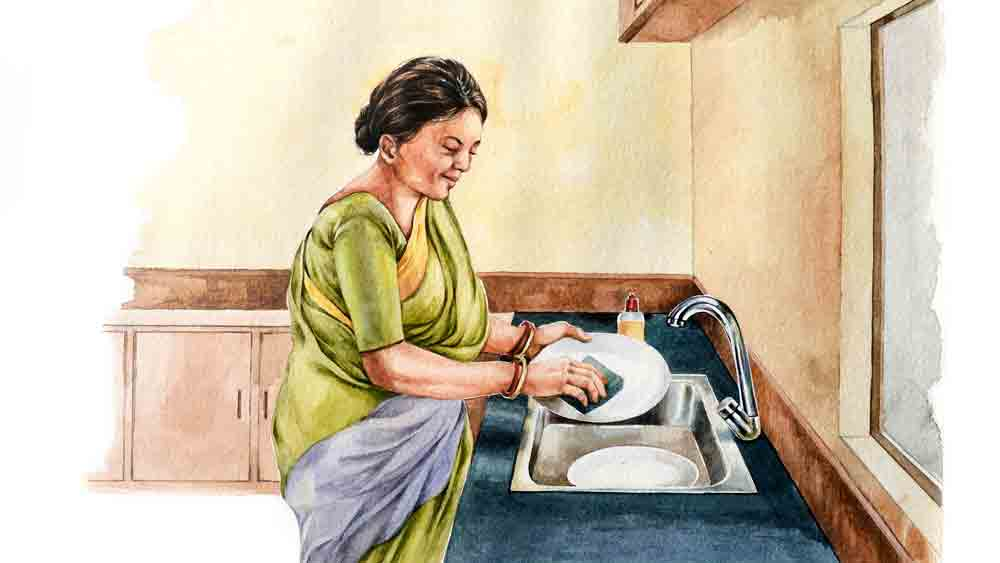

 

<h1 align=center>short story: কাজের মাসি</h1>
<h2 align=center>নন্দিনী নাগ</h2>
   বাসনপত্রের ঝনঝনানিতে ঘুমটা চটকে গেল ঋষির। এখনও ছোপ ছোপ অন্ধকার লেগে আছে ঘরের নানা জায়গায়, পাশের ঘুমন্তজনের চেহারা এখনও অস্পষ্ট, এরই মধ্যে ঘুম ভেঙে যাওয়ায় ভীষণ রাগ হয়ে গেল ওর।   পাশে রাখা মোবাইলটায় দেখল মাত্র পৌনে ছ’টা, মানে ঘুমের কোটা পূরণ হতে এখনও পৌনে দু’ঘণ্টা বাকি, এই মোক্ষম সময়ে কোন আহাম্মক শব্দ করে ঘুম ভাঙাল! এখন আবার গরম মাথাটাকে ঠান্ডা করে ভাঙা ঘুম জোড়া দিতে দিতেই সারা দিনের মতো বিছানাকে টা-টা বলার সময় হয়ে যাবে। ঘুমের ঘাটতি থেকে যাওয়ায় সারাটা দিন মাথা ভার হয়ে থাকবে, মেজাজও থাকবে খিটখিটে।   এ দিক থেকে গরমকাল বেশ ভাল, পাখার আওয়াজে বাইরের শব্দ চাপা পড়ে যায়। তাই ঋষি গায়ে কম্বল চাপা দিয়েও যত দিন পারে, রাতে পাখা চালিয়ে ঘুমোয়, এতে ঘুমটাও দারুণ হয়। কিন্তু এই ডিসেম্বরের হাড়কাঁপানো ঠান্ডায় সে পথও বন্ধ। একই বিছানার অন্যতম দাবিদার তৃষার তাতে ঘোরতর আপত্তি। কারণ এখন পাখা চালালে নিধির ঠান্ডা লেগে যাবে। ও ঘুমের মধ্যে গায়ের কম্বল সরিয়ে ফেলে। মেয়ের অসুখের দোহাই দেওয়ার পর আর কিছু বলার থাকে না, তাই বাধ্য হয়ে বশ্যতা স্বীকার করতে হয়েছে ঋষিকে।   ছোট ফ্ল্যাটে ঋষিদের বেডরুম লাগোয়া রান্নাঘর, কাজেই সকালে রান্নাঘরে এমন হুড়যুদ্ধ চললে ঘুম তো ভাঙবেই! কিন্তু তাণ্ডবটা চালাচ্ছে কে? আবছা আলোয় দেখেছে ঋষি তৃষা পাশে শুয়ে অকাতরে ঘুমোচ্ছে, অ্যালার্ম না বাজা অবধি উঠবে না। এ সব শব্দে ঘুম ভাঙে না ওর, যেন কুম্ভকর্ণের বংশধর!   বিছানা ছেড়ে উঠল ঋষি, ঘুম ভেঙে যাওয়ায় বাথরুমে যাওয়ার প্রয়োজন বোধ করছে, সেই সঙ্গে রান্নাঘরেও এক বার উঁকি দিয়ে আসবে। হয়তো কাজের মাসিকে দরজা খুলে দিয়ে এসে তৃষা আবার ঘুমিয়ে পড়েছে। শীতকালে এত সকালে কাজের মাসির দৌরাত্ম্য সহ্য করা যাবে না, সেটা তৃষাকে পরিষ্কার জানিয়ে দিতে হবে।   রান্নাঘরে উঁকি দিয়ে  চমকে গেল ঋষি, বলে উঠল, “মা! তুমি এই ভোরে বাসন মাজছ?”   “ভোর কোথায়! ছ’টা তো বাজে। আমার সেই কখন ঘুম ভেঙে গেছে!”   “তাই বলে এই ঠান্ডায় তুমি জল ঘাঁটবে! তৃষা! তৃষা!”   ঋষির চিৎকারে ঘুম ভেঙে গেল তৃষার, কিছু দুর্ঘটনা হয়েছে মনে করে ছুটে এল ও রান্নাঘরে।   “এই ঠান্ডায় আমরা লেপের তলায় আর মা বাসন মাজছে কেন!”   ঘুমচোখে রান্নাঘরে ঢুকে সিঙ্ক-ভর্তি এঁটো বাসনের সামনে শাশুড়িকে কাজের মাসির ভূমিকায় দেখে নিজেই কিছু বুঝতে পারেনি তৃষা, তা ঋষিকে কী জবাবদিহি করবে!   ঋষির দিকে তাকিয়ে কাঁধ ঝাঁকাল তৃষা, তার পর শাশুড়িকে জিজ্ঞেস করল, “আপনি কেন বাসন মাজছেন মা? বেলাদি আসবে না? আমাকে বলতে পারতেন, আমি কাল রাতেই মেজে রাখতাম।”   অসীমাদেবী অপ্রস্তুত। সকাল সকাল এমন একটা ব্যাপার হবে বুঝতে পারেননি। ভেবেছিলেন চুপচাপ কয়েকটা বাসন মেজে স্নান সেরে নেবেন। কিন্তু ঝামেলা বাধাল এই স্টিলের সিঙ্কটা। আগে পাথরের সিঙ্ক ছিল, বাসন মাজতে গেলে শব্দ হত না, ওটা ফুটো হয়ে যাওয়ায় ছেলে এই স্টিলেরটা সদ্য লাগিয়েছে। স্টিলের সিঙ্কে স্টিলের বাসন মাজতে গেলে আওয়াজ হয়েই যায়, সে যত সাবধানেই করা হোক না কেন!   কিন্তু এখন তো একটা কিছু বলতে হবে, বাসন মাজার একটা জুৎসই কারণ তো দেখাতে হবে, ছেলে-বৌ উত্তরের অপেক্ষায় মুখের দিকে তাকিয়ে দাঁড়িয়ে আছে।   “না, না, বেলা আসবে তো। আমি রান্নাঘরে এসেছিলাম, তাই বাসনগুলো বেশি করে জল দিয়ে ভিজিয়ে রাখলাম, মাজতে সুবিধে হয়।”   “কল খুলে দিলেই তো বাসন ভিজে যায়। তা হলে তুমি হাতে ওটা নিয়ে কী করছিলে?”   ঋষি বাসনমাজার স্ক্রাবপ্যাডটা দেখিয়ে বলল।   “আরে দেখলাম ছোট ছোট চামচগুলোও এঁটোতে নামানো, তাই ধুয়ে রাখছিলাম। বেলাকে এগুলো মাজতে দিলে হারিয়ে ফেলবে।”   “হারালে হারাবে! তাই বলে তুমি  সাতসকালে বাসন মাজতে শুরু করবে! তোমার জন্য কি একটু শান্তিতে ঘুমোতেও পারব না! যাও এ সব রেখে ঘরে যাও।”  রাগে গজগজ করতে করতে ঋষি বাথরুমে 
গেল হালকা হতে। ছেলেকে রেগে যেতে দেখে অসীমাদেবীও হাত ধুয়ে নিজের ঘরে চলে গেলেন।      সন্ধেবেলা অফিস থেকে বাড়ি ফিরতেই নিধি চুপিচুপি খবর দিল তৃষাকে, “মা! ঠাম্মা আজ দুপুরেও বাসন মাজছিল।”   নিধির আজ স্কুল ছুটি ছিল, তাই বাড়িতেই ছিল ও। কয়েকদিন আগে ঠাম্মার বাসনমাজা নিয়ে বাবা মায়ের মধ্যে কথাবার্তা ওর কানেও গেছিল, তাই আজ দুপুরে ওর এই গোপন তথ্য আবিষ্কারের কথা তাড়াতাড়ি মাকে জানিয়ে দিল নিধি।   কথাটা শুনে ভুরুজোড়া কুঁচকে গেল তৃষার, বেলামাসি বড্ড কামাই করছে আজকাল। সত্যতা যাচাই করার জন্য জিজ্ঞেস করল, “বেলাদি ওবেলায় আসেনি মা?”   অসীমাদেবী পুজো করছিলেন, গলা তুলে বললেন,”হ্যাঁ, এসেছিল। কেন বলো তো?”   “আপনি তা হলে দুপুরে বাসন মেজেছেন কেন? নিধি বলছে।”   “ও এই কথা! বাসন মাজব কেন, খালি আমার আর দিদিভাইয়ের খাওয়া থালাদুটো ধুয়ে রেখেছি। কাচের প্লেট তো, বাসনের গাদায় নামাইনি। বেলা যা হুটোপাটি করে, যদি ভেঙেটেঙে ফেলে!”   তৃষা আর কথা বাড়াল না, হাত পা ধুয়ে রান্নাঘরে ঢুকে পড়ল। এখন ওর অনেক কাজ।      পরদিন ভোরবেলা তক্কে তক্কে ছিল তৃষা, রান্নাঘরে খুটখাট শব্দ শুরু হতেই বিছানা ছেড়ে নেমে পা টিপে টিপে গিয়ে দাঁড়াল রান্নাঘরের দরজায়। দরজার দিকে পিছন ফিরে বেসিনে দাঁড়িয়ে একমনে বাসন মাজছিলেন অসীমাদেবী, তৃষার উপস্থিতি টের পাননি। তৃষাও কোনও রকম সাড়াশব্দ না করে চুপচাপ দাঁড়িয়ে দেখতে লাগল বুড়ির কাণ্ড।   একটা কড়াই আর একটা গামলাকে আপাতত ছুটি দিয়ে চুপচাপ রান্নাঘর ছেড়ে বেরিয়ে আসছিলেন অসীমাদেবী। এখন খুব সাবধানে কাজ করেন তিনি, যাতে বাসনের শব্দটব্দ না হয়। এমনকি হাতের বালাটা পর্যন্ত খুলে রেখে আসেন ঘরে, যাতে ঠোকাঠুকি লেগে আওয়াজ না হয়। কিন্তু তাতেও শেষরক্ষা হল না।   ধোয়া বাসনগুলোকে ঝুড়িতে তুলে পেছন ফিরে তৃষাকে দেখে চমকে উঠলেন অসীমাদেবী, ওঁর মুখের অপরাধীর ভাবটা চোখ এড়াল না তৃষার, সে খর গলায় বলল, “ওই দুটোকে আবার রেখে দিলেন কেন? মেজে রাখুন।”   “না...মানে...”  ধরা পড়ে গিয়ে আর কথা খুঁজে পান না অসীমাদেবী।   “মানে আর কী? এই সব বাসনকোসনও কি ভেঙে ফেলত বেলামাসি যে, আপনি সাতসকালে উঠে মেজে রাখলেন?”   অসীমাদেবী আমতা আমতা করে বলেন, “না, আসলে কাল বেলা বলছিল ওর আজ তাড়া আছে ব্যাঙ্কে যাবে, তাই...”   তত ক্ষণে ঘুম ভেঙে উঠে এসেছে ঋষি। তৃষা চাইছিল ঋষি নিজের চোখে দেখুক মায়ের এই পাগলামি, তাই ইচ্ছে করেই কথাবার্তা বেশ জোরে বলছিল।   “কী হল তোমাদের? সাতসকালে চেঁচামেচি কেন?”   “পয়সা দিয়ে কাজের লোক রেখে লাভ কী বলো, যদি মা-ই রোজ বাসন মাজেন! লোকে তো বুঝবে না উনি এগুলো শখ করে করেন, ভাববে আমি ওঁকে দিয়ে ঝি-গিরি করাই!”   রাগী গলায় বলল তৃষা।   তৃষার রাগ অসঙ্গত নয়, অগত্যা ব্যাপারটা সামলাতে ঋষিকে আসরে নামতে হল।   মাকে সোফায় বসিয়ে পাশে বসল ঋষি। তার পর নরম গলায় জিজ্ঞেস করল, “তুমি কেন এ সব করছ বলো তো?”   “সারা দিন হাত-পা গুটিয়ে বসে শুয়ে থাকা যায় নাকি? সংসারের দুটো একটা কাজ করলে কী ক্ষতি হয়েছে?” কোণঠাসা হয়ে আত্মপক্ষ সমর্থনের শেষ চেষ্টা করেন অসীমাদেবী।   “এটা কি সংসারের কাজ মা? এই কাজের জন্য তো পয়সা দিয়ে কাজের মাসি রাখা হয়েছে। আপনি অন্য কিছু করুন না! হাত গুটিয়ে বসে থাকতে কে বলেছে!”  তৃষা ঝাঁঝিয়ে উঠল।   “শোনো মা! এই বয়সে তুমি নাতনিকে নিয়ে থাকবে, বই পড়বে, টিভি দেখবে, পুজো-আচ্চা করবে। এ সব বাসনমাজা, কাপড়কাচা কি এখন তোমার কাজ! ইচ্ছে করলে একটা দুটো পদ রান্না করতে পারো, কত দিন তোমার হাতের রান্না খাই না!”   ঋষির আদিখ্যেতা দেখে মুখ বেঁকিয়ে তৃষা রান্নাঘরে ঢুকল চায়ের জল বসাতে। মনে মনে বলল, “রান্না করবে! তা হলে যে আমার উপকার হয়ে যাবে!”   “আমি এক জায়গায় পড়েছিলাম, বাসন মাজলে নাকি ডিপ্রেশন কমে। ওই বাসন মাজার সাবানের যে গন্ধটা, সেটা নাকি অ্যান্টিডিপ্রেস্যান্ট। সত্যি মিথ্যে জানি না,” রাঘব বলল।   রাঘব, ঋষির সহকর্মী হলেও বেশ সখ্য ওর সঙ্গে। যে কোনও বিষয়ে মন খুলে কথা বলা যায়। মায়ের এই বাসন মাজার নেশা নিয়ে নাজেহাল হয়ে আছে ঋষি। রোজ বাড়িতে ফিরেই তৃষার নানাবিধ অভিযোগ। দোষের মধ্যে সে দিন ঋষি বলেছিল, “ছেড়ে দাও না! যে যা নিয়ে থাকতে চায় থাক, তোমার তাতে কী অসুবিধে!”   অমনি ফোঁস করে উঠেছিল তৃষা, “অসুবিধে আছে বলেই তো বলছি! আমার কাজের লোকটাকে তো নষ্ট করে দিলেন তোমার মা। বেলামাসি এখন বিকেলে আসা বন্ধ করে দিয়েছে, বলেছে ‘বাসন তো মাসিমাই মেজে রাখে, আমি কষ্ট করে আবার আসব কেন!’ এ বার বুড়ি অসুস্থ হলে আমাকেই তো সব করতে হবে। তা ছাড়া দিন নেই রাত নেই জানলার ধারে দাঁড়িয়ে উনি বাসন মাজেন, পাশের ফ্ল্যাটের লোকেরা দেখে কী ভাবে বলো তো! বৌটা বুড়ি শাশুড়িকে দিয়ে ঝি-গিরি করায়।”   তৃষার কথায় যুক্তি আছে, এ দিকে বার বার বলা সত্ত্বেও মা কথা শুনছে না। এখন রাঘবের কথা শুনে যেন দিশা দেখতে পেল ঋষি।   “তা হলে কি মাকে সাইকায়াট্রিস্ট দেখাব? কিন্তু মার আবার এই বয়সে এসে ডিপ্রেশন হবে কেন বলো তো?”   “ডিপ্রেশনের আবার বয়স কী? হলেই হল। আমার তো মনে হয় এক বার ডাক্তার দেখিয়ে নেওয়াই ভাল। মানুষের মন বড্ড জটিল, কোথা থেকে কী হয়ে যায় বোঝা মুশকিল।”   রাঘবের এই শেষ কথায় যে ইঙ্গিতটা ছিল, সেটা বুঝে একটু ভয়ই পেল ঋষি। মনে মনে ঠিক করে নিল, এই সপ্তাহের মধ্যেই ভাল এক জন সাইকায়াট্রিস্টের কাছে নিয়ে যাবে মাকে। কিন্তু ‘নিয়ে যাব’ বললেই তো আর যাওয়া যাবে না! এ তো ছোট বাচ্চা নয় যে, ভুলিয়েভালিয়ে নিয়ে যাবে কিংবা বদ্ধ উন্মাদও নয় যে জোর করে নিয়ে যাবে! অতএব এই ব্যাপারটা কী করে সম্ভব করা যায়, সেটা নিয়ে তৃষার সঙ্গে আলোচনা করতে হবে। ঋষির আশা, তৃষা ঠিকই একটা উপায় বের করতে পারবে।   “ঠাম্মা! ও ঠাম্মা!”   নিধির আলতো ঠেলায় চটকাটা ভেঙে গেল অসীমাদেবীর। দুপুরে খাওয়াদাওয়ার পর একটু গড়াগড়ি দেওয়ার অভ্যেস, কোনও কোনও দিন আবার চোখটাও লেগে যায়, যেমন আজ গেছিল।   নাতনির এখন পরীক্ষা শেষ হয়ে স্কুলে ছুটি চলছে, নয়তো এই সময়টা তিনি একাই থাকেন বাড়িতে। একটু ঘুম এলে সময়টাও ভাল কাটে।   তবে ছুটি থাকলেও নিধিকে দুপুরে শোওয়ানো যায় না, সারা ক্ষণ নিজের মনে খেলছে নয়তো টিভি চালিয়ে কার্টুন দেখছে। আজ নিধি কখন এসে যে পাশে শুয়েছিল, বুঝতে পারেননি অসীমাদেবী।   “কী বলছিস?” নাতনির ডাকে ওর দিকে পাশ ফিরে শুলেন অসীমাদেবী।   “ঠাম্মা, তোমার মন খারাপ?”   “না তো সোনা। আমার মন কেন খারাপ হবে?”   “তা হলে বাবা যে বলছিল, তোমার ডিপ্রেশন হয়েছে, ডাক্তারের কাছে নিয়ে যাবে?”   “তাই না কি? আমি তো কিছু জানি না সোনা! বাবা আর কী বলেছে?” অসীমাদেবী অবাক।   নাতনির কথা শুনে ঘুমের রেশ কেটে গেল অসীমাদেবীর। তিনি জানেন, বাচ্চারা সত্যি কথাই বলে। ‘ডিপ্রেশন’ কথাটার মানে ঠিক বুঝতে না পারলেও ছেলে-বৌ তাঁকে ডাক্তারের কাছে নিয়ে যেতে চায় জেনে চিন্তায় পড়ে গেলেন তিনি।   নিধি বলে চলে, “বাবা মাকে বলছিল, বাসন মাজাটা তোমার মনের অসুখ, তাই তোমাকে ডাক্তারের কাছে নিয়ে যেতে হবে। আচ্ছা ঠাম্মা, তোমার বাসন মাজতে কি খুব ভাল লাগে? তা হলে তুমি বাবাকে বলে দাও যে  তোমার অসুখ  হয়নি, আমার যেমন কার্টুন দেখতে ভাল লাগে, তোমারও তেমন বাসন মাজতে ভাল লাগে। তা হলে আর ডাক্তারের কাছে নিয়ে যাবে না।”   চুপ করে থাকেন অসীমাদেবী। কী বলবেন তিনি নাতনিকে বুঝতে পারেন না।   ছেলে বৌমা নাতনি সবাই নিজেদের নিয়ে নিজেদের কাজে ব্যস্ত থাকে সারা দিন, তাঁর সঙ্গে বসে কথা বলা, গল্প করার সময় ওদের কারও নেই। বাড়িতে লোকজন বলতে রোজ আসে শুধু বেলা, তাও সে পাঁচ বাড়ি কাজ করে, তার দাঁড়িয়ে দুটো কথা বলার ইচ্ছে থাকলেও উপায় নেই। তাই তিনি বাসনকোসনগুলো মেজে বেলার কাজ কমিয়ে রাখেন, যাতে মেয়েটা কিছুটা সময় বসে তাঁর সঙ্গে একটু গল্প করতে পারে, সুখদুঃখের দুটো কথা শুনতে পারে। বেলার সঙ্গে গল্প করেন বলেই তো পাড়ার লোকেদের খবরাখবর পান অসীমাদেবী, না হলে পাশাপাশি এই ফ্ল্যাটগুলোতে কেউ তো আর কারও সঙ্গে দু’দণ্ড গল্পগাছা করে না। দুটো বাসন মেজে রাখলে যদি একটা কথা বলার সঙ্গী জোটে, ক্ষতি কী!      ছবি: সুমন পাল   ব   াসনপত্রের ঝনঝনানিতে ঘুমটা চটকে গেল ঋষির। এখনও ছোপ ছোপ অন্ধকার লেগে আছে ঘরের নানা জায়গায়, পাশের ঘুমন্তজনের চেহারা এখনও অস্পষ্ট, এরই মধ্যে ঘুম ভেঙে যাওয়ায় ভীষণ রাগ হয়ে গেল ওর।   পাশে রাখা মোবাইলটায় দেখল মাত্র পৌনে ছ’টা, মানে ঘুমের কোটা পূরণ হতে এখনও পৌনে দু’ঘণ্টা বাকি, এই মোক্ষম সময়ে কোন আহাম্মক শব্দ করে ঘুম ভাঙাল! এখন আবার গরম মাথাটাকে ঠান্ডা করে ভাঙা ঘুম জোড়া দিতে দিতেই সারা দিনের মতো বিছানাকে টা-টা বলার সময় হয়ে যাবে। ঘুমের ঘাটতি থেকে যাওয়ায় সারাটা দিন মাথা ভার হয়ে থাকবে, মেজাজও থাকবে খিটখিটে।   এ দিক থেকে গরমকাল বেশ ভাল, পাখার আওয়াজে বাইরের শব্দ চাপা পড়ে যায়। তাই ঋষি গায়ে কম্বল চাপা দিয়েও যত দিন পারে, রাতে পাখা চালিয়ে ঘুমোয়, এতে ঘুমটাও দারুণ হয়। কিন্তু এই ডিসেম্বরের হাড়কাঁপানো ঠান্ডায় সে পথও বন্ধ। একই বিছানার অন্যতম দাবিদার তৃষার তাতে ঘোরতর আপত্তি। কারণ এখন পাখা চালালে নিধির ঠান্ডা লেগে যাবে। ও ঘুমের মধ্যে গায়ের কম্বল সরিয়ে ফেলে। মেয়ের অসুখের দোহাই দেওয়ার পর আর কিছু বলার থাকে না, তাই বাধ্য হয়ে বশ্যতা স্বীকার করতে হয়েছে ঋষিকে।   ছোট ফ্ল্যাটে ঋষিদের বেডরুম লাগোয়া রান্নাঘর, কাজেই সকালে রান্নাঘরে এমন হুড়যুদ্ধ চললে ঘুম তো ভাঙবেই! কিন্তু তাণ্ডবটা চালাচ্ছে কে? আবছা আলোয় দেখেছে ঋষি তৃষা পাশে শুয়ে অকাতরে ঘুমোচ্ছে, অ্যালার্ম না বাজা অবধি উঠবে না। এ সব শব্দে ঘুম ভাঙে না ওর, যেন কুম্ভকর্ণের বংশধর!   বিছানা ছেড়ে উঠল ঋষি, ঘুম ভেঙে যাওয়ায় বাথরুমে যাওয়ার প্রয়োজন বোধ করছে, সেই সঙ্গে রান্নাঘরেও এক বার উঁকি দিয়ে আসবে। হয়তো কাজের মাসিকে দরজা খুলে দিয়ে এসে তৃষা আবার ঘুমিয়ে পড়েছে। শীতকালে এত সকালে কাজের মাসির দৌরাত্ম্য সহ্য করা যাবে না, সেটা তৃষাকে পরিষ্কার জানিয়ে দিতে হবে।   রান্নাঘরে উঁকি দিয়ে  চমকে গেল ঋষি, বলে উঠল, “মা! তুমি এই ভোরে বাসন মাজছ?”   “ভোর কোথায়! ছ’টা তো বাজে। আমার সেই কখন ঘুম ভেঙে গেছে!”   “তাই বলে এই ঠান্ডায় তুমি জল ঘাঁটবে! তৃষা! তৃষা!”   ঋষির চিৎকারে ঘুম ভেঙে গেল তৃষার, কিছু দুর্ঘটনা হয়েছে মনে করে ছুটে এল ও রান্নাঘরে।   “এই ঠান্ডায় আমরা লেপের তলায় আর মা বাসন মাজছে কেন!”   ঘুমচোখে রান্নাঘরে ঢুকে সিঙ্ক-ভর্তি এঁটো বাসনের সামনে শাশুড়িকে কাজের মাসির ভূমিকায় দেখে নিজেই কিছু বুঝতে পারেনি তৃষা, তা ঋষিকে কী জবাবদিহি করবে!   ঋষির দিকে তাকিয়ে কাঁধ ঝাঁকাল তৃষা, তার পর শাশুড়িকে জিজ্ঞেস করল, “আপনি কেন বাসন মাজছেন মা? বেলাদি আসবে না? আমাকে বলতে পারতেন, আমি কাল রাতেই মেজে রাখতাম।”   অসীমাদেবী অপ্রস্তুত। সকাল সকাল এমন একটা ব্যাপার হবে বুঝতে পারেননি। ভেবেছিলেন চুপচাপ কয়েকটা বাসন মেজে স্নান সেরে নেবেন। কিন্তু ঝামেলা বাধাল এই স্টিলের সিঙ্কটা। আগে পাথরের সিঙ্ক ছিল, বাসন মাজতে গেলে শব্দ হত না, ওটা ফুটো হয়ে যাওয়ায় ছেলে এই স্টিলেরটা সদ্য লাগিয়েছে। স্টিলের সিঙ্কে স্টিলের বাসন মাজতে গেলে আওয়াজ হয়েই যায়, সে যত সাবধানেই করা হোক না কেন!   কিন্তু এখন তো একটা কিছু বলতে হবে, বাসন মাজার একটা জুৎসই কারণ তো দেখাতে হবে, ছেলে-বৌ উত্তরের অপেক্ষায় মুখের দিকে তাকিয়ে দাঁড়িয়ে আছে।   “না, না, বেলা আসবে তো। আমি রান্নাঘরে এসেছিলাম, তাই বাসনগুলো বেশি করে জল দিয়ে ভিজিয়ে রাখলাম, মাজতে সুবিধে হয়।”   “কল খুলে দিলেই তো বাসন ভিজে যায়। তা হলে তুমি হাতে ওটা নিয়ে কী করছিলে?”   ঋষি বাসনমাজার স্ক্রাবপ্যাডটা দেখিয়ে বলল।   “আরে দেখলাম ছোট ছোট চামচগুলোও এঁটোতে নামানো, তাই ধুয়ে রাখছিলাম। বেলাকে এগুলো মাজতে দিলে হারিয়ে ফেলবে।”   “হারালে হারাবে! তাই বলে তুমি  সাতসকালে বাসন মাজতে শুরু করবে! তোমার জন্য কি একটু শান্তিতে ঘুমোতেও পারব না! যাও এ সব রেখে ঘরে যাও।”  রাগে গজগজ করতে করতে ঋষি বাথরুমে 
গেল হালকা হতে। ছেলেকে রেগে যেতে দেখে অসীমাদেবীও হাত ধুয়ে নিজের ঘরে চলে গেলেন।   সন্ধেবেলা অফিস থেকে বাড়ি ফিরতেই নিধি চুপিচুপি খবর দিল তৃষাকে, “মা! ঠাম্মা আজ দুপুরেও বাসন মাজছিল।”   নিধির আজ স্কুল ছুটি ছিল, তাই বাড়িতেই ছিল ও। কয়েকদিন আগে ঠাম্মার বাসনমাজা নিয়ে বাবা মায়ের মধ্যে কথাবার্তা ওর কানেও গেছিল, তাই আজ দুপুরে ওর এই গোপন তথ্য আবিষ্কারের কথা তাড়াতাড়ি মাকে জানিয়ে দিল নিধি।   কথাটা শুনে ভুরুজোড়া কুঁচকে গেল তৃষার, বেলামাসি বড্ড কামাই করছে আজকাল। সত্যতা যাচাই করার জন্য জিজ্ঞেস করল, “বেলাদি ওবেলায় আসেনি মা?”   অসীমাদেবী পুজো করছিলেন, গলা তুলে বললেন,”হ্যাঁ, এসেছিল। কেন বলো তো?”   “আপনি তা হলে দুপুরে বাসন মেজেছেন কেন? নিধি বলছে।”   “ও এই কথা! বাসন মাজব কেন, খালি আমার আর দিদিভাইয়ের খাওয়া থালাদুটো ধুয়ে রেখেছি। কাচের প্লেট তো, বাসনের গাদায় নামাইনি। বেলা যা হুটোপাটি করে, যদি ভেঙেটেঙে ফেলে!”   তৃষা আর কথা বাড়াল না, হাত পা ধুয়ে রান্নাঘরে ঢুকে পড়ল। এখন ওর অনেক কাজ।   পরদিন ভোরবেলা তক্কে তক্কে ছিল তৃষা, রান্নাঘরে খুটখাট শব্দ শুরু হতেই বিছানা ছেড়ে নেমে পা টিপে টিপে গিয়ে দাঁড়াল রান্নাঘরের দরজায়। দরজার দিকে পিছন ফিরে বেসিনে দাঁড়িয়ে একমনে বাসন মাজছিলেন অসীমাদেবী, তৃষার উপস্থিতি টের পাননি। তৃষাও কোনও রকম সাড়াশব্দ না করে চুপচাপ দাঁড়িয়ে দেখতে লাগল বুড়ির কাণ্ড।   একটা কড়াই আর একটা গামলাকে আপাতত ছুটি দিয়ে চুপচাপ রান্নাঘর ছেড়ে বেরিয়ে আসছিলেন অসীমাদেবী। এখন খুব সাবধানে কাজ করেন তিনি, যাতে বাসনের শব্দটব্দ না হয়। এমনকি হাতের বালাটা পর্যন্ত খুলে রেখে আসেন ঘরে, যাতে ঠোকাঠুকি লেগে আওয়াজ না হয়। কিন্তু তাতেও শেষরক্ষা হল না।   ধোয়া বাসনগুলোকে ঝুড়িতে তুলে পেছন ফিরে তৃষাকে দেখে চমকে উঠলেন অসীমাদেবী, ওঁর মুখের অপরাধীর ভাবটা চোখ এড়াল না তৃষার, সে খর গলায় বলল, “ওই দুটোকে আবার রেখে দিলেন কেন? মেজে রাখুন।”   “না...মানে...”  ধরা পড়ে গিয়ে আর কথা খুঁজে পান না অসীমাদেবী।   “মানে আর কী? এই সব বাসনকোসনও কি ভেঙে ফেলত বেলামাসি যে, আপনি সাতসকালে উঠে মেজে রাখলেন?”   অসীমাদেবী আমতা আমতা করে বলেন, “না, আসলে কাল বেলা বলছিল ওর আজ তাড়া আছে ব্যাঙ্কে যাবে, তাই...”   তত ক্ষণে ঘুম ভেঙে উঠে এসেছে ঋষি। তৃষা চাইছিল ঋষি নিজের চোখে দেখুক মায়ের এই পাগলামি, তাই ইচ্ছে করেই কথাবার্তা বেশ জোরে বলছিল।   “কী হল তোমাদের? সাতসকালে চেঁচামেচি কেন?”   “পয়সা দিয়ে কাজের লোক রেখে লাভ কী বলো, যদি মা-ই রোজ বাসন মাজেন! লোকে তো বুঝবে না উনি এগুলো শখ করে করেন, ভাববে আমি ওঁকে দিয়ে ঝি-গিরি করাই!”   রাগী গলায় বলল তৃষা।   তৃষার রাগ অসঙ্গত নয়, অগত্যা ব্যাপারটা সামলাতে ঋষিকে আসরে নামতে হল।   মাকে সোফায় বসিয়ে পাশে বসল ঋষি। তার পর নরম গলায় জিজ্ঞেস করল, “তুমি কেন এ সব করছ বলো তো?”   “সারা দিন হাত-পা গুটিয়ে বসে শুয়ে থাকা যায় নাকি? সংসারের দুটো একটা কাজ করলে কী ক্ষতি হয়েছে?” কোণঠাসা হয়ে আত্মপক্ষ সমর্থনের শেষ চেষ্টা করেন অসীমাদেবী।   “এটা কি সংসারের কাজ মা? এই কাজের জন্য তো পয়সা দিয়ে কাজের মাসি রাখা হয়েছে। আপনি অন্য কিছু করুন না! হাত গুটিয়ে বসে থাকতে কে বলেছে!”  তৃষা ঝাঁঝিয়ে উঠল।   “শোনো মা! এই বয়সে তুমি নাতনিকে নিয়ে থাকবে, বই পড়বে, টিভি দেখবে, পুজো-আচ্চা করবে। এ সব বাসনমাজা, কাপড়কাচা কি এখন তোমার কাজ! ইচ্ছে করলে একটা দুটো পদ রান্না করতে পারো, কত দিন তোমার হাতের রান্না খাই না!”   ঋষির আদিখ্যেতা দেখে মুখ বেঁকিয়ে তৃষা রান্নাঘরে ঢুকল চায়ের জল বসাতে। মনে মনে বলল, “রান্না করবে! তা হলে যে আমার উপকার হয়ে যাবে!”      “আমি এক জায়গায় পড়েছিলাম, বাসন মাজলে নাকি ডিপ্রেশন কমে। ওই বাসন মাজার সাবানের যে গন্ধটা, সেটা নাকি অ্যান্টিডিপ্রেস্যান্ট। সত্যি মিথ্যে জানি না,” রাঘব বলল।   রাঘব, ঋষির সহকর্মী হলেও বেশ সখ্য ওর সঙ্গে। যে কোনও বিষয়ে মন খুলে কথা বলা যায়। মায়ের এই বাসন মাজার নেশা নিয়ে নাজেহাল হয়ে আছে ঋষি। রোজ বাড়িতে ফিরেই তৃষার নানাবিধ অভিযোগ। দোষের মধ্যে সে দিন ঋষি বলেছিল, “ছেড়ে দাও না! যে যা নিয়ে থাকতে চায় থাক, তোমার তাতে কী অসুবিধে!”   অমনি ফোঁস করে উঠেছিল তৃষা, “অসুবিধে আছে বলেই তো বলছি! আমার কাজের লোকটাকে তো নষ্ট করে দিলেন তোমার মা। বেলামাসি এখন বিকেলে আসা বন্ধ করে দিয়েছে, বলেছে ‘বাসন তো মাসিমাই মেজে রাখে, আমি কষ্ট করে আবার আসব কেন!’ এ বার বুড়ি অসুস্থ হলে আমাকেই তো সব করতে হবে। তা ছাড়া দিন নেই রাত নেই জানলার ধারে দাঁড়িয়ে উনি বাসন মাজেন, পাশের ফ্ল্যাটের লোকেরা দেখে কী ভাবে বলো তো! বৌটা বুড়ি শাশুড়িকে দিয়ে ঝি-গিরি করায়।”   তৃষার কথায় যুক্তি আছে, এ দিকে বার বার বলা সত্ত্বেও মা কথা শুনছে না। এখন রাঘবের কথা শুনে যেন দিশা দেখতে পেল ঋষি।   “তা হলে কি মাকে সাইকায়াট্রিস্ট দেখাব? কিন্তু মার আবার এই বয়সে এসে ডিপ্রেশন হবে কেন বলো তো?”   “ডিপ্রেশনের আবার বয়স কী? হলেই হল। আমার তো মনে হয় এক বার ডাক্তার দেখিয়ে নেওয়াই ভাল। মানুষের মন বড্ড জটিল, কোথা থেকে কী হয়ে যায় বোঝা মুশকিল।”   রাঘবের এই শেষ কথায় যে ইঙ্গিতটা ছিল, সেটা বুঝে একটু ভয়ই পেল ঋষি। মনে মনে ঠিক করে নিল, এই সপ্তাহের মধ্যেই ভাল এক জন সাইকায়াট্রিস্টের কাছে নিয়ে যাবে মাকে। কিন্তু ‘নিয়ে যাব’ বললেই তো আর যাওয়া যাবে না! এ তো ছোট বাচ্চা নয় যে, ভুলিয়েভালিয়ে নিয়ে যাবে কিংবা বদ্ধ উন্মাদও নয় যে জোর করে নিয়ে যাবে! অতএব এই ব্যাপারটা কী করে সম্ভব করা যায়, সেটা নিয়ে তৃষার সঙ্গে আলোচনা করতে হবে। ঋষির আশা, তৃষা ঠিকই একটা উপায় বের করতে পারবে।   “ঠাম্মা! ও ঠাম্মা!”   নিধির আলতো ঠেলায় চটকাটা ভেঙে গেল অসীমাদেবীর। দুপুরে খাওয়াদাওয়ার পর একটু গড়াগড়ি দেওয়ার অভ্যেস, কোনও কোনও দিন আবার চোখটাও লেগে যায়, যেমন আজ গেছিল।   নাতনির এখন পরীক্ষা শেষ হয়ে স্কুলে ছুটি চলছে, নয়তো এই সময়টা তিনি একাই থাকেন বাড়িতে। একটু ঘুম এলে সময়টাও ভাল কাটে।   তবে ছুটি থাকলেও নিধিকে দুপুরে শোওয়ানো যায় না, সারা ক্ষণ নিজের মনে খেলছে নয়তো টিভি চালিয়ে কার্টুন দেখছে। আজ নিধি কখন এসে যে পাশে শুয়েছিল, বুঝতে পারেননি অসীমাদেবী।   “কী বলছিস?” নাতনির ডাকে ওর দিকে পাশ ফিরে শুলেন অসীমাদেবী।   “ঠাম্মা, তোমার মন খারাপ?”   “না তো সোনা। আমার মন কেন খারাপ হবে?”   “তা হলে বাবা যে বলছিল, তোমার ডিপ্রেশন হয়েছে, ডাক্তারের কাছে নিয়ে যাবে?”   “তাই না কি? আমি তো কিছু জানি না সোনা! বাবা আর কী বলেছে?” অসীমাদেবী অবাক।   নাতনির কথা শুনে ঘুমের রেশ কেটে গেল অসীমাদেবীর। তিনি জানেন, বাচ্চারা সত্যি কথাই বলে। ‘ডিপ্রেশন’ কথাটার মানে ঠিক বুঝতে না পারলেও ছেলে-বৌ তাঁকে ডাক্তারের কাছে নিয়ে যেতে চায় জেনে চিন্তায় পড়ে গেলেন তিনি।   নিধি বলে চলে, “বাবা মাকে বলছিল, বাসন মাজাটা তোমার মনের অসুখ, তাই তোমাকে ডাক্তারের কাছে নিয়ে যেতে হবে। আচ্ছা ঠাম্মা, তোমার বাসন মাজতে কি খুব ভাল লাগে? তা হলে তুমি বাবাকে বলে দাও যে  তোমার অসুখ  হয়নি, আমার যেমন কার্টুন দেখতে ভাল লাগে, তোমারও তেমন বাসন মাজতে ভাল লাগে। তা হলে আর ডাক্তারের কাছে নিয়ে যাবে না।”   চুপ করে থাকেন অসীমাদেবী। কী বলবেন তিনি নাতনিকে বুঝতে পারেন না।   ছেলে বৌমা নাতনি সবাই নিজেদের নিয়ে নিজেদের কাজে ব্যস্ত থাকে সারা দিন, তাঁর সঙ্গে বসে কথা বলা, গল্প করার সময় ওদের কারও নেই। বাড়িতে লোকজন বলতে রোজ আসে শুধু বেলা, তাও সে পাঁচ বাড়ি কাজ করে, তার দাঁড়িয়ে দুটো কথা বলার ইচ্ছে থাকলেও উপায় নেই। তাই তিনি বাসনকোসনগুলো মেজে বেলার কাজ কমিয়ে রাখেন, যাতে মেয়েটা কিছুটা সময় বসে তাঁর সঙ্গে একটু গল্প করতে পারে, সুখদুঃখের দুটো কথা শুনতে পারে। বেলার সঙ্গে গল্প করেন বলেই তো পাড়ার লোকেদের খবরাখবর পান অসীমাদেবী, না হলে পাশাপাশি এই         