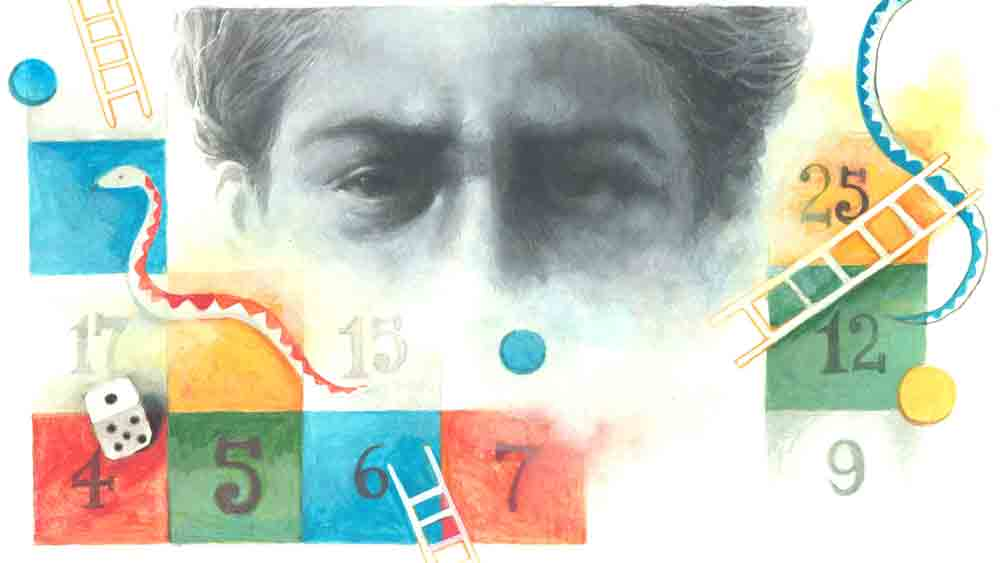

 

<h1 align=center>short story: ক্ষীরখোর</h1>
<h2 align=center>প্রসেনজিৎ সিংহ</h2>
বড়সাহেবের ঘর থেকে বেরনোর সময় অনুরাগ বুঝল, রাগটা ওর গোটা শরীরে ছড়িয়ে পড়ছে। ওর কানটা নড়ে উঠল। পর পর দু’বার। প্রথম বার বড়সাহেব মিস্টার ঘোষালের উল্টো দিকের চেয়ারে বসে থাকতে থাকতেই। পরের বার উনি ‘ইউ মে গো ন্যা-ও-ও’ বলার দেড় সেকেন্ড পর।   অনুরাগ কান নাড়াতে পারে। যেমন পারে গরু-বাছুর। হাতিও। তবে ওর ক্ষেত্রে হাতির চেয়ে গরুর উপমাটাই ঠিক। মানে, বলদ। ইন ফ্যাক্ট, সঙ্গে একটা ‘কলুর’ জুড়ে দিলে মোর অ্যাপ্রোপ্রিয়েট।   তবে বলদ যত সহজে কান দিয়ে মাছি তাড়ায়, কান নাড়িয়ে অনুরাগ তত সহজে রাগ তাড়াতে পারে না। আসলে রাগ হলে কেউ হাত-পা ছোড়ে, কেউ দাঁত কিড়মিড় করে, কেউ ঘন ঘন শ্বাস ফেলে। তেমনই অনুরাগ কান নাড়ায়। নাড়ায়, নাকি নড়ে ঠিক বলতে পারবে না। তবে ব্যাপারটা ঘটে।   রাগের কারণ আছে। সকালে ঘোষাল সাহেবের ঘরে ঢুকতেই উনি গোটাকতক সারমন ঝাড়লেন। তাতে সার তো নেই-ই, মন ভরানোরও প্রশ্ন নেই। কারণ, অনুরাগকে শুনতে হল, এই কোয়ার্টারে ওর কোলিগ রূপেন সরকার নাকি দারুণ কাজ করেছে। ফাটিয়ে দিয়েছে। ওর প্রোমোশন হচ্ছে। অথচ যে জন্য ওর এই লিফ্ট, সেই ডেল্টা প্রজেক্টের আইডিয়াটা যে কনসিভ করল, সেই অনুরাগের নামটা এক বার মুখেও আনলেন না আলফা সেন্টরি প্রাইভেট লিমিটেডের সিইও ঘনশ্যাম ঘোষাল।   খবরটা শুনেই মনে মনে অনুরাগ একটা পাঞ্চ ঝাড়ল রূপেনের মুখে। তবু মনের অপ্রসন্ন ভাবটা গেল না। সামনে বড়সাহেব। তাই ঠোঁট দুটো জোর করে ফাঁক করে রাখতে হল, যাতে দাঁতগুলো অন্তত দেখা যায়। সে সময় নিজেকে ওর তাইল্যান্ডের চিড়িয়াখানার ওরাংওটাং বলে মনে হচ্ছিল। ওরা দর্শকদের ঘাড়ে হাত রেখে ছবি তোলে। ফোটোগ্রাফার যখন বলে ‘সে চি-ই-ই-জ়’, তখন ওরা উপরের ঠোঁট উপরের দিকে আর নীচের ঠোঁট নীচের দিকে উল্টে দেয়। সমাড়িদন্তবিকাশের ফলে মনে হয় ওরা হাসছে। যেমন হাসছে অনুরাগ। ঘোষালও হাসছেন। দু’টোর অর্থ 
অবশ্য আলাদা।   তবে অনুরাগের অতগুলো দাঁত এক সঙ্গে দেখেননি বলেই বোধহয় ঘোষাল সাহেব ওর ভেতরের অখুশিটা পড়ে ফেললেন। সরাসরি চোখের দিকে তাকিয়ে অঙ্কুশটা 
গেঁথে দিলেন, “অ্যাকচুয়ালি প্রজেক্ট ওয়াজ ব্রিলিয়ান্ট।”   “কিন্তু স্যর ওটা তো ঠিক...”   “আই আন্ডারস্ট্যান্ড। তোমার ভাল না লাগারই কথা। কোলিগ যখন হঠাৎ পিড়িং করে টঙে উঠে পড়ে, বুকটায় একটু চিনচিন করে বইকি! বাট ইট’স আ রেস মাই ডিয়ার।”   “বাট স্যর, অরিজিনালি আই কনসিভড দ্য আইডিয়া। পুরো ভাবনাটাই...” মরিয়া হয়ে অনুরাগ আর আটকাতে পারে না নিজেকে। 
কিন্তু ওকে কথা শেষ করতে না দিয়েই ঘোষাল ফের বললেন, “দিস ইজ় ভেরি আনস্পোর্টিং, আই মাস্ট সে। আমাকে রূপ ঠিক এই কথাটাই বলেছিল। তুমি ওর ক্রেডিটটা নেবার চেষ্টা করবে। না, অনুরাগ দিস ইজ় আনফেয়ার। ইউ মে গো ন্যা-ও-ও।”   মাথাটা চড়াক করে গরম হয়ে গেল। যত্ত সব। রূপেন আবার আদর করে রূপ হয়েছে। হবে না-ই বা কেন? রূপেনটা হচ্ছে ইগো ম্যাসিওর। সারা দিন ঘোষালের অহং দলাইমলাই করে— “স্যর আপনি না, মানে এত ইয়ে যে কী বলব, এত যে ভাবাই যায় না।” শালা কামচোর! ক্ষীরখোর!   রূপেনের এই প্রোমোশনের আগেও এমন লেঙ্গি খেয়েছে অনুরাগ। সে বার অনুরাগ কয়েক কোটি টাকার গরমিল ধরে ফেলেছিল। ব্যাপারটা যে বেশ কৃতিত্বের সেটা না বোঝার মতো বুদ্ধু ও নয়। তখন রূপেনের সঙ্গে বন্ধুত্বটা একটু গাঢ় ছিল। বিশ্বাস করে বলেই ফেলেছিল ব্যাপারটা।   “বুঝলি গরমিল একটা আছেই। আমি ধরে ফেলেছি।”   “হতেই পারে না।”   “আমি নিশ্চিত।”   “কই কোথায়?”   বন্ধুর সাধারণ কৌতূহল ভেবে গরমিলের বিষয়টা পুরোপুরি খোলসা করেছিল অনুরাগ। আর রূপেন তার পূর্ণ সদ্ব্যবহার করেছিল। তখনকার মতো বলেছিল, “তুই আমাকে ডেটা শিটগুলো ফরোয়ার্ড কর তো। ভাল করে দেখি।”   “বেশ। দেখিস।”   অনুরাগ পরদিন অফিসে এসে দেখল, ওর আগেই রূপেন এসে গিয়েছে। সেটা বুঝতে পারল ওকে বড়সাহেবের ঘর থেকে বেরোতে দেখে। পরে বিষয়টা নিয়ে অফিস জুড়ে ফিসফাস, কানাঘুষো, অনেক কিছু। অফিসের মাঝখানে দাঁড়িয়ে ঘোষাল বললেন, “আয়্যাম প্রাউড অব মাই টিম। ওয়েল ডান বয়েজ়!”   বয়েজ়! খটকা লেগেছিল। গৌরবে বহুবচন হয়ে গেল! অনুরাগ ভাবল, যাকগে। একার কৃতিত্ব না-ই বা দাবি করল! ঘুণাক্ষরেও টের পায়নি তত ক্ষণে ক্ষীর খেয়ে বেরিয়ে গিয়েছে রূপেন। বোঝা উচিত ছিল ঘোষালের পাশে রূপেনের সগৌরব উপস্থিতি দেখে, কিন্তু ও তখন বেকুবের মতো উল্টো দিকে দর্শকদের দলে।   বুঝেছিল কিছু দিন পরে। ইয়ারলি পারফরম্যান্সের ভিত্তিতে যখন কোম্পানি রূপেনকে দিয়েছিল কলম্বোতে ভেকেশনের টিকিট। আর অনুরাগকে ধরিয়েছিল কাশ্মীরের। সাবধান হয়েছিল। কিন্তু সঙ্কোচের বশে প্রশ্ন করতে পারেনি রূপেনকে। আর কীই-বা জিজ্ঞেস করত? ‘তুই বসকে কী বলেছিলি? ওই গরমিলটা তুই ধরেছিস?’   জীবনই তো শেখায়। তার পর থেকে আর রূপেনকে বিশ্বাস করেনি অনুরাগ। বুঝেছিল ক্ষীরখোরদের জিভ ব্যাঙের চেয়েও লম্বা। ডাইনে-বাঁয়ে সেই চটচটে জিভ চালিয়ে যাবতীয় কৃতিত্ব আত্মসাৎ করতে পারে নিমেষে।   এখানে বছর পাঁচেক হল অনুরাগের। রূপেন ঢুকেছিল ওর বছরখানেক পরে। সে  দিক দিয়ে ও খানিকটা সিনিয়র। কিন্তু এ যুগে সিনিয়রিটি তুশ্চু। আসল খেলা অন্য জায়গায়। সে অন্য অঙ্ক।   ফিন্যান্সের তন্ময়দা সে দিন ক্যান্টিনে খেতে খেতে একটা ভাল কথা বলেছিলেন, “কর্পোরেট ওয়ার্ল্ডটা আসলে ‘স্নেক অ্যান্ড ল্যাডার’-এর খেলা। একটু ট্রিকি। হাতে দান থাকলে টুকটুক করে ট্রেনি থেকে এক দিন সিইও হয়ে গেলে। তবে ভাল দৌড়নোই যথেষ্ট নয়। ল্যাং মারার কায়দা বা জামা টেনে ধরার আর্টটাও জানা জরুরি ব্রাদার। না হলে কিছু হওয়া মুশকিল।”   “মানে সেই ‘যত উঠবে তত নামবে, আর যত নামবে তত উঠবে’?”   “কারেক্ট। ‘অরণ্যের দিনরাত্রি’।”   “হ্যাঁ।”   “আমি ওটাকেই বলি সফ্ট স্কিল। ওইটি না থাকলে আবার সফ্ট টার্গেট হয়ে যাবে। তখন দেখবে সুযোগ পেলেই তোমাকে সবাই সফ্ট টয়ের মতো চটকে দেবে। কী ভাবে যেন তুমিই সব ব্যাপারে দোষী হয়ে যাবে।”   মাঝে মাঝে মনে হয়, তন্ময়দার স্যুটবুট টাইয়ের নীচে যেন একটা লুঙ্গি-গেঞ্জি পরা, খড়কে কাঠিতে দাঁত খোঁচানো, ভুঁড়ি দুলিয়ে বিচিত্র শব্দে ঢেঁকুর তোলা একটা বাঙালি আছে। কথা বলে আরাম হয়। ফের বলতে শুরু করেন, “আবার হয়তো যোগ্যতা দিয়েই উঠলে কিছু দূর। হঠাৎ দেখলে কোম্পানির সিইও তার বাবার বন্ধু বলে উঠতি এক ছোকরা টেক্কা দিয়ে তোমার মাথায় গিয়ে বসল। আবার সারাজীবন দারুণ কাজ করে, মই-সাপ-মই-সাপ করে প্রায় টঙে উঠে পড়েছ। হঠাৎ নিরানব্বইয়ের সাপের মুখে পড়লে। মানে কোম্পানি তোমার চাকরি খেয়ে নিল। অপরাধ? তোমার মাইনে অনেক বেড়ে গিয়েছে। অতএব অস্টারিটির অস্ত্রটি তোমাকেই দিল ঘচাং ফু করে। এমনও হয় হে। সো বি স্পোর্টিং।”   “এটা কি আপনার উপলব্ধি?”   “তা বলতে পারো। এই দেখো না। পাঁচ বছর আগে ঘোষাল ল্যাং মেরেছিল। সেই থেকে সাইডলাইনে বসে আছি। অফিস গ্রুপের হোয়াটসঅ্যাপে হাততালি আর নমস্কার আর দাঁত ক্যালানে ইমোজি দিয়ে চলেছি। চাকরিটা তো রাখতে হবে। তবে দৌড়নোর ইচ্ছেটা চলে যায়নি। তাই হাসতে হাসতে চালিয়ে যাচ্ছি। কিন্তু নোংরামি থেকে কোনও দিন কোনও আনন্দ পাইনি লাইক ইয়োর ঘোষাল। একটা নিয়ম মেনে লড়াইটা করি। ফলে জেতা হয় না।”   তন্ময়দার দীর্ঘশ্বাস চাপার চেষ্টা নজর এড়ায় না অনুরাগের।   “আপনি এ কথা বলছেন দাদা?”   “বলছি ব্রাদার। নিয়ম মেনে জেতা যায় না। এখন সবাই খোঁজে কিলার ইনস্টিংক্ট। এক্স ফ্যাক্টর। এগুলো টিপিক্যাল নিয়ম মেনে চলা ভালমানুষদের পকেটে থাকে না। যে কোনও উপায়ে যারা শুধু জিততে জানে, এগুলো তাদের, বুঝলে ব্রাদার। যুদ্ধে জেতাটাই শেষ কথা। নাথিং সাকসিডস লাইক সাকসেস। অতএব সেই সাকসেস পেতে তাদের একটাই মন্ত্র। নাথিং ইজ আনফেয়ার ইন লাভ অ্যান্ড ওয়ার।”   তন্ময় বসুর আর বছরদেড়েক চাকরি আছে। দেখে মনে হয় বেশ কেয়ারফ্রি। মাঝে মাঝে পলিটিক্যালি ইনকারেক্ট কথা বলে লোকজনকে অস্বস্তিতে ফেলেন। বড়সাহেব অবশ্য ওকে খুব একটা ঘাঁটান না। তবে পছন্দ যে করেন না, এটা নিশ্চিত। শোনা যায় ঘোষালের অতীত কীর্তিকলাপ অনেকটাই নাকি তার জানা। সেটাও কারণ হতে পারে।   নিজের কিউবিকলে বসে কাজে মন দেওয়ার চেষ্টা করছিল অনুরাগ। পাশ দিয়ে গটগট করে বেরিয়ে গেল রূপেন। আজ কি জুতোর আওয়াজটা একটু বেশি! না অনুরাগের কানে বেশি লাগছে?   এমনিতে দিনে বারকয় বড়সাহেবের ঘরে যাওয়া চাই-ই রূপেনের। এর-তার নামে মধু ঢালে ঘোষালের কানে, খবর আসে। সাধারণ কথাও এমন ফিসফিস করে বলবে, যেন অ্যাটম বোমার ফর্মুলা পাচার করছে। ঘোষালও তেমন, বেটা কানে দেখে। এটাই হয়তো নিয়ম। অনুরাগের মনে আছে, ঠাকুরদা বলতেন, “নৃপতি কর্ণেন পশ্যন্তি।”   কিছুটা সামনে গিয়ে আবার ফিরে এল রূপেন। ওর কিউবিকলে ঢুকতেই অনুরাগ ওকে কনগ্র্যাচুলেট করল। রূপেন উত্তরে কিছু বলার আগে অনুরাগ বলেই ফেলল, “কী রে ক্ষীর খেয়ে বেরিয়ে গেলি? আবার বড়সাহেবকে বলেছিস আমি তোর ক্রেডিট নেওয়ার চেষ্টা করতে পারি?”   দাঁত দেখিয়ে রূপেন বলেছিল, “কাম অন ডুড। ইউ আর ট্যালেন্টেড। বাট ক্যাপ্টেন্সি সবার জন্য নয়। ওনলি ফর হু ডিজ়ার্ভস ইট।”   “সে তো বটেই।”   মনে মনে বলল, ‘তোর মতো ক্ষীরখোর থাকতে ক্যাপ্টেন্সি আর কার ভাগ্যে ছিঁড়বে বল!’   সে দিনই রেজ়িগনেশন দেয় অনুরাগ। তাৎক্ষণিক রাগ, অভিমান আর বিরক্তিতে। কিন্তু বুঝতে পারে, এই সিদ্ধান্তের মূল্য তাকেই শুধতে হবে। এই বাজারে চাকরি হাতের মোয়া নয়। ফলে শুরু হল দাঁতে দাঁত চেপে অসহ্য বেকারত্বের দিনযাপন।   মাঝে মাঝে মনে হয়, কী লাভ হল! রূপেন ওখানে দিব্যি বহাল তবিয়তে রইল। আর অভিমান করে ওর শেষ পর্যন্ত কোথাও পৌঁছনো হল না। এমনকি, একটা চাকরি পর্যন্ত জোটাতে পারল না। তবে সময়ের চাকাটা ঘুরল শেষমেশ। বছর খানেক পরে একটা চাকরি সত্যি সত্যি পেল অনুরাগ। আর্থিক প্রতিষ্ঠান। মাইনেপত্রও বেশ ভাল। কিন্তু আরও একটা ‘ভাল’ অপেক্ষা করছিল ওর জন্য। যাকে বলে পোয়েটিক জাস্টিস।   আর্থিক সহায়তা চেয়ে ওদেরই সংস্থার দ্বারস্থ হল অনুরাগের পূর্বতন কোম্পানি আলফা সেন্টরি প্রাইভেট লিমিটেড। সঙ্গত কারণেই এটা ডিল করার দায়িত্ব পেল ও। কারণ ওই সংস্থা সম্পর্কে ওর জ্ঞান অনেকের চেয়ে বেশি।   জীবন সবাইকেই বোধহয় সুযোগ দেয়। বাস্তবের মাটিতে বছরখানেক মাগুরমাছের মতো আছাড়ি-পিছাড়ি করে যে রাগ জমা করেছিল, এ বার অনুরাগের সামনে এল ঝাল মেটানোর এক অভাবনীয় মওকা।   খুব কঠিনও হল না ব্যাপারটা। কোম্পানির মালিকের কানে এইটুকু খবর পৌঁছে দেওয়া গেল, এই লোন পেতে অলিখিত একটা শর্ত মানতে হবে। যেটা জানতে তাকেই আসতে হবে অমুক হোটেলে, সিইও বা সিএফও এলে কাজটা হবে না। প্রথমে একটু সন্দেহ ছিল সত্যি মিস্টার জালান আসবেন কি না! কী আশ্চর্য! তিনি এলেন। তার চেয়েও বড় কথা, অনুরাগের শর্তগুলোকে জালানের কোনও শর্ত বলেই মনে হল না। হোটেলের লনে বসে পানাহারেই ‘ডিল’ পাক্কা।   পরের মাসে আলফা সেন্টরিতে কিছু রদবদল হল। ঘনশ্যাম ঘোষালের চাকরি গেল কোম্পানিকে আর্থিক দুরবস্থা থেকে উদ্ধার করতে পারেননি বলে। তার জায়গায় এলেন তন্ময় বসু। অবশ্য মাসছয়েক পরেই তার অবসর। রূপেনও চাকরিটা খোয়াল। সে জায়গায় এসে বসল মালিকের ‘বন্ধুর ভাই’ তথা অনুরাগের এক আত্মীয়। স্বাভাবিক ভাবেই এখনও পর্যন্ত অনুরাগের সঙ্গে তার সম্পর্কের কথা কেউ জানে না।   লোন পাশ হয়ে গেল। অনুরাগের প্রতিশোধের কালিতেই লেখা হল আলফা সেন্টরির উজ্জ্বল ভবিষ্যৎ।   সে দিন সন্ধ্যায় ফ্ল্যাটের বারান্দায় দাঁড়িয়ে নিজেকে বেশ রাজা রাজা মনে হচ্ছিল অনুরাগের। ইচ্ছে হচ্ছিল দেওয়াল ফাটিয়ে হেসে ওঠে। হাসলও। এক বার, দু’বার... কিন্তু ওর গলা দিয়ে যেটা বেরিয়ে এল সেটা হাসির মতো আওয়াজ। হাসি নয়।   প্রতিশোধ নেওয়া মানে কি জেতা? কই ওর মনে তো জয়ের আনন্দ নেই! সে রাতে ঘুম এল না। ছটফট করল অনেক ক্ষণ। বিছানা থেকে এক সময় উঠে ঢকঢক করে অনেকটা জল খেল। ঘুরে দাঁড়াতেই আয়নায় চোখ আটকে গেল।   ফুটলাইটের হালকা আলোয় দেখল তার শ্বদন্তগুলো অনেকটা লম্বা হয়ে ঠোঁট ভেদ করে বেরিয়ে এসেছে। প্রায় অন্ধকারে নিজের সেই চেহারা দেখে চমকে উঠল অনুরাগ।   তখনই অনুভব করল, তার কানগুলো অনেক দিন পর আবার নড়ছে। তীব্র রাগের একটা অনুভূতি শরীরটাকে অস্থির করে তুলছে।   শুধু বুঝতে পারল না, রাগটা কার উপর। রূপেন, ঘোষাল, মিস্টার জালান, না কি নিজের ওই বীভৎস প্রতিচ্ছবিটার উপর!
