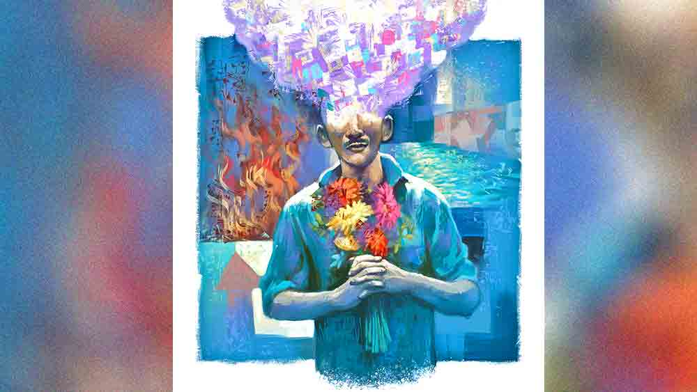

 

<h1 align=center>short story: দৃষ্টি</h1>
<h2 align=center></h2>
একটা চাবির রিং আঙুলে ঘোরাতে ঘোরাতে কেতু বলল, “হিসেব জলের মতো সোজা! তোমার সমস্যা, আমাদের সমাধান। এই হোমিয়োপ্যাথি বুজরুকি দিয়ে কিস্সু হবে না। রাজি হলে তাড়াতাড়ি বলো। সময় কম।”   ঠিকই। সমস্যাটা নিত্যশরণেরই। শুধু সমস্যা নয়, ঘোর বিপদ। কোনও জায়গায় কাজ ছাড়া কিছু ক্ষণ বসলেই সে কিছু একটা দেখতে শুরু করে। আর দেখতে দেখতে সে ওই জায়গাটা থেকে নিজেকে আর আলাদা রাখতে পারে না। ঝামেলাটা যে নতুন শুরু হয়েছে তা নয়। আগেও ছিল কম বেশি। তবে ইদানীং ব্যাপারটা জীবন-মরণ পর্যায়ে পৌঁছেছে। আগে তা-ও শুধু অন্যমনস্কতা বলে উড়িয়ে 
দেওয়া যেত।   প্রথম এই ঝামেলাটা বিপদ হয়ে এল হিরেনখুড়োর সৎকারের দিন। খুড়োর মুদিখানা দোকানেই কর্মচারীর কাজ করত ও। এক দিন দুপুরে দোকান বন্ধ করার সময় তকাই ছুটে এসে জানাল, “দাদু মরে গেছে।”   তড়িঘড়ি দোকানের পিছনের রাস্তায় ওদের বাড়ি এসে দেখল, হিরেনখুড়োকে তুলসীতলায় শোয়ানো। খুড়োর ছেলে আর তার বৌ পাশাপাশি বসে। ছেলের চোখ লাল। বাড়িতে কান্নাকাটি করার মতো বিশেষ কেউ নেই। চৌদোলটা এক দিক ধরে আরও পাঁচ জনের সঙ্গে বাসস্ট্যান্ডের দিকে শ্মশানে গেল নিত্যশরণ। শ্মশানে অনেক কাজ। হাত লাগিয়ে সব কিছুই করেছে ও। শেষে খুড়োর ছেলে খুড়োর মুখে আগুন দিল। সন্ধে গড়িয়ে রাত নেমেছে। সঙ্গের চার জন উল্লাসে মদ ঢালছে গলায়। ওদের মধ্যে এক জন মাঝে মাঝে উঠে গিয়ে আধখানা একটা বাঁশ নিয়ে মাঝে মাঝে নেড়ে দিচ্ছে চিতার কাঠগুলো। খুড়োর ছেলে একটু দূরে বসে আছে ঘাড় নিচু করে। নিত্যশরণের হাতে করার মতো কোনও কাজ নেই। ও একদৃষ্টে চিতার দিকে তাকিয়ে থাকল। উপরে লকলক করছে আগুন। ঠিক লকলক নয়, দাউদাউ। কিন্তু ও ঠিক বুঝতে পারছে না খুড়োর শরীরটা ঠিক আদৌ কোথায় আছে! দাউদাউ আগুনের পাশে চিতার ভিতর থেকে নীচের দিকে আগুন ঝুরোঝুরো। অনেকটা কালীপুজোর ফুলঝুরির মতো। কালো কালো পোড়া কাঠ আর ঝুরো আগুন একেবারে ভিতর দিকে। ওখানে কি খুড়োর শরীর এখনও আছে খানিকটা? নিত্যশরণের চোখ দুটো আবছা হতে থাকে। মনে হয় দাউদাউ আর ঝুরো আগুন ওই আকাশ অবধি উঠে গেছে। নিত্যশরণ একটা অতিক্ষুদ্র প্রাণী। চার পাশে দৈত্যের মতো বিরাট বিরাট কাঠ। চার পাশে দাউদাউ আগুন। তার গায়ে লাগছে হলহলে শিখা। অথচ, কী আশ্চর্য! আগুন এমন চমৎকার, হালকা, ঠান্ডা হয়? মনে হচ্ছে ওর রুক্ষ শরীরে, মাথায় আগুনের ছোঁয়া কী নরম! কী আরাম! নিত্যশরণের মনে হল, সেই ছোটবেলার মায়ের হাত ওর কপালে। এক শিখার ভিতর দিয়ে ও পৌঁছে যাচ্ছে আর এক শিখায়। ওর হঠাৎ মনে হল, আগুনের শিখা যেন যাত্রার মঞ্চের পর্দা। মলমলে রেশমের। পর্দা সরিয়ে ভিতরে ঢুকে ঝুরঝুরে আগুন। নিত্যশরণ এসে দাঁড়াল একটা টকটকে লাল জ্বলন্ত কাঠের ওপর। মাথা বেয়ে শরীরে পড়ছে ঠান্ডা অথচ উজ্জ্বল আগুনের টুকরো… ঝুরো ঝুরো আগুনকণা! কোথায় যেন বরফ পড়ে? ছবিতে দেখেছে নিত্যশরণ। আগুনের সব টুকরোগুলো মুখে, মাথায় ছেয়ে আছে! আঃ! কী আরাম!   “অ্যাই শালা শুয়োরের বাচ্চা! মরতে হলে অন্য কোথা যা! চিতার ভিতর ঢুকছিস ক্যানো?” ডোম দু’জন তত ক্ষণে ওকে একটা হাত আর একটা পা ধরে হিড়হিড় করে টেনে চিতার কাছ থেকে সরিয়ে এনে ঘাসের ওপর ফেলেছে। মাটিতে পড়ে নিত্যশরণ বুঝল, তার ডান হাতটা কব্জি পর্যন্ত হু-হু করে জ্বলছে। হুঁশ ফেরার পর আধপোড়া হাত নিয়ে যন্ত্রণায়, আতঙ্কে নিত্যশরণ এক ছুটে পালিয়েছিল শ্মশান থেকে।   সে বারই নিত্যশরণ মনে মনে প্রতিজ্ঞা করেছিল, কাজ ছাড়া কোনও জায়গায় সে আর বসে থাকবে না। থাকলেও মন দিয়ে কিছু দেখবে না। কিন্তু সে প্রতিজ্ঞা আর থাকল কই! সরকারের একশো দিনের কাজে লেবারদের জল দেওয়ার কাজ পেয়েছিল এক মাসের জন্যে। নদীর ধারে সেচখাল তৈরির কাজ চলছিল। দুপুরে এক ঘণ্টার বিশ্রাম। সবাই খেতে ব্যস্ত। নিত্যশরণ কাঁধে গামছা ফেলে নদীর পাড় থেকে নেমে জলের খুব কাছে গিয়ে বসল। দুপুরের রোদ তীব্র শুকনো। নিত্যশরণ তাকাল জলের দিকে। জলের ওপর সূর্যটা কী রকম কাটা কাটা, লাজুক, তিরতির করে কাঁপছে। কাঁপা কাঁপা আকাশ আর আলো জলের মধ্যে রঙের মতো গুলে যাচ্ছে। ওপর থেকে স্থির দেখাচ্ছে জল। কিন্তু নিত্যশরণ জানে, নদীর জল বয়ে যায়। স্রোত বোঝার জন্যে ও নদীর জলে হাত ডোবাল। ঠিকই তাই। হাত জানতে পারছে জল বয়ে যাচ্ছে। সঙ্গে আকাশ আর আলোও গুলে গুলে বয়ে যাচ্ছে। যেমন দোলের রং মিশে যায় জলে। কিন্তু সব রং আর আকাশ কি জলের সঙ্গে বয়ে যাচ্ছে? মনে হচ্ছে না। ওই তো ঘন ঘন ভারী রং নীচে নেমে যাচ্ছে। জলের অনেক ভিতরে। ওখানে নিশ্চয়ই আকাশ আর সূর্যের রং ঘন কাদার মতো। নিত্যশরণ হাত ঢোকাল আরও ভিতরে। রং কেটে, জল কেটে ওর হাত ভিতরে ঢুকে গেল। এখন রঙের অনেক কাছে নিত্যশরণ। ঠান্ডা ছলছলে রঙে ওর ঠোঁট, নাক, চোখ ডুবে যাচ্ছে। সূর্যটা এত গরম শুধু মাটির ওপর তা হলে! এই যে জলে টকটকে সোনালি সূর্য, নীল আকাশ… এত নরম, ঠান্ডা! কিন্তু রং বেশি ঘন হলে আর দেখা যায় না বোধ হয়! আর কিছু দেখতে পাচ্ছে না ও। এত ঘন জায়গা! নিঃশ্বাসে চাপ লাগছে। দমবন্ধ হয়ে আসছে ওর। রং ঘন হলে এত কষ্ট হয়! প্রাণপণ মাথা, হাত, পা নাড়াতে থাকে নিত্যশরণ। হঠাৎ একটু হালকা… আবার সব দেখতে পাচ্ছে ও। আবছা যদিও। ঘাড়ের কাছে একটা জোর খ্যাঁচ! দু’-তিনটে হাত ওকে হিঁচড়ে তুলে আনল পাড়ে। দমকা কাশি এল নিত্যশরণের। কাশতে কাশতে নাকমুখ দিয়ে জল বেরোতে লাগল।   “এই, সাঁতার না জেনে জলে নামলি কেন? পাগল না কি?” কেউ এক জন বলে উঠল, “মরণদশা!”   নিত্যশরণ দেখল চার-পাঁচ জন ঘিরে দাঁড়িয়েছে ওকে। কাশিটা একটু সামলে ও ভিজে কাপড়ে এসে দাঁড়াল দলের ম্যানেজারের কাছে। লোকটা ওর অর্ধেক রোজের টাকা কেটে বাকি টাকাটা ওর হাতে দিয়ে বলল, “বাড়ি যা। এর পর কাজে এলে কোনও বেচাল যেন না দেখি!” সেই থেকে ভয়ে আর নদীর ধারে যায় না নিত্যশরণ।   ডোমপাড়ার দিকে একটা ছোট টিলা আছে। মেজাজ খিঁচড়ে গেলে এখানে এসে মাঝেমধ্যে বসে ও। আজ এখানে বসতে গিয়েও বসল না। কিছুতেই কাজ ছাড়া কোথাও বসা যাবে না, কিছু দেখা যাবে না। আবার বিপদ না হয়! টিলা থেকে নেমে তাড়াতাড়ি পা চালিয়ে বাজারের মধ্যে ঢুকল ও। অনন্ত ডোমের বউ রুমনি শুকনো মাছ নিয়ে বসেছে রাস্তার ধারেই। নিত্যশরণ হিসেব কষল। পাঁচটা চারা সাইজ়ের কিনলে পরশু পর্যন্ত আর তরকারির চিন্তা নেই। ও লাইনে দাঁড়াল। সাত জনের পর ওর পালা। নিত্যশরণ মাছগুলোর দিকে তাকাল। শুকনো! কে বলবে এত ভাল খেতে! অঢেল মাছের মাঝখানে রুমনি বসে আছে। ডান দিকে হেলে নুয়ে দাঁড়িপাল্লা ধরে আছে। বাঁ দিকের কাপড় সরে গেছে পেটের ওপর থেকে। একটা মোটা কালো পেট ঝুলে আছে ভাঁজ হয়ে। নিত্যশরণ দেখে, পেটের ওপর অনেক দাগ। মায়ের পেটের ওপরে কত দাগ দেখেছে ও। মায়েদের এমন দাগ থাকে। মনটা হু-হু করে উঠল ওর। মাকে ছাড়া একা একা ভাল লাগে না ওর। কী ভাল হত যদি আবার শুরু হত সব! আবার মায়ের পেটের মধ্যে থাকত ও। রুমনির দাগগুলো জ্বলজ্বল করছে। নিত্যশরণের মনে হল, ওই দাগগুলোর ভিতর দিয়ে মায়ের গর্ভে আবার ঢোকা যায়। জাল জাল আঠা আঠা অস্পষ্ট খোল। জলও আঠা আঠা… কাঁচা ডিমগোলা জলের মত আঁশটে গন্ধ। মাকড়সার জালের মতো পাতলা পাতলা সুতো আটকে আছে ওর পেটে। নিত্যশরণ কুঁকড়ে আছে …থকথকে জলের ওপর ভাসছে। এখনই সময় হবে, ও জন্মাবে আর মাকে দেখবে আবার। এই তো মায়ের শরীরের গন্ধ পাচ্ছে এখন। ঘামে ভেজা, আঁশটে গন্ধ! … নাক ভরে লম্বা শ্বাস নেয় নিত্যশরণ।   “আঃ!” আচমকা পিঠের ওপর একটা জোর আঘাত পায় নিত্যশরণ। তার পর উপর্যুপরি অনেক হাত, পা, কিল, চড়, ঘুসি…   “মুখপোড়া মিনসে… এতগুলো লোক এখেনে রং দেখচ? মার ওকে! ওগো, কোথায় গেলে গো? এই মুখপোড়াটা ভরা বাজারে আমাকে বেইজ্জতি করল গো… আমি কী করি গো!” রুমনি মাথা চাপড়ে মড়াকান্না জুড়ে দিল।   বাজারে তুমুল শোরগোল। অনন্ত ডোম মাছকাটা বঁটিটা নিয়ে ছুটে আসতেই এক দল লোক নিত্যশরণকে আগলে ধরল। আর এক দল অনন্তকে আটকে রাখল। লোকগুলো জোর করে নিত্যশরণকে বাজারের বাইরে বের করে আনল। কে এক জন টিপ্পনী কেটে বলল, “শেষে ওই খান্ডারনির গায়ে পড়লে? আর মেয়ে জোটেনি?” কয়েকজন খ্যাকখ্যাক করে হেসে উঠল। নিত্যশরণ ঘাড় ঘুরিয়ে দেখল, অনেকটা পিছনে অনন্ত ডোম বঁটি দেখিয়ে চিৎকার করছে, “এ দিকে আসিস… কুচো কুচো করে দোব।”   না, ও দিকে যাওয়ার আর কথাই নেই। কিন্তু ওই বাজারেই হিরেনখুড়োর দোকান। তাই এ বার থেকে রোজগারও বন্ধ। দু’দিন ঘরের মধ্যে থেকে অনেক ভেবে ও ঠিক করল, কালিকানন্দ ডাক্তারের কাছে যাবে। যদি কোনও ওষুধ থাকে এ রোগের! পরের দিন সকালে ডাক্তারের কাছে গিয়ে দেখল ঘরে আরও চার-পাঁচ জন রোগী। কালিকানন্দ ডাক্তার এক সঙ্গে সবার ওষুধ দেয়। তাই ঝামেলা নেই। লাইনে দাঁড়াতে হয় না। ডাক্তার সব শুনেটুনে চার পুরিয়া ওষুধ দিল ওকে। ডাক্তারের পাশেই কেতু ছিল। ওষুধ নিয়ে ডাক্তারখানা থেকে বেরোতেই সে এসে ধরল পিছন থেকে।   কার্তিক ওরফে কেতু এ পাড়ার মস্তান। পার্টির নেতা সুখেন্দু বিশ্বাসের ডান হাত। ওর কথা ফেলা যায় না। কিন্তু তাই বলে এই সমাধান!   “চোখ চলে গেলে বাঁচব কী করে? সারাটা জীবন…” আমতা আমতা করে নিত্যশরণ বলে।   “আরে, চোখ থাকলে তো এমনিতেই মরবে। দু’দিন আগে কী ঘটল বলো তো? শোনো, ভাল কথা বলচি। বেঁচে থাকতে চোখদান কেউ করেনি আজ পজ্জন্ত… আমাদের পার্টির হয়ে এই ভোটের আগে তুমিই প্রথম করবে। পার্টি তোমাকে মাথায় তুলে রাখবে। পার্টি অফিসের পাশের পাকা ঘরে থাকবে। মাসোহারা পাবে। সারা জীবন বসে খাওয়া। আর তোমার চোখ না থাকলে এ সব ভুলভাল কাজও তুমি করবে না। সব দিকে লাভ!” কেতু সহজ করে বুঝিয়ে দিল ওকে।   নিত্যশরণ বুঝল। এ রকম চলতে থাকলে এমনিতেও কোন দিন বেঘোরে মরবে ও। তাও একটা অঙ্গ গেলে যদি প্রাণটা বাঁচে! আর এমনিতেও ওর রোজগার কিছু নেই এখন। তবু পার্টির দয়ায় পেটের ভাত আর মাথার ছাদ যদি জোটে! সত্যিই তো! এই চোখগুলোই যত 
নষ্টের গোড়া! চোখগুলো গেলে আপদ যাবে!   “কিন্তু খুব লাগবে মনে হয়,” বিড়বিড় করে বলে নিত্যশরণ।   “পিঁপড়ে কামড়ানোর মতো… আজকাল তো এ রকমই ব্যাপার!” কেতু সাইকেলে উঠতে উঠতে বলে, “তা হলে ওই কথাই রইল। কাল বসের কাছে নিয়ে যাব।”   পরের দিন কেতু নিত্যশরণকে নিয়ে গেল সুখেন্দু বিশ্বাসের কাছে। ভিড়ের মাঝখান দিয়ে ওকে নেতার একেবারে কাছে নিয়ে গেল কেতু। তার পর সুখেন্দু বিশ্বাসকে বলল, “এ আমাদের পার্টির হয়ে চক্ষুদান করবে স্যর।”   সুখেন্দু বিশ্বাস হাঁ করে কেতুর মুখের দিকে তাকিয়ে বলল, “তাতে কী হবে?”   কেতু সুখেন্দু বিশ্বাসের কানের কাছে মুখ নিয়ে এসে চুপিচুপি বলল, “বিরোধীরা রক্তদান শিবির করাচ্ছে। আমরা চক্ষুদান করাব। পাবলিক খাবে।”   সুখেন্দু বিশ্বাসের মুখটা চকচক করে উঠল। তার পরই সুখেন্দু বিশ্বাস বেঁটে মোটা আঙুলগুলো দিয়ে খপ করে কেতুর জামা ধরে টেনে বলল, “কিন্তু বেঁচে থাকতে চক্ষুদান বেআইনি তো!”   কেতু আবার ওর মুখের কাছে গিয়ে হিসহিস করে বলল, “এলাকার লোক এত সব আইনপত্তর জানে না। বাকি ডাক্তার আর থানা আমি 
সামলে নেব।”   পরের দিন কেতু নিত্যশরণকে নিয়ে গিয়ে পার্টি অফিসের পাশে ওর ঘর দেখাল। নিত্যশরণের পাকা বাড়িতে থাকার স্বপ্ন এ বার সত্যি হবে। তার পর লাল সাদা সবুজ হলুদ ফেস্টুন দিয়ে সাজানো একটা অপারেশন শিবিরের ভিতর নিত্যশরণ চোখদান করল। শিবিরের বাইরে দু’দিন ধরে রবীন্দ্রসঙ্গীত বাজল। পার্টির বড় বড় হোর্ডিং-এ নিত্যশরণের নাম থাকল পার্টির মুখ হয়ে। সুখেন্দু বিশ্বাস এসে বক্তৃতাতে বলল, “নিত্যশরণ ওদের পার্টির একনিষ্ঠ কর্মী যে জনকল্যাণে নিজের জীবদ্দশায় চক্ষুদান করল।” হাততালি আর গানে গমগম করল শিবির।   তিন দিন পর নিত্যশরণকে ধরে ধরে পার্টির লোকেরা ওর পাকাঘরে এনে রাখল। কিছু লোক কিছু খাবারদাবার এনে রাখল ঘরের মেঝেয়। তখনও বেশ খানিকটা ওষুধের ঘোরে আছে ও। কয়েক জন এসে অনেক ফুলের তোড়া ধরিয়ে দিল ওর হাতে। কিছুই দেখতে পারছে না নিত্যশরণ। লোকজনের কথাবার্তার আওয়াজ আস্তে আস্তে কমে এলে ও বুঝল, ঘরে আর বিশেষ লোকজন নেই। ফুলের তোড়ার ফুলগুলো দেখতে পাচ্ছে না নিত্যশরণ। কিন্তু গন্ধগুলো খুব চেনা তার। গোলাপ, সূর্যমুখী আর কিছু অচেনা ফুল হবে হয়তো। ফুলগুলো মুখের খুব কাছে নিয়ে আসে ও। নরম পাপড়ি লাগছে ঠোঁটে, গালে। ঝুরঝুরে হালকা কী যেন একটা লাগল ঠোঁটে! পরাগ বোধহয়! নিত্যশরণের মনে পড়ল পরাগের নীচে উঁচু নরম একটা ঢিবি… ছুঁলে কী আরাম! আঙুল ছোঁয়ালে ঘুম পায়। নিত্যশরণ ভাবল, পরাগের ভিতর দিয়ে ওই নরম জায়গায় পৌঁছানো যায় কি? পরাগরেণুর জঙ্গল চার পাশে… হিলহিল করে দুলছে নরম পরাগ… পরাগজঙ্গলে হাওয়ায় কি নেশা নেশা গন্ধ… গায়ে, মাথায়, মুখে ছিটকে এসে লাগছে গুঁড়ো গুঁড়ো নরম… একটা পাপড়ির ওপর দিয়ে হেঁটে গিয়ে আস্তে আস্তে নিত্যশরণ পাপড়ির ভিতর ওই উঁচু নরম জায়গায় পা ফেলল…
