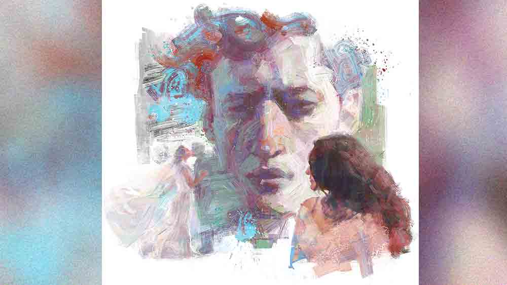

 

<h1 align=center>short story: প্রতিকৃতি</h1>
<h2 align=center>নন্দিতা বাগচী</h2>
ফাইন আর্টসে ব্যাচেলর্স পড়াকালীনই আমি ঠিক করেছিলাম যে, মাস্টার্সটা প্যারিসে করব। আমার বাবা এক জন বিত্তবান শিল্পপতি। আমি তাঁর একমাত্র সন্তান। তাই আর্ট নিয়ে পড়া বা প্যারিসে যাওয়ার ব্যাপারে তাঁর আপত্তি ছিল না। আমাকে আমার ইচ্ছেমতো কেরিয়ার গড়ার অনুমতি দিয়েছিলেন তিনিই। ডাক্তার, ইঞ্জিনিয়ার, উকিল, চার্টার্ড অ্যাকাউন্ট্যান্ট, প্রফেসর বা অন্য কোনও প্রফেশনাল হবার মতো ইচ্ছে আমার ছিল না কোনও কালেই। ছোট থেকেই আঁকতে ভালবাসতাম, ড্রয়িং খাতাতেই হোক কিংবা 
বাড়ির দেওয়ালে।   আমার মায়ের অবশ্য আমাকে নিয়ে অন্য রকম স্বপ্ন ছিল। কন্যাসন্তান বলে কথা, ভাল ঘর-বরে বিয়ে দিয়ে থিতু করতে চেয়েছিলেন তিনি। তবে তাঁর সেই ইচ্ছেগাছের গোড়া কেটে দিয়েছিলাম আমি শুরুতেই। যেহেতু আমার বাবাই আমার মেন্টর এবং স্পনসর, তাই লক্ষ্যের দিকে এগিয়ে যেতে অসুবিধে হয়নি আমার।   প্যারিসের একটা আর্ট কলেজে ভর্তি হয়েছি মাস তিনেক। থাকি রু লা ফায়েতের একটা পুরনো বাড়িতে। বাড়িওয়ালি মাদাম আদ্রিয়ানা ভারী শৌখিন মানুষ। তবে রোজগার তেমন নেই বলে একতলার একটা ঘর ভাড়া দিয়েছেন। পুরুষ ভাড়াটে পছন্দ নয় তাঁর। আমার আগে দু’টি কলেজ-পড়ুয়া মেয়েকে ভাড়া দিয়েছিলেন। তারা লেখাপড়া শেষ করে অন্যত্র থিতু হয়েছে বলে আমার ভাগ্যে 
শিকে ছিঁড়েছে।   ঘরটার ভাড়া অনেকটাই বেশি। তাই আমি মাদাম আদ্রিয়ানাকে অনুরোধ করেছিলাম এক জন রুমমেটের ব্যবস্থা করতে, যাতে ভাড়াটা ভাগাভাগি করে দেওয়া যায়। মাদাম আদ্রিয়ানা বললেন, “তুমি নিজেই তোমার রুমমেট খুঁজে নাও অ্যানা। আমি যাকে পছন্দ করব তাকে তোমার পছন্দ না-ও হতে পারে।”   হ্যাঁ, উনি আমাকে অ্যানা বলে ডাকেন। উনি শুধু নন, আমার কলেজের বন্ধুরা, শিক্ষকরা, সকলেই এই নামে ডাকেন। অহনা উচ্চারণ করতে পারেন না ওঁরা।   এই বাড়িটা খুঁজতে সাহায্য করেছিল আমার কলেজের স্টুডেন্ট-ওয়েলফেয়ার ডিপার্টমেন্ট। তাই আবার তাদেরই দ্বারস্থ হলাম আমি। সেখান থেকেই খোঁজ পেয়ে গেলাম অ্যাডেলে-র। সে-ও একটা আস্তানা খুঁজছিল। ফ্রান্সের একটা গ্রামে বাড়ি তার। কিন্তু প্যারিস শহরে তার থাকার কোনও জায়গা নেই।   অ্যাডেলে, যাকে সবাই অ্যাডি বলে ডাকে, ভারী হাসিখুশি মেয়ে। মাথায় এক ঢাল গাঢ় বাদামি চুল। ইউরোপের অন্য মেয়েদের মতো ব্লন্ড নয়। চোখের তারা দুটোও গাঢ় বাদামি, নীল বা ধূসর নয়। গায়ের রংটা একটু চাপা, যেটাকে এ দেশে বলে অলিভ রং। তাই আমার গমরঙা শরীর আর কালো চুল-চোখ বেশ মানানসই তার পাশে। আমরা কেউ কারও দিকে অবাক চোখে তাকিয়ে থাকি না।   ছোট ছোট ঘটনাতেও হাসির খোরাক খুঁজে পায় অ্যাডি। হাসিটিও দিলখোলা তার। প্রথম দিনেই বলল, “আমার কিন্তু এক জন বয়ফ্রেন্ড আছে। তোমার কোনও আপত্তি নেই তো অ্যানা?”   আমি ঠোঁট উল্টে বললাম, “সে তো তোমার সম্পত্তি, আমার আপত্তি থাকবে কেন?”   অ্যাডি হিহি করে হেসে বলল, “তুমি খুব মজার মেয়ে তো!”   আমি মুখ বেঁকিয়ে হাসলাম একটু। বললাম, “এর ভেতরে মজার কী দেখলে? আমি তো সোজাসাপ্টা কথা বললাম একটা।”   এ বারে আর হিহি নয়, হোহো করে হেসে উঠল অ্যাডি। বলল, “এই তোমার সোজাসাপ্টা কথা? আমার বয়ফ্রেন্ড আমার সম্পত্তি?” বলেই দু’হাতের মধ্যমা আর তর্জনী দিয়ে কোটেশন মার্ক দেখাল সে।   আমি আরও এক ধাপ এগিয়ে গিয়ে বললাম, “শুধু একটা শর্ত 
আছে আমার।”   “শুনি কেমন শর্ত!” চোখ দুটোয় ঝিলিক তুলে বলল অ্যাডি।   “তোমার বয়ফ্রেন্ড আসার আগে আমাকে জানাতে হবে। আমি ঘর থেকে বেরিয়ে কোনও রোডসাইড কাফেতে গিয়ে কফি খাব। আমার সামনেই তাকে নিয়ে শুয়ে পড়া চলবে না।”   হাহাহা করে হাসতে হাসতে অ্যাডি বলল, “তুমি তাই করো বুঝি?”   “আমার বয়ফ্রেন্ড নেই, তাই সে প্রশ্ন ওঠে না,” বলি আমি।   “সে কী! তা হলে তুমি বেঁচে আছ কী করে?” চোখ দুটো কপালে তুলে বলল অ্যাডি।   এই ভাবেই বন্ধুত্ব জমে গেল আমাদের। তা ছাড়া আমরা দু’জন আর্ট নিয়ে শুধু পড়াশুনোই করি না, আমরা আর্ট লাভারও বটে। নানা দেশের, নানা যুগের শিল্পীদের শিল্পকর্ম নিয়ে আলোচনা করি। মিউজ়িয়ামে গিয়ে ঘণ্টার পর ঘণ্টা কাটিয়ে দিই। শুধু আমাদের দু’জনের একটা ব্যাপারেই অমিল। আমি পোর্ট্রেট আঁকতে ভালবাসি, আর অ্যাডির পছন্দ ন্যুড পেন্টিং।   ও প্রায়ই ওর প্রিয় তিনটে ন্যুড পেন্টিং-এর খুঁটিনাটি বিশ্লেষণ করে। মাইকেলেঞ্জেলোর ‘দ্য ক্রিয়েশন অব অ্যাডাম’, সান্দ্রো বত্তিচেলির ‘বার্থ অব ভেনাস’ আর জন কলিয়ারের ‘লেডি গোডিভা’ ছবি তিনটে চুম্বকের মতো টানে তাকে। আর সে আকর্ষণ এতটাই অমোঘ যে গত গ্রীষ্মে অ্যাডি তার বয়ফ্রেন্ডকে নিয়ে ভ্যাটিকান সিটির সিস্টাইন চ্যাপেলে গিয়ে হাজির হয়েছিল। সেখানকার সিলিং জুড়ে ‘দ্য ক্রিয়েশন অব অ্যাডাম’-এর ফ্রেসকো আঁকা আছে।   হ্যাঁ, বলা হয়নি, অ্যাডির বয়ফ্রেন্ডের নাম গ্যাব্রিয়েল। ছেলেটি এক জন ন্যুড মডেল। ওয়েস্ট ইন্ডিজ়-এর কোনও একটা ফ্রেঞ্চ কলোনিতে বাড়ি। প্যারিসে এসেছে হায়ার স্টাডিজ়ের জন্য। কিছুটা স্কলারশিপ পায়, বাকি পয়সা জোগাড় করে মডেলিং করে। প্রতি শনিবারে বাস্তিল অঞ্চলের একটা আর্ট স্টুডিয়োয় কাজ শিখতে যায় অ্যাডি। সেখানেই আলাপ তাদের।   আমার সঙ্গে প্রথম আলাপের দিনে “বঁজুঁর মাদমোয়াজ়েল!” বলেই গ্যাব্রিয়েল আমার দু’গালে চকাস চকাস করে চুমু খেয়ে বসেছিল। আমি তো লজ্জায় লাল! এটাই যে এদেশের রীতি, জানতাম না তখন। তবে তাকে দেখে চমকে উঠেছিলাম আমি। মনে হয়েছিল যেন আবলুশ কাঠে খোদাই করা লম্বা-চওড়া মূর্তি একটা। হাতুড়ি-বাটালি দিয়ে খোদাই করে তৈরি করা প্রতিটি পেশি। কার্পেটের মতো ঘন বুনটের কোঁকড়া চুল। ন্যুড মডেলিংয়ের জন্য আদর্শ চেহারা।   গ্যাব্রিয়েলের একটা বড়সড় মোটরবাইক আছে। প্রতি রবিবার সকালে সে এসে হাজির হয় সেটা নিয়ে। তার পর দু’জনে মিলে বেরিয়ে পড়ে। নিজেদের ইচ্ছেমতো ঘুরে-বেড়িয়ে, খেয়ে-দেয়ে রাতে ফেরে অ্যাডি। তখন টলায়মান অবস্থায় থাকে সে।   আমার একটা বাইসাইকেল আছে কলেজে যাওয়ার জন্য। কলেজ ক্যাম্পাসটা বাড়ির কাছেই। অন্য সময়ে প্যারিস শহরের সরু সরু গলি দিয়ে ঘুরে বেড়াই সাইকেলে চেপে। কখনও বা কোনও রোডসাইড কাফেতে বসে কফি আর স্ন্যাক্স খাই। ত্রোঁসাঁ আর ম্যাকারঁ খেতে আমার খুব ভাল লাগে। আর ক্রেপ খেতে তো একেবারে পাটিসাপ্টার মতো।   তবে রবিবার সকাল হলেই আমি বেরিয়ে পড়ি সাইকেলটা নিয়ে। সেইন নদীর ধার ঘেঁষে সোজা গিয়ে হাজির হই ল্যুভ্‌র মিউজিয়ামের মেন গেটে। সারা বছর ট্যুরিস্টদের ভিড় লেগেই থাকে সেখানে। আমিও তার সুযোগ নিই। সাইকেলের কেরিয়ারে ইজেল এবং ড্রয়িং শিটের সঙ্গে একটা ফোল্ডিং টুলও নিয়ে আসি। ট্যুরিস্টদের সেটায় বসিয়ে পোর্ট্রেট আঁকি। তারাও খুশি, আমিও খুশি। রোজগার তো হয়-ই, আমার কাজেরও প্র্যাকটিস হয়। দেশে ফিরে ধনী মানুষদের পোর্ট্রেট এঁকেই রোজগার করার ইচ্ছে আমার।      এ ভাবেই চলছিল বেশ। কিন্তু এক দিন সকালে উঠে বমি করতে করতে অ্যাডি বলল, “আমি বোধহয় প্রেগন্যান্ট হয়ে গেছি অ্যানা।”   আমার মাথায় তো আকাশ ভেঙে পড়ে। আমি বলি, “কী করবে এখন?”   “কী আর করব, বাচ্চাটার জন্ম দেব,” নির্বিকার ভাবে বলল অ্যাডি।   আমি বললাম, “কিন্তু তোমার তো বিয়ে হয়নি!”   এ বার একটু বিরক্ত হল অ্যাডি। বলল, “বিয়ে না হলে কি বাচ্চার জন্ম দেওয়া যায় না?”   আমি লজ্জিত হই। আমার রক্ষণশীল ভারতীয় চিন্তাধারা আমাকে বিপাকে ফেলে। ও দিকে অ্যাডি আর গ্যাব্রিয়েল এই সম্ভাবনাটিকে উদ্‌যাপন করতে বেরিয়ে পড়ে মোটরবাইক নিয়ে।   ক্রমশ ফুলে-ফেঁপে উঠছে অ্যাডির শরীর। তার ভাবী সন্তানের নানা কাণ্ডকারখানার কথা শোনায় সে আমাকে। আমিও নানা রকম টক-ঝাল খাবার তৈরি করে খাওয়াই তাকে। মহানন্দে সে সব খাবার খায় সে। ইতিমধ্যে এক দিন বাস্তিলের স্টুডিয়োয় এনগেজমেন্টটা সেরে ফেলল ওরা। আমিও গিয়েছিলাম সে অনুষ্ঠানে। বাড়িতে ফিরে হিরের কুচি বসানো আংটিটা দেখিয়ে অ্যাডি বলল, “কী, এ বার খুশি তো তুমি? বিয়েটাও সেরে ফেলব শিগগিরই।”   এনগেজমেন্টের সপ্তাহ খানেক বাদেই এক ভয়ানক দুঃসংবাদ এল মাঝরাত্তির নাগাদ। বাস্তিলের স্টুডিয়োয় লম্বা সিটিং ছিল সে দিন গ্যাব্রিয়েলের। রাতে তার আস্তানায় ফেরার পথে মোটরবাইকটা অ্যালাইনমেন্ট হারিয়ে গিয়ে ধাক্কা মারে একটা কানাগলির কংক্রিটের দেওয়ালে। তৎক্ষণাৎ সেখানেই মৃত্যু হয় গ্যাব্রিয়েলের।   খবরটা শোনার পর শোকে পাথর হয়ে যায় অ্যাডি। হাসতে তো ভুলেই যায়, কাঁদতেও পারে না। তার ওপরে গ্যাব্রিয়েলের ভাই তাদের দেশ থেকে এসে শবদেহটাও নিয়ে যায় পারিবারিক প্রথায় কবর দেওয়ার জন্য।   হেমন্ত এসে গেছে। ওক-মেপ্‌ল গাছের হলদে-কমলা রঙের পাতাগুলো ঝরে পড়ছে আমাদের কলেজ ক্যাম্পাসের ঘাসের জমির ওপরে। আমি অবাক হয়ে তাকিয়ে দেখি প্রকৃতির সেই রঙের খেলা। মনে হয় যেন একটা রংবেরঙের কার্পেট বিছিয়ে দিয়েছে কেউ ক্যাম্পাসটা জুড়ে।   কিন্তু রং নেই অ্যাডির মনে। প্রসবের দিন এগিয়ে আসছে তার। আমি কিংকর্তব্যবিমূঢ়। বললাম, “তুমি তোমার মায়ের কাছে চলে যাও অ্যাডি। এ অবস্থায় তাঁকে প্রয়োজন তোমার।”   কিন্তু সে নির্বিকার। কলেজেও যায় না আজকাল। এক দিন আমাকে বলল, “তুমি গ্যাব্রিয়েলের একটা পোর্ট্রেট এঁকে দেবে?”   আমার খারাপ লাগে। বুঝতে পারি গ্যাব্রিয়েলের অনুপস্থিতি কষ্ট দিচ্ছে তাকে। তাই বলি, “অবশ্যই এঁকে দেব। ওর একটা ছবি দাও আমাকে, আর ক’টা দিন সময় দাও।”   সে বলে, “সময় বেশি দিতে পারব না। একটু তাড়াতাড়ি কাজটা করে দিতে হবে।”   আমি রাত জেগে তৈরি করি গ্যাব্রিয়েলের পোর্ট্রেট। অ্যাডি আমাকে কফি তৈরি করে খাওয়ায়।   দিনের বেলা আমি যখন কলেজে যাই, অ্যাডিও তখন বেরিয়ে যায়। কিন্তু কোথায় যায় সে কথা বলে না আমাকে। এক দিন হঠাৎ এসে বলল, “আমি বিয়ে করছি। তুমি আমার ব্রাইডস্‌মেড হবে তো, অ্যানা?”   আমি হকচকিয়ে যাই। তবে যে গ্যাব্রিয়েলকে এত ভালবাসত অ্যাডি! সে ভালবাসা কোথায় গেল? আর আমাকে যে বলেছিল, বিয়ে না হলে কি বাচ্চার জন্ম দেওয়া যায় না? মনের ভেতর নানা প্রশ্ন বুজকুড়ি কাটে আমার। কিন্তু বিদেশ-বিভুঁই বলে কথা, সব প্রশ্ন মনের ভেতরেই মাটিচাপা দিই। মুখে বলি, “অবশ্যই হব অ্যাডি, আমার চেয়ে ঘনিষ্ঠ বন্ধু আর কে আছে তোমার বলো?”   অ্যাডি নিশ্চিন্ত হয়। সাদা ওয়েডিং গাউন, ভেল ইত্যাদি কিনে আনে। আমাকেও জোর করে একটা গাউন কিনে দেয় বিয়ের দিন পরার জন্য। তার পর নির্ধারিত দিনে সেজেগুজে আমরা গিয়ে হাজির হই সিটি হলে। আমার মনে নানা প্রশ্ন ঢেউ তোলে। সিটি হল কেন? কেন গির্জা নয়? আর ব্রাইডগ্রুমই বা কে?   অ্যাডির ক’জন বন্ধু এসেছে। তাদের সঙ্গে কথা বলছে সে। যথাসময়ে মেয়রও এসে উপস্থিত হলেন। তখনই অবাক হয়ে দেখলাম, অ্যাডির এক বন্ধু আমার আঁকা গ্যাব্রিয়েলের পোর্ট্রেটটা নিয়ে এগিয়ে আসছে। পোর্ট্রেটটা একটা পালিশ করা কাঠের ফ্রেম দিয়ে বাঁধানো।   ছবিটা টেবিলের ওপরে রেখে তার পাশে গিয়ে দাঁড়াল অ্যাডি। আর মেয়র একটা কাগজ থেকে পাঠ করতে লাগলেন, “গ্যাব্রিয়েল ও অ্যাডেলে আজ থেকে বিবাহ বন্ধনে আবদ্ধ হল। যে হেতু গ্যাব্রিয়েল জীবিত নয়, তাই অ্যাডেলে বৈধব্যেরও স্বীকৃতি পেল এই মুহূর্ত থেকে।”   চোখ দুটো বুজে, হাত দুটো বুকের কাছে জড়ো করে পোর্ট্রেটটার সামনে দাঁড়িয়ে আছে অ্যাডি। হাতে সাদা গোলাপ ফুলের তোড়া। আর সিটি হল জুড়ে গুঞ্জরিত হচ্ছে, “আমেন!” “আমেন!” “আমেন!”   (জ্ঞাপনীয় তথ্য: ফ্রান্সে মৃত ব্যক্তির সঙ্গে বিবাহ আইনসিদ্ধ)   