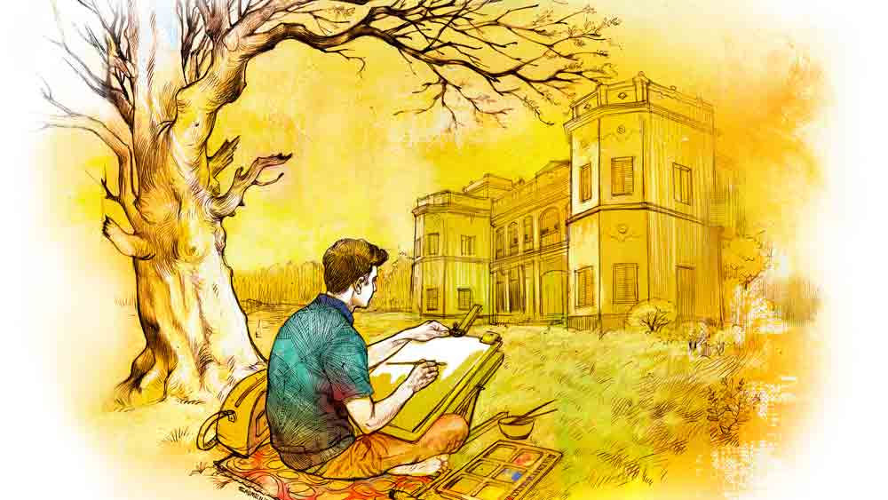

 

<h1 align=center>short story: প্রতিষ্ঠা</h1>
<h2 align=center>মোনালিসা চন্দ্র</h2>
অল্পবয়সি যে ছেলেটা ব্যাগপত্র ঘরে পৌঁছে দিল, তার হাতে একটা নোট গুঁজে দিল সুমন। লোকে বখশিস দেয় ফিরে যাওয়ার সময়, সুমন শুরুতেই দিল। সঙ্গে একটা মিষ্টি হাসি। এই দুটো জিনিসে সবাই কাত হয়, ছেলেটাও হল। তড়বড়িয়ে বলে উঠল, “চা খাবেন স্যর? ঘরে এনে দিই?”   “ঠিক ধরেছিস। প্রাণটা চা-চা করছে। যা নিয়ে আয়।”   চা আনতে ছুটল ছেলেটা। ও কোনও কাজে লাগবে কি না সুমন জানে না, তবে কাউকে একটা হাতে রাখতে পারলে হয়তো ভাল হয়।   ঘরের ভিতরটায় এ বার চোখ বোলায় সুমন। সাবেক আসবাব দিয়ে সাজানো ঘর। হেডবোর্ডে জটিল কারুকার্য করা পালঙ্কটা খুব সুন্দর। ওই নকশার সঙ্গে মিল রেখে ড্রেসিংটেবিল আর ওয়ার্ড্রোবেও কারুকাজ। গ্লাসটপ টেবিল আর চেয়ারদুটো হাল আমলের, তাই এ ঘরে ভীষণ বেমানান। জানলায় খড়খড়ি আর রঙিন কাচের স্কাইলাইট। বাড়িটা নাকি তিনশো বছরের পুরনো। তবে রক্ষণাবেক্ষণ খুব সুন্দর। সুমন এ বার এসে দাঁড়াল ঘরের সবচেয়ে নজরকাড়া বস্তুটার সামনে। এক মধ্যবয়সিনির অয়েলপেন্টিং। মস্ত ফ্রেমবন্দি হয়ে ঝুলছে উত্তরের দেওয়ালে। ইনি এ বাড়ির বিখ্যাত কর্তামা। বসার ভঙ্গি, চোখের চাউনি আর বাঁকা হাসি থেকে কর্ত্রীসুলভ রাশভারী ভাব ঝরে পড়ছে। ছবিটার দিকে অনেক ক্ষণ একদৃষ্টে চেয়ে রইল সুমন। হয়তো বা মনে মনে মহড়া দিয়ে নিল বলতে চাওয়া কথাগুলো। তার পর নিজের ব্যাগটার দিকে ইশারা করে ভুরু নাচিয়ে বলল, “ওটা দেখেছ? ওর মধ্যে আছে।”   দরজায় টোকা দিয়ে তখনই চা-বিস্কুট নিয়ে ঢুকল ছেলেটা। ওর হাতে বিস্কুটদুটো ধরিয়ে দিয়ে সুমন বলল, “খেয়ে নে। আমি শুধু চা খাই।”   ছেলেটা ইতস্তত করছিল, এ ভাবে খাওয়াটাওয়া তাদের বারণ। সুমন ওর পিঠটা চাপড়ে দিয়ে বলল, “চট করে খেয়ে ফেল, কেউ জানবে না। ঘরের ভিতর তো আর সিসিটিভি নেই। কী রে, আছে না কি? কোথায় কোথায় তোদের সিসিটিভি আছে রে?”   ছেলেটা মহা উৎসাহের সঙ্গে বলে উঠল, “অনেকগুলো... গেটে আছে, সিঁড়িতে আছে, ছাদে আছে, রান্নাঘরেও একটা আছে।”   তার পর চ্যাপ্টা ব্যাগটার দিকে আঙুল তুলে জিজ্ঞেস করল, “ওই ব্যাগে কী আছে?”   “আমি ছবি আঁকি তো। ওই ব্যাগে তার সরঞ্জাম আছে। আমি যেখানে যাই, ব্যাগটা আমার সঙ্গে যায়।”   “আর ক্যালেন্ডারের মতো ওগুলো কী?”   “ওগুলো সব ছবি আঁকার কাগজ। আঁকব যখন দেখবি...” বলল সুমন।   মিঠাপোতার এই রাজবাড়ি আদতে এক জমিদারবাড়ি। ইংরেজ আমলে কোম্পানি বাহাদুরের পদলেহন করে যে সব জমিদার অন্যায় সম্পদে কোষাগার ভরিয়ে ফেলেছিল, এরা তাদেরই এক জন। কতখানি অর্থবল থাকলে কয়েক বিঘে জমির ওপর এত বড় একখানা বাড়ি তোলা যায়, ভাবলে বিস্ময় জাগে।   রাজবাড়ির বর্তমান প্রজন্মের কারও মধ্যে ব্যবসাবুদ্ধিটা টনটনে ছিল। সে-ই উদ্যোগী হয়ে বাকি শরিকদের বুঝিয়ে-সুজিয়ে ধ্বংস হতে বসা বাড়িটাকে সারিয়ে-সুরিয়ে এই টুরিস্ট-স্পটের আকার দিয়েছে। বাড়ির পুরনো চেহারাটা অবিকল রেখেছে এরা। ঘরগুলো সাজিয়েছে টিকে থাকা পুরনো আসবাব, ঝাড়লন্ঠন আর প্রাচীন তৈলচিত্র দিয়ে। ফোটোগ্রাফ আর অয়েল পেন্টিং মিলিয়ে অজস্র ছবির স্টক এদের। বাড়ির চার পাশে অনেকখানি জায়গা জুড়ে বাগান পুকুর আর মন্দির। সবই পরিষ্কার পরিচ্ছন্ন করে সাজানো। ফলে রাজবাড়িতে দু’-একটা রাত কাটানোর আকর্ষণে লোকজন মন্দ আসছে না। কয়েকটা ফিল্মের শুটিংও হয়েছে। ফলে বাড়িটা থেকে উপার্জন ভালই বাড়ছে।   ঘর থেকে বেরিয়ে এল সুমন। সামনে লম্বা ঢাকা বারান্দা। বারান্দার এক ধারে পর পর চারটে ঘর, অন্য ধারে এক সারি জানলা। সে সব জানলা দিয়ে মুখ বাড়ালে নজরে পড়বে চক-মেলানো উঠোন। বারান্দার মেঝে মার্বেলের, সাদা-কালো চৌখুপি নকশা কাটা। বারান্দার দু’দিকের দেওয়াল জুড়ে বাঁধানো ছবির মিছিল। এ বাড়ির ঘরগুলোর নামেরও বেশ বৈশিষ্ট্য— বড়দাবাবুর ঘর, মেজদাবাবুর ঘর, বড়পিসিমার ঘর, সেজকাকাবাবুর ঘর এ রকম সব নাম। মানুষগুলো বিভিন্ন প্রজন্মের, ঘরের নামকরণের কারণে এখন পাশাপাশি অবস্থান তাদের।   নীচে বড়সড় একখানা বসার ঘর, নাম ‘বৈঠকখানা’। সে ঘরে আছে ক্যারম বোর্ড, দাবা, এক আলমারি বই আর একটা টিভি। দেওয়ালে সাজানো হরিণ, বাঘ আর বুনো মোষের মাথা। এ বাড়ির কত্তাদের দাপটে এক কালে বাঘে হরিণে এক ঘাটে জল খেত কি না জানা নেই, তবে ওদের মাথাগুলো এখন এক দেওয়ালে, পাশাপাশি। বৈঠকখানার দেওয়ালে ঝুলছে এদের ফলাও বংশলতিকা। কোনও আগ্রহী গেস্ট চাইলে ধৈর্য ধরে পড়ে দেখতে পারে যাদের নামাঙ্কিত ঘরে তারা অবস্থান করছে তারা কে, কী তাদের পারস্পরিক সম্পর্ক।   বাগানে যাবে বলেই সুমন বেরিয়েছিল ঘর থেকে। লাল সুরকি বিছোনো পথ তাকে পৌঁছে দিল বাগানে। সেখানে বাহারি ঘাট, বাঁধানো মস্ত পুকুর। মনোহর পরিবেশ। মন স্নিগ্ধ হয়ে যায়। সুমনের মন অবশ্য স্নিগ্ধ হল না। মাথায় কোনও অভিসন্ধি গজগজ করলে মনে কি শান্তি আসে? তার বরং মনে পড়ল এই পুকুরেরই পুব দিকের এক ঝুপসি আমগাছের আড়াল এক সময় ছিল এক অসম যুগলের অভিসারস্থল। রাতের অন্ধকারে সেখানেই গোপনে মিলিত হত তারা।   রাজবাড়ির চার পাশ, বাগান পুকুর ঠাকুরদালান ছাদ সবই সুমনের চেনা। আগে এক বার এসে দেখেছে ও সব। সে বার অবশ্য নিখাদ বেড়াতেই এসেছিল, তবে সে বারের আসাটাই সুমনের এ বারের আসার উদ্দেশ্যের জন্ম দিয়েছে।   দুপুরে খাওয়ার পর ইজেলের ব্যাগ ঘাড়ে বাগানে গেল সুমন। একটা জায়গা বেছে ঘাসের উপরেই পেতে বসল আঁকার সরঞ্জাম। ধীরে ধীরে সুমনের তুলির পোঁচে ক্যানভাসের ওপর ফুটে উঠতে থাকল বাগান পুকুর-সহ রাজবাড়ির একাংশের ছবি। অন্য অতিথিদের কেউ কেউ দাঁড়িয়ে সুমনের আঁকা দেখতে থাকল, তারিফও জুটল টুকটাক।   দিনের আলো কমে এলে আঁকা থামিয়ে জিনিসপত্র গুটোল সুমন। বাকিটুকু এ বার আঁকবে সে বৈঠকখানা ঘরে বসে। সে ঘরে এসে বংশলতিকা টাঙানো দেওয়ালটার কাছাকাছি সুমন সেট করল তার ইজেল। সে ঘরে তখন দু’জন ছেলেমেয়ে ক্যারম পিটছিল আর খবরের কাগজে মুখ ডুবিয়ে বসেছিলেন এক ভদ্রলোক। কিছু পরে এক কর্মচারী এসে মন্দিরে সন্ধ্যারতি শুরু হওয়ার খবর দিলে ওই তিন জনে বৈঠকখানা ছেড়ে ঠাকুরদালানের দিকে এগোল। এই সময়টার অপেক্ষাতেই ছিল সুমন। ঘর খালি হতেই বিদ্যুৎগতিতে দেওয়াল থেকে বংশলতিকার বোর্ডটা নামিয়ে নিল সে। তার পর, ক্যানভাসের তলা থেকে অবিকল ওই রকম চেহারার দ্বিতীয় একটা বংশলতিকার বোর্ড বের করে দ্রুত টাঙিয়ে দিল দেওয়ালে। প্রথমটাকে চালান করে দিল ক্যানভাসের তলায়। ব্যস, অপারেশন শেষ। এতটা মসৃণ ভাবে কাজটা হয়ে যাবে, ভাবেনি সুমন। বুকের ধড়াস ধড়াস শান্ত করার জন্য একটা সোফায় গিয়ে বসে বড় বড় শ্বাস নেয় সে।   এ বার দ্বিতীয় অপারেশন। তুলনায় অনেক সহজ। ও যে ঘরে আছে তার সামনের টানা বারান্দাতেই আছে কর্তামার কনিষ্ঠপুত্র দেবেন্দ্রবিজয়ের আবক্ষ ছবি। আগের বারেই সুমন দেখে গিয়েছিল সেটা। বুকিংয়ের সময় তাই এ দিকের ঘরই চেয়েছিল সে। এ দিককার চারটে ঘরের যে কোনও একটা ঘর হলেই কাজ চলে যেত, কিন্তু কত্তামাকে দেখিয়ে দেখিয়ে কাজটা করবে বলে ‘কর্তামায়ের ঘর’টাই বুকিংয়ের সময় চেয়েছিল সুমন।   রাতের খাওয়াদাওয়া মিটলে সকলের অজান্তে ছোটকুমারের ছবিটাকে টুক করে দেওয়াল থেকে পেড়ে নিয়ে নিজের ঘরে ঢুকে পড়ল সুমন। তার পর ব্যাগ থেকে বার করল হুবহু ওই রকম দেখতে অন্য একটা বাঁধানো ফ্রেম। সে ফ্রেমে রয়েছে একটি যুগলচিত্র। এ ছবি সস্ত্রীক ছোটকুমারের। এ বাড়ির প্রতিটি ছবির মতো এ ছবির তলাতেও ছাপার অক্ষরে লেখা— শ্রীদেবেন্দ্রবিজয় রায় ও পত্নী শ্রীমতী চম্পাদেবী।   এই ছবিটা আঁকিয়ে সেটাকে পুরনো ছবির আকৃতি দান করতে কিছু খরচা করতে হয়েছে সুমনকে। পোর্ট্রেট সে ভাল আঁকতে পারে না, তবে আঁকাআঁকির চর্চার মধ্যে আছে বলে পাকা লোককে দিয়ে কাজটা করাতে অসুবিধে হয়নি তার। পুরনো একটা ফোটোগ্রাফ থাকায় কাজটা সহজও হয়েছিল। খুব সন্তর্পণে যুগলছবিটাকে ছোটকুমারের ছবির জায়গায় ফের টাঙিয়ে দিয়ে ফিরে এল সুমন। এ বারও বুক ধড়াস ধড়াস করল, তবে কম।   ঘরে এসে এক গ্লাস জল খেয়ে খাটে টান টান হয়ে শুয়ে পড়ল সুমন। তার আগে ব্যাগ থেকে বার করে আনল প্রায় সোয়াশো বছরের পুরনো, বিবর্ণ এক খাতা। ডায়েরিও বলা যায় তাকে। এ খাতা সুমনদের পারিবারিক সম্পত্তি। এর পাতায় পাতায় রয়েছে জন্মসূত্রে নিম্নবর্গীয় এক মহিলার স্বগতকথন। তিনি সুমনের বৃদ্ধপ্রপিতামহী।   গল্পটা ক্লিশে। বাড়ির কাজের লোকের মেয়ের সঙ্গে রাজপুত্রের প্রেম। সে প্রেমের ভবিষ্যৎ যে কালি ঢালা, তাতে সন্দেহ ছিল না পাত্র-পাত্রীর। বাস্তববোধহীন রাজকুমার প্রেয়সীকে নিয়ে ফেরার হলেন। বাইরের পৃথিবীতে টক্কর খেতে খেতে শেষে বাস্তববোধ জাগতে শুরু করল তাঁর। কিন্তু ভয়ে বাড়ি ফিরতে পারলেন না, স্ত্রীকেও ছাড়তে পারলেন না। পারলেন শুধু অবসাদে ভুগতে। অথচ সেই একই মাটিতে দাঁড়িয়ে শক্ত হাতে সংসারশকট টেনে নিয়ে গেলেন সেই কাজের লোকের মেয়ে। নিজের চেষ্টায় খানিকটা লেখাপড়া শিখে স্বামীকে পাশে নিয়ে ব্যবসা শুরু করলেন। পঞ্চব্যঞ্জন ছাড়া রাজপুত্তুর স্বামীকে ভাত বেড়ে দেবেন না, এই ছিল তাঁর পণ। সেই প্রতিজ্ঞাই তাঁকে অদম্য জেদ আর সাহস জুগিয়েছিল চোদ্দোপুরুষের কৌলিক দাসত্বকর্ম ছেড়ে স্বাধীন ব্যবসা করার। তাঁতিদের কাছ থেকে কাপড় কিনে সম্পন্ন গৃহস্থবাড়ির অন্দরমহলে কাপড় বেচা দিয়ে শুরু হয়েছিল তাঁর ব্যবসা।   বংশের ইতিহাস নিয়ে মাথাব্যথা খুব কম লোকের থাকে, সুমনদের বাড়ির কারও ছিল না। খাতাটাই জাদু করেছিল শুধু সুমনকে। ওটা পড়ার সময় একশো বছর আগে ইতিহাস হয়ে যাওয়া পূর্বসূরিটির জন্য গর্বে তার বুক টনটন করে, ব্যথায় চোখে জল এসে যায়। ও খাতা থেকে পাওয়া সূত্রগুলো জুড়ে জুড়েই সুমন এক দিন পৌঁছেছিল তাদের বংশের আদি নিবাস এই মিঠাপোতা রাজবাড়িতে।   প্রথম বার এসে খাতার সঙ্গে মিলিয়ে মিলিয়ে বাড়িটাকে আবিষ্কারের খেলায় মেতেছিল সুমন। পর্বতপ্রমাণ আগ্রহ নিয়ে ঝাঁপিয়ে পড়েছিল বংশলতিকার খুদে খুদে অক্ষরগুলোর উপর। কিন্তু না, চম্পাদেবীর নাম কোথাও খুঁজে পায়নি। খুব দমে গিয়েছিল সুমন। কত্তামার সাত সন্তানের ছ’জনের নামের পরে নেমে গেছে লম্বা লম্বা লতা, কনিষ্ঠ পুত্র দেবেন্দ্রবিজয়ের ক্ষেত্রেই শুধু নামে শেষ। যেন সে চিরকুমার। চম্পা তাঁর খাতায় লিখে গেছেন, ছোটলোকের মেয়েকে বিয়ে করার অপরাধে কত্তামা ত্যাজ্য করেছিলেন তাঁর অবাধ্য সন্তানকে, অর্থাৎ চম্পার স্বামীকে। তবু সেই ত্যাজ্যপুত্রের নাম ঠাঁই পেয়েছে ফ্লোচার্টে, বাদ পড়েছে তার স্ত্রী চম্পা আর সেই শাখার বংশধররা।   লড়াকু বৃদ্ধপ্রপিতামহীর সঙ্গে হওয়া অন্যায় মেনে নিতে পারেনি সুমন। অকর্মণ্য বিলাসী একগাদা লোক বংশলতিকা আলো করে বিরাজ করবে আর চম্পাদেবীর মতো উদ্যমী স্থান পাবেন না সেখানে, অসহ্য ঠেকেছিল সুমনের। অন্যায় শোধরানোর ভার তাই তুলে নিয়েছিল নিজের ঘাড়ে। নিজেকে এ বংশের উত্তরসূরি প্রমাণ করার বা এদের সম্পত্তিতে ভাগ বসানোর বিন্দুমাত্র ইচ্ছে তার নেই। নিজের চাকরি আর ছবি আঁকার হবি নিয়ে দিব্যি আছে সে। চম্পাদেবীকে তাঁর প্রাপ্য স্থানটা দেওয়ার জন্যই খেপে উঠেছিল সুমন।   খাতাটার হলদে হয়ে যাওয়া ভঙ্গুর পৃষ্ঠাগুলো পরম মমতায় ওল্টাতে ওল্টাতে একটা জায়গায় থেমে গিয়ে পড়ে চলে সুমন,   “...কি কল্লেম জানিনেক। ঠিক ভুল জানিনেক। রাধামাধব ক্ষমা কর্ব্বেন কি না তাও জানিনেক। তবে তিনি ত অধমতারণ; সেইটেই ভরোসা আমার। আমি ত পালিয়ে বাঁচলেম। উদিকে আমার মা, আমার বাবা, আমার ভাইবুন তারা। তারা কি বেঁচে রইল? কত্তামা কি বিধেন দিলেন তাদের? কত্তামার পোষা টিয়েকে একদিন নংকা দিতে ভুলে গেচিল বলে মানুদাসীকে একমুঠ ধানিনংকা চিবিয়ে খেতে হয়েচিল কত্তামার সামনে। সেই কত্তামার বুক খালি করে ছেলেকে নিয়ে চলে এসিচি আমি। আমার বাপ মাকে কি আর বাঁচতে দেবে কত্তামা। জ্বলে গেল। পোড়া বুকটা আমার জ্বলে গেল। আর ভাবতে পারিনে ঠাকুর। তাদিকে বাঁচিয়ে রেখ তুমি। তোমার দুটি চরণে পড়ি। নিজের সুখের জন্য এটি কি আমি ঠিক কল্লেম...”   ‘না, কিচ্ছু ভুল করোনি তুমি, তোমার মতো ক্ষমতা থাকে ক’জনের?’ বৃদ্ধপ্রপিতামহীর উদ্দেশে একশো বার বলা কথাগুলো আবার মনে মনে বলে ওঠে সুমন। তার পর ছবির কত্তামার চোখে চোখ রেখে বলে, “একেবারে নিকেশ করে দিতে চেয়েছিলে, না? পারলে? এখন লোকে বংশলতিকায় চোখ বোলালেই জেনে যাবে চম্পাদেবী ছিল এ বাড়ির এক বৌ। আমি সুমন, স্বর্গীয়া চম্পাদেবীর নাতির নাতি, আজ তোমার চোখের সামনে এ বাড়িতে, তার ন্যায্য পরিচয়ে প্রতিষ্ঠা করে দিয়ে গেলাম তাঁকে।”