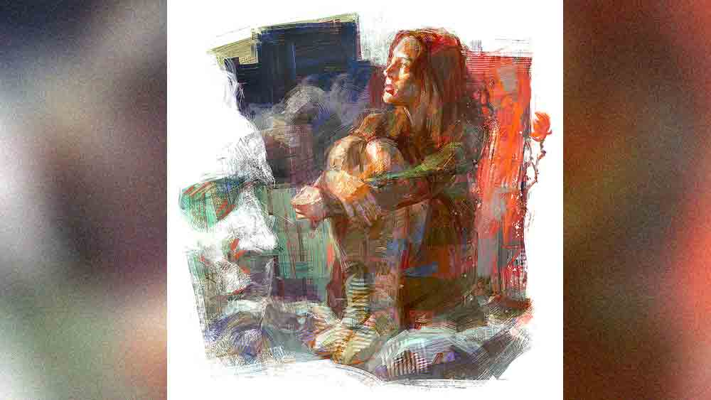

 

<h1 align=center>short story: প্রহেলিকা</h1>
<h2 align=center>শীর্ষক বন্দ্যোপাধ্যায়</h2>
লুম্বিনি পার্ক লুনাটিক অ্যাসাইলামের ৩ নম্বর কনডেমড সেল। ২২ বছরের শিরিন সেখানে আষ্টেপৃষ্ঠে বাঁধা। মুখে চোস্ত ইংরেজিতে গালিগালাজ— “হেই! কাম অন ম্যান, ওপন ইট ইমিডিয়েটলি... আই কান্ট টেক ইট এনি মোর! স্কাউন্ড্রেলস! আই উইল সি ইউ অল... ইউ ডোন্ট নো মি... ইউ অল উইল হ্যাভ টু পে ফর ইট... সোয়াইন!”— সে বদ্ধ উন্মাদ।   ‘মোস্ট ভায়োলেন্ট’ পেশেন্টদের এই সেলে রাখা হয়। চলে ইলেকট্রিক শক। কাচের দেওয়ালের এ পার থেকে দেখছিল সন্দীপন। অজান্তেই তার দু’চোখ ভরে আসছিল জলে।   না, এই শিরিনকে সে চেনে না। চিনত না কোনও দিন।   “টাইম ইজ় ওভার।”   গার্ডের কথায় সংবিৎ ফেরে তার। বেরিয়ে আসে অ্যাসাইলাম থেকে। গাড়িতে ফিরতে ফিরতে কখন যেন সে ফিরে যায় তার অতীতে।   “হাই! দিস ইজ় শিরিন...”   একটু চমকে উঠেছিল সন্দীপন। সন্দীপন ব্যানার্জি, ডেপুটি কমিশনার, ক্রাইম ব্রাঞ্চ, লালবাজার। বেঙ্গলি ম্যাট্রিমনি সাইট থেকে দিদিয়া যে মেয়েটার ছবি দেখিয়েছিল, তার সঙ্গে তো মিলছে না! সে ছিল শাড়ি পরা, গুডি গুডি, বিশুদ্ধ ভারতীয় নারী।   আর যে সামনে দাঁড়িয়ে, তার পরনে ফেডেড থ্রি-কোয়ার্টার রিপ্ড জিন্‌স, ব্ল্যাক ডেনিমের টি-শার্ট, মাশরুম-কাট লালচে-বাদামি রং-করা চুলগুলো ক্লিপ দিয়ে আটকানো, পিঠে ব্যাকপ্যাক, মুখে চিউয়িং গাম, গভীর কালো চোখ দুটো চঞ্চল।   “কী হল মিস্টার?” মোমরঙা হাতটা তখনও বাড়ানো।   “ও ইয়েস! হাই! দিস ইজ় সন্দীপন,” হাত বাড়িয়ে দিল সন্দীপন।   “আর ইউ নার্ভাস?” হাসছিল শিরিন। হাসলে বাঁ দিকের গজদাঁত দেখা যায়। ভারী সুন্দর লাগে।   “নট অ্যাট অল।”   “ইউ আর সোয়েটিং।”   লাল হয়ে গেল সন্দীপনের ফর্সা মুখ। কফি শপের চিলিং এসির মধ্যেও ঘামছিল ও। দিদিয়া ঠিকই বলে, “যতই ম্যানলি, স্মার্ট হোস না কেন, তেমন মেয়ে সামনে এলে সব ছেলেরাই হাঁদারাম।”   দিদিয়ার আগ্রহেই ম্যাট্রিমোনিয়াল সাইটে নাম রেজিস্টার করিয়েছিল সন্দীপন। তার পর অনেক ঝাড়াই বাছাই করে এই মেয়েটিকে পছন্দ করেছিল। অ্যাপয়েন্টমেন্ট ফিক্স করেছিল দিদিয়াই।   সঞ্চারী সেনগুপ্ত ওরফে শিরিন। ইংলিশ এমএ পড়ছে। যাদবপুর ইউনিভার্সিটি, সেকেন্ড ইয়ার।   “লেটস হ্যাভ কফি... আমি বলব?” বলল শিরিন।   সন্দীপনের ভাল লেগেছিল শিরিনকে। ভাল লেগেছিল ওর পাহাড়ি ঝরনার মতো উচ্ছল, স্বচ্ছ স্বভাব। কিছুটা ইন্ট্রোভার্ট হলেও পুলিশি খাকি পোশাকে দারুণ ম্যানলি, টানটান, নির্মেদ সন্দীপনকেও ভাল লেগেছিল শিরিনের। সব থেকে ভাল লেগেছিল রিমলেস লেন্সের আড়ালে ঝকঝকে বুদ্ধিদীপ্ত দুটো চোখ। তার পর কয়েক মাসের ব্যবধানে দু’জনে বিয়ের সিদ্ধান্ত নেয়। শান্ত, গভীর, সন্দীপন এলোমেলো হয়ে যায় দামাল শিরিনের ঝাপটায়। তার ব্যস্ত শিডিউলে মাঝে মাঝেই বর্গির মতো এসে পড়ত শিরিন। সন্দীপনের বাইকে সওয়ার হয়ে পৌঁছে যেত নলবন, সেন্ট্রাল পার্ক, গাঁধী ঘাট।   কিন্তু জীবন তার নিজের মতো বয়ে চলে। জীবনের নানা অজানা পাকদণ্ডী, অচেনা গলিঘুঁজিতে অপেক্ষা করে হরেক বিস্ময়, নতুন অভিজ্ঞতা। আর জীবন নামক প্রবাহের সবচেয়ে রহস্যময় চরিত্র নারী। মালকোষ বা বেহাগ রাগের মূর্ছনা যে ভাবে ছড়িয়ে পড়ে হৃদয়ের তন্ত্রীতে তন্ত্রীতে, সুন্দরী নারী সে ভাবেই পুরুষের মন বিবশ করে দেয়। যতটা দেখা যায়, তার চেয়েও বেশি থেকে যায় না-দেখা। খুব কাছের নারীও তার আঁচলে লুকিয়ে রাখে কোনও না কোনও গোপন কৌটো।   বরাবরের ভাল ছাত্র, ২৯ বছরের সন্দীপন এমবিএ করে অটোমোবাইল ইঞ্জিনিয়ার হওয়া সত্ত্বেও বেছে নিয়েছিল পুলিশের চাকরি। ঝাঁ-চকচকে কেরিয়ার গ্রাফ আর ঝকঝকে চেহারার জন্য মেয়ে কম আসেনি সন্দীপনের জীবনে, কিন্তু শিরিন ছিল সম্পূর্ণ আলাদা।      হিউম্যান ট্র্যাফিকিং-এর একটা কেসে কয়েক দিনের জন্য বাইরে যেতে হয়েছিল সন্দীপনকে। কলকাতা-সহ উত্তর ২৪ পরগনা, হাওড়া, দক্ষিণ ২৪ পরগনা থেকে হতদরিদ্র পরিবারের অনেক মেয়ে বর্ডার পেরিয়ে পাচার হয়ে যাচ্ছিল আড়কাঠি মারফত, দুবাই, আবু ধাবি, পাকিস্তানের করাচি বা আরব দেশে। কলকাতা আর জেলা পুলিশের যৌথ রেডের দায়িত্বে ছিল সন্দীপন। তেমন সাফল্য না পাওয়া গেলেও কয়েকটি মেয়েকে উদ্ধার করা হয় পেট্রাপোল সীমান্তের একটি রিসর্ট থেকে। রিসর্ট এর মালিক ও স্থানীয় কয়েক জন গ্রেফতার হলেও ধরাছোঁয়ার বাইরে থেকে যায় আসল অপরাধীরা।   “এরা নেহাতই মোস্ট পেটি ক্রিমিনাল। কিংপিনস আর আউট অব আওয়ার রিচ...” বলছিলেন এস পি।   রাত সাড়ে এগারোটা। সার্কিট হাউসের বিস্তৃত টেরাসে একা সন্দীপন। দূরে বিএসএফ ক্যাম্পের আলো। আরও দূরে কাঁটাতারের ও পারে গভীর অন্ধকারে ইতিউতি আলোর রেখা। ওটা বাংলাদেশ।   কতই বা বয়স মেয়েগুলোর, আঠেরো-উনিশ বড়জোর। অপুষ্ট, শীর্ণ চেহারাগুলো ভয়ে জড়োসড়ো। শুধু দু’বেলা দু’মুঠো খেতে পাওয়ার জন্য, একটু ভাল থাকার জন্য ওরা হারিয়ে যায় অন্ধকারে। বেশির ভাগেরই খোঁজ পাওয়া যায় না, কেউ কেউ ফিরে এলেও স্থান হয় রেড লাইট এরিয়ায়। সমাজ ওদের নাম দেয় বেশ্যা— ভাবছিল সন্দীপন।   আকাশটা অন্ধকার। ঠান্ডা হাওয়ায় চোখ লেগে আসছিল সন্দীপনের। সারা দিন খুব স্ট্রেস গেছে। এ বার শুয়ে পড়বে ভাবছিল। হঠাৎ মোবাইলটা বেজে উঠল। ফোনের স্ক্রিনে ভেসে উঠল দিদিয়ার নাম। ফোনটা রিসিভ করতেই ও পার থেকে দিদিয়ার কাঁপা কাঁপা গলা, “ভাই, শিরিনের বাবা সুইসাইড করেছেন!”   “কী বলছিস!” নিজের কানকেও বিশ্বাস হচ্ছিল না সন্দীপনের, “তুই ঠিক জানিস? কী হয়েছিল?”   “জানি না। আমি তোদের বিয়ের ব্যাপারে কথা বলতে ওদের ল্যান্ডলাইনে ফোন করেছিলাম, বহু বার বাজার পর কে যেন ধরল, সেই বলল। আর কী অদ্ভুত! খবরটা জানিয়েই ফোনটা কেটে দিল!” বলল দোয়েল, সন্দীপনের দিদিয়া।   “শিরিনকে ফোন করেছিলি?”   “হ্যাঁ, কিন্তু ওর মোবাইল তো অনেকক্ষণ ধরে সুইচড অফ।”   সব কিছু তালগোল পাকিয়ে যাচ্ছিল সন্দীপনের। দিদিয়া ফোনটা ছেড়ে দেওয়ার পর ও পাগলের মতো চেষ্টা করেছে শিরিনকে ধরার। পারেনি। কী হল হঠাৎ? মাথায় ঢুকছিল না কিছু। শিরিনের বাবা ছিলেন রিটায়ার্ড ব্যাঙ্ক অফিসার। অত্যন্ত ভদ্র। সন্দীপনের সঙ্গে শিরিনের সম্পর্ক নিয়ে খুব খুশি হয়েছিলেন, নিজে হাতে বিয়ের কেনাকাটা করছিলেন। শিরিন একমাত্র মেয়ে, তাই বাবার চোখের মণি ছিল সে। সেই লোক হঠাৎ... মিলছে না, হিসেব মিলছে না।   সারা রাত আর ঘুম আসেনি সন্দীপনের। সকাল হলেই বেরিয়ে পড়বে ভাবছিল, এমন সময় আবার মোবাইলটা বেজে উঠল। সাত্যকি জানা, ওসি, সাইবার সেল, কলকাতা পুলিশ কলিং। সাত্যকি সন্দীপনের ঘনিষ্ঠ বন্ধু। শিরিনের সঙ্গে সন্দীপনের সম্পর্কটাও ওর জানা। সন্দীপনই এক দিন আলাপ করিয়ে দিয়েছিল।   “সন্দীপন, এটা কী হল বল তো! আই কান্ট বিলিভ ইট। শিরিন কী করে এ রকম করতে পারল!” উত্তেজিত স্বরে বলছিল সাত্যকি।   চমকে ওঠে সন্দীপন, “মানে! কী বলছিস তুই! কী করেছে শিরিন?”   “শি ইজ় আ ব্লাডি এসকর্ট! কলকাতার একটা ফাইভ স্টার মাসাজ পার্লার থেকে ও ওর ক্লায়েন্টের সঙ্গে একেবারে রেড হ্যান্ডেড ধরা পড়েছে। নেশায় চুর অবস্থায়। সঙ্গে আরও হাই সোসাইটি কলগার্লরা ছিল। হার ফাদার হ্যাজ় কমিটেড সুইসাইড।”   সাত্যকির শেষের দিকের কথাগুলো আর শুনতে পাচ্ছিল না সন্দীপন। তার পায়ের তলার মাটি সরে গেছে। তত ক্ষণে ইলেকট্রনিক মিডিয়া আর সোশ্যাল মিডিয়ায় খবরটা ভাইরাল।   সার্কিট হাউস থেকে সন্দীপন সে দিন সরাসরি চলে এসেছিল হেডকোয়ার্টার্সে। বিধ্বস্ত ভাঙা মন নিয়ে ডেকে নিয়েছিল সাত্যকিকে। সাত্যকি বলছিল, “যারা অ্যারেস্টেড হয়েছে, সব সম্ভ্রান্ত পরিবারের মেয়ে। এদের মধ্যে হাউসওয়াইফ আছে, কলেজ স্টুডেন্ট, স্কুলগার্লও আছে। এদের এক-একটা খেপ লক্ষ টাকায় বিকোয়। পেট চালানোর জন্য এরা এ কাজ করে না, উদ্দেশ্য একটাই, অল্প সময়ে প্রচুর টাকা কামানো, যা অন্য কোনও ভাবে আর্ন করা যাবে না। শুধু টাকাই নয়, আশি হাজারের মোবাইল, ফাইভ স্টার হোটেলে ডিনার, স্কচ, শ্যাম্পেন, এক্সপেনসিভ ডিজ়াইনার ড্রেসেস, মরিশাস, মলদ্বীপে উইকএন্ড আরও কত কী...”   আস্তে-আস্তে স্বাভাবিক হওয়ার চেষ্টা করছিল সন্দীপন। শিরিনের সঙ্গে কাটানো সময়টা তার জীবনের একটা কালো দাগ ভেবে ভুলে যেতে চেয়েছিল, কিন্তু ভুলতে পারল কোথায়! সারা দিন কাজের মধ্যে নিজেকে ডুবিয়ে রাখত, কিন্তু রাতে কিছুতেই ঘুম আসত না। চোখ বন্ধ করলেই শিরিনের সঙ্গে কাটানো মুহূর্তগুলো, তার হাসি, কথা, ঠোঁটের তিল, সব জলছবির মতো ভেসে উঠত 
চোখের পর্দায়।   মানুষের মন বড় জটিল। শিরিন থেকে গেছিল সন্দীপনের মনের গভীরে। আর যোগাযোগ করেনি সন্দীপন। শিরিনও করেনি।   সময় এবং স্রোত কারও জন্য অপেক্ষা করে না। জীবন নিজের নিয়মে চলে। সন্দীপন আরও বেশি ব্যস্ত হয়ে পড়ল নিজের কাজে। শিরিনের জামিন হয়ে গিয়েছিল। সার্ভে পার্কের বাড়ি বিক্রি করে মেয়েকে নিয়ে শিরিনের মা উঠে গিয়েছিলেন উত্তর কলকাতার সিঁথিতে, একটি দু’কামরার ফ্ল্যাটে। একমাত্র মেয়েকে ফেলে দিতে পারেননি প্রৌঢ়া। পুরনো পাড়ায় কান পাতা যাচ্ছিল না। সিঁথিতে সমাজবিবর্জিত অভিশপ্ত পরিবারের মতো বসবাস করত ওরা। কলেজ ছেড়ে দিয়েছিল শিরিন...      সে দিন অন্ধকার তখনও পুরোপুরি কাটেনি, পূর্ব দিক আস্তে আস্তে লাল হয়ে আসছে। সন্দীপন জিম থেকে জগিং সেরে বাড়ি ফিরছিল সকাল ছ’টায়। এক কাপ কফি নিয়ে খবরের কাগজে চোখ বোলাতে গিয়ে তৃতীয় পাতায় একটা ছোট খবরে ওর চোখ আটকে গেছিল— বরাহনগরে প্রৌঢ়া খুন, ধৃত কন্যা নির্বিকার।   এ রকম ঘটনা তো কতই ঘটে, কিন্তু এ ক্ষেত্রে মহিলার মেয়ের নাম সঞ্চারী সেনগুপ্ত বলেই থমকে গেল সন্দীপন। নিজের চোখকে বিশ্বাস হচ্ছিল না তার।   মনের সঙ্গে অনেক লড়াই করে শেষ পর্যন্ত সে দিন সিঁথি থানায় গেছিল সন্দীপন। ওসি-কে নিজের পরিচয় দিয়ে পুলিশ কাস্টডিতে থাকা শিরিনের সঙ্গে দেখা করেছিল। লকআপে চুপচাপ বসে থাকা শিরিনকে দেখে চমকে উঠেছিল সন্দীপন। কণ্ঠার হাড় বেরিয়ে গেছে, ফর্সা রঙে কালচে ছোপ, অবিন্যস্ত চুল, কোটরাগত চোখের তলায় গাঢ় কালি। সেই চোখ... যা দেখে এক দিন পাগল হয়ে গিয়েছিল সন্দীপন।   পরনের সালোয়ারের বেশ কিছু জায়গায় শুকনো রক্তের দাগ।   “শিরিন!”... ডাকল সন্দীপন। চোখ তুলে তাকাল শিরিন। ভাবলেশহীন শূন্য সে দৃষ্টি।   শিরিন সে দিন চিনতে পারেনি সন্দীপনকে। ওসি বিনায়ক সেন বলছিলেন, “শি ক্যান রেকগনাইজ় নো ওয়ান। আ পেশেন্ট অব অ্যাকিউট স্কিৎজ়োফ্রেনিয়া। কখনও শান্ত, আবার কখনও এক্সট্রিম ভায়োলেন্ট। দে আর মোস্ট ভায়োলেন্ট অ্যাজ় ওয়েল অ্যাজ় আনপ্রেডিক্টেবল টু। হঠাৎ যে কোনও ইনসিডেন্ট ঘটিয়ে ফেলতে পারে, এমনকি মার্ডারও। হাইলি ট্রমাটাই‌জ়ড ডিউ টু হার পাস্ট হিস্ট্রি। ওর বাবার আত্মহত্যার ঘটনাও আছে। লাস্ট ছ’মাস বন্ধ ঘরে বসে থেকেছে। কোথাও বেরোয়নি।”   পরে পুলিশ ফাইল থেকে সন্দীপন জেনেছিল, ধারালো ব্লেড দিয়ে গলার নলি কেটে নিজের মাকে খুন করেছিল শিরিন, তার পর সারা গায়ে রক্ত মেখে মৃতদেহের পাশে রক্তের মধ্যেই বসেছিল। সকালে খবরের কাগজওয়ালা ফ্ল্যাটের দরজা খোলা পেয়ে প্রথম এই দৃশ্য দেখে। তার পর থানা, পুলিশ। না, পালানোর চেষ্টা করেনি শিরিন। সে তখন বদ্ধ উন্মাদ। পর দিন কোর্টেও উপস্থিত ছিল সন্দীপন। বিচারে দোষী সাব্যস্ত হয় শিরিন। সারা ক্ষণ কোর্ট লকআপে নীচের দিকে তাকিয়ে পাথরের মতো বসেছিল। নিশ্চুপ, নির্বিকার। কোর্টের নির্দেশে মেন্টাল অ্যাসাইলামে পাঠানো হয়েছিল তাকে।   সন্দীপন মেন্টাল অ্যাসাইলাম থেকে ওর নিউ টাউনের আবাসনে যখন ফিরল তখন সন্ধ্যা নামছে। আবাসনের উল্টো দিকের বিস্তৃত মাঠে অন্ধকার হয়ে আসছে। হাজারো পাখি ঘরে ফিরছে। দূরে সিল্যুয়েটের মতো হাইরাইজ়গুলোয় আলো জ্বলে উঠছে। এখানে বসন্ত ঋতুটাকে অনুভব করা যায়। ভোরে হালকা কুয়াশা থাকে, পলাশ, শিমুল, কৃষ্ণচূড়ার লাল বসন্তের বার্তা বহন করে।   “স্যর বাড়ি এসে গেছি।”   ড্রাইভারের ডাকে বর্তমানে ফিরে আসে সন্দীপন। স্মৃতি সতত সুখের হয় না, যন্ত্রণারও হয়। সন্দীপন তার যন্ত্রণার উৎসমূলে গিয়ে খোঁজার চেষ্টা করছিল, শিরিন কেন এমন করল।   শুধুই কি লোভ? সমস্ত ভোগ্যপণ্য যে কোনও মূল্যে করায়ত্ত করার আগ্রাসী আকাঙ্ক্ষা? আর ওই মেয়েগুলো? যারা প্রতি রাতে হাতবদল হয়, যারা পাচার হয়ে যায় অন্ধকারে, যাদের ঘরে অনেকগুলো পেট, দাউদাউ খিদের আগুন, যাদের অসহায়তার সুযোগ নিয়ে সমাজ, রাষ্ট্র মুহূর্তে মেয়ে থেকে মেয়েছেলে হিসেবে চিহ্নিত করে দেয়, মিডিয়া মশলামুড়ির মতো যাদের খবর বিক্রি করে টিআরপির জন্য, তাদের সঙ্গে তোমাদের কত তফাত শিরিন!   ভাবছিল সন্দীপন, ‘কী পেলে শিরিন? একটা উজ্জ্বল সম্ভাবনা, সুন্দর ভবিষ্যৎ, সবই তো অপেক্ষা করছিল তোমার জন্য। তুমিই তো ছিলে আমার মানসী। তোমার সঙ্গেই তো প্রথম একা থেকে দোকা হবার স্বপ্ন দেখেছিলাম আমি। তা হলে কেন এ রাস্তা বেছে নিলে? কিসের আশায়?’   সন্দীপন বোঝে, উত্তর না মেলা এই প্রহেলিকা বুকে নিয়েই তাকে কাটাতে হবে বাকি জীবন।      
