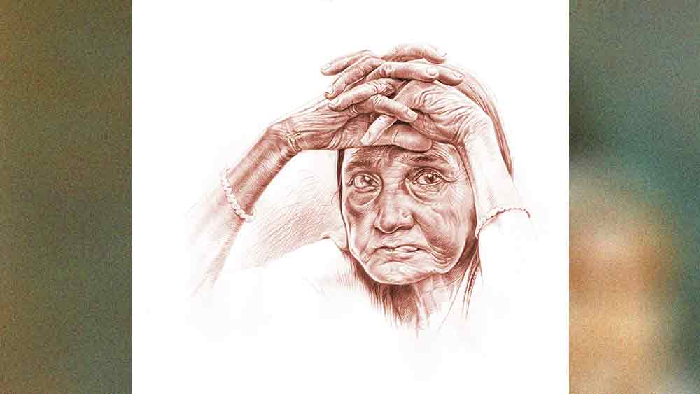

 

<h1 align=center>short story: বিলকিস বেওয়া</h1>
<h2 align=center>শুভজিৎ ভাদুড়ী</h2>
পঞ্চানন্দপুর সুকিয়া হাইস্কুলের মাঠে কী একটা সরকারি ক্যাম্প বসেছে শুনে বিলকিস বেওয়া পড়ি কি মরি ছুটল। ভাঙা ঘরের দরজায় কোনওমতে একটা তালা ঝুলিয়ে, বাঁশঝাড় পেরিয়ে, আমবাগান পেরিয়ে, স্কুলের সামনের বিশাল মাঠ, মাঠের গরু-ছাগল, বাচ্চাদের ছিটকে আসা রবারডিউস বল, ধরা দেওয়া ঘুড়ির সুতো, বাইকের ভোঁ, মহিলাদের রোদ পোহানো আলসেমি সমস্ত পেরিয়ে হনহন করে হাঁটছে বিলকিস। অবশ্য তার হনহন করে হাঁটা মানে পিঁপড়ের দৌড়ানোর মতো। এত বড় মাঠের মধ্যে একটা বিন্দু হয়ে স্কুলের গেটের দিকে এগিয়ে আসছে বিলকিস। এমনিতেই তার চেহারা ছোটখাটো, আর এখন বয়সের ভারে খানিক ঝুঁকে যাওয়ায় আরও ছোট দেখায়। এই গোটা পঞ্চানন্দপুরে তার মতো হতভাগ্য বোধ হয় আর কেউ নেই, বিলকিস ভাবে। না হলে নেতারা, যারা ভোটের আগে পারলে রাস্তার নেড়ি কুত্তাকেও জোড়হাত করে, আকাশের দিকে হাত তুলে এমন ভাবে বরাভয় দেখায়, যেন স্বয়ং খোদা তাকে এই ধরিত্রীর ভার দিয়ে পাঠিয়েছে— সেই তারা পর্যন্ত বিলকিসের দিকে ফিরে তাকায় না! তারা দেখলে কি এই দুর্ভোগ হত! স্কুলের গেট পেরিয়ে বিলকিস হাঁ! কত্ত লোক! টেবিলগুলোর সামনে উপচে পড়া ভিড়।   সরকারি লোকগুলো সব ভিড়ের নীচে চাপা পড়ে গেল না কি! কে জানে বাবা, সরকারি কাজ সারা বছর ঠিকমতো হয় না, আর এই ভোটের আগে এত হুড়োহুড়ি পড়ে কেন! বিলকিসের মোটা মাথায় আবার এ সব ঢোকে না। যাকগে, ঢুকিয়ে কাজও নেই। যে কাজের জন্য এসেছে এখন, সে কাজটা হলেই হয়। ধীরে ধীরে একটা টেবিলের দিকে এগোচ্ছে বিলকিস। হাতে ধরে রয়েছে একটা খয়েরি রঙের খাম। আজ তিন বচ্ছর হল বিলকিসের বর মরেছে। বাজারে সব্জি বেচত লোকটা। বুলগারিন সেখ। পেটের ভেতরে টিউমার না কি হয়েছিল, কলকাতার পিজি হাসপাতালের সামনে পাঁচ দিন পড়ে থাকার পর মরেছে। তিন মেয়ে আর এক ছেলে। মেয়েগুলোকে বিয়েশাদি দিয়ে পার করেছে। ছেলেটা কাছেই থাকে। কাছে থাকে না ছাই! ওকে নিয়েই তো যত অশান্তি। কী করে তার ঠিক নেই, কোনও কাজই একটু বেশি দিন ধরে ধৈর্য ধরে করতে পারে না।   এক বার অটো চালাতে নিল, কিন্তু কয়েক মাস পরে আর পারল না। বাজারে একটা কাপড়ের দোকানে বসত, সেটাও বড়জোর তিন মাস। সব কাজেই একটু দড় হতে, সড়গড় হতে, বুদ্ধি খাটিয়ে লাভ করতে একটু সময় লাগে তো না কি! এই যে মানুষের উন্নয়নের কাজ যারা করেন, এঁরাও কি ভোটে জিতে এসে সঙ্গে সঙ্গে কাজ শুরু করতে পারেন না কি? সব বুঝেশুনে নিতেই কত সময় চলে যায়, আবার ভোটের বছর এলে বুদ্ধি খোলে। কিন্তু ছেলেকে কে বোঝাবে এ সব কথা! শুনছে এখন নাকি আবার পার্টি-পলিটিক্সে চামচাগিরি করে। তা হতেও পারে, আশ্চর্যের কিছু নেই।   এ সব ভাবতে ভাবতে ছোটখাটো চেহারার বুড়ি বিলকিস বেওয়া ভিড়ের ফাঁকফোঁকর গলে একটা টেবিলের কাছে পৌঁছয়, “ও বাবা, ও বাপধন শুনছ...”   “বিধবা ভাতা এই টেবিলে না, পাশের টেবিলে যান, পাশের টেবিলে।”   “না না, ভাত্তা না বাবা, আমার এই কাগজটা একটু দেখো, তুমি আমার ছেল্যার মতো।”   “এখন দেখছেন তো কত ভিড়, বিরক্ত করবেন না, কী আছে ওই কাগজে?”   “আমার জমি...” কথা শেষ হয় না বিলকিসের।   “জমির কাজ এখানে না, কৃষক বন্ধু ওই দিকে।”   “না, না, আমার তো বাস্তুজমি...” ভিড়ের ঠেলা খেয়ে একটু সরে যায় বিলকিস। ঢিল-খাওয়া কুকুরের মতো একটু কুঁইকুঁই করে কাঁদে। তার পর আবার পাশের টেবিলের দিকে যাওয়ার জন্য পা বাড়ায়।   এই খয়েরি খামের ভেতর রাখা কাগজটা বিলকিসের হাতে এসেছে মাস তিনেক মতো হল। অবশ্য তা এমনি এমনি উড়ে আসেনি। ভাঙা দরজায় তালা মেরে তার জন্য বিলকিস বেওয়াকে কত ছোটাছুটি করতে হয়েছে। এ সব কিছুই হত না, যদি বিলকিসের ছেলের সঙ্গে সে দিন বাওয়ালটা না বাধত।   অবশ্য বাওয়াল হয়ে ভালই হয়েছে, না হলে তো এত কথা বিলকিসের অজানা থেকে যেত। দু’কামরার টিমটিমে ঘরের একটায় থাকে বিলকিস, আর একটায় ছেলে। গত কয়েক মাস ধরেই বিলকিস দেখছে, ছেলে থেকে থেকেই বাড়ি ফেরে রাত করে, মুখ দিয়ে ভড়ভড় করে বাংলা মদের গন্ধ বেরোয়।   ঘরের খাবার রোচে না, খালি গায়ে চৌকির ওপর শুয়ে ভোঁস ভোঁস করে ঘুমোয় আর ডাকলেই মুখ খারাপ করে। মা বলে যে বিশেষ রেয়াত করে, এমনটা নয়। বলে পার্টি করলে নাকি এ সব করতে হয়। নেতাদের সঙ্গে ওঠাবসা বলে কথা। তবে শেষ পর্যন্ত চুপ থাকতে পারে না বিলকিস। তার এই বুড়ি বয়সে সব্জি বেচার ধকল আর সামান্য ক’টা টাকা রোজগার, অন্য দিকে জোয়ান মদ্দ ছেলে কামধান্দা ছেড়ে নেশা ধরবে! বলার মধ্যে বিলকিস বলেছিল, “এই রকম চলতে থাকলে এই বাড়ি ছ্যাড়ড়া চলে যা, লিজের ব্যবস্থা লিজ্জে করে লিবি।”   ব্যস তখনই, স্বপ্নেও ভাবেনি বিলকিস, ছেলে ফোঁস করে উঠে বলে, “বাড়ি তুহার? এই বাড়ি এখন আমার বে। তুই লিজ্জে অন্য জায়গায় থাকগে যা!”   কী! এত্ত বড় কথা! কিছু বলতে যাবে বিলকিস এমন সময় বেবাক হাঁ। ছেলে ওর মুখের ওপর একটা কাগজ ছুড়ে মেরেছে। পরচা। হ্যাঁ, ওই তো জ্বলজ্বল করছে ওর নাম। খাতির আলি। তিন শতক জমি। চৌকিতে শুয়ে কিছু ক্ষণ খ্যানখ্যান করে কাঁদে বিলকিস।   কিন্তু সারা জীবনে সে যেমন প্রচুর চোখের জল ঝরিয়েছে, ঘামও তো কিছু কম ঝরায়নি। তাই পরদিন সকালে বাজারের পাট সেরে বিলকিস গেল আপিসে। কিছু ক্ষণ এর পায়ে তার পায়ে কুত্তা-বিল্লির মতো ঘুরঘুর করে শেষমেশ জানতে পারল, সত্যিই তার বসতবাড়িটুকু তার স্বামীর নাম থেকে তার ছেলের  নামে হয়ে গিয়েছে। আশ্চর্য! এ কেমন কথা! লেখাপড়া না জানা থাক, দেশ-দেশান্তরের হাল হকিকত না জানা থাক, বিলকিস এটুকু জানে, স্বামীর বাড়িতে স্বামী চলে যাওয়ার পর ছেলেমেয়েদের সঙ্গে তারও একটা অংশ থাকে। তাকে অন্যায় ভাবে সরিয়ে দিয়েছে তার নিজেরই পেটের ছেলে। কিন্তু বুঝতে পারলে কী হবে, কথা ভাল ভাবে গুছিয়ে বলার মতো বিদ্যে থোড়াই আছে বিলকিসের। সে সাদা কাগজের ওপর নীল কালিতে ছাপা তার স্বামীর নামের পুরনো পরচা নিয়ে এর ওর পায়ে পায়ে ঘোরে। মিনমিন করে কথা বলে। কুঁইকুঁই করে কাঁদে। কাজের কাজ কিছু হয় না। সবাই খ্যাদায়। বুড়ি অফিসের সামনে উবু হয়ে বসে থাকে কিছু ক্ষণ। তার পর একটু উঁচু করে পরা শাড়ির ঘেরের নীচে দৃশ্যমান সরু লিকলিকে দুটো পা ফেলে বাড়ির দিকে হাঁটে।   রাস্তার নুড়ি-কাঁকরে তার প্লাস্টিকের চটিতে চটচট শব্দ হয়। হাঁটতে হাঁটতে অদৃষ্টকে দোষারোপ করে বুড়ি। অজানা ভবিষ্যতের ভয়ে বুক চিনচিন করে। এ ভাবেই কাটছিল দিন। বুড়ি থেকে থেকে সরকারি অফিসে আসে। ঘ্যানঘ্যান করে। খ্যাদানি খায়। চলে যায়। ঘরে চুপ করে থাকে।   এ রকম চলতে চলতেই কে যেন এক দিন অফিসে শুনতে পেল বিলকিসের কথা। অফিসের কেউ নয়। বাইরের কোনও সহৃদয় ভদ্রলোক হবেন বোধ হয়। দয়াপরবশ হয়ে একটু কৌতূহল দেখাতেই বিলকিস “বাবা আমার, ধন আমার...” করে সবটা বলল। মানে যতটা পারল গুছিয়ে আর কী।   সে লোকটা খসখস করে সাদা কাগজে কী যেন লিখে দিল। বলল নীচে সই করে অফিসে জমা করতে। বিলকিস বাংলা মোটামুটি পড়তে পারে। টিপসই করে সবটা এক বার পড়ার চেষ্টা করল ও। লিখেছে যে, কী আইনে স্ত্রী বেঁচে থাকতে বুলগারিন সেখের সম্পত্তি ছেলের নামে হল? তার নীচে সম্পত্তির বিবরণ। ওপরে লিখেছে তথ্যের অধিকারের আইন। লোকটা বলেছিল কাগজটা জমা করে মাঝে মাঝে অফিসে এসে খোঁজ নিতে। ওরা লিখে দেবে কী ভাবে কী হয়েছে। তার পর বাকি কাজ। লোকটাকে এর পরে আর কোনও দিন দেখেনি বিলকিস। যত বার অফিসে এসেছে, আজ নয় কাল করে করে শেষ পর্যন্ত অফিস থেকে ওকে খয়েরি খামের মধ্যে করে একটা কাগজ দিয়েছে। যে কাগজটা নিয়ে এখন বিলকিস পঞ্চানন্দপুর সুকিয়া হাইস্কুলের মাঠে এই টেবিল থেকে ওই টেবিলে ঘুরছে।   অবশ্য খামটা পাওয়ার পর থেকে সে যে এত দিন চুপ করে বসে ছিল তা নয়। প্রথমে খাম থেকে বের করে নিজেই দেখেছিল কাগজটা। কিন্তু হায় আল্লা! এ যে দুর্বোধ্য ইংরিজিতে লেখা! কেন যে এরা বাংলায় লেখে না! অবশ্য এই দুর্বোধ্য লেখা দেখে মনে মনে একটা প্রসাদ অনুভব করেছিল ঠিকই। মনে হয়েছিল এখানে এমন কিছু কথা লেখা আছে যেটা দেখালেই বিলকিসের নামে একটা পরচা বেরোবে। আর তখনই বিলকিস আবার ডাঁট দেখিয়ে থাকতে পারবে নিজের ঘরে। ছেলের মুখের ওপর ছুড়ে মারতে পারবে কথা— “লিজের ব্যবস্থা লিজ্জে করে লিবি।”   প্রথমে গিয়েছিল গ্রামের এক মাস্টারের বাড়ি। “দেখ না রে ধন এখানে কী লেখা আছে...” বলে মুখের দিকে তাকিয়েছিল জুলজুল করে। মাস্টার কাগজে এক বার চোখ বুলিয়ে একটু গলা উঁচু করে যাতে বুড়ি শুনতে পায় এমন ভাবে বলল, “এখানে লেখা আছে তুমি যা জানতে চেয়েছ, সেই তথ্য অফিসে নেই।”   “অফিসে নাই! পরচা দেয়নি!” বুড়ি মিনমিন করে কেঁদে বলে, “আমার ছেল্যা আমাকে...”   বিরক্ত মাস্টার বুড়ির মুখের ওপর দরজা লাগিয়ে দেয়। বলে, “এ সব কথা আমায় বলে কী হবে! অফিসে গিয়ে বলো, অফিসে।”   কিন্তু অফিসে গিয়ে যে থই পায় না বুড়ি। তবে ইংরিজি ভাষায় এত খারাপ একটা কথা লেখা থাকবে! কিছুতেই বিশ্বাস করতে পারে না বিলকিস। মাস্টারের ইংরিজি জ্ঞানের ওপরই সন্দেহ হয় তার। পাড়ারই আর এক জন বাবুকে দেখিয়েও একই কথা শোনে। কিন্তু মন থেকে সন্দেহ কিছুতেই দূর হয় না। তাই আজকে ক্যাম্পের খবর পেয়ে বুড়ি স্কুলের মাঠে ছুটে এসেছে। এত সরকারি লোক! কেউ এক জন নিশ্চয়ই তাকে ঠিক করে পড়ে দেবে কাগজটায় 
কী লেখা আছে। মাঠের ভেতর ঘুরপাক খায় বুড়ি বিলকিস। কখনও দাঁড়িয়ে বা হাঁটু ভাঁজ করে বসে একটু জিরিয়ে নেয়।   লোকজনের মুখের দিকে জুলজুল করে তাকিয়ে থাকে বিলকিস। অনেকটা পরে একটা টেবিল ফাঁকা দেখে তার দিকে এগোয়, “ও ব্যাটা, এই কাগজটা একটু পড়ে দাও তো আমাকে কী লেখা আছে।”   খাম থেকে বার করে কাগজটা লোকটার মুখের কাছে ধরে বিলকিস।   “তথ্যের অধিকার আইনে তথ্য জানতে চেয়েছিলেন?”   অতটা না বুঝেই সম্মতিসুচক মাথা নাড়ে বিলকিস, বলতে শুরু করে, “আমার ছেল্যা...”   লোকটা হাত দেখিয়ে থামতে বলে। তার পর বলে, “এখানে লেখা আছে, তুমি যা জানতে চাইছ সেই তথ্য অফিসের কম্পিউটার ডেটাবেস-এ নেই।”   “কম্পুটারে নাই! আমারে পরচা দেয় নাই?”   লোকটা আর কথা বলে না। টেবিলে ছড়িয়ে থাকা কাগজ গোছাতে ব্যস্ত হয়ে পড়ে। আপনমনে কিছু ক্ষণ বিড়বিড় করে বুড়ি বিলকিস স্কুলের মাঠ থেকে বেড়িয়ে আসে। সামনের বিশাল বড় মাঠটায় এখন পড়ন্ত বেলার রোদের আভা। দূরে বাঁশঝাড়ের মাথা চিকচিক করছে। রোদ-পোহানো মেয়ে-বৌগুলো উঠে চলে গেছে। বাচ্চারা খেলছে এখনও। ইতস্তত বিক্ষিপ্ত ভাবে ছড়িয়ে-ছিটিয়ে লোকজন জটলা করছে কোথাও। ক্লান্ত লাগে খুব। দু’পায়ের পাতায় ভর দিয়ে হাঁটু ভাজ করে জড়সড় হয়ে একটু বসে বুড়ি।   মনে পড়ে, আজ থেকে বহু দিন আগে এ রকমই এক ভিড়ের মাঝে বসেছিল বিলকিস। তখন অবশ্য সে যুবতী। বিয়ে হওয়ার এক বছরও গড়ায়নি। একটা সদ্যোজাত বাচ্চাকে আঁকড়ে বসে ছিল। ডাক্তার বলছে, সবাই বলছে বাচ্চাটা নাকি মরা। বিলকিসের বিশ্বাস হচ্ছিল না।   দশ মাস পেটের ভেতর তিলতিল করে বেড়ে ওঠা বাচ্চা মরা কেমন করে হয়!   সে দিন আর এই দিনে কত মিল। এ রকম একটা মরা কথা লেখা আছে ইংরিজিতে! বিলকিসের কিছুতেই বিশ্বাস হচ্ছে না। তবে পার্থক্যও আছে। সে দিন বুলগারিন সেখ ওর পাশে ছিল। আর আজ! হঠাৎ করেই খুব একা লাগে বিলকিসের।   সে ক্যাম্প-ভাঙা ভিড়ের মধ্যে খয়েরি রঙের খামটাকে মৃত সন্তানের মতো আঁকড়ে ধরে বসে থাকে। বসেই থাকে।