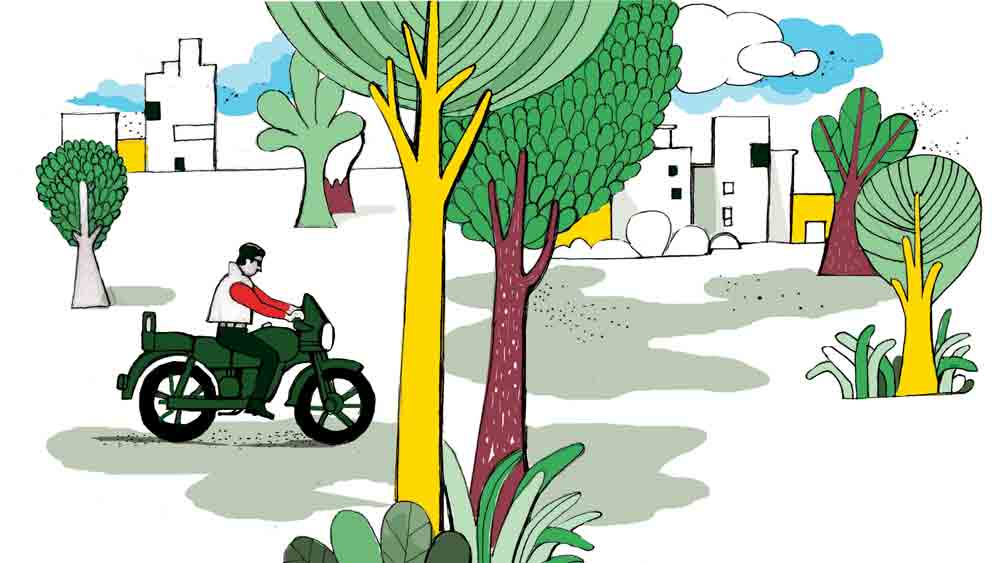

 

<h1 align=center>short story: বিস্ময়চিহ্ন</h1>
<h2 align=center>বাসুদেব মালাকর</h2>
আসুন, আসুন সুতোবাবু!”   “খুব দুঃখ পেলাম, মধু! তুমিও আমায় সুতোবাবু বলছ!”   “সবাই যে বলে! আপনি কি তাতে রাগ করেন?”   “রাগ নয়... তবে নামটাকে এ ভাবে... যাকগে, বাদ দাও!”   পঁচিশ বছর আগে সুতপনকে এই নামে ডাকলে মধুর কপালে দুঃখ ছিল! তার এত সুন্দর নামটাকে ভেঙে সুতো বানাবার হিম্মত ছিল না কারও।   মধুর দোকানের বেঞ্চিতে বসে সুতপন চায়ের কেটলিটার দিকে তাকিয়ে রইল। সরু নল থেকে বাষ্প বেরিয়ে রোদ্দুরে মিশে যাচ্ছে। ভিতরে জল ফুটতে শুরু করেছে। চা হতে এখনও মিনিট দশেক।   খুব সকাল অবশ্য নেই আর, এগারোটা বেজে গেছে। বাসবীকে বাইকে চাপিয়ে অফিসের সামনে ড্রপ করে, বাইক সিঁড়ির নীচে রেখে এখানে এসেছে সুতপন। বাসবী পিলিয়নে বসে তার কাঁধে হাত রাখে না, বাঁ হাতে গ্রাব রেল আঁকড়ে সারাটা পথ ভয়ে কাঁটা হয়ে বসে থাকে।   এক সময় সুতপনের বাইকের হাত খুব ভাল ছিল। একখানা রয়্যাল এনফিল্ড চড়ে রোয়াব নিয়ে সারা শহর চষে বেড়াত। সাইলেন্সার পাইপ খুলে রেখেছিল। বাইকের শব্দেই বোঝা যেত, সুতপন আসছে। চোখে সানগ্লাস, গলায় মোটা সোনার চেন, ডান হাতে থাকত স্টিলের বালা। সে দিন আর নেই। এত বছর টানা নেশা করে করে স্নায়ু দুর্বল, হাতের ব্যালান্সও ঠিক নেই— প্রায়ই এখানে-ওখানে বাইক ভিড়িয়ে দেয়। তিন-চার বার বাসবী ভুগেছে তার জন্য।   কিন্তু উপায় নেই, ঠিক সময়ে টোটোও মেলে না। তাদের বাড়িটা একটু ভিতর দিকে। মিনিট কয়েক হেঁটে বড় রাস্তায় উঠলে তবে টোটো। ভাড়াও বেশি। বাসবী তাই ভয়ে ভয়েই সুতপনের পিছনে উঠে বসে। ফেরার সময় একাই ফেরে।   সুতপনের বাইকের পিলিয়নটা বাসবীর খুব নিরাপদ মনে না হলেও অন্য একটা লাল বাইকের পিছনে বসে সে খুব আরাম পায়। কিন্তু সে তো আর রোজ রোজ সম্ভব নয়! ছোট এই মফস্সল শহর সহস্রচক্ষু!   এখন একটা মরা নদীর সঙ্গে সুতপনকে খুব মেলানো যায়। একদা বিপুল বিস্তার নিয়ে পাড়ভাঙা ঢেউয়ের নদী— এখন স্রোত হারিয়ে গরু-ছাগল চরানোর মাঠ।  সুতপনও দাপট হারিয়ে এখন কেউটে থেকে জলঢোঁড়া। হাত-পাগুলো সরু হয়ে ভুঁড়িটা ঠেলে উঠেছে, বুকটা বসে গিয়েছে। চুলে-গোঁফে কলপ দিয়ে, টুপি দিয়ে টাক ঢেকে বয়স লুকোনোর একটা ব্যর্থ চেষ্টা আছে যদিও।   বড়লোক বাপের ছেলে সুতপন সময় থাকতে লেখাপড়ার দিকে ঘেঁষেনি। লেখাপড়া শিখে চাকরি-বাকরি না করলেও তার দিব্যি চলে যাবে, এমন দৃঢ় বিশ্বাস ছিল তার। কারণ তার গুষ্টিতে কেউ কখনও চাকরি করেনি। বাইক দাবড়ে, গায়ে ফুঁ দিয়ে বেশ চলেও যাচ্ছিল।      সূর্যমাস্টারের মেয়ে বাসবী স্কুল ছাড়িয়ে কলেজে পা রেখেই উড়তে শুরু করেছে তখন। একটু সুশ্রী বলে এলাকায় তার প্রচুর ভক্ত বঁড়শি ফেলে আছে। এক দিন তো এক জন মরিয়া হয়ে তুলে নিয়ে যাবে বলে রাস্তায় হামলা করেই বসেছিল! সম্ভবত তাকে একটু বেশি লাই দেওয়া হয়ে গেছিল। কয়েক জন ছুটে এসে বাসবীকে বাঁচিয়েছিল সে দিন। আরও নানা কথা বাতাসে উড়ছিল। সূর্যমাস্টার ভেবে ভেবে কূলকিনারা পাচ্ছিলেন না!   বছর দুয়েক এ ভাবে যাওয়ার পর সুতপনের চোখ পড়ল বাসবীর উপর। মেঘে মেঘে বেলা বেড়েছে, ফষ্টিনষ্টি করে সময়ও চলে গিয়েছে—সুতপন তখন আর যুবকটি নয়। সূর্যমাস্টারও তার বয়সের দিকে না তাকিয়ে বিয়েতে রাজি হয়ে গেলেন। বড়লোকের ছেলে বলে জানত সবাই, রাজি না হওয়ার কারণ ছিল না। বাসবীর চালচলন দেখে, 
বয়সের পার্থক্যকে গুরুত্ব দেওয়া বা তলিয়ে খোঁজখবর নেওয়ার মতো পরিস্থিতি ছিলও না। কিছু দিন আগেই তো মুখে চুনকালি পড়তে পড়তে বেঁচে গেছেন মাস্টারমশাই!   বিয়ের কিছু দিন পরে বাসবী টের পেল, সুতপন ভড়ের বাপ সৃষ্টিধর ভড়ের টাকাপয়সার কথাটা আসলে ধোঁকার টাটি। শরিকদের ভিতরে ভাগাভাগির পরে যা পেয়েছিল, অচিরেই সৃষ্টিধর সবটাই প্রায় ফুঁকে দিয়েছিল। সে তালপুকুরে আর ঘটি ডোবার কথা নয়, ডোবেওনি।   সুতপনের সঙ্গে বাসবীর চিন্তাভাবনা, চালচলনেরও আকাশ-পাতাল ব্যবধান। বাসবীর একটু হালকা বই-টই পড়া, নাচ, আবৃত্তির দিকে ঝোঁক ছিল। সুতপনের সে বালাই ছিল না। সে ও সব বোঝে না।   তখনই মেয়েটা পেটে এসে পড়ল। বাচ্চার ঝক্কি, খরচপাতি, দায়দায়িত্বের চিন্তার সঙ্গে, বাসবীর ধারাবাহিক অশ্রদ্ধাজাত শারীরিক প্রত্যাখ্যান, উপরন্তু তার স্ফীত মধ্যদেশ সুতপনের চোখকে আরাম না দিয়ে বরং একটু একটু করে তার দৈহিক নেশা ছুটিয়ে দিতে সাহায্য করল। গর্ভাবস্থার শেষ দিকে সে এক দিন বাসবীকে বাপের বাড়ি পাঠিয়ে দিল। মেয়েটি ভূমিষ্ঠ হওয়ার পরেও আর তাদের খোঁজখবর রাখত না। যথারীতি মেয়ে এবং নাতনির যাবতীয় দায় সূর্যমাস্টারের ঘাড়ে চেপে বসল।   সেই সময় বাসবী অনুভব করল, তার একটা চাকরি খুব দরকার। না হলে মেয়ে নিয়ে তাকে অকূল পাথারে ভাসতে হবে। খুব খাটাখাটনি করে সে পিএসসি-র লিখিত পরীক্ষায় উত্তীর্ণ হয়েও গেল। নতুন মাতৃত্বের ফলে তার চেহারায় একটা অন্য রকম জৌলুস এসেছিল, লেখা পরীক্ষাটা একটু কমজোরি হলেও ইন্টারভিউটা সহজেই উতরে গেল।   বাসবী বেশ ভাল একটি সরকারি চাকরি পেয়েছে জেনে সুতপনও আবার শ্বশুরবাড়ি আসা-যাওয়া শুরু করল। সব বুঝেও নিরুপায় সূর্যমাস্টার বাসবীকে বললেন, “কী করবি, মা। সবই কপাল। ফিরিয়ে নিতে চাইছে যখন, চলে যা। আমি, তোর মা তো রইলাম। রোজ দেখা করে আসব।”   বাসবী সুতপনকে খুব আরামে রেখেছে। ব্যাঙ্ক লোন নিয়ে উপর-নীচ মিলিয়ে তিন কামরার ছোট্ট বাড়ি করেছে। সুতপনকে দামি মোবাইল, নতুন বাইক কিনে দিয়ে ঘরে এসি লাগিয়ে দিয়েছে। বিভিন্ন অকেশনে টি-শার্ট, লুঙ্গি, বারমুডা কিনে দিচ্ছে। নিজে কিনে আনতে পারে না বলে মদের দামটা নগদে দেয়। সুতপন সেই টাকা দিয়ে বেশি পরিমাণে সস্তার মাল কিনে আনে।   এই পোড়া দুনিয়ায় ফ্রি-তে কিছু মেলে না। এখানেও মেলেনি। সুতপনের সুখস্বাচ্ছন্দ্যের বিনিময়ে বাসবী কয়েকটা শর্তও আরোপ করেছে। যেমন, তার উপরে কোনও কথা বলা চলবে না, তার কোনও বিষয়ে নাক গলানো যাবে না, কোনও কিছুর কৈফিয়ত চাওয়া যাবে না, কোনও ইচ্ছেয় বাদ সাধা যাবে না, গতিবিধিতে লাগাম পরানো চলবে না ইত্যাদি। মেয়েকেও কাছে রাখেনি বাসবী, হস্টেলে দিয়েছে। এ ঘরে বসে বাপ ঢুকুঢুকু চালাবে, আর পাশের ঘরে মেয়ে পড়াশোনা করে মাদাম কুরি হবে, এমন কথা বিশ্বাস হয়নি বাসবীর। তাই মেয়েকে স্থানান্তরিত করেছে। প্রতি মাসের শেষ রবিবারে হস্টেলে গিয়ে মেয়েকে দেখে 
আসে সে।   সুতপন সানন্দে সব মেনে নিয়েছে। যোগ্যতাহীন হয়েও এমন নিষ্কর্মা আরামের জীবন তার কল্পনার বাইরে। সুতপন তাই বাসবীর কোনও কথা অমান্য করে না। কোথাও যায় না তার সঙ্গে। সে  জানে, তাকে নিয়ে বাইরে বেরোতে লজ্জা পায় বাসবী। আত্মীয়, বন্ধুবান্ধব, কোলিগ— সুতপনকে কারও সামনে তুলে ধরতে জড়তা আছে তার মনে। খুব হালকা করে, দেখা যায়-কি-যায় না টাইপ লুকোচুরি স্টাইলে, যেন আলপিনের ডগায় করে সিঁদুর ছোঁয়ায় সিঁথির ডগে। নেমন্তন্নবাড়ি, নাটক-সিনেমা, হাট-বাজার, শপিং মল— বাসবী সর্বত্র একাই যায়। দূরে, এলাকার বাইরে গেলে লাল বাইক তো আছেই। টোটোয় শহর পেরিয়ে গেলেই পূর্বনির্দিষ্ট জায়গায় সেই লাল বাইকটা এসে পড়ে!   সুতপন গভীর রাতে, বাথরুম থেকে ফেরার সময় বাসবীর বেডরুমের দরজার কি-হোলে চোখ রেখে দেখেছে, বাসবী আলো নিভিয়ে বিছানায় শুয়ে মোবাইলে আঙুল ঘষছে। স্ক্রিনের আলোয় উজ্জ্বল উদ্ভাসিত তার হাসিমুখ!   এক দিন অফিস থেকে বাড়ি ফিরে বাসবী বলল, “শোনো, আজ চিনুমাসিমা ফোনে খুব করে বলল,  সামনের দশ তারিখ মেসোর বাৎসরিক। শ্রাদ্ধে যেতে পারিনি, বাৎসরিকে যেন অবশ্যই যাই।”   “কে চিনুমাসিমা?”   “আরে, আমাদের বাড়ির পাশেই দোতলা বাড়িটা দেখেছ তো? ওটাতেই চিনুমাসিরা থাকত। ছোটবেলা থেকেই আমায় ভীষণ ভালবাসে। অনেক দিন হল, ও বাড়ি ছেড়ে মহেশপুরের গ্রামের বাড়িতে চলে গিয়েছে।”   “মহেশপুর! সেটা কোথায়?”   “নদিয়ায়। কৃষ্ণনগর থেকে বাইশ কিলোমিটার। দশ তারিখ রবিবার। আমি শনিবার সকালেই চলে যাব। সোমবার মে দিবসের ছুটি— মঙ্গলবার ফিরব।”   “বাহ! ভাল সময়ে বাৎসরিক পড়েছে, তোমার ছুটি নষ্ট হবে না। কিন্তু অজ পাড়া-গাঁ, চিনে যেতে পারবে তো?”   “পারব। শান্তি এসে রোজকার মতো তোমার রান্না করে দিয়ে যাবে।”   “ঠিক আছে, যাও।”   “ওখানে টাওয়ার খুব উইক, কারেন্ট সাপ্লাই-ও ইরেগুলার— কখন চার্জ থাকে না থাকে— ফোন করার দরকার নেই।”   শনিবার সকালে সুতপন বাইকে করে বাসবীকে বাসস্ট্যান্ডে ছাড়তে গেল। যদিও বাসবী ওকে বারণ করেছিল। বলেছিল, “একটু পরেই শান্তি এসে পড়বে। দরজা বন্ধ দেখে ফিরে গেলে উপোস করে থাকতে 
হবে তোমাকে!”   “এই তো যাব, তোমাকে নামিয়ে দিয়েই চলে আসব। টোটোয় গেলে খামোকা ষাট টাকা গচ্চা!”   কৃষ্ণনগরের বাস সকালে বেশ খালি। বাসবী জানালার ধারে ভাল সিটই পেল। কলকাতা-সহ বিভিন্ন জেলায় যাওয়ার বাস কপালে গন্তব্য লিখে দাঁড়িয়ে আছে সার দিয়ে। কৃষ্ণনগর পৌঁছতে ঘণ্টা তিনেক। তখনও বাস ছাড়তে মিনিট দশ বাকি। সুতপন বাস থেকে নেমে বাসবীর জানালার কাছে এসে টা-টা করে খুব বিবেচকের মতো দূরে সরে এল। গুছিয়ে বসে কত জায়গায় তার জরুরি ফোন করার থাকতে পারে!   বাসবীর মোবাইলটা খুব দামি। কথা বলার সময় তার নিঃশ্বাসের শব্দ, খাবার চিবোনো, ঢোক গেলা, নাক টানা— সব স্পষ্ট শোনা যায়। চরাচরের সামান্য মৃদু শব্দও যন্ত্রটাকে ফাঁকি দিতে পারে না! সে দিন দুপুরে বাসবী অফিস থেকে ফোন করে জানাচ্ছিল, ফিরতে দেরি হবে। একটু দূরের টেবিলে তার দুই কোলিগ নিচু গলায় কথা বলছিল, ক’টা চড়ুই কিচকিচ করছিল বাইরে— সুতপন ফোনের ভিতর দিয়ে সব কিছু স্পষ্ট শুনতে পাচ্ছিল!   সুতপন অবাক হয়ে ভাবে, মানুষের কী মাথা! হাজার মাইল দূরের স্বর স্পষ্ট শোনা যায়, লেখা পাঠালে মুহূর্তে পৌঁছে গিয়ে জানিয়ে দেয়, সে লেখা পড়া হল কি না! চাইলে কথা বলার সময় একে অন্যকে দেখতেও পায়! চার দিকে শুধুই বিস্ময় আর বিস্ময়! যন্ত্রে ভর দিয়ে মানুষ এক দিন কোথায় পৌঁছবে, ভাবতে ভাবতে তার মাথাটা আউলে যায়! বাসবীই এই বিস্ময় উপহার দিয়েছে! সুতপন মোবাইলটা কোলের উপরে রেখে ভেবেই যায় আর বিস্মিত হয়!   এমন একটা আরামের জীবনও তার কাছে খুবই বিস্ময়ের। কী হওয়ার কথা ছিল আর কী হল। বাইকের তেল এবং পেটের রসদ জোগাতে এক দিন পৈতৃক ভিটের সামনেটা বিক্রির কথা ভাবছিল! ভাগ্যিস সেই সময় বাসবীর সঙ্গে বিয়েটা হয়েছিল! এই বিপুল আরামের জীবনের বিনিময়ে খানিকটা উপেক্ষা, অপমান, অশ্রদ্ধা তেমন বড় কিছু নয়। সপ্তাহের ছ’দিন দুপুরে নিজের হাতে ভাত বেড়ে খাওয়াও তেমন কষ্টকর নয়।      রাত তখন এগারোটার একটু বেশি। সুতপন সে দিন গ্লাসে রোজকার চেয়ে একটু বেশিই নিয়েছিল। হঠাৎ তার মনে পড়ল, বাসবী ঠিকঠাক পৌঁছল কি না, এক বার খোঁজ নেওয়া উচিত। ঘোর পাড়াগাঁয়ের অচেনা পথঘাট। সন্ধ্যার আগে হঠাৎ-হঠাৎ কালবৈশাখী ওঠে! সে যে বাসবীর জন্য চিন্তিত হয়, এটা তাকে জানিয়ে রাখতে পারলে আখেরে আরও ডিভিডেন্ড মিলবে। সে ফোনটা হাতে তুলে নিল। বাসবীর মন ছোট নয়, তাকেও ভাল ফোনই কিনে দিয়েছে।   সুতপন জিজ্ঞেস করে, “ঠিকমতো পৌঁছেছ? কখন পৌঁছলে? পথে কোনও অসুবিধে হয়নি তো?”   তার পর জানতে চায়, “শুয়ে পড়েছ না কি? আলাদা শোবার জায়গা পেয়েছ? তোমার তো আবার একা না শুলে ঘুম আসে না!”   কথা শেষ হতেই ফোনের ভিতরে একটা ডোরবেলের শব্দ শুনতে পেল সুতপন! বাসবী কী একটা বলতে যাচ্ছিল, হঠাৎ থেমে গেল! গমগমে পুরুষকণ্ঠে কে যেন বলল, “কাম ইন!”   “স্যর, আপনি এক্সট্রা পিলো চেয়েছিলেন,” বলে অন্য কণ্ঠ।   কথা তো শেষ হয়ে গিয়েছিল, তবু সময়মতো ফোন কাটেনি কেন বাসবী! বেখেয়াল? হকচকানি? না কি সুতপনের জড়ানো কণ্ঠস্বর শুনে তার শ্রবণশক্তির প্রতি তাচ্ছিল্য?   সুতপন সেই রাত্রির নিস্তব্ধতার দাক্ষিণ্যে ফোনের ভিতরে আরও স্পষ্ট করে শুনতে পেল, খুব কাছ দিয়ে একটা ট্রেন একটানা হুইস্‌ল বাজিয়ে চলে যাচ্ছে!   সুতপনের স্খলিত চেতনা আবারও বিস্মিত হল। অগণিত বিস্ময়চিহ্নে ঢেকে গেল তার চোখ। বিজ্ঞানের বিজয়রথের চাকা কোথায় গিয়ে থামবে! জীবনের কতটুকুই বা জানে সে! কোথাকার কোন ধাপধাড়া মহেশপুর, সেখানেও এখন ডোরবেল বাজিয়ে ঘরে এক্সট্রা বালিশ দিয়ে যায়! আকাশ থেকে নেমে কোন অলৌকিক ট্রেন চলে যায় করুণ আর্তনাদের মতো বাঁশি বাজিয়ে!
