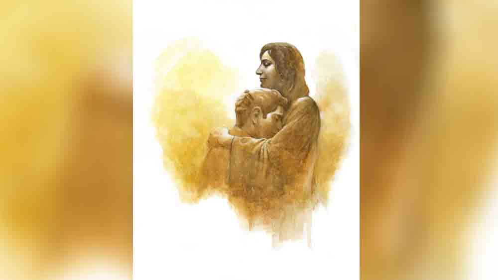

 

<h1 align=center>short story: ভদ্রলোক</h1>
<h2 align=center>সোমা কুশারী বন্দ্যোপাধ্যায়</h2>
বিজয় লোকটা বড্ড সৎ। এযুগে যা যা মেনে চললে খালিপেটে গামছা বেঁধে পড়ে থাকতে হয়, সেই সব পোকা কিলবিল করে বিজয়ের মাথায়। রতন ঘরামির আর এক ছেলে, বিজয়ের ছোটভাই সঞ্জয় জুয়া আর সাট্টা খেলে টুপাইস কামিয়ে নিলেও বিজয় যে তিমিরে ছিল, সে তিমিরেই পড়ে আছে। বেঁচে থাকতে রতন তাই দুঃখ করে বৌকে বলত, “ওকে ইস্কুলে দেওয়াই কাল হল! অমন জোয়ান মদ্দ সারাদিন সততা সততা করে মরে কেন বলো তো? ও নিয়ে কি ধুয়ে জল খাবে?”   সেই কোন যুগে ইস্কুলে পড়েছিল বিজয়, সেখানেই খেলার স্যর ছিলেন শরৎবাবু। উনিই এই সততার ভূতটা ওর মাথায় ঢুকিয়ে গেছেন। বলতেন, “বুঝলি বিজয়, আর সব বাজারে কিনতে পাবি, চরিত্র আর সততার কোনও দোকান নেই রে!”   বহু ধরে-করে রতন ছেলের জন্য জুটমিলে ক্যাজ়ুয়ালের একটা কাজ জুটিয়ে দিয়েছিল, বেশ চলছিল সংসার। বাপ ছেলের বিয়েও দিয়েছিল, কিন্তু ওই সততা দেখাতে গিয়ে সব গেল। হবে না? তুমি বাপু সামান্য এক ক্যাজ়ুয়াল, তুমি যাও সিকিউরিটি অফিসারকে জ্ঞান দিতে? বলে কি না, “স্যর রাতের দিকে ওই পেছনের গেট দিয়ে বেশ ক’টা লরি বেরিয়ে যায় গেটপাস ছাড়াই!”   পাগল নয়? তোর কাজ বস্তা গুছিয়ে রাখা, চা-জল আনা, তাই কর! তা না খোদ সিকিউরিটি অফিসারের খুঁত ধরবিতে গেছে... কাজ টেকে?   তার পর তো শিবানী, মানে বিজয়ের বৌ আয়া-সেন্টারে নাম লেখাল। উপায় কী? পর পর দুটো ছেলে তাদের খাওয়া পরা, নিজেদের দুটো পেট চলবে কী করে?   আবার উঠে পড়ে লাগল বিজয়। মিললও একটা কাজ, নৈহাটি স্টেশনের লাগোয়া ভাতের হোটেলে রাঁধাবাড়ার কাজ, পরিষ্কার পরিচ্ছন্ন ভদ্র বিজয়কে মালিক ভালই বাসত, রাতের দিকে মাঝে-মাঝেই সকালের মুরগির মাংস, মাছের মাথা দিয়ে দিত। গোল বাধল ওর সততার ঠেলায়! কোন ভাতের হোটেল খদ্দেরদের এঁটো থালা থেকে গোটা মাছ কি ডিমভাজা পড়ে থাকলে, ঝেড়েটেড়ে তুলে না রাখে? আরে অন্ন হল লক্ষ্মী, ওসব এঁটোকাটা মানতে গেলে ব্যবসা চলবে? বড় বড় হোটেল ওসব চালিয়ে দেয়, আর রাস্তার পাইস হোটেল করলেই দোষ! তা লোকটা শুনলে তো? বলে কি না, এক জনের এঁটো খাবার অন্যের পাতে দিলে পাপ হবে। ওতে নাকি রোগ ছড়ায়! তা সে কাজও গেল! ক’দিন ঘরে বসে থেকে কাজ জুটল মদের দোকানে। বেশ চলছিল, দুম করে নিজেই এক দিন সে চাকরি ছেড়ে ঘরে বসে পড়ল বিজয়। কেন কী বৃত্তান্ত, কিছুতেই মুখ খোলে না! শেষে শিবানীর তুমুল গালিগালাজের পর মুখ থেকে বেরোল, “ও পাপের পয়সা! কত মড়াখেকো রিকশাওলা, হাড় জিরজিরে ভ্যানওলা, ঠেলাওলা পয়সা দিয়ে ওসব গেলে... বাড়িতে দেখোগে তার বৌ-বাচ্চা হয়তো না খেয়ে মরছে!”   কাজ না থাকায় যে বিজয়ের বৌ-বাচ্চাও পোলাও কালিয়া খাচ্ছে না, সে কথা লোকটাকে কে বোঝাবে?   কেউ কেউ আবার এই সততাকেই দাম দেয়, যেমন ‘নীলদিগন্ত’ আবাসনের সেক্রেটারি বিকাশ গুপ্ত। বিজয়ের বৌ শিবানীকে আজ দু’বচ্ছর সেন্টার থেকে বিকাশ গুপ্তর বাড়িতে রান্নার কাজ দিয়েছে। বরের এমন বেআক্কেলে স্বভাবের কথা দুঃখ করে সে মাঝেমধ্যেই বিকাশের বৌ শমিতাকে বলেটলে। বিকাশও এমন সৎ মানুষ পেয়েই ঢুকিয়ে দেয় আবাসনের কাজে।   শিবানী অবশ্য বেশ জানে, এ কাজেও বেশি দিন টিকতে পারবে না বিজয়। এর মধ্যে পর পর দু’দিন চারতলার বাসিন্দা দুই বৌদির সঙ্গে হেব্বি ঝগড়া বাঁধিয়েছে লোকটা, শমিতাবৌদি বলছিল। শিবানী বিজয়কে ধরতেই বলে, ওরা নাকি ছাদে উঠে ইচ্ছে করে জল নষ্ট করে! রাগে গরগর করে শিবানী, “যা খুশি করুক না! তোমার তাতে কী? ওদের জল ওদের পাম্প ওরা বুঝবে!”   কিন্তু কে শোনে কার কথা। শেষে চারতলার শ্রীবাস্তব আর মৈত্রবাবু যখন বিরক্ত হয়ে তেড়েফুঁড়ে বিকাশবাবুর কাছে  অভিযোগ জানাল, “এই লোকটা কী বলুন তো? ও নিজেকে মালিক ভাবে নাকি?”   শ্রীবাস্তব বলে, “ইতনা সাহস বোলে কি পানি ইতনা খরচ হোনে সে বার বার পাম্প চালানা পড়তা হ্যায়! কামচোর কঁহিকা!”   “আরে না না! ও পাম্প চালাতে হবে বলে এসব বলেনি শ্রীবাস্তববাবু! এত বার পাম্প চালালে বিলের খরচ বাড়বে তাই...”   “দেখুন মশাই! আপনার প্রশ্রয়েই ওর অত বাড়! একটা পাঁচহাজারি ডে গার্ড তার এত অডাসিটি!”   কাল বিজয় সকাল থেকে থম মেরে নীলদিগন্তের ঢোকার মুখে বসে ছিল। বৌয়ের মুখনাড়া এমনি জলভাত হয়ে গেছে কিন্তু বৌ কাল সরাসরি ভাতের খোঁটা দিয়েছে, “এবার কাজ গেলে যেদিকে দু’চোখ যাবে সেদিকে হাঁটা লাগিয়ো! বিনিমাগনা ভাত গেলাতে পারব না আমি এই বলে রাখলাম!”   ছেলেদুটো ও মায়ের অমন রণরঙ্গিণী মূর্তি দেখে ভয়ে সিঁটকে ছিল, চার বছরের ছোটটা শুধু মা রান্নাঘরে ঢুকতেই ফিসফিস করে বাপকে বলেছিল, “বাবা, তুমি আল বালি এসো না!”   “এই যে লবাবপুত্তুর!”   ডাকটা শুনে চটকাটা ভেঙে গেল। ঢোলা খাকি ড্রেসটা সামলে বিজয় চেয়ার ছেড়ে উঠে দাঁড়াল। তিনতলার আর্য সরকার ডাকছেন। লোকটা কেন্দ্রীয় সরকারের বেশ বড় পোস্টে চাকরি করে, অঢেল পয়সা, তেমনই তার গরম। মানুষকে মানুষ বলে জ্ঞান করে না! স্বভাব চরিত্রও নাকি সুবিধের নয়। এ ফ্ল্যাটের নাইটগার্ড গণেশদা বলেছে, “একটা আস্ত অমানুষ, না হলে রোজ নিজের বৌকে ধরে ওভাবে...”   “আমার গাড়িটা পার্কিংয়ে রইল। একটু ভাল করে এই কার ওয়াশটা দিয়ে ধুয়ে ফেলিস তো! নগদ মাল পাবি! মাল!”   লোকটার হাত থেকে নামী কোম্পানির কার ওয়াশের ছোট প্যাকেট নিতে নিতে বিজয় ভাবে, এটা তার ডিউটির মধ্যে পড়ে না, তবে আজ আর তর্ক করতে ভাল লাগছে না। কোথা থেকে কী হবে আর বেমক্কা চাকরিটা যাবে, তার থেকে ধুয়ে দেওয়াই ভাল। উপরি কিছু পয়সা হাতে এলে শিবানীও খুশি হবে।   সারা দুপুর ধরে বিজয় আর্য সরকারের সেডান গাড়িটা ধুয়ে মুছে ঝকঝকে করে ফেলে। ঠিক সময় টিফিনও খাওয়া হয় না। বিকেলে ব্যালকনিতে দাঁড়িয়ে আর্যবাবু চেঁচিয়ে বলেন, “মাল্লু! মাল্লুর নামেই চেগে উঠেছিস! বেড়ে কাজ করেছিস রে! বিকেলে এসে নিয়ে যাস মাল।”   সন্ধে ছ’টায় রাতের গার্ড গণেশদা আসতেই বিজয় বাড়ি ফেরার জন্য পা বাড়ায়, তখনই আর্যবাবুর কথাটা মনে পড়ে। ডেকেছিলেন তো, একবার যাবে নাকি দেখা করতে? নিশ্চয়ই বকশিস দেবেন, মনে মনে ভাবে বিজয়। সিঁড়ি ভেঙে ধীরে ধীরে ওপরে ওঠে ক্লান্ত পায়ে, আবাসনের কাজ ছাড়া ব্যক্তিগত কাজে লিফ্টে ওঠে না বিজয়, কেমন যেন অন্যায় মনে হয়। গুনে গুনে পঁচাশিটা সিঁড়ি ভেঙে আর্যবাবু ফ্লাটে বেল বাজাতে গিয়ে থমকে যায় বিজয়। ভেতর থেকে চাপা কান্নার আওয়াজ আসছে...   কেউ বোধহয় সজোরে কিছু ছুড়ে মারল। ঝনঝন করে কাচ ভাঙার আওয়াজ, সঙ্গে অকথ্য গালাগালি! বিজয় কয়েক মুহূর্ত চুপ করে দাঁড়িয়ে থাকে। কী করবে ও এবার? বিকাশবাবুর কাছে যাবে? অন্য আবাসিকদের ডাকবে? কিছু কী লাভ হবে? নীলদিগন্তের সবাই তো সব জানে! আর্যবাবুর ফ্ল্যাট থেকে কান্নার আওয়াজ কিংবা মারধোরের শব্দ তো নতুন নয়! এই তিন মাসে বেশ কয়েক বার নীচ থেকে শুনেছে বিজয়! প্রথম প্রথম খুব অস্বস্তি হত। মনে হত ছুটে গিয়ে আটকায়... গণেশদাকেও কয়েক বার বলেছে, উত্তরে শুনতে হয়েছে, “দূর শালা! তোর অত চুলকানি কিসের বে? সুযোগ পেলেই ভদ্রলোকেরা বন্ধ ঘরে বৌ পেটায়, জানিস না নাকি? ছাড়ান দে!”   ভেতর থেকে আবার মহিলাকণ্ঠের চিৎকার। আর ধৈর্য রাখতে পারে না বিজয়। সজোরে ডোরবেল চেপে ধরে... দু’ বার... তিন বার... চার বার... আশপাশের দরজা খুলে যায়। অনেক কৌতূহলী মুখ দেখতে পায় বিজয়, জীবন চক্রবর্তী আশিস দত্ত শ্রীবাস্তববাবু ফ্ল্যাটের দরজায় ভিড় বেড়ে চলে। আবার বেল বাজায় বিজয়। চেপে থাকে অনেকক্ষণ। এবারে টলতে টলতে দরজা খোলে আর্য সরকার। ঈষৎ লালচে মুখ আর চোখের ভাব দেখেই বিজয় বোঝে সমে নেই লোকটা...   “কী ব্যাপার! তুই?... ও, মাল নিতে এসেছিস? মাল্লু?”   পকেট হাতড়ে পেটমোটা পার্স বের করে আর্য সরকার টুসকি মেরে একটা পাঁচশোটাকার নোট ছুড়ে দেয় বিজয়ের মুখে। বিজয় টাকাটা তোলে না। তীব্র চোখে তাকিয়ে থাকে শুধু...   “কী হল? দাঁড়িয়ে আছিস যে? পালা! পালা!”   দরজা বন্ধ করবে বলে আর্য সরকার হাত তুলতেই খপ করে হাতটা ধরে ফেলে বিজয়, শক্ত মুঠিতে চেপে ধরতেই কঁকিয়ে ওঠে লোকটা, “এত সাহস তোর! দু’ পয়সার গার্ড! শালা! হারামি...”   বিজয় মুখে কিচ্ছু বলে না শুধু আরও জোরে মুচড়ে দেয় লোকটার হাত। ছাড়াবার জন্য ছটফট করতে থাকে আর্য সরকার, আশপাশের ফ্ল্যাটের লোকগুলো যেন সিনেমার দর্শক, মুখে কেউ টুঁ শব্দটি করে না।   বিজয়ের চোখ প্যাসেজে পেরিয়ে ঘরের ভেতরে আটকে যায়। আলুথালু মাক্সি পরা মিসেস সরকারের দিকে তাকিয়ে ভীষণ কষ্ট হয় ওর। ভদ্রমহিলার ঠোঁট কেটে রক্ত ঝরছে, চোখের তলাটা ফুলে আছে, বছর পাঁচেকের ছেলেটা মায়ের কোল ঘেঁষে দাঁড়িয়ে আছে... ওইটুকু বাচ্চার ফর্সা তুলতুলে গালেও কালশিটের দাগ। সারা ঘর জুড়ে ভাঙা কাচের বোতলের টুকরো ছড়িয়ে।   নিজেকে আর ধরে রাখতে পারে না বিজয়, মাথার ভেতরটা রাগে দপদপ করে ওঠে। সজোরে একটা থাপ্পড় কষায় মাতাল আর্য সরকারের গালে! পটকা ফাটার মতো আওয়াজের সঙ্গে সঙ্গে লোকটা আছড়ে পড়ে মাটিতে। তখনই হুড়মুড় করে ফ্ল্যাটে ঢুকে আসে অনেকে।   শান্ত নিরীহ বিজয়ের মাথায় আজ যেন কোনও অপদেবতা ভর করেছে। লাথির পর লাথি মারতে থাকে আর্য সরকারের বুকে পিঠে, কেউ আটকাতে পারে না! বিকাশ গুপ্ত  বিজয়কে বহু কষ্টে পিছন থেকে চেপে ধরেন। তত ক্ষণে কয়েক জন মহিলা আবাসিক মিসেস সরকারকে ধরে ধরে ড্রয়িংরুমের সোফায় বসিয়েছেন, ছেলেটা কেমন ভ্যাবাচাকা খেয়ে ভয়ে ভয়ে বাবার দিকে তাকাচ্ছে।   বিকাশ গুপ্ত বিজয়কে গলা ধাক্কা দিতে দিতে করিডোরে এনে ঝাঁকাতে থাকেন, “কী ব্যাপার কী? অ্যাঁ! ডেকে এনে কাজ দিয়েছিলাম রে তোকে শয়তান! এত সাহস তোর? ভদ্রলোকের গায়ে হাত তুলিস?”   আবাসিকরা সমস্বরে চেঁচায় বিজয়কে এখুনি পুলিশে দিতে হবে।   এতক্ষণ মার খেয়ে কেন্নোর মতো পড়ে থাকা আর্য সরকারের জড়ানো গলার হুমকি বাতাসে ভাসতে থাকে, “আই উইল নট স্পেয়ার ইউ! ইউ দো প্যায়সে কা গার্ড...হাউ ডেয়ার ইউ? আমার গায়ে হাত তোলা? শুয়োর কা অওলাদ! তোকে ডালকুত্তা দিয়ে খাওয়াব শালা!”   থানায় খবর যায় যথারীতি। পুলিশ আসার আগে বিজয়কে নীচের গ্যারেজে আটকে রেখেছে নীলদিগন্তের মান্যগণ্য আবাসিকরা। আশপাশের লোকজনও মজা দেখতে ভিড় করেছে। এত দিনের পুষে রাখা রাগ চড়চাপড় হয়ে ঝরে পড়েছে বিজয়ের গায়ে পিঠে, শ্রীবাস্তববাবুরাও হাতের সুখ করতে ভুলছেন না। আর্য সরকার তাদেরই মতো এক জন ভদ্রলোক, আর তার গায়ে হাত দিয়েছে এই ছোটলোকটা! ভাবা যায়! কত দুঃসাহস!   মাথা নিচু করে বসে আছে বিজয়। হঠাৎ ভিড় ঠেলে গ্যারেজে ঢুকে আসে শিবানী। খানিকটা সময় চুপ করে তাকিয়ে থাকে বরের দিকে। মার খেয়ে মুখ ফুলে ঢোল হয়ে আছে, চোখের তলায় কালশিটের দাগ স্পষ্ট। শিবানী নীচের ঠোঁটটা কামড়ে ধরে থাকে খানিকক্ষণ তার পর চিৎকার করে ওঠে, “ভদ্রলোক? ভদ্রলোক থাকে এখানে? কী করেছে মানুষটা? কী করেছে? একটা মাতাল লম্পট রোজ রোজ বৌ পেটায়, সব্বাই জানে, তাকে আজ উচিত শিক্ষা দিয়েছে... আর সেই লোকটাকে...”   “অ্যাই! চুপ কর! চুপ কর শিবানী, এটা ভদ্রলোকের পাড়া! একদম গলাবাজি করবি না!” জীবন চক্রবর্তী চেঁচিয়ে ওঠে।   “কেন চিৎকার করব না? অ্যাঁ? তোমরা সব গুজগুজ ফুসফুস করো, অথচ সামনাসামনি কেউ কোনও দিন শয়তান লোকটাকে একটা কথা বলেছ? এমন পয়সাওলা ভদ্রলোকের মুখে আগুন!”   “না, কেউ কোনও দিন একটা কথাও বলেনি!” একটা রিনরিনে গলার আওয়াজে চমকে ওঠে ভিড়টা! আর্য সরকারের স্ত্রী কখন যেন নীচে নেমে এসেছেন, “শোনো শিবানী! বিজয়বাবুর কিচ্ছু হবে না। আমি পুলিশকে যা বলার বলব! এত দিন চুপ করে থেকে অনেক মার খেয়েছি আর নয়! এরা যদি বিজয়বাবুর এগেনস্টে কোনও রকম কমপ্লেন করে তা হলে আমিও এদের প্রত্যেকের এগেনস্টে এফআইআর করব!”   অনেক রাতে ফিরে গরমজলে তুলো ডুবিয়ে শিবানী বিজয়ের ফোলা ঠোঁটে সেঁক দিচ্ছিল। বোকার মতো বৌয়ের দিকে তাকিয়ে ভাঙা ভাঙা গলায় বিজয় বলে ফেলে, “এ কাজটাও চলে গেল বোধহয়! আমার দ্বারা কিচ্ছু হবে না! কিচ্ছু না...”   শিবানী অনেক অনেক দিন পর বিজয়কে বুকে জড়িয়ে ধরে। তার পর ফিসফিস করে বলে, “চুপ করো তো! একদম চুপ করো...”
