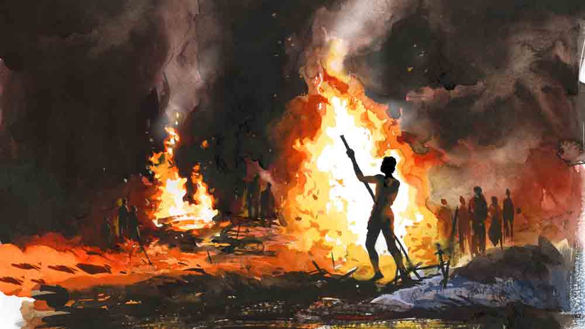

 

<h1 align=center>short story: শ্মশানভৈরব</h1>
<h2 align=center>জয়দীপ চক্রবর্তী</h2>
প   ুরনো শ্মশানের ইট বাঁধানো চত্বর পেরোলেই অপ্রশস্ত পাকদণ্ডী। তার পর আদিগঙ্গার মজা খাল। এই গঙ্গা আগে সাত ক্রোশ চওড়া ছিল। কয়েক শতক আগে চৈতন্যদেব এ পথেই রওনা দিয়েছিলেন নীলাচলে। গঙ্গার দু’ধারে তখন গভীর জঙ্গল। শ্বাপদসঙ্কুল। বিপদ মাথায় নিয়েই আশপাশের জনপদ থেকে মানুষ মৃত পরিজনদের দেহ সৎকার করতে আনে গঙ্গাতীরবর্তী এই শ্মশানে। যাত্রাপথে সেই শ্মশানের কাছেই নৌকো থামাতে বললেন গৌরসুন্দর। সঙ্গীরা অবাক হয়ে বললেন, “এখানে কেন থামতে বলছেন প্রভু?”   “কারা যেন কাঁদছে,” মহাপ্রভু আনমনা হয়ে বললেন।   “এই নির্জন শ্মশানে কে কাঁদবে? এ নিশ্চিত ভ্রম তোমার। হাজারো দলিত, পীড়িত মানুষের কান্না তুমি বুকের মধ্যে বয়ে বেড়াচ্ছ সর্বক্ষণ। তাই মনে হচ্ছে কেউ কাঁদছে...”   “উঁহু!” দু’দিকে মাথা নাড়ান গৌরাঙ্গ, “তারা আমাকে প্রাণপণে ডাকছে। তাদের ডাক উপেক্ষা করে যদি চলে যাই, তা হলে আমার প্রেমের ধর্মে হানি হবে ভাই।”   “কারা তোমাকে অমন করে ডাকছে প্রভু?”   “যারা দেহমুক্ত হয়েও মুক্ত নয়,” বলে চুপ করে গেলেন গৌরচন্দ্র। তার পর নৌকো থেকে তীরে নেমে সেই শ্মশানভূমির মাঝখানে গিয়ে দাঁড়ালেন। সঙ্গীদের বললেন, “এসো, এই ভয়ঙ্করের মাঝখানে দাঁড়িয়ে আজ আমরা নামযজ্ঞের আয়োজন করি। তারকব্রহ্ম নাম করি উচ্চৈঃস্বরে।”   করতাল, খঞ্জনি আর শ্রীখোলের শব্দে বনভূমির নির্জনতা ছিন্নভিন্ন হয়ে গেল মুহূর্তমধ্যে। গাছের মাথা থেকে ডানা ঝাপটাতে ঝাপটাতে পাখির দল উড়ে গিয়ে বৃত্তাকারে ঘুরতে লাগল নামকারীদের মাথার ওপর। প্রভু নাম করতে করতে নৃত্য করছেন। বাহ্যজ্ঞানশূন্য। হঠাৎই প্রেমোন্মত্ত গৌরাঙ্গের শ্রীখোল ভেঙে টুকরো টুকরো হয়ে ছড়িয়ে পড়ল ভূমির ওপরে। প্রভু কীর্তন থামালেন। তাঁর চোখে তখন অশ্রুধারা। ডান হাতের তর্জনী দিয়ে দিগ্‌বন্ধন করতে করতে আর্দ্রকণ্ঠে তিনি বলে উঠলেন, “আজ থেকে এই নির্জন শ্মশানভূমির নাম কীর্তনখোলা শ্মশান। আর এই মুহূর্ত থেকে অনন্ত আগামী পর্যন্ত যত জড়দেহের অন্তিম সংস্কার হবে এই শ্মশানে, তারা মুক্ত, তারা মুক্ত...”   সেই মুক্তি যে আসলে কী, কেউ জানে না। তবু যুগে যুগে দূর-দূরান্তের মানুষ প্রিয়জনদের দেহ বয়ে নিয়ে আসে এই শ্মশানে। দিনে-রাতে এ প্রাচীন শ্মশানে চিতার আগুন যেন নিভতেই চায় না।   এও এক মহাযজ্ঞ। শ্মশানের কালো মাটির ওপর পাশাপাশি কয়েকটা অগভীর খাঁড়ি। তার উপরে চিতা সাজানো। হোমের আগুনেরই মতো জ্বলন্ত চিতার গৈরিক অগ্নিশিখা আকাশের দিকে উঠে যাচ্ছে। ধনী, দরিদ্র, উচ্চ, নীচ, পাশাপাশি পুড়ে যাচ্ছে একই আগুনে। একই রকম মাংস আর চুলপোড়া গন্ধ উড়ছে তাদের সকলেরই জ্বলন্ত শরীর থেকে। সেই সব জ্বলন্ত চিতার পাশে বাঁশ হাতে পায়চারি করতে করতে বিড়বিড় করছে অনাদি মণ্ডল, “নিচ্চিন্তে পুড়ে ছাই হয়ে যাও বাবাঠাকুর, নিচ্চিন্তে পোড়ো মা ঠাকরুন। এ শ্মশান বড় পুণ্যভূমি। এখেনে পুড়লেই সাক্ষেত স্বগ্‌গবাস, এখেনে পুড়লেই মুক্তি...”   কোনও কোনও মড়া পুড়তে চায় না। বাঁশ দিয়ে হাজার খোঁচালেও চিতা নিভে আসে। ধোঁয়ায় ঢাকা পড়ে শ্মশানের আকাশ। কটুগন্ধে দম বন্ধ হয়ে আসে সবার। অনাদি রক্তচক্ষুতে শববাহকের দলের দিকে চেয়ে চিৎকার করে গাল পাড়ে, “ও পাপশরিল আমি পোড়াতে পারব না। যাঃ শালো! ওই আধপোড়া লাশ ভাসিয়ে দিগে যা গঙ্গায়...”   শবযাত্রীরা হাতেপায়ে ধরে অনাদির। বলে, “তুমি ছাড়া গতি নেই ভৈরব। একটা কিছু ব্যবস্থা করো।”   অনাদির রাগ আরও বেড়ে যায়। নিভে আসা চিতার আগুনে বিড়ি ধরিয়ে বিরক্ত গলায় বলে, “জীবনভর পাপ করবি, মানুষের সব্বোনাশ করবি। আর আগুন যেই ফিরিয়ে দেবে, তখন ঝামেলা নিতে হবে আমাকে? পারব না যা...”   শববাহকদের মধ্যে অভিজ্ঞ কেউ তখন দৌড়ে শ্মশান পেরোয়। পাশের ঝুপড়ি থেকে দিশি মদের বোতল কিনে এনে তড়িঘড়ি অনাদির দিকে বাড়িয়ে দিয়ে বলে, “শান্ত হও ভৈরব, এটুকু নিয়ে তুষ্ট হও এ বারের মতো।”   অনাদি মণ্ডল বোতলের ছিপি খুলে খানিক মুখে ঢালে। বাকিটা ঢেলে দেয় চিতার আগুনে। নেভা চিতা আবার জ্বলে ওঠে দপ করে।   কীর্তনখোলা শ্মশান জুড়ে নিত্যদিনের এ মহাযজ্ঞে অনাদি মণ্ডলই প্রধান পুরোহিত। তুমুল মাতলামি, হইচই, খিস্তিখেউড় আর মানুষের মাংসপোড়া গন্ধ, এ সবের বাইরে অন্য কোনও জীবনের কথা ভাবনাতেই আসে না তার। ছ’ফুট দু’ইঞ্চির ঋজু, বেতের মতো চেহারা। লালচে দু’টো চোখে ধকধকে আগুন সর্বক্ষণ। লম্বা একখানা বাঁশের লাঠি হাতে নিয়ে চিতার আগুনে মানুষের শেষ আহুতির আয়োজন করে সে। তাকে ডরায় না, এ জনপদে তেমন মানুষ নেই। সবাই বলে, “অনাদি সাধারণ মানুষ নয়। সে কীর্তনখোলা শ্মশানের ভৈরব।”   অনাদি মণ্ডল শ্মশানের বাঁধানো চত্বরের প্রান্তে দাঁড়িয়ে অন্ধকার গঙ্গার দিকে তাকিয়ে ছিল একদৃষ্টে। আজ অমাবস্যা। আদিগঙ্গার কালো জলের ওপর ধোঁয়াটে কুয়াশা। খানিক তফাতে নতুন শ্মশানে সরকারি ব্যবস্থার ইলেকট্রিক চুল্লি। সেই আলো-ঝলমলে শ্মশানে এখন শবযাত্রীদের ভিড়।   পুরনো কীর্তনখোলা শ্মশানে আর কেউ পোড়ে না। মাংসপোড়া গন্ধও ভাসে না আর বাতাসে। অনাদি আকাশের দিকে চেয়ে জোরে শ্বাস টানে। নাঃ, পরিচিত গন্ধগুলো আর নেই এখানে। অনাদির দমবন্ধ হয়ে আসে। হাঁপ ধরে বুকে। বিড়িতে টান দিলে বুক মুচড়ে খকখক কাশি উঠে আসে। অন্ধকার গঙ্গার স্থির, কালচে জলের দিকে চেয়ে দীর্ঘশ্বাস ফেলে অনাদি, সময় ফুরিয়ে আসছে। একটাই কাজ বাকি। শুধু এই কাজটুকুর জন্যই এখনও পরিত্যক্ত শ্মশান আঁকড়ে পড়ে আছে সে।   নতুন শ্মশান চালু হওয়ার সময় তাকেও কাজ দেওয়ার কথা উঠেছিল। সে নেয়নি। পুরনো কীর্তনখোলা থেকে যে নড়ার উপায় নেই অনাদির। ছেলেটাকে একা ফেলে কোথায় যাবে সে! অনাদি ক্লান্ত ভঙ্গিতে ঘাড় ঘোরায় ডান দিকে। ও দিকে শ্মশানকালীর মন্দির। দ্বিভুজা দেবীমূর্তি, অনুজ্জ্বল প্রদীপের আলোয় আজ বড় রহস্যময়ী। মন্দিরের সামনে অপ্রশস্ত উঠোন। উঠোনের মাঝখানে হাঁড়িকাঠ। নক্ষত্রের মরা আলো এসে পড়েছে হাঁড়িকাঠের উপরে। উঠোনের এক ধারে, গঙ্গার পাশে পাকদণ্ডীর গা ঘেঁষে ছোট্ট বেদি। মাটির।   গঙ্গার ও পারের জঙ্গল থেকে শেয়ালের দল চিৎকার করে মধ্যযাম ঘোষণা করল। অনাদি অন্ধকার মাড়িয়ে এসে হাঁটু মুড়ে বসল সেই বেদির সামনে। অস্ফুটে বলল, “তোর জন্যেই এই শ্মশান যাই নাই কখুনো। ভবানী ঠাউর কথা দিয়েছিলেন, এক দিন ঠিক তোকে এনে দাঁড় করাবেন আমার সামনে। কুড়ি বছর পর আজ সেই দিন মাধব। সেই তিথি।”   “অনাদি, যা যা বলেছিলাম সব কিছুর জোগাড় হয়েছে তো বাবা?”   ভবানী ঠাকুরের কণ্ঠস্বরে চমক ভাঙল। তড়িঘড়ি উঠে দাঁড়াল অনাদি। ভবানী ঠাকুরের সামনে মাথা ঝুঁকিয়ে প্রণাম করে বলল, “হ্যাঁ ঠাকুর।”   লোকে বলে অনাদি মণ্ডল কীর্তনখোলা শ্মশানের ভৈরব। এ তল্লাটে তাকে ভয় পায় না এমন লোক নেই। সেই অনাদি যাকে ডরায়, তিনি এই ভবানী চক্কোত্তি। মহাশক্তিধর কাপালিক। এ শ্মশান জাগিয়ে রেখেছেন তিনিই। বিশেষ তিথির মধ্যরাতে কত বিচিত্র ক্রিয়া যে চলে শ্মশানে, তা কেবল অনাদিই জানে। ভবানী ঠাকুরকে সে সব গুহ্যক্রিয়ার উপাদান চিরকাল নিষ্ঠাভরে জুগিয়ে এসেছে সে-ই।   ছোট ছেলে মাধব যখন মাত্র তিন দিনের জ্বরে চলে গেল, বুকে পাথর চেপে নিজে তার মুখাগ্নি করেছিল অনাদি। তাকে চিতায় শুইয়ে দাহ করেছিল শুকনো চোখে। কিন্তু প্রথামত মাধবের না-পোড়া নাভি পুঁতে আসেনি গঙ্গার পাঁকে। পিতলের কলসিতে ভরে সেই নাভি পুঁতে রেখেছিল উঠোনের এক ধারে। ওই বেদির নীচে। রাতে ভবানী চক্কোত্তি শ্মশানে জপ করতে এলে অনাদি তাঁর পায়ে পড়ে গিয়েছিল। ভবানী হাজার বুঝিয়েও শান্ত করতে পারেননি তাকে। অনাদির এক কথা, “তুমি তো সব পারো ঠাউর। চাইলেই নেভা চিতায় বসে দাউদাউ আগুন জ্বালাতে পারো, মরা মেয়েমানুষের পরনের বস্ত্র গায়ে জড়িয়ে বসে, ডেকে আনতে পারো তাকে চোখের সামনে। তুমি আমার মাধবকে একটি বারের জন্যে অন্তত আমার সামনে হাজির করো।”   “তা হয় না অনাদি,” ভবানী তাঁর মাথায় হাত রাখেন, “যে যায়, সে যায়। তাকে পিছু ডাকতে নেই। ওতে তার মুক্তি পেতে বাধা পড়ে। মাধবকে আটকে রাখিসনি। ওকে যেতে দে। ওর নাভি বিসর্জন দিয়ে দে গঙ্গায়...”   অনাদি উন্মাদের মতো দুটো পা জড়িয়ে ধরে তাঁর, “এক বার তাকে তুমি আমার সামনে আনো ঠাউর। আর কোনও দিন কিচ্ছু চাইব না তোমার কাছে।”   “এটা ঠিক নয় অনাদি। ওতে পাপ...” বোঝাতে চেষ্টা করেছিলেন ভবানী ঠাকুর।   “আমি পাপপুণ্য বুঝি না। আমি তাকে এক বার শুধু দেখতে চাই।”   “বেশ। মাধব ওই বেদির নীচেই বদ্ধ থাক তা হলে। সময় এলে তুই নিজেই তাকে মুক্তি দিস।”   “সে দিন তুমি আমায় দেখাবে তাকে?” কাতর হয়ে বলে অনাদি।   “আচ্ছা।”   ইলেকট্রিক চুল্লি চালু হওয়ায় পুরনো শ্মশানে কেউ আসে না। আদিগঙ্গার দু’পাশ দিয়ে রাস্তা তৈরি হবে খুব শিগগিরই। এই বেদি, ওই মন্দির— দুইই ভাঙা পড়তে পারে সে কাজ শুরু হলে। অনাদি অস্থির থাকে সর্বক্ষণ। হঠাৎই ভবানী বললেন, “সামনে অমাবস্যা। মধ্যযামের পর সময় প্রশস্ত। তোর জন্য সে দিন আমি ক্রিয়ায় বসব অনাদি।”   সে দিনই এই মহাক্রিয়ার প্রয়োজনীয় সামগ্রী সম্পর্কে বিস্তারিত বুঝে নিয়েছিল অনাদি। ক’দিন ধরে নিখুঁত আয়োজন সম্পন্ন করেছে সে।   “আজ সে যদি সত্যিই আসে, তা হলে আসবে আমাদেরই মতো অন্নময় শরীর নিয়ে,” ভবানী চক্কোত্তি চাপা গলায় বললেন, “তার জন্যে খাদ্য প্রস্তুত থাকা চাই।”   “সে বন্দোবস্ত হয়েছে ঠাউর। সুগন্ধি চাল এবং ছাগমাংস এনে রেখেছি,” অনাদি বলে।   “যে চিতায় মাধব পুড়েছিল, সেখানেই চিতা সাজা। সেই চিতাগ্নিতেই আজ এই মহাভোগ রান্না করতে হবে তোকে। আমি তত ক্ষণে আসন প্রস্তুত করি।”   “যে আজ্ঞে।”   কীর্তনখোলার খাঁড়ির ওপর অনেক দিন পর চিতার আগুন জ্বলেছে আজ। পরিচিত হাড়, মাংস, চুলপোড়া গন্ধের বদলে জনহীন শ্মশান জুড়ে আজ গরম ভাত আর সুসিদ্ধ ছাগমাংসের গন্ধ।   আসন থেকে ভবানী ঠাকুর হাঁক দিলেন, “অনাদি, ভোগ প্রস্তুত হল?”   “হ্যাঁ ঠাউর,” বলেই মুখ তুলল অনাদি। আর তখনই আবছা অন্ধকারে দৃশ্যটা চোখে পড়ল তার। স্থির হয়ে গেল অনাদি। মাটির চৌকো বেদিটার পিছনের ঝোপ ঠেলে সরিয়ে এক শীর্ণ ছায়ামূর্তি উঠে আসছে। প্রায় অনাবৃত শরীরে শুধু একখণ্ড কটিবস্ত্র। অনাদির বুকের মধ্যে দামামা বেজে উঠল। সে কি সত্যিই এল?   ভবানী চক্কোত্তিও দেখেছেন তাকে। আসনে বসেই গর্জে উঠলেন, “কে তুই?”   ছায়ামূর্তি উত্তর না দিয়ে ধীরে ধীরে এসে দাঁড়াল নির্জন শ্মশানভূমিতে। তার পর ভবানী ঠাকুরের দিকে এক বারও না তাকিয়ে, অনাদির সামনে হাঁটু মুড়ে বসে ডান হাত বাড়িয়ে দিয়ে বলে উঠল, “আমায় একটু  ভাত দেবে ভৈরব?”   আগুনের লালচে আভা এসে পড়েছে আগন্তুকের মুখে। সেই মুখের দিকে চোখ কুঁচকে একটু ক্ষণ তাকিয়ে থেকে অনাদিও জিজ্ঞেস করল, “কে তুই? তুই তো আমার মাধব নোস!”   “আমি পরান। চিনতে পাচ্ছ না ভৈরব? আমি শুলিপোতার অনন্ত হালদারের ছেলে। মনে নেই? 
আমার বাপ-দাদারে তুমিই তো পুড়িয়েছিলে এখানে...”   অনাদি ফ্যালফ্যাল করে চেয়ে রইল তার দিকে।   পরান বলে চলল, “মআমারিতে কাজ গেল গত সনে। এক চিলতে জমি ছেল। টুকটাক ফসল করে দু’মুঠো ভাত জুটছিল। জল ঝড়ে সেও গেছে। হাতে পয়সা নেই, ঘরে খাবারও নেই। কত দিন খাওয়া জোটেনি। গঙ্গার ধারে ঘাসের ওপরে শুয়ে ছিলুম। গরম ভাতের গন্ধে উঠে এলুম গো...’   অনাদি তাকিয়ে ছিল তার দিকে। মাধব বেঁচে থাকলে পরানের বয়সই হত বোধহয়।   ভবানী চক্কোত্তি আসন থেকে উঠে এসেছেন, “ওকে কিছু দিসনি অনাদি। যজ্ঞের অন্ন, অগ্রভাগ কাউকে দিলে তা অপবিত্র হবে। সে যখন আসবে, এ উচ্ছিষ্ট অন্ন আর তো দিতে পারবি না তাকে...”   অনাদি হাসে। অন্ধকার শ্মশানে তার মুখে নিভন্ত উনুনের লালচে আভা। বলে, “দরকার নেই ঠাউর।”   “কী বলছিস তুই? তোর এত দিনের স্বপ্ন...”   “এই তো সে এসেছে আমার সামনে,” ঘোর লাগা গলায় বলে অনাদি, “সব নিয়ে যা পরান। ভাত মাংস সব। বাড়ি গিয়ে পেট ভরে খা সবাই মিলে।”   অধৈর্য গলায় ভবানী ঠাকুর বলেন, “আর মাধব? সে যে এখনও ওই বেদির নীচে বন্দি।”   “কোথায় বন্দি?” শ্মশান কাঁপিয়ে অট্টহাসিতে ফেটে পড়ে অনাদি, “ভুল ভেবে এসেছি এত দিন। এই শ্মশানে পুড়েছে সে, আমার ক্ষমতা কী ঠাউর তাকে আটকে রাখার, সে মুক্ত হয়ে গেছে ঠাউর! সেই এক কুড়ি বছর আগেই গুঁড়ো গুঁড়ো হয়ে সবার মধ্যে ছড়িয়ে পড়েছে সে। যেটুকু মায়া করে রেখে দিয়েছি, সেটুকু আমি আজই ছেড়ে দেব ঠাউর...”   দ্রুতপায়ে শাবল নিয়ে আসে সে। আঘাত করতে শুরু করে সেই মাটির বেদিটায়। কয়েক মুহূর্তের পরিশ্রমে উদ্ধার হয় একটা ছোট পিতলের কলসি। দু’হাতে কলসিটা চোখের সামনে তুলে ধরে অস্ফুটে কী যেন বলে। শুনতে পান না ভবানী ঠাকুর। তার পর দু’হাতে কলসিটা বুকে চেপে ধরে গঙ্গার দিকে দৌড়য় অনাদি।   গভীর অন্ধকারে আর তাকে দেখা যায় না।
