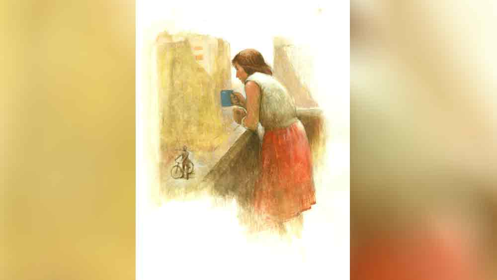

 

<h1 align=center>short story: হৃদয়বতী</h1>
<h2 align=center>অরূপরতন আইচ</h2>
বইমেলা থেকে ফিরে ঝুমুর মাকে জড়িয়ে ধরল। ভ্রমর বেশ অবাকই হলেন, “কী ব্যাপার ঝুমুর, এত খুশি কেন?”   বইমেলায় গেলে ঝুমুর মায়ের লিস্টের সঙ্গে নিজের পছন্দেরও প্রচুর বই কিনে বাড়ি ফেরে। ভ্রমর নিজেও বইয়ের পোকা। মেয়ের মধ্যেও বই পড়ার নেশা ঢুকিয়ে দিতে সক্ষম হয়েছেন। ঝুমুর এখন বি এ ফার্স্ট ইয়ার। ক্লাস ফাইভে সে বাবাকে হারিয়েছে। তার পর উইডো পেনশনটুকু সম্বল করে অনেক কষ্টে ঝুমুরকে বড় করেছেন ভ্রমর। তবু তার মধ্যেও বইয়ের নেশাকে কখনও জীবন থেকে দূরে সরে যেতে দেননি। মেয়েও মায়ের মতোই হয়েছে।   উচ্ছ্বসিত ঝুমুর দেখায়, “দেখো মা, তোমার ফেভারিট রাইটারের নতুন তিনটে বই। এই বইটার ভেতর উনি নিজে তোমার নাম লিখে সই করে দিয়েছেন। এই বই আর সইয়ের জন্য লাইনে দাঁড়িয়ে দাঁড়িয়ে আমার পায়ের বারোটা বেজে গেছে!”   মায়ের মুখে হাজার ওয়াটের আলো। বইয়ের ভেতর পাতায় মুক্তোর মতো হাতের লেখায় লেখা—   ‘ভ্রমর চট্টোপাধ্যায়কে শুভেচ্ছা, আন্তরিক বসু।’   মেয়েকে জড়িয়ে ধরেন ভ্রমর।   আন্তরিক বসু যে মায়ের সবচেয়ে প্রিয় লেখক, এটা মেয়ে ছোট থেকেই জানে। ওঁর সব বই-ই ভ্রমরের পড়া, নতুন বই বেরোলে ঝুমুরকে দিয়ে কিনিয়ে আনেন।   “জানো মা, এই প্রথম ওঁকে সামনে থেকে দেখলাম। তোমাদেরই বয়সি, কি একটু বড় হবেন হয়তো। কী সুন্দর দেখতে! ডেনিম জিনসের ওপর একটা দুধসাদা হাফশার্ট পরেছেন, গা থেকে সুন্দর একটা পারফিউমের গন্ধ আসছিল। বাঁ হাতে দারুণ একটা ঘড়ি। পরিপাটি একজন মানুষ।”   মেয়ের উচ্ছ্বাস দেখে হেসে ফেললেন মা। বইয়ের পিছনে দেওয়া লেখকের সংক্ষিপ্ত বায়োডেটা থেকে ঝুমুর জানে, এই লেখক আর মায়ের জন্মস্থান একই জায়গায়। তাই অন্যদের চেয়ে মা যেন এই লেখকের ব্যাপারে একটু বেশি দুর্বল। হৃদয়পুর নামের একটা ছোট্ট শহরের কেউ আজ বাংলা সাহিত্যের স্টার, সেটা নিয়ে মায়ের গর্বের শেষ নেই।   ভদ্রলোক ভালবাসার গল্পই বেশি লেখেন। তাঁর বিপুল ভক্তসংখ্যা। অল্প সময়ে সাহিত্যের বহু পুরস্কারই তাঁর ঝুলিতে। এমন এক জন সুদর্শন ব্যাচেলর সফল লেখককে নিয়ে মিডিয়া বা অনুরাগিণীদের আগ্রহ যে বাড়াবাড়ি পর্যায়ে চলে যায়, সেটা যেন ভ্রমরের সহ্য হয় না। টিভি চ্যানেলে নববর্ষের আড্ডায় এক উঠতি কমবয়সি নায়িকা যখন আন্তরিকের সামনেই বলে বসল যে, আন্তরিক রাজি থাকলে তা হলে এই স্টুডিয়ো থেকে বেরিয়েই সে তাকে বিয়ে করতে রাজি, তখন ঝুমুর শুনেছে, মা তেলেবেগুনে জ্বলে উঠে বলেছিল— আদিখ্যেতার শেষ নেই!   ঝুমুর বলেছিল, “মা, কেমন যেন একটা পোড়া পোড়া গন্ধ পাচ্ছি।”   “না, না, এই মেয়েরা যদি ওঁকে সব সময় জ্বালায়, তা হলে উনি লিখবেন কখন?”   “তা বললে হয়! এঁরাও তো তোমার মতো ওঁর ডাইহার্ড ফ্যান!”      রেডিয়োয় ‘তুই ফেলে এসেছিস কারে মন, মন রে আমার’ রবীন্দ্রসঙ্গীতটা বাজছিল। এ গান শুনলেই চোখ জলে ভরে যায় ভ্রমরের। চুপি চুপি পেছন থেকে তাকে জড়িয়ে ধরে ঝুমুর, “আমার সুন্দরী মা, কেন মন খারাপ? আচ্ছা মা, আমার সেই সিম্পল কোশ্চেনের আনসারটা তুমি এত বছরেও কেন দিলে না। এটাতেই আমি অবাক হয়ে যাই!”   “তুই দিন দিন বড্ড ফাজিল হয়ে যাচ্ছিস ঝুমুর!”   “না মা, তোমার মতো সুন্দরী গুণবতী এক জনের কোনও দেবদাস থাকবে না, তা কি হয়?”   “না রে ঝুমুর, তুই যা ভাবছিস সে রকম কিছু ছিল না আমার। আমাদের সময়টা অন্য রকম ছিল। এতটা ফাস্ট ছিল না। তবে...”   “তবে, তবে কী?”   “ঠিক আছে, আজ দুপুরে শুয়ে শুয়ে বলব।”      মন কেমন করা গ্রীষ্মের দুপুরে পাশাপাশি মা-মেয়ে শুয়ে।   “ঝুমুর, তুই তো শুধু আমার মেয়ে নোস, তুই আমার বেস্ট ফ্রেন্ডও বটে। তোকে না বলার মতো কিছু নেই আমার। তবু কোনও বিষয় মনের মণিকোঠায় রেখে দিতেই বেশি ভাল লাগে। তবুও তোকে যা বলব সেটা যেন শুধু তোর মনের লকারেই থেকে যায়। এটা শুধু তিতিরমাসি জানে, আর কেউ নয়, এ বার তুই জানবি!”   তিতিরমাসি মায়ের স্কুলের বেস্ট ফ্রেন্ড, ঝুমুর জানে।   একটু থেমে ভ্রমর শুরু করে, “আমি তখন ক্লাস নাইনে পড়ি। আমাদের একান্নবর্তী পরিবার। আমাদের পুরনো বাড়িটার নাম ছিল শিশিরকুঞ্জ। আমাদের ঘরগুলো ছিল রাস্তার দিকে, যেখানে একটা ব্যালকনি ছিল। এখন প্রোমোটারের হাতে পড়ে ফ্ল্যাট হয়ে গেছে।   “সেখানে আমি স্কুল থেকে ফিরে কিছু ক্ষণ দাঁড়িয়ে থাকতাম। এক দিন দাঁড়িয়ে থাকতে থাকতেই দেখি, রোগা চেহারার ফর্সা একটা ছেলে আমাদের বাড়ির কিছুটা আগে সাইকেল থেকে নেমে পড়ে, তার পর ব্যালকনির দিকে তাকাতে তাকাতে সাইকেল নিয়ে হেঁটে চলে যায়, তার পর একটু দূরে গিয়ে সাইকেলে উঠে পড়ে। পরে বুঝলাম, আমাকে বেশি ক্ষণ দেখার জন্যই এই ব্যবস্থা। শুধু তাকিয়ে দেখা ছাড়া কোনও দিনই সে কিছু করেনি।   “প্রথম দিকে চোখে চোখ পড়লে ভয় পেয়ে ভেতরে চলে যেতাম। কিন্তু কিছু দিন পর ভয় কেটে গেল। লজ্জা পেয়ে ব্যালকনি থেকে চলে গেলেও আবার কিছু ক্ষণ পর ব্যালকনিতে আসতাম। দেখতাম সে চলে গেছে। এক অদ্ভুত শূন্যতা আমায় গ্রাস করত। ছেলেটাকে বেশ দেখতে ছিল, জানিস। চোখ দুটো খুব গভীর।   “বুঝতে পারছিলাম, আমি একটা বাঁধনে বাঁধা পড়ে যাচ্ছি। এক দিন তিতিরকে সব বললাম। মজার ব্যাপার হল, তিতির বা অন্য কেউ যখন আমার সঙ্গে থাকত, তখন ও আর এ দিকে তাকাতই না।   “এক দিন সে বাড়ির সামনে দিয়ে সাইকেলটা নিয়ে আমার দিকে তাকাতে তাকাতে যাচ্ছে, হঠাৎ একটা রিকশা এসে হুড়মুড়িয়ে ওর গায়ে পড়ল, ও বেচারা তো সাইকেল নিয়ে চিৎপটাং। আমি তো হেসে উঠেছিলাম। পরে অবশ্য মনে হয়েছিল, হাসাটা ঠিক হয়নি। বেচারা কোনওক্রমে উঠে খোঁড়াতে খোঁড়াতে চলে গেল। পরের দু’দিন পাত্তা নেই। দু’দিন পর দেখলাম, অন্য একটা ছেলে ওকে সামনের রডে বসিয়ে সাইকেল চালিয়ে চলে গেল। বুঝলাম, হিরোর চোট লেগেছে। যাকে আমি ভাল করে চিনি না, তার জন্য কষ্ট হচ্ছিল! ঠাকুরকে বললাম, ওকে ভাল করে দাও।   “আমি তো বাইরে খুব একটা বেরোতে পারতাম না, বাবা পছন্দ করতেন না। ওই বিকেল পাঁচটা ছিল এক ঝলক ঠান্ডা হাওয়। প্রায় দু’বছর আমাদের নির্বাক সিনেমা চলল। নাইন, টেন, মাধ্যমিক সব শেষ হয়ে গেল। হঠাৎ কী হল কে জানে, ওর আর কোনও পাত্তা নেই। আমার তখন দিশেহারা অবস্থা।   “জেঠু-কাকুদের সঙ্গে বাবার বনিবনা হচ্ছিল না, তা ছাড়া বাবার চাকরির জায়গাটা ছিল বেশ দূরে। তাই বাবা চাকরির জায়গার কাছাকাছি একটা ফ্ল্যাট কিনে পেললেন। এর পর বাবা যে দিন বললেন, সামনের সপ্তাহে আমরা এখান থেকে চলে যাব, সে দিন মনে হচ্ছিল নিঃশ্বাস বন্ধ হয়ে আসছে। বাড়িটা, বিকেল পাঁচটা, এই ব্যালকনিটা আর সেই ছেলেটা... সব কিছু চিরতরে হারিয়ে ফেলতে যাচ্ছি, এটা ভাবলেই কান্না সামলাতে পারছিলাম না। খুব চাইছিলাম জানিস, যাওয়ার আগে এক বার অন্তত ওর সঙ্গে যেন দেখা হয়, তা হলে ওর নামটা যে ভাবেই হোক জেনে যাব।   “সে সুযোগ আর পাইনি। ও আর ফিরে এল না। কী যে ঠিক হল সেটা জানতে না পারার জন্যই দুঃখটা দ্বিগুণ হয়ে যাচ্ছিল। বার বার মনে হচ্ছিল, বড় অসুখ বা দুর্ঘটনা হয়নি তো?”   বাচ্চা মেয়ের মতো ফুঁপিয়ে কেঁদে উঠলেন ভ্রমর। নিজেকে কেমন যেন অসহায় লাগছিল ঝুমুরের। পঁচিশ বছর আগের অচেনা অপরিচিত এক জনের জন্য এত মায়া, এত কষ্ট! কে এই ছেলেটি! ভ্রমর আর কিছু বলেননি, ঝুমুরও প্রশ্ন করেনি।   ঝুমুর ভাবতেও পারেনি, গল্পের দ্বিতীয়ার্ধ এত দ্রুত তার সামনে এসে যাবে। জীবন মাঝে মাঝে এমন সব সমাপতন সাজিয়ে দেয় যে কল্পনাও হার মেনে যায়।   মাসখানেক পরের কথা।   সন্ধেবেলা ঝুমুর টিভি দেখছিল, হঠাৎ চেঁচিয়ে উঠল, “মা, মা, এই দেখো, কাল সন্ধেয় টিভিতে আন্তরিক বসুর ইন্টারভিউ। এই প্রথম উনি ইন্টারভিউ দিতে রাজি হয়েছেন।”   শুনে ভ্রমর বলেন, “বাঃ, তা হলে তো ভালই হয়, এই যে উনি ওঁর সমস্ত বই হৃদয়বতী নামের কোনও এক জনকে উৎসর্গ করেন, তার কারণটাও হয়তো জানা যাবে।”   আন্তরিক বসুর সমস্ত বইয়ের ভেতরে উৎসর্গপত্রে লেখা থাকে ‘হৃদয়বতীকে’। উনি কি হৃদয়বতীকে নিয়ে সত্যিই কিছু বলবেন? আচ্ছা, কে ইনি? হৃদয়বতী দেখতে কেমন? তিনি ওঁর কে হন?   পরের দিন সন্ধে হতে না হতেই মা, মেয়ে টিভির সামনে বসে পড়ল। ঝুমুর দেখল, মাকে যেন একটু ফ্যাকাশে দেখাচ্ছে।   যথাসময়ে দেখা গেল, আন্তরিক আর এই সময়ের ছোট পর্দার জনপ্রিয় নায়িকা শাওন মুখোমুখি বসে। ফেডেড জিনসের উপর একটা আকাশি পাঞ্জাবি পরেছে আন্তরিক।   শাওন শুরু করে, “আন্তরিকদা, চ্যানেল থেকে যখন আমায় এই ইন্টারভিউটা নিতে বলা হল, আমি আমার একটা ইম্পর্ট্যান্ট শুটিং ক্যানসেল করে দিয়েছি। অনেকের মতো আমিও আপনার বিগ ফ্যান।”   “ধন্যবাদ শাওন, তোমাদের মতো যারা আমার লেখা পছন্দ করে, তাদের কাছে আমি গভীর ভাবে কৃতজ্ঞ,” মৃদু হেসে বলে আন্তরিক।   “আন্তরিকদা, আজ আমি কিছুই আপনাকে জিজ্ঞেস করব না। এই প্রথম আপনি ইন্টারভিউ দিতে রাজি হয়েছেন, আপনিই শুরু করুন...”   “শাওন, তোমরা দেখেছ যে, আমার প্রত্যেকটা বই আমি ‘হৃদয়বতী’কে উৎসর্গ করি। এটা নিয়ে পাঠকদের মনে প্রচণ্ড কৌতূহল। মনে হল এ বার সব কিছু সকলকে পরিষ্কার করে বলা দরকার। হৃদয়বতী কে, সেটা আমারও জানা নেই। আমিও তাকে খুঁজি। সে কিন্তু কাল্পনিক চরিত্র নয়, বাস্তবের এক ফ্রক করা কিশোরী। আমার জন্ম হৃদয়পুর নামের এক মফস্সলে। গল্পের বই পড়ার নেশা আমার চিরকালের। আর সেই কারণেই ওখানকার পাবলিক লাইব্রেরির মেম্বার হয়েছিলাম। যে রাস্তা দিয়ে রোজ বিকেলে লাইব্রেরি যেতাম, সেই রাস্তার পাশেই শিশিরকুঞ্জ নামে একটি বাড়ি ছিল, সেই বাড়ির ব্যালকনিতেই...”   ঝুমুর দেখল, হঠাৎ করেই মায়ের মুখটা কেমন বিবর্ণ হয়ে যাচ্ছে। কপালে একটু একটু ঘাম জমেছে। শক্ত করে মায়ের হাত দুটো চেপে ধরল ঝুমুর।   আন্তরিক বলে চলে, “সেই ব্যালকনিতে দাঁড়িয়ে থাকত ফ্রক পরা এক কিশোরী। প্রথম যে দিন আমি ওকে দেখি, আমার চোখে কেমন যেন একটা ঘোর লেগে গিয়েছিল। আমি তখন ক্লাস টুয়েলভ। খুব ইন্ট্রোভার্ট ছিলাম। কোনও দিন মুখ ফুটে তাকে কিছু বলতে পারিনি। টানা দু’বছর ওই রাস্তা দিয়ে আমি গেছি। এক পলকের একটু দেখাই আমার সারা দিনের এনার্জি বাড়িয়ে দিত। বারো ক্লাসের পরীক্ষা শেষ হওয়ার দু’দিন পরই বাবা হঠাৎ স্ট্রোকে মারা গেলেন। দাদু-দিদিমাকে, আমাকে আর মাকে তাঁদের কাছে নিয়ে গেলেন। আমাদের হৃদয়পুরের বাড়িটা তালাবন্ধ হয়ে পড়ে রইল। কলকাতায় এসে মা এতটাই অসুস্থ হয়ে পড়লেন যে প্রায় মাসছয়েক আমি আর হৃদয়পুরে যেতে পারিনি। যখন সেখানে ফিরে গেলাম, তখন শূন্য ব্যালকনি। প্রথম কয়েক দিন বুঝতে পারিনি, ভেবেছিলাম শরীর খারাপ বা কোথাও ঘুরতে গেছে। তার পর খবর নিয়ে জানলাম, ওরা আর এখানে থাকে না। ওকে আর ওই ব্যালকনিটায় দেখতে পাব না এই চিন্তাটা যখন আমার মাথায় ঢুকে গেল, আমি বাকরুদ্ধ হয়ে গিয়েছিলাম। সবচেয়ে খারাপ লেগেছিল যে দিন দেখলাম, ওই বাড়িটা ভেঙে ফ্ল্যাটবাড়ি তৈরি হচ্ছে। ব্যালকনিটাও আর রইল না।   “ওই দিকে কোথাও গেলে এখনও আমি গাড়িটাকে ওই রাস্তার সামনে দিয়ে নিয়ে যাই। খুব মিস করি ব্যালকনিটাকে, এক ধরনের বিষণ্ণতা এত বছর বাদেও গ্রাস করে আমাকে।   “এত বছর তাকে দেখিনি ঠিকই, কিন্তু মনে তার একটা জায়গা রয়ে গেছে। অনেকের কাছে ছেলেমানুষি মনে হতে পারে। এত দিনে সে হয়তো কোনও জমজমাট সংসারের অলরাউন্ডার গিন্নি, বা বড় চাকরি করছে। কিন্তু মনে হয়, এক বার অন্তত তার সঙ্গে দেখা হলে খুব ভাল হত। তার নামটা মনে মনে ‘হৃদয়বতী’ রেখেছিলাম এই কারণেই যে, মনে হয়েছিল তার হৃদয়টা খুব সুন্দর।   “জানি না, হৃদয়বতী বই পড়তে ভালবাসে কি না, কিংবা আজকের এই ইন্টারভিউটা যে আদৌ দেখছে কি না, তবুও আপনাদের চ্যানেলে যদি সে যোগাযোগ করে, তা হলে আমি তার সঙ্গে এক বার দেখা করতে চাই। একটাই তো জীবন, কোনও অপূর্ণ ইচ্ছে নিয়ে চলে যেতে চাই না।”   আন্তরিকের গলাটা ধরে এল। শাওনকেও ছুঁয়ে গিয়েছিল লেখকের আবেগ। কোনও রকমে নিজেকে সামলে নিয়ে অনুষ্ঠানকে সমাপ্তির দিকে এগিয়ে নিয়ে গেল।মাথাটা কেমন ঘুরছিল ভ্রমরের। ঝুমুরের সপ্রশ্ন দৃষ্টির সামনে বিষণ্ণ গলায় শুধু বললেন, “বইয়ে ছবি দেখে প্রথম থেকেই ওকে আমি চিনতে পেরেছিলাম। চেহারা একটু বদলেছে, কিন্তু ওর গভীর সমুদ্রের মতো চোখ দুটো আজও একই রকম।”   মায়ের দু’হাত শক্ত করে চেপে ধরে ঝুমুর বলে, “আমি কিন্তু চ্যানেলের ফোন নম্বরটা লিখে রেখেছি মা...”
