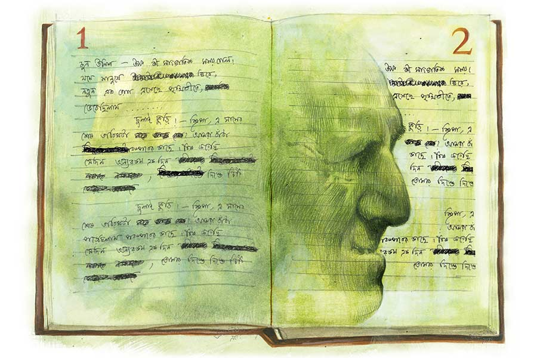

 
 <h1 align=center>অংশুবাবুর ডায়েরি</h1>
<h2 align=center>শাশ্বতী নন্দী</h2> আজ মাসের সাত তারিখ। ব্যাঙ্কে ভালই ভিড়। ছোটখাটো অংশুবাবু ভিতরে ঢুকে পড়লেন কায়দা করে। ইতিউতি তাকাচ্ছেন, কাউকে খুঁজছেন বুঝি। পেলেন কি না কে জানে, হনহন করে হাঁটতে শুরু করলেন।

কিন্তু যাচ্ছেনটা কোথায়! মাঝখানে যে কাচের পার্টিশন! ও পারে সারি সারি কম্পিউটার, ব্যাঙ্কের বাবুরা সব কাজে ব্যস্ত। অংশুবাবুকে পার্টিশনের এ পারেই দাঁড়িয়ে পড়তে হল। ময়লা পাজামার পকেট থেকে রুমাল বার করলেন, খড়খড়ে দাড়িওয়ালা গালটা মুছে নিলেন।

এমন সময় এক ছোকরা ও পার থেকে হাঁক দিল, “কী ব্যাপার অংশুবাবু? এই তো পেনশন তুলে নিয়ে গেলেন, সাত তারিখেই শেষ!” এ ছেলে একটু বাচাল ধরনের। অংশুবাবু কিছু বললেন না।

“আরে অন্য কেস, এখন ক’দিন হাঁটাহাঁটি চলবে...” পাশ থেকে অন্য এক ছোকরা বিড়বিড় করে।

এ বারও তিনি চুপ। আরে, বৃদ্ধ বাঘও বাঘই বটে, তাঁকে কি যেখানে সেখানে হালুম হালুম মানায়?

উনি প্রথম ছেলেটির দিকে তাকিয়ে মাথা চুলকোন, “ইয়ে মানে, আমার একটা ডায়েরি চাই, দেবে?”

“ওহ, প্রতি বছর এই আপনার এক বায়না, কী করেন ডায়েরি দিয়ে? লেখেন-টেখেন না কি?”

“এত কথা কিসের বাপু! থাকলে একটা দাও না ম্যানেজ করে।”

“সব ম্যানেজারের হেফাজতে। যান না, সাহেব ভিতরেই আছেন।”

“যাব?” খসখস করে গালটা আর এক বার চুলকোলেন তিনি। একটু ইতস্তত মুখ, তার পর কী ভেবে গুটিগুটি হাঁটা দিলেন ম্যানেজারের ঘরের দিকে। কিন্তু লোকটা এত্ত বিচ্ছিরি, বলে কি না, “ডায়েরি সব হাই ভ্যালুড কাস্টমারদের জন্য, আপনার তো পেনশন অ্যাকাউন্ট, পেনশন তুলে নেওয়ার পর জ়িরো ব্যালেন্সে রান করেন।”

অপমানে বৃদ্ধ মানুষটার মুখ থমথমে, মনে মনে কথার বুড়বুড়ি। এই তো ক’দিন আগে ঘটাপটা করে দেশের পঁচাত্তর বছরের স্বাধীনতা দিবস পালন হল, অথচ প্রবীণ নাগরিকদের প্রতি এই ব্যবহার! হাই ভ্যালুড কাস্টমার দেখাচ্ছে!

ম্যানেজার দরজার দিকে একটা আঙুল দেখিয়ে বলে, “এখন আসুন, মার্চ মাস শেষ হোক, যদি ডায়রি বাঁচে, পাবেন।”

অ্যাঁ! মার্চ মাস! অংশুবাবু কড় গুনলেন, গুনেই চললেন। তার পর গুটিগুটি বেরিয়ে এলেন ম্যানেজারের ঘর থেকে।

রাস্তা দিয়ে হাঁটছিলেন অন্যমনস্ক ভাবে। হঠাৎ মনে হল, পাশের ব্যাঙ্কটায় ঢুঁ মারলে কেমন হয়! ওখানেও তাঁর একটা সেভিংস অ্যাকাউন্ট আছে। খরচ-খরচা বাঁচিয়ে কিছু টিপে টিপে সঞ্চয় যাকে বলে। ম্যানেজার ছেলেটি ভারী ভদ্র। নামটাও বেশ, তথাগত রায়। এক বার আলাপ হয়েছিল। বয়স মনে হয় চল্লিশও পেরোয়নি। অংশুবাবু তৎক্ষণাৎ ফুটপাত পালটে নিলেন।

নিজের চেম্বারের বাইরেই তথাগত দাঁড়িয়ে ছিল। চোখে চোখ পড়তে অংশুবাবু মিটিমিটি হাসছেন, “একটা ডায়েরি হবে স্যর? এখানে আমার অ্যাকাউন্ট আছে কিন্তু।”

“ডায়েরি? আপনার লাগবে? কিন্তু এই মুহূর্তে তো…” তথাগতর হাসি-হাসি মুখ, “একটা কথা বলি? আমাদের হেফাজতে কিছু পুরনো ডায়েরি আছে, চলবে? একেবারে ভাল কন্ডিশন।”

“পুরনো! না, না...” অংশুবাবু হাত নাড়িয়ে নস্যাৎ করে দিলেন অফারটা, “ঠিক আছে চলি তা হলে...”

ম্যানেজারের অপ্রস্তুত মুখ। বলে, “আসলে এ বছর স্টেশনারিগুলো এত দেরিতে দিচ্ছে! ঠিক আছে, ক’টা দিন বাদে আসুন। একটা ভাল ডায়েরি আপনার জন্য রেখে দেব।”

অংশুবাবু স্মিতমুখে বিড়বিড় করলেন, “বেঁচে থাক বাপ, বেঁচে থাক। এই বেলা-ফুরোনো সময়ে তোকে আর কিছু দিতে পারি না পারি, অনেক আশীর্বাদ দিলাম।”

বাড়ির পথে হাঁটা ধরলেন। মনটা খারাপ খারাপ। আজও একটা ডায়েরি পেলেন না। এ দিকে নতুন বছরের সাত তারিখ। ও দিকে ঘরে ফিরতেই এক কাণ্ড! পাঁচ বছরের বিল্টু ঝাঁপিয়ে এল, কানের কাছে ফিসফিস, “তুমি কি রোজ অঙ্ক, না হ্যান্ডরাইটিং লেখো ডায়েরির পাতায়? সবার কাছে গিয়ে ডায়েরি খুঁজছ যে!”

“অ্যাঁ! তুমি সে কথা জানলে কী করে বিল্টুবাবু?”

“শুধু আমি! মা-ও জেনে গেছে। দেখো না, বাবা ফিরলে কী হয়!”

তাঁর পিলে এ বার চমকাতে শুরু করেছে! এ নিশ্চয়ই মর্কট ম্যানেজারটার কাজ, বৌমারও আজ লকারে যাওয়ার কথা ছিল, নিশ্চয়ই তখনই পুট করে কানে ঢেলে দিয়েছে। কোভিড থেকে সেরে ওঠার পর এক বার বৌমাকে নিয়েই তো লাইফ সার্টিফিকেট জমা দিতে গিয়েছিলেন তিনি ব্যাঙ্কে। সব চিনে রেখেছে।

“আচ্ছা দাদু, এক কাজ করলে কেমন হয়? তুমি আমার ডায়েরিটা নাও। স্কুলে বলব হারিয়ে গেছে। ব্যস, হোমওয়ার্ক টুকতেও হবে না, করতেও হবে না। কী মজা!”

অংশুবাবুর চোপসানো মুখে এত ক্ষণে হাসি ফুটল।

*****

সে দিন শেষ দুপুরে, অংশুবাবুর বাড়ির ডোরবেল বেজে উঠল। উনি তখন হাঁটতে বেরিয়েছেন। বৌমাই দরজা খুলল, “কাকে চাই?”

“ব্যাঙ্ক থেকে আসছি,” পরিচয় দিল তথাগত রায়, “এটা কি মিস্টার অংশু দাসের বাড়ি?”

“হ্যাঁ, বলুন...” বৌমার ভ্রু কুঁচকে গেছে। নির্ঘাত শ্বশুরমশাই কোনও কেলো বাধিয়ে বসেছেন।

“উনি আছেন ঘরে? আজকাল ব্যাঙ্কে তো আসেন না।”

“হ্যাঁ, কম যান। একটু বেরিয়েছেন। কিছু দরকার?”

“না মানে..” তথাগত ব্যাগের চেন খোলে, “একটা ডায়েরি এনেছি ওঁর জন্য। সে দিন চাইলেন, দিতে পারিনি। খারাপ লেগেছিল, তাই...”

“ও আচ্ছা।”

“এই ব্রাঞ্চে আমার পরশুই লাস্ট, ভাবলাম যাওয়ার আগে নিজের হাতে দিয়ে যাই ডায়েরিটা।”

“কী লজ্জার কথা! ডায়েরি-ডায়েরি করে আপনাকেও জ্বালিয়ে এসেছেন! এক নম্বরের কৃপণ। একটা কিনে নিলেই পারেন দোকান থেকে। এ ভাবে চেয়ে চিন্তে... ছিঃ!”

“ছি কেন? ব্যাঙ্কে ডায়েরি আসে কাস্টমারদের জন্যেই, তবে সবাইকে সব সময় তো দেওয়া সম্ভব হয় না।”

বৌমা আড়াল করে মুখ বাঁকায়। হুঁ, বেশি দরদ! বলে, “ওঁর কিন্তু দেরি হবে ফিরতে। ভিতরে আসবেন?”

“হ্যাঁ, অপেক্ষা করতে পারি।”

অগত্যা ঘরে বসাতেই হল। বৌমা বলে, “আলমারি-ভর্তি ডায়েরির পাহাড়। তবু নতুন বছর পড়লেই… কী সব ছাইপাঁশ যে লেখেন।”

তথাগত মুখ ঘুরিয়ে নিল, বোধহয় কানে লাগছে কথাগুলো, একটু গলা খাঁকারি দিয়ে বলে, “ইয়ে মানে ওঁর ঘরে একটু যাওয়া যাবে? আসলে বৃদ্ধ মানুষের প্রতি আমার একটা আলাদা ফিলিংস আছে। বাবার আদর-কাঙাল ছেলে ছিলাম তো।”

বৌমা আড়ষ্ট। শ্বশুরের ঘরটার যা ছিরি। এক হাঁটু ধুলো। সঙ্কোচ হচ্ছে। ম্যানেজার মানুষ! ও ঘরে ঢোকাবে?

তথাগত তত ক্ষণে সোফা থেকে উঠে দাঁড়িয়েছে, “মাকে হারিয়েছি কোন ছোটবেলায়, তার পর থেকে বাবাই সব। কলকাতায় এসে মন টিকত না। বাবাও গ্রাম ছেড়ে শহরে আসবেন না। ঠিক করলাম গ্রামেই বদলি নেব। কিন্তু ভাগ্য দেখুন, যখন ট্রান্সফার অর্ডার এল, বাবারও বদলির অর্ডার এসে গেছে। এই পৃথিবী ছেড়ে অন্য খানে। ব্যস, আর থাকা হল না এক সঙ্গে।”

“ও মা, তাই! কবে চলে গেলেন?”

“গত মাসে,” মুখটা অন্য দিকে ঘুরিয়ে বলল তথাগত। “সে দিন আপনার শ্বশুরমশাইয়ের মধ্যে আমি যেন বাবার ছায়া দেখছিলাম। ও রকম ঝুঁকে দাঁড়ানো চেহারা, হাঁপিয়ে হাঁপিয়ে কথা বলেন, ওইটিই কি ওঁর ঘর? ঢুকব?”

“হুঁ, আসুন। কিন্তু যা নোংরা করে রেখেছেন ঘরখানাকে!”

ঘরের মাঝখানে একটা ঢাউস টেবিল। তার ওপর টাল করে রাখা বই, খাতা, ক্যাপ-খোলা পেন, শিস-ভাঙা পেনসিল। একটা ডায়েরির পৃষ্ঠা, খোলা জানলার বাতাসে পতপত উড়ছে। তথাগত ঝুঁকে দেখল, কালো কালিতে কয়েকটা লাইন গোটা গোটা অক্ষরে লেখা।

পড়বে? অন্যের লেখা ডায়েরি যে! কিন্তু কৌতূহল যে দমানো দায়!

৭ মার্চের পৃষ্ঠাটাই খোলা। লিখেছেন— “বারান্দায় বসে কমলা সূর্য দেখছি, রোজই দেখি। তবু কী সুন্দর লাগে! যেন আশ মেটে না। বেলা ফুরিয়ে আসছে বলেই কী! জীবন বড় অনিশ্চিত। নাতিবাবুকে একটা কবিতা শেখাতে বড্ড ইচ্ছে করে। মিষ্টি করে দুলে দুলে বলবে— যখন হব বাবার মতো বড়। আমার টুকানটাও বলত। টুকান বড্ড তাড়াতাড়ি বড় হয়ে গেল, বাবা হয়ে গেল।”

তথাগত পৃষ্ঠা উল্টে চলে অন্যমনস্ক হাতে। কিন্তু এর পর অনেকগুলো পৃষ্ঠা ফাঁকা।

জুন ১৯— “উফ, কী সাংঘাতিক সময় গেল! যমে মানুষে টানাটানি আমাকে ঘিরে, নতুন এক রোগ এসেছে পৃথিবীতে, কোভিড। ভেবেছিলাম ডায়েরির পাতাগুলো এ বার শূন্যই পড়ে থাকবে। কিন্তু না, আবার কলম ধরতে পেরেছি আজ। কী ভাল লাগছে!”

জুলাই ২০— “শিপ্রা, এ মাসের শেষ তারিখটা মনে আছে তো? আমরা বাঁধা পড়েছিলাম পরস্পরের কাছে। ঠিক করেছি সে দিন অন্য রকম করে কাটাব, টিনের বাক্সটা নামাব, তোমার দিস্তে দিস্তে চিঠি বেরিয়ে আসবে। পুরুলিয়ায় যখন পোস্টিং ছিল, শেষ বিকেলের ডাকে এসে পৌঁছত আমার কাছে। আজকাল আর ডাকপিয়নরা পাড়ায় পাড়ায় ঘোরে না কেন গো? ওদের ঝোলায় কত মায়া, কত প্রেম থাকত!”

৩১ ডিসেম্বর— “শিপ্রা, বছরটা আজ শেষ হয়ে যাবে। আবার নতুন একটা বছর। এত নতুনের মাঝে নিজেকে হারিয়ে ফেলি। আমার পুরনোরাই ভাল। তোমাকে দেখতে ইচ্ছে করে। আট বছর আগে চলে গেছ। নতুন জন্ম হয়েছে কি তোমার? কার ঘর আলো করে এলে? আমার পড়শি হয়ে এলে বেশ হত। দেখতে, ঠিক চিনে নিতাম। বৌমা বলছে, আমি নাকি বর্তমানকে ভুলে যাচ্ছি। শুধু অতীতকে মনে রেখেছি। সে দিন নাতিবাবুকে স্কুলবাসে তুলে আর বাড়ি চিনে আসতে পারছি না। কী জ্বালা! ভাগ্যিস পাড়ার এক চেনা ছেলে পৌঁছে দিয়ে গেল। টুকুন বলছে, ডাক্তারের কাছে নিয়ে যাবে, হয়তো আর্লি স্টেজ অব অ্যালঝাইমার্স। চিকিৎসা দরকার। কিন্তু আমি তো অতীতেই বাঁচতে চাই। ওখানেই আমার শিপ্রা, টুকুনের ছোটবেলা, আমার শৈশব, কৈশোর, যৌবন, সব আছে। কী সুন্দর সময় কাটাই ওদের সঙ্গে। যাক না, বর্তমান মুছে যাক আমার স্মৃতিকোষ থেকে।

“তবে রাস্তার ও পারে ঝাঁকড়া গাছটা দেখলে আজকাল ভয় হয়। একটা একটা করে খসে যাচ্ছে পাতা। আমার দিনগুলোও কমে আসছে। তবু আমি দিন তারিখের সঙ্গে রোজ খেলি। ডায়েরির পাতায় কাল, পরশু, তরশুর গল্প লিখি, জানি না কোন তারিখে আমার সফর শেষ হবে!”

তথাগত ডায়েরি বন্ধ করল। বুঝতে পারে, চোখের কোণে দু’ফোঁটা জল থমকে আছে। দরজায় কেউ বুঝি বেল বাজাল। একটু পরেই গলাখাঁকারির শব্দ। অংশুবাবু ঘরে ঢুকছেন। কিন্তু তথাগতকে চিনতে পারলেন না।

চোখের ওপর হাতের বেড় দিয়ে তবুও চেনার চেষ্টা করছেন। পরিচয় দিল তথাগত। অংশুবাবুর মুখে এক গাল হাসি, “ও মা, আপনি যে!”

নতুন ডায়েরিটা বাড়িয়ে দিল তথাগত, “এটা আপনার জন্য, একটু দেরি হয়ে গেল পৌঁছতে।”

শুনেই থতমত খেয়ে তাকিয়ে রইলেন তিনি। নেবেন কি নেবেন না, আড়ষ্ট আড়ষ্ট ভাব, বৌমার দিকে আড়ে আড়ে তাকাচ্ছেন। তার পর হাত বাড়িয়ে নিয়েই নিলেন সোনালি রঙের চওড়া ডায়েরি। ঝুঁকে পৃষ্ঠা ওল্টাচ্ছেন, নিভন্ত দৃষ্টিতে জ্বলে উঠছে হাজার তারার আলো। “সুন্দর ডায়েরি, খুব সুন্দর!” বলতে বলতে তাঁর ফোকলা দাঁতে হাসি, চোখে মুগ্ধতা, কপালের কোঁচকানো রেখা সরে সরে যাচ্ছে। ডায়রিটা নাড়াচাড়া করছেন। ছোট ছেলে যেন হাতে খেলনা পেয়েছে। তারিখগুলো আতুর চোখে ছুঁয়ে ছুঁয়ে দেখছেন বার বার।

তথাগত অপলক দেখছে। অংশুবাবুকে মনে হচ্ছে এক ফুরিয়ে আসা মোমবাতি, তবু শিখা এখনও উজ্জ্বল, তাতে অনেক আলো। বড় ভাল লাগছে ওর। সে ভাবে, মোমবাতির শিখাটা আরও কিছু দিন জ্বলুক। ডায়েরির সব পৃষ্ঠা ভরে উঠুক তাঁর লেখায়। তথাগত আর তার বাবার কথা শুনতে পাবে না কখনও। কিন্তু আর এক বৃদ্ধ পিতার বুকে যে অজস্র কথা জমে আছে, সে সব বাইরে আসার রাস্তা করে দিতে পারবে না সে! তাকে পারতেই হবে। ওর বাবা বলতেন, “বৃদ্ধ গাছ ফল ধরতে না পারুক, ছায়া তো ধরতে পারে মাথায়।”

সে গভীর আবেগে বলে ওঠে, “অংশুবাবু, আরও অনেক ডায়েরি আপনাকে উপহার দেব, প্রতি বছর এসে দিয়ে যাব, আপনি লিখে যান!” দরজার দিকে এগিয়ে যেতে যেতে অস্ফুটে বলে, “পৃথিবী এখন বড় রুক্ষ। তার রোদ বড় কঠোর, চাই শীতল ছায়া। অন্ধকার বড় দুর্ভেদ্য, চাই আপনাদের মতো মোমবাতির আলো। এখনই ছুটি নেই আপনার, কিছুতেই না...”