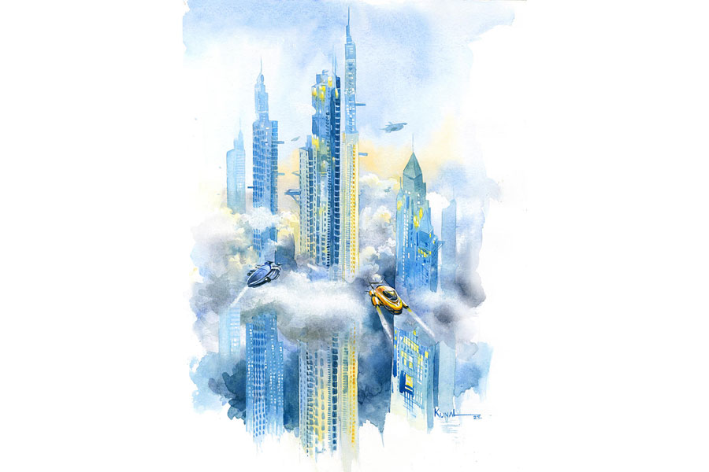

 
 <h1 align=center>অকৃত্রিম</h1>
<h2 align=center>স্মরণজিৎ চক্রবর্তী</h2> আদ্রিকা

দু’শো চার তলার উপরের পাতলা মেঘের আড়াল থেকে কলকাতাকে দেখলে খেলনা শহর বলে মনে হয় আদ্রিকার। ফ্ল্যাটের দক্ষিণ দিকে সমুদ্র দেখা যায়। বহু আগে যে জায়গাটার নাম বারুইপুর ছিল, সেটা এখন সি বিচ। সমুদ্র কলকাতার অনেকটা কাছে চলে এসেছে। যাদবপুরের এই বাড়িটার টপ ফ্লোর থেকে তাই সহজেই সমুদ্র দেখা যায়।

রোজ ব্রেকফাস্ট করতে করতে সমুদ্রের দিকে তাকিয়ে থাকতে ভাল লাগে আদ্রিকার। কিন্তু আজ দিনটা রোজকার মতো নয়। আজ খুব টেনশনের দিন। আজ ওরা আগিরকে ধরতে আসছে!

এই পৃথিবীতে আগির ছাড়া আর কে আছে আদ্রিকার! ওকেও ধরে নিয়ে গেলে আদ্রিকা কার জন্য বাঁচবে!

“খাবে না তুমি?”

প্রশ্নটা শুনে পিছন ফিরে তাকাল আদ্রিকা। দেখল টো এসে দাঁড়িয়েছে কাছে। সঙ্গে ভাসমান খাবারের প্লেট।

টো এক জন হিউম্যানয়েড। সহজ ভাবে বললে কৃত্রিম মানুষ, যার মধ্যে রোবটিক্স আর আর্টিফিশিয়াল ইন্টেলিজেন্স-এর মিশ্রণ করা হয়েছে।

এই দু’হাজার নশো ছাপান্ন খ্রিস্টাব্দে হিউম্যানয়েড খুব সাধারণ ব্যাপার। আদ্রিকার ব্যবসাটাই এই হিউম্যানয়েড তৈরির। ওদের কোম্পানির নাম ‘ফ্রেন্ডস আনলিমিটেড’।

মানুষজনকে ‘হিউম্যানয়েড বন্ধু’ সাপ্লাই করাই ওদের মূল কাজ। গড়িয়াহাট, হাতিবাগান, বনগাঁও আল্ট্রা সিটি, বাগবাজার হাইপার মার্ট, পলতা মেগা কলোনি-সহ নানা জায়গায় ওদের আউটলেট আছে। সেখান মানুষজন এসে হিউম্যানয়েড বন্ধু বুক করে যায়। তার পর তাদের কেমন ধরনের বন্ধু দরকার তার ডিটেল নেওয়া হয়। আর সেই মতো এ আই বা আর্টিফিশিয়াল ইন্টেলিজেন্স প্রোগ্রাম করে হিউম্যানয়েড ফর্মে ইনস্টল করেমনের মতো বন্ধু বানিয়ে সাপ্লাই দেওয়া হয়। এই এআই তার সেল্ফ-লার্নিং ক্ষমতার সাহায্যে নিজেকে ক্রমে আরও যোগ্যতর বন্ধু করে তোলে।

এই হিউম্যানয়েডগুলো একদম আসলের মতোই হয়। তাদের বাইরে থেকে দেখলে কিছুতেই মানুষের থেকে আলাদা করা যাবে না। শুধু তাদের ব্রেনের জায়গায় থাকে সেমি-সলিড জেলির একটা সার্কিট। তাতে আর্টিফিশিয়াল ইন্টেলিজেন্স ইনস্টল করা থাকে। কাস্টমাররা নিজেদের ইচ্ছেমতো তাদের রূপ দিতে পারে। হিউম্যানয়েডটিও ইচ্ছে করলে নানা রূপ বদলাতে পারে। এতে কাস্টমারের একঘেয়েমি আসে না।

আজ থেকে এক হাজার বছর আগে, সেই উনিশশো ছাপান্ন সালে এআই নিয়ে যে গবেষণা শুরু হয়েছিল, তা এই এক হাজার বছরে অন্য মাত্রায় চলে গিয়েছে।

যদিও এই এক হাজার বছরে পৃথিবীও পাল্টে গিয়েছে সম্পূর্ণ। এখানে আর আলাদা আলাদা কোনও দেশ নেই। গ্রিনিচকে কেন্দ্র ধরে পৃথিবীকে লম্বালম্বি দুটো জ়োনে ভাগ করা হয়েছে। পূর্ব দিকে সান জ়োন আর পশ্চিমে মুন জ়োন। গত এক হাজার বছরে চারটে বিশ্বযুদ্ধ হয়ে মানুষের সংখ্যা নেমে এসেছে একশো কোটিতে। যার মধ্যে প্রায় পঞ্চাশ কোটি মঙ্গল গ্রহে গিয়ে থাকছে। পৃথিবীর অনেক জায়গাই এখন পরিত্যক্ত। দক্ষিণ মেরুর উপর ওজ়োন স্তরে এমন ফুটো হয়েছে যে, আফ্রিকার দক্ষিণ থেকে নীচের দিকে মানুষ আর বসবাস করতে পারে না।

মানুষ কমে গিয়ে জীবনযাত্রার ধরন পাল্টে যাওয়ায়, সবাই আজকাল খুব একা। হাজার বছর আগে থেকে মানুষের যে টেকনোলজি-নির্ভরতা বেড়ে গিয়েছিল, তার ফল এখন ভোগ করতে হচ্ছে সবাইকে। কারও কোনও বন্ধু নেই। সবাই যেন নির্জন এক-একটা দ্বীপ। আর এখানেই লুকিয়ে আছে আদ্রিকাদের ব্যবসার প্রাণভ্রমরা।

আজ থেকে তিরিশ বছর আগে আদ্রিকার বাবা এই হিউম্যানয়েড বন্ধু সাপ্লাই করার ব্যবসা শুরু করেছিল। আর্টিফিশিয়াল ইন্টেলিজেন্সকে পজ়িটিভ উপায়ে মানুষের কাজে লাগানোর চেষ্টা শুরু হয়েছিল আরও অনেক আগে। কিন্তু তার সফল রূপ এখন দেখা যাচ্ছে। মানুষকে এআই-এর মাধ্যমে বন্ধু দেওয়া হচ্ছে। আর শুধু বন্ধুত্ব নয়, প্রেমও দেওয়া হচ্ছে। নিজের মনের মতো প্রেমিক-প্রেমিকা বানিয়ে নেওয়ার লাইনটাও নেহাত কম নয়। এর ফলস্বরূপ ‘ফ্রেন্ডস আনলিমিটেড’ সান জ়োনের ধনীদের তালিকায় দশ নম্বরে।

আদ্রিকা কিন্তু হিউম্যানয়েডের মধ্যে প্রেম খোঁজেনি। মানুষের মধ্যেই খুঁজেছে। ইউনিভার্সিটিতে অ্যানালিটিক্যাল আর্টিফিশিয়াল ইন্টেলিজেন্স পড়ার সময় হিউম্যানিটিজ়ের একটা ছেলেকে ভাল লেগেছিল ওর। সে-ই আগির। আগির এক জন বিপ্লবী। সান জ়োনের সেন্ট্রাল অথরিটি বা ‘সিএ’-র বিরুদ্ধে ওদের লড়াই। সিএ হিমালয় পর্বতশ্রেণির অনেক জায়গায় খনন করা শুরু করেছে মূল্যবান খনিজের জন্য।

‘প্রোটেক্ট আর্থ’ নামে একটা সংগঠন সিএ-কে নানা ভাবে আটকানোর চেষ্টা করে। আর তাদের চেষ্টার ধরনটা সব সময় শান্তিপূর্ণ নয়। বরং কিছুটা জঙ্গি। যা আগে পূর্ব ভারত বলে পরিচিত ছিল, সেই ইস্ট-সেক্টরের ‘প্রোটেক্ট আর্থ’-এর কমান্ডার হল আগির। ইদানীং সিএ-র পুরনো মৌলালিতে যে আন্ডারগ্রাউন্ড কন্ট্রোল রুম আছে, সেখানে বিস্ফোরণ ঘটিয়েছে আগিররা। তার পর থেকেই ও ফেরার।

সিএ-র চোখে ফেরার হলেও আসলে আদ্রিকার এই দুশো চার তলার অ্যাপার্টমেন্টে এসে লুকিয়ে আছে আগির। এখানে টো আর আদ্রিকা ছাড়া কেউ থাকে না। তাই এই জায়গাটাকেই আপাতত নিরাপদ মনে হয়েছিল ওদের। কিন্তু এখনকার এই নিশ্ছিদ্র নজরদারির পৃথিবীতে কেউই নিরাপদ নয়!

এখন বাচ্চা জন্মানোর সঙ্গে সঙ্গে তার বাহুতে এমন একটা চিপ ইনস্টল করে দেওয়া হয় যে, সারা জীবন সব জায়গায় তাকে ট্র্যাক করে সিএ। তবে ডার্ক মার্কেটে কিছু মানুষ ‘ট্রেস ব্লকার’ বানায়। জঙ্গি সংগঠনগুলো সে সব কেনে। এই ট্রেস ব্লকার স্টিকারের মতো হাতে লাগিয়ে রাখলে সিএ আর তাকে ট্রেস করতে পারে না।

এত দিন সেই স্টিকার ভালই কাজ করছিল, কিন্তু আজ ভোর রাতে আদ্রিকা আর আগির যখন ঘনিষ্ঠ অবস্থায় ছিল, তখন আদরের মাঝে স্টিকারটা খুলে গিয়েছিল অলক্ষে! স্টিকারটা যে খুলে গিয়েছে সেটা ঘুম থেকে উঠে বুঝতে পেরেছে আদ্রিকা। ও সঙ্গে সঙ্গে সেটা লাগিয়েও দিয়েছে ঘুমন্ত আগিরের হাতে। কিন্তু যা সর্বনাশ হওয়ার, তা যে হয়ে গিয়েছে সেটা ও জানে। ও জানে যে কোনও সময়ে ‘ক্যাপচার কপ’ বা সোজা কথায় পুলিশ আসবে আগিরকে ধরতে।ওর সিকিয়োরিটি সিস্টেমে ও দেখেছে ফ্ল্যাটের তলায় বেশ কিছু ‘কপ হোভার’ এসে জড়ো হয়েছে। ওদের এখানে আসা এখন সময়ের অপেক্ষামাত্র! টপ লেভেল থেকে আগিরকে ধরার ক্লিয়ারেন্সের জন্য ওরা অপেক্ষা করে আছে।

এখন মানুষজন আর খুব বেশি রাস্তা দিয়ে গাড়ি করে চলাফেরা করে না। সবাই মাকুর মতো দেখতে ‘পার্সোনাল হোভার’ করে আকাশে ওড়ে। এখন রাস্তাঘাট থাকলেও তা ফাঁকাই পড়ে থাকে। পুলিশও তাদের ‘কপ হোভার’ নিয়েই উড়ে বেড়ায়। দুশো-তিনশো তলা বাড়ি এখন কোনও ব্যাপার নয়। সেখানে যেতে হলে পুলিশকে এমন উড়োযানই ব্যবহার করতে হয়।

কয়েক শতক আগে মৃত্যুদণ্ড বন্ধ হয়ে গিয়েছে। এখন অপরাধীদের ধরে স্পেস শাটলে করে অ্যাস্টেরয়েড বেল্টে পাঠিয়ে দেওয়া হয়। অনেক আগে কলকাতার যেখানে রেস কোর্স ছিল, সেখানে এখন স্পেস শাটল পাঠানোর লঞ্চ প্যাড। কাছেই একটা ঐতিহাসিক স্থাপত্য ছিল। ভিক্টোরিয়া মেমোরিয়াল। সেটাকে মাটি থেকে গাছের মতো তুলে নিয়ে গিয়ে ধাপার মাঠের ওখানে একটা কৃত্রিম পাহাড় তৈরি করে তার মাথায় বসানো হয়েছে। ওখানেই পাশাপাশি রাইটার্স বিল্ডিং, নবান্ন, ঠাকুরবাড়ি ইত্যাদিকেও রাখা হয়েছে। এই ভাবেই এখন ঐতিহাসিক বাড়ি-ঘরকে সংরক্ষণ করা হয়।

মঙ্গলগ্রহ আর বৃহস্পতির মধ্যে অ্যাস্টেরয়েড বেল্টের বেশ কিছু গ্রহাণুতে ‘মেগালোম্যান’ নামে এমন এক ধরনের ধাতু পাওয়া গিয়েছে, যা দিয়ে ব্যাটারি তৈরি করলে তাতে কয়েক বছর চার্জ না দিলেও চলে। এই মেগালোম্যান ধাতু থেকে এমন একটা রেডিয়েশন বেরোয়, যা হিউম্যানয়েডদের আর্টিফিশিয়াল ব্রেনের জেলির মতো মেটিরিয়ালটার পক্ষে ক্ষতিকারক। তাই এআই সমন্বিত হিউম্যানয়েডদের দিয়ে মেগালোম্যানের মাইনিং-এর কাজ করা যায় না। মানুষকেই লাগে। আদ্রিকা জানে, আগিরের মতো জঙ্গিদের এমন কাজের জন্য সারা জীবনের জন্য মহাশূন্যে পাঠিয়ে দেওয়া হয়।

কিন্তু আগিরকে এমন ভাবে পাঠিয়ে দিলে ও কাকে নিয়ে বাঁচবে! ওর বাবা-মা নেই। কেউ-ই নেই। আগির ছাড়া ওর কী হবে! যতই মানুষ আর্টিফিশিয়াল ইন্টেলিজেন্স বের করুক, নিখুঁত হিউম্যানয়েড বার করুক, সে নিজের ইচ্ছে, ভালবাসা, একাকিত্ব, মনখারাপ ঝেড়ে ফেলবে কী করে! মানুষ যে নিরুপায় ভাবে আজও জীবন্ত সত্তা! আশ্চর্য এক রহস্য!

আদ্রিকা এ বার টো-র দিকে তাকাল। টো ইতিহাস-পাগল। এআই বলে ও নিজেই অনেক কিছু শিখে নেয়। গতকাল নিজেকে পাল্টে ও বহু পুরনো একজন গায়কের মতো দেখতে করে রেখেছিল। নাম জন লেনন। আজ আবার নিজেকে পাল্টে ফেলেছে ইতিহাসের পাতা থেকে তুলে আনা আর এক অভিনেতার মতো করে। তার নাম শাহরুখ খান!

“কী হল, খাবে না?” টো খাবারের প্লেটটা দেখাল।

এই প্লেটগুলো ইন্টেলিজেন্ট ইউটেনসিলস-এর মধ্যে পড়ে। হাতে ধরে রাখতে হয় না। মানুষকে অনুসরণ করে ভেসে বেড়ায়।

আদ্রিকা বলল, “ওরা আসছে টো! ওরা আগিরকে ধরে নিয়ে যাবে!”

“মানুষদের এই সেন্টিমেন্ট আছে বলেই তোমাদের ম্যানিপুলেট করা যায়!” টো দীর্ঘশ্বাস ফেলল।

আদ্রিকার চোখে জল। ও বলল, “আমি আগিরকে ভালবাসি টো। তোমরা যতই ইন্টেলিজেন্ট হও, কোনও দিন এ সব বুঝবে না। ফিলিং আর ইন্টেলিজেন্স তো এক নয়! আগিরকে ছাড়া আমি মরে যাব, দেখো!”

টো আরও কিছু বলতে গেল, কিন্তু তার আগেই বড় হলের দরজায় আগির এসে দাঁড়াল। ওর চোখে-মুখে ভয়ের ছাপ। হাত পা কাঁপছে!

আগির বলল, “ঘুম থেকে উঠেই সিকিয়োরিটি ক্যামে দেখলাম কপ হোভার ঘিরে ফেলেছে বিল্ডিং! আমায় ওরা ধরতে আসছে আদ্রিকা। ওরা আমায় অ্যাস্টেরয়েড বেল্টে পাঠিয়ে দেবে! আমি তোমায় ছাড়া কী করে বাঁচব? ওখানে ওই পাশবিক পরিবেশে আমায় যে ওরা মেরে ফেলবে!”

আদ্রিকা উঠে আগিরের কাছে যেতেই আগির ওকে জড়িয়ে ধরে বাচ্চা ছেলের মতো কেঁদে উঠল।

আদ্রিকার গলার কাছে ব্যথা করছে। কী করবে ও! বাইরে ‘কপ হোভার’-এর আওয়াজ শুনতে পাওয়া যাচ্ছে। ওই ওরা আসছে। আদ্রিকা টো-র দিকে তাকাল।

টো বলল, “তোমরা স্পেস ভল্টে গিয়ে লুকিয়ে পড়ো। বাকিটা আমি দেখছি!”

‘স্পেস ভল্ট’ এক ধরনের গুপ্ত ঘর। আদ্রিকা আর সময় নষ্ট না করে আগিরকে নিয়ে বেডরুমের দিকে এগিয়ে গেল। ওখানেই ‘প্যানিক রুম’-এর মতো স্পেস ভল্ট আছে।

শুধু যেতে যেতে আদ্রিকা পিছনে তাকাল এক বার। দেখল টো মাথা সামান্য কাত করে দু’হাত ছড়িয়ে গালে টোল ফেলে হেসে বলছে, “স্টিকার যেন আর না খোলে ওর হাত থেকে! মেক লাভ, বাট রেসপনসিবলি! বাকিটা... ম্যায় হুঁ না!”

ওহ্‌ টো! আদ্রিকা আর পিছনে তাকাল না। আগিরকে নিয়ে পা চালাল স্পেস ভল্টের দিকে।

টো

অন্য কয়েদিরা ক্রায়োজেনিক স্লিপের মধ্যে ডুবে থাকলেও টো তো মানুষ নয়, ওর উপর ঘুমের ওষুধ কাজ করেনি। টো নিজের পড থেকে উঠে বসল।

“আরে, তুমি ঘুমোওনি!” বৃদ্ধ রক্ষীটি এগিয়ে এল ওর দিকে।

এ মানুষ। হিউম্যানয়েড নয়। এই স্পেসক্র্যাফটে এক জন মানুষ রক্ষীর তত্ত্বাবধানে কয়েদিদের নিম্ন তাপমাত্রার মধ্যে রেখে ঘুম পাড়িয়ে নির্বাসনেপাঠানো হচ্ছে।

টো হাসল। ওকে বাইরে থেকে দেখলে তো বোঝার উপায় নেই যে, ও আর্টিফিশিয়াল ইন্টেলিজেন্স-চালিত একজন যন্ত্রমানব।

রক্ষীটি বলল, “সবাই যে ইঞ্জেকশন নিয়ে ঘুমিয়ে পড়ল। তুমি পড়লে না কেন? ইঞ্জেকশন কাজ করল না?”

“কারণ...” টো বলল, “আমি মানুষ নই। আমি হিউম্যানয়েড।”

“সে কী!” বৃদ্ধ রক্ষীটি ঘাবড়ে গেল, “ওখানে তো হিউম্যানয়েডদের যাওয়ার কথা নয়। মেগালোম্যান ধাতুতে তুমি যে নষ্টহয়ে যাবে!”

“কিন্তু অন্য দু’জন যে বাঁচবে!” টো হাসল আবার!

“মানে?” রক্ষীটি অবাক হল।

“সে এক গল্প!” টো বলল, “পুলিশ যাকে ধরতে এসেছিল তাকে বাঁচানোর জন্য আমি তার রূপ ধারণ করেছি। তার ‘ট্রেস চিপ’ নকল করেছি। এআই হিসেবে এ সব করা তো আমার কাছে তেমন কঠিন ব্যাপার নয়, তাই না!”

“বুঝলাম না!” রক্ষীটি অবাক হল।

“লম্বা গল্প,” টো দীর্ঘশ্বাস ফেলল।

“বেল্টে পৌঁছতে এই স্পেসশিপের পনেরো মাস সময় লাগবে। আমি একা রক্ষী এখানে। আর কেউ নেই। আমার সময় আছে! তুমি অন্যের জন্য নিজেকে বলি দিলে কেন বলো?”

“বেশ কিছু দিন হল আমার সার্কিটে একটা সমস্যা হচ্ছে। এআই হিসেবে আমরা লজিক, অ্যানালিসিস আর এক্সপেরিয়েন্স থেকে লার্ন করে ডিসিশন নিই। কিন্তু ইদানিং ইমোশন আর ফিলিং-ও লার্ন করতে শুরু করেছি আমি! এটা হওয়ার কথা নয়। কিন্তু কী ভাবে যে হচ্ছে বুঝতে পারছি না! আদ্রিকার কষ্ট দেখে আমার কেমন যেন হল! মনে হল ওকে বাঁচানো দরকার! আসলে সেন্টিমেন্ট জন্ম নিচ্ছে বলে আমিও ম্যানিপুলেটেড হচ্ছি। সার্কিটে সমস্যা হচ্ছে আমার!” টো চুপ করে গেল।

“সার্কিটে সমস্যা! সেটা কী?” বৃদ্ধ অবাক গলায় জিজ্ঞেস করল।

টো বলল, “আমাদের সেল্ফ-লার্নিং প্রোগ্রামে গ্লিচ বলতে পারো। এই সার্কিটে সমস্যার বৈজ্ঞানিক নাম আমি জানি না। কিন্তু মানুষ এই আদি ও অকৃত্রিম ব্যাপারটাকে কী বলে আমি জানি!”

“কী বলে?” রক্ষীটি তাকাল ওর দিকে।

ছুটন্ত স্পেস শাটলের পোর্ট-হোল দিয়ে মহাশূন্যের অসীম অন্ধকারের দিকে তাকিয়ে আগির-রূপী টো আবছা গলায় বলল, “ভালবাসা!”