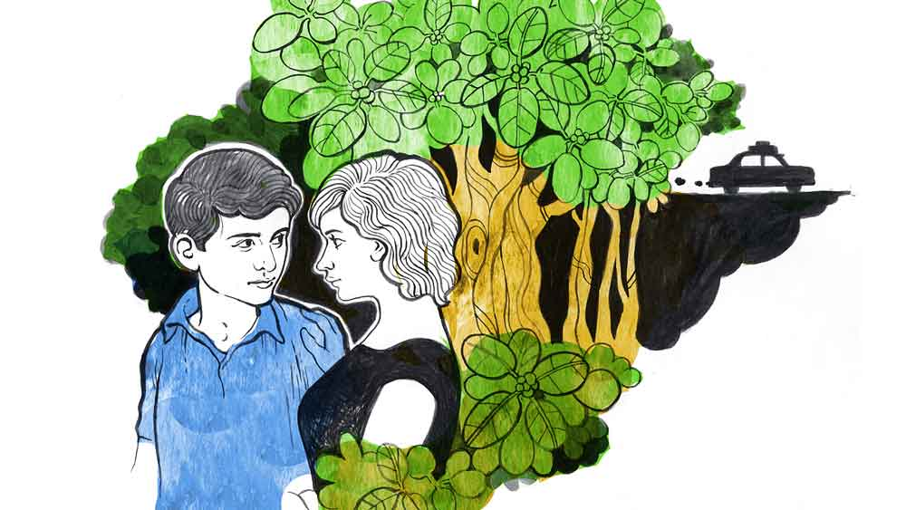

 
 <h1 align=center>অক্ষয় বট</h1>
<h2 align=center>অরিন্দম গঙ্গোপাধ্যায়</h2> চন্দ্রপুর কোভিড হাসপাতালের সামনে গাড়ি থেকে নামলেন অনন্যা সেন। দীর্ঘ পঁচিশ বছর পেরিয়ে গেছে। কুমারী অনন্যা চৌধুরী আজ মিসেস অনন্যা সেন। শুধু একটা জিনিসই দেখে একটু যেন উদাস হয়ে গেলেন তিনি। সেই বটগাছটা এখনও দাঁড়িয়ে আছে।

কোনও রকমে নিজেকে সামলে এগিয়ে চললেন রিসেপশনে খোঁজ নিতে। তাঁর স্বামী সুবিমল সেন দিন দশেক হল এখানে ভর্তি হয়েছেন। মানে ভর্তি হতে বাধ্য হয়েছেন। সারা দেশে এই মহামারির দ্বিতীয় ঢেউ হাহাকার ফেলে দিয়েছে। ভাগ্যিস ওঁদের পারিবারিক চিকিৎসক ডা. জয়ন্ত মুখার্জি সময় মতো ভর্তির পরামর্শ দিয়েছিলেন, নইলে এখন কোথাও বেড নেই, বেড আছে তো অক্সিজেন নেই। এই ভয়ানক অবস্থার মধ্যে বেঁচে থাকাটাই মানুষের কাছে চ্যালেঞ্জ। কলকাতার কোনও প্রাইভেট নার্সিংহোমে সুবিমলকে ভর্তি করানোটা কোনও ব্যাপারই ছিল না তাদের কাছে। কিন্তু বেড আর অক্সিজেনের হাহাকার। তাই এত দূরে। এই সব ভাবতে ভাবতেই হাসপাতালের ফাঁকা রাস্তা ধরে হাঁটছেন অন্যমনস্ক অনন্যা। তিনি আসতেও পারেননি রোজ। বাড়িতে দুই মেয়েই ছোট, তাদের ফেলে কি আর এই কোভিড পরিস্থিতিতে বার বার এত দূরে...

অনন্যার চমক ভাঙল ড্রাইভার হরেনের ডাকে, “ম্যাডাম, রিসেপশন এ দিকে।” 

“ও হ্যাঁ, চলো...” এক বার বটগাছটার দিকে তাকিয়ে আবার হাঁটতে লাগলেন তিনি।

লোকজন সে রকম নেই। বাড়ির লোক রোগী ভর্তি করছে, কিন্তু দেখা করতে পারছে না। কী হচ্ছে না হচ্ছে বোঝা যাচ্ছে না। অনিশ্চিত অবস্থা। ডাক্তারবাবুরাও চেষ্টা করেও রোগীর বাড়ির লোকদের সব কিছু বুঝিয়ে উঠতে পারছেন না।

“হ্যাঁ, ম্যাডাম বলুন?” জিজ্ঞেস করে রিসেপশনের মেয়েটি।

“মিস্টার সুবিমল সেন। কোভিড পেশেন্ট। বেড নম্বর ১৮।” 

“ওঃ আচ্ছা!” হালকা হাসি মেয়েটির মুখে, “ওঁকে তো আজ ছুটি দেওয়া হবে। ঠিক হয়ে গেছেন উনি।”

“হ্যাঁ। আমাকে ফোন করা হয়েছিল,” উত্তর দেন অনন্যা। 

“ম্যাডাম একটাই কথা। আমাদের পেশেন্ট ডিসচার্জের একটা পার্টিকুলার টাইম আছে। আপনাকে খানিক ক্ষণ অপেক্ষা করতে হবে।”

“ঠিক আছে। কত ক্ষণ?”

“বিকেল পাঁচটার পর আমাদের ডিসচার্জ টাইম।”

“ঠিক আছে। ওয়েট করছি।”

হাতের ঘড়িতে সময় দেখেন অনন্যা। সবে দুপুর একটা। অনেকটাই আগে আগে চলে এসেছেন সে।

গাড়ির কাছে এসে ড্রাইভার হরেনকে ডেকে গাড়ির পিছনের দরজাটা খুলিয়ে নেন অনন্যা। বসে জানলার বাইরে তাকান। খাঁ খাঁ শূন্যতার মধ্যে একমাত্র দেখা যাচ্ছে বটগাছটাকে। মনে পড়ল অনন্যার, ছোটবেলায় বড়দের কাছে শুনেছিলেন এ নাকি অক্ষয় বট। এর নীচে দাঁড়িয়ে দেওয়া প্রতিশ্রুতি কখনও মিথ্যে হয় না। সত্যিই, আগেকার মানুষ কত সব ভিত্তিহীন বিষয়কে সত্যি বলে মানত। মনে মনে ভাবলেন তিনি।

অবাস্তব ছাড়া কী? এই শেষ সাত-আট দিন তো তার জীবনের উপর দিয়ে সব থেকে বড় বিপদ গেছে। আর এই বটের তলায় সেও তো তাঁকে আজ থেকে পঁচিশ বছর আগে প্রতিশ্রুতি দিয়েছিল, বলেছিল— “অনু, আমরা হয়তো আর জীবনে এক হতে পারব না। কিন্তু যদি কখনও বিপদে পড়ো, আমাকে ডেকো। আমি জীবন দিয়েও তোমাকে সেই বিপদ থেকে রক্ষা করব।”

এত সমস্যার মধ্যেও হাসি পেল অনন্যার। আঠারো বছর বয়সের দুরন্ত আবেগে সপ্তদশী অনন্যাকে এই বটের নীচে দাঁড়িয়েই কথাগুলো বলেছিল সুনন্দ। সেই শেষ দেখা। তার পর দিনই চৌধুরীদের জমিদারবাড়ি ফাঁকা হয়ে গিয়েছিল। চৌধুরীরা চলে গিয়েছিল কলকাতায়। জমিদারি অনেক দিনই আগেই গেছিল। এখন চৌধুরীদের কোনও কিছুই অবশিষ্ট নেই। পড়ে আছে ভগ্নপ্রায় প্রাসাদ। অতীতের সাক্ষী হয়ে।

পিছনের সিটে মানসিক ভাবে ক্লান্ত অনন্যা মাথাটা হেলিয়ে চোখ বন্ধ করলেন।

 

*****

“সুনন্দ! সুনন্দ!”

চন্দ্রপুর বয়েজ় স্কুলের মাঠ ঘিরে দাঁড়িয়ে থাকা আট থেকে আশি সকলেই একযোগে চিৎকার করে চলেছে এই নাম ধরে।

চন্দ্রপুর বয়েজ স্কুল আর বীরপাড়া হাইস্কুলের মধ্যে ফুটবল ফাইনাল ম্যাচ। এই জেলায় এই দু’টি স্কুলের ফুটবল দলই সব থেকে ভাল। প্রায় প্রতি বারই এই দুটো টিমের মধ্যেই ফাইনাল খেলা হয়। গত তিন বছর ফাইনালে চন্দ্রপুর হারাতে পারেনি বীরপাড়াকে। কিন্তু এ বারে আশায় বুক বেঁধেছে সবাই, তার কারণ ক্লাস টেনের সুনন্দ রায়।

গার্লস স্কুলের বারান্দায় তখন তিল ধারণের জায়গা নেই। অনন্যা যখন এসে দাঁড়াল, বারান্দা তখন উত্তাল। মাঠ আর বাইরের চিৎকারে কান পাতা দায়। তার মধ্যেই প্রথম অনু দেখতে পায় সুনন্দকে। তুমুল চিৎকার যাকে নিয়ে, সেই সুনন্দর দাপটে বীরপাড়া তখন দিশেহারা। চন্দ্রপুর চার-শূন্যে এগিয়ে। এত বড় ব্যবধানে কখনও হারেনি বীরপাড়া। আজ একটা ছেলে সব হিসেব উল্টোপাল্টা করে দিল।

এত চিৎকার অনুর ভাল লাগে না। সে বরাবরই চুপচাপ। এক দিকে দাঁড়িয়ে খেলা দেখতে লাগল সে। একটু পরেই তার বন্ধু মানসী এসে দাঁড়াল পাশে। তাকে বলল, “কী রে অনু, কেমন দেখছিস খেলা?” 

“হ্যাঁ রে মানু, ওই যে সুনন্দ নাকী নাম, আমাদের দলে খেলছে,ওকে চিনিস?”

“কেন চিনব না। আমাদের বাড়ির পাশেই তো থাকে। অজয়জেঠুর ছেলে সুনন্দদা। কেন রে?”

“না, এমনিই।”

শেষ বাঁশি বাজার আগেই বাড়ি ফিরে এসেছিল অনন্যা।

পরদিন রবিবার সারা গ্রামের সব প্রবীণ মানুষেরা আড্ডা দিতে আসেন চৌধুরীবাড়ির বৈঠকখানায়। গত দিনের খেলা নিয়ে গল্প চলছিল। সেখান থেকেই সে অজস্র প্রশংসা শুনতে পায় সুনন্দ সম্পর্কে।

গোপাল চক্রবর্তী তো সুনন্দর প্রশংসায় পঞ্চমুখ। অনন্যার ঠাকুরদার উদ্দেশে বললেন, “বুঝলেন কত্তা, ছেলে বটে একখানা ওই অজয়ের। যেমন লেখাপড়ায় ভাল, তেমনই খেলাধুলোয় তুখোড়, আর কী ভদ্র মার্জিত ব্যবহার!”

“ঠিক বলেছ,” সমর্থন করেন বীরেন ঘোষ, “এই তো সে দিন হেডমাস্টার সুরেনবাবুর সঙ্গে কথা হল। উনি তো বললেন পরের বার মাধ্যমিকে সুনন্দ রাজ্যে এক থেকে দশের মধ্যে থাকবেই, লিখে নেবেন।”

সুনন্দর আলোচনাতেই সকাল গড়িয়ে গেল।

সোমবার মানসীর সঙ্গে স্কুলে যাওয়ার সময় কাছ থেকে অনন্যা দেখতে পায় সুনন্দকে। কথা হয়নি। মানসীর বকবক শুনতে শুনতেই স্কুল চলে এসেছিল। আর তার পর থেকে প্রতিদিনই স্কুলে যাওয়ার সময় দেখা হতে হতেই ঘনিষ্ঠতা বাড়ে দু’জনের।

সময় এগিয়ে চলে। চুপচাপ অনন্যার মধ্যে আস্তে আস্তে পরিবর্তন শুরু হয়। পাহাড়ের মধ্যে আটকে থাকা জলরাশি ক্রমশ ঝর্নাধারার মতো বেরিয়ে আসতে শুরু করে। এই পরিবর্তন অন্য কেউ লক্ষ না করলেও ঠাকুমা বরদাসুন্দরীদেবীর অভিজ্ঞ চোখ এড়ায়নি।

এক দিন ঘুমোনোর সময় নাতনির মাথায় হাত বোলাতে বোলাতে জানতে চান, “কী গো দিদিভাই, আজকাল স্কুল থেকে ফিরতে এত দেরি হচ্ছে কেন?” 

“কোথায় দেরি? দেরি হয় না তো। তুমি কিচ্ছু জানো না ঠাম্মা!” সামান্য কথাটুকুতেই লজ্জার আভাস ফুটে ওঠে অনন্যার মুখে।

দেখে মৃদু হাসেন ঠাকুমা, “তা হতে পারে। বুড়ো হয়েছি তো। ঘড়িটা হয়তো ঠিক মতো দেখতে পাই না।”

আর কথা না বাড়িয়ে ঠাকুমাকে জড়িয়ে ধরে চোখ বন্ধ করে ফেলেছিল। পাছে আবার জেরার মুখে পড়তে হয়। গ্রামে বাড়ি হলেও বরদাসুন্দরী ছিলেন আধুনিক মনের। খারাপ কিছু দেখেননি তিনি এতে।

এ দিকে সবার অলক্ষ্যে বিভিন্ন ঘটনা ঘটতে থাকে। সাক্ষী থাকে মানসী। আর আড়াল থেকে খবর রাখতেন বরদাসুন্দরী। যতই হোক চৌধুরীবাড়ির জমিদারি গেলেও অহং তো যায়নি। সেটাই চিন্তার।

পরের বছর মাধ্যমিকের ফল বেরোল যথাসময়। সকলের প্রত্যাশা মতোই জেলায় প্রথম হয়ে ওই চন্দ্রপুর বয়েজ় স্কুলেই বিজ্ঞান বিভাগে ভর্তি হল সুনন্দ। আর সে দিনই ছুটির পর বোধহয় জীবনের সব থেকে দুঃসাহসিক কাজটা করে ফেলেছিল সে। ছুটির পর বটতলায় অনুর জন্য অপেক্ষা করছিল। অনন্যা এসে বটতলায় দাঁড়াতেই আর ধৈর্য রাখতে পারেনি সে। ওর হাতটা ধরে বলে ফেলেছিল, “অনু, আমি তোমাকে ভালবাসি। তুমি…”

আবেগ, লজ্জা, ভয় সব কিছু এক সঙ্গে গ্রাস করেছিল অনন্যাকে। ওই কথা শোনার পর আর দাঁড়িয়ে থাকতে পারেনি সে। মানসীকে নিয়ে দৌড়ে পালিয়ে এসেছিল সুনন্দর ডাক উপেক্ষা করে। বাড়ি এসে পৌঁছতে কেউ কিছু লক্ষ না করলেও ঠাকুমা আদরের নাতনির চোখে ভয় আর মনে আনন্দ দেখতে পেয়েছিলেন।  চন্দনগাছের কাছাকাছি থাকতে থাকতে অন্যান্য গাছের যেমন পরিবর্তন আসে, তেমনই অনুও ধীরে ধীরে লেখাপড়ায় ভাল হতে থাকল। স্কুলের দিদিমণিরাও আজকাল তার ব্যাপারে উচ্ছ্বসিত। মাধ্যমিকে সকলেই তার ভাল ফলের প্রত্যাশা করছে। বাড়ির লোকজনও তার লেখাপড়ার প্রতি আন্তরিকতায় মুগ্ধ। কিন্তু আসল রহস্য জানেন কেবল এক জনই। তিনি বরদাসুন্দরী।

কিন্তু সন্তর্পণে লুকিয়ে রাখা এই প্রণয়গাথা এক দিন জানাজানি হয়ে গেল। মাধ্যমিকের শেষ পরীক্ষার দিন বিকেলে বটের ছায়ায় তাদের প্রেমালাপ ধরা পড়ে গেল অনুর কাকার চোখে।

চৌধুরীবাড়িতে হুলস্থুল। বড়কর্তা রমেন্দ্রবাবু ডেকে পাঠিয়েছেন অজয় এবং তার ছেলে সুনন্দকে। বৈঠকখানা থমথমে। প্রাথমিক দোষারোপের পালা শেষ হতেই ক্ষুব্ধ অপমানিত অজয় যেই হাত তুলেছে ছেলেকে মারার জন্য, প্রতিবাদ করে উঠেছিলেন বরদাসুন্দরী।

“খবরদার অজয়, একদম গায়ে হাত তুলবে না ওর। কী অন্যায় করেছে ও?”

দোর্দণ্ডপ্রতাপ রমেন্দ্রবাবুও সে দিন তাঁর স্ত্রীর রুদ্রমূর্তির সামনে কথা বলতে পারেননি। সুনন্দর মাথায় হাত দিয়ে বরদাসুন্দরী বলেছিলেন, “সুনন্দ দাদুভাই, তুমি বাড়ি যাও। কেউ কিছু করবে না তোমাকে।”

তার পর চন্দ্রপুরে চৌধুরীবাড়ির ইতিহাস খুবই সংক্ষিপ্ত। তত দিনে চৌধুরীরা ঠিকই করে ফেলেছিল কলকাতা চলে যাবে। যাওয়ার আগের দিন ঠাকুমার সহায়তাতেই শেষ বার দেখা হয়েছিল সুনন্দর সঙ্গে। যে দিন অনুরা চলে আসছিল, সে দিন গাড়িতে ঠাকুমার পাশে বসে সে দেখেছিল সজল দৃষ্টিতে সুনন্দ তাকিয়ে আছে তাদের গাড়ির দিকে। ওই বটের নীচে দাঁড়িয়ে। ঠাকুমার বুকে মাথা রেখে ফুঁপিয়ে কেঁদে উঠেছিল সে।

ঠাকুমার কথাগুলো স্পষ্ট মনে আছে, “কেঁদো না দিদিভাই, অক্ষয় বটের নীচে দাঁড়িয়ে দেওয়া কথা কখনও মিথ্যে হয় না।”

 

*****

“ম্যাডাম!” ডাকে ড্রাইভার।

“ঠাম্মা!” বলে ধড়মড় করে গাড়িতে উঠে বসেন অনন্যা। বুঝতে পারেন, গাড়িতে বসে ঘুমিয়ে পড়েছিলেন। হরেন তাঁকে ডাকছে, বলছে, “ম্যাডাম, পাঁচটা বাজে।”

ধীর পায়ে কেবিনে পৌঁছে দেখেন সুবিমল বসে। পাশে দাঁড়িয়ে ডা. মিত্র।

“কেমন আছ?” স্বামীকে জিজ্ঞেস করেন অনন্যা।

“ভাল!” হেসে জবাবদেন সুবিমল।

“হরেন, স্যরকে ধরে গাড়িতে নিয়ে যাও।”

আজ্ঞা পালন করে হরেন।

“আপনাকে যে কী বলে ধন্যবাদ দেব ডা. মিত্র...”

“এটা আমাদের ডিউটি মিসেস সেন, তবে হ্যাঁ, আপনার ধন্যবাদ আর এক জনের প্রাপ্য বলতে পারেন...”

অবাক হয়ে তাকান অনন্যা। 

“হ্যাঁ, মিসেস সেন। অদ্ভুত ব্যাপার। মিস্টার সেন যেদিন ভর্তি হন, সে দিন ওঁর পাশের বেডে আর এক জন ছিলেন। প্রথম দু’দিন দু’জনের কথাবার্তাও হচ্ছিল। বেশ আনন্দেই ছিলেন ওঁরা। কিন্তু পরের দিন থেকেই ওই ভদ্রলোকের শ্বাসকষ্ট শুরু হতে আমরা অক্সিজেন চালু করি। তার পরের দিন আমাদের আরও বিপদে পড়তে হয় মিস্টার সেনের অক্সিজেন লেভেল কমে যেতে। আমরা তখন আতান্তরে। সেই সময় ওই ভদ্রলোক আমাকে ডাকেন। ডেকে বলেন যে, ‘ডাক্তারবাবু, আমি একা মানুষ, কিন্তু ওঁর পরিবার আছে, দুটো ছোট মেয়ে আছে, ওঁর সুস্থ হয়ে ওঠাটা জরুরি। আপনি আমার অক্সিজেন খুলে ওঁকে দিন।’ ওঁর বারংবার অনুরোধে আমরা বাধ্য হয়ে তা-ই করি।”

“কী বলছেন আপনি?” অবাক হয় অনন্যা।

“অসাধারণ ক্ষমতা ওঁর। শ্বাসকষ্ট কী অম্লানবদনে সহ্য করছিলেন উনি। কী অদ্ভুত ব্যাপার জানেন, ভদ্রলোক খালি আমাকে একটা কথাই বলতেন, ‘ডাক্তারবাবু ওই বটের নীচে কোনও দিন গিয়ে দাঁড়িয়েছেন!’ আসলে জানেন মিসেস সেন, একা মানুষ তো, বোধহয় মাথাটা একটু গোলমাল ছিল, না হলে কেউ…” 

হঠাৎ যেন এক অজানা আশঙ্কায় দুলে ওঠে অনন্যার শরীর। 

“ডা. মিত্র, আমার হয়ে ধন্যবাদটা নাহয় আপনিই দিয়ে দেবেন, দেখা তো আর করতে দেবেন না...”

“তার আর উপায় নেই মিসেস সেন। উনি আমাদের ধন্যবাদের আওতার বাইরে চলে গেছেন। আজ সকালেই উনি মারা গেছেন। ও দিকে দেখুন, ওঁর দেহ প্যাক করে গাড়িতে উঠছে। মিস্টার সেন জানেন না, ওঁকে বলবেন না। আঘাত পেতে পারেন।”

অনন্যার শিরদাঁড়ায় যেন বিদ্যুৎ খেলে গেল। জিজ্ঞেস করলেন, “ডা. মিত্র, ওঁর নামটা জানা যাবে কি?”

ডা. মিত্র নার্সকে বললেন, “কাকলি, ওই যে ১৭ নম্বর বেডের পেশেন্ট, মারা গেলেন ওঁর নামটা দেখুন তো...”

“হ্যাঁ স্যর,” খাতা খোলে মেয়েটি, “এই তো, নাম সুনন্দ রায়, সান অব লেট অজয় রায়…”

পাশে রাখা চেয়ারটায় ধপ করে বসে পড়েন অনন্যা।

“মিসেস সেন, আপনার কি শরীর খারাপ লাগছে, জল খাবেন?” সন্ত্রস্ত হন ডা. মিত্র।

“না আমি ঠিক আছি। আসলে মাথাটা একটু...” উঠে দাঁড়ান অনন্যা।

ডা. মিত্র লক্ষ করেন মিসেস সেনের চোখে জল।

“মিসেস সেন, আপনি কি ওঁকে চিনতেন?”

“একটা অনুরোধ করব ডা. মিত্র?” বলে অনন্যা।

“হ্যাঁ, বলুন।”

“পারলে এক বার ওই বটগাছটার ছায়ায় গিয়ে দাঁড়াবেন কখনও...”

অবাক চোখে তাকিয়ে থাকেন ডা. মিত্র। ধীর পায়ে অনন্যা এগিয়ে চলেন গাড়ির দিকে।

সবচেয়ে আগে সব খবর, ঠিক খবর, প্রতি মুহূর্তে। ফলো করুন আমাদের Google News, Twitter এবং Instagram পেজ।