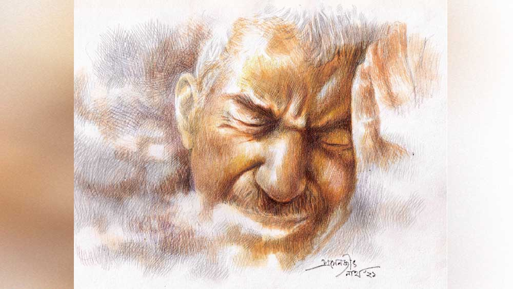

 

<h1 align=center>অগোচরে</h1>
<h2 align=center>সৌরদীপ্ত সেন</h2>
পর্দা সরিয়ে দরজায় দুটো টোকা মেরে ঘরে ঢুকলেন অমিয়বাবু।   “অমিয়বাবু?”   “হ্যাঁ, শুভ সন্ধ্যা।”   “শুভ সন্ধ্যা। আপনি বসুন প্লিজ়... বি কমফর্টেব্‌ল!”   বসলেন অমিয়বাবু। ভাল করে ডাক্তারটিকে দেখলেন এত ক্ষণে। সোফার এক কোণে পায়ের ওপর পা তুলে হাতে পেন আর নোটবুক নিয়ে বসে আছেন মানুষটা। বছর চল্লিশেক বয়স। মুখে আলাপী হাসি। বললেন, “ফাইল থেকে কিছু তো পেলাম না। আপনার মুখেই শোনা যাক।”   “আমার এ রকম আগে কখনও হয়নি। ফাইলে তাই এর কোনও উল্লেখই নেই।”   “বেশ। আমি শুনেছি, তবু আপনার মুখ থেকে শুনি...”   এসির হালকা ঠান্ডায় আরাম হচ্ছে অমিয়বাবুর। ঘাড় চুলকে তিনি ভাবলেন, কোথা থেকে শুরু করা যায়। সমস্যাটা দেড়-দু’বছর ধরে জ্বালাচ্ছে তাঁকে।   তাঁর মনে এক ধরনের শুচিবাই জন্ম নিয়েছে। ইংরেজিতে যাকে বলে ওসিডি— অবসেসিভ কম্পালসিভ ডিসঅর্ডার, একটি বিচ্ছিরি মাথার ব্যামো। শুরু করলেন তিনি...   “আমি কিছুতেই কোনও কাজ সেরে নিশ্চিন্ত হতে পারি না। দরজায় তালা দিয়ে বাড়ি থেকে বেরিয়ে কিছুটা গিয়ে আমার মনে হয় তালাটা ঠিক মতো দিইনি। আবার দ্বিতীয় বার তালা ধরে টানাটানির পর নিশ্চিন্ত হই। আবার কিছুটা গিয়ে মনে হয়, ঘরের পাখাটা বন্ধ করতে ভুলে গেছি, কিংবা মুখ ধুয়ে বেসিনের কলটা খুলে আসিনি তো? রোজ অফিস বেরনোর আগে প্রায় কুড়ি মিনিট ধরে সারা বাড়ির যতগুলো জায়গায় আমি পা রেখেছি, সব জায়গা পরীক্ষা করে দেখি সব ঠিক আছে কি না। হয়তো হঠাৎ মনে হল, কল খোলা কি না দেখার জন্য আলোটা জ্বেলেছিলাম, সেটা নিভিয়েছি কি, কিংবা গিজ়ারের সুইচটা জোরে টিপতে হয়, হয়তো বন্ধ হয়নি— এই করতে করতে রোজ অফিস লেট। আর শুধু কি বাড়ি থেকে বেরনোর সময়? এ রকম চলতেই থাকে, ফর্ম জমা দেওয়া, অ্যাপ্লিকেশন লেখা, রান্না করার সময়, বিল জমা করার সময় টাকা উনিশ-কুড়ি বার গুনে নেওয়া, কোথায় নয়...”   অমিয়বাবুর কথা খুব মন দিয়ে শুনলেন ডাক্তারবাবু। অমিয়বাবু আজ অফিস-ফেরত একাই এসেছেন ডাক্তারখানায়। অনেক কায়দা করে এর-তার সঙ্গে কথা বলে ডাক্তারটির সন্ধান পেয়েছেন তিনি, বেশ নামডাক আছে এঁর। খুঁজতে গিয়ে দেখেছেন পেট-চোখ-বুকের ডাক্তারের হদিশ যত সহজে মেলে, সাইকায়াট্রিস্ট খুঁজে পেতে ঠিক ততটাই কষ্ট।   ডাক্তারবাবুর ঠোঁটের কোণে একটা হাসি লক্ষ করলেন অমিয়বাবু। ডায়েরিতে কিছু নোট নিয়ে মুখ তুললেন তিনি, “আপনার সবচেয়ে বড় প্লাস পয়েন্ট কী জানেন, আপনি বুঝতে পারছেন যে, আপনি যা করছেন সেটা স্বাভাবিক নয়। সেই জন্যই আমি আপনাকে আশ্বস্ত করতে পারি, আপনি দুশো শতাংশ ঠিক আছেন। নিজেকে পাগল ভেবে বসে খাওয়া-ঘুম বন্ধ করবেন না যেন।”   মুখ নামিয়ে অমিয়বাবুও একটু হাসলেন। চিন্তা একটু হচ্ছিল ঠিকই কিন্তু ডাক্তার যখন বলছেন, তখন…   “আচ্ছা এর কোনও ওষুধ?”   “আপনি যখন আমার চেম্বারে এসেছেন, ওষুধ তো আমাকে দিতে হবেই,” হাসলেন ডাক্তারবাবু, “শুনুন, এই যে ওসিডি নামক মানসিক অবস্থা, এর অনেক রকম শাখাপ্রশাখা, আর তার প্রত্যেকটিকে বাগে আনার জন্য আলাদা আলাদা ওষুধ, থেরাপি, যোগব্যায়াম হতে পারে। আপনার ক্ষেত্রে এটি খুবই সামান্য অবস্থায় রয়েছে, আমার কাছে না এলেও আপনার সে রকম কোনও ক্ষতি হত না। আশপাশে নজর করুন, প্রতি দশ জনের মধ্যে চার জন হয়তো আপনার মতো ভুগছে। সে যাক, এসে যখন পড়েছেনই, আমি আপনাকে কয়েকটা অ্যান্টি-ডিপ্রেস্যান্ট দেব। এ ছাড়া কগনিটিভ বিহেভিয়ারাল থেরাপির কিছু টোটকা আপনাকে আমি শিখিয়ে দেব। সেগুলো আপনাকে নিজেকেই করতে হবে, মন দিয়ে শুনে নেবেন।”   মিনিট কুড়ি পরে বাইরে বেরিয়ে সামনের চায়ের দোকানে কাঠের বেঞ্চে বসে ভাঁড়ে চা বললেন অমিয়বাবু। বুঝলেন যে, তাঁর এরই মধ্যে মনটা হালকা লাগছে।   ব্যাগ থেকে মোবাইল বার করতে গিয়ে হঠাৎ একটু থমকালেন তিনি।   ডাক্তারের কাগজপত্র ঠিকমতো ঢুকিয়েছিলেন? কাউন্টারে কথা বলতে বলতে তো সব কিছু ব্যাগে ভরছিলেন, দেখে আসবেন নাকি ভেতর থেকে এক বার?   দাঁতে দাঁত চিপলেন অমিয়বাবু, ডাক্তারের টোটকা অনুযায়ী ভাবার চেষ্টা করলেন। কিছু ফেলে এলে কাউন্টারের মহিলা কি তাকে ডাকত না? এ ছাড়া তাঁর ফোন নম্বর দেওয়া আছে, কিছু ফেলে গেলে নিশ্চয়ই তাঁকে ফোন করে জানানো হবে।   আর বড়জোর কী হবে, তাঁকে আর এক বার আসতে হবে এখানে, তাঁকে গ্রেফতার করে কাঠগড়ায় তো আর তোলা হবে না?   চা-টা শেষ করে প্রচণ্ড অস্বস্তি নিয়ে বাসে উঠলেন অমিয়বাবু। তাঁর মনের ফুরফুরে ভাবটা কেমন যেন ফিকে হয়ে গেল।   মাসকয়েক কেটে গেছে, শীতকাল। অমিয়বাবু চায়ের জল ফোটাচ্ছিলেন। আজ অফিসের পিকনিক, ছেলেও সঙ্গে যাবে। ছেলে সুপ্রিয় এ বার উচ্চ মাধ্যমিক দেবে, জানুয়ারি থেকে চাপ শুরু হবে, এই সময় একটু ঘুরে এলে ক্ষতি নেই। স্ত্রী পারমিতা দিনদুয়েক আগে বাপের বাড়ি গেছে, শ্বশুরমশাইয়ের শরীর ভাল নেই। আজ রাতে ফিরবে।   ঘণ্টাখানেক পর দু’জনে বেরিয়ে এলেন। শীতের সকালে ধোঁয়াশা ঘেরা রাস্তা, গাড়িগুলো হেডলাইট বন্ধ করার সাহস পায়নি এখন।   কোল্যাপসিব্‌ল গেটে তালা দিয়ে, চাবিটা পকেটে ঢুকিয়ে অমিয়বাবু বড়রাস্তার দিকে হাঁটা দিলেন ছেলের সঙ্গে, ঠোঁটের কোণে মুচকি হাসি।   হ্যাঁ, রোজ যখন সুপ্রিয় স্কুলে আর পারমিতা অফিসে বেরিয়ে যায়, যখন অমিয়বাবুকে সব কিছু বন্ধ করে তালা দিয়ে ফাঁকা বাড়ি থেকে বেরোতে হয়, তখন তিনি এ রকম মুচকি হাসেন। তিনি জানেন যে তিনি যখন ফোনের বিল জমা দিতে যাবেন, বা পরের সপ্তাহে ব্যাঙ্কে ইনশিয়োরেন্সের প্রিমিয়ামটা জমা দিতে যাবেন, তখনও এ রকম মুচকি হাসবেন।   তিনি এখন প্রায় পুরোপুরি স্বাভাবিক হয়ে গেছেন যে!   ডাক্তারের ওষুধ দশ দিন আগে ফুরিয়ে গেছে, কিন্তু তবুও বহাল তবিয়তেই আছেন তিনি। অনেক রকম টোটকা তিনি প্রয়োগ করেছেন এই এক মাসে, আর প্রত্যেকটিই অব্যর্থ ভাবে তাঁকে সাহায্য করেছে মানসিক অস্বস্তি দূর করতে। প্রথম দিকে মন খচখচ করত, হাঁসফাঁস লাগত রোজকার রুটিনটা থেকে বেরিয়ে। কিন্তু ওই যে, নিজের দুর্বলতাকে পরাভূত করার সবচেয়ে ভাল উপায় হল, সেটার মুখোমুখি হয়ে রুখে দাঁড়ানো। আর এই পন্থা অবলম্বন করেই অমিয়বাবু আজ এক অন্য অমিয়ভূষণ দত্তগুপ্ত।   তাঁর স্ত্রী বা ছেলে তাঁর শুচিবাইয়ের কথা জানলেও ব্যাপারটা কতটা গুরুতর হয়ে উঠেছিল সেটা আঁচ করতে পারেনি। তাই তাঁর ডাক্তারের কাছে যাওয়া, ওষুধ খাওয়া, থেরাপি ইত্যাদি সব কিছু রাখঢাক করেই চালিয়ে গেছেন অমিয়বাবু। আর সেই জন্যই এই কয়েক দিনের মধ্যে তাঁর এই পরিবর্তন দেখে পারমিতা বা সুপ্রিয় কিছুটা অবাক হলেও বদলটা স্বাভাবিকের দিকে মোড় নেওয়ায়, অনেকটা নিশ্চিন্ত।   পিকনিকে খাওয়াদাওয়া জমে গিয়েছিল বেশ। চাটনি শেষ করে সুপ্রিয় যখন নলেনগুড়ের সন্দেশটায় প্রথম কামড়টা বসাল তখন ওঁর পকেটের ফোনটা বেজে উঠল। প্লাস্টিকের প্লেটটা বাঁ হাত থেকে ডান হাতে বদল করে ফোনটা বার করে দেখল, মা কলিং।   “বলো, আমাদের খাওয়াদাওয়া চলছে এখন।”   “তোর বাবা কোথায়? ফোন করছি এত বার, তুলছে না কেন?”   বুকটা ছ্যাঁত করে উঠল সুপ্রিয়র, মায়ের গলা স্বাভাবিক শোনাচ্ছে না। দাদুর কিছু হয়ে গেল না কি?   “কী হয়েছে?”   “যত তাড়াতাড়ি সম্ভব আয়, আমাদের বাড়িতে আগুন লেগেছে।”   লোকাল থানার একটি সুমো, দমকলের দু’খানা গাড়ি আর ভিড় করে নাটক দেখতে আসা কোনও রকম সাহায্যে না লাগা পাড়া-প্রতিবেশীর জটলাটা পেরিয়ে অমিয়বাবু যখন ভেতরে ঢুকলেন, তখন শীতকালের সন্ধে নেমে গেছে।   এগিয়ে এল সাদা উর্দিধারী থানার ওসি, “আপনাকে এক বার থানায় আসতে হবে, কয়েকটা ফর্মালিটি আর কী!” কালো ছোপ পড়ে যাওয়া দেওয়ালগুলোর দিকে ইশারা করল ভদ্রলোক, “খুব একটা ক্ষতি হয়নি, আপনার একতলার ডাইনিংটা ড্যামেজটা খেয়ে নিয়েছে। গ্যাস অন ছিল, বন্ধ করতে ভুলে গেছিলেন হয়তো। প্রদীপ বা ধূপকাঠি কিছু জ্বালানো ছিল কি, যাতে আগুনটা ধরে নিয়েছে?”   ফ্যালফ্যাল দৃষ্টি নিয়ে তাকিয়ে রইলেন অমিয়বাবু, ঢাক পেটানোর মতো হৃৎস্পন্দনটা হঠাৎ শুরু হল।   সকালবেলা খাওয়ার সময় নতুন একটা মশার ধূপ তিনি জ্বালিয়েছিলেন, যার মেয়াদ কম করে হলেও চার-সাড়ে চার ঘণ্টা। আর গ্যাস ব্যবহার করে চা-টাও তিনিই করেছিলেন। অগ্নিকাণ্ডের সময়ের হিসেবনিকেশটা কাছাকাছি যাচ্ছে না?   নিজের হাতের দিকে তাকালেন অমিয়বাবু, তাঁর দু’হাতই পোড়া ছাইয়ের কালিতে কালো হয়ে গেছে।      এর পর তিন বছর কেটে গেছে।   আজ অমিয়বাবু সস্ত্রীক পুনে যাবেন সুপ্রিয়র সঙ্গে ছুটি কাটাতে। সুপ্রিয় হস্টেলে থেকে পড়াশোনা করে, এখন শীতের ছুটি চলছে।   এই নিয়ে চতুর্থ বার প্লেনের টিকিট, মেন সুইচ, কল, গ্যাস ইত্যাদি চেক করে ট্রলি নিয়ে বাইরে এলেন অমিয়বাবু। ভাবলেন, এক বার দেখে নেবেন ওষুধগুলো নিয়েছেন কি না।   ডাক্তারটির কাছে আর যাননি তিনি। চেকলিস্ট বানিয়ে কাজ করার সব নোটগুলো ডাস্টবিনের রাস্তা দেখেছিল ওই সাঙ্ঘাতিক ঘটনাটার পরেই। ওষুধগুলোও আর খাননি তিনি। দরকার নেই শুচিবাই কাটানোর, তিনি যেমন ছিলেন, তেমনই বাঁচবেন না হয়। অন্তত এ রকম ঘটনার পুনরাবৃত্তি তো হবে না। সেই অভিশপ্ত দিনটা নিয়ে অনেক প্রশ্ন মনে উঁকিঝুঁকি মারলেও তা নিজের মনেই চাপা দিয়েছেন তিনি।   ট্যাক্সি ডেকে তিনি মালপত্র তোলাচ্ছিলেন ডিকিতে। তালাগুলো ঠিকঠাক দেওয়া হয়েছে কি না দেখে গাড়িতে বসলেন অমিয়বাবু। রবীন্দ্রসদনের সিগন্যালে ওদের ট্যাক্সিটা এসে দাঁড়াল, জানলা দিয়ে উঁকি দিলেন অমিয়বাবু। এই রাস্তা দিয়ে সিগন্যাল পেরিয়ে সোজা গিয়ে বাঁ দিকের গলির মুখেই সেই ডাক্তারের চেম্বার। দীর্ঘশ্বাস ফেললেন তিনি, কয়েকদিনের জন্য বেশ ভাল ছিলেন বটে। কিন্তু ওই যে, সব ভাল যার শেষ ভাল— তাঁর শেষটা তো একদমই ভাল হল না।   আগুন লাগার ব্যাপারটার পরে ওঁদের বাড়িতে ওটা নিয়ে কোনও কথা হয়নি কারও মধ্যে। অমিয়বাবু সচরাচর ভুল করেন না বাকিরা জানে, তাই এই ব্যাপারটায় তাঁকে দোষারোপ বা চুলচেরা বিশ্লেষণ করলে, তাঁকে যে আঘাতই দেওয়া হবে, এটা হয়তো সুপ্রিয় আর পারমিতা বুঝেছিল।   অমিয়বাবু জানলার কাচ তুললেন, অন্তত পারমিতা গোড়া থেকে খোলসা করে সব কিছু জানুক।   “বুঝলে, একটা ব্যাপার তোমাদের বলা হয়নি,” মুখ ফেরালেন অমিয়বাবু, পারমিতার দৃষ্টি নীচের দিকে। হাতের ছোট ব্যাগটা খুলে কী যেন খুঁজছে।   “কী খুঁজছ?”   “দেখে নিচ্ছিলাম, সব ঠিকঠাক নিয়েছি কি না। টিকিট, ফোন-চার্জার... এত দিনের জন্য যাওয়া তো, তাই।”   কিছু ক্ষণ তাকিয়ে রইলেন অমিয়বাবু। ব্যাগ গোছানোর সময় অন্তত তিন বার পারমিতা এগুলো দেখে নিয়েছিল। তিনি জিজ্ঞেস করলেন, “তখন ভেতরে ঢুকলে দেখলাম, কিছু ফেলে এসেছিলে?”   “ও এক বার গ্যাসটা দেখে এলাম, নিজের মনকে নিশ্চিন্ত রাখার জন্য মোবাইলে ছবিও তুলে নিয়েছি। অস্বস্তি হলে মোবাইলে ছবি দেখে নেব, জানলা বন্ধ, ফ্রিজ বন্ধ, গাছের টব বাইরে রাখা। আমি কাজ করে ছবি তুলে রাখি আজকাল।”   মুখটা হাঁ হয়ে গেল অমিয়বাবুর।   জানলা দিয়ে বাইরে তাকাল পারমিতা, “তোমাদের একটা কথা অনেক বার ভেবেছি বলব, কিন্তু সাহসে কুলোয়নি। ওই দিন তোমরা বেরিয়ে যাওয়ার পরে আমি সকালবেলাই বাড়ি চলে এসেছিলাম, কিন্তু বাড়ি ফেরার পরেই অফিস থেকে এমার্জেন্সি ডাক পড়ে। পুজো দিয়েই বেরিয়ে যেতে হয়েছিল, এক মিনিটও বসার সুযোগ পাইনি।”   এ দিকে ফিরে অমিয়বাবুর হাতে হাত রাখল পারমিতা, চোখদুটো একটু ছলছলে লাগছে মনে হল, “স্নানের জল গরম করে গ্যাসটা বন্ধ করতে ভুলে গেছিলাম হয়তো, আমি বেরিয়ে যাওয়ার কিছু ক্ষণের মধ্যেই প্রদীপের আগুনটা… পাশের বাড়ির অমিতাদির কাছে তোমার নম্বরটা ছিল না, তাই দমকলকে জানিয়েই আমায় ফোন করেছিল। ওর মুখে ঘটনাটা শুনেই বুঝে গেছিলাম, মনের ভুলে কী সর্বনাশটা আমি ঘটিয়ে ফেলেছি। তার পর থেকেই এই বাতিকটা... লোকে হয়তো বলবে আমি ওসিডি-তে ভুগছি, কিন্তু হোকগে। যেমন আছি তেমন ভাবেই বাঁচব না-হয়, অন্তত এ রকম ঘটনার পুনরাবৃত্তি তো হবে না।”   মন-চিকিৎসকের ডাক্তারখানার গলির পাশ দিয়ে একরাশ কালো ধোঁয়া ছেড়ে হুশ করে ওঁদের ট্যাক্সিটা সোজা রাস্তা ধরে বেরিয়ে গেল এয়ারপোর্টের দিকে।   