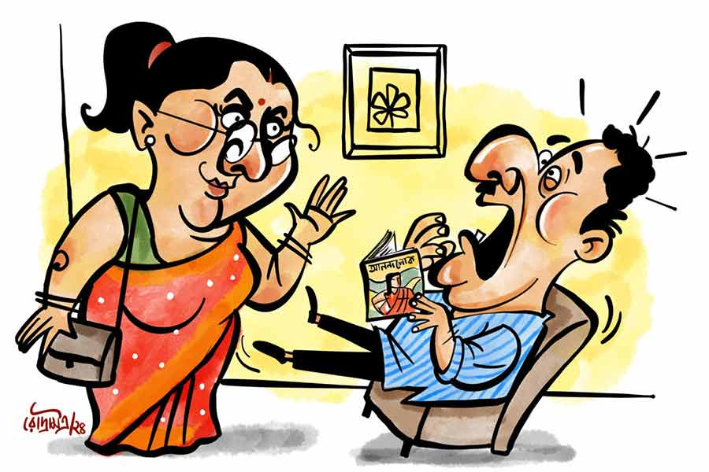

 
 <h1 align=center>অদ্ভুত</h1>
<h2 align=center>সুশোভন অধিকারী</h2> 

রিটায়ার্ড লাইফ একটা ভীষণ ঝামেলার ব্যাপার, বুঝলেন! আমরণ কালের এক ধরনের খ্যাঁচাকলও বলতে পারেন। রিটায়ার করার আগে খুব মনে হয়, ‘আঃ! এই বার অখণ্ড বিশ্রাম! চাকরির চাপে কত শখ-আহ্লাদের গলা টিপে দিতে হয়েছে এত দিন, এই বার সে সবের দিকে চোখ তুলে তাকানোর সময় এসেছে। নিজের মতো করে বাকি জীবনটা বাঁচার সময় এসেছে...’ কিন্তু কার্যকালে সবটাই কচুপোড়া!

আমার মেয়ের বিয়ে হয়ে গেছে অনেক দিন আগে। সে এখন থাকে নদিয়ার কৃষ্ণনগরে। ছেলে চাকরির সুবাদে কোচবিহারে। অবসর গ্রহণের পর এখন আমরা কর্তা-গিন্নি দু’জনেই পড়ে আছি আমাদের হুগলির শ্রীরামপুরের বাড়িতে। আয়নায় নিজেদের মুখ আর আয়নার বাইরে একে-অপরের মুখ ছাড়া সারা দিন দেখার মতো কোনও মনুষ্যমুখ নেই। ফলে একঘেয়েমির চোটে দু’জনেই দিনরাত হা-হুতাশ করছি।

আমার অবসর নেওয়ার পর গিন্নির হতাশা অবশ্য একটু বেশিই। তার ধারণা, আমি নাকি সর্বক্ষণ বাড়িতে থেকে তার পিছনে টেবিল ক্লকের মতো টিক টিক করে যাচ্ছি। কিন্তু আমিই বা যাই কোথায়! পাড়ায় আমাকে সবাই এড়িয়ে চলে। বলে আমার নাকি নাক-উঁচু। অথচ চিরকালের ভোঁতা নাক আমার। সেই নিয়ে আমার দুঃখ যাওয়ার নয়। এই গিন্নিই যৌবনকালে আমার নাকটা ধরে নেড়ে দিয়ে বলেছিলেন, “সবই ঠিক আছে, যদি নাকটা আর একটু খাড়া হত!” কিছুই না। মনে কমপ্লেক্স তৈরি করে দেওয়ার একটা সূক্ষ্ম চাল।

আসল কথা হল, আমাদের প্রজন্মের প্রতিটি নারীর হৃদয়েই বাস করেন উত্তমকুমার। হিসেবমতো প্রথম স্বামী তিনিই। তথাকথিত সামাজিক স্বামীরা সব্বাই দ্বিতীয়। তা আমরাই বা কম কোথায়! আমাদের বয়সের সব পুরুষের হৃদয়েও তো সুচিত্রা সেন বাস করেন। তাই না? মানিয়ে আমরাও নিই। মানিয়ে-গুছিয়ে যত দিন থাকা যায় আর কী!

কিন্তু মুশকিলের কথা হচ্ছে, আমার এই অবসরজীবনে আমাকে আর মানিয়ে নিতে পারছেন না আমার গিন্নি। অবশ্য আমাকে সে সব বুঝতে না দিয়ে তিনি ইদানীং মহিলা সমিতি নিয়ে খুব ব্যস্ত হয়ে পড়েছেন। আমাদের পাড়াতেই একটু দূরে একটি টালির চালের পরিত্যক্ত বাড়ি আছে। সেখানে মহিলাদের জমায়েত হয়। এখন সেই জমায়েত ঘন ঘন হচ্ছে এবং গিন্নি সেখানে প্রায়ই দুপুর ও বিকেল কাটিয়ে আসছেন।

কানাঘুষোয় শুনেছি, যে সব মহিলারা ওই সমিতিতে আছেন, তাঁদের অনেকের স্বামীই নাকি পথে-ঘাটে যেতে যেতে মহিলা সমিতির দিকে চোখ পড়লে দু’হাত জোড় করে একটা নমো ঠুকে দেন। হাজার হোক, ওই সমিতির জন্য তাঁদের গৃহ-পরিবেশে রোজ কয়েক ঘণ্টা করে অখণ্ড শান্তি বিরাজ তো করে!

আমার খাবারদাবার অবশ্য গুছিয়ে রেখে যান তিনি। দুপুরের খাবার মাইক্রোওভেনে রাখেন, বিকেলের চা ফ্লাস্কে। আর যাওয়ার সময় বলেন, “তা হলে বাইরে থেকে তালা দিয়ে যাই?”

আমি তীব্র প্রতিবাদ করি, “কেন, আমি কি চিড়িয়াখানার জন্তু, যে তালা দিতে হবে? নাকি ডিমেনশিয়ার রোগী যে, ফট করে বাড়ি থেকে বেরিয়ে পড়লে আর রাস্তা চিনে ফিরে আসতে পারব না?”

স্ত্রী যুক্তি দিতে চেষ্টা করেন, “না, মানে, তোমার তো এখন আর কোথাও বেরোবার নেই।”

গলায় যথাসম্ভব ঝাঁঝ-বিরক্তি মিশিয়ে স্পষ্ট জানিয়ে দিই, “না থাকলেই বা! আমি কি পরাধীন জীব? নাকি মানসিক রোগী? খবরদার তালা দেবে না। তুমি বেরিয়ে গেলে আমি বাইরের দরজায় ছিটকিনি লাগিয়ে দেব, ব্যস! তুমি এসে ডোরবেল বাজাবে, আমি দরজা খুলে দেব।”

“ওহ, আচ্ছা। তুমি যদি দুপুরে ঘুমোও, তাই বলছিলাম।”

“ঘুমোলেও, ঘুম থেকে উঠে আমি ছিটকিনি খুলে দেব। কিন্তু তালা কভি নেহি! খবরদার নয়!”

“আচ্ছা বাবা, আচ্ছা। অত চেঁচাবার কী আছে?”

অতঃপর গিন্নি পা টেনে টেনে বেরিয়ে গেলেন। আর্থ্রাইটিসে হাঁটু বেহাল, তবু যাওয়া চাই। আমার থেকে ওঁর মহিলা সমিতিই এখন বেশি প্রিয় হয়ে উঠেছে। হোক। উঠে গিয়ে সদরে খটাসখট ছিটকিনি মেরে আমি ঘরে এসে চেয়ারে ধপ করে বসে পড়লাম। গিন্নির এই অদ্ভুত ব্যবহার আমাকে ভাবিয়ে তুলল। এমনিতেই দুপুরে একা কখনও থাকিনি চাকরি জীবনে। অফিস গমগম করত। লোকজন, কাজকর্ম, তাড়হুড়ো, ব্যস্ততা, কাজের ফাঁকে ফাঁকে গপ্পো-আড্ডা— এখন মনে হয়, আহা! সে সব কী জমজমাট দিনই না ছিল! ফাঁকা বাড়িতে একটু গা ছমছম করে বইকী।

গিন্নি বেরিয়ে যাওয়ার পর বসে বসে ভাবতে লাগলাম, এ বার আমি কী করব! এখন তো সবে বেলা এগারোটা। খবরের কাগজটা পড়ে মুখস্থ করে ফেলেছি। বাড়িতে রবীন্দ্র রচনাবলি, শরৎ রচনাবলি, বঙ্কিমচন্দ্র, সব থরে থরে সাজানো। কিন্তু আজকাল আর মন বসে না। মনোযোগ ধরে রাখার ক্ষমতা কমে গেছে। আজকালকার বাসে-মেট্রোয় দেখা চব্বিশ ঘণ্টা মোবাইলমুখো ছেলেপুলেগুলোর মতো ছটফটে হয়ে গেছি অনেকটা। ঘরে বসে মোবাইলে কিংবা ল্যাপটপে সিনেমা দেখাতেই যেন আনন্দ। ঘরে সিনেমা চললে পর্দার লোকজনদের সঙ্গে তবু থাকা যায়। কম্পিউটার খুলে ইউটিউবে সার্চ দিলাম বেঙ্গলি মুভিজ় অব উত্তম-সুচিত্রা। সঙ্গে সঙ্গে পুরনো দিনের উত্তম-সুচিত্রা অভিনীত সিনেমার লিস্ট চলে এল। আমি একটু বাছাবাছি করে ‘অন্নপূর্ণার মন্দির’ ছায়াছবিটি দেখতে শুরু করলাম।

সুচিত্রা-উত্তমের নস্ট্যালজিয়ায় বেলা দুটো বেজে গেল। তার পর স্নান-টান সেরে মাইক্রোওভেনে রাখা খাবার স্ত্রীর উপর অভিমানে গরম না করেই খেয়ে শুয়ে পড়লাম বিছানায়। সিলিং ফ্যানে দৃষ্টি নিবদ্ধ। বসন্তকাল। পাখা না চালালেও চলে। ফ্যানের দিকে তাকিয়ে সুচিত্রা সেনের মুখটা ভাবতে লাগলাম। ভাবতে ভাবতে এক সময় সুচিত্রা সেনের মুখটা ভেসে উঠল ফ্যানের গায়ে। তার পর এক সময় সে আমার দিকে গভীর চোখে তাকিয়ে প্রশ্ন করল, “কেমন আছ?”

আর ঠিক তখনই ঘরের মধ্যে শাড়ির খসখস আওয়াজ! তবে কি সশরীরে সুচিত্রা হাজির হলেন আমার ঘরে! কিন্তু ঘাড় ঘুরিয়ে অতীব বিস্ময়ের সঙ্গে লক্ষ করলাম, গিন্নি এসে দাঁড়িয়েছেন ঘরের ভিতর।

আমার বুকটা ছ্যাঁত করে উঠল। কী ব্যাপার! গিন্নি বাড়ির ভিতর ঢুকল কী করে! ডোরবেল তো বাজায়নি! আমিও ছিটকিনি খুলিনি! তবে এ কি ইয়ে নাকি? মাথাটা ঝিমঝিম করে উঠল। তাকিয়ে দেখি গিন্নি মিটিমিটি হাসছেন। মনে তো হচ্ছে দিব্যি রক্তমাংসের শরীর। কোনও রকম ছায়া বা প্রতিবিম্ব নয়।

মুখ দিয়ে প্রশ্নটা হড়কে বেরিয়ে এল, “ঢুকলে কী করে?”

“রান্নাঘর দিয়ে।”

“অ্যাঁ! মানে? রান্নাঘরে খিল দেওয়া ছিল না?”

“না। দেখোনি বুঝি!”

ও হরি! অর্থাৎ সকালে রান্নার মাসি যে পথে গৃহে প্রবেশ করেন, সেই পথ দিয়েই প্রবেশ করেছেন আমার গিন্নি, আমাকে ডিস্টার্ব না করে। তার পর ধীরে ধীরে তিনি অন্য ঘরে শাড়ি পাল্টে সটান এসে শুয়ে পড়লেন আমার পাশে। আমি খানিক ইতস্তত করে তাকে একটু ছুঁয়ে দেখলাম। নাঃ, এ দেখছি বাস্তবিক আমার গিন্নিই। এর পর নাসিকাগর্জন সহকারে তিনি ঘুমোতে লাগলেন। এই নাসিকাগর্জনই প্রমাণ করল, ইনি আমার প্রকৃত গিন্নি। গিন্নিরা যখন ঘরে ঢোকেন, সুচিত্রা সেনরা জানলা দিয়ে অদৃশ্য হয়ে যান। কথাটা মনে হতেই দীর্ঘশ্বাস পড়ল আমার। তার পর চোখের পাতায় ঘুম নেমে এল।

রাতে গিন্নি আমার পাশে শুয়ে বললেন, “আমি মারা গেলে তোমার যে কী হবে কে জানে!”

“কেন?”

“কে তোমার জন্য খাবার রেখে যাবে মাইক্রোওভেনে? খাবারটা গরম করে নিয়েছিলে খাওয়ার সময়?”

বললাম, “না।”

“ঠান্ডা খাবার খেলে?”

গম্ভীর হয়ে বলি, “হ্যাঁ।”

“কী যে পাগলামি করো! একটু গরম করে নিতে কী হয়?”

আমি চুপ।

“কী হল? কথা বলছ না কেন?”

আমি তবু চুপ।

“কার কথা ভাবছ?”

“সুচিত্রা সেন।”

কী কাণ্ড! কোনও জেলাসি নেই! মাঝরাতে খ্যানখ্যান করে পেতনির মতো হেসে উঠল আমার গিন্নি।

*****

এক সপ্তাহ যেতে না যেতেই আবার মহিলা সমিতির মিটিং। এ বার আমার একটু রাগই হল।

“এত কিসের মিটিং?”

“আরে বাবা চিন্তা কিসের! তোমার খাবারদাবার সব গুছিয়ে রেখে যাব। দেখো, তোমার কোনও অসুবিধেই হবে না।”

“হুঁ! অসুবিধেটা যদি বুঝতে!”

“অসুবিধে অনেক বুঝেছি। আর বুঝতে চাই না। শোনো, খাবারটা কিন্তু অবশ্যই গরম করে খেয়ো। আমি এসে যাব চারটের মধ্যে।”

কী মনে হতে গিন্নিকে জিজ্ঞেস করি, “আজ তোমার খাওয়াদাওয়া বুঝি ওখানেই?”

“হ্যাঁ। আজ মহিলা সমিতিতে বিরিয়ানির অর্ডার দেওয়া হয়েছে।”

আমি বলি, “বাঃ! বেশ ভালই
তো আয়োজন!”

শ্লেষটা গায়ে না মেখে গিন্নি দরজার দিকে পা বাড়ান, “আমি চলি। ছিটকিনিটা দিয়ে দাও।”

গিন্নি চলে যেতেই আমি বাইরে যাওয়ার দরজায় খটাসখট ছিটকিনি লাগিয়ে রান্নাঘরে ঢুকলাম। দেখলাম খিল দেওয়া নেই। আমি খিলটা বাগিয়ে ধরে লাগিয়ে দিলাম দমাস করে। হুঁ হুঁ বাবা, আজ তোমায় ডোরবেল বাজাতেই হবে। দেখি, কেমন করে ঢোকো আজ!

ঘরে এসে আবার সিনেমা চালিয়ে দিলাম। আজ দেখব ‘সাড়ে চুয়াত্তর’। উত্তম-সুচিত্রার একদম প্রথম দিকের ছবি। দেখতে শুরু করলাম। ধীরে ধীরে আবার সুচিত্রা সেনে আবিষ্ট হয়ে পড়লাম। একমাত্র উত্তমকুমারেরই যোগ্যতা আছে সুচিত্রা সেনের পাশে দাঁড়ানোর। আমি সেখানে কোথায়? তাও যদি নাকটা আর একটু খাড়া হত! তুলসী চক্রবর্তী আর মলিনা দেবীর দ্বৈরথে কোথা দিয়ে যে পৌনে দু’ঘণ্টা কেটে গেল, বুঝতেই পারলাম না।

দুপুর দেড়টা বেজে গেছে। স্নানে গেলাম। নাঃ, আজকেও খাবার গরম করলাম না। ঠান্ডা খাবার খেয়ে শুয়ে পড়লাম। তার পর ‘আনন্দলোক’ পত্রিকার পাতা খুলে চোখের সামনে মেলে ধরলাম। দেখতে দেখতে কখন যেন ফিল্মের রঙিন দুনিয়ায় হাবুডুবু খেতে শুরু করলাম। পাতাজোড়া সুচিত্রা সেনের ছবির দিকে তন্ময় হয়ে দেখছি, এমন সময় হঠাৎ শাড়ির খসখস শব্দ।

তাকিয়েই চমকে উঠে আমার মুখ দিয়ে আর্তনাদ বেরিয়ে এল, “এ কী! তুমি কী ভাবে এলে?”

বিস্ফারিত চোখে দেখছি, আমার গিন্নি ঘরের মধ্যে দাঁড়িয়ে আমার দিকে তাকিয়ে মিটিমিটি হাসছেন।

“কী-কী ভাবে ঢুকলে তু-তুমি? খি-খি-খিল...”

কথা হারিয়ে ফেললাম আমি। বাক্যস্ফূর্তি হল না আর আমার। আমার গিন্নি ভূত, নাকি আমি নিজে ভূতগ্রস্ত? নাকি ঘুমিয়ে স্বপ্ন দেখছি? একটা রামচিমটি কাটলাম নিজের পেটে। খুব লাগল! এ সব দেখে গিন্নিও হেসে ফেললেন।

“কী ভাবছ? আমি ভূত?”

নাঃ! এ তো খোনা গলা নয়। স্বাভাবিক কণ্ঠস্বর।

“না মানে, তু-তুমি বাড়ির মধ্যে ঢুকলে কী করে?”

কথাটা বলে মনে ভীষণ জোর নিয়ে তড়াক করে লাফিয়ে উঠে গিন্নিকে সাপটে ধরলাম।

গিন্নি বলল, “আহা করছ কী? ছাড়ো ছাড়ো...”

না, এ তো জলজ্যান্ত আমারই গিন্নি। একেবারে হাতে গরম।

“ব্যাপারটা কী বলো তো?”

“রান্নাঘরের দরজাটা বাইরে থেকে আংটা ধরে টানলে দুটো পাল্লার মাঝে একটু ফাঁক হয় সেটা নিশ্চয়ই তোমার চোখ এড়িয়ে গেছে। একটা ভাঙা ছুরি পড়েছিল বাইরে। সেটা ঢুকিয়ে খিলটা খুলে দিলাম।”

“অ্যাঁ! সে কী! রাতে তো চোর ঢুকবে এ পথ দিয়ে!”

“না, ঢুকবে না।”

“কেন?”

“খিড়কির দিকের লোহার দরজাটায় আমি তালা দিই রোজ।”

“এখন তালা ছিল না বুঝি?”

“না। এ সব দিকে তো আর মন নেই তোমার। শুধু সিনেমা আর সুচিত্রা সেন।”

“উঃ! যা ভয় পাইয়ে দিয়েছিলে! বুকটা এখনও ধড়াস ধড়াস করছে।”

“বিকেলের চা খেয়েছ?”

“না।”

“খেয়ে নাও। বুক শান্ত হয়ে যাবে।

*****

দিন সাতেক পর আবার জরুরি মিটিং পড়ল মহিলা সমিতির। আবার আমার একা একা থাকা দুপুরে। গা পিত্তি জ্বলে গেল। গিন্নির আবার জ্বর কয়েক দিন ধরে।

“এখন এই অবস্থায় কি না গেলেই নয়?”

“কী করি বলো! টাকাপয়সা এখন সব আমার দায়িত্বে। প্যারাসিটামল খেয়ে নিয়েছি। তোমার কোনও চিন্তা নেই। খাবার রাখা আছে। আমি ঠিক চলে আসব।”

“যা ভালো বোঝো করো।”

কাশতে কাশতে ও খোঁড়াতে খোঁড়াতে বেরিয়ে গেলেন তিনি। আর বেরিয়ে যেতেই আমি পর পর সব বন্ধ করতে শুরু করলাম। প্রথমে একদম বাইরের গেটে ভিতর থেকে তালা দিলাম। তার পর খিড়কির দিকে যাওয়ার লোহার দরজায় তালা লাগালাম। তার পর রান্নাঘরে যুগপৎ খিল ও ছিটকিনি দুটোই দিলাম। দিয়ে নিশ্চিন্ত মনে কম্পিউটার খুললাম। এর পরেও ও যদি নিজে নিজে ঢুকতে পারে, তা হলে বুঝতে হবে এক জন অশরীরীকে নিয়ে আমি ঘর বেঁধেছি।

আজ দেখব ‘হারানো সুর’। স্মৃতিভ্রষ্ট স্বামীকে ফিরে পেতে স্ত্রীর কী আকুলতা! আচ্ছা, সুচিত্রা সেন কি কখনও মহিলা সমিতি করতেন? মনে হয় না। এই ব্যাকুলতা, এই নিখাদ প্রেম, অব্যক্ত ভালবাসা, এ সব পাওয়া ভাগ্যের ব্যাপার। ধুস! লাইফটা হেল হয়ে গেল। নিজের ভাত নিজে বেড়ে নিতে হচ্ছে!

‘হারানো সুর’ দেখার পর কিছু ক্ষণ বুঁদ হয়ে বসে রইলাম। স্নান করতেও ভুলে গেলাম। তার পর খিদের তাড়নায় চেতনা ফিরে পেলাম। তড়িঘড়ি স্নান সেরে দাঁত বার করা ভাত, ডাল লেকের মতো হিমঠান্ডা ডাল, স্টোন চিপসের মতো শক্ত আলুভাতের ডেলা মাইক্রোওভেন থেকে বের করতে যাব, এমন সময়... বিস্ময়ে মাথা টলমল করে উঠল।

গিন্নি দাঁড়িয়ে আছে রাজকীয় ভঙ্গিতে! আমার হাঁ-করা মুখ থেকে কোনও প্রশ্ন বেরোতে যাবে, তার আগেই ডোরবেল বেজে উঠল! এ নিশ্চয়ই আসল গিন্নি। অর্থাৎ বাইরে আসল গিন্নি, তা হলে ভিতরে এ কে!

আমি অজ্ঞান হয়ে গেলাম।

*****

একটা বিশ্রী গন্ধে ঘুমটা ভেঙে গেল। আমি বিছানায় শুয়ে। সামনে পাড়ার হরিপদ ডাক্তার। হাতে স্মেলিং সল্টের শিশি। পাশে গিন্নীর উৎকণ্ঠিত মুখ। পিছনে দশ-বারো জন মহিলা দাঁড়িয়ে। সম্মিলিত স্বস্তির একটা মৃদু গুঞ্জন কানে এল। আমি হাই তুলে আবার চোখ বন্ধ করলাম।

রাতে গিন্নি আমার পাশে শুয়ে বলল, “আমাকে ঢুকতে না দেওয়ার মতলব আঁটছিলে কেন?”

আমি বলি, “আমাকে তালা মেরে যাওয়ার মতলবে বাধা দিতে। কিন্তু আজ কী ভাবে তোমার অনুপ্রবেশ ঘটল দেবী?”

“তার আগে বলো তো, আমি আজ কোথা দিয়ে বেরিয়েছিলাম সেটা খেয়াল করেছ? মন তো শুধু সিনেমার পর্দায়!”

“কোথা দিয়ে বেরিয়েছিলে?”

“বাগানের দিকের গেট দিয়ে। ওখান দিয়ে বেরিয়ে বাইরে থেকে তালা মেরে গেছিলাম।”

“অ্যাঁ! তা হলে ডোরবেল?”

“মহিলা সমিতির মেয়েরা। ওরা তোমাকে অনারারি প্রেসিডেন্ট করেছে। তুমি হবে সমিতির অভিভাবকের মতো। এ বার থেকে দরকারি মিটিংগুলোয় থাকবে তুমি।”

“তা হলে এ সব তোমার কাণ্ড!”

মাঝরাতে পেতনির মতো খ্যানখেনে গলায় হেসে উঠলেন আমার পত্নী!

