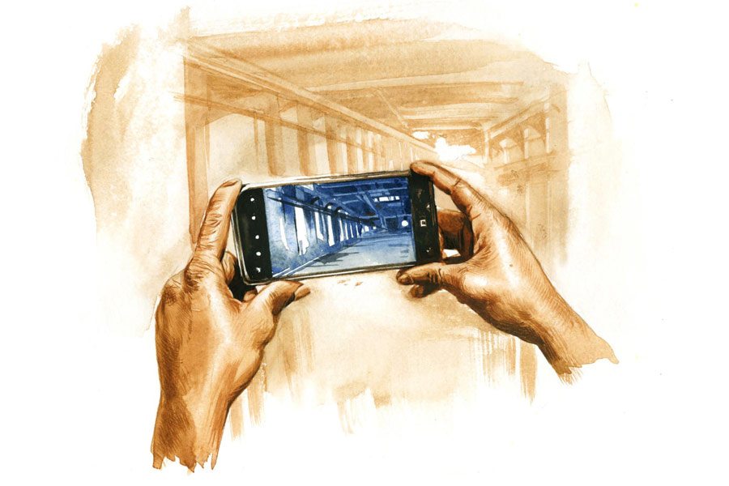

 
 <h1 align=center>অধঃপতন</h1>
<h2 align=center>সুকান্ত গঙ্গোপাধ্যায়</h2> 

দত্তপাড়ায় টিউশন পড়িয়ে ফিরছি। রাত সাড়ে ন’টা। সাইকেল চালাতে চালাতে মুখ তুলি। বিশ্বাসবাড়ির বারান্দায় আলো জ্বলছে না। অর্থাৎ কঙ্কণা আজও আমার অপেক্ষায় নেই। কিছু দিন ধরে থাকছে না। কঙ্কণা ছিল আমার সম্ভাব্য প্রেমিকা। সম্ভাব্য প্রেমিকা আমার জীবনে প্রচুর এসেছে। তার কারণ আমার চেহারায় আভিজাত্যের ছাপ। আমি বড়ঘরেরই ছেলে। যদিও আমাদের অবস্থা এখন তলানিতে।

আমার প্রপিতামহ জয়ব্রত চট্টোপাধ্যায় ছিলেন হাই কোর্টের নামী উকিল। আমাদের বিশাল বাড়িটা এখন ভগ্নপ্রায়। শরিকি জটিলতায় বিক্রি করাও অসম্ভব। ওটা প্রপিতামহই করিয়েছিলেন। ওঁর নামেই আমাদের পাড়ার নাম চ্যাটার্জিপাড়া। ঠাকুরদা ছিলেন সংস্কৃতের অধ্যাপক। বাবা ছিলেন হাই স্কুলের প্রধান শিক্ষক। দুই মেয়ের বিয়ে দিয়ে শেষ বয়সে বাবা নিঃস্ব হয়ে গিয়েছিলেন। দাদাও বড় চার্টার্ড ফার্মে চাকরি করত।

‘করত’ বলছি, কারণ মাস আটেক হল দাদা পাগল হয়ে গেছে। চাকরিটা গেছে তার। কোম্পানি থেকে পাওয়া সামান্য টাকা ওরই চিকিৎসার খরচে বেরিয়ে গেছে। এখ‍‌ন সংসার চালানোর উপায় বলতে আমার টিউশনির কিছু টাকা আর বৌদির বিজ়নেস। মাঝারি মাপের একটা বিস্কুট কোম্পানির সাব-ডিলার বউদি। রোজগার তেমন নয়।

আমাদের ওয়ার্ডের কাউন্সিলার সনাতনদা এক দিন বলল, “বিজন, আমি সরকারি লোন বার করে দিচ্ছি। টোটো কিনে চালা। তোর বাড়ির অবস্থা তো জানি।”

সনাতনদা কাউন্সিলার হলেও চ্যাটার্জিবাড়ির স্টেটাসে ওঠা ওর পক্ষে সম্ভব নয়, তাই আমাকে নীচে নামিয়ে আনতে চাইছে। একটা ভদ্রস্থ চাকরি আমার ভীষণ দরকার। কিছুতেই পাচ্ছি না। সরকারি চাকরির আশায় টাকা দিয়ে অনলাইনে ক্লাস করছি। তিরিশ পেরোলাম। আমার অনিশ্চিত ভবিষ্যতের কারণে সম্ভাব্য প্রেমিকার সংখ্যা কমতে কমতে কঙ্কণাতে এসে ঠেকেছিল। সে-ও আর রইল না। কঙ্কণা সরে গেল সম্ভবত দাদার খবরটা জেনে। কে আর পাগল-থাকা বাড়িতে সংসার করতে চায়!

আমার দাদা কিন্তু অত্যন্ত শান্ত পাগল। মুখে কোনও কথা নেই, ইশারাও নেই। আমাদের চিনতে পারে কি না, তা নিয়ে যথেষ্ট সন্দেহ হয় আমার। সকালে উঠে চা-বিস্কুট খেয়ে মোবাইল হাতে বেরিয়ে পড়ে। রাস্তায় যেতে যেতে হঠাৎ দাঁড়িয়ে পড়ে ছবি তোলে। কোনও নির্দিষ্ট লক্ষ্যবস্তু নেই। তুলে যায় অজস্র ছবি। দাদার যে কখনও ফোটোগ্রাফির উপর ঝোঁক ছিল, তা কিন্তু নয়। দাদার তোলা ফোটোগুলোও খুব অদ্ভুত, যেমন, রাস্তার কলে জল পড়ে যাওয়ার ছবি। পুকুর অর্ধেক বুজিয়ে ফেলার ছবি। পুল-কার উপচে পড়া ছাত্রছাত্রীর ছবি। লক-আউট হওয়া কারখানার ছবি। দাদার তোলা ওই সব এলোপাথাড়ি ছবি আমাকে খুব টানে। মনে হয় কী যেন একটা মিল আছে ছবিগুলোর মধ্যে, ধরতে পারি না। রোজ রাতে দাদা ঘুমিয়ে পড়লে ওর মোবাইলটা নিয়ে নিই। মাঝরাতে ঘুম থেকে উঠে দাদা অস্থির পায়চারি করে, তাই বৌদি আর দাদার সঙ্গে শোয় না, আমি শুই।

বাড়ি চলে এলাম। সাইকেল থেকে নেমে দরজার কাছে যাই। বেল টিপি। বৌদি খুলে দেয় দরজা। জিজ্ঞেস করি, “দাদা ফিরেছে?”

“হ্যাঁ, ফিরেছে। খেয়েদেয়ে একটু আগে শুতে গেল।”

খেয়ে উঠে দাদার পাশে শুলাম। দাদার মোবাইলটা নিয়ে আজকের তোলা ছবিগুলো দেখছি। একটা ছবিতে এসে চমকে উঠি, হাই স্কুলের সামনে বৌদি দাঁড়িয়ে— রিকশাওলা, ভ্যানওলা, ডাবওলা, ফুচকাওলা পরিবৃত হয়ে। আড্ডা মারছে ওদের সঙ্গে। বিরক্ত লাগল। ফোনটা হাতে নিয়ে পাশের ঘরে যাই। বৌদিকে ডাকি। ছবিটা দেখিয়ে ভর্ৎসনার সুরে বলি, “তোমার কি কোনও সেন্স নেই! এদের সঙ্গে আড্ডা মারছ তুমি? পাড়ার লোক দেখলে কী বলবে!”

বৌদি আমার কথায় পাত্তা দিল না। হালকা গলায় বলল, “এরা আমার অনেক কাজ করে দেয়। বিনা পয়সায় মাল ডেলিভারি দিয়ে আসে পার্টির কাছে। এ বাড়ির জন্য পড়ন্ত বাজার থেকে সস্তায় আলু, আনাজপাতি, মাছ এনে দেয়। আর আমি রিকশা বা টোটোয় গেলে ওরা পয়সা নেয় না। ওরা আছে বলেই আমি সংসারটা কোনও মতে টানছি।”

“না, না, তুমি আর ওদের সঙ্গে মিশবে না। তুমি চ্যাটার্জির বাড়ির বৌ, এটা ভুলে যেয়ো না।”

এক মাস কেটে গেছে। আমি এখন টোটোওলা। সনাতনদার টোপটা গিলে নিলাম। রোজগার ভালই হয়। বৌদিকে আর বিজ়নেস করতে হয় না। এত বড় পরিবর্তনেও দাদার কোনও হুঁশ নেই। ক’দিন আগে দুপুরে বাড়ি ফেরার সময় দাদাকে দেখলাম রাস্তায়। টোটো দাঁড় করিয়ে বললাম, “উঠে এসো। বাড়ি যাচ্ছি।”

কথা কানে নিল না দাদা। হাতের মোবাইল তুলে আমার ছবি তুলল। তার পর হাঁটতে শুরু করল সোজা। আজও বাড়ি ফিরছি। খর রোদের মধ্যে খুঁজছি দাদাকে। যতই নীরব থাকুক দাদা, দু’ভাই এক সঙ্গে খেতে বসতে আজও ভাল লাগে আমার।

বাড়ি ফিরে শুনলাম, দাদা খেয়ে ফের বেরিয়ে গেছে। স্নান সেরে আমি এখন আয়নার সামনে চুল আঁচড়াচ্ছি। বৌদি এল ঘরে। শ্রান্ত স্বরে বলল, “এমএ বিএড করে টোটো চালাতে ভাল লাগে? প্রেস্টিজে লাগে না?”

“না। লাগে না।”

বৌদি আমার কাছে এগিয়ে এসে বলল, “আমি জানি, আমাকে বাঁচাতে তুমি টোটো চালানো ধরলে। আমাকে ভালবাসো তুমি। এতই যদি ভালবাসো, তা হলে আমার বাকি অপূর্ণতাটুকু পূরণ করে দাও।”

আমাকে অবাক করে আচমকাই বৌদি বক্ষলগ্ন হল। উন্মুখ ভাবে ঠোঁট খুঁজছে আমার। বৌদিকে সরিয়ে দেওয়ার বদলে আরও জড়িয়ে ধরছি আমি। আমার নারীসঙ্গহীন উপোসি শরীরে যেন ঘোর লেগে যাচ্ছে।

হঠাৎ দরজা খুলে গেল। দাদা! ঘরে ঢুকে নির্বিকারচিত্তে মোবাইলে ছবি তুলতে থাকে আমাদের।

তীব্র অস্বস্তিেতও হঠাৎ মাথায় এসে যায়, দাদা কিসের ছবি তোলে!

দাদা সমাজের অথবা মানুষের, অবক্ষয় কিংবা অধঃপতনের ছবি তুলে রাখে।

