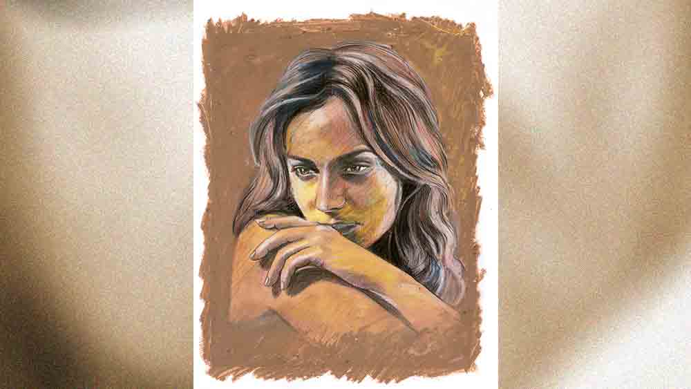

 

<h1 align=center>অনাস্থা প্রস্তাব</h1>
<h2 align=center>অংশুমিত্রা দত্ত</h2>
ভোরবেলা ঘুম ভাঙল অনন্যার। বিছানার সোজাসুজি দেওয়ালে টাঙানো ঘড়িটায় দেখল পৌনে ছ’টা বাজে। গত রাতে উত্তেজনার বশে ঘুম হয়নি ভাল। ভোরের দিকে তন্দ্রা এসেছিল। তলপেটে চাপ অনুভব করায় তন্দ্রা কাটল। তড়িঘড়ি ড্রেসিং টেবিলে রাখা প্যাকেটটা নিয়ে বাথরুমে ঢুকল সে। সেই মুহূর্ত... নিজের হৃৎস্পন্দন শুনতে পাচ্ছিল অনন্যা... জিনিসটার দিকে অপলক তাকিয়ে রইল সে... এক, দুই, তিন...   ইউরোপিয়ান থিমে সাজানো কফি শপে ঢুকে বাঁ দিকের কোণের টেবিলে প্রতীককে দেখতে পেল সে। প্রথম বার এই টেবিলেই বসেছিল না? এগিয়ে গিয়ে চেয়ার টেনে প্রতীকের মুখোমুখি বসল অনন্যা। তাকে দেখেই প্রতীক বলে উঠল, “কী হয়েছে তোমার? চোখ-মুখ এ রকম শুকনো! আর কফি শপে ডাকলে কেন? বাড়িতেই তো যেতে পারতাম...”   “সব কথা বাড়িতে হয় না। আর বাড়িতে আদৌ আর কোনও দিন যাবে কি না, সেটা নিয়েই কথা,” অনন্যা প্রতীককে কথার মাঝখানে থামিয়ে বলে উঠল। সত্যিই অনন্যার চোখ ফুলে আছে। অনিদ্রা আর কান্নার যৌথ কারসাজি।   “মানে!” অনন্যার উত্তরে প্রতীক স্পষ্টতই অবাক।   “মানে আমি প্রেগন্যান্ট। আজ সকালে টেস্ট করলাম। পর পর দু’বার... পজ়িটিভ।”   “কী! অ্যান্ডিকে বলেছ?”   “ওকে কেন বলব! আর কোন মুখেই বা বলব! এটা তোমার।”   “জানি। আর কার হবে। কিন্তু অ্যান্ডিকে তো বলতে হবে। যা দায়িত্ব, ও-ই তো নেবে। যদি বিয়ে করতে হয়... ওকে জানাও।”   প্রতীকের কথায় হাসি আর রাগ দুটোই এক সঙ্গে পেল অনন্যার। কী প্রত্যয়ের সঙ্গে ও ধরে নিচ্ছে বাচ্চাটা অ্যান্ডি বা অন্য কারও হতে পারে না! কোনও দ্বিধাই নেই ওর মধ্যে। অনন্যা বলল, “আর যদি বলি দায়িত্ব তোমাকেই নিতে হবে? অ্যান্ডিকে আমি সব বলে দেব, আর তার পর তোমাকে বিয়ে করব?” ক্রূর একটা হাসি খেলে গেল অনন্যার মুখে। প্রতীকের কনফিডেন্স যেন একটু টসকে গেল।   “ইয়ার্কি খুব ভাল জিনিস, কিন্তু এখন তার সময় নয়। তোমার পক্ষে তো নয়ই...” সামলে নিয়ে কাটা কাটা ভাষায় বলল প্রতীক, “আমার সামনের বছর বিয়ে। নন্দিনীর সঙ্গে। ডেট করার প্রথম দিন থেকেই তুমি সেটা জানো। আর এই কমিটমেন্ট ভাঙা আমার পক্ষে অসম্ভব, তা আরও ভাল করে জানো। আর তার জন্য আমি যা খুশি তা-ই করতে পারি,” ততোধিক কেটে কেটে, স্বভাবসিদ্ধ হুমকি এবং কনফিডেন্স মেশানো বেপরোয়া ভঙ্গিতে বলল প্রতীক। অনন্যা চোখ সরু করে দেখছিল ওকে। প্রথম দিন থেকেই প্রতীকের এই বেপরোয়া এবং ‘যা খুশি তাই করে নাও, আমার কিচ্ছু করতে পারবে না’ গোছের আত্মবিশ্বাসের উৎস খোঁজার চেষ্টা করেছে সে।   প্রতীকের চোখে চোখ রেখে পরিষ্কার করে বলল অনন্যা, “ইয়ার্কি মারছি না। বিপদটা যে একান্তই আমার, তোমার কোনও ভয় নেই, সেটা বলার জন্য ধন্যবাদ। অ্যান্ডিকে আমি বিয়ে করব না। ওকে আমি ভালবাসি না। আমি প্রেগন্যান্ট জানলে হয়তো ও বিয়ে করতেই চাইবে। তুমি তো জানোই ও কত বোকা, ওকে বোকা বানানো কত সোজা, না?” কথাগুলো প্রতীককে বিঁধছিল। মজা লাগছিল অনন্যার। একটু থেমে আবার সে বলল, “আমি বাচ্চাটা অ্যাবর্ট করাব। আমি জানি তোমাকে সঙ্গে যেতে বললে তুমি সেটাও যাবে না। নিজের রেপুটেশন নিয়ে কোনও রিস্ক তুমি নেবে না। আর আমিও কোনও রকম রিস্ক নিজের শরীর নিয়ে নেব না। কোনও ভাল নার্সিংহোমে অন্য কোনও রোগের অজুহাতে ভর্তি হব। আর সেটার জন্য আমার টাকা চাই। ভাল নার্সিংহোমে দিন পাঁচেক থাকার খরচ তো জানোই। অ্যাপেনডিক্স অপারেশন বলে দেব না হয় লোকজনকে। নার্সিংহোমে আমার চেনা বন্ধু আছে, ও ম্যানেজ করে নেবে। লাখ দেড়েক টাকা লাগবে। ওটুকু তুমি দিতেই পারো। বিনিময়ে আমি নন্দিনী বা অ্যান্ডিকে কিছু জানাব না, প্রমিস।”   “ওহ! টাকা লাগবে? সেটা বললেই হত! দিয়ে দেব। তবে নন্দিনীকে তুমি বললেও ও বিশ্বাস করবে বলে মনে হয়? আমার সঙ্গে এত বছর ধরে তা হলে রয়েছে কী করতে!” নিজের বাঁকা হাসিটা মুখে লাগিয়ে বলল প্রতীক। ভাঙবে তবু মচকাবে না। কিন্তু অনন্যা ভালই জানে, ভিতরে-ভিতরে কুলকুল করে ঘামছে ছেলেটা।   “কিন্তু পুরোটা অবিশ্বাস করবে কি? হয়তো বিয়েটা ভাঙবে না। ওর বাড়িতে সকলে জানে, তোমাদের বিয়ে হবে। তোমার বিজ়নেসে ওর পরিবার টাকা লাগিয়েছে। কিন্তু সুখে থাকবে না, তোমাকেও সুখে রাখবে না। আমি তাতেই খুশি,” সাবলীল হাসি হেসে উত্তর দিতে দিতে উঠে দাঁড়াল অনন্যা। তার পর এক বারও পিছনে না তাকিয়ে সটান বেরিয়ে গেল কফি শপ থেকে।      *****   “দেখো, তুমি চাইলে কালই বিয়ে করতে পারি আমরা। কিন্তু এত তাড়াহুড়ো করে বিয়ে করলে কি ভাল দেখাবে? বাড়িতে সবাই অপেক্ষা করে আছে এই বিয়েটা নিয়ে। আর মাসছয়েক বাদেই বিয়ের দিনক্ষণ ঠিক। এখন যদি গিয়ে বলি তাড়াতাড়ি বিয়ে করতে হবে, সকলে সন্দেহ করবে। আমি নিজে এই বিয়েটা নিয়ে কত এক্সাইটেড, তুমি জানো না অ্যানি? কবে থেকে কত কিছু ভেবে রেখেছি! সবাই দেখবে আর ভাববে অনিন্দ্য রায়চৌধুরী একটা বিয়ে করল বটে!” চোখে-মুখে উত্তেজনা স্পষ্ট অনিন্দ্যর। বন্ধুরা ছোট করে সাহেবি কেতায় ওকে অ্যান্ডি বলে ডাকে। অনন্যাকে অনিন্দ্য ডাকে ‘অ্যানি’ বলে। গা-পিত্তি জ্বলে যায় ওর। কোন কালে লন্ডনে চাকরি করে এসেছে ছ’মাস, তাতেই নিজেকে সাহেব বাচ্চা ভাবে ছেলেটা।   “ছ’মাস! আর মাস চারেক পরেই তো আমার বেবি বাম্প বোঝা যেতে শুরু করবে! আর তার চেয়েও বড় কথা, অ্যাডভান্সড স্টেজে আমি এক সপ্তাহ ধরে বিয়ে করব? শেষমেশ বিয়ের হুজ্জতিতে যদি বাচ্চার কিছু হয়ে যায়?”   “আরে বেবি বাম্প তেমন বোঝা যাবে না। সে রকম হলে লেহেঙ্গা না পরলেই হল রিসেপশনে। বিয়ের আগে মেয়েদের গায়ে ওরকম একটু গত্তি লাগে। আর আমি এক্সট্রা কেয়ার নেব, যাতে তুমি অসুস্থ না হও। আই প্রমিস, বেবি।”   অনিন্দ্যর কথায় ধাঁধা লেগে গেল অনন্যার। ছেলেটা বলে কী! বলছে ছ’মাসের প্রেগন্যান্সি নিয়ে ধুমধাম করে বিয়ে করতে! শো-অফ ছাড়া জীবনে কিচ্ছু নেই ওর! ও জানে মাসখানেক আগে একটা পার্টি থেকে দু’জনে মদ্যপ অবস্থায় থেকে গিয়েছিল অনন্যার বাড়িতে। সে দিনই ঘটেছে ঘটনাটা। না হলে গত এক বছর যাবৎ দু’জনের মধ্যে কোনও ঘনিষ্ঠতা হয়নি। তাতে যে কিছু সন্দেহ হয়েছে অনিন্দ্যর, তা নয়। সে নিজের পার্টি লাইফ নিয়ে খুশি। অ্যান্ডির প্রতিক্রিয়া কী হতে পারে, অনন্যার যেন আগে থেকে জানা ছিল। পরীক্ষায় পাশ করল অনিন্দ্য, সে নিজেও।      *****   অনিন্দ্যকে বছর দুয়েক ধরে চেনে অনন্যা। ছেলেটা ভাল, সরল, কিন্তু ভীষণ অহঙ্কারী। যখন থেকে অনন্যার সঙ্গে সম্পর্ক, বংশমর্যাদা, বাড়ির প্রতিপত্তি, ওর লন্ডনের চাকরিজীবন নিয়ে কত গল্প যে শুনতে হয়েছে! অনন্যা খুব একটা সচ্ছল পরিবারের মেয়ে নয়, প্রবাসী। ছোটবেলায় মা-বাবা ট্রেন অ্যাক্সিডেন্টে মারা যান। মামাবাড়িতে মানুষ। কিন্তু লেখাপড়ায় ভাল, পরিশ্রমী। চাকরিটাও ভালই করে। একটা বাড়ি ভাড়া নিয়ে একাই থাকে। অনিন্দ্যর পরিবারের কথা শুনলে সত্যি কথা বলতে কী, একটু খাটোই লাগে নিজেকে। তবে অনিন্দ্য যে তাকে ভালবাসে, সে বিষয়ে সন্দেহ নেই। বাড়িতে নিয়ে যায়, বন্ধুদের সঙ্গে দেখা করতে গেলেও নিয়ে যায়। অনন্যা বোঝে, বান্ধবীর রূপ নিয়ে একটা অহংবোধ কাজ করে অনিন্দ্যর মধ্যে। এক দিন তো পার্টি থেকে ফিরে ঈষৎ অসংলগ্ন অবস্থায় বলেই ফেলল, “দেখুক শালা প্রতীক... আমার গার্লফ্রেন্ডকে দেখুক আর জ্বলুক! ওর গার্লফ্রেন্ডটা তো যাচ্ছেতাই! বাপের টাকা দেখে তুলেছে। আমাকে কম বুলি করেছে স্কুলে! আমি সে রকম ডাকাবুকো ছিলাম না, তা নিয়ে কম খিল্লি করেছে ও! সব কিছুতে ছোট করত! একটু মেয়েদের পাত্তা পেত বলে। ব্লাডি বুলি!”   সে দিনই প্রতীকের সঙ্গে প্রথম আলাপ অনন্যার। প্রতীক যে চোখ দিয়ে তাকে গিলছে, বেশ বুঝতে পারছিল। যেন অবিশ্বাস, অ্যান্ডি এ রকম সুন্দরী, আকর্ষক মেয়ের সঙ্গে কী করছে! তার পর থেকেই অনন্যার সঙ্গে চ্যাট করা শুরু করল প্রতীক। অনিন্দ্য আসলে রোজ পার্টি করে বেসামাল হয়ে পড়ত। একা ওকে নিয়ে বেরোতে পারত না অনন্যা। হাঁপিয়ে উঠেছিল অনিন্দ্যকে নিয়ে সে। প্রতীক বাড়িতে ছেড়ে দিত। কথা বলত তার সঙ্গে। একটা নির্ভরতা তৈরি হচ্ছিল প্রতীকের প্রতি অনন্যার। কারণ প্রতীকও নিজের সম্পর্কে খুশি ছিল না। নন্দিনীর সঙ্গে তার মানসিকতার মিল ছিল না। কিন্তু ওই... আটকে পড়েছিল। অনন্যার সঙ্গে একটা নাম-না-জানা সম্পর্ক তৈরি হল প্রতীকের। সকলের অলক্ষে। কিন্তু প্রতীক যে অনন্যাকে ভালবাসে, বুঝত সে। সে-ও ভালবেসে ফেলেছিল। গোপন সম্পর্কের আকর্ষণ আলাদা। অনন্যা মনে মনে ঠিক করেছিল, অনিন্দ্যর সঙ্গে ব্রেকআপ করে দেবে।   তার ফ্ল্যাটে এক রাতে প্রতীক ঘুমিয়ে পড়ার পর হঠাৎ একটা মেসেজ টোন বাজল। কী মনে হতে, অনন্যা ফোনটা নিল। প্রতীকের লক প্যাটার্ন সে জানে। খুলে গেল স্ক্রিন লক। দেখল অনিন্দ্যর মেসেজ, কাঁপা কাঁপা হাতে খুলল চ্যাটটা। কারণ মেসেজটার উপরের প্রথম লাইনটা স্ক্রিনে ভেসে উঠেছিল, যাতে লেখা ছিল, ‘আজকে অ্যানিকে নিয়ে লা মেরিডিয়ানে গিয়েছিলাম...’ চ্যাটটা খুলে স্তম্ভিত হয়ে গেল অনন্যা। স্ক্রোল করতে করতে পিছিয়ে গেল মাস তিনেক আগের টেক্সটে। সেখানে প্রতীককে অনন্যার সঙ্গে সত্যি-মিথ্যে মিলিয়ে অসংখ্য ঘনিষ্ঠ মুহূর্তের বর্ণনা দিয়েছে অনিন্দ্য! আর সেটা তারিয়ে-তারিয়ে উপভোগ করেছে প্রতীক! সেই পার্টিতে প্রতীকের সঙ্গে অনন্যার প্রথম আলাপের পর পর অনিন্দ্যকে প্রতীকের প্রশ্ন, ‘এই মালকে কী করে তুললি ভাই!’ এবং তার উত্তর থেকে শুরু হয়েছিল এই রগরগে এবং নিম্নরুচির চ্যাট। দুই ছোটবেলার বন্ধুর ইগোর লড়াই দেখতে পেল অনন্যা চোখের সামনে। যেন এক জন নিজের ট্রোফি দেখাচ্ছে, অন্য জন বলছে, ‘ভাগ শালা! তুই এর যোগ্য না কি! আমি এটা ছিনিয়ে নেব।’   কী বোকা সে! সারা রাত ঘুমোতে পারেনি অনন্যা। নিজেকে খেলো মনে হচ্ছিল খুব। অনাথ। পাশে তখনও অঘোরে ঘুমোচ্ছে প্রতীক।   এয়ারপোর্টের সিকিয়োরিটি চেক হয়ে গিয়েছে। এয়ারব্রিজ দিয়ে প্লেনে উঠতে উঠতে মেসেজ দুটো সেন্ড করে দিল অনন্যা। একই মেসেজ অনিন্দ্যকে আর প্রতীককে। তাতে কিছুই লেখা নেই। শুধু অনন্যাকে নিয়ে দু’জনের রগরগে চ্যাটের হিস্ট্রিটা একটা ডকুমেন্ট করে পাঠানো। আর একটা মেসেজও পাঠাল সে। তাতে লেখা, ‘আমি প্রেগন্যান্ট। বাচ্চার বাবা প্রতীক। বিশ্বাস না হলে আমাদের দু’জনের ছবিগুলো দেখতে পারো। কিন্তু বাচ্চা অ্যাবর্ট করাব না বলে আমি সকলের থেকে দূরে সরে যাচ্ছি। আর আমাদের দু’জনের চ্যাট হিস্ট্রি ডকুমেন্ট করে পাঠালাম। হ্যাভ আ গ্রেট লাইফ অ্যাহেড।’ প্রাপক নন্দিনী। সঙ্গে তাদের ঘনিষ্ঠ কিছু ছবি এবং চ্যাট হিস্ট্রি। মেসেজগুলো পাঠিয়ে সিমকার্ডটা খুলে ডাস্টবিনে ফেলে দিল অনন্যা। ভরে নিল নতুন সিম।   সব জেনেশুনেও এক বছর ধরে দু’জনের সঙ্গে নাটক চালিয়ে যাওয়া সহজ ছিল না। তার উপর প্রেগন্যান্সির ঝুঁকি... প্রেগন্যান্সি টেস্ট করতে করতে মাথায় পুরো প্ল্যানটা খেলে গিয়েছিল। কী করে সবচেয়ে বেশি ধাক্কা দেওয়া যায়, ছকে ফেলেছিল সে। এ বার শুধু তাকে ‘বোকা’, ‘সম্পত্তি’, ‘শরীর’ ভাবার লজ্জা নয়, একটা অন্য প্রাণকে অস্বীকার, অবহেলা করার গ্লানিও ওদের কুরে কুরে খাবে। খাবে কি? তলে তলে এক বছর প্রস্তুতি নিয়ে জিআরই দিয়েছিল অনন্যা। স্কোর হল ৩৪০। আমেরিকার ভাল ইউনিভার্সিটিগুলোয় সুযোগ পাওয়ার পক্ষে যথেষ্ট। প্রথমে গিয়ে থাকা, কোর্স ফি-র টাকা জোগাড় হয়ে গিয়েছিল। শুধু প্লেনের টিকিটের টাকাটা... প্রতীকই দিক! হবু শ্বশুরের টাকাই একটু ওড়াক না হয় গোপন সম্পর্কের পিছনে। শ্বশুর আদৌ হবে তো? নিষ্ঠুর একটা হাসি খেলে গেল তার মুখে। দু’চোখ বেয়ে জল গড়িয়ে পড়ল। সানগ্লাসটা পরে নিল অনন্যা।      *****   ঝাঁকড়ি সব জিনিস নেড়েচেড়ে দেখছিল। ওপরের ফ্ল্যাটের সুন্দর দিদিটা সব ফেলে দিয়ে চলে গিয়েছে। আর বোধহয় আসবে না। অমন সুন্দর মেয়ের কত না সুন্দর জামাকাপড় থাকবে! কার্টুন বাক্সগুলো খুলে খুলে দেখছিল সে। একটা অদ্ভুত যন্ত্র দেখল হঠাৎ। জ্বর হলে যেগুলোয় জ্বর মাপে, অনেকটা ও রকম দেখতে। কিন্তু একটু অন্য রকম। কী এটা? মনসা পাশে একটা সুন্দর জুতো পায়ে পরে দেখছিল। মনসা হেব্বি পাকা, সব জানে। ওর কাছে নিয়ে গেল যন্ত্রটা। ঝাঁকড়ির হাতে জিনিসটা দেখে বিজ্ঞের মতো হাসল মনসা। বলল, “কিস্যু জানিস না। আমি অনেক বাড়ির ময়লার বাক্সে দেখেছি। মুন্নি বৌদিও এক দিন দেখিয়েছিল জিনিসটা। এতে পেচ্ছাপ ফেললে বোঝা যায় মেয়ে পোয়াতি কি না...”   অবাক হয়ে শুনছিল ঝাঁকড়ি। মনসা বলে চলল, “এই যে এ রকম একটা দাগ, মানে পোয়াতি নয়। আর যদি দুটো দাগ দেখা যায়, তার মানে পেটে বাচ্চা আছে। বুঝলি?” বুঝল ঝাঁকড়ি। কোলে বাচ্চা এল না বলেই কি তা হলে সব ছেড়ে চলে গেল সুন্দর দিদিটা? চোখ জলে ভরে উঠল তার।         
