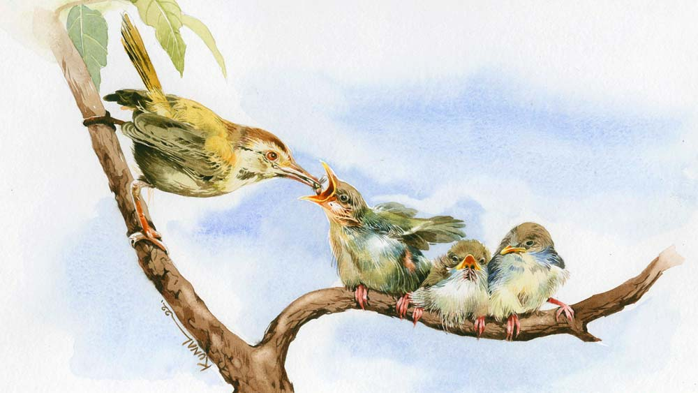

 
 <h1 align=center>অনিকেত</h1>
<h2 align=center>মৈত্রেয়ী চট্টোপাধ্যায়</h2> জানালার পাশে ঝাঁকড়া ওই ডুমুর গাছটায় কিছু দিন আগে একটা টুনটুনি বাসা বানিয়েছিল। সকাল থেকে ধূসর রঙের মেয়ে-পাখিটার সে কী ব্যস্ততা! ঠোঁটে করে করে বাসা বুনত। নীল কালো মেশানো ছেলে-পাখিটা সঙ্গে আসত। কিন্তু বাসা তৈরিতে তার কোনও ভূমিকা ছিল না। কয়েক দিন পরেই সেখান থেকে চিক চিক করে আওয়াজ ভেসে আসত। ডিম ফুটে ছানা বেরিয়েছিল। মা পাখি মুখে করে পোকামাকড় এনে এনে তাদের খাওয়াত। তারা একটু বড় হল, ডানা গজাল। অশক্ত ডানা মেলে ওড়ার চেষ্টা করত। পারত না। এই ভাবে চেষ্টা করতে করতে ডানা শক্ত হল। তার পর এক দিন ফুড়ুত করে উড়ে গেল নীল আকাশে বুকে। আর কোনও দিন ফিরে এল না। পরিত্যক্ত ভাঙা বাসা কোনও রকমে ঝুলে রইল গাছের ডালে। সে দিকে তাকিয়ে থাকতে থাকতে খানিক আনমনা হয়ে গেছিলাম। বার বার মনে হচ্ছে আর তো কিছু ক্ষণ। ফেলে আসা সময়ের ঘটনাগুলো সিনেমার পর্দার মতো ভেসে উঠছে চোখের সামনে। মনে হচ্ছে এই তো সে দিনের ঘটনা! এর মধ্যে চলে গেল এতটা সময়...

তখন সবে কয়েক বছর হয়েছে চাকরিতে জয়েন করেছি। কোম্পানির কোয়ার্টারে থাকি। দুটো রুম, রান্নাঘর, বারান্দা মিলিয়ে বেশ অনেকটা জায়গা। দু’জন মানুষের পক্ষে যথেষ্ট। সেখানে হাত পা ছড়িয়ে মা-ছেলের দিব্যি চলে যায়। কোয়ার্টারে থাকি, বাড়ি করার চিন্তাভাবনা তখন মাথায় নেই। হঠাৎ এক দিন আমাদেরই পরিচিত এক জন এসে এই জমিটার সন্ধান দেয়। মাকে বলে, “মাসিমা, একটা জমি বিক্রি আছে। সস্তা দামে দিচ্ছে। কিনে রাখুন। দেখবেন ভবিষ্যতে এর দাম আকাশছোঁয়া হয়ে যাবে। বাড়ি না করুন, পরে বিক্রি করে দেবেন। লাভ বই ক্ষতি কিছু হবে না।”

জমি বাড়ি হল লক্ষ্মী। ভবিষ্যতের সঞ্চয়। কোনও দিন দাম কমে না, বরং বাড়ে। মা ভাবল ছেলের বয়স কম। হাতে টাকাপয়সা থাকলে উল্টোপাল্টা খরচ করে ফেলবে। তার চেয়ে একটা জমি কিনে রাখলে মন্দ হয় না। তাই এক বিকেলে আমাকে সঙ্গে নিয়ে মা চলল জমি দেখতে। পাশেই সেই ভদ্রলোক থাকেন। ধূ-ধূ করছে চার ধার। দূরে দূরে গুটিকয়েক বাড়ি। বাকি সব ধানখেত। জমি দেখে আমার খুব যে একটা পছন্দ হল, তাও নয়। কিন্তু ওই যে বললাম, জমি কিনে টাকাটা এক জায়গায় আটকে রাখাটা মায়ের ঠিক মনে হয়েছিল। তাই খানিকটা মায়ের ইচ্ছেতেই শেষ অবধি জমিটা কেনা হল।

তার পর কেটে গেছে বেশ অনেকগুলো দিন। এক সময় আমার জীবনে নীলিমা এল। মায়ের সর্বক্ষণের সঙ্গী। শাশুড়ি-বৌমার গলায় গলায় ভাব। সর্বক্ষণ খালি গুজুরগুজুর ফুসুরফুসুর করে গল্পগুজব করে। কখন যেন দু’জনের মধ্যে আলোচনায় উঠে আসে, জমি যখন কেনা আছে তখন একটা বাড়ি শুরু করলে কেমন হয়। মা এসে সেই কথা আমাকে জানায়। শুনে আমি বললাম, “সে তো খুব ভাল কথা। কিন্তু বাড়ি করা কি চাট্টিখানি ব্যাপার! এই মুহূর্তে এক সঙ্গে অত টাকা আমি কোথায় পাব!”

নীলিমা এগিয়ে এল। বলল, “শোনো, বিয়ের আগে আমি যে স্কুলে পড়াতাম সেখানকার মাসমাইনেটা তো আমার তেমন খরচ হত না। প্রায় পুরো টাকাটাই ব্যাঙ্কে জমা হত। তা ছাড়া দু’বেলা টিউশনিও তো করাতাম। হাতখরচ বাদ দিয়ে সেখান থেকেও জমত। বিয়ের খরচ-খরচা সবটাই বাবা করেছে। ফলে আমার জমানো টাকায় কোনও দিন হাত দেওয়ার প্রয়োজন হয়নি। এত দিনে সেটা সুদে-আসলে অনেকটা বেড়েছে। বাড়ি করার জন্য এই পুরো টাকাটা আমি তোমাকে দিতে চাই। পুরোটা হয়তো হবে না, অন্তত শুরুটা হয়ে যাবে। তুমি অমত কোরো না।”

আমি বললাম, “না না, এ হতে পারে না। তোমার কষ্ট করে জমানো টাকা আমি নিতে পারব না।”

নীলিমা তখন চোখ পাকিয়ে কপট রাগ দেখিয়ে বলল, “কেন নিতে পারবে না শুনি! বাড়িটা কি তোমার একার হবে? আমরা সবাই তো সেখানে থাকব, তা হলে আমাদের বাড়িতে আমি কেন টাকা খরচ করতে পারব না?”

“তোমার মা-বাবা জানতে পারলে কী ভাববেন বলো তো! আমার সম্বন্ধে খুব খারাপ ধারণা হবে ওঁদের।”

“মা-বাবা জানতেই পারবে না। ব্যাঙ্কের বইটা আমার একার নামে আছে। আর যদি কখনও জানতে পারে, তখন আমি বুঝিয়ে বলব। টাকা তো অপচয় করছি না, একটা ভাল কাজেই লাগাচ্ছি। সে নিয়ে তোমাকে অত চিন্তা করতে হবে না।”

মা সব সময় নীলিমার পক্ষ নিয়ে কথা বলে। এ বারও তার অন্যথা হল না, “দেখ খোকা, বৌমা তো ঠিক কথাই বলেছে। বাড়িটা আমাদের সবার। সবাই মিলে কিছু কিছু টাকা যদি দিতে পারি, তা হলে তোর একার ঘাড়ে বোঝা চাপে না। তাই ভাবছি আমার যে গয়নাগুলো আছে, সেগুলো বিক্রি করে দেব। আগেকার দিনের ভারী ভারী গয়না। সে সব আর পরাও হয় না। দিনকালও ভাল নয়। চোর ডাকাত মেরেধরে সব নিয়ে যাবে, এ আমি সইতে পারব না। তার থেকে আগেভাগে এগুলোর একটা সদ্গতি কর।”

“আচ্ছা মা, তোমরা দু’জনে মিলে কী শুরু করলে বলো তো! তোমার ছেলে কি এতই অক্ষম? বাড়ি হবে। তবে তোমাদের এই নিয়ে ভাবতে হবে না। আমি দেখছি কী করা যায়। লোন-টোন কিছুর একটা ব্যবস্থা হয়ে যাবে।”

“শুধু দেখছি বললে হবে না। আমি যে কথাগুলো বললাম, তা হলে সেই কথাই থাকল। তুই আর আপত্তি করিস না খোকা।”

নতুন বাড়িতে যখন আসি, তখন আমার সন্তান নীলিমার গর্ভে। তার ভূমিষ্ঠ হওয়ার সময় এগিয়ে এসেছে। ওঠাবসা, কাজকর্ম সবেতেই নীলিমার তখন বেশ কষ্ট হয়। আমি বলেছিলাম, “যে আসতে চলেছে, সে আগে সুস্থ ভাবে পৃথিবীতে আসুক, তার পর না হয় গৃহপ্রবেশ করা যাবে।”

কিন্তু নীলিমা রাজি হয়নি। বাড়ি যখন হয়ে গেছে, তখন কোয়ার্টারে পড়ে থাকার আর কোনও মানে হয় না। অগত্যা গৃহপ্রবেশের দিন ঠিক হল। পুজোর কাজ পুরোটাই মা একা সামলেছে। আমাকেও কাছে ঘেঁষতে দেয়নি। সেই সুস্থ সবল মানুষটা যে এই ভাবে আচমকা চলে যাবে তা আমি কল্পনাও করতে পারিনি।

আমার জ্ঞান হওয়ার পর থেকে মাকে কখনও অসুস্থ হয়ে বিছানায় পড়ে থাকতে দেখিনি। কিন্তু এ বার যে কী হল! বাড়ি-ঘরের সুখ সবার কপালে সহ্য হয় না। কথাটা বোধহয় সত্যি।

নতুন বাড়িতে আসার পর সাত দিন কেটে গেছে। আট দিনের দিন সকালে হঠাৎ মায়ের বুকে প্রবল যন্ত্রণা শুরু হয়। না পারছে শুয়ে থাকতে না পারছে বসে থাকতে। নীলিমা সমানে বুকে পিঠে হাত বুলিয়ে দিচ্ছে। কখনও গ্যাস-অম্বলের ওষুধ খাওয়াচ্ছে, কখনও জলের গ্লাস এগিয়ে ধরছে। এত কিছুর পরেও যখন আরাম হচ্ছে না, তখন নীলিমা বলল আর দেরি করা ঠিক হবে না। তুমি শিগগিরই মাকে হাসপাতালে নিয়ে যাওয়ার ব্যবস্থা করো। তখনই অ্যাম্বুল্যান্সে খবর দিই। কিন্তু হাসপাতালে নিয়ে যাওয়ার আগেই সব শেষ।

নাতির মুখ দেখে যেতে পারেননি মা। আমার ছেলে আলোকের জন্মের পর মায়ের রেখে যাওয়া সোনার বালা জোড়া নীলিমা ছেলের হাতে পরিয়ে দিয়েছিল।

তার পরও কেটে গেছে আরও কয়েকটা দশক। ছেলে বড় হয়েছে, আমি অবসর নিয়েছি। বেড়েছে সংসারের শূন্যতা।

 

ছোটবেলায় দেখেছি মা এক ফালি জমির মধ্যেও উচ্ছে, বেগুন, টমেটো ফলাত। তখন আমি মায়ের পাশে পাশে ঘুরঘুর করতাম। মাটি খুঁড়ে গাছে জল দিতাম, সার দিতাম। ভাল লাগত। এখন এত বড় বাগান পেয়ে সেই ভাল লাগাই আবার মাথাচাড়া দিয়ে উঠেছে।

মর্নিংওয়াক থেকে ফিরে এসে এক কাপ চা খেয়ে কিছুটা সময় বাগানে কাটানো আমার বরাবরের অভ্যেস। অবসর জীবনের এত বছর পরেও এই নিয়মের কোনও হেরফের হয়নি। বরং এখন বেশির ভাগ সময় এই গাছপালাদের সঙ্গেই কাটে।

নীলিমা বেঁচে থাকতে এই নিয়ে প্রায়ই গজগজ করত, বলত, “সর্বক্ষণ বাগান নিয়ে না থেকে ঘরের কাজে আমাকে একটু সাহায্য করলেও তো পারো! দেখছো আমি একা হাতে সংসার ঠেলে, দূরন্ত ছেলে সামলে পেরে উঠছি না!”

নীলিমার অভিযোগ অকারণ নয়। ওর আবার সাংঘাতিক শুচিবায়ু বাতিক। সেই কারণে একটা কাজের লোক পর্যন্ত রাখতে রাজি হয়নি। ফলে একা হাতে সবটা সামলাতে ওর সত্যিই কষ্ট হয়। আমি যে সাহায্য করার চেষ্টা করিনি তা নয়। কিন্তু সবুজ গাছপালায় ভরা এই বাগানের আকর্ষণ কিছুতেই কাটিয়ে উঠতে পারিনি। সময় পেলেই বার বার ফিরে এসেছি এই সব গাছের ছত্রছায়ায়।

সেই অভিমান থেকেই হয়তো নীলিমা সব কিছু আমার ঘাড়ে ফেলে রেখে ড্যাং ড্যাং করে চলে গেল না-ফেরার দেশে। এক জন সুস্থ সবল মানুষের হঠাৎ ও রকম হৃদ্‌যন্ত্র বিকল হয়ে মৃত্যুর কারণ ডাক্তাররাও বুঝতে পারেননি। কোনও সমস্যা হয়েছিল হয়তো, চেপে রেখেছিল। কাউকে জানায়নি। হয়তো গুরুত্ব দেয়নি। আলোকের তখন ক্লাস সেভেন। ছেলে, সংসার, অফিস সব নিয়ে আমার তখন হিমশিম অবস্থা। কোনও দিকটাই ঠিকঠাক সামলে উঠতে পারছি না। ভেবে দেখলাম এই ভাবে চলতে পারে না। পার্টটাইম আয়া রেখে লেগে পড়লাম ছেলে মানুষ করার কাজে। তার সঙ্গে ছিল সংসার, বাগান। এত চেষ্টা করার পরেও সবটাই এলোমেলো, অগোছালো হয়ে থাকত। আগের সেই গোছানো, পরিপাটি, ঝকঝকে ভাবটা কোথায় যেন হারিয়ে গেল। শুধু মনে হত, আমার এই নাজেহাল অবস্থা দেখে উপরে বসে এক জন মুখ টিপে টিপে হাসছে। আর মনে মনে বলছে, “দেখো, কেমন লাগে।”

যতই তুমি হাসো না কেন নীলিমা, আমি কিন্তু তোমার ছেলেকে ভেসে যেতে দিইনি। শক্ত করে হাতটা ধরে রেখেছিলাম। আজ সে মস্ত বড় অফিসার। পুণে শহরের দশ তলায় তার বসবাস। ওখান থেকে আকাশটাকে খুব কাছে মনে হয়। যেন হাত বাড়ালেই ছোঁয়া যাবে। পথচলতি মানুষগুলোকে মনে হয় লিলিপুট। বাস অটো-সহ সমস্ত যানবাহন যেন খেলনাগাড়ি। আলোক আকাশ ছোঁয়ার চেষ্টা করে। সে চায় তার সুখের দিনগুলোয় আমি যেন তার সঙ্গে থাকি, পাশে থাকি।

এই বাড়ি, জমি, বাগান আমাকে বার বার মা আর নীলিমার কথা মনে করিয়ে দিত। ওদের আগ্রহ না থাকলে হয়তো আমি বাড়ি করার কথা ভাবতামই না। কিন্তু বহু যুদ্ধ করেও মা আর নীলিমার সাধের জিনিস আমি কিছুতেই রক্ষা করতে পারলাম না। শেষ পর্যন্ত বিক্রিই হয়ে গেল বাড়িটা। মনে আছে একটা পেরেক পুঁততে গেলেও নীলিমা রে-রে করে ছুটে আসত। যেন পেরেক ইটের দেওয়ালে নয়, ওরই বুকে বিঁধছে। সেই যে বার কালবৈশাখীর ঝড়ে আম গাছের একটা মোটা ডাল পড়ে কার্নিস ভাঙল, সে দিন কী কষ্ট তার! সারা দিন মুখে এক কণা খাবারও তুলতে পারেনি। সেই আমগাছটা আজও বেঁচে আছে। এখন আর ফল হয় না। আমার মতোই বৃদ্ধ।

এমন নানা কথা ভাবতে ভাবতে কেমন একটা ঘোরের মধ্যেই চলে গিয়েছিলাম। সংবিৎ ফিরল আলোকের ডাকে।

পুণে থেকে দিন পনেরো হল আলোক এসেছে। বাড়ির সঙ্গে সঙ্গে ভিতরের আসবাবপত্রও সব বিক্রি হয়ে গেল। সঙ্গে করে নিয়ে যাওয়ার মতো সামান্য কিছু জিনিসপত্র ছড়িয়ে ছিটিয়ে পড়ে আছে। মায়ের ঠাকুরঘর, নীলিমার রান্নাঘর— সব খাঁ-খাঁ করছে। থেকে থেকেই বুকের ভিতরটা মোচড় দিয়ে উঠছে। গলার কাছে একটা দলা পাকানো কষ্ট।

ড্রাইভার গাড়িতে ব্যাগপত্র তুলতে শুরু করেছে। আলোকও হাত লাগিয়েছে। গুটিকয়েক টব সঙ্গে নিয়ে যাব বলে দরজার কাছে এনে রেখেছিলাম। শুনে আলোক বলল, “এ সব জিনিস নিয়ে প্লেনে উঠতে দেবে না বাবা।”

“কিন্তু জল, খাবার না পেলে ওরা যে মরে যাবে...” বলতে বলতে অন্ধকার নেমে আসে আমার মুখে। যা আলোকের দৃষ্টি এড়ায় না, সে বলে, “দেখছ চার দিকে মানুষগুলো কী ভাবে পটাপট মরে যাচ্ছে। আর তুমি গাছের জন্য দুঃখ পাচ্ছ! আগে পুণেতে গিয়ে পৌঁছই, এর থেকেও দামি গাছ আমি তোমায় কিনে দেব। চলো চলো, আর দাঁড়িয়ে থেকো না। এর পর দেরি করলে ফ্লাইট মিস হয়ে যাবে।”

আলোক বারবার তাড়া লাগায়। বেরোনোর সময় আর কথা বাড়ালাম না। চুপ করে গেলাম। ওকে কী করে বোঝাই যে, এরা সবাই আমার সন্তানতুল্য। এদেরও প্রাণ আছে। জন্ম আছে, মৃত্যু আছে। খাদ্য খায়, আকারে বাড়ে।

দরজায় তালা লাগিয়ে ঘুরে দাঁড়াতেই পিছন থেকে কে যেন টেনে ধরল। তাকিয়ে দেখি ক্যাকটাসের কাঁটায় পাজামা আটকে আছে। মনে হল ওরা অনুরোধ করছে ওদের ফেলে না যাওয়ার জন্য। বুকের ভিতরটা খুব তোলপাড় করে উঠল। যেন আপনজনদের ছেড়ে যাওয়ার যন্ত্রণা। মনে মনে বললাম, ‘তোরা আর আমাকে মায়ার বাঁধনে বেঁধে রাখার চেষ্টা করিস না। লাভ হবে না।’

কাঁটা থেকে পাজামা ছাড়িয়ে হনহন করে হেঁটে গেলাম গাড়ির দিকে। পাজামার সামান্য ছেঁড়া দেখা যাচ্ছে, কিন্তু মনের ভেতরটা শতচ্ছিন্ন হয়ে যে ক্রমাগত রক্তক্ষরণ হচ্ছে, তা কাউকে দেখানোর উপায় নেই। অভিযোগ করারও জায়গা নেই, আমার ছেলে আমাকে বৃদ্ধাশ্রমে পাঠানোর সিদ্ধান্ত না নিয়ে, সঙ্গে করে তার কাছে নিয়ে যাচ্ছে। আজকাল এটুকুই বা ক’জনের ভাগ্যে জোটে!

আমি উঠে বসতেই গাড়ি ছেড়ে দিল। জানালা দিয়ে মুখ বাড়িয়ে থাকলাম। পিছনে পড়ে রইল মায়ের শেষ ক’টা দিন, আলোকের জন্ম, বেড়ে ওঠা, নীলিমার সংসার, তার চলে যাওয়া, একা ছেলেকে মানুষ করার সমস্ত স্মৃতিসাক্ষ্য। কিছু পরেই হাতবদল হয়ে যাবে সব। আমার আর ফেরা হবে না এখানে। 

চোখের সামনে থেকে একটু একটু করে হারিয়ে গেল আমার বাগান, আমার বাড়ি, আমার সব কিছু।