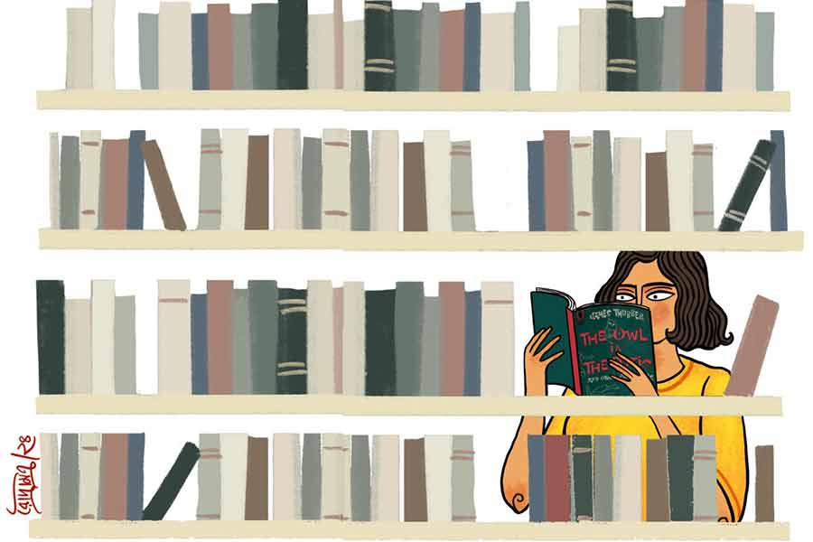

 
 <h1 align=center>অনুবাদে তনুবদল</h1>
<h2 align=center>সৌভিক দাস</h2> 

কপালে থাকলে অশোকবনে চেরিও ফোটে। লাইব্রেরির শেলফে রক্ত-লাল রোমাঞ্চ গ্রন্থাবলির মাঝে হঠাৎ এমন গোলাপি প্রচ্ছদের রম্যগ্রন্থ মিলে যাবে, আশা করেনি হিমিকা। এক পাশে গোয়েন্দা কিরীটীর রোমহর্ষক ‘রাত নিঝুম’, অন্য পাশে ‘ঘুম নেই’। মাঝে দুম করে দুর্লভ গ্রন্থ ‘দ্য আউল ইন দ্য অ্যাটিক অ্যান্ড আদার পারপ্লেক্সিটিজ়’ অর্থাৎ ‘চিলেকোঠায় পেঁচা এবং অন্যান্য হ্যাপা’। তা নিঝুম রাতে পেঁচায় যদি চিলেকোঠায় চেঁচায় এবং জীবনে যদি অন্যান্য হ্যাপা থেকে থাকে, তা হলে কোন খেপায় ঘুমোতে পারে? এ রকম নামের তিনটে বইয়ের তো পাশাপাশিই থাকার কথা। ইংরেজি বইটি হাতে তুলে নিল হিমিকা। লেখক জেমস থারবার। বার বার হাত বদলের ইঙ্গিত বইটির দশায়। তবে মাকড়সার জাল বলে দিচ্ছে, অনন্তকাল ধরে এ বই স্পর্শাভিলাষী। লাইব্রেরির এই অংশে সত্যান্বেষীদের অন্বেষণে আসা পাঠকের কাছে বইয়ের নামেই
তো বিধি বাম।

কিন্তু হিমিকার কাছে থ্রিলারের মাঝে কমেডির ফিলার মন্দ নয়। বইটি নিয়ে পাঠগৃহের নিভৃত কোণে ‘মি মোমেন্ট’ খুঁজে নিল হিমিকা। কিন্তু ফিলারের মধ্যে যে এ ভাবে থ্রিলার ঢুকে যাবে, তখনও সে ভাবতে পারেনি।

হালকা খিদের চোটে সবেমাত্র মুখে পুরেছে একটা বিস্কুট, দশম পৃষ্ঠায় ফিনফিনে কাগজের দু’ভাঁজ করা একটা চিরকুট। বিস্কুটটা টপ করে মুখে পুরে, চিরকুট হাতে তুলে নিল হিমিকা। ভাবল, কোনও পাঠকের গ্রন্থ-সংক্রান্ত টীকা। কিন্তু চিরকুটের লেখাটা পড়েই, চিরতা-গেলা মুখে টুক করে বই এবং চোখ দুটোই বন্ধ করল। অন্যের চিঠি না বলে পড়ে ফেলা জীবনে এই প্রথম। বঙ্গলিপির ব্যবহারে স্বল্প শব্দে লেখা প্রেমলিপিকা। অনুমান করাই যায়, এই বইয়ের শেষ পাঠক এটিকে পৃষ্ঠা-নির্ণায়ক হিসেবে ভুলবশত ব্যবহার করে ফেলেছিলেন।

কিছুটা দোনামনা সত্ত্বেও বইটি বাড়ি নিয়ে আসে হিমিকা। কারণ বইটির দুর্লভতা। তা ছাড়া, ওই চিঠিটি উপেক্ষা করলেই তো হল। কিন্তু দুপুরে নিজকক্ষে শুয়ে বইটি পড়া শুরু করতেই অনুমান ভুল প্রমাণিত হল। বুকের উপর ধরা গ্রন্থবৃক্ষের বিভিন্ন অধ্যায়শাখা থেকে শরৎ-শিউলির মতো আরও বেশ কয়েকটি চিঠি ঝরে পড়ল। এতগুলো চিঠি দিয়ে কেউ পেজ মার্ক করবে? অসম্ভব! তা হলে এই চিঠিগুলি বইয়ের খাঁজে রাখার উদ্দেশ্য?

কৌতূহল শাসন করতে না পেরে হিমিকা চোখ বন্ধ করে চিঠিগুলো পড়ে ফেলল। চোখের পাতায় শুধু হালকা একটা ফাঁক রাখল। ওটাকে চোখ বন্ধ রাখাই বলে।

পুরুষ যিনি লিখছেন, তাঁর লেখাগুলো কষ্ট করে হলেও বোঝা গেল। তিনি অনুভূতির প্রকাশে সমানেই দুরূহ গণিত ব্যবহার করেছেন, যেমন ‘এই এক সপ্তাহ বার বার তোমার সঙ্গে চোখাচোখি হচ্ছে। সেটা দৈবাৎ হওয়ার প্রবাবিলিটি লো। তাই মনের মধ্যে তোমার প্রতি এক ‘’ অনুভূতি জেগেছে। কথা বলার সুযোগ হচ্ছে না, কারণ তুমি বান্ধবী সার্কেলের সেন্টার হয়ে রয়েছ।’ অনেক কষ্টে হিমিকা বুঝল ‘’-এর ব্যবহার ‘ইর‌্যাশনাল’ বোঝাতে।

মহিলার চিঠিগুলি সম্পূর্ণ দুর্বোধ্য। পুরুষটির দ্বিতীয় চিঠিতে তার কারণটিও লিপিবদ্ধ— ‘ভারতকে উত্তর বাই দক্ষিণ, এ রকম একটা ফ্র্যাকশন ভাবলে, তোমার আদি নিবাস যে ডিনোমিনেটরে, সেটা তোমার লিপি থেকে বুঝতে পারছি। লিপিটি কি তামিল?’

উত্তরের খোঁজে চিঠিগুলিতে আধবোজা চোখ বোলালেও, মনের জমি জবরদখলে উত্তরের থেকে প্রশ্নই এগিয়ে থাকল। পুরুষটি যে প্রেমে হাবুডুবু, সে তো চিঠি থেকে স্পষ্ট। মহিলার মনের ভাব তার দক্ষিণী ভাষায় মুখ লুকিয়ে। যদি তাঁর মনেও পুরুষটি সম্পর্কে অনুভূতি না থাকে, তা হলে সব চিঠির উত্তর দেওয়া কেন? দু’জনের এত প্রেম থাকলে, সমানে নিজেদের ভাষায় চিঠি লেখালিখি কেন?

পুরুষটির শেষ চিঠিতে প্রশ্ন, ‘পত্রবিনিময় বাড়ছে এরিথমেটিক প্রগ্রেশনে। কিন্তু কথার আদানপ্রদান সংখ্যায় আজও আর্যভট্টের আবিষ্কারে পড়ে আছে। তোমার কাছে কি আমার ভালবাসার রেসিপ্রোকালটি রয়েছে? দুটোকে মাল্টিপ্লাই করে আমরা কি জীবনে এক হতে পারি?’ এর উত্তরও তামিলে এবং তার পর দুম করে চিঠির আদানপ্রদান বন্ধ! গল্পের শেষটা কমেডি না ট্র্যাজেডি?

*****

“কী হল? চা খাচ্ছ না যে! জুতোর সুখতলা ধোয়া জলের মতো খেতে হয়েছে? আমার স্ত্রী বেঁচে থাকলে চায়ের স্বাদ জব্বর হত। খুব তাড়াতাড়ি চলে গেল অনামিকা। ছেলেমেয়েও বিদেশে। বহু দিন আমি একলা মানুষ। কাজ চালানোর মতো চা বানাই।” নুন-মরিচ চুলের জয়দীপ বললেন হিমিকাকে।

হিমিকা এক বার জয়দীপবাবুর পিছনের দেওয়ালে তাকাল। দেওয়াল জুড়ে ওঁর স্ত্রীর যুবতী বয়সের ফোটোগ্রাফ। সাদা-কালো ছবিতে দুষ্টু চোখের রঙিন ঝিলিক। মাঝ-হাসিতে ক্যামেরা-বন্দি হয়েছেন তিনি। কিন্তু ফোটোগ্রাফারের অনুরোধ রক্ষার হাসি নয়। স্বতঃস্ফূর্ত। কুঁচকে যাওয়া চোখের কোণগুলো ভীষণ ভাবে জীবন্ত। যেন বলতে চাইছে, ‘জীবনের মান কি আর বছরে বিচার হয়? হাসির সংখ্যায় হয়।’

“স্যর, জুতোর সুখতলা ধোয়া জল খাওয়ার সৌভাগ্য হয়নি আমার। কিন্তু আপনার তৈরি চা মন্দ নয়। তবে আবার কষ্ট করে চা বানাতে গেলেন?”

“তুমি এত বড় একটা স্মৃতির ঝাঁপি ফেরত দিলে আমায়, একটু চা-ও অফার করব না? আমার স্ত্রী থাকলে চায়ের সঙ্গে টা-ও জুটত। শি লাভড কুকিং।”

“মানে! আপনার প্রাক্তন প্রেমিকার চিঠি এনেছি দেখেও আমাকে ভালমন্দ খাওয়াতেন?”

“ও হো… এটা খেয়াল ছিল না! ভালমন্দের বদলে তা হলে গালমন্দের চান্সই বেশি ছিল। আমার বৌ আবার কমল হাসনের প্রায় সবক’টা সিনেমাই দেখেছে। কিন্তু একটা মনের কথা বলব? ও গালমন্দ করত না। শি ওয়াজ় আ জেন্টল সোল উইথ মডার্ন আউটলুক। এই সব ঈর্ষা-টির্ষার অনেক ঊর্ধ্বে। আচ্ছা, একটা ব্যাপার বলো তো! তুমি হঠাৎ আমার ব্যক্তিগত ব্যাপারে এত উৎসাহী কেন?”

জয়দীপবাবুর প্রশ্নে কিছুটা অস্বস্তিতে পড়ল হিমিকা। কৌতূহলের তাড়নায় লাইব্রেরি ফিরে গেছিল সে। নিজের সাংবাদিক পরিচয়পত্র দেখিয়ে, লাইব্রেরিয়ানকে জিজ্ঞেস করেছিল, “একটা সময় এক মহিলা ও এক পুরুষ পর্যায়ক্রমে এই বইটি পড়তে নিচ্ছিলেন। তাঁদের নামগুলি জানাবেন?” লাইব্রেরির বিগত পঞ্চাশ বছরের তথ্য এখন ডিজিটাল মাধ্যমে ঢুকে পড়েছে। তাই কি-বোর্ডের কয়েকটি মাত্র খটাখট শব্দ সময়-সরণি ধরে অনেকটা পিছনে গিয়ে নাম-ঠিকানা তুলে আনল মুহূর্তেই। সেই ঠিকানা ধরেই জয়দীপবাবুর বাড়ি পৌঁছে গেছে সে। জানত, মোক্ষম প্রশ্নটি ধেয়ে আসবেই। তবু বিব্রত হল।

“ওই যে বললাম, নিউজ়পেপারে জাতীয় বিপর্যয়ের খবরগুলো কভার করতে করতে…”

“অ্যাঁ! আমাদের চিঠিগুলোয় জাতীয় বিপর্যয়ের কী আছে?”

“না, মানে আমি বলতে চাইছি, জার্নালিজ়ম করতে করতে আমি জাত-কৌতূহলী। বজ্জাতও বলতে পারেন। লাইব্রেরির বই থেকে রোজ রোজ তো আর এ রকম পত্রাবলি ঝরে পড়ে না! অবশ্য আপনি এ ব্যাপারে কিছু বলতে না চাইলে…”

“ওহ নো... শুট।”

“আপনার সঙ্গে পুষ্পাভল্লিদেবীর কথাবার্তাও কি এক জন বাংলায়, এক জন তামিলে?”

‘দূর! কথাই হল না তালেগোলে! ইউনিভার্সিটির ইতিহাস বিভাগে স্টুডেন্ট এক্সচেঞ্জ প্রোগ্রামে এসেছিল এক মাসের জন্য। চেন্নাইয়ের সেন্ট ফ্রান্সিস কলেজ ফর উইমেন-এর ছাত্রী। আমি গণিতের ছাত্র‌। লাইব্রেরিতে অগণিত বার চোখাচোখি হতেই মনে হল, হৃদয় এমন কিছু দেখতে পাচ্ছে, যেটা চোখে ধরা দিচ্ছে না। সমানে আমাদের কলেজের মেয়েগুলোর সঙ্গে সেঁটে থাকত। কাছে ঘেঁষার চান্সই পাচ্ছিলাম না। লাইব্রেরি থেকে বেরিয়েই একটা গাড়িতে উঠে হস্টেলে ফিরে যেত। এক সপ্তাহের মাথায় লাইব্রেরিয়ানের হাত থেকে যখন বইটা সংগ্রহ করছিল, তখন দেখলাম কাউন্টারে একা। সাহস করে এগিয়ে গিয়ে একটা পাতায় চিঠিটা গুঁজেই আমি উসেইন বোল্ট। তখনও তো জানি না দু’জনের ভাষায় অমিল। এত দিন দূরে বসে ওদের ফিসফিসই শুনেছি।”

“উনি উত্তরই বা দিলেন কেন? তাও
নিজের ভাষায়!”

“আমার বন্ধু কার্তিকেয়ন চিঠিগুলো অনুবাদ করে দিত। কোনও চিঠিতেই জানায়নি, ইংরেজিতে লিখত না কেন।”

“আপনিও তো আশ্চর্য লোক, মশাই! আপনি বাংলায় লিখতেন কেন?”

“কলেজে আমার ইংরেজি ছিল দুব্বল। বাংলা মিডিয়ামে পড়েছি। মেসির হাতে ব্যাট ধরিয়ে বুমরার সামনে দাঁড় করিয়ে দেওয়া আর আমাকে ইংরেজিতে প্রেমপত্র লিখতে বলা, তখন একই ব্যাপার। তিন নম্বর চিঠিটা থেকে ব্যাপারটায় একটা মজাও পেয়ে গেলাম। নিজেদের স্বচ্ছন্দের ভাষাতেই লেখালিখি চলতে থাকুক। বুঝলাম ও-ও কোনও বান্ধবীকে দিয়ে আমার বাংলা ট্রান্সলেট করাচ্ছে। বার বার উত্তর দিচ্ছে দেখে ধরেই নিলাম, প্রেমটা দু’তরফা।”

“উনি বান্ধবীকে দিয়ে অনুবাদ করাচ্ছিলেন, না বন্ধুকে দিয়ে?”

“অ্যাঁ! সেটা তো খোঁজ নিইনি!”

“প্রেম কিন্তু দু’তরফাই ছিল। শেষ চিঠিতে তো উনি আপনার প্রস্তাবে রাজিই হয়ে গেলেন। তার পরও বলছেন কথা হয়নি কোনও দিন!”

“দাঁড়াও, দাঁড়াও! কী বলছ তুমি! ও তো আমার শেষ প্রশ্নের উত্তরই দিল না।”

পুষ্পাভল্লিদেবীর শেষ চিঠিটা জয়দীপবাবুর দিকে এগিয়ে দিল হিমিকা, বলল, “এতে লেখা আছে ‘ইন্নুম ওরু মাণি নেরাত্তিল অনিল আন্নান ক্যান্টিন-ইলা সান্দিক্কালাম’। অর্থাৎ এক ঘণ্টার মধ্যে আমরা অনিলদার ক্যান্টিনে দেখা করতে পারি।”

জয়দীপবাবু চিরকুটে চোখ বোলালেন।
আজও ভাষা বুঝলেন না, “তুমি শিয়োর, এতে
এটাই লেখা?”

“হ্যাঁ। কার্টসি, গুগলের ইমেজ ট্রান্সলেটর।”

“কিন্তু এই চিরকুট পেলে কোথায়? অন্যান্য বার বইটা কাউন্টারে জমা দিতে যাওয়ার পথে আমার রিডিং টেবিলের পাশ দিয়ে যেত। প্রচ্ছদে দু’বার নখ দিয়ে টরেটক্কা করে মেসেজ পাঠাত। আমি পড়িমরি করে ওর পিছনে গিয়ে দাঁড়িয়ে পড়তাম আর বইটা আমার নামে ইস্যু করে নিতাম। সে দিন নো টরেটক্কা। শুধু হেসে চোখের দুটো পাতা বন্ধ করল। ব্যস, হাত-পা কেমন অবশ হয়ে গেল। কাউন্টারে পৌঁছতে দেরি হল। আমার টার্ন আসতে লাইব্রেরিয়ান ছোকরা বলল, বইটি এক জন নিয়ে নিয়েছে। কে নিয়েছে, নাম বলল না। তর্কাতর্কি করে লাভও হল না। টেবিলে ব্যাগট্যাগ ফেলে ছুট লাগালাম। পুরো ক্যাম্পাস জুড়ে খুঁজলাম। ভোজবাজির মতো হাওয়ায় মিলিয়ে গেছে পুষ্পাভল্লি। পরে জেনেছি, সে দিন ছিল আমাদের কলেজে ওদের শেষ দিন। বিকেলের ট্রেনে চেন্নাই রওনা হয়ে গেছিল।”

কুয়াশার নীরবতা নামল ঘরে। “পরে হিস্ট্রি বিভাগে খোঁজ করেননি? ফোন নম্বর? ঠিকানা?”

“না। প্রচণ্ড অভিমান হয়েছিল।”

“অনিলদার ক্যান্টিনে একলা অপেক্ষা করতে করতে ওঁরও নিশ্চয়ই খুব অভিমান হয়েছিল। বইটার খোঁজ করেছিলেন পরে?”

“করেছিলাম। ছোকরা বলল, যে নিয়েছিল, সে আহাম্মক বই হারিয়ে ফেলে ফাইন জমা দিয়েছে। পুষ্পাভল্লি চলে যাওয়ার পর কিছু দিন খুব মন খারাপ ছিল। তার পর পরীক্ষার চাপ, চাকরি পাওয়া, মধ্যবিত্ত পরিবারে মা-বাবার আবদারে কলেজেরই একটি মেয়েকে বিয়ে করে ফেলা।
সবই ললাটলিখন! যা-ই হোক, আমার কোনও আফসোস নেই। শুধু আজ চিঠিগুলো ছুঁয়ে মনে হল আমি টাইম ট্রাভেলার।”

“কার্তিকেয়নবাবু এখন কোথায়?”

“কে জানে? তোমার কি সন্দেহ হয় সেই আহাম্মক বইটি হারায়নি, কার্তিকেয়ন তার কাছ থেকে কোনও ভাবে ঝেঁপে দিয়েছিল?”

“কার্তিকেয়নবাবু আপনার ফেসবুক ফ্রেন্ড লিস্টে নেই?”

“ফেসবুক!” খুব এক চোট হাসলেন জয়দীপ, “আমরা এইট্টিজ়‌-এর কলেজ পড়ুয়া। দশ বছর আগে জন্মালে সমাজ পাল্টানোর স্বপ্ন নিয়ে মরতাম, আর দশ বছর পর জন্মালে মোবাইলে চোখ রেখে পথ চলতে গিয়ে। আমার ফোনটা দেখেছ? আনস্মার্ট। আমেরিকা থেকে মেয়ে আপেল পাঠিয়েছিল। অন্যের কামড় বসানো আপেল ছুঁইনি।”

বন্ধু-তথা-অনুবাদকের নাম টুকে নিয়ে চেয়ার ছেড়ে উঠে দাঁড়াল হিমিকা, “চল্লিশ বছরের পুরনো সেই মুহূর্তগুলো জঙ্গলের শুকনো পাতার মতো পড়ে আছে। আপনার অনুমতি নিয়ে একটু ঝড় তুলতে চাই। পাতাগুলো তছনছ হতে পারে।”

“গো অ্যাহেড। পুরনো কাসুন্দির ঝাঁঝ মন্দ লাগছে না।”

দরজার কাছে গিয়ে হঠাৎ ঘুরে দাঁড়াল হিমিকা। পেনের পিছনটা কপালে তিন বার ঠুকে বলল, “এই গোটা ঘটনায় একটি লোকের ভূমিকা মিস করে যাচ্ছি আমরা, হু ওয়াজ় আ মিউট স্পেক্টেটর।”

“কে সে?” বেশ ঔৎসুক্য নিয়েই প্রশ্ন
করলেন জয়দীপ।

হিমিকা হাসল। কোনও উত্তর দিল না। একটা সন্দেহ তার হয়েছে, কিন্তু তার আগে এক বার পুষ্পাভল্লির সঙ্গে কথা হওয়া দরকার। না হলে কার্তিকেয়ন সম্বন্ধে জানা যাবে না।

*****

পুষ্পাভল্লির সন্ধান পেতে সময় লাগল। বিশ্ববিদ্যালয়ের কাছে চল্লিশ বছর পুরনো এক্সচেঞ্জ প্রোগ্রামের কোনও রেকর্ড নেই। সেন্ট ফ্রান্সিস কলেজে ফোন করেও লাভ হল না। একটু মাথা খাটাতে সেন্ট ফ্রান্সিস কলেজের প্রাক্তনী সংগঠনের সঙ্গে যোগাযোগ স্থাপন করা গেল। হিমিকা নিজের সাংবাদিক পরিচয় দিয়ে ইমেল করল, “মিসেস পুষ্পাভল্লি সম্পর্কে জানতে চাই।”

উত্তর এল, “মিসেস নন, মিস। ওঁর
ফোন নম্বর...”

যোগাযোগ করল হিমিকা। প্রযুক্তির ব্যবহারে জয়দীপবাবুর থেকে অনেক বেশি সড়গড় প্রফেসর পুষ্পাভল্লিদেবী। অনলাইন ভিডিয়ো কলে জানালেন, ওঁর কাছে জয়দীপবাবুর হয়ে যেচে ওকালতি করেছিলেন কার্তিকেয়ন। তাতে জয়দীপের ভদ্র মার্জিত রূপটা জানতে পেরে, দেখা করতে রাজি হন তিনি। নয়তো উত্তমকুমারের মতো হ্যান্ডসাম এক জনের সঙ্গে চিরকুট আর চোখের চাহনিতেই ফ্লার্ট করা সীমাবদ্ধ রাখতে চেয়েছিলেন। উনি সে দিনও প্রেমে গদগদ সম্পর্কে বিশ্বাস করতেন না। আজও করেন না।

খাতায় কার্তিকেয়ন নামটা কাটতে কাটতে হিমিকা মনে মনে বলল, ‘যা! তা হলে বাকি রইল সেই বেটা ছোকরা লাইব্রেরিয়ান।’

পুষ্পাভল্লিকে জানাল, “আপনার শেষ চিঠিটি হাতে পাননি মিস্টার জয়দীপ। আপনি হয়তো ক্যান্টিনে অনেক ক্ষণ অপেক্ষা করে ওঁর উপর
রাগ করেছিলেন।”

“অফকোর্স! কিন্তু শেষ চিঠি পেল না কেন?”

“হয়তো লাইব্রেরিয়ান ছোকরার আপনাকে পছন্দ হয়েছিল, কিংবা জয়দীপবাবুকে ঈর্ষা। বই রেখে দিয়েছিল এমন সেকশনে যেখানে থাকার
কথা নয়। কাকতালীয় ভাবে আমার হাতে
এসে পড়েছে।”

“ধ্যাত! হি ওয়াজ় কোয়াইট আ নর্মাল গাই। চুপচাপ নিজের কাজ করে যেত। লাঞ্চের পর ওর জর্দার গন্ধটা একটু অসহ্য লাগত, এই যা। এটা তোমার একটা অ্যাবসার্ড সন্দেহ...” ক্ষণস্থায়ী ডিজিটাল নীরবতার পর জিজ্ঞেস করলেন, “আচ্ছা, জয়দীপ আছে কেমন?”

সংক্ষেপে জানাল হিমিকা। কার্তিকেয়ন এবং লাইব্রেরিয়ান— এই জোড়া এলিমিনেশনের পর সে এখন বুঝতে পারছে, তার সন্দেহটা হয়তো ভুল নয়।

*****

“যাহ্‌! তোমার এ রকম গোয়েন্দা-মার্কা অভিযান ব্যর্থ গেল? অস্থানে বই রাখাটা রহস্যই রয়ে গেল!” খুব খানিকটা হেসে বললেন জয়দীপ।

হিমিকা বলে, “আপনি সে দিন বললেন না, এক আহাম্মকের আপনাদের মেসেঞ্জার বইটি হারিয়ে ফেলা, পুষ্পাভল্লির চলে যাওয়া, তার পর চাকরি পেয়ে মা-বাবার আবদারে কলেজেরই একটি মেয়েকে বিয়ে করে ফেলা— সবই ললাটলিখন! কথাটা ঠিকই, কিন্তু এই লিখন লিখেছে সে-ই, যে বইটি শেষ বার নিয়েছিল। সে বইটি হারায়নি, মিথ্যে বলে ফাইন দিয়েছে, তার পর গোয়েন্দা গল্পের তাকে লুকিয়ে রেখেছে। কোনও অজানা কারণে ধারাবাহিক চিঠিগুলো নষ্ট করতে তার মন চায়নি। সে শুধু চেয়েছিল সবটা এক সঙ্গে হারিয়ে যাক। কারণ আপনি বা পুষ্পাভল্লি আপনাদের চিঠিগুলো নিজেদের কাছে রাখেননি, সবই বইটার মধ্যে জমা করেছেন। কখনও ভাবেননি হয়তো, পুষ্পাভল্লির বই জমা দেওয়া আর আপনার ইস্যু করার মাঝে
কোনও অদৃশ্য হামলাদার আম-ছালা সবটাই গায়েব করে দেবে!”

উত্তেজিত হয়ে জয়দীপবাবু বলেন, “তার মানে পুষ্পাভল্লির পরে বইটা যে নিয়েছিল, তার নামটা খুঁজলেই তো সব রহস্যের সমাধান...”

লাইব্রেরিয়ানের মুখে শোনা নামটা মনে পড়তেই গিলে ফেলল হিমিকা। মুখে বলল, “নামহীন।… মানে ওদের রেকর্ডে নাম নেই...” বলে সে উঠে পড়ল, “আমি আসি। বাড়ি ফিরে খুব এম্ব্যারাসড ফিল করব। দু’দিন মিলিয়ে আপনার অনেকটা সময় নষ্ট করলাম।”

“অবসরের পর ওই সময়ের দিক থেকে অন্তত আমি যথেষ্ট ধনী। নেই বলতে ছেলেমেয়ের কাছে বার বার উড়ে যাওয়ার দুটো ডানা। মাঝে মাঝে এসে বুড়োর সময়টা একটু নষ্টই না-হয় করে গেলে!”

দরজা খুলে বেরোতে যাবে হিমিকা, জয়দীপ হঠাৎ উঠে দাঁড়ালেন, “এক মিনিট! গল্পের একটু বাকি রয়ে গেল মনে হচ্ছে না!”

অবাক হয়ে পিছন ফেরে হিমিকা। দেখে সোফা থেকে উঠে দাঁড়িয়েছেন জয়দীপবাবু। দু’চোখে ‘ইউরেকা’-টাইপ আলো।

তিনি বলে চললেন, “আমার আগেই সে দিন যে বইটা নিয়ে নিয়েছিল, সে চতুর অথচ সৎ। বই লাইব্রেরির বুক-শেলফে রেখে এসেছিল।… অন্যের চিঠিতে হাত দেয়নি। তাই তুমি পেলে।… কিন্তু এক চালে চিঠি থেকে সাক্ষাতে উত্তরণটা বন্ধ করে দিয়েছিল। অর্থাৎ বুদ্ধিমান আর বেপরোয়া।… অনেকটা কারসাজি, কিছুটা বাজি। প্রেমে ও
যুদ্ধে সব কিছুতেই রাজি। এ রকম একটা লোককে আমি চিনতাম।”

দেওয়ালজোড়া স্ত্রীর হাসিমুখের সামনে গিয়ে দাঁড়ালেন জয়দীপ।

“হো হো হো! হোয়াট আ গেম। তুমি বললে না ‘নামহীন’। ব্রাভো, অনামিকা, ব্রাভো!”

হিমিকার মনে হল, অনামিকার হাসিতে আজ হাজার দুষ্টুমির হ্যালোজেন।

