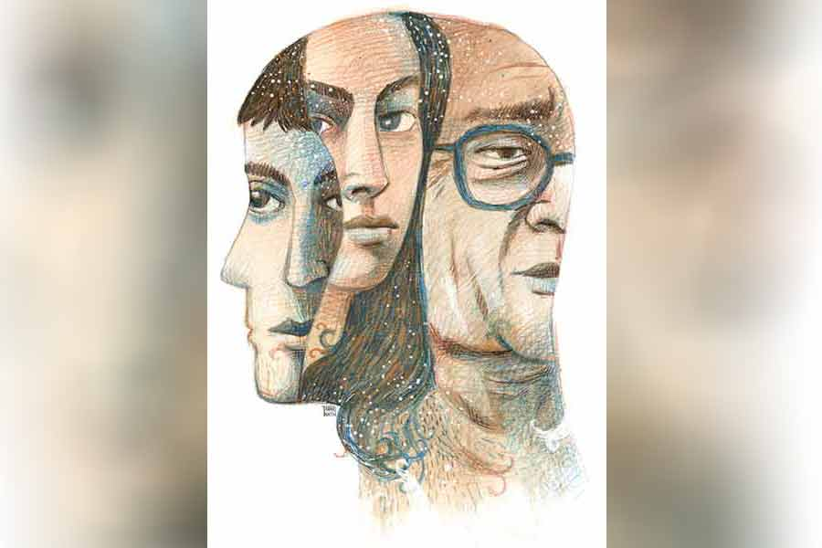

 
 <h1 align=center>অন্তরাল</h1>
<h2 align=center>রাজেশ গঙ্গোপাধ্যায়</h2> 

সকালবেলা ঘুম ভাঙার পর আরও কিছু ক্ষণ বিছানায় গড়াগড়ি দেওয়ার একটা আলাদা আনন্দ আছে। অনির্বাণের চিরকালই দেরি করে ঘুম থেকে ওঠা স্বভাব। সুবর্ণা সক্কাল হলেই আর বিছানায় থাকে না। ও আর অনির্বাণ প্রায় একই সময়ে অফিসে বেরোয়। বেরোনোর সময় দু’জনেই ভাত খেয়ে নেয়, টিফিন হিসেবে নেয় ওটস, রুটি কিংবা পাউরুটি। এর সঙ্গে শ্বশুরমশাইয়ের জন্য রান্না করে রাখতে হয়। সব কিছু সময়ে মাপা। শুধু ছুটির দিনগুলো একটু অন্য রকম। লুচি-বেগুনভাজার মতো ব্যাপারস্যাপার ঘটে। সুবর্ণা এমন ভাবে সংসারের লাগাম ধরে নিয়েছে যে, অনির্বাণের গেস্ট অ্যাপিয়ারেন্স ছাড়া কিছু করার নেই।

“হ্যাঁ, রুপু বল...” অফিসের কাজের মাঝেই রূপকের কলটা অনির্বাণ রিসিভ করেছিল।

“বুড়ো বাবাকে এত বড় বাড়িতে একা রেখে যে চলে যাস, কোনও দিন ভেবেছিস কিছু একটা বিপদ ঘটে গেলে কী হবে?” রূপকের কথায় বিরক্তি লুকনো রইল না।

“কেন! কী হয়েছে বাবার?”

“সিঁড়ি থেকে পড়ে মাথা ফেটে রক্তারক্তি। তাও কি জানতে পারতাম? আগামী শনিবার শীতলা পুজোর কথা বাড়ি বাড়ি জানানো চলছিল। অনেক বার ডোরবেল দিয়েও যখন কোনও সাড়াশব্দ পাওয়া গেল না, আমাদের সন্দেহ হল। সবাই মিলে সিদ্ধান্ত নিয়ে সদর দরজা ভেঙে ঢুকে দেখি, রক্তে ভেসে যাচ্ছে, কাকু তার মধ্যেই অজ্ঞান হয়ে পড়ে আছেন মেঝেয়।”

“বাবা এখন কোথায়?” অনির্বাণ কাতর হয়ে জিজ্ঞেস করল।

“হসপিটালাইজ়ড করতে হয়নি। পাঁচটা স্টিচ করিয়ে বাড়িতে নিয়ে আসা হয়েছে। রুনুকাকিমা আছে।”

“আসছি রুপু। কাকিমাকে আমি আসা অবধি থাকতে বলিস প্লিজ়।”

বেরোতে বেরোতেই সুবর্ণাকে কল করে বিস্তারিত বলল অনির্বাণ। সুবর্ণা বলল, “আমিও যতটা সম্ভব তাড়াতাড়ি আসছি। তবে এ সময় ডাউন ট্রেনের গ্যাপগুলো তো অনেক বেশি, দেখা যাক। আচ্ছা অনি, সদর দরজাটার কী হবে? ওটা তো আজই সারাতে হবে, তাই না?”

বাবার চিন্তায় অনির্বাণের মাথাতেও আসেনি এ সব। অনিচ্ছাসত্ত্বেও ও বলল, “দেখছি।”

বাড়িতে ঢুকতে গিয়ে দেখল মিস্ত্রিরা কাজ করছে। ভাঙা দরজাটা মেরামত করা হয়ে এসেছে প্রায়। রুপু দাঁড়িয়ে আছে সামনে। কিছু বলল না। অনির্বাণ ছুট্টে বাড়ি ঢুকে দেখল রুনুকাকিমা হেডফোন গুঁজে ফোনে সিরিয়াল দেখছে গভীর মনোযোগে। বাবা ঘুমোচ্ছেন। মাথায় ব্যান্ডেজ। অনির্বাণ চুপ করে দাঁড়িয়ে রইল।

“এখন ভয়ের কিছু নেই। অনেকটা ব্লাড লস হয়েছে তো। একটু দুর্বল থাকবে ক’দিন। না চাইলেও জোর করে হেলদি ডায়েট দিস...” রুনুকাকিমা নিজে থেকেই বললেন। সরকারি হসপিটালে মেট্রন ছিলেন, এখন অবসরগ্রহণের পর পাড়ায় সবার ফার্স্ট এডের দায়িত্ব কাকিমারই। ওঁর কোনও বিরক্তি নেই এতে।

অনির্বাণ মাথা নাড়ল, ওষুধপত্র বুঝে নিল।

“এ বার আসি রে। দরকার হলে ডাকিস। ক’দিন স্ট্রেস নিতে দিস না।” কাকিমা চলে গেল।

মিস্ত্রিদের প্রাপ্য মজুরি মিটিয়ে দিয়ে অনির্বাণ যখন দরজা বন্ধ করতে যাচ্ছে, তখনই সুবর্ণা এল।

“আচ্ছা অনি, বাবা উপরে কেন গিয়েছিলেন বলো তো? সব কিছু তো নীচেই। বাড়ির সামনে হাঁটাহাঁটি করতে গিয়ে যদি হত, তা হলেও না হয় বুঝতাম...” সুবর্ণা যেন ঠিক উত্তর চাইছে না, নিজের মনে মনেই বলছে কথাগুলো আর ভাবার চেষ্টা করছে ঘটনাক্রম। সুবর্ণার এই অ্যাটিটিউডটা অনির্বাণের ভাল লাগল না। ও বলতে চেয়েছিল ‘বাবার যন্ত্রণাটাই এই মুহূর্তে আমার কাছে প্রায়োরিটি, তার কারণটা নয়। তোমার বাবা-মা হলে, এই চিন্তাভাবনাগুলো আসত তোমার?’— কিন্তু কিছুই বলল না। অনির্বাণের এই নীরবতাই সংসারে অনেক সিদ্ধান্ত নেওয়ার সুবিধে করে দেয়, এ কথা অনির্বাণের অজানা নয়।

বাবা চোখ খুললেন। অনিকে দেখে একটু হাসলেন। সেই ম্লান হাসিতে আত্মগ্লানি ফুটে উঠল কি!

গায়ে হাত বুলিয়ে অনি জিজ্ঞেস করল, “কেমন আছ, বাবা?”

বাবা দু’চোখ বুজে বোঝাতে চাইলেন, ‘ভাল আছি।’

অনি এটুকুতেই খুশি। ওর দু’চোখে খুশি চকচক করে উঠল। জিজ্ঞেস করল, “কিছু তো খেতে হবে, বাবা।” হেলথ ড্রিঙ্কের সঙ্গে বিস্কুট দেবে কি না জানতে চায় সে।

বাবা দু’চোখ বুজেই দিতে বললেন। অনি গদগদ হয়ে উঠে সুবর্ণাকে বাবার হেল্থ ড্রিঙ্ক আর বিস্কুট দিতে বলল। বিস্কুট হেল্থ ড্রিঙ্কে ভিজিয়ে নরম করে খাইয়ে, বাকি ঈষদুষ্ণ পানীয় চামচ দিয়ে খাইয়ে দিল অনি।

“শুইয়ে খাওয়াচ্ছ কেন? রুনুকাকিমা কী বলেছেন?” সুবর্ণা জিজ্ঞেস করল। সত্যিই তো। বাবাকে তো বসিয়ে খাওয়ানো যেতেই পারে। দুপুরে মুসম্বি লেবুর রস দেওয়া হল।

“তুমি তো আজ নিশ্চয়ই ছুটি নেবে?” পরের দিন সুবর্ণার এই প্রশ্নের উত্তর অনির্বাণ নিঃশব্দে মাথা নাড়ল। বাবাকে বাথরুম নিয়ে যাওয়া, গা-হাত-পা ধুয়ে মাথা না ভিজিয়ে স্নান করাতে করাতে কোথা দিয়ে যে কেটে গেল দিনটা, অনির্বাণ বুঝতেই পারল না। বাবা আজ দুপুরে নিজে নিজেই ভাত খেয়েছেন। অনির্বাণ সামনেই ছিল যদিও। দুপুরে খাওয়াদাওয়া মিটলে অনির্বাণ একটু রিল্যাক্সড হল এবং তখন ওর মনে পড়ল, আজ সুবর্ণা তো সারাদিনে এক বারও কল করেনি! আশ্চর্য!

ফোন ধরে সুবর্ণা, “বলো।”

অনির্বাণ বলে, “সারাদিন এক বারও কল করলে না?”

“জানি তুমি ব্যস্ত থাকবে। তাই ডিস্টার্ব করতে চাইনি।”

অনির্বাণ চুপ করে আছে। এর পর কী বলা উচিত, ওর ঠিক মাথায় আসছে না। এই চুপ করে থাকার ভিতরটা প্রত্যাশার প্রায়ান্ধকারে ভরে আছে। সুবর্ণা কি এক বার অন্তত জিজ্ঞেস করতে পারত না, ‘বাবা আজ কেমন আছে?’ কিন্তু করল না! আর অনিও কল ডিসকানেক্ট করে দিল কিছু না বলেই। কখনও কখনও এ ভাবেই জটিলতা ঘনিয়ে ওঠে কোনও স্পষ্ট কারণ ছাড়াই।

অনির্বাণ ঘরে ঢুকে দেখল বাবা টিভি দেখছে।

“বাবা, চা খাবে?” অনির স্বর শুনে বাবা ঘাড় ঘুরিয়ে দেখলেন এবং মাথা নেড়ে জানালেন, খাবে। বহু দিন পর অনি কিচেনে ঢুকল। সুবর্ণা বেশ সাজিয়েছে কিচেনটা। চায়ের কন্টেনার কিছুতেই খুঁজে পায় না। পেল অবশেষে। লিকার তৈরি হল দু’কাপ। চা ও ক্রিম ক্র্যাকার বিস্কুট নিয়ে এসে বাবার ঘরে বসল। চা খেতে খেতে অনি এটা সেটা কথা বলছিল বাবার সঙ্গে। ওর উদ্দেশ্য ছিল না, কিন্তু কী ভাবে যেন মুখ দিয়ে বেরিয়ে গেল প্রশ্নটা, “বাবা, কাল তুমি উপরে গিয়েছিলে কেন?”

কথাটা বলে অনির অপরাধবোধ হচ্ছিল। এই কথাটাই তো সুবর্ণা বলেছিল বলে, অনির ভাল লাগেনি। বাবারও বোধহয় কথাটা ভাল লাগেনি। চা খেতে খেতে হঠাৎ থেমে গেলেন। তার পর সরিয়ে রাখলেন কাপ-প্লেট। অনি প্রসঙ্গটা থামানোর জন্য দু’জনের কাপ-প্লেট ট্রেতে নিয়ে কিচেনে যাওয়ার জন্য উঠতেই শুনতে পেল বাবা বলছেন, “কল্যাণীর সঙ্গে শুরুর দিনগুলোর কথা আজকাল খুব মনে পড়ে। তোদের ঘরেও সেই চেনা গন্ধটা পাওয়া যায় কি না খুঁজতে গিয়েছিলাম রে।”

অনি চলে যেতে গিয়েও থমকে গেল। ও কি ঠিক শুনল! অনি এ নিয়ে আর কিছু জিজ্ঞেস করল না বাবাকে। ওর ভয় হচ্ছিল, বাবা আর কী কী বলবেন, কে জানে। চলে যাওয়ার জন্য পা বাড়াতেই বাবা বলে উঠলেন “একটু বোস না আমার কাছে...”

অনি ট্রে-টা রেখে সোফায় বসল। বাবা নিজের মনেই বলতে শুরু করলেন, “কল্যাণীও সব সময় ঘরদোর এ রকম গুছিয়ে রাখতে পছন্দ করত। আমার সঙ্গে এ নিয়ে কত যে রাগারাগি করেছে।”

বাবার মুখে স্মৃতিচারণের মোলায়েম হাসির আভা। অনি ভাবছিল, কিন্তু আমাদের তো নতুন বিয়ে হয়নি! এত দিন পর হঠাৎ...

বাবা যেন থট রিডিং করতে পারছেন! বলে উঠলেন, “এত দিন পর কেন, ভাবছিস তো? বলতে পারব না রে। বাবাকে তোর খারাপ মনে হতে পারে। হতে পারে কেন, হওয়ারই তো কথা। ছেলে আর বৌমার অনুপস্থিতিতে তাদের ঘরে ঢুকে... বৌমার কাছে তুই ছোট হয়ে যাবি জানি, কিন্তু আমি যে নিজেকে সংযত রাখতে পারি না...”

অনির দু’চোখ জলে ভরে এল। ও কোনও মতে সামলে নিল। বাবাকে এমন অসহায় অবস্থায় দেখতে ওর ভাল লাগছে না। বাবা এমন টালমাটাল অবস্থায়... ওর কষ্ট হচ্ছে। দুপুর ফুরিয়ে আসছে দ্রুত। কাছেই কোথাও একটা পাখি ডেকেই চলেছে থেকে থেকে। অনি বলার মতো কথা খুঁজে পাচ্ছে না। দু’জনের মধ্যে এই নিস্তব্ধতাকে ভরিয়ে তুলতেই যেন পাখিটাকে দায়িত্ব দিয়েছে কেউ। আশ্চর্য ভাবে সুবর্ণার অনুপস্থিতিতেই এই প্রসঙ্গটা উঠল। মনের আলো-আঁধারি বুঝতে গিয়ে ঘোর লেগে গেছে কত আচ্ছা আচ্ছা পণ্ডিতের, সেখানে অনির্বাণ তো কোন ছার! বাবার এই জটিল মানসিক আবর্তের কোনও ব্যাখ্যা অনির কাছে নেই।

অনির্বাণ ও সুবর্ণার সম্পর্কে একটা ছায়া ঘনিয়েছে ক’দিন ধরে। সুবর্ণা সবই করছে নিয়ম মতো। কিন্তু কোথাও যেন একটা ফাঁক রয়ে যাচ্ছে। সবচেয়ে বড় কথা দু’জনের কেউই যেন সেই ফাঁক পূরণে আগ্রহী নয়।

এরই মধ্যে সুবর্ণার ছোটকাকা মারা গেলেন। সুবর্ণার খুড়তুতো ভাই বাবন প্রথম ফোনটাই করেছিল অনির্বাণকে। জানত যে, এই একটা মানুষকে জানালে সব কিছু সামলে নেবে একাই। সুবর্ণা হসপিটালে না গিয়ে বাড়ি গেল। ছোটকাকিমার পাশে দাঁড়ানোটা এ সময় খুব জরুরি। বাবাও খুব ভেঙে পড়েছেন। ছোট ভাই আগে চলে যাওয়া বৃদ্ধ যেন মানতেই পারছেন না।

বাড়িতে গিয়ে অনেক ক্ষণ পর সুবর্ণা জানতে পারল, অনির্বাণ হসপিটালে রয়েছে বাবনের সঙ্গে। বাবনের কয়েক জন বন্ধুবান্ধবও রয়েছে। কিন্তু ওরা সবাই তো ছোট। ভিড় থেকে একটু আলাদা হয়ে গিয়ে সুবর্ণা কল করল অনির্বাণকে, “বাবা বাড়িতে একা রয়েছেন। তুমি তো এখান থেকে কাজকর্ম না মিটলে বেরোতে পারবে না মনে হচ্ছে। আমি কি আগে চলে যাব?”

“প্রয়োজন নেই।”

“মানে!”

“রুনুকাকিমাকে বলেছি এসে কিছু ক্ষণ থাকতে।”

সুবর্ণা আর কিছু বলার মতো খুঁজে পায় না। ফোনটা রেখে দেয়। পিছন ঘুরতেই দেখল মা একদৃষ্টে তাকিয়ে আছে ওর দিকে।

“কিছু বলবে মা?”

“কিছু হয়েছে?”

“কী হবে!”

“সেটাই তো জানতে চাইছি। তুই বলতে না চাইলে থাক।”

“কিচ্ছু হয়নি মা, চল এক্ষুনি হয়তো ওরা এসে পড়বে।”

“ঘরপোড়া গরু সিঁদুরে মেঘ দেখলে ডরায়...” সুবর্ণা মায়ের কথা বুঝতে পারে না। দু’জনে নিঃশব্দে সিঁড়ি দিয়ে নামতে থাকে। সুবর্ণা প্রশ্ন করে, “দাদাকে জানিয়েছ তো মা?”

মা নীরবে মাথা নাড়লেন।

ড্রাইভারের পাশের সিটে অনির্বাণ বসে একটা প্যাকেট থেকে নিয়ে খই আর খুচরো পয়সা ছড়াচ্ছে। বাবন আর ওর বন্ধুরা ফুল দিয়ে সাজানো শয্যা ছুঁয়ে বসে আছে ম্যাটাডোরের উপর। বাড়িতে নিয়ে আসার পরই প্রবল কান্নাকাটির ঢল নামল। বাবা হাউহাউ করে কাঁদতে পারছেন না, কিন্তু বোঝা যাচ্ছে এক কান্নার পাহাড় তাঁকে ছুঁয়ে আছে। ছোটকাকিমা জ্ঞান হারিয়ে ফেলল। বাবন মায়ের কাছে এসে এত ক্ষণ ধরে শক্ত থাকার চেষ্টা করেও ভেঙে পড়ল।

অনির্বাণ সুবর্ণার মায়ের কাছে এসে বলল, “আর থাকাটা বোধহয় ঠিক হবে না মা। এ বার বেরিয়ে যাই।” সুবর্ণার মা মুখে আঁচল চাপা দিয়ে ফুঁপিয়ে উঠেও মাথাটা হেলিয়ে দিলেন। পাড়ার কয়েক জন আর কিছু আত্মীয়স্বজনকে নিয়ে শবযাত্রা বেরিয়ে গেল। সুবর্ণার সঙ্গে অনির্বাণের কোনও কথা হল না।

অনির্বাণ বাবনকে ছোট করে শ্রাদ্ধশান্তি সারার পরামর্শ দিয়েছে।

কিন্তু সুবর্ণার বক্তব্য, “সব আত্মীয়স্বজনকে ডাকা হবে না?”

বাবা বললেন, “খবর পেয়েও যখন সবাই আসতে পারেনি, তখন কাজে ডেকে বিরক্ত করে কী লাভ?”

ছোটকাকিমার কোনও কিছুতেই কোনও বক্তব্য নেই।

বাবন বলল, “জেঠু ঠিকই বলেছে। তা ছাড়া অনিদা তো আগেই এই সাজেশন দিয়েছে। এর মধ্যে ভুল কিছু নেই।”

সুবর্ণা চুপ করে রইল। ইতিমধ্যে বাবনের মোবাইলে অনির্বাণের কল ঢুকল। ও কথা বলতে বলতে উঠে গেল বাইরে। কিছু ক্ষণ পর এসে বলল, “দিদিভাই, অনিদার মতো এক জন ফ্যামিলিতে থাকলে কারও আর কোনও চিন্তা থাকে না। অনিদা পুরোহিত ঠিক করে কাজের বাজার-দোকান, দক্ষিণা সব কিছু নিয়ে প্রাইমারিলি কথা বলে রেখেছে।”

সুবর্ণা উঠে পড়ল, “আজ চলি।”

মা ওর সঙ্গে সদর দরজা পর্যন্ত এসে বললেন, “ছেলেটা কিন্তু তোর দাদার মতো নয়, মনে রাখিস।”

“জানি মা। কিন্তু আমার শ্বশুরমশাই...” এ পর্যন্ত বলে সুবর্ণা একটু থামল। মা ওকে ঠেলে একতলার বৈঠকখানার ঘরে ঢুকিয়ে নিলেন। উপরে কেউ জানতেও পারল না যে সুবর্ণার বেরনো হল না।

সুবর্ণা সব বলে চুপ করে আছে। একটু পর মা বলল, “তোর দাদা কেন এ বাড়ি ছেড়ে চলে গেছে, জানিস?”

আজ মায়ের থেকে যা শুনল, আগে কখনও শোনেনি। বাবাও! বাড়ি ফেরার কথা উঠলেই দাদা যখন প্রসঙ্গ ঘোরাত, সুবর্ণার খারাপ লাগত। বৌদির উপরও কি রাগ হত না?

নিজের বাবা বলেই হয়তো সুবর্ণার ভিতর থেকে একটা যুক্তি উঠে আসতে চাইল— অ্যাডভান্সড এজ সিনড্রোম। এবং ও নিজের উপরই লজ্জিত না হয়ে পারল না।

“অন্যের দিকে আঙুল তোলার আগে...” মায়ের যে কথাটা শেষ হল না, তা নীরব সুবর্ণাকে স্পষ্ট বুঝিয়ে দিল অব্যক্তেরও কত অভিমুখ...

