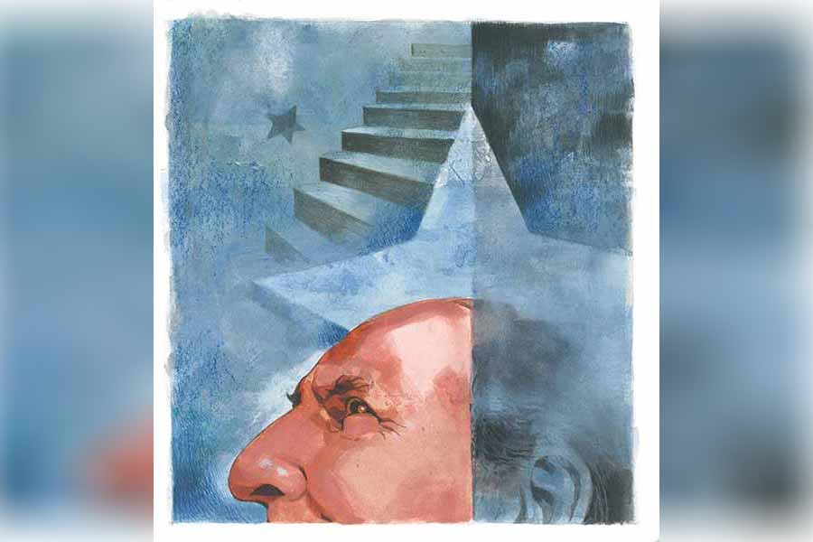

 
 <h1 align=center>অন্তর্দর্শন</h1>
<h2 align=center>অনির্বাণ বসু</h2> নীরবে কম্পিউটারে বসে এক্সটেনশনের আবেদনপত্র তৈরি করে ফেললেন মনোতোষবাবু। প্রিন্টআউট নেওয়ার আগে বেশ ভাল করে চোখ বুলিয়ে নিলেন। নাহ! সব ঠিকঠাকই আছে। প্রিন্ট বোতামে চাপ দিলেন। সরসর শব্দ করে পাতাটি বেরিয়ে নিশ্চিন্তে শুয়ে পড়ল প্রিন্টার লাগোয়া ট্রে-তে। সেটিকে তুলে বাদামিরঙা খামে ভরে নিশ্চিন্ত হলেন তিনি।

সপ্তাহদুয়েক হল প্রাক্‌-অবসর পাওনা ছুটি কাটাচ্ছেন মনোতোষবাবু। আজ শেষ হল। কাল আবার অফিস যাবেন। শেষের দু’-এক দিনে কিছু ফর্মালিটি বাকি। অফিসের বস মনোতোষবাবুকে পছন্দ করেন, বলে রেখেছেন চাইলে এক্সটেনশন দিয়ে দেবেন আরও বছরখানেক। মনোতোষবাবুর ইচ্ছে ছিল না। কিন্তু মাসখানেক ছুটি কাটানোর পরই, শেষ দিনে মত বদলে ফেলেছেন, নাঃ! আরাম হারাম হ্যায়। এক্সটেনশনই নেবেন। স্ত্রী মনোরমা দুপুরে তাঁর গেট-টুগেদারে বেরিয়ে যাওয়ার পরই এই সিদ্ধান্ত।  

কিন্তু কেন হঠাৎ মতবদল? কী ঘটেছিল সকালে?

*****

“শুনছ! এক বার এসে আলমারির শাড়িগুলো ধরো তো!”

সোফায় বসে কাগজে চোখ বোলাতে বোলাতে একটু ঝিমুনি এসেছিল মনোতোষবাবুর, মনোরমার গলায় চমকে উঠলেন তিনি। আলমারির জামাকাপড়গুলো ধরতে হবে? কেন?

সকাল সাড়ে দশটা বাজে। সকালের কাজের মাসি কাজ করে চলে গিয়েছে, আর এক জন আসবে সেই সাড়ে বারোটা। ঠিক, ঠিক! মনোরমা এই সময় আলমারি পরিষ্কার করে রাখতে চায়। কিন্তু কেন? এই তো মোটে দু’দিন আগেই…

“কী হলটা কী! আমি কত ক্ষণ শাড়িগুলো ধরে দাঁড়িয়ে থাকব?” মনোরমা আবার গলা তুলেছেন। তা উনি তুলতেই পারেন, বিশেষ করে মনোতোষ যখন রিটায়ার করতে চলেছেন। তা ছাড়া, আর একটা ব্যাপারও আছে। নো পেনশন, অতএব ফুল টেনশন। অফিসের দিনকালই যে বেশি ভাল, তা ক্রমে ক্রমে মনোতোষের মালুম হচ্ছে। আগে বাড়ির কোনও কাজে অনায়াসে কেটে বেরিয়ে আসা যেত। কারণ, মোবাইল। অফিসের দেওয়া। ল্যাপটপ। অফিসের দেওয়া। আরও আছে। একটি প্রগাঢ় বাণী। মনোতোষের বস, দিলীপ দুবে, যিনি ওঁর থেকে বয়সে ছোট, যাঁকে সবাই আড়ালে দুঁদে দুবে বলে ডাকত, তিনি সবাইকে বলে দিয়েছিলেন, “অফিস ল্যাপটপ আর মোবাইল কারও পার্সোনাল ব্যবহারের জন্য দেয়নি। অফিসের কাজের জন্য দেওয়া হয়েছে। সেই মতো আমরা এক্সপেক্ট করব, সবাই টোয়েন্টি ফোর আওয়ার্স অ্যাভেলেবল থাকবেন অন দ্য মোবাইল, ইফ নিডেড।”

মনোতোষ দমে গিয়েছিলেন ঠিকই, কিন্তু পরে খেয়াল করে দেখলেন, এই কথাটা তো ঢালের মতো ব্যবহার করা যেতে পারে! এমনিতে মনোতোষ দাম্পত্যকলহে অবিশ্বাসী, কিন্তু তা বলে তিনি বাড়িতে স্বাধীনতা খর্ব করতে চান না। সুতরাং, স্ত্রীর মেজাজ থেকে রক্ষা পাওয়ার জন্য, তিনি দরকারে-অদরকারে দুঁদে দুবের বলে দেওয়া ‘টোয়েন্টি ফোর আওয়ার্স অ্যাভেলেবল থাকবেন অন দ্য মোবাইল’ বাণী অবলম্বনে ‘অফিসের কাজে ব্যস্ত আছি’ বলে রেহাই পেতেন। অফিসের ব্যাপার, মনোরমাও বিশেষ ঘাঁটাতেন না। কিন্তু এর পর তো আর সেটি হওয়ার উপায় নেই! অফিস যাচ্ছে অস্তাচলে, আর তিনি যাবেন রসাতলে।

মানে ঠিক তা নয়, চলে প্রায় যাচ্ছিলেন। রিটায়ার করার পর একটা ছোট ফার্মে জয়েন করার কথাবার্তা হয়েছিল ঠিকই, কিন্তু তখনও ঠিক ছিল, তিনি অবসরই নেবেন। তা ছাড়া তখনও বস এক্সটেনশনের অফারটা দেননি। মনোরমা হলেন হোমমেকার, তাঁর ইনকাম করার নো চান্স, কিন্তু তাতে কিছু এসে যায় না! দু’জনেই ঠিক করেছিলেন যে দুটো পয়সা কম আসুক, ক্ষতি নেই, কিন্তু দিনের শেষে মনের আনন্দে স্বপ্নের জগতে বিচরণ করাই আসল শান্তি। তাই এখন থেকে মনোতোষ বাড়িতেই থাকবেন, ঠিক হয়েছিল। কিন্তু তাই বলে এক-দু’মাস অন্তর মনোরমার আলমারি পরিষ্কার করার বাতিকের ঠেলা যে সামলাতে হবে, কই এ রকম তো কথা ছিল না! কিন্তু কোনও উপায়ও তো নেই! বস এবং স্ত্রী— দুই-ই খুব গোলমেলে জীব। স্ত্রীর কথা, বসের হুকুমের শামিল। না মানলেই বিপদ।

অতএব গেলেন বেডরুমে, কারণ ওখানেই থাকে ওঁদের আলমারি। গিয়ে দেখেন, একটা টুলের উপর মনোরমা দাঁড়িয়ে, সামনে বিরাট উঁচু কাঠের ওয়ার্ডরোব, সেটা হাট করে খোলা, তাঁর দু’হাতে ভর্তি শাড়ি।

“এ কী! এ তো একেবারে আনসেফ প্র্যাক্টিস! নামো!” মনোতোষ বলে উঠলেন।

অফিসে সেফটির উপর জোর দেওয়া হত, সেটার রেশ রয়ে গেছে। সেটা ভাল, কিন্তু তা শুনে মনোরমা ঝাঁঝিয়ে উঠলেন, “চুপ করো তো! বাড়িটাকে অফিস করে ফেলো না! আমি না উঠলে কে উঠবে? তুমি তো উঠতেই পারবে না!”

কথাটা ঠিকই। মনোতোষের শুগার প্রেশার সব আছে। এর মধ্যে ঠিক রিটায়ার করার মুখে, কী একটা বিটকেল ব্যথা ওঁর পায়ে শুরু হওয়ায় ডাক্তার গুপ্ত ওঁকে সাবধানে থাকতে বলে বলেছেন, “বয়স তো বাড়ছে, সেটা খেয়াল করতে হবে তো, না কি? বাড়িতে থাকবেন, মিসেসের সঙ্গে সময় কাটাবেন, বুঝেসুজে কথা বলবেন, তা হলেই দেখবেন লাইফ হ্যাপি। বুঝেছেন?”

তখন ডাক্তার গুপ্তর কথায় রাজি হয়ে ফিরলেও, শাড়ির বহর দেখে মনোতোষ বলেই ফেললেন, “ও বাবা! এ তো বিয়েবাড়ির তত্ত্ব যাচ্ছে মনে হচ্ছে! কার?”

বিরক্ত হলেন মনোরমা, “আঃ! বাজে না বকে এগুলো ধরো!”

“ধরতে পারি, কিন্তু কেন ধরব?” একটা শেষ চেষ্টা করলেন মনোতোষ।

“কী?” মনোরমার স্বর তীক্ষ্ণ।

“না কিছু নয়। এই তো ধরলুম...” মনোতোষ হাত ছড়িয়ে দাঁড়াতেই দমাস করে বিশ-পঁচিশটা শাড়ি তাঁর হাতের ওপর এসে পড়ল, কিন্তু তিনি ব্যালান্স হারানোর মতো রিস্কি কাজ করতে পারলেন না, কারণ আফটার অল, শাড়িগুলো তাঁরই স্ত্রী মনোরমার। তাও চেষ্টা করলেন একটা মৃদু আপত্তি জানানোর। 

“উফ! এ কী কাণ্ড করলে!” ক্ষীণ গলায় বললেন তিনি। “আমার যে দমবন্ধ লাগছে।”

মনোরমার কোনও ভ্রুক্ষেপ নেই। তিনি আরও কতকগুলো শাড়ি চাপিয়ে দিয়ে বললেন, “যাও, এগুলো রেখে দাও ওই ঘরের সোফায়। তার পর আবার এ ঘরে আসবে।”

“আরও আছে?” কপালে বিন্দু বিন্দু ঘাম দেখা দেয় মনোতোষের।

“তাড়াতাড়ি আসবে, দেরি করবে না...” মনোতোষের প্রশ্নের উত্তরে সংক্ষেপে বললেন মনোরমা।

“শুধু তো শাড়িই বেরোচ্ছে!” মনোতোষ গজগজ করতে চলে গেলেন। কিন্তু শুধু কি শাড়ি সোফায় রেখে পালানোর উপায় আছে? অফিসে ছিল। বেশি কাজের প্রেশার হলে মনোতোষ ‘ওয়াশরুমে যাচ্ছি’ বলে চা খেতে চলে যেতেন। চায়ের দোকানের বিহারীলাল বহু বছরের চেনা, সে তাঁকে দেখলেই বড় ভাঁড়ে চা দিত, মাঝে মধ্যে তাঁর মুড বুঝে তাঁকে দু’-একটা সিগারেটও দিয়ে দিত। কিছু বলতে হত না।

কিন্তু সে সব দিন তো আর নেই। বাড়িতে তো আর ‘ওয়াশরুমে যাচ্ছি’ বলে চা খেতে বেরোনো যায় না। বেশ বুঝতে পারছেন স্ত্রীর কাজে একেবারে টোয়েন্টি ফোর আওয়ার্স অ্যাভেলেবল থাকতে হয়। অফিসে সেটা না-হয় বস বলে দিতেন, কিন্তু বাড়িতে ওটা আবার বলে দিতে হবে নাকি? এক কালে মেজাজে অফিস করেছ, কিন্তু এখন তো রিটায়ার করতে চলেছ ভাই! এইটুকু তো করতেই হবে! বলার আবার কী!

মানে, সেই মনোতোষবাবু, অফিসে যাঁর কদর ছিল ঈর্ষণীয়, তিনি এখন কদরহীন, ইংরেজিতে যাকে বলে ‘টেকেন ফর গ্রান্টেড’, তাই। কারণ অফিসের চব্বিশ ঘণ্টায় স্যালারি ছিল, বৌয়ের খিদমতে তা নেই। তবে একেবারেই কি নেই! গৃহশান্তিকে কি সেই বেতন হিসেবে ধরা যেতে পারে? বস যদি ফোর-ফর্টি হতেন, বৌ থাউজ়্যান্ড ভোল্ট! দুঁদে দুবে তো তাও কাজের কদর করেছেন, তাঁকে এক্সটেনশন দেওয়ার প্রস্তাব দিয়েছেন!

বৌয়ের জ্বালাময়ী ভাবনা এবং শাড়ির বোঝা সামলে আবার বেডরুমের দিকে যাবেন, এমন সময় ডোরবেল বাজল।

“এখন আবার কে?” মনোরমার গলা শুনে মনে হল দুঁদে দুবের চিৎকার এর কাছে শিশু! কিন্তু সেটা বিচার করার সময় আর নেই, কারণ মনোরমার আর একটা হুকুম ছুটে এল, “গিয়ে দেখো শিগগির, আমি এখন টুল থেকে নামতে পারব না!”

তা আর বলতে! নামতে গিয়ে অন্য কিছু হলে আর দেখতে হবে না! কী মনে করে মনোতোষ দরজার দিকে যেতে যেতে বললেন, “শাড়িগুলো নামিয়ো না এখন।”

দরজা খুলে দেখেন, তাঁদের জমাদার বিজয় দাঁড়িয়ে। হাতে ঝাঁটা, মুখে মাস্ক।

“বাথরুম পরিষ্কার করব!” বিজয়গর্বে ঘোষণা করল সে। এই এক জ্বালা! ছেলেটা মহা ত্যাঁদড়। সোমবার সকালে তার আসার কথা, কিন্তু কোনও দিন আসে না! কিছু বললে বলে, “কী করব, ডিউটি আছে না?”

ভাবটা এমন যে, বাথরুম পরিষ্কার করে ওঁদের কৃতার্থ করে দিচ্ছে। ‘কেন রে, তোকে কী পয়সা দেওয়া হয় না?’ ভাবেন মনোতোষবাবু।

“কে?” মনোরমার গলা।

“বৌদি, বাথরুম পরিষ্কার হবে না?” মনোতোষকে স্রেফ ইগনোর করে বিজয় মনোরমার উদ্দেশে বলল, যদিও তিনি ধারে-কাছে নেই।

“কাল আসবি,” মনোরমার জবাব চলে এল বেডরুম থেকে।

বিজয় গান গাইতে গাইতে চলে গেল। মনোরমার কথায় হ্যাঁ বা না কিছু তো বললই না, উপরন্তু বিজ্ঞের মতো মনোতোষকে বাধ্যতামূলক সেফটি রিমার্কও ছুড়ে দিল, “দরজাটা বন্ধ করে দিন!”

চিজ় বটে একখানা!

বারদুয়েক এ ঘর থেকে ও ঘর শাড়ির বোঝা নিয়ে আপ-ডাউন করার পর মনোতোষের মনে হল, তিনি যেন তাঁর অফিসের বেয়ারায় পরিণত হয়ে গেছেন। কিন্তু বেশি ক্ষণ তাঁকে আর বেয়ারাগিরি করতে হল না, কারণ মনোরমা হঠাৎ উচ্ছ্বসিত ঘোষণা করলেন, “পেয়ে গেছি!”

“অ্যাঁ! কী?” মনোতোষ মেশিনের মতো আসছিলেন আবার শাড়ির নেক্সট লট নিয়ে যেতে, মনোরমার কথায় চমকে গিয়ে জিজ্ঞেস করলেন, “কী পেয়ে গেলে?”

“পুরনো শাড়িটা!”

“পুরনো শাড়ি? তুমি আলমারি পরিষ্কার করবে না?”

“না!” মনোতোষের হতভম্ব মুখের দিকে তাকিয়ে বললেন মনোরমা, “আলমারি পরিষ্কার করব কেন? এক মাস আগেই তো করা হল! আমি লিপির দেওয়া শাড়িটা খুঁজছিলাম। আজ ওর অনারে আমাদের গেট-টুগেদার। ওর দেওয়া শাড়িটা পরে যাব। খুশি হবে!”

“লিপি?” প্রশ্নটা মুখে আসতেই নিজেকে সামলে নিলেন মনোতোষ। মনে পড়েছে! ঠিক ঠিক! ভদ্রমহিলা আমেরিকায় থাকেন। প্রতি বছর আসেন, এবং এমন সব ডলার-কাহিনি রসিয়ে রসিয়ে বলেন যে, বাকিদের মুখ কালো হয়ে যায়, আর তার ঠেলা সামলাতে হয় বাড়িতে, মানে ওঁকে। এর আগেও হয়েছে। তাকে এত খুশি করার কী দরকার রে বাবা! যাই হোক, এ সব প্রশ্ন করে লাভ নেই। কথাই আছে ‘বস ইজ় অলওয়েজ় রাইট!’ বাড়িতে বস মানে স্ত্রী। সুতরাং চুপ করে থাকাই ভাল।

*****

বিকেলে একটা চায়ের কাপ নিয়ে চুপ করে বারান্দার চেয়ারে বসে রইলেন মনোতোষ। মনোরমা সেই বহু অনুসন্ধানে প্রাপ্ত শাড়িটি পরে বেরিয়ে গেছেন। হাই টি-এর নেমন্তন্ন, ফিরতে দেরি হবে। সে হোক, কোনও আপত্তি নেই তাতে। বরং এখন একটু চুপ করে ভাবার সময় এসেছে।

রিটায়ার করার পর, সংসারে তাঁর কী প্রয়োজন? স্ত্রীর জন্য শাড়ি ধরা, বিজয়ের জন্য দরজা খোলা, পোস্টঅফিসে গিয়ে টাকা চেক করা, বাজারে গিয়ে মাছ-আনাজের দর নিয়ে চাপানউতোর? এ সব তো তাঁর ধাতে সইবে না!

অফিসে থাকাকালীন একটা কথা তিনি প্রায়ই শুনতেন, বিশ্বাসও করতেন। কেউই অপরিহার্য নয়। আজকে, রিটায়ার্ড হলে তিনি কোন পর্যায়ে যাবেন? অপরিহার্য না বর্জ্য? আগে সংসারের এই সব কাজ কী করে হত? কোনও দিন মাথা ঘামানোর প্রয়োজন মনে করেননি। ছেলেমেয়েরা তখন ছিল, তারাই হয়তো সামলেছে। আজকে তারাও বড় হয়ে অন্য শহরে কেরিয়ার গড়তে ব্যস্ত। তাদের পাওয়া যাবে না।

কিছু ক্ষণ পর মনোতোষের খেয়াল হল যে, এই ঘোরালো পরিস্থিতি তাঁর পক্ষে মোটেই সুখকর হচ্ছে না। রিটায়ার করার পর এ রকম ফাঁপরে যে তিনি পড়বেন, তা ভাবতেও পারেননি। তা হলে কী দুবে সাহেবের এক্সটেনশনের প্রস্তাবটাই লুফে নেবেন? কিন্তু সেটা কি ঠিক হবে? তা হলে অন্য আর কী করা যেতে পারে? নানা ভাবনাচিন্তার পর মনে হয়েছিল, এক্সটেনশন নেওয়াটাই বেস্ট অফার। বাড়িতে বলবেন, অফিস কিছুতেই ছাড়তে চাইছে না। সেই কারণেই স্ত্রী বেরিয়ে যেতেই দুবেকে অ্যাড্রেস করে আবেদনপত্রটি লিখে ফেলেছেন।

অফিস ছাড়া যিনি সারাটা জীবন কোনও অস্তিত্বই নিজের কল্পনা করতে পারেন না, সেই মনোতোষ, যিনি তাঁর বস দুঁদে দুবের থেকেও কিছু কম ছিলেন না, হঠাৎ খেয়াল করলেন যে তিনি যেন নিজেকে পুরোপুরি চেনেনই না। অফিস করেছেন পেটের তাগিদে। সকালে হাঁপাতে হাঁপাতে ঢুকেছেন আর সন্ধেবেলায় ধুঁকতে ধুঁকতে বেরিয়ে এসেছেন।

সাতপাঁচ ভাবতে ভাবতেই বিকেল পড়ে এল, আকাশে আশ্চর্য সব রং ছড়িয়ে নামতে শুরু করল সন্ধে। মুগ্ধ হয়ে গেলেন মনোতোষবাবু। তাঁর মনে পড়ল, অফিসে থাকতে বিকেলের আলো কেমন দেখতে হয়, সেটা দেখাই হয়নি কত দিন! সেই ছোটবেলায় দেখেছিলেন, তার পরে আর সুযোগ হয়নি। মুখ বুজে চাকরি করেছেন, তার জন্য মাইনে পেয়েছেন। ব্যস, আর কিছু না। কিন্তু তিনি নিজে যে কী করতে পারেন, সেটা তিনি জানেনই না, ইন ফ্যাক্ট এই ষাটোর্ধ্ব বয়সেও নয়। হঠাৎ এক খাঁটি সত্য উপলব্ধি করার পর, মনোতোষবাবুর অশান্ত মন এক গভীর প্রশান্তিতে ভরে উঠল। মনে হল, তা হলে কেন আবার অফিস?

তা ছাড়া মনোরমাও নিশ্চয়ই রোজ রোজ আলমারি পরিষ্কার করবে না। মনোতোষবাবুরও তো কত দিন স্ত্রীর সঙ্গে সময় কাটানো হয়নি। চাকরি করা, ছেলেমেয়েকে বড় করা, দায়-দায়িত্বের ঘেরাটোপেই তো কেটে গেল কতগুলো বছর। এ বার জীবনসায়াহ্নে এসেও কি তাঁর একটু বিকেল দেখার ফুরসত হবে না?

ছেলেমেয়েরা দাঁড়িয়ে গেছে, তাঁর কোনও রকম অর্থকষ্টও নেই। রিটায়ার করে যা পাবেন, যা জমিয়েছেন, মোটামুটি চলে যাবে। তা হলে কেন ফের ঘানিগাছে গিয়ে জুড়তে চাওয়া? জীবন তো কখনও, কোথাও নিস্তরঙ্গ নয়। বাড়িতেই বা হবে কী করে! সে না-হয় মেনে মানিয়ে নেওয়া যাবে। শুনেছেন বুড়ো বয়সের দাম্পত্য নাকি অম্লমধুর হয়, সে স্বাদটা নিতে হবে না! তার পর কেউ এক জন আগে যাবেন, কেউ থেকে যাবেন। যিনি থেকে যাবেন, তাঁর কিছু সুন্দর স্মৃতি থাকবে না পড়ন্ত বেলার যৌথযাপনের?

হয়তো বাড়িও পুরোপুরি শান্তির জায়গা নয়, কিন্তু এই অনিশ্চয়তার মধ্যেও নিজেকে নতুন করে খুঁজে পাওয়া তো জীবনের আর এক রকম সত্য! সে যে বয়সেই হোক না কেন। মনোতোষবাবুর দৃঢ় বিশ্বাস তিনিও পাবেন। শুধু সময়ের অপেক্ষা।

চায়ের কাপটা নামিয়ে কাজের টেবিলে গেলেন মনোতোষবাবু। বাদামি খাম থেকে এক্সটেনশনের আবেদনপত্রটা বার করে নিলেন। এটার আর দরকার নেই।

বাইরে আকাশে তখন সন্ধের রং। পাখিদের ঘরে ফেরার সময়।