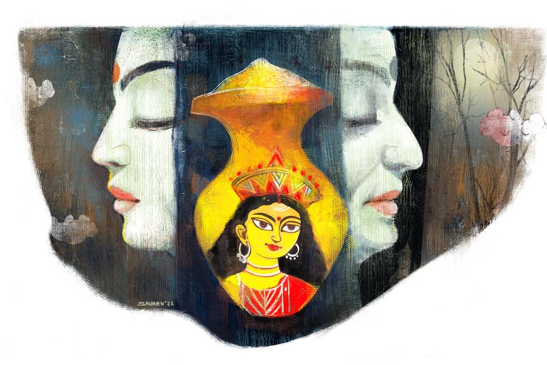

 
 <h1 align=center>অন্তস্তল</h1>
<h2 align=center>কৃষ্ণেন্দু মুখোপাধ্যায়</h2> বাইরের ঘরে ডোরবেলটা বেজে উঠল। এই ভরসন্ধেয় আবার কে এল! পদ্মাবতী খাটে একটু উঁচু হয়ে বসার চেষ্টা করলেন। আর তাতেই সারা শরীরে যন্ত্রণা ছড়িয়ে গেল। কে এসেছে, জানার জন্য অবশ্য বেশি ক্ষণ অপেক্ষা করতে হল না। সুপ্তি ঘরে এসে উত্তেজিত ভঙ্গিতে চাপা গলায় বলল, “বৌদি এসেছে।”

“কে?” বুঝতে না পেরে চোখ কুঁচকে জিজ্ঞেস করলেন পদ্মাবতী।

সুপ্তি আর একটু এগিয়ে এসে একই রকম চাপা গলায় বলল, “পুরনো বৌদি গো!”

পুরনো বৌদি মানে কি মৌমিতা? ঠিক বিশ্বাস হল না পদ্মাবতীর। সুপ্তি পাঁচ বছরের পুরনো কাজের মেয়ে। এই বাড়ির প্রত্যেককে চেনে। এমনকি মৌমিতাকেও। মাসখানেক দেখেছিল। মৌমিতার সঙ্গে অন্তুর ডিভোর্স পাঁচ বছর পেরিয়ে গিয়েছে। তার পর থেকে মেয়েটার সঙ্গে আর কোনও যোগাযোগ নেই। তবে মেয়েটা কেমন আছে, জানার প্রবল কৌতূহল ছিল। বিশেষ করে ও আবার অন্তুর মতো বিয়ে করেছে কি না, সেটা জানার। কিন্তু কোনও খবরই পদ্মাবতী জোগাড় করতে পারেননি। এইটুকু শুধু খবর পেয়েছিলেন, মেয়েটা অন্য শহরে চলে গিয়েছে।

মৌমিতা অবশ্য কয়েক দিন ধরে যোগাযোগ করার চেষ্টা করছিল। ওর মোবাইল নম্বরটা ব্লক করে দিয়েছিল অন্তু। তাও মেয়েটা অন্য ফোন নম্বর থেকে ফোন করার চেষ্টা করত। গলা শুনেই লাইন কেটে দিতেন পদ্মাবতী। পরে অন্তুকে বললে অন্তু সেই নম্বরগুলোও ব্লক করে দিত।

পদ্মাবতীর কপালে গভীর চিন্তার ভাঁজ পড়ল। মেয়েটা কোন মতলবে যোগাযোগ করার চেষ্টা করছে? আর কী উদ্দেশ্যে আজকে এই ফাঁকা বাড়িতে সন্ধেবেলায় এসেছে? নিশ্চয়ই খোঁজখবর নিয়ে রেখেছে যে, অন্তু এখন বৌকে নিয়ে ছুটিতে বাইরে বেড়াতে গিয়েছে। বাড়িতে পদ্মাবতী একদম একা আছেন।

“বলে দে, দেখা হবে না।”

সুপ্তি বলল, “সোফায় বসে আছে। তোমাকে বলতে বলল, তোমার সঙ্গে পাঁচ মিনিটের দরকার আছে। ঘরে নিয়ে আসব?”

“একদম না!” চোখ পাকালেন পদ্মাবতী, “আমাকে তোল। হুইলচেয়ারে বসা। আর শোন, ও না বেরোলে তুই যাবি না।”

তেতে উঠল সুপ্তি, “তোমাকে তো সকালেই বলে দিয়েছি, আজ আগে বেরোব। বাড়িতে লক্ষ্মীপুজো।”

“তোকে ক’ঘণ্টার জন্য মাইনে দেওয়া হয়? টাকা নেওয়ার সময় তো কড়কড়ে নোট গুনে নিস। ডিউটির সময় সে কথা মনে থাকে না? কথাই তো আছে রাত্তিরের আয়া এলে তবেই তুই যাবি।”

“তোমাকেও বলে রেখেছি, আজকে সন্ধেবেলা একটু আগে আমার ছুটি চাই। কে না কে কবেকার চলে এল, আর আমাকে যেতে দেবে না! টাকার দেমাক দেখিয়ো না। টাকা কেটে নিয়ো। ওটাই তো পারো।”

পদ্মাবতী গজগজ করতে থাকলেন। পদ্মাবতীকে আগে সবাই রাশভারী বলত, এখন খিটখিটে বুড়ি বলে। সবই কানে আসে। দু’পয়সার কাজের লোকের মুখেও কথা শুনতে হচ্ছে। কেউ বোঝে না বাতের ব্যথায় পঙ্গু হয়ে শয্যাশায়ী হলে মন কখনও মধুর থাকে না। গজগজ করতে করতেই পদ্মাবতী অগত্যা হাতটা বাড়ালেন। সুপ্তি উঠিয়ে হুইলচেয়ারে এনে বসাল। তার পর ঠেলে নিয়ে এল বসার ঘরে।  

বড় সোফাটার এক কোণে মাথা ঝুলিয়ে চুপ করে বসে আছে মৌমিতা। পদ্মাবতী মৌমিতাকে দেখে আরও দুশ্চিন্তায় পড়লেন। মেয়েটার চেহারা একটু ভারিক্কি হলেও এ মেয়ে তো এত শান্তশিষ্ট নয়। শেষের দিকে অন্তুর সঙ্গে যখন বনিবনা হত না, গলা ফাটিয়ে ঝগড়া করত। ওর কথাগুলো হুলের মতো বিঁধত পদ্মাবতীর বুকে। কী মতলবে যে এসেছে!

সুপ্তি হুইলচেয়ারটা সোফার উল্টো দিকে এনে থামাতেই উঠে দাঁড়াল মৌমিতা। শান্ত গলায় জিজ্ঞেস করল, “কেমন আছো মামণি?”

যখন সম্পর্ক ছিল পদ্মাবতী মৌমিতাকে ‘তুই’ বলতেন। এখন চোয়াল শক্ত করে বললেন, “মামণি! তুমি এখনও আমাকে মামণি বলবে?”   

ম্লান হাসল মৌমিতা, “কেন বলব না? এক জনের জন্য সবার সঙ্গেইকি সম্পর্ক শেষ হয়ে যায়? মামণি, বাপি বলে তো আমি আর কাউকে ডাকি না।”

মৌমিতা টিভির ক্যাবিনেটের দিকে তাকাল। ওখানে সুশান্তর ফ্রেমে বাঁধানো ছবিটা আছে। কালো মোটা ফ্রেমের ভারী চশমায় স্মিত হাসিমুখ। সুশান্তকে এই ডিভোর্স দেখে যেতে হয়নি। বাপ-মেয়ের মতো সম্পর্ক ছিল ওঁদের দু’জনের। 

মৌমিতা এগিয়ে এসে ঝুঁকে প্রণাম করতে গেল পদ্মাবতীকে। পদ্মাবতী হাত তুলে বললেন, “থাক। কী দরকার বলো।”

মৌমিতা এক বার সুপ্তির দিকে তাকাল। ইঙ্গিতটা স্পষ্ট। ওর সামনে বলা যাবে না। সুপ্তির প্রবল কৌতূহল হচ্ছে। এ রকম রগড় রোজ রোজ হয় না। কিন্তু আজ সত্যি হাতে সময় নেই। কাল বরং খিটখিটে বুড়ির কাছ থেকে সব জেনে নেবে। পেটে কোনও কথা রাখতে পারে না বুড়ি।

“আমি আসছি,” সুপ্তি বলল।

অসহায় চোখে পদ্মাবতী আর এক বার চেষ্টা করলেন, “আর একটু থেকে যা না।”

 “হবে না। এমনিই অনেক দেরি হয়ে গিয়েছে।”

“দেখে যা, ওই যন্ত্রটার সুইচটা চালানো আছে কি না।”

সদর দরজার পাশে একটা র‌্যাকে রাখা ওয়াইফাই রাউটারটা উঁকি মেরে দেখে নিয়ে সুপ্তি বলল, “চলছে। সবুজ আলোটা জ্বলছে।”

অল্প নিশ্চিন্ত হলেন পদ্মাবতী। সুপ্তি সদর দরজাটা টেনে বন্ধ করে বেরিয়ে গেল। মৌমিতা আবার সোফায় গিয়ে বসল। পদ্মাবতী ভেতরে ভেতরে ছটফট করছেন। মেয়েটা কোনও প্রতিশোধ নিতে আসেনি তো? যা ঝামেলা-ঝঞ্ঝাট গিয়েছে সেই সময়! শেষ দিন সব জিনিসপত্র নিয়ে যাওয়ার সময় মেয়েটার কাকা তো বলে গিয়েছিল, “দেখবেন খোরপোশটা যেন মাসে মাসে ঠিক সময় পায়। না হলে আবার কোর্টে দেখা হবে।”

আচ্ছা, অন্তু ওর খোরপোশটা নিয়মিত দেয় তো? তা ছাড়া কিছু গয়নাগাঁটি নিয়েও সুষ্ঠু মীমাংসা এখনও হয়নি।

“অন্তুরা এখন নেই। লাদাখে বেড়াতে গিয়েছে।”

“জানি।”

এই আশঙ্কাটাই পদ্মাবতী করছিলেন। ধূর্ত মেয়েটা সব খোঁজখবর গুছিয়ে নিয়ে এসেছে। বিস্মিত গলায় জিজ্ঞেস করলেন, “কী করে জানলে?”

“নীচে ফ্ল্যাটের সিকিয়োরিটি গার্ড বলল। ছেলেটা নতুন। আমাকে চেনে না। অবশ্য কলকাতার বাইরে বলেছে। যাকগে, দরকারটা তো তোমার সঙ্গে।”

পদ্মাবতী একা হলেও যে অসহায় নন, সেটা বোঝাতে গুছিয়ে বলার চেষ্টা করলেন, “অন্তু আর ওর বৌ অবশ্য সব ব্যবস্থা করে গিয়েছে। চব্বিশ ঘণ্টা আয়া আছে। এই তো নাইটের আয়া এক্ষুনি চলে আসবে। আর ওই দেখো,” সিলিং-এ লাগানো সিসিটিভির ক্যামেরাটা দেখিয়ে পদ্মাবতী বললেন, “চব্বিশ ঘণ্টা অন্তু ওর মোবাইলে এই ক্যামেরা দিয়ে আমার খোঁজ রাখছে। ওই যে কালো বাক্সটা দেখছ, ওটা দিয়ে হয়।”

ওয়াইফাই রাউটারটা এক ঝলক দেখে মৌমিতা হাসল, “লক্ষ্মীপুজো হচ্ছে না তোমার?” 

পুজো যে হচ্ছে না সেটা তো দেখাই যাচ্ছে। মেয়েটা কি খোঁচা দিচ্ছে? মনটা একটু দমে গেল পদ্মাবতীর। মেয়েটার হাজার দোষ থাকতে পারে। কিন্তু দেবদ্বিজে ভক্তি ছিল। ও যখন এই বাড়িতে বৌ হয়ে ছিল, পদ্মাবতীর শরীরটা তখনও এত ভেঙে যায়নি। চলাফেরা করতে পারতেন। কোজাগরীর পুজোটা নিজের তদারকিতেই করতেন। সঙ্গে থাকত মেয়েটা। দোরগোড়ায় আলপনা দেওয়া থেকে আরম্ভ করে ভোগ রান্না, লুচি ভাজা, নাড়ু পাকানো, লক্ষ্মীর পাঁচালি পড়া— সবেতেই পাশে পাশে থাকত। নতুন বৌমার অবশ্য পুজো-আচ্চায় কোনও আগ্রহ নেই। নাস্তিক ধরনের। বাছবিচার মানামানিও কিছু নেই। সত্যি কথা বলতে, মৌমিতা চলে যাওয়ার পরে আর নিজে শয্যাশায়ী হয়ে যাওয়ায় এ বাড়ির সব পুজোপাঠ উঠেই গিয়েছে। কিন্তু এ সব কথা তো আর মেয়েটাকে বলা যায় না।

ভারী গলায় পদ্মাবতী বললেন, “না, পুজো হয় না।”

“কেন?”

পদ্মাবতী যুক্তি দেওয়ার চেষ্টা করলেন, “দু’বছর কোভিড-কোভিড করে যা গেল, বাইরের পুরুতমশাইকে তো আর বাড়িতেই ঢোকানো যায়নি। আর আমার অবস্থা তো দেখতেই পাচ্ছ।” দীর্ঘশ্বাস ফেললেন পদ্মাবতী, “সব মায়ের ইচ্ছে। লক্ষ্মীর কৃপা আর আমরা পেলাম কোথায় বলো? তোমার বাড়িতে পুজো হয়?”

আস্তে আস্তে মাথা ঝাঁকাল মৌমিতা, “না, আমার শ্বশুরবাড়িতেও পুজোর চল নেই। যা কিছু হয় ওই পাড়ার সর্বজনীন পুজো মণ্ডপেই।” 

কান খাড়া করে শুনলেন পদ্মাবতী। মেয়েটা শ্বশুরবাড়ি বলল। তার মানে ও আবার বিয়ে করেছে। একটা কৌতূহল মিটল। কিন্তু মনের মধ্যে আসল খচখচানিটা তো রয়েই গিয়েছে। মেয়েটা কোন মতলবে এখানে এসেছে, এখনও কিছুই ধরতে পারছেন না। 

“জানো মামণি, মাঝে মাঝে না এই বাড়িটায় তোমাদের সঙ্গে কাটানো কিছু স্মৃতি খুব মিস করি। প্রথম শ্বশুরবাড়ি তো... মনে আছে তোমার? তোমার সঙ্গে সঙ্গে থেকে কী ভাবে পুজোর সব কাজকর্ম করতাম। আর তুমি কী সুন্দর ভোগ রান্না করতে।”

দীর্ঘশ্বাস ফেলে পদ্মাবতী বললেন, “সে সব দিন গিয়েছে। যাই হোক। বলো কী দরকারে এসেছ?”

“বলছি। আসলে এত দিন পর তোমাকে দেখছি। তোমার শরীরটা ভেঙে গেছে দেখে কষ্ট যেমন হচ্ছে, কিন্তু তোমাকে দেখে ভালও লাগছে। অনেক কথা মনে পড়ে যাচ্ছে। ভুল দিনে এলাম বোধহয়। দেখো, জীবন কী আশ্চর্য! মাত্র কয়েক বছর আগেও এই কোজাগরীর দিন তুমি আর আমি সন্ধের এই সময়ে দম ফেলার ফুরসত পেতাম না... সেই তোমাদের লক্ষ্মীর মুখ আঁকা পোড়া মাটির ঘটটা, তার মধ্যে ধান ভর্তি করে স্বস্তিকা আঁকা, কত কাজ ছিল। আর লক্ষ্মীর পায়ের ছাপ আঁকা তুমিই আমাকে শিখিয়েছিলে। তার আগে জানতামই না, মা লক্ষ্মীর পায়ের কড়ে আঙুল আলপনায় আঁকতে নেই!”

ক্রমশ স্মৃতিমেদুর হয়ে পড়ছিলেন পদ্মাবতীও, আনমনা গলায় বললেন, “আমি আর কী শেখাতে পেরেছি। তুমিও খুব সুন্দর আলপনা দিতে।”

“না মামণি, অস্বীকার করব না। অনেক কিছু শিখেছিলাম তোমার কাছে। তুমি বলতে, লক্ষ্মীর ঘটের সামনে একদম মন শান্ত করে বসে থাকতে হয়। অন্য কোনও চিন্তা মাথায় আনতে নেই। আর দেখো, আজকের দিনে তুমি আর আমি মন শান্ত করে মুখোমুখি বসে থাকতে পারছি না। আমিও কিছু ভেবে চলেছি আর তুমিও নিশ্চয়ই ভেবে চলেছ, কেন আমি এসেছি। কেন আমি তোমার সঙ্গে ফোনে যোগাযোগ করার চেষ্টা করছিলাম।”

মেয়েটা বুদ্ধিমতী, সেটা তো পদ্মাবতী জানেনই। মনের উচাটন ঠিক ধরে ফেলছে।

“বলছি মামণি, কেন এসেছি। তবে তার আগে আরও কিছু ক্ষণ কি  তোমার কাছে বসতে পারি?”

মনের মধ্যে ভয়-ভয় ভাব, দ্বন্দ্বের দোলাচলটা একটু একটু করে কাটছে পদ্মাবতীর। না, এ মেয়ে হয়তো কোনও খারাপ মতলবে ফাঁকা বাড়িতে আসেনি।

“বোসো।”

“সেই লক্ষ্মীর ঘটটা কোথায়গেল, মামণি?”

“আছে, যেখানে ঠাকুরের জিনিস থাকে,” ঘটটার কথাটা মেয়েটা মনে করিয়ে দেওয়ায় মনটা একটু খারাপই হয়ে গেল পদ্মাবতীর। ঘটটা বহু বছরের পুরনো। পদ্মাবতী শাশুড়ির আমলের। হঠাৎ যেন ঘটটাকে ছুঁয়ে দেখতে ইচ্ছে করছে। তবে ঘটটা যেখানে আছে, সেখান থেকে পেড়ে নামানোর শারীরিক ক্ষমতা আর পদ্মাবতীর নেই।

কথাটা ঘুরিয়ে বললেন পদ্মাবতী, “তোমার দেখতে ইচ্ছে করছে? জানো তো কোথায় থাকে? ওখানেই আছে। যাও, পেড়ে নিয়ে এসো।”

দীর্ঘশ্বাস ফেলে নিচু গলায় মৌমিতা বলল, “না মামণি, থাক। মন বাগে না থাকলেও অনেক কিছুর অধিকার হারিয়ে ফেলেছি...” মৌমিতা একটু অন্যমনস্ক হয়ে পড়ল।

“জল খাবে? ওই খাবার টেবিলের ওপর বোতল আছে।“

সংবিৎ ফিরে মৌমিতা বলল, “না, ঠিক আছে। আচ্ছা, তোমার কাছে যে জন্য এলাম বলি।”

ব্যাগ খুলে একটা খয়েরি রঙের খাম বার করে পদ্মাবতীর হাতেদিল মৌমিতা।

“কী এটা?” পদ্মাবতী বিস্মিত হয়ে জানতে চাইলেন।

“একটা চেক।”

“কিসের চেক?”

“বাপি চুপিচুপি আমার নামে একটা ফিক্সড ডিপোজ়িট করেছিল। এটা বাপি আমাকে ছাড়া কাউকে জানায়নি। আমাকে বলেছিল, ম্যাচিয়োর করার পর, বাপি না থাকলে যেন তোমাকে টাকাটা দিয়ে দিই। বিশ্বাস করো, আমি একেবারে ভুলেই গিয়েছিলাম। ব্যাঙ্ক থেকে এসএমএস পেয়ে মনে পড়ল। সেটাই তোমার কাছে পৌঁছতে এলাম। অন্তু ফিরলে চেকটা তোমার অ্যাকাউন্টে জমা করে দিতে বলবে।”

পদ্মাবতীর শরীরের ভিতর কী রকম একটা হতে থাকল। শরীরের যন্ত্রণাগুলো যেন মিলিয়ে যাচ্ছে। সুশান্তর ছবিটার দিকে তাকালেন। সুশান্ত যেন বলতে চাইছেন, ‘বলেছিলাম কি না তোমাকে, আমার মা লক্ষ্মী!’

পবিত্র একটা ধূপের গন্ধ পাচ্ছেন পদ্মাবতী, যে গন্ধটা পাঁচ বছর আগে কোজাগরী শেষে মিলিয়ে গিয়েছিল। ফ্যালফ্যাল করে মৌমিতার মুখের দিকে খানিক্ষণ চেয়ে রইলেন পদ্মাবতী। তার পর বললেন, “একটা কাজ করো তো। ওই কালো যন্ত্রের সুইচটা বন্ধ করে দাও তো।”

মৌমিতা একটু ইতস্তত করতে পদ্মাবতী মৃদু গলায় ধমকে উঠে বললেন, “যাও, আমি বলছি। সুইচটা বন্ধ করে এসো।”

সুইচটা অফ করে মৌমিতা এগিয়ে আসতেই পদ্মাবতীর মুখে একটা নিষ্পাপ হাসি ফুটল। বললেন, “অ্যাই মেয়ে, আমার হুইলচেয়ারটা ঠেলে বারান্দায় নিয়ে চল তো।”

বারান্দার বাইরে আকাশে কোজাগরীর চাঁদ অকৃপণ রুপোলি আলো ছড়াচ্ছে। হাল্কা হিমেল একটা ঠান্ডা বইছে। মাঝে মাঝে বাতাসে ভেসে আসছে এ বাড়ি ও বাড়ির শঙ্খধ্বনি। পদ্মাবতী হুইলচেয়ারের উপর শরীরটা এলিয়ে বললেন, “আয়, আমরা সেই আগের মতো লক্ষ্মীর পাঁচালিটা আওড়াই দু’জন মিলে। মুখস্থ করিয়েছিলাম তোকে, ভুলে যাসনি তো?”

মৌমিতা আলতো হাতে পদ্মাবতীর হাতটা ধরল। আর সম্পর্কের সুতো ছিঁড়ে যাওয়া দু’জন মানুষ এক সুরে গলা মিলিয়ে বিড়বিড় করে আওড়াতে থাকল, “...আমি লক্ষ্মী কারো তরে নাহি করি রোষ। মর্ত্যবাসী কষ্ট পায় ভুঞ্জি কর্মদোষ...”