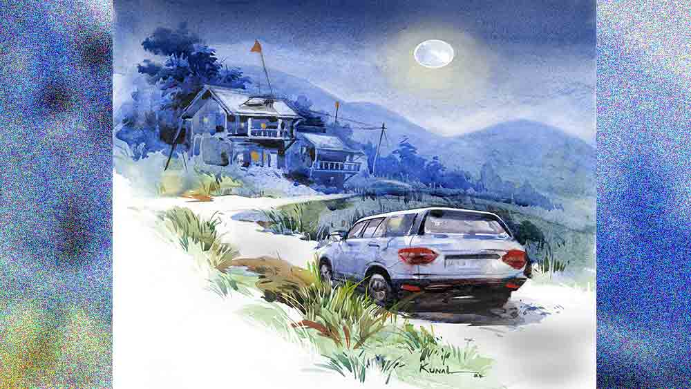

 
 <h1 align=center>অন্ধকারে একা</h1>
<h2 align=center>চঞ্চলকুমার ঘোষ</h2> ভগবানপুর থানার বড়বাবু দেবপ্রসাদ মিত্র আজ অবসর নিলেন। দুপুরে ফেয়ারওয়েলের অনুষ্ঠান হয়েছে। থানার হলঘর ভরে গিয়েছিল। দেবপ্রসাদ সারা জীবন বহু বার নিজের ক্ষমতার বাইরে গিয়েও সাধারণ মানুষের জন্য কাজ করেছেন। তাঁর গুণগ্রাহীর সংখ্যা কম নয়। অনেক জিনিস পেয়েছেন। একা মানুষ। অনুষ্ঠান শেষে সহকর্মীদের মধ্যে বেশির ভাগ বিলিয়ে দিয়েছেন। বাকি জিনিসপত্র থানার সকলে মিলে গুছিয়ে বাড়িতে পৌঁছে দিয়েছিল।

সন্ধেবেলায় বাড়ির বারান্দায় বসে ছিলেন দেবপ্রসাদ। তিনি অকৃতদার। কোনও নেশা নেই। একটাই ইচ্ছে ছিল, শহরের বাইরে খোলামেলা জায়গায় সুন্দর একটা বাড়ি করা। স্কুল-কলেজ জীবন কেটেছে দেড়খানা ঘরে। ভাগাভাগি করে পাঁচ জন মানুষ। নিজের বলে আলাদা কিছু ছিল না। তার পর চাকরি জীবনে কোয়ার্টার্স আর থানাতেই পঁচিশ বছর।

পাঁচ বছর আগে এই ভগবানপুরে বড়বাবু হয়ে এসেছিলেন। মফস্সল শহর। পাশ দিয়ে ছোট নদী বয়ে চলেছে। এখানেই এক জনের পুরনো বাগানবাড়ি ছিল। বাড়িটা পছন্দ হয়েছিল দেবপ্রসাদের। বারান্দা থেকে চোখে পড়ে পাহাড়, নদী। বাড়ির সব কিছুর দায়িত্ব নেপালি ছেলে রঘুর ওপর। চার বছর তাঁর কাছে আছে। ওকে ছাড়া দেবপ্রসাদের চলে না। 

বারান্দায় বসে পুরনো কথা ভাবছিলেন। কিছু স্মৃতি আনন্দের, কিছু বেদনার। সব মিলিয়েই জীবন। খানিক আগে সন্ধে হয়েছে। চাঁদের আলোয় হঠাৎ দেবপ্রসাদের চোখে পড়ল, একটা সাদা গাড়ি তাঁর বাড়ির সামনে দিয়ে নদীর দিকে চলে গেল। একটু অবাক লাগল দেবপ্রসাদের। শীতকালে দিনের বেলায় অনেকে নদীর ধারে বেড়াতে আসে। পিকনিক করে, সন্ধের আগেই ফিরে যায়। রাত নামতে চলেছে, এ রকম সময় কারা গেল! নিজের মনেই হাসলেন। পুলিশের চাকরি শেষ করেও পুলিশের ভাবনা গেল না।

রান্নাঘরে রঘু কাজ করছে। মনে হল এক কাপ চা দিতে বলবেন। অফিসে থাকলে এত ক্ষণ চার-পাঁচ কাপ চা হয়ে যেত। উঠে দাঁড়িয়ে রান্নাঘরের দিকে পা বাড়াতেই থমকে গেলেন। একটা নারীকণ্ঠের আর্তনাদ, “বাঁচাও! বাঁচাও!” তিরিশ বছরের পুলিশে চাকরির অভিজ্ঞতায় মুহূর্তে বুঝে নিতে অসুবিধে হল না, কোনও মেয়ে বিপদে পড়েছে। আর ওই সাদা গাড়ি করেই তাকে নিয়ে যাওয়া হয়েছে। সঙ্গে সঙ্গে চিৎকার করে উঠলেন, “রঘু! শিগগির আয়।”

শোওয়ার ঘরে রাখা টর্চটা নিয়ে বেরিয়ে এলেন। রান্নাঘর থেকে ছুটে আসে রঘু, বলে, “কী হয়েছে বাবু?”

“জানি না। আমার সঙ্গে আয়।”

বাড়ির গেটের সামনে এসে থমকে গেলেন দেবপ্রসাদ। খালি হাতে যাওয়াটা ঠিক হবে না। বেড়া দেওয়ার জন্য বাঁশের কয়েকটা টুকরো পড়ে ছিল। দু’খানা তুলে নিলেন। একটা নিজে রেখে আর একটা রঘুকে দিলেন। তাঁর বাড়ির পরে আরও তিনটে বাড়ি। একটা বাড়িতে এক বৃদ্ধ দম্পতি থাকেন, অন্য দুটো বাড়ি তালা বন্ধ। চাকরিসূত্রে লোকজন বাইরে থাকে। উল্টো দিকে একটা নার্সারি।  দিনের বেলায় মালিরা থাকে, এখন কেউ নেই। চার দিকে নির্জনতা। আশ্চর্য লাগছিল দেবপ্রসাদের। এক বার মাত্র শুনেছেন মহিলাকণ্ঠ। তার পর সব শান্ত। এ বার চোখে পড়ল, সাদা গাড়িটা দাঁড়িয়ে। কেউ নেই সেখানে। বেশ কিছুটা দূরে এক জন দাঁড়িয়ে। তার মানে, সঙ্গে আরও কেউ আছে। টর্চ নিভিয়ে চাপা গলায় দেবপ্রসাদ বললেন, “রঘু, আমার পিছনে পিছনে আয়, কেউ যেন কিছু বুঝতে না পারে।”

কয়েক পা যেতেই এ বার নজরে আসে একটা মেয়েকে দুটো ছেলে নদীর ধারে টেনে নিয়ে যাচ্ছে। মেয়েটা প্রাণপণ চেষ্টা করছে বাধা দেওয়ার। যে ছেলেটা দাঁড়িয়ে ছিল, খুব বেশি হলে দশ পা দূরে, পায়ের শব্দে মুখ ফেরায়। এখানে এই সময় কেউ আসতে পারে, তার ভাবনার মধ্যে ছিল না। সঙ্গে সঙ্গে চেঁচিয়ে উঠল, “পালা, পালা।”

তত ক্ষণে দেবপ্রসাদ ছুটতে আরম্ভ করেছেন। যে দু’টি ছেলে মেয়েটাকে টেনে নিয়ে যাচ্ছিল, তারাও এই অবস্থার জন্য প্রস্তুত ছিল না। একেবারে মুখোমুখি। দেবপ্রসাদ হাতের বাঁশটা ঘুরিয়ে সজোরে মারলেন এক জনের পিঠে। রঘু ঝাঁপিয়ে পড়ে তার উপর। অন্য জন জঙ্গলের মধ্য দিয়ে তত ক্ষণে ছুটতে আরম্ভ করেছে। মেয়েটা ছাড়া পেয়েই ছুটতে শুরু করে নদীর দিকে। দেবপ্রসাদ চেঁচিয়ে উঠলেন, “কোনও ভয় নেই, আমরা পুলিশের লোক।” 

থমকে যায় মেয়েটা। ওড়না দিয়ে মুখ বাঁধা। নিজেই ওর বাঁধন খুলে দিলেন দেবপ্রসাদ। ষোলো-সতেরো বছরের মেয়ে। ফর্সা চেহারা। ঠকঠক করে কাঁপছে। তাকে ধাতস্থ হতে একটু সময় দিলেন দেবপ্রসাদ। তার পর বললেন, “কী নাম তোমার? শয়তানগুলো তোমাকে এখানে নিয়ে এল কী করে?”

“আমার নাম দেবী। কাজ করে ফিরছিলাম। গলির মোড়ে কেউ ছিল না। হঠাৎ একটা গাড়ি আমার পাশে এসে দাঁড়াল। কিছু বোঝার আগেই এক জন দরজা খুলে বেরিয়ে এল, তার পর এক ধাক্কায় আমায় গাড়িতে তুলে নিল। হাত দিয়ে ওরা আমার মুখ চেপে ধরেছিল। এখানে এসে গাড়ি থেকে নামার সময় হাত সরিয়ে আমি চিৎকার করে উঠি। সঙ্গে সঙ্গে ওড়না দিয়ে আমার মুখ বেঁধে দেয়।”

“তুমি ছেলেগুলোকে চেনো?”

“না বাবু।”

“ঠিক আছে, চলো। এক জনকে যখন ধরেছি, বাকিগুলোকে চিনতে অসুবিধে হবে না। থানায় গিয়ে দু’ঘা দিলেই লাফাঙ্গাগিরি বন্ধ হয়ে যাবে।”

সবাই উঠে আসে। রাস্তায় রাখা গাড়ি নিয়ে পালিয়েছে দু’জন। একটা পুরনো গাড়ি কিনেছিলেন দেবপ্রসাদ। সেটাই বার করলেন। থানায় যেতে হবে। মেয়েটা কেঁদে ওঠে, “আমায় ছেড়ে দিন। থানায় যাব না।”

এই অভিজ্ঞতা দেবপ্রসাদের নতুন নয়। মেয়েদের উপর অত্যাচার হলে সমাজ তাদের দিকেই আঙুল তোলে। ভয়ে কেউ মুখ খুলতে চায় না। দেবপ্রসাদ বললেন, “আমরা যদি না আসতাম, এত ক্ষণ তোমাকে ছিঁড়ে খেত শয়তানগুলো। ওদের কোনও শাস্তি না দিলে কাল তোমাকে আবার যে তুলে নিয়ে যাবে না, সে গ্যারান্টি কে দেবে! তোমরা ভয় পাও বলে ওরা অন্যায় করতে সাহস পায়। বাড়িতে কে আছে?”

“বাবা নেই। মা-ও এক বছর হল মারা গেছে। এখন লোকের বাড়ি কাজ করি,” মুখ নিচু করে বলে মেয়েটি।

আর কিছু জিজ্ঞেস করলেন না দেবপ্রসাদ। নিজেই গাড়ি চালান। পিছনে ধরা পড়া ছেলেটাকে ধরে বসে আছে রঘু। থানা দশ মিনিটের রাস্তা। সেখানে পৌঁছে গাড়ি থেকে নামতেই কেউ বলে উঠল, “স্যর আপনি?”

মুখ ফেরালেন দেবপ্রসাদ। হেড কনস্টেবল সোমনাথ। বললেন, “তিনটে ছেলে একটা মেয়েকে জোর করে তুলে নিয়ে যাচ্ছিল। আমি একটাকে ধরেছি, গাড়িতে আছে।”

“ঠিক আছে। আপনি ভেতরে গিয়ে বসুন। আমি দেখছি।”

ভেতরে ঢুকতে ডিউটি অফিসার অবাক হয়ে বললেন, “স্যর আপনি!”

হেসে ফেললেন দেবপ্রসাদ, বললেন, “অনেক বছরের সম্পর্ক, ছাড়তে চাইলেও ছাড়তে পারছি না। একটা কেস, আসতেই হল।”

সামনে এগিয়ে বড়বাবুর ঘর। দরজার উপর এখনও তাঁর নাম। কাল হয়তো সরিয়ে নেওয়া হবে। ভিতরে ঢুকতে গিয়েও থমকে গেলেন দেবপ্রসাদ। এত দিন তাঁর ঘর ছিল। আজ তিনি বাইরের লোক। ওখানে তাঁর আর কোনও অধিকার নেই। পাশের ঘরে বসে থানার মেজবাবু পুলক রায়। যত দিন না নতুন বড়বাবু আসছে, সব দায়িত্ব পুলকের। হেড কনস্টেবল সোমনাথ মেয়েটিকে আর ধরা পড়া ছেলেটিকে নিয়ে আসে। এক পলক দু’জনকে দেখে পুলক বলন, “স্যর, আপনি বাড়ি যান। আমি কেসটা দেখছি।”

“আর এই মেয়েটা?” জিজ্ঞেস করলেন দেবপ্রসাদ।

“ওর একটা স্টেটমেন্ট নিয়ে সঙ্গে লোক দিয়ে বাড়ি পাঠিয়ে দেব।”

“আমি আই উইটনেস। তোমার কোনও অসুবিধে হবে না,” উঠে পড়লেন দেবপ্রসাদ।

 

পর দিন সকালে একটু বেলা করে উঠেছিলেন দেবপ্রসাদ। জানেন আজ আর অফিস নেই। এখনও অখণ্ড অবসর। চা খেতে খেতে কাগজের পাতা ওল্টাচ্ছিলেন, হঠাৎ কানে এল বাড়ির সামনে গাড়ির আওয়াজ। খোলা জানলা দিয়ে চোখে পড়ল মেজবাবু, মানে পুলক আসছে। ঘরে ঢুকেই চেয়ারে ধপ করে বসে পড়ল পুলক। চোখমুখ দেখে বোঝা যাচ্ছিল রীতিমতো উত্তেজিত। বলল, “কাল আপনি কাকে ধরেছেন জানেন?”

দেবপ্রসাদ গম্ভীর মুখে বললেন, “বড়লোকের বখা ছেলে, যে রেপ করার জন্য একটা মেয়েকে তুলে নিয়ে গিয়েছিল। আমি যদি ঠিক সময় না পৌঁছতাম, তা হলে আজ সকালে নদীর ধারে মেয়েটার লাশও পড়ে থাকতে পারত।”

অসহায়ের মতো পুলক বলল, “আমি সব বুঝতে পারছি স্যর। ছেলেটার নাম দীপক। ও এখানকার এমএলএ সত্যপ্রকাশবাবুর ভাইপো। সঙ্গে আরও যে দু’জন ছিল, এক জন ব্যবসায়ী সমিতির প্রেসিডেন্টের ছেলে, আর এক জন ইনকাম ট্যাক্স কমিশনারের ছেলে।”

এ বার পুলকের উত্তেজনার কারণটা বুঝতে পারলেন দেবপ্রসাদ। শান্ত ভাবে বললেন, “পুলক, যে অপরাধ করেছে, তাকে অপরাধী হিসেবেই দেখো। তুমি ছেলেটাকে কোর্টে চালান করে দাও, তার পর আইনের লড়াই হবে। শেষ পর্যন্ত কী হবে তুমিও জানো, আমিও জানি। কিন্তু তার আগে ওয়াকওভার দেবে কেন! অন্তত লোকে তো জানুক, বড় ঘরের এই সব ছেলেদের আসল চেহারাটা কেমন!” 

“সত্যপ্রকাশবাবু ফোন করেছিলেন। বললেন, অল্প বয়স, ভুল করে ফেলেছে। একটু ধমকে ছেড়ে দিন। আমিও বকে দেব। ভবিষ্যতে আর খারাপ কাজ করবে না।”

দেবপ্রসাদের মুখ রাগে লাল হয়ে উঠেছিল। এক রাশ বিরক্তি নিয়ে বললেন, “তুমি এদের ছেড়ে দিলে ওরা আরও বেশি খারাপ কাজ করবে। ভেবে নেবে পুলিশের কিছু করার ক্ষমতা নেই। তুমি রিপোর্টটা তৈরি করো, আমি দেখছি।” 

পুলক চলে যেতেই বেশ কিছু ক্ষণ চুপ করে বসে রইলেন দেবপ্রসাদ। ভাল করেই জানেন, প্রেশার নেওয়ার ক্ষমতা নেই পুলকের। যে কোনও সময় ছেলেটাকে ছেড়ে দেবে। তার আগেই যা কিছু করার, করতে হবে। 

মহিলা সমিতির প্রেসিডেন্টকে ফোন করলেন দেবপ্রসাদ। অসম্ভব সাহসী মহিলা। লোকে তাঁর সম্বন্ধে অনেক কথা বলে, কিন্তু অসহায় মেয়েদের পাশে দাঁড়িয়ে লড়াই করতে মহিলার জুড়ি নেই। ও পার থেকে অপরিচিত কণ্ঠস্বর শুনতে পেলেন দেবপ্রসাদ। উনি খুব অসুস্থ। হাসপাতালে ভর্তি। অপারেশন হবে।

ফোনটা রেখে দিলেন দেবপ্রসাদ। জানেন পুলিশের উপরমহলে যোগাযোগ করে কোনও লাভ নেই। কেউ চাইবে না এমএলএ-র সঙ্গে যুদ্ধ করতে। আগেকার দিন হলে তবু তাঁর কথা শুনত। এখন অবসরপ্রাপ্ত মানুষের কথার কোনও মূল্য নেই। বড় অসহায় লাগে।

আচমকা এক জনের কথা মনে হল। গৌরাঙ্গ দাস। সত্যপ্রকাশের বিরোধী দলের নেতা। গত বার এমএলএ সত্যপ্রকাশের কাছে হেরে গেলেও যথেষ্ট প্রভাবশালী লোক। সত্যপ্রকাশকে হেনস্থা করার সুযোগ পেলে সব শক্তি নিয়ে ঝাঁপিয়ে পড়বে। লোকটার প্রতি সামান্যতম শ্রদ্ধা না থাকলেও এখন কাঁটা দিয়ে কাঁটা তুলতে হবে। খাতা খুলে ফোন নাম্বারটা বার করলেন। ফোন করতেই ও পাশ থেকে গৌরাঙ্গ দাসের গম্ভীর কণ্ঠস্বর, “কে বলছেন?”

“স্যর, আপনাকে একটা জরুরি কথা জানানোর জন্য ফোন করছি। আমার নাম নরহরি ভৌমিক। ভগবানপুরে থাকি,” ইচ্ছে করে পরিচয় গোপন করলেন দেবপ্রসাদ, “সত্যপ্রকাশবাবুর ভাইপো আর তার দুই বন্ধু একটা মেয়েকে তুলে নিয়ে নদীর ধারে গিয়েছিল। খারাপ উদ্দেশ্য ছিল। সেই সময় কয়েক জন লোক এসে পড়েছিল। বন্ধু দু’জন পালিয়ে গেছে। সত্যপ্রকাশের ভাইপো ধরা পড়েছে। তাকে থানায় নিয়ে যাওয়া হয়েছে। আমি এক জনের কাছে খবর পেলাম, সত্যপ্রকাশ পুলিশের উপর চাপ দিচ্ছেন ভাইপোকে ছেড়ে দেওয়ার জন্য।”

“একটা মেয়েকে রেপ করবে আর পুলিশ তাকে ছেড়ে দেবে, এ কি মগের মুল্লুক না কি?” হুঙ্কার দিয়ে উঠলেন গৌরাঙ্গ দাস, “সে হারামজাদা এখন কোথায়?”

“থানায়। জানি না স্যর কোর্টে যাওয়ার আগেই তাকে ছেড়ে দেওয়া হবে কি না...” গলার স্বরটা করুণ করেন দেবপ্রসাদ।

“ঠিক আছে আমি দেখছি!” ফোনটা কেটে দিলেন গৌরাঙ্গ দাস।

দেবপ্রসাদ জানেন, এ বার বাঘ-সিংহের লড়াই শুরু হবে। আর কিছু করার নেই তাঁর। এক বার বাজার ঘুরে আসবেন। শেষ কবে বাজারে গিয়েছেন মনেই পড়ে না। বাড়ি থেকে একটু দূরে বাজার। অনেক কিছু কিনে ফেললেন। ব্যাগ-ভর্তি বাজার নিয়ে রিকশা করেই বাড়ি ফিরলেন।

ঘরে ঢুকতে রঘু বলল, “বাবু, থানা থেকে দু’বার ফোন করেছিল।”

বাজার রেখে ফোন করতেই ও পাশ থেকে পুলকের গলা পেলেন, “স্যর, মহাবিপদ হয়ে গেছে। এসপি সাহেব ফোন করেছিলেন ব্যাপারটা মিটিয়ে নিতে।”

দেবপ্রসাদ ভাল করেই জানেন, উপর থেকে ফোন এলে কিছু করার থাকে না। সবাইকে হুকুম মেনে চলতে হয়, না হলে রাতারাতি বদলি, নয়তো সাসপেন্ড। পুলকের অবস্থাটা বুঝতে পারছিলেন। বললেন, “তুমি আর কী করবে। মুচলেকা লিখে ছেড়ে দাও।”

“আমিও তাই ভেবেছিলাম। কিন্তু এর মধ্যে গৌরাঙ্গ দাস কয়েকশো লোক নিয়ে থানার সামনে জড়ো হয়েছেন। গৌরাঙ্গ দাস কী করে জানলেন বুঝতে পারছি না স্যর।”

দেবপ্রসাদ ঠান্ডা গলায় বললেন, “আরে ওরা পার্টির নেতা। নেটওয়ার্ক না থাকলে চলে! সব জায়গায় ওদের লোক আছে, থানাতেও আছে।” 

“আপনিও চলে গেলেন, তার পরই এমন ঝঞ্ঝাট!” 

“পুলিশের চাকরি করছ, এটুকু ঝঞ্ঝাট মাথায় নিতেই হবে। ঠিক আছে। তোমাকে পরে ফোন করব।”

কিছু ক্ষণ বিশ্রাম নিয়ে ফের বেরিয়ে পড়লেন দেবপ্রসাদ। আগের দিন যেখানে ঘটনাটা ঘটেছে, সেখানে এক বার ঘুরে আসবেন।

দিনের বেলায় চার দিকটা স্পষ্ট। লোকজন নেই। নেমে এলেন নদীর ধারে। গতকাল ঠিক যেখানে ঘটনাটা ঘটেছিল, সেখানে একটা মানিব্যাগ পড়ে আছে। তাড়াতাড়ি কুড়িয়ে নিলেন। ভিতরে অল্প কিছু টাকা, ড্রাইভিং লাইসেন্স, নাম লেখা। ঠোঁটের কোণে হাসি ফুটে উঠল দেবপ্রসাদের। দীপকের বিরুদ্ধে এটাই মোক্ষম প্রমাণ। যথাস্থানে পৌঁছে দিতে হবে এই জিনিসটাকে। এতগুলো বছর ধরে পুলিশের চাকরি করে নানা গোপন গলিঘুঁজি জানা হয়েছে তাঁর। পারিপার্শ্বিক যখন সোজা আঙুল ভেঙে দিতে চেষ্টা করে, তখন আঙুল বাঁকানো ছাড়া উপায় কী!

দেবপ্রসাদ খবরটা পেলেন বিকেলে। থানার সামনে পুলিশ লাঠিচার্জ করে গৌরাঙ্গ দাসের লোকজনকে সরিয়ে দিয়েছে। তত ক্ষণে মিডিয়ার লোকজন এসেছিল। পুলিশের কিছু করার ছিল না। এমএলএ-র ভাইপোকে কোর্টে নিয়ে যেতে হয়েছে। সাত দিনের জেল হাজত দিয়েছেন জজ।

দেবপ্রসাদ এক বার ভাবলেন, ফোন করবেন পুলককে। কিন্তু ডায়াল করতে গিয়েও কী ভেবে থেমে গেলেন। মেয়েটিকে উদ্ধার করা এবং এক জন দুষ্কৃতীকে ধরে থানায় পৌঁছে দেওয়ার পরই তাঁর দায়িত্ব শেষ। তিনি আর এই কেসের কোথাও নেই। কথাগুলো ভাবতে ভাবতে আপনমনেই হাসলেন দেবপ্রসাদ।